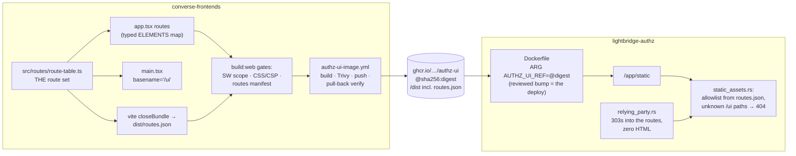
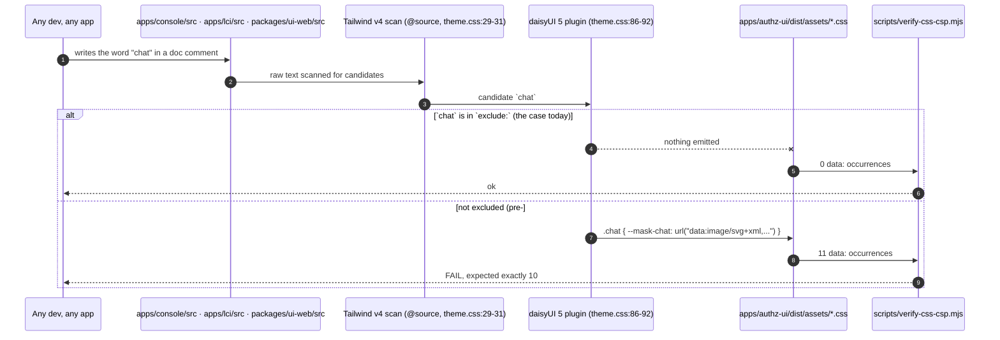

# authz-idp hosted UI — the device-pairing human plane

Vite + React + TypeScript static build, served same-origin by `authz-idp` under the `/ui` path
prefix (ADR-0021 Decisions 1 and 10 --
`docs/adr/0021-browser-sso-hosted-login-page-and-session-cookie.md`, in `lightbridge-authz`).
This project builds to static assets with Vite `base: "/ui/"`; `authz-idp`'s Rust router serves
them via `tower-http`'s `fs` feature, nested at `/ui`, never at the server root and never a
separate origin (`crates/lightbridge-authz-rest/src/static_assets.rs`) -- see that ADR's
Decision 1 for why same-origin is load-bearing for the `__Host-` session cookie, and Decision 10
for why `/ui` specifically (`GET /` stays `authz-idp`'s own API-welcome-JSON route; the two never
collide).

Lives in `converse-frontends` as `apps/authz-ui`; consumed by `lightbridge-authz`'s `authz-idp` as
a built `dist/` served under `/ui`.

**This is no longer a scaffold.** It renders `lightbridge-authz`'s live RFC 8628 device-pairing
flow end to end (`lightbridge-authz` #478, converse-frontends#409): a code entered or prefilled at
`/device`, confirmed at `/device/confirm` against a cookie-bound server context, landing on
`/device/success` or `/error`. The SPA makes **zero** auth decisions of its own -- every route
either renders static copy, submits a native form POST to one of `authz-idp`'s protocol endpoints,
or fetches one cookie-bound context and renders exactly what the server returns. The interactive
sign-in form itself (`GET /authorize`, the RP leg to Keycloak, session-cookie issuance) is still
`lightbridge-authz`'s own work (#424, #425, #441, #443) and the `/` route still shows placeholder
copy until that login chooser ships -- see "Current routes" below.

## Current routes

The route set is declared **once**, in `src/routes/route-table.ts`, as `ROUTE_PATHS` (exact
paths, no `:params`, no `*` wildcards) plus `ROUTER_BASENAME` (`/ui`). Three consumers read that
one file and no other:

1. `src/app.tsx` -- renders one `<Route>` per entry, keyed through a `Record<RoutePath,
ReactElement>` (`ELEMENTS`) so a path added to the table with no matching element is a `tsc`
   error, not a blank screen. `route-table.test.ts` asserts the reverse direction (no `ELEMENTS`
   entry with no path) at runtime.
2. `src/main.tsx` -- `<BrowserRouter basename={ROUTER_BASENAME}>`.
3. `vite.config.ts`'s `authz-ui-routes-manifest` plugin -- emits `dist/routes.json` from the same
   table at `closeBundle`, **generated, never hand-listed**.

| Path              | Renders                                                                                                                                                                                                                                                        |
| ----------------- | -------------------------------------------------------------------------------------------------------------------------------------------------------------------------------------------------------------------------------------------------------------- |
| `/`               | `PlaceholderPage` -- kept, not redirected: a visitor who isn't mid device-pairing must not be dropped into a device flow. Placeholder copy is honest here, not stale -- it stays until `lightbridge-authz`'s login chooser (#478) ships.                       |
| `/device`         | `DeviceCodeEntry` -- enter/confirm a user code; `?user_code=` (RFC 8628's `verification_uri_complete` prefill) is sanitised before it ever reaches a DOM sink.                                                                                                 |
| `/device/invalid` | Same entry form with an inline "that code cannot be used" error -- the SPA's own uniform landing for an unknown/expired/consumed code.                                                                                                                         |
| `/device/confirm` | Fetches the cookie-bound `GET /device/verify/context`; renders whatever the server returns (loading/ready/error) and submits the continue action as a native form POST. A `404` means "no live confirmation for this browser" and redirects back to `/device`. |
| `/device/success` | Static terminal state -- "you can return to your application."                                                                                                                                                                                                 |
| `/error`          | Static uniform failure landing -- every former RP-leg `generic_failure` redirects here; the distinguishing reason lives in server logs, never in this page's copy.                                                                                             |

There is **no catch-all route**. `authz-idp` is the 404 now (lightbridge-authz#598): it only
serves `index.html` for a path present in `dist/routes.json`, so an unknown `/ui` path never
reaches this router at all. A `<Route path="*">` here would be dead code masking a manifest bug in
`vite dev` (see "Dev loop" below) until it surfaced in production.

## The manifest is the cross-repo allowlist contract

`dist/routes.json` (shape: `{ version: 1, basename: "/ui", routes: [...] }`) is not a debugging
artifact -- `authz-idp`'s `static_assets.rs` reads it **at startup** and 404s every `/ui` path not
listed in it. `scripts/verify-routes-manifest.mjs` runs as part of `build:web` and asserts, against
the real `dist/` output: the manifest parses, `version === 1`, `basename === "/ui"`, every route is
non-empty/prefix-free/contains no `:`/`*`, `/` is present (the fail-closed floor Rust degrades to),
no duplicates, and `dist/index.html` actually references `${basename}/assets/` (catching a `base`
regression the other checks can't see). `.github/workflows/authz-ui-image.yml` re-asserts
`dist/routes.json` exists both **before the image is pushed** ("Assert content-hashed output") and
**against the pushed image itself** by pulling it back by digest and listing its layers ("Verify
the pushed image contains the bundle") -- a manifest that only existed on the runner's disk would
still fail that second check.

**Adding, removing, or renaming a route is therefore a two-repo change, not a one-line edit here:**

1. Edit `ROUTE_PATHS`/`ELEMENTS` here (`route-table.ts` + `app.tsx`), add the page component and
   its `pages-stories/` story (see the `console-ui` skill's CSP-safe-sections note -- stories land
   **before** routes, owner directive).
2. Merge here, let `authz-ui-image.yml` publish a new digest (feature branches publish real
   `sha-<gitsha>` images too -- see "Published artifact" below -- so the cross-repo change is
   verifiable before either side merges).
3. In `lightbridge-authz`: bump the `AUTHZ_UI_REF` digest pin, and land any Rust-side change the
   new route needs (e.g. a redirect target, a new protocol endpoint) in the **same** review pass.

A route hand-added to `app.tsx` alone works in `vite dev` (no allowlist there) and 404s in
production the moment `authz-idp` reads a manifest that never heard about it -- that drift is
exactly what generating `dist/routes.json` from `route-table.ts` prevents.

The whole supply chain, from the one source of truth to what a browser is served:



## Server-contract constants

`src/routes/paths.ts` holds `authz-idp`'s **origin-root** protocol endpoints -- deliberately NOT
under `/ui`, since `/ui` is the human plane and these are the protocol plane:

- `DEVICE_VERIFY_SUBMIT_PATH` = `/device/verify` -- the code-entry form's native `action`.
- `DEVICE_VERIFY_CONTINUE_PATH` = `/device/verify/continue` -- the confirm page's native `action`.
- `DEVICE_VERIFY_CONTEXT_PATH` = `/device/verify/context` -- the cookie-bound `GET` the confirm
  page fetches (`credentials: 'same-origin'`) to render `user_code`/`client_id`.

`lightbridge-authz`'s config validation pins `/device/verify` as an exact path (the
`device_verification_uri` check in its `lib.rs`), so it can never move under the `/ui` prefix.
Forms POST to these paths natively -- no `fetch`, no client-side redirect logic, no auth decision
made in this SPA.

## CSP posture

`static_assets.rs` serves every `/ui` response with `Content-Security-Policy: default-src 'self';
frame-ancestors 'none'` -- no `script-src`, no `'unsafe-inline'`, no nonce or hash, and (owner
decision, converse-frontends#407) **no `data:` carve-out**. That single strict `default-src`
governs scripts, styles, and every URL scheme, which rules out inline `<script>`, inline
`style=`, and any `data:`-URI-backed rule that is actually _applied_ to a rendered element (CSP
blocks the fetch of an applied `data:` background even when its computed size is `0%` -- #407's
own evidence). daisyUI's component classes (`alert`/`btn`/`badge`/`checkbox`/`radio`/`toggle`/
`menu`/`loading`/`tooltip`/`card`/`input`/`select`/`table`/`tabs`/`skeleton`) are the historical
carrier: each composites a `--fx-noise` `data:` background in, so they -- and every
`packages/ui-web` component that renders one -- are **unusable anywhere in this app's render
tree**, including inside an imported `ui-web` section. Only native elements plus semantic tokens
(`bg-surface`, `text-soft`, `border-border`, ...) are allowed.

Since converse-frontends#443 the `data:` URIs are also switched off at the SOURCE:
`packages/ui-web/src/theme.css`'s `@plugin 'daisyui'` block carries
`exclude: chat, loading, mask, mockup, svg, tooltip` -- the six (and only six) daisy parts whose
CSS contains a `data:` URI, none of them used anywhere in this workspace. `svg` is the base that
declares `:root{--fx-noise:url("data:...")}`; without it the noise layer is
invalid-at-computed-value-time, i.e. `none` -- which is what both themes already rendered, since
each sets `--noise: 0` (ADR 0008). The built login bundle therefore carries **zero** `data:`
occurrences, and that is what `verify-css-csp.mjs` asserts. The class ban above is unchanged: it
is #407's owner posture and the defence-in-depth layer, and reopening it is a separate decision.

**Why source-side and not a pinned count.** Tailwind v4's scanner token-matches raw text, and
`theme.css` `@source`s `packages/ui-web/src`, `apps/console/src` and `apps/lci/src` for every
consumer of the stylesheet -- this app inherits all three even though it has no `@source` line of
its own. So an ordinary English word in an ordinary code comment in another app compiles a daisy
component, and its `data:` URI, into the login bundle. That is exactly what happened: #459's
`apps/console/src/dashboards/derived-metrics.ts` doc comment ("Total chat completions count")
pulled `.chat` and its `--mask-chat` `data:` URI in, moved the pinned count 10 -> 11, and turned
`main`'s `test` job and the `authz-ui-image` workflow red on a comment (#443). A count that is a
function of unrelated prose cannot be a gate; a daisy config that emits nothing can.



```mermaid
stateDiagram-v2
    [*] --> Excluded: theme.css `exclude:` names all six data:-emitting daisy parts
    Excluded --> CleanBundle: vite build
    CleanBundle --> GateGreen: verify-css-csp.mjs sees 0 data:
    GateGreen --> [*]
    Excluded --> Reintroduced: a daisy upgrade adds a 7th data: part,\nor our own CSS inlines a data: URI
    Reintroduced --> GateRed: verify-css-csp.mjs names the selector + property
    GateRed --> Excluded: add it to `exclude:` (after checking console/lci don't render it)
    GateRed --> SelfHosted: our own asset -> ship it under /ui/assets, never data:
    SelfHosted --> CleanBundle
    note right of GateRed
      Unreachable by design: "prose in another app moved the number".
      The gate no longer counts, so an unrelated comment cannot enter this state.
    end note
```

Five gates enforce this so a regression fails CI instead of surfacing as a runtime CSP violation:

| Gate                                                                                   | Scope                                                                                                           | What it catches                                                                                                                                                                                                                                                         |
| -------------------------------------------------------------------------------------- | --------------------------------------------------------------------------------------------------------------- | ----------------------------------------------------------------------------------------------------------------------------------------------------------------------------------------------------------------------------------------------------------------------- |
| `src/no-daisy-component-classes.test.ts`                                               | this app's own `src/**/*.tsx`                                                                                   | a forbidden class literal in a `className=` here                                                                                                                                                                                                                        |
| `packages/ui-web/src/csp-safe-sections.test.ts` + `section-class-audit.test.ts`'s pins | the four CSP-safe sections (`auth-panel-shell`, `device-code-entry`, `device-confirmation`, `auth-error-panel`) | the first: a forbidden class, or an import reaching outside `lib/`/`cn`/a sibling CSP-safe section (i.e. a pull-in of a daisy-backed component). The second: pinned hand-written-utility/daisy-token counts per section, so an unnoticed class addition shows as a diff |
| `src/csp-safe-render.test.tsx`                                                         | every route element, rendered via `@testing-library/react`                                                      | a forbidden class contributed **at render time** by an imported `ui-web` section -- a source scan can't see this; DOM inspection can                                                                                                                                    |
| `scripts/verify-css-csp.mjs`                                                           | the real built `dist/assets/*.css`                                                                              | zero external `url()` references and **zero** `data:` occurrences (#443 -- the six data:-emitting daisy parts are excluded at source in `theme.css`, so this is a config property, not a pinned count). A failure names the selector and property that carries it       |
| `scripts/verify-service-worker-scope.mjs`                                              | `src/sw.ts` source + built `dist/sw.js`                                                                         | a different concern riding the same `static_assets.rs` infrastructure -- see "PWA / service worker" below, not a CSP/daisy check itself                                                                                                                                 |

`scripts/verify-routes-manifest.mjs` (above, "The manifest is the cross-repo allowlist contract")
is a sixth build-time gate, on the routes contract rather than the CSP.

## Dev loop

```bash
pnpm install
pnpm --filter authz-ui dev          # http://localhost:5173/ui/
pnpm --filter authz-ui build:web    # tsc (app) && tsc (sw) && vite build &&
                                     # verify-service-worker-scope.mjs && verify-css-csp.mjs &&
                                     # verify-routes-manifest.mjs -- the full production gate
pnpm --filter authz-ui test         # vitest run
pnpm --filter authz-ui typecheck    # tsc --noEmit for both the app and the service worker
```

**`vite dev` has no route allowlist.** `route-table.ts` drives `app.tsx`/`main.tsx` directly in
dev, so every path in `ROUTE_PATHS` renders locally regardless of `dist/routes.json` -- that file
only exists after a `build:web`, and only `authz-idp` (never the dev server) enforces it. A route
that works under `pnpm --filter authz-ui dev` is not yet proven to work in production; only
`build:web`'s `verify-routes-manifest.mjs` (and, ultimately, a real `authz-idp` serving the built
`dist/`) proves that. The service worker is also disabled in dev (`devOptions.enabled: false` in
`vite.config.ts`) for the same reason -- only ever verify it against a real production build.

There is no per-app `lint`/`format`/`check` script -- Biome is gone. Formatting and linting for
this app run through the repo root's `pnpm lint` (ESLint 9 flat config + Prettier), the same as
every other workspace here.

`pnpm --filter authz-ui build:web` is what CI runs (`turbo run build:web` via the root `pnpm
build`, `.github/workflows/test.yml`'s `build-web` job) and what `lightbridge-authz`'s `authz-idp`
container image serves the resulting `dist/` from.

## Published artifact (the cross-repo contract)

`.github/workflows/authz-ui-image.yml` publishes this app's `dist/` as an **assets-only** OCI image:

|                                  |                                                                                                        |
| -------------------------------- | ------------------------------------------------------------------------------------------------------ |
| Package                          | `ghcr.io/adorsys-gis/converse-frontends/authz-ui`                                                      |
| Base                             | `scratch` — no shell, no runtime, nothing but the bundle (`apps/authz-ui/Containerfile`)               |
| **Bundle path inside the image** | **`/dist`** — `/dist/index.html`, `/dist/assets/*-<hash>.{js,css}`, `/dist/sw.js`, `/dist/routes.json` |
| Tags                             | `sha-<gitsha>` (every build), `<branch>` (branch pushes), `latest` (default branch only)               |
| Platform                         | `linux/amd64`, single-arch                                                                             |

`lightbridge-authz` consumes it as a build stage at a **digest pin** (never `latest`):

```dockerfile
ARG AUTHZ_UI_REF=ghcr.io/adorsys-gis/converse-frontends/authz-ui@sha256:...
FROM --platform=linux/amd64 ${AUTHZ_UI_REF} AS frontend
COPY --from=frontend /dist /app/static
```

`/dist` is therefore a contract, not an implementation detail — see `apps/authz-ui/Containerfile`.
Changing it breaks `lightbridge-authz`'s container build. The pin lives in that repo's `Dockerfile`
and is bumped there (ADORSYS-GIS/lightbridge-authz#591); publishing an image here never changes
what that repo deploys.

**Feature branches publish images on purpose.** Pushing to a branch matching `feat/authz-ui-**`
produces a real `sha-<gitsha>` image, so a cross-repo consumer change can be verified before either
side merges. `latest` is never produced off a feature branch.

## Stack

- **React 19 + TypeScript**, routed with **react-router** against the single route table above
  (`src/routes/route-table.ts`) -- see "Current routes".
- **One style pipeline**: this app's entire CSS entry (`src/index.css`) is a single
  `@import '@lightbridge/ui-web/styles.css'`. `packages/ui-web/src/theme.css` carries no `@source`
  line for this app -- Tailwind v4's automatic content detection, rooted at this app's own Vite
  project root (which contains `src`), already makes this app's class usage visible to that one
  Tailwind pass when this app's own build runs it (verified against a real build; probed
  2026-08-31 -- see `theme.css`'s comment). There is no second `content`/`@source` configuration to
  keep in sync. Token utilities only (`bg-surface`, `text-soft`, `border-border`, ...), never a
  daisyUI component class -- see "CSP posture" above and `src/components/notice-panel.tsx`'s own
  comment for why. Headless UI, `cva`, `clsx`, and `tailwind-merge` are dropped in favour of ADR
  0010's primitive stack (Base UI + daisyUI + cmdk + Floating UI) and `@lightbridge/ui-web`'s own
  `cn()`.
- **`vite-plugin-pwa`**, `injectManifest` strategy with a hand-written `src/sw.ts` -- see "PWA /
  service worker" below for the full reasoning.

## Theme

`black` (dark) is the default theme, `wireframe` (light) is honored when explicitly chosen or
implied by `prefers-color-scheme` under a `'system'` preference -- the same resolution order as
the console (ADR 0010 Decision 5): stored preference -> `prefers-color-scheme` -> `black`.

`data-theme` is set **statically** in `index.html` (`<html lang="en" data-theme="black">`), not by
an inline bootstrap script, and `src/main.tsx` calls `applyThemePreference(readStoredThemePreference()
?? 'system')` as its first statement, before `createRoot`.

**Why not an inline script, the way the console does it:** the CSP described above forbids inline
script (no nonce or hash), so the console's `CONSOLE_THEME_NO_FLASH_SCRIPT` (injected via Next's
`dangerouslySetInnerHTML`) cannot be ported to this surface as-is.

**The residual flash case:** because `black` is the default and is in the markup before the first
byte of CSS is parsed, the common case has zero flash. The one remaining gap is a user who has
explicitly stored `wireframe` (or is on `'system'` with a light OS setting): the module script
that corrects `data-theme` is deferred, so that visitor can see a black frame briefly before the
bundle executes. Closing that gap needs a CSP `script-src` hash coordinated with the Rust side
(`static_assets.rs`); that is cross-repo and out of this story's scope.

## `browserslist` is carried but inert here

The `browserslist` block is copied verbatim from `apps/console/package.json` for parity and as
insurance against a future Lightning CSS transformer, but Vite does not read it today: Vite uses
`build.target` (default `baseline-widely-available`), its default CSS minifier is esbuild (not
Lightning CSS), and Tailwind v4's own optimizer pins its targets internally (chrome 111 / firefox
128 / safari 16.4 -- all `:has()`-native). The real regression gate for browser-target drift is
the `:has(` selector assertion in this app's build verification, not this block.

## PWA / service worker

`vite-plugin-pwa`, `injectManifest` strategy with a hand-written `src/sw.ts` -- see that file's own
doc comment for the full reasoning. Short version: this page is served from the issuer origin, so
a service worker here controls `/oauth2/*`, `/.well-known/*`, `/authorize`, and `/healthz` too,
not just this page. `src/sw.ts` precaches ONLY the content-hashed `assets/**` bundle and registers
no other route (no `navigateFallback`, no runtime caching) -- deliberately stricter than the more
common `generateSW` + `navigateFallbackDenylist` pattern, because `navigateFallback` is
fundamentally a precache-backed (cache-first) mechanism for whatever URL it targets, which would
mean precaching `index.html` and directly contradicting Decision 10's `no-cache` posture for it.
`scripts/verify-service-worker-scope.mjs` (see "CSP posture" above) is the mechanical gate for this
-- it whitelists `src/sw.ts`'s source down to the one allowed import and the one allowed call, and
asserts every entry the built `dist/sw.js` precaches lives under `assets/`.

## Known cost

`packages/ui-web/src/theme.css`'s Tailwind pass also auto-detects `packages/ui-web/src` itself and
carries an explicit `@source` line for `apps/console/src` (neither build's automatic detection
reaches those, for reasons documented in `theme.css`'s own comment). This app has no analogous
line and does not need one -- see "Stack" above -- but this app's build is still the single
Tailwind generator that also emits `ui-web`'s own utilities into its output, since it imports
`theme.css` directly. That means this app's built CSS includes utilities it never uses -- the
price of "one import, one generator" instead of a per-consumer content list. A prior revision of
this file also carried an `@source '../../../apps/authz-ui/src'` line; a probe (2026-08-31) proved
it redundant for this app's own build and it was removed -- its only observable effect had been
leaking authz-ui-only utilities (e.g. `min-h-dvh`) into the console's and `ui-web`'s Storybook CSS
bundles, not helping this app's own compilation. The measured `dist/assets/*.css` size is recorded
in this story's PR description.
