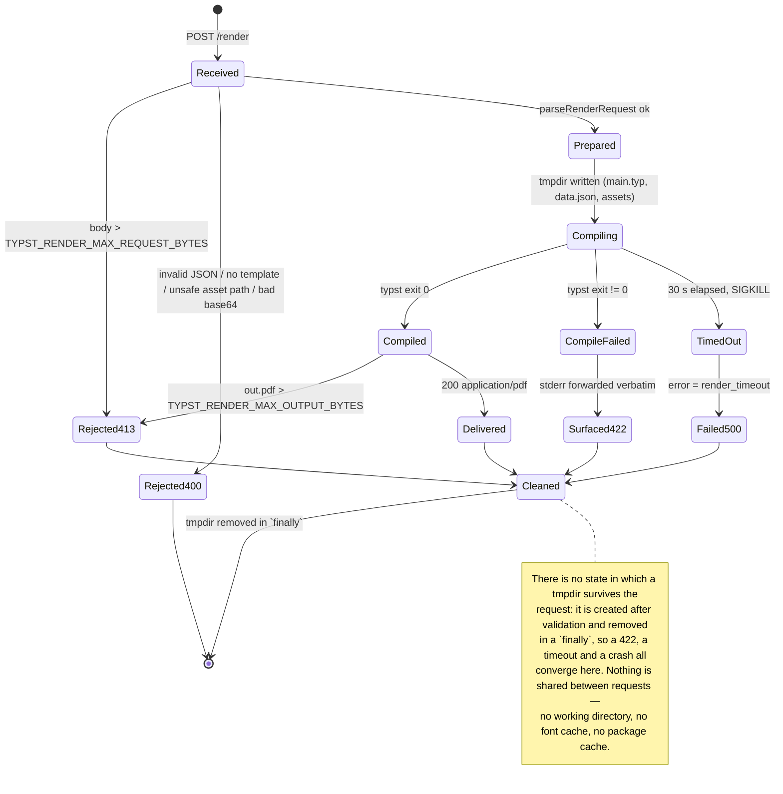

# apps/typst-render

A ~400-line HTTP shim around the [Typst](https://typst.app) compiler. It takes a Typst template, a
JSON data file and a bag of assets, and gives back a PDF.

It exists because of a binding owner ruling on
[#453](https://github.com/ADORSYS-GIS/converse-frontends/issues/453): the console's report export
engine is **Typst in a sidecar**. The console renders each dashboard panel to standalone SVG,
picks the `.typ` template that mirrors the route path, and POSTs the three of them here. That
keeps the console image free of a PDF toolchain — no Typst binary, no Chromium — which is an
explicit acceptance criterion of that story.

This is **part 1 of #453**: the service only. The console-side pipeline (`/api/reports/page`,
per-route `.typ` templates, the `ReportExportDialog` wiring, deleting the hand-rolled
`pdf-document.ts`) is a later PR, and the Helm wiring is ai-helm-values story B2.

> **Where this lives.** #453 floated a separate `lightbridge-typst-render` repo as an open point.
> It is here instead: the only consumer is `apps/console`, the wire contract changes with the
> console's export route, and a second repo would mean a second release train for a service with
> no dependencies and two endpoints. Recorded so the decision is not silently inherited.

---

## Request contract

### `POST /render`

Request body — `application/json`:

| Field      | Type                 | Required | Meaning                                                                        |
| ---------- | -------------------- | -------- | ------------------------------------------------------------------------------ |
| `template` | `string`             | yes      | Typst source. Written as `main.typ` at the render root.                        |
| `data`     | `object`             | no       | Written verbatim as `data.json` next to the template. Defaults to `{}`.        |
| `assets`   | `{ [path]: base64 }` | no       | SVG/PNG/font files, written at `path` under the render root. Defaults to `{}`. |

The service then runs, with the render root as its working directory:

```
typst compile --root . --input data=data.json \
  --ignore-system-fonts --font-path . \
  --package-path packages --package-cache-path packages \
  main.typ out.pdf
```

So `sys.inputs.data` is the **filename**, not the payload — a template starts with:

```typst
#let report = json(sys.inputs.at("data"))
= #report.title
#image("brand/logo.svg", width: 48pt)
```

Responses:

| Status | Content type       | When                                                                                  |
| ------ | ------------------ | ------------------------------------------------------------------------------------- |
| `200`  | `application/pdf`  | Rendered. `content-disposition: inline; filename="report.pdf"`.                       |
| `400`  | `application/json` | Malformed JSON, missing/empty `template`, bad base64, unsafe asset path.              |
| `405`  | `application/json` | Wrong method on a known route (`allow` header names the right one).                   |
| `413`  | `application/json` | Request body over `TYPST_RENDER_MAX_REQUEST_BYTES`, or PDF over the output cap.       |
| `422`  | `application/json` | Typst exited non-zero. `detail` is its **stderr verbatim**, line and column included. |
| `500`  | `application/json` | Compile exceeded the timeout (`render_timeout`), or an unexpected failure.            |

Error bodies are `{ "error": "<machine code>", "detail": "<human text>" }`. The 422 detail is
deliberately not sanitised: #453 calls out swallowing a Typst compile error into a generic 500 as
a failure mode, and the caller needs the line number to name the offending template.

### `GET /healthz`

Executes `typst --version`, so it answers "can this container render" rather than "is a socket
open" — the failure a sidecar assembled by copying a binary between base images is most likely to
have.

- `200` → `{"status":"ok","typst":"typst 0.15.1 (unknown commit)"}`
- `503` → `{"status":"unhealthy","typst":"<why>"}`

---

## How a render actually runs

```mermaid
sequenceDiagram
    autonumber
    participant Console as apps/console<br/>export route
    participant HTTP as server.ts<br/>createRenderServer
    participant Parse as render-request.ts<br/>parseRenderRequest
    participant Render as render.ts<br/>renderPdf
    participant FS as per-request tmpdir<br/>typst-render-XXXX/
    participant Typst as typst CLI<br/>(pinned 0.15.1)

    Console->>HTTP: POST /render {template, data, assets}
    Note over HTTP: body read with a running byte count;<br/>over the cap -> pause + 413, never buffered whole
    HTTP->>Parse: JSON.parse(body)
    Parse-->>HTTP: 400 bad_request (unsafe asset name, bad base64, no template)
    Parse->>Render: RenderRequest {template, data, assets: Map}
    Render->>FS: mkdtemp() + main.typ + data.json + assets/**
    Render->>Typst: compile --root . --input data=data.json ... main.typ out.pdf
    Typst-->>Render: exit 0 + out.pdf
    Typst-->>Render: exit != 0 + stderr
    Note over Render,Typst: no exit at all within 30 s -> SIGKILL
    Render->>FS: rm -rf tmpdir (finally — every path, including timeout)
    Render-->>HTTP: RenderOutcome (pdf | compile-error | timeout | output-too-large)
    HTTP-->>Console: 200 application/pdf
    HTTP-->>Console: 422 {error:"compile_error", detail:"<typst stderr>"}
    HTTP-->>Console: 500 {error:"render_timeout"} / 413 payload_too_large
```



---

## Guarantees, and the one that is a deployment property

**Enforced by this process:**

- **Per-request isolation.** One `mkdtemp` per render, removed in a `finally`. Two concurrent
  renders cannot see each other's files. Tested by counting the temp root before and after a
  successful and a failing render.
- **No path traversal.** Asset names are validated as relative POSIX paths (no `..`, no absolute
  or Windows/UNC shapes, no NUL, not one of the three names the service owns) and re-checked
  against the resolved root before any write.
- **Typst cannot read outside the render root**, because `--root .` confines it there. Covered by
  a test that tries `#read("/etc/hosts")`.
- **Bounded time and size.** 30 s wall clock then SIGKILL; 8 MiB request; 32 MiB output.
- **Reproducible typography.** `--ignore-system-fonts` means only Typst's embedded fonts and
  fonts shipped as assets are used, so a render does not silently depend on what the host has
  installed.

**Not enforced by this process — package imports and offline-ness.** `--package-path` and
`--package-cache-path` point at an empty per-request directory, so nothing is pre-cached, but
Typst will still reach the `@preview` registry over the network **if the host has egress**. This
was verified directly rather than assumed: on a laptop with internet, `#import "@preview/cetz"`
downloads and compiles. **Package imports are therefore unsupported, and the sidecar is expected
to run with no egress** (a `NetworkPolicy` in the ai-helm-values B2 story). What is guaranteed
here is the failure _shape_: an unresolvable package surfaces as a `422` naming the package, never
as a 30 s hang. Templates must be self-contained.

---

## Configuration

| Variable                         | Default             | Notes                                             |
| -------------------------------- | ------------------- | ------------------------------------------------- |
| `TYPST_RENDER_PORT`              | `8080`              | Validated at boot; a bad value fails the process. |
| `TYPST_RENDER_HOST`              | `0.0.0.0`           |                                                   |
| `TYPST_BIN`                      | `typst`             | `/usr/local/bin/typst` in the image.              |
| `TYPST_RENDER_TIMEOUT_MS`        | `30000`             | Wall clock per compile, then SIGKILL.             |
| `TYPST_RENDER_MAX_REQUEST_BYTES` | `8388608` (8 MiB)   | Enforced while reading, not after.                |
| `TYPST_RENDER_MAX_OUTPUT_BYTES`  | `33554432` (32 MiB) | An over-cap PDF is refused, not streamed.         |

---

## Build, run, verify

```sh
pnpm --filter typst-render exec tsc --noEmit -p tsconfig.json   # typecheck
pnpm --filter typst-render test                                  # vitest, incl. the golden render
pnpm turbo run build:web --filter=typst-render                   # tsc -> dist/

docker build -f apps/typst-render/Dockerfile -t typst-render:local .   # context = repo root
docker run --rm -p 8080:8080 typst-render:local
curl -s localhost:8080/healthz
```

The test suite shells out to the real compiler. Without a `typst` on `PATH` the golden cases
**skip with a message**, they do not silently pass — install it with `brew install typst`, or lift
the pinned binary out of `ghcr.io/typst/typst:0.15.1`. CI (`.github/workflows/test.yml` and
`typst-render-image.yml`) installs it from that exact pinned image, so CI tests the Typst that
actually ships.

### Local development alongside the console

`compose.yml` at the repo root carries a `typst-render` service built from this Dockerfile,
published on `localhost:8080`. Without it running, the console's export route can still serve
`format=html` and `format=csv`; only `format=pdf` needs this service, and it must surface a clear
error rather than falling back to a chartless PDF (#453).

---

## Why plain `node:http`, and no dependencies

Two routes, one content type in, two out. The runtime image ships `dist/` with **no
`node_modules` at all** — which is only possible because nothing here is imported from npm, and
which is why `npm`/`npx` are deleted from the base image. Every import is either `node:*` or a
relative `./*.js`.

## Tracing: log correlation, not spans

This service runs **no OpenTelemetry SDK**, unlike its `apps/console` and `apps/lci` siblings
(converse-frontends#443). `@opentelemetry/sdk-node` plus an exporter is roughly forty packages;
shipping them here means reintroducing `node_modules` to the image and re-expanding exactly the
surface the section above exists to shrink — in the one container that executes request-supplied
document programs. That is a redesign of this service, not a bonus feature.

What happens instead: the console's `POST /render` already carries a W3C `traceparent` (its undici
instrumentation injects one into every outbound `fetch`), and its CLIENT span for the call is in
Tempo regardless of what this process does. This service parses that header — a ~40-line anchored,
hex-only reader in `src/trace-context.ts`, so a malformed or hostile value degrades to "no ids in
the log line", never to a thrown error or an injected second line — and prints the ids with each
render:

```
[typst-render] render pdf in 83ms trace=ecf8e109f0ea249b4eca30a565f35fb7 span=a536db1c81253283
```

One line per render, including the failures (`bad_request`, `payload_too_large`, `compile_error`,
`render_timeout`), because the requests that fail are the ones an operator is holding a trace id to
look up. There is no span for `typst compile` itself, so the console's client span stays a leaf in
the trace — named honestly rather than sold as instrumentation. See
[`docs/knowledge/observability.md`](../../docs/knowledge/observability.md).

## Image

`ghcr.io/adorsys-gis/converse-frontends/typst-render` — same registry and naming pattern as the
sibling `.../console` and `.../lci` packages, published by
`.github/workflows/typst-render-image.yml` on merge to `main` (tags: `sha-<gitsha>`, the branch
name, and `latest`). Pin `sha-<gitsha>`; `latest` moves on every merge.

The Dockerfile is multi-stage: `ghcr.io/typst/typst:0.15.1` (pinned; tag verified with
`docker manifest inspect`, and note the newer tags carry **no** `v` prefix) contributes only its
`typst` binary, which is statically linked and therefore runs unchanged on the `node:22`
bookworm-slim glibc base the console and lci use. A `RUN typst --version` in the runtime stage
turns a future dynamically-linked release into a failed build rather than a broken container.
