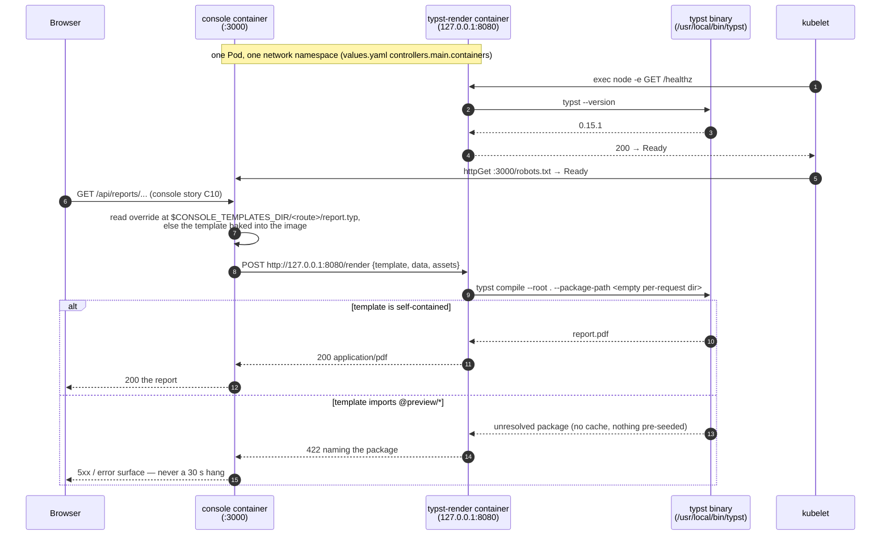
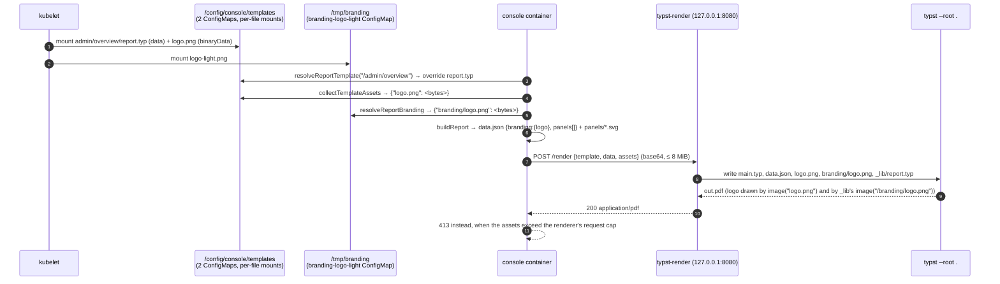
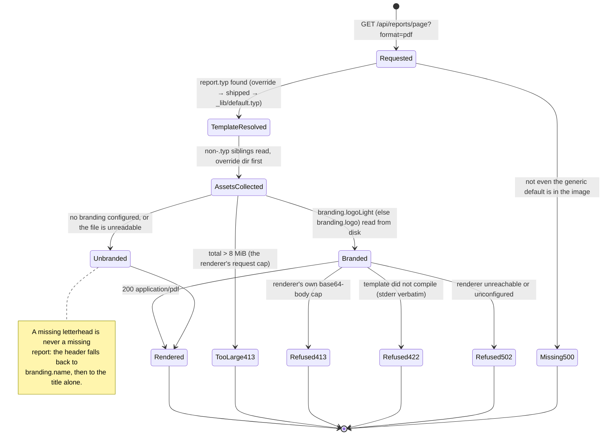
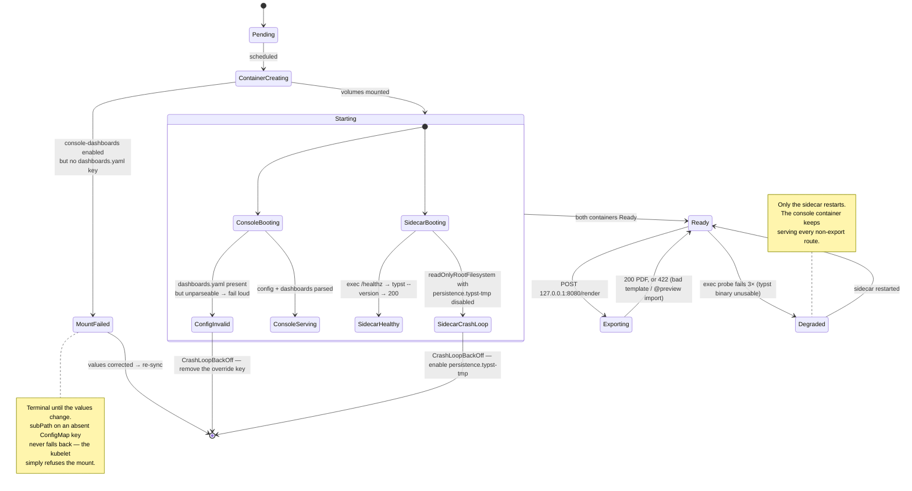

# converse-console

This chart deploys the Lightbridge Console UI (`apps/console`, Next.js) as a Node-runtime
server. It is a brand-new chart (ticket #287), not a version bump of `charts/converse-frontend`
— that chart keeps serving the retired Expo static export (`apps/self-service`, nginx), which is
still live in production until Epic 4 retires it, completely unchanged. See
`apps/console/Dockerfile` for the image this chart deploys and
`apps/console/src/server/config-loader.ts` for the config document format referenced throughout
this README.

## Why a separate chart, not a version bump of converse-frontend

`ai-helm`'s running `converse-ui` Application floats on `targetRevision: ">=0.0.0"` against
`oci://ghcr.io/adorsys-gis/charts/converse-frontend` — there is no version high enough to fence a
range that broad off from a new release. Editing that chart's shape in place (container port,
probes, labels, config mechanism) would have been picked up on the very next ArgoCD reconcile and
taken self-service's live Deployment down (wrong port, wrong probes, a `CONSOLE_CONFIG` mount it
can't use). Publishing this work as a new chart directory instead gets it its own GHCR package —
`oci://ghcr.io/adorsys-gis/charts/converse-console` — for free, via `publish-charts-oci.yml`'s
`for cf in charts/*/Chart.yaml` loop. `charts/converse-frontend` is untouched by this PR.

## Published location (OCI)

On every merge to `main`, this chart is packaged and pushed to GHCR as an OCI
artifact (there is no gh-pages Helm repo):

```
oci://ghcr.io/adorsys-gis/charts/converse-console
```

Versions are `MAJOR.MINOR` from `Chart.yaml` plus a patch derived from the commit
count touching the chart directory (monotonic, clean `X.Y.Z`). Pull a specific
version with `--version`, or omit it to get the latest:

```bash
helm show chart oci://ghcr.io/adorsys-gis/charts/converse-console
helm upgrade --install -n ai console \
  oci://ghcr.io/adorsys-gis/charts/converse-console \
  -f my-values.yaml
```

The examples below use the local path (`./charts/converse-console`) for
development; substitute the OCI reference above to deploy a published version.

## Required runtime configuration

The console reads its configuration from a YAML document — **not** from individual
environment variables (that's the old Expo/nginx `EXPO_PUBLIC_*` model in `converse-frontend`; it
has no equivalent here). The document's path is `CONSOLE_CONFIG` (this chart sets it to
`/config/console/config.yaml`); this chart mounts that path from a ConfigMap you supply via
`console.configMaps.console-config.data["config.yaml"]`.

Write your own `config.yaml` the same way `apps/console/config.yaml` is written (see that
file for the full field reference and `src/server/config-loader.ts` for the exact
`{env:VAR}` placeholder syntax): non-secret values — Keycloak issuer, backend URLs, the
public origin — are plain literals in the document; only real secrets (`session.secret`,
optionally `keycloak.clientSecret`) are `{env:VAR}` placeholders, backed by real
environment variables you inject via a Secret (not shown in this chart — wire one up
through `console.controllers.main.containers.frontend.env` / `envFrom`, per app-template's own
container env conventions).

This chart ships a values schema (see [`values.schema.json`](./values.schema.json)) that
requires `console.configMaps.console-config.data["config.yaml"]` to be a non-empty
string — Helm validates this during lint/install/upgrade, so a deployment with no config
document supplied fails fast instead of running with nothing wired up.

### Option A: values file

Create `my-values.yaml`:

```yaml
console:
  configMaps:
    console-config:
      data:
        config.yaml: |
          session:
            secret: '{env:SESSION_SECRET}'
          keycloak:
            issuer: 'https://keycloak.example.com/realms/your-realm'
            clientId: 'console'
            scopes: 'openid profile email offline_access'
            expectedAudiences:
              - 'converse-frontend'
            audienceRequired: true
            rolesClaim: 'lightbridge_api_roles'
          backendUrl: 'https://your-backend.example.com'
          apiBasePath: '/'
          publicBaseUrl: 'https://console.your-domain.example.com'
          permissions: {}
```

Install/upgrade:

- `helm upgrade --install -n ai console ./charts/converse-console -f my-values.yaml`

### Option B: --set-file

The config document is multi-line YAML, so `--set-file` reads it from a file rather than
inlining it on the command line:

```bash
helm upgrade --install -n ai console ./charts/converse-console \
  --set-file console.configMaps.console-config.data.config\\.yaml=./my-config.yaml
```

## Runtime white-label branding (optional)

Owner design (issue #368): a deployment can override the built-in logo and/or a handful of
daisyUI colour custom properties (`--color-primary`, …) without a rebuild — `apps/console`'s
`config.yaml` gains an optional `branding:` block (`logo`/`style`, both host-absolute paths;
see that file's own comment and `src/server/env.ts`), served back to the browser by
`GET /branding/logo` and `GET /branding/override.css`. This chart's job is only to get the two
files onto disk at those paths — it does not itself edit `console-config`'s `config.yaml`.

Disabled by default: `console.configMaps.branding-logo`/`branding-style` and
`console.persistence.branding-logo`/`branding-style` are all `enabled: false` out of the box, so
an operator who does nothing here gets no extra ConfigMap, no extra volume, and no behaviour
change at all.

**Two separate ConfigMaps, not one**, even though the owner's design describes a single mounted
directory: app-template's own values schema forbids one ConfigMap entry from carrying both
`data` (text) and `binaryData` (base64) — see `values.yaml`'s own comment on
`persistence.branding-logo` for the exact schema clause. `logo.png` (binary) goes in
`branding-logo`'s `binaryData`; `override.style` (plain CSS text) goes in `branding-style`'s
`data`. Both mount into the SAME `/tmp/branding/` directory via their own `subPath`, so the end
state on disk is identical to what the owner described — two files in one directory.

```yaml
console:
  configMaps:
    console-config:
      data:
        config.yaml: |
          # ...your usual config.yaml fields...
          branding:
            logo: /tmp/branding/logo.png
            style: /tmp/branding/override.style
    branding-logo:
      enabled: true
      binaryData:
        logo.png: <base64-encoded PNG/SVG/JPEG/WebP>
    branding-style:
      enabled: true
      data:
        override.style: |
          [data-theme="black"] {
            --color-primary: #ff6600;
          }
  persistence:
    branding-logo:
      enabled: true
    branding-style:
      enabled: true
```

`--set-file` works here too, the same way it does for `console-config`'s own `config.yaml`:

```bash
helm upgrade --install -n ai console ./charts/converse-console \
  --set console.configMaps.branding-logo.enabled=true \
  --set console.persistence.branding-logo.enabled=true \
  --set-file console.configMaps.branding-logo.binaryData.logo\\.png=./logo.b64 \
  --set console.configMaps.branding-style.enabled=true \
  --set console.persistence.branding-style.enabled=true \
  --set-file console.configMaps.branding-style.data.override\\.style=./override.style
```

(`logo.b64` is the logo file already base64-encoded — `base64 -i logo.png -o logo.b64` — since
`binaryData` values are base64 strings, not raw bytes.)

### Per-theme logos

Owner directive, 2026-08-31: "White is for dark themes" — a deployment can also supply a
**light-theme (`wireframe`) counterpart** to the logo above. `apps/console`'s `config.yaml` gains
a `branding.logoLight` field alongside `branding.logo` (same host-absolute-path/extension-allow-
list contract, see `src/server/env.ts`), served back to the browser by
`GET /branding/logo-light`. `logo` doubles as both the default mark AND the dark-theme (`black`)
mark; `logoLight`, when present, is what renders instead under the light theme. The console's
`BrandMark` picks between the two purely by CSS keyed off `[data-theme]` — no extra request, no
flash, no JS theme read (`packages/ui-web/src/theme.css`'s `brand-mark-dark`/`brand-mark-light`
utilities).

**`logoLight` is NOT independently optional** the way `logo`/`style` are: it is a counterpart to
`logo`, not a standalone field. A deployment that sets `branding.logoLight` without
`branding.logo` fails `apps/console`'s config parsing at boot — a light-only brand would render no
mark at all under `black`, this console's default theme.

A third ConfigMap, `branding-logo-light`, mirrors `branding-logo` exactly (same
binary-vs-`data`-only schema constraint, same mount pattern) and is likewise `enabled: false` by
default:

```yaml
console:
  configMaps:
    console-config:
      data:
        config.yaml: |
          # ...your usual config.yaml fields...
          branding:
            logo: /tmp/branding/logo.png
            logoLight: /tmp/branding/logo-light.png
            style: /tmp/branding/override.style
    branding-logo:
      enabled: true
      binaryData:
        logo.png: <base64-encoded PNG/SVG/JPEG/WebP — the dark-theme mark>
    branding-logo-light:
      enabled: true
      binaryData:
        logo-light.png: <base64-encoded PNG/SVG/JPEG/WebP — the light-theme mark>
  persistence:
    branding-logo:
      enabled: true
    branding-logo-light:
      enabled: true
```

```bash
helm upgrade --install -n ai console ./charts/converse-console \
  --set console.configMaps.branding-logo.enabled=true \
  --set console.persistence.branding-logo.enabled=true \
  --set-file console.configMaps.branding-logo.binaryData.logo\\.png=./logo.b64 \
  --set console.configMaps.branding-logo-light.enabled=true \
  --set console.persistence.branding-logo-light.enabled=true \
  --set-file console.configMaps.branding-logo-light.binaryData.logo-light\\.png=./logo-light.b64
```

`override.style` is filtered server-side before it is ever served to a browser (only
`:root`/`[data-theme="…"]` custom-property declarations survive — anything else, including a
whole other selector, is dropped and logged): a typo here can recolour the console, never break
its layout.

## Report export: the `typst-render` sidecar (optional)

Story [ai-helm-values#346](https://github.com/ADORSYS-GIS/ai-helm-values/issues/346). The console's
report export compiles documents with [Typst](https://typst.app), which runs as a **second
container in the console pod** — `apps/typst-render` from this repo
([converse-frontends#456](https://github.com/ADORSYS-GIS/converse-frontends/pull/456)), image
`ghcr.io/adorsys-gis/converse-frontends/typst-render`. The console image is unchanged by this: it
is still `node:22-bookworm-slim` and has gained neither a Typst binary nor a browser engine.

**Disabled by default.** The chart may be deployed before the console route that calls the renderer
exists, and a running service nothing talks to is a confusing thing to hand an operator. Turning it
on is two paired switches plus, if you want the network policy, a third:

```yaml
console:
  controllers:
    main:
      containers:
        typst-render:
          enabled: true # the sidecar
  persistence:
    typst-tmp:
      enabled: true # its writable /tmp — REQUIRED, see below
  networkpolicies:
    typst-render-isolation:
      enabled: true # defence in depth on ingress
```

`typst-tmp` is not optional decoration. The sidecar runs with `readOnlyRootFilesystem: true`, and
every render `mkdtemp`s a throwaway directory under `$TMPDIR` (`apps/typst-render/src/render.ts`)
which it deletes in a `finally`. Enable the container without the `emptyDir` and every render fails
at the first write. Helm has no way to express "these two keys flip together", so it is written
here, in `values.yaml`, and in `values.schema.json`'s own description instead.

### Why a sidecar, and not a sibling Deployment

The story leaves the topology open and asks the chart to record its choice. This chart chose the
sidecar:

- **Payloads are documents, not API calls.** Template source, a JSON dataset and any embedded
  assets go in; a multi-MB PDF comes back. A sidecar keeps all of that inside one network
  namespace — no cluster hop, no Service, no in-cluster TLS decision to get wrong.
- **Reachability becomes a property of the process, not of a policy.** The chart sets
  `TYPST_RENDER_HOST=127.0.0.1`, overriding the image's own `0.0.0.0` default, so the listener is
  bound to loopback. No pod, in this namespace or any other, can open a connection to it — that is
  true whatever the CNI enforces, and it is why the container declares **no `containerPort`**: there
  is nothing outside the pod to advertise. A sibling Deployment would need a ClusterIP Service plus
  a correct, enforced NetworkPolicy to obtain a weaker version of the same guarantee.
- **Nothing to scale separately.** The renderer is stateless and strictly per-request; one console
  replica's export load is one sidecar's load.

Because the listener is loopback-only, kubelet HTTP probes (which dial the _pod IP_) cannot reach
it, so both probes are **exec** probes running the image's own health command inside the container.
`GET /healthz` shells out to `typst --version`, so a passing probe means "this container can
render", not merely "a socket is open" — the precise failure mode of an image assembled by copying
a binary between two base images.



### The egress limitation, stated plainly

`apps/typst-render/README.md` says the sidecar "is expected to run with no egress", and it is right
to: Typst reaches the `@preview` registry over the network whenever the host has egress — verified
directly, not assumed. **This chart does not ship that egress deny, and cannot.**

A `NetworkPolicy` — Cilium's included — selects **Pods, not containers**. `typst-render` shares the
console's network namespace, so any egress rule written for the renderer applies verbatim to the
console, whose entire job is reaching `authz-api`, `authz-budget`, `authz-usage`, the IdP and DNS. A
deny would take the console offline; a rule permissive enough for the console is permissive enough
for a package download. There is no container-granular form of this object — "scope it to the
sidecar" is not something the Kubernetes network API can express, at any CNI.

What holds the line instead, in the order it bites:

1. `--package-path` / `--package-cache-path` point at an **empty per-request directory**, so
   nothing is ever pre-seeded or reused between renders and an unresolvable import fails as a `422`
   naming the package rather than hanging for the full 30 s compile timeout.
2. Templates are supposed to be self-contained, and `report-templates` is an **operator-supplied**
   mount rather than user input. The residual exposure is therefore narrow and specific: an operator
   writes `@preview` into their own override, and it silently works in a cluster that has egress.
3. The real confinement is a **pod-level egress allow-list in the deployment repo**
   (`ai-helm-values environments/prod/deps/console-ui/ciliumnetworkpolicy.yaml`), which can
   enumerate the console's genuine destinations and thereby exclude `packages.typst.org`. Only the
   deployment knows those destinations, so only the deployment can write it. **It does not exist
   yet** — that is a known, deliberate gap, not an oversight.

`networkpolicies.typst-render-isolation` is what this chart _can_ honestly assert:
`policyTypes: [Ingress]`, one rule allowing the console's own `:3000`, therefore every other port on
the pod — 8080 included — refused for every off-pod source. It is belt to the loopback bind's
braces, so the guarantee survives someone later "fixing" the bind address back to `0.0.0.0`.

## Overriding `dashboards.yaml`

The console's declarative dashboards are read from `${CONSOLE_CONFIG_DIR}/dashboards.yaml` —
i.e. `/config/console/dashboards.yaml`, the directory `CONSOLE_CONFIG` already points into.
Deliberately the **same ConfigMap** as `config.yaml`, mounted through a second `subPath` entry:
the two documents are read by the same process at the same moment, and there is no case where an
operator grants one and not the other.

```yaml
console:
  persistence:
    console-dashboards:
      enabled: true
  configMaps:
    console-config:
      data:
        config.yaml: |
          …
        dashboards.yaml: |
          dashboards: []
```

Both keys, or neither. A `subPath` naming a ConfigMap key that does not exist **does not fall
back** — the kubelet refuses the mount and the pod sits in `ContainerCreating` — which is why this
is a separate, disabled-by-default `persistence` entry rather than a second `globalMounts` item on
`console-config`.

Contract:

- **Absent** → the console reads the `dashboards.yaml` shipped in its image. This is the default and
  it is a perfectly good production posture.
- **Present and valid** → it replaces the shipped file wholesale.
- **Present and invalid** → the console **deliberately fails startup** (owner ruling: fail loud,
  never serve a half-parsed dashboard set). Recovery is _removing the key from these values_ and
  re-syncing — not editing the file inside a running pod, which no longer exists to edit.

## Pointing the console at the renderer

`TYPST_RENDER_URL: http://127.0.0.1:8080` is set on the console container whenever this chart is
installed, sidecar or not. **The console reads that variable directly** — it does not depend on the
deployment's own `config.yaml` carrying a `reports:` block.

That is a correction, not the original design (owner feedback 2026-09-03). The chart set the
variable and the sidecar was running, but PDF export still answered

> PDF export needs the typst-render service. Set `reports.typstRenderUrl` (`TYPST_RENDER_URL`).

because a deployment supplies its **own** `config.yaml` text via
`configMaps.console-config.data`, and prod's document predates the export story and has no
`reports:` block at all — so the `reports.typstRenderUrl: '{env:TYPST_RENDER_URL}'` placeholder that
would have read the variable was never in the parsed document. The placeholder lives in a file the
deployment owns; the variable lives on a container this chart owns. The console now reads the
variable itself, YAML-first:

| `config.yaml` `reports.typstRenderUrl` | `TYPST_RENDER_URL` | Result                           |
| -------------------------------------- | ------------------ | -------------------------------- |
| set                                    | anything           | the document's value wins        |
| absent / blank                         | set                | the variable                     |
| absent / blank                         | unset              | unconfigured → `format=pdf` 502s |

A deployment values file therefore needs **no** `reports:` block. Adding one is still supported and
still wins, which is how you point the console at a renderer that is not the loopback sidecar.

## Report template overrides

`CONSOLE_TEMPLATES_DIR` is **always** set on the console container (`/config/console/templates`),
whether or not anything is mounted there. That is safe because lookup is **per file**:

- `${CONSOLE_TEMPLATES_DIR}/<route>/report.typ` wins over the shipped template of that same path;
- a route with **no** override file falls back to the image's own template rather than erroring;
- so a ConfigMap carrying one file overrides exactly one report, and an absent directory overrides
  nothing.

Templates and `dashboards.yaml` live on **separate volumes on purpose**: a designer restyling a
report has no business editing the console's IdP configuration, and two volumes are two separately
grantable surfaces. `type: configMap` is the smallest thing that works and needs no storage class;
a deployment whose templates exceed a ConfigMap's 1 MiB ceiling overrides
`type: persistentVolumeClaim` + `existingClaim` in its own values file. The mount path and its
read-only-ness are what this chart asserts; the source is the deployment's choice.

### The route tree, and why the key name is not the path

**A ConfigMap key cannot contain `/`.** `admin/overview/report.typ` is not a legal key, so the
nesting has to come from the **mount**, never from the key. Two shapes, both rendered and verified
with `helm template --kube-version 1.35.3 --include-crds`:

**(a) Text only — one ConfigMap, one directory mount, `items` for the nesting.** Right when the
override is nothing but `.typ` chrome:

```yaml
console:
  persistence:
    report-templates:
      enabled: true
      items:
        - key: admin-overview-report.typ
          path: admin/overview/report.typ
        - key: admin-usage-report.typ
          path: admin/usage/report.typ
  configMaps:
    report-templates:
      enabled: true
      data:
        admin-overview-report.typ: |
          #import "_lib/report.typ": *
          #let report = json(sys.inputs.at("data"))
          #show: report-page.with(report)
          #panels-in-order(report)
        admin-usage-report.typ: |
          …
```

This shape **cannot carry a logo**: every file would have to live in that one ConfigMap, a PNG
cannot go in `data`, and app-template's own values schema forbids one ConfigMap entry from
carrying both `data` and `binaryData` (and refuses `data: null`, so this entry's `data: {}` default
cannot be cleared from a values file). Use (b).

**(b) Mixed — `.typ` in `data`, images in `binaryData`, per-file `subPath` mounts.**

This is the prod shape for "a custom template WITH an embedded logo". Two ConfigMaps assembled into
**one** directory tree by mounting each file at its own path. Note there is **no directory mount at
all** here: a ConfigMap volume is read-only, so nesting a second mount inside a directory-mounted
ConfigMap is impossible — the kubelet cannot create the mount point.

```yaml
console:
  persistence:
    # `.typ` sources — per file, replacing this entry's default directory mount.
    report-templates:
      enabled: true
      advancedMounts:
        main:
          frontend:
            - path: /config/console/templates/admin/overview/report.typ
              subPath: admin-overview-report.typ
              readOnly: true
    # Binary companions — the logo, a watermark, a typeface.
    report-template-assets:
      enabled: true
      advancedMounts:
        main:
          frontend:
            - path: /config/console/templates/admin/overview/logo.png
              subPath: admin-overview-logo.png
              readOnly: true
  configMaps:
    report-templates:
      enabled: true
      data:
        admin-overview-report.typ: |
          #import "_lib/report.typ": *
          #let report = json(sys.inputs.at("data"))
          #show: report-page.with(report)
          #align(right, image("logo.png", height: 20pt))
          #panels-in-order(report)
    report-template-assets:
      enabled: true
      binaryData:
        # base64 of the PNG: `base64 -i logo.png | tr -d '\n'`
        admin-overview-logo.png: iVBORw0KGgoAAAANSUhEUgAA…
```

`ci/renderer-enabled-values.yaml` is exactly this, so `helm template` against it is the regression
check for the whole mechanism.

**`image("logo.png")`, with no leading slash.** The console sends every non-`.typ` file sitting
beside the resolved `report.typ` to the renderer as an asset keyed by its path **relative to that
directory**, and a per-route template compiles as `main.typ` **at the render root** — so its
siblings are relative to it. (`_lib/report.typ` is the exception and needs `image("/" + …)`,
because Typst resolves a relative path against the file that calls it and the library lives in a
subdirectory.)

### Two logos, and which one prints

There are two independent ways a report gets a mark, and they answer different questions:

| Surface                                        | Configured by                                             | Applies to                           |
| ---------------------------------------------- | --------------------------------------------------------- | ------------------------------------ |
| `report.branding.logo` — the header letterhead | `branding.logo` / `branding.logoLight` in **config.yaml** | **every** report, no template change |
| `image("logo.png")` — the template's own art   | a file in the route's **`report-templates`** bundle       | that one route                       |

The first is the one an operator wants for "our reports should carry our logo": set
`branding.logoLight` (and `branding.logo`) in `configMaps.console-config.data['config.yaml']`,
enable `persistence.branding-logo` / `branding-logo-light`, and every report — dashboard exports and
the consumption report alike — gets it, with no template mounted at all.

The console prints the **light-background** variant, i.e. `branding.logoLight` when set, falling
back to `branding.logo`. `branding.logo` is the default and **dark**-theme mark — in this estate a
white adorsys logo — and a white logo on white paper is an empty rectangle.

`branding.name` (also config.yaml, no volume needed) is printed in the header when no logo is
readable, so a deployment can have a letterhead without shipping an image.

### How a template and its logo reach the compiler





### Lifecycle of one console Pod with the renderer on



Note the asymmetry the diagram makes explicit: an unhealthy renderer degrades **exports only** —
the console container has its own probes and keeps serving. There is no state in which a Typst
failure takes the console down.

## Linting and rendering this chart

The chart's own `values.yaml` ships `config.yaml: ''`, which `values.schema.json` requires to be
non-empty — so `helm lint` against bare defaults **fails by design** (see
`.github/workflows/publish-charts-oci.yml`, which therefore does not lint at publish time). Two
fixtures under `ci/` supply a valid document so both value sets can actually be exercised:

```bash
helm dependency update charts/converse-console

# today's shape: renderer off, no overrides
helm lint     charts/converse-console -f charts/converse-console/ci/renderer-disabled-values.yaml
helm template console-ui charts/converse-console \
              -f charts/converse-console/ci/renderer-disabled-values.yaml

# every switch this chart adds, on
helm lint     charts/converse-console -f charts/converse-console/ci/renderer-enabled-values.yaml
helm template console-ui charts/converse-console \
              -f charts/converse-console/ci/renderer-enabled-values.yaml
```

Rendering the _disabled_ fixture is the regression check that matters: its output must differ from
the pre-#346 chart by exactly the two new console env vars (`CONSOLE_TEMPLATES_DIR`,
`TYPST_RENDER_URL`) and nothing else — no extra container, no NetworkPolicy, no extra volume.

## Ingress

This chart deliberately ships with `console.ingress.frontend.enabled: false` and no host. The
console's public hostname is decided and owned by the private `ai-helm-values` repo, not this
chart — set `enabled: true` and populate `hosts` there.

## Running alongside converse-frontend (self-service)

Both charts can be installed at once, as separate Helm releases (e.g. `converse-ui` for
self-service on `converse-frontend`, `console` for this chart), in the same namespace, without
resource-name collisions — app-template's generated object names, label selectors and Service
selectors are all release-scoped (derived from `.Release.Name`). This chart's own labels
(`console` / `console-app`) are deliberately distinct from `converse-frontend`'s
(`converse-frontend` / `converse-frontend-app`) so the two remain easy to tell apart by hand
(`kubectl get pods -l app=...`), even though nothing in either chart's own templates depends on
that for correctness.
