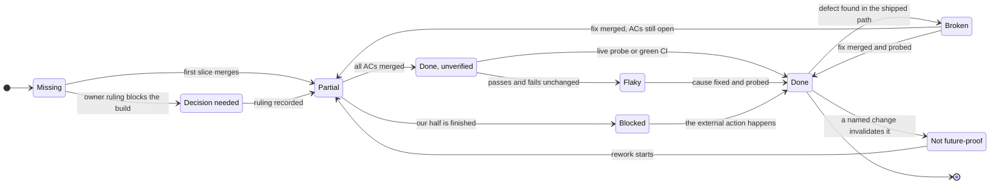

# Roadmap — what shipped, what did not, and what will bite

> Source of truth: [converse-frontends#443](https://github.com/ADORSYS-GIS/converse-frontends/issues/443)
> (Epic: admin console v2). Scope: **this repository only**. `lightbridge-authz` and
> `ai-helm-values` keep their own matrices; rows here link across only where the dependency is
> load-bearing for a frontend claim.
>
> Baseline: `main` @ `6b7b787`, 2026-09-03. Every row cites a PR, an issue, a commit SHA or a
> `path:line` in this tree. **A row without evidence does not belong here.**

## How to keep this honest

- **A merged PR updates its row in the same PR.** Not afterwards, not in a follow-up — the row is
  part of the change, exactly like the ADR amendment or the story is.
- **A newly-found gap gets a row here _before_ it gets an issue.** The row is the cheap artefact;
  the issue is the expensive one. A row that stays `Missing` for weeks is a decision, and it should
  be visible as one.
- **Never promote a row on a claim.** `Done, unverified` → `Done` needs a live probe or a CI run,
  named in the Evidence column. The distinction is the whole point of the vocabulary.
- Rows are grouped by **workstream**, not by sprint. A workstream ends when its last row is `Done`.

## State vocabulary

| State                | Means                                                                    |
| -------------------- | ------------------------------------------------------------------------ |
| **Done**             | Merged **and** confirmed live (a probe, a live URL, or a green CI run)   |
| **Done, unverified** | Merged, builds, tested locally/CI — but nothing checked it in production |
| **Partial**          | Some acceptance criteria met, named ones are not                         |
| **Missing**          | Asked for, in an issue or an ADR, and not built                          |
| **Broken**           | A known defect exists today; the issue is linked                         |
| **Flaky**            | Passes and fails without a code change; the test or job is named         |
| **Not future-proof** | Works now, and a named upcoming change breaks it                         |
| **Decision needed**  | Waiting on an owner ruling, not on engineering                           |
| **Blocked**          | Complete here; waiting on an action outside this repo                    |

No row carries **Flaky** at this baseline: nothing in this repo's CI is currently known to pass and
fail without a code change. That is a finding, not a reason to drop the state — the two 2026-09-03
incidents below were both deterministic, and a genuinely flaky job would be a different and worse
problem.

---

## Admin area & dashboards engine

| Item                                                          | State            | Evidence                                                                                                                                                     | Notes                                                                                                                                       |
| ------------------------------------------------------------- | ---------------- | ------------------------------------------------------------------------------------------------------------------------------------------------------------ | ------------------------------------------------------------------------------------------------------------------------------------------- |
| Declarative dashboard engine (spec, resolver, hook, renderer) | Done             | [#459](https://github.com/ADORSYS-GIS/converse-frontends/pull/459) `1e593c4`; [`apps/console/src/dashboards/`](../apps/console/src/dashboards/)              | 9 panel types; 10 panels collapse to 4 requests through the dedupe.                                                                         |
| `dashboards.yaml` as the board contract                       | Done             | [`apps/console/dashboards.yaml`](../apps/console/dashboards.yaml); [ADR 0015](adr/0015-admin-console-v2-declarative-dashboards-permissions-export.md)        | A deployment can add a panel through the config volume without a rebuild.                                                                   |
| `/admin/overview` on the engine                               | Done             | [#461](https://github.com/ADORSYS-GIS/converse-frontends/pull/461) `d19a58f`                                                                                 | 11 YAML panels + 2 RPC zones; hand-written containers deleted in the same PR.                                                               |
| "New accounts" / "gone quiet" panels                          | Missing          | [#461](https://github.com/ADORSYS-GIS/converse-frontends/pull/461) `d19a58f`                                                                                 | Dropped during C4: not expressible against the current usage query contract.                                                                |
| Table pagination on every panel, one `?dialog=` contract      | Done             | [#487](https://github.com/ADORSYS-GIS/converse-frontends/pull/487) `fcea0e4`                                                                                 | 12 modals converted to URL state; selections/modes deliberately left local (ADR 0011 D3).                                                   |
| Expanded-panel page size of 25                                | Decision needed  | [`dashboard-spec.ts:275`](../apps/console/src/dashboards/dashboard-spec.ts#L275)                                                                             | Engine default is `10 / 25`. Lowered from 50 in [#487](https://github.com/ADORSYS-GIS/converse-frontends/pull/487) without an owner ruling. |
| Filters live outside cards (`PageControls`)                   | Done             | [#504](https://github.com/ADORSYS-GIS/converse-frontends/pull/504) `5f6d90f`                                                                                 | `PageHeader.controls` deleted in the same PR — hard cutover, no parallel path.                                                              |
| Admin row on the main rail, Roles row removed                 | Done             | [#471](https://github.com/ADORSYS-GIS/converse-frontends/pull/471) `bd207be`                                                                                 | ADR 0013 amended in the same PR.                                                                                                            |
| The "Operator" rail group label                               | Decision needed  | [#471](https://github.com/ADORSYS-GIS/converse-frontends/pull/471) `bd207be`                                                                                 | Chosen by the implementer, never ruled on. It is the only rail group named after a persona rather than a surface.                           |
| Command-palette scope switching                               | Done, unverified | [#399](https://github.com/ADORSYS-GIS/converse-frontends/pull/399) `c273282`; [`console-chrome.tsx:875`](../apps/console/src/client/console-chrome.tsx#L875) | Accounts only — IA v3 removed project scope. **No dedicated test** asserts the palette writes the switcher's params.                        |

## Usage analytics

| Item                                                             | State            | Evidence                                                                                                                                                                   | Notes                                                                                                                                                           |
| ---------------------------------------------------------------- | ---------------- | -------------------------------------------------------------------------------------------------------------------------------------------------------------------------- | --------------------------------------------------------------------------------------------------------------------------------------------------------------- |
| `/admin/usage` index (19 panels)                                 | Done             | [#465](https://github.com/ADORSYS-GIS/converse-frontends/pull/465) `3175bfa`                                                                                               | 19 panels → 7 requests; lens, `operation_in`, `useActorLabels`, truncation captions.                                                                            |
| Actors / channels / chats boards                                 | Done             | [#469](https://github.com/ADORSYS-GIS/converse-frontends/pull/469) `0835f61`                                                                                               | Latency series carry p50 **and** p95 — honest, not a single averaged line.                                                                                      |
| Per-model page `/admin/usage/models/[model]`                     | Done             | [#496](https://github.com/ADORSYS-GIS/converse-frontends/pull/496) `bf67530`                                                                                               | 8 panels → 6 requests; linked wedges stopped toggling selection.                                                                                                |
| Truncation is visible to the reader                              | Done             | [`use-dashboard.ts:152`](../apps/console/src/dashboards/use-dashboard.ts#L152)                                                                                             | A `truncated: true` response captions the panel with its own limit; a paged table says paging is over the truncated reading.                                    |
| API-key names on spend-by-key panels                             | Done             | [#499](https://github.com/ADORSYS-GIS/converse-frontends/pull/499) `f00ecc9`                                                                                               | Backed by `resolveActorLabels`, row-scoped (authz#674).                                                                                                         |
| Family page prints raw API-key ids                               | Broken           | [#484](https://github.com/ADORSYS-GIS/converse-frontends/pull/484) `950fc76`                                                                                               | `/settings/overview/usage`'s "spend by API key" was never wired to the label resolver. **No issue filed** — file one.                                           |
| Overview never renders a fake zero                               | Done             | [#461](https://github.com/ADORSYS-GIS/converse-frontends/pull/461) `d19a58f`; [#274](https://github.com/ADORSYS-GIS/converse-frontends/issues/274)                         | Distinct loading/empty/error/unavailable states per panel; a 400 renders as the panel's own error, not as zero.                                                 |
| Usage proxy path allowlist                                       | Missing          | [#435](https://github.com/ADORSYS-GIS/converse-frontends/issues/435); [`proxy.ts`](../apps/console/src/server/proxy.ts)                                                    | `/api/usage/[...path]` is still a catch-all. The backend is the authoritative gate (authz#603); this is the missing defence-in-depth.                           |
| Model filter from `listModelCatalog`                             | Done             | [`url-state.ts:426`](../apps/console/src/client/url-state.ts#L426); [#466](https://github.com/ADORSYS-GIS/converse-frontends/pull/466) `c144c44`                           | Resolved by **deletion**: the filter offered one inert "All models" entry. `listModelCatalog` now has real call sites in policies.                              |
| Group-by vocabulary is the wire vocabulary                       | Done             | [`url-state.ts:410`](../apps/console/src/client/url-state.ts#L410)                                                                                                         | `OVERVIEW_GROUP_BYS satisfies readonly UsageGroupBy[]`; the old bridge table is gone.                                                                           |
| Family fan-out capped at 25 accounts                             | Not future-proof | [`account-family.ts:28`](../apps/console/src/containers/account-family.ts#L28); [`overview-pages.test.ts:363`](../apps/console/src/dashboards/overview-pages.test.ts#L363) | `5 × N` requests, `N = min(family, 25)` — 125 requests at the cap, and the 26th account is silently invisible. Needs a backend "every account I can see" scope. |
| `usage_events` bridge columns (`azp`/`operation`/`billing_plan`) | Not future-proof | authz [#652](https://github.com/ADORSYS-GIS/lightbridge-authz/pull/652) `8019375`; epic [authz#581](https://github.com/ADORSYS-GIS/lightbridge-authz/issues/581)           | Every `azp`/`operation` panel here is written against columns that epic #581's multi-source ingestion rewrite replaces. Rework is scheduled, not hypothetical.  |
| Comparison-window floor                                          | Decision needed  | [#483](https://github.com/ADORSYS-GIS/converse-frontends/pull/483) `9c2a31c`; [#482](https://github.com/ADORSYS-GIS/converse-frontends/issues/482)                         | The 7-day floor was **deleted** (it read $11.92 where the ledger said $3.59) — a deliberate deviation from the "at least a week" ruling. Needs re-ratification. |

## Budget & refills

| Item                                              | State            | Evidence                                                                                                                                        | Notes                                                                                                                                                                             |
| ------------------------------------------------- | ---------------- | ----------------------------------------------------------------------------------------------------------------------------------------------- | --------------------------------------------------------------------------------------------------------------------------------------------------------------------------------- |
| Refill queue shows the requester (name, email)    | Done             | [#460](https://github.com/ADORSYS-GIS/converse-frontends/pull/460) `479d564`                                                                    | One batched `resolveUserProfiles` per page; 4 labelled states.                                                                                                                    |
| Refill policy examples / "Start from example"     | Done             | [#457](https://github.com/ADORSYS-GIS/converse-frontends/pull/457) `d12c501`                                                                    |                                                                                                                                                                                   |
| `/admin/budget-schedules` (list, create, dry-run) | Done, unverified | [#464](https://github.com/ADORSYS-GIS/converse-frontends/pull/464) `322079f`                                                                    | The live RPC round-trip was never exercised against a deployed backend.                                                                                                           |
| Forced next-execution date                        | Done             | [#485](https://github.com/ADORSYS-GIS/converse-frontends/pull/485) `f0ebd0d`; authz#669 `0d993c5`                                               | One-off forced window, then back on the cadence grid; both sides rolled.                                                                                                          |
| Budget card says what a ceiling is under a reset  | Done             | [#479](https://github.com/ADORSYS-GIS/converse-frontends/pull/479) `6346ee4`                                                                    | Shared caption builder; "Spent since last reset" row.                                                                                                                             |
| A refill actually buys gateway headroom           | Missing          | `ai-helm-values environments/prod/values/core-gateway.yaml:79-102`; authz [ADR-0034](https://github.com/ADORSYS-GIS/lightbridge-authz/pull/676) | Two buckets govern prod, keyed on `x-billing-plan`, and all three plans are identical ($24/mo, $6/wk). Nothing at the gateway reads the ledger. **Platform-owned, not frontend.** |
| Budget-backend misconfiguration vs outage         | Broken           | [#313](https://github.com/ADORSYS-GIS/converse-frontends/issues/313)                                                                            | `budgetUrl` falls back to `backendUrl`, so a missing config and a real outage render identically.                                                                                 |
| A decided refill vanishes from the Decided tab    | Broken           | [#338](https://github.com/ADORSYS-GIS/converse-frontends/issues/338)                                                                            | Untouched by the v2 work.                                                                                                                                                         |

## Sessions, access & RBAC

| Item                                              | State            | Evidence                                                                                                                                                 | Notes                                                                                              |
| ------------------------------------------------- | ---------------- | -------------------------------------------------------------------------------------------------------------------------------------------------------- | -------------------------------------------------------------------------------------------------- |
| `/admin/sessions` ledger + detail sheet           | Done, unverified | [#468](https://github.com/ADORSYS-GIS/converse-frontends/pull/468) `593d5ef`                                                                             | Close-one / close-all gated on `session:read`. **Revoke → refresh-fails was never verified live.** |
| `azp` named on sessions, operator page size       | Done             | [#473](https://github.com/ADORSYS-GIS/converse-frontends/pull/473) `31cd6bc`; authz#659 `6cb3869`                                                        | `?limit` ∈ {25, 50, 100}. Rows written before the backend roll keep `client_id: NULL` until TTL.   |
| Permission gating from `getMyAccess`              | Done             | [#467](https://github.com/ADORSYS-GIS/converse-frontends/pull/467) `b410fa4`                                                                             | 6 admin routes on 6 permissions; `/admin/roles` added.                                             |
| `isAdmin` and role-derived gates deleted          | Done             | [`no-role-derived-gates.test.ts`](../apps/console/src/no-role-derived-gates.test.ts)                                                                     | Enforced by a ratchet test, not by review — an `isAdmin` identifier cannot come back.              |
| `/settings/tiers` permission gate                 | Done             | [#475](https://github.com/ADORSYS-GIS/converse-frontends/pull/475) `f95d35e`                                                                             | Was ungated; now `project:update` on both the page and the nav row.                                |
| Role catalogue (`listRoles`/`listPermissions`)    | Partial          | [authz#571](https://github.com/ADORSYS-GIS/lightbridge-authz/issues/571)                                                                                 | Assignment shipped; the browsable catalogue did not. Backend-owned.                                |
| `projectMembers` refine resource still registered | Broken           | [`console-providers.tsx:92`](../apps/console/src/client/console-providers.tsx#L92); [#284](https://github.com/ADORSYS-GIS/converse-frontends/issues/284) | Registered, never queried, fail-closed server-side if it ever were.                                |
| Optimistic-locking (412) path never exercised     | Missing          | [#318](https://github.com/ADORSYS-GIS/converse-frontends/issues/318)                                                                                     | The proxy forwards `If-Match` and relays `etag`; nothing has ever produced a conflict.             |

## Export & reports

| Item                                        | State   | Evidence                                                                                                                                                   | Notes                                                                                                                   |
| ------------------------------------------- | ------- | ---------------------------------------------------------------------------------------------------------------------------------------------------------- | ----------------------------------------------------------------------------------------------------------------------- |
| `apps/typst-render` sidecar                 | Done    | [#456](https://github.com/ADORSYS-GIS/converse-frontends/pull/456) `7d829c3`; [#458](https://github.com/ADORSYS-GIS/converse-frontends/pull/458) `ac38c72` | Loopback-only (127.0.0.1) in the pod; its golden test shells out to the pinned real compiler in CI.                     |
| `/api/reports/page` — pdf, csv, html        | Done    | [#463](https://github.com/ADORSYS-GIS/converse-frontends/pull/463) `cd4ed98`                                                                               | Per-route `.typ` templates + an override dir; SSR charts through a prebundled esbuild renderer.                         |
| Env fallback, branding logo, prod templates | Done    | [#474](https://github.com/ADORSYS-GIS/converse-frontends/pull/474) `9922d75`                                                                               | Proven with `pdfimages` against the deployed pod; two ConfigMaps, chart 0.2.5.                                          |
| CSV export is a parseable, correct CSV      | Broken  | [#495](https://github.com/ADORSYS-GIS/converse-frontends/issues/495)                                                                                       | 10 concrete defects: identity cells "—", series summed with no `bucket_start`, money as display strings, mixed locales. |
| Export button on every board                | Partial | [#463](https://github.com/ADORSYS-GIS/converse-frontends/pull/463) `cd4ed98`                                                                               | Live on `/admin/overview`; not offered on the actor/channel/chat/model boards.                                          |

## i18n

| Item                               | State   | Evidence                                                                                                                      | Notes                                                                                                                   |
| ---------------------------------- | ------- | ----------------------------------------------------------------------------------------------------------------------------- | ----------------------------------------------------------------------------------------------------------------------- |
| i18next on the App Router, en + de | Done    | [#489](https://github.com/ADORSYS-GIS/converse-frontends/pull/489) `0b56bd5`; [ADR 0017](adr/0017-i18n-app-router-i18next.md) | `next-i18next` is Pages-only and was rejected; locale in the `lb.locale` cookie.                                        |
| Language switcher                  | Done    | [#498](https://github.com/ADORSYS-GIS/converse-frontends/pull/498) `730683d`                                                  | Sidebar footer + `/settings/info`, as a `SelectField`.                                                                  |
| Hard-coded copy ratchet            | Partial | [`i18n-hardcoded-copy.test.ts:46`](../apps/console/src/i18n-hardcoded-copy.test.ts#L46)                                       | Pinned at **28** remaining strings. [#490](https://github.com/ADORSYS-GIS/converse-frontends/issues/490) takes it to 0. |
| A third locale                     | Missing | [ADR 0017](adr/0017-i18n-app-router-i18next.md)                                                                               | The wiring supports it; nobody has asked for one.                                                                       |

## Observability

| Item                                           | State            | Evidence                                                                                                                                                         | Notes                                                                                                                                                          |
| ---------------------------------------------- | ---------------- | ---------------------------------------------------------------------------------------------------------------------------------------------------------------- | -------------------------------------------------------------------------------------------------------------------------------------------------------------- |
| OTel traces from `console` and `lci`           | Done             | [#480](https://github.com/ADORSYS-GIS/converse-frontends/pull/480) `4e73346`; [`docs/knowledge/observability.md`](knowledge/observability.md)                    | `converse-console` and `converse-lci` visible in Tempo, exporting to `alloy.observability:4318`.                                                               |
| `apps/typst-render` tracing                    | Missing          | [`observability.md`](knowledge/observability.md) (§ "Why apps/typst-render has no SDK")                                                                          | Deliberate: `traceparent` log correlation only. Listed so the gap is a decision, not an oversight.                                                             |
| Build stamps — `service.version` on lci        | Done             | [#486](https://github.com/ADORSYS-GIS/converse-frontends/pull/486) `52ab140`                                                                                     | `IMAGE_TAG` (tag only) split from `IMAGE_REF` (full ref).                                                                                                      |
| `/settings/info` reports every backend's stamp | Done             | [#476](https://github.com/ADORSYS-GIS/converse-frontends/pull/476) `52c0522`; [#477](https://github.com/ADORSYS-GIS/converse-frontends/pull/477) `fbb937f`       | Backed by authz's `GET /version` (authz#663).                                                                                                                  |
| `IMAGE_TAG` vs `IMAGE_REF` across repos        | Not future-proof | [`docker-image.yml:141`](../.github/workflows/docker-image.yml#L141); [`lci-docker-image.yml:108`](../.github/workflows/lci-docker-image.yml#L108)               | This repo now separates them; **lightbridge-authz's `/version` still reports a full ref in its `imageTag` field**. A consumer joining the two gets a mismatch. |
| Metrics pipeline from the frontend apps        | Missing          | [`observability.md`](knowledge/observability.md) (§ Metrics)                                                                                                     | Deliberate: `metricReaders: []`. Next emits no OTel metrics and this estate scrapes with Prometheus.                                                           |
| **Cross-app OTel dashboard (Grafana)**         | **Missing**      | [ai-helm-values#375](https://github.com/ADORSYS-GIS/ai-helm-values/issues/375); [`observability.md`](knowledge/observability.md) (§ SLOs, dashboards and alerts) | Filed in `ai-helm-values` — the dashboard and Tempo are platform-owned. See the block below; the frontend half of the contract is already done.                |
| SLOs and alerts                                | Missing          | [`observability.md`](knowledge/observability.md) (§ SLOs, dashboards and alerts)                                                                                 | Key journeys span `authz-idp` and the usage API; the SLO belongs where those are defined.                                                                      |

### The cross-app OTel dashboard (roadmap item)

> Tracked as [ai-helm-values#375](https://github.com/ADORSYS-GIS/ai-helm-values/issues/375). The
> dashboard and the Tempo configuration are owned there; this section records what **this** repo
> owes it and what it can already rely on.

One Grafana dashboard, faceted on `service.name`, covering every service this estate runs:
`converse-console`, `converse-lci`, `typst-render` (log-correlated only), and the `authz-*` family
(`authz-api`, `authz-budget`, `authz-usage`, `authz-mcp`). Today each is inspected one TraceQL query
at a time; there is no single place that answers "which service is slow right now".

Two prerequisites, both verified rather than assumed:

1. **Span metrics do not exist yet.** Tempo's metrics-generator _is_ enabled in prod and remote-writes
   to Mimir (`ai-helm-values environments/prod/values/tempo.yaml:91-95`), but the prod values declare
   **no `metrics_generator_processors`** — so neither `span-metrics` nor `service-graphs` is running,
   and RED panels (rate / errors / duration per `service.name`) have no series to draw. Enabling the
   processors is the first change, and it is `ai-helm-values`-owned, not frontend-owned.
2. **`service.name` and `service.version` must be stable across all four apps.** That half _is_ done
   here ([#480](https://github.com/ADORSYS-GIS/converse-frontends/pull/480),
   [#486](https://github.com/ADORSYS-GIS/converse-frontends/pull/486)) and on the budget service
   (authz [#680](https://github.com/ADORSYS-GIS/lightbridge-authz/pull/680) `b999bdc`), which proved
   p50 10 ms with one 614 ms cold-start tail for `/budget/v1/remaining`.

Until the processors land, the honest interim is a **TraceQL-based** dashboard (client-side
quantiles over spans), which is exactly the recipe authz#680 already wrote down. That is a smaller,
buildable first step and should not wait on the platform change.

## Accessibility

| Item                                              | State            | Evidence                                                                                                                                                                        | Notes                                                                                                                                                               |
| ------------------------------------------------- | ---------------- | ------------------------------------------------------------------------------------------------------------------------------------------------------------------------------- | ------------------------------------------------------------------------------------------------------------------------------------------------------------------- |
| `jsx-a11y` errors at zero                         | Done             | [#503](https://github.com/ADORSYS-GIS/converse-frontends/pull/503) `5cb64ff`                                                                                                    | 22 → 0.                                                                                                                                                             |
| Automatic axe sweep in every render test          | Done             | [#503](https://github.com/ADORSYS-GIS/converse-frontends/pull/503) `5cb64ff`                                                                                                    | An `afterEach` across the ordinary suites; 1240 runs, 0 findings. `@axe-core/react` is unusable on React 19 — the reporter is ours.                                 |
| Storybook a11y gate in real Chromium, both themes | Done             | [`test.yml`](../.github/workflows/test.yml) job `a11y`; run green @ `6b7b787`                                                                                                   | `color-contrast` ON, `parameters.a11y.test = 'error'`.                                                                                                              |
| The a11y baseline is a **per-file** ratchet       | Not future-proof | [`a11y-storybook-baseline.json`](../packages/ui-web/a11y-storybook-baseline.json)                                                                                               | 127 files / 1672 failing runs, recorded as `{failing, rules}` **per file**. A new contrast defect inside an already-listed file is invisible while the count holds. |
| The `subtle` token's contrast                     | Decision needed  | [#502](https://github.com/ADORSYS-GIS/converse-frontends/issues/502); [`theme.css:146`](../packages/ui-web/src/theme.css#L146), [`:202`](../packages/ui-web/src/theme.css#L202) | 123 of the 127 baselined files (1632 runs) are **`color-contrast` only** — one token. Ruling wanted: darken it, or accept and document.                             |
| The 4 non-contrast baseline entries               | Missing          | [#502](https://github.com/ADORSYS-GIS/converse-frontends/issues/502)                                                                                                            | 1 × `aria-hidden-focus` (`admin-budget-review`), 3 × `story-did-not-run` (all `refine-mock`). Real defects, not a token argument.                                   |

## Storybook & design system

| Item                                            | State   | Evidence                                                                                                                                | Notes                                                                                                                                                 |
| ----------------------------------------------- | ------- | --------------------------------------------------------------------------------------------------------------------------------------- | ----------------------------------------------------------------------------------------------------------------------------------------------------- |
| Storybook reorganised, LCI in the same sidebar  | Done    | [#500](https://github.com/ADORSYS-GIS/converse-frontends/pull/500) `d908a7b`                                                            | 9 roots, 145 titles / 1067 stories, 17 LCI story files; a taxonomy check test holds the shape.                                                        |
| Story oracle threads panel options like the app | Done    | [#493](https://github.com/ADORSYS-GIS/converse-frontends/pull/493) `e7b8872`                                                            | A shared mapping module + a parity test — the oracle used to ignore `options.style` and lie about two ledgers.                                        |
| Storybook **publishes** to Pages                | Blocked | [#288](https://github.com/ADORSYS-GIS/converse-frontends/issues/288); [`storybook-pages.yml`](../.github/workflows/storybook-pages.yml) | The path filter is widened and the build runs green. **Pages is OFF as a repo setting** — only the owner can flip it; the deploy job skips by design. |
| `packages/ui-web` is the only design system     | Done    | `0d0604b` ([#402](https://github.com/ADORSYS-GIS/converse-frontends/pull/402))                                                          | `packages/ui` and `apps/self-service` deleted in one cutover.                                                                                         |
| Rail at 296px, content cap from 1480            | Done    | [#498](https://github.com/ADORSYS-GIS/converse-frontends/pull/498) `730683d`                                                            |                                                                                                                                                       |

## Session security

| Item                                      | State | Evidence                                                                                                                          | Notes                                                                                                                                                                      |
| ----------------------------------------- | ----- | --------------------------------------------------------------------------------------------------------------------------------- | -------------------------------------------------------------------------------------------------------------------------------------------------------------------------- |
| `iron-session` for the session cookie     | Done  | [ADR 0016](adr/0016-session-cookie-iron-session.md); [#478](https://github.com/ADORSYS-GIS/converse-frontends/pull/478) `0d78d4e` | **Rejected**, and that is the finished outcome: jose JWE GCM+HKDF is already in place; iron-session is CBC+HMAC, PBKDF2-SHA1×1, 6.5× slower, and forces a global re-login. |
| Session TTL (12 h sliding / 7 d absolute) | Done  | [#481](https://github.com/ADORSYS-GIS/converse-frontends/pull/481) `5fed3ad`                                                      | Found by the ADR 0016 assessment: there was no `exp` at all before this.                                                                                                   |
| `session.secret` rotation list            | Done  | [#481](https://github.com/ADORSYS-GIS/converse-frontends/pull/481) `5fed3ad`                                                      | One re-login on cutover, as designed.                                                                                                                                      |
| Cookie chunk ceiling                      | Done  | [#481](https://github.com/ADORSYS-GIS/converse-frontends/pull/481) `5fed3ad`                                                      | Capped at 2 chunks; the real bound is Traefik's Node 16 KB header limit, not the browser.                                                                                  |
| Sidecar network isolation                 | Done  | [#458](https://github.com/ADORSYS-GIS/converse-frontends/pull/458) `ac38c72`                                                      | Loopback-only + an ingress NetworkPolicy. **Per-container egress allow-listing is not expressible** — needs a pod-level CiliumNetworkPolicy.                               |

## CI & quality gates

| Item                                                    | State            | Evidence                                                                                                                                      | Notes                                                                                                                                         |
| ------------------------------------------------------- | ---------------- | --------------------------------------------------------------------------------------------------------------------------------------------- | --------------------------------------------------------------------------------------------------------------------------------------------- |
| `main` is fully green                                   | Done             | All 7 workflows `success` @ `6b7b787` (2026-09-03T18:17)                                                                                      | test, typecheck, build-web, a11y, Quality, Security Audit, storybook-pages, and all three image builds.                                       |
| `pnpm lint` exits 0                                     | Done             | [#494](https://github.com/ADORSYS-GIS/converse-frontends/pull/494) `ef6ff09`                                                                  | 0 errors, 38 warnings; 138 files formatted; generated dirs ignored.                                                                           |
| **A CI job that runs `pnpm lint`**                      | Missing          | [#412](https://github.com/ADORSYS-GIS/converse-frontends/issues/412); no hit for `pnpm lint` in [`.github/workflows/`](../.github/workflows/) | AC 2 of #412 is unmet: the gate is green **and** unenforced, so it can die silently again.                                                    |
| Quality gate fails only on scanner crashes              | Not future-proof | [`.ci/quality/gate.sh:61`](../.ci/quality/gate.sh#L61)                                                                                        | eslint/tsc/prettier run and emit SARIF, but finding counts **never** affect the exit code. Reads green while findings accumulate.             |
| Typecheck covers every workspace's own tsconfig         | Partial          | [#434](https://github.com/ADORSYS-GIS/converse-frontends/issues/434); [`test.yml`](../.github/workflows/test.yml)                             | 8 of 12 workspaces have one. `api-native`, `api-rest`, `authz-rpc`, `hooks` are still checked only incidentally, via console's import graph.  |
| Unit-test gate cannot silently run nothing              | Done             | [#508](https://github.com/ADORSYS-GIS/converse-frontends/pull/508) `6b7b787`; [`.ci/test/run.sh`](../.ci/test/run.sh)                         | See the incident row below.                                                                                                                   |
| The gate parses pnpm's human output for `Done`/`Failed` | Not future-proof | [`.ci/test/run.sh:22-30`](../.ci/test/run.sh#L22)                                                                                             | A pnpm release that reworders or renames those markers turns every package into "did not run" — a hard failure on a cosmetic upstream change. |
| AI review (`opencode`) actually runs                    | Broken           | [#436](https://github.com/ADORSYS-GIS/converse-frontends/issues/436)                                                                          | Fails on an Unauthorized LLM credential; the gate is silently not reviewing.                                                                  |
| Chart publishing globs every `charts/*`                 | Not future-proof | [`publish-charts-oci.yml:96`](../.github/workflows/publish-charts-oci.yml#L96)                                                                | Publishes the dead `charts/converse-frontend` on every charts change (see Dead code).                                                         |
| `next` 16.4 upgrade                                     | Missing          | [#401](https://github.com/ADORSYS-GIS/converse-frontends/issues/401)                                                                          | Re-evaluate `outputFileTracingIncludes` vs the Dockerfile CBOR staging when it is stable.                                                     |

## Incidents — 2026-09-03

| Item                                                         | State | Evidence                                                                                                                                                                                                                            | Notes                                                                                                                                                                                              |
| ------------------------------------------------------------ | ----- | ----------------------------------------------------------------------------------------------------------------------------------------------------------------------------------------------------------------------------------- | -------------------------------------------------------------------------------------------------------------------------------------------------------------------------------------------------- |
| **Every console route blank** — `data.map is not a function` | Done  | [#506](https://github.com/ADORSYS-GIS/converse-frontends/pull/506) `15537f6`                                                                                                                                                        | A TanStack **query-key collision**, not the cratestack bump: three hooks declared `['authz','resolveUserProfiles', ids]` over two payload shapes, and the shell mounts one of them on every route. |
| ↳ the guard that now prevents it                             | Done  | [`user-profiles-query.ts`](../apps/console/src/containers/user-profiles-query.ts) + [its test](../apps/console/src/containers/user-profiles-query.test.tsx); [`architecture-conventions.md`](knowledge/architecture-conventions.md) | One module declares each key **together with** the `queryFn` that fills it, both unwrapping the envelope. The persister's cache buster moved from `0.0.0` to the build SHA.                        |
| **LCI shipped 3 merges late** — the test job bailed          | Done  | [#508](https://github.com/ADORSYS-GIS/converse-frontends/pull/508) `6b7b787`                                                                                                                                                        | `pnpm -r` bails on the first failing package, alphabetically — one broken `apps/lci` suite meant `apps/console`'s ~1490 tests never ran at all, in any run, on any PR.                             |
| ↳ the guard that now prevents it                             | Done  | [`.ci/test/run.sh`](../.ci/test/run.sh)                                                                                                                                                                                             | `--no-bail` (baked into the root script so local runs match) **plus** an assertion that every package declaring a `test` script actually produced a result.                                        |

## Dead code & hygiene

| Item                                               | State            | Evidence                                                                                                                      | Notes                                                                                                                                                       |
| -------------------------------------------------- | ---------------- | ----------------------------------------------------------------------------------------------------------------------------- | ----------------------------------------------------------------------------------------------------------------------------------------------------------- |
| Dead-code inventory                                | Decision needed  | [#472](https://github.com/ADORSYS-GIS/converse-frontends/issues/472)                                                          | Filed by this effort; the owner rules on what goes.                                                                                                         |
| `@lightbridge/hooks` root export                   | Not future-proof | zero importers of `'@lightbridge/hooks'`; 17 subpath imports                                                                  | The root barrel drags `api-native` and the old i18n layer into the graph while nothing imports it.                                                          |
| `packages/api-native`                              | Not future-proof | named only by its own `package.json` and `packages/hooks/package.json`                                                        | No source importer anywhere in the tree.                                                                                                                    |
| `charts/converse-frontend` (the Expo-era chart)    | Not future-proof | [`charts/converse-frontend/values.yaml`](../charts/converse-frontend/values.yaml) (`EXPO_PUBLIC_*`)                           | Its app was deleted in `0d0604b`; the chart is still published to GHCR by the glob in `publish-charts-oci.yml`.                                             |
| `packages/hooks` pruning                           | Missing          | [#286](https://github.com/ADORSYS-GIS/converse-frontends/issues/286)                                                          | The Expo-era auth/query layer that [#280](https://github.com/ADORSYS-GIS/converse-frontends/issues/280) AC 2 asked to remove.                               |
| wiremock fixtures answer JSON to a CBOR console    | Broken           | [#507](https://github.com/ADORSYS-GIS/converse-frontends/issues/507)                                                          | The mock server loads nothing — the dev harness is not a harness. Blocks [#283](https://github.com/ADORSYS-GIS/converse-frontends/issues/283).              |
| Next page params arrive raw-encoded                | Not future-proof | [#496](https://github.com/ADORSYS-GIS/converse-frontends/pull/496) `bf67530`                                                  | Pages get **raw** encoded params while handlers get decoded ones. Every new dynamic route must remember `decodeRouteParam` once — a convention, not a type. |
| Turbo cache ignores `NEXT_PUBLIC_*`                | Not future-proof | [`turbo.json`](../turbo.json) — `build:web` declares no `env`; read by `apps/lci/src/app/(lci)/repositories/[id]/page.tsx:25` | `NEXT_PUBLIC_GRAFANA_URL` is inlined at build time but is not part of the cache key — changing it can serve a stale cached build.                           |
| Console proxy dials the public ingress             | Broken           | [#357](https://github.com/ADORSYS-GIS/converse-frontends/issues/357)                                                          | In-cluster services reached the long way round.                                                                                                             |
| API-key `PREFIX` column identical for every key    | Broken           | [#355](https://github.com/ADORSYS-GIS/converse-frontends/issues/355)                                                          |                                                                                                                                                             |
| A failed query renders as a confirmed-empty result | Broken           | [#346](https://github.com/ADORSYS-GIS/converse-frontends/issues/346)                                                          | Fixed for engine panels; the pre-engine screens still have it.                                                                                              |

## Docs, skills & harnesses

| Item                                          | State            | Evidence                                                                                                                                                         | Notes                                                                                                                 |
| --------------------------------------------- | ---------------- | ---------------------------------------------------------------------------------------------------------------------------------------------------------------- | --------------------------------------------------------------------------------------------------------------------- |
| ADR 0015 (dashboards, permissions, export)    | Done             | [#470](https://github.com/ADORSYS-GIS/converse-frontends/pull/470) `5418678`; [ADR 0015](adr/0015-admin-console-v2-declarative-dashboards-permissions-export.md) | 44 citations verified; 13 broken mermaid blocks fixed in the same pass.                                               |
| ADR 0016 (session cookie) / ADR 0017 (i18n)   | Done             | [ADR 0016](adr/0016-session-cookie-iron-session.md); [ADR 0017](adr/0017-i18n-app-router-i18next.md)                                                             |                                                                                                                       |
| Knowledge base, skills, agents, harness links | Done             | [#497](https://github.com/ADORSYS-GIS/converse-frontends/pull/497) `f3debca`                                                                                     | 9 knowledge pages, 7 skills, 4 agents, 21 symlinks; 110 citations verified.                                           |
| This roadmap                                  | Done             | this file; linked from [`README.md`](../README.md) and [`AGENTS.md`](../AGENTS.md)                                                                               | Update rule at the top.                                                                                               |
| Citations rot silently                        | Not future-proof | [`docs/knowledge/`](knowledge/)                                                                                                                                  | Every `path:line` here and in the knowledge base is verified **at write time only**. Nothing re-checks them on merge. |
