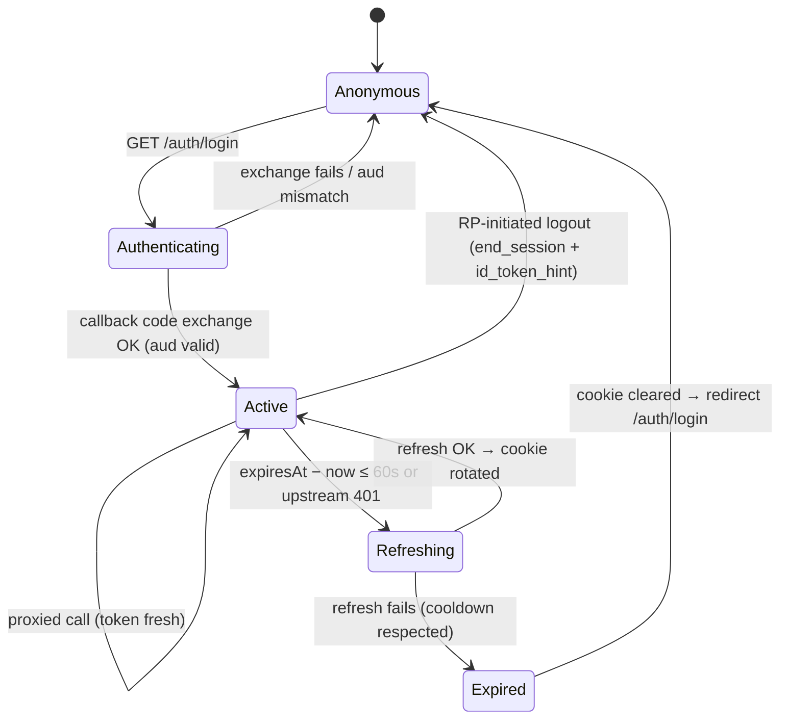

# ADR 0009: Next.js console replaces the Expo self-service app

## Status

Accepted

## Context

ADR 0008 locked the console's visual direction (Axiom-derived dark shell inversion, nav spine,
monochrome-plus-signal-orange charts) on the assumption that the substrate stays Expo +
react-native-web. The owner has since decided to rebuild the self-service console as a **Next.js
web application** and retire the Expo app. The goals, in the owner's words: better UI, in-app
dashboards, cookie-based SSO with internal refresh, report export, and above all **less hand-written
source code** — leaning on refine.dev and cratestack's generated clients instead of bespoke hooks
and screens.

Current-state facts this ADR builds on (verified against the tree on 2026-08-24):

- **No DOM-first React code exists anywhere in the workspace.** `react-dom` appears only as a peer
  of `react-native-web` (`apps/self-service/package.json`, `packages/ui/package.json`). The only
  web target is `expo export --platform web` served by nginx.
- **Auth today is client-side OIDC.** `packages/hooks/src/auth/use-keycloak-login.ts` runs
  Authorization Code + PKCE against Keycloak via `expo-auth-session` discovery, validates the
  token audience, and persists tokens to IndexedDB (`packages/hooks/src/auth/auth-storage.ts`).
  Refresh is handled inside the RPC runtime (`packages/authz-rpc/src/runtime.ts`): proactive
  (60s buffer) plus retry-once-on-401, with de-dup and cooldown. Tokens are therefore readable by
  any script running in the page.
- **RPC is cratestack-generated.** `packages/authz-rpc` is generated by `@cratestack/cli` (pinned
  `0.8.6`, a lockstep contract with `lightbridge-authz`'s Cargo pin — see
  `packages/authz-rpc/README.md`) from `schema/authz.cstack` (`transport rpc`, `POST /rpc/{op_id}`).
  Codec is CBOR in prod / JSON in dev (`packages/authz-rpc/src/codec.ts`, incl. the
  `stripUndefined` CBOR-`Option<T>` gotcha). Two client instances exist: `authz-api`
  (`backendUrl` + `apiBasePath`) and the budget microservice (`budgetBaseUrl` + hardcoded
  `/budget`). Batching is live via `createBatchLink()` (`apps/self-service/src/app/_layout.tsx`);
  `@cratestack/link-logger` is available but not wired.
- **The usage backend has a spec but no live client.** `packages/api-rest` is generated from
  `openapi/usage.backend.yaml` (`POST /usage/v1/usage/query`) with axios + zod, and has **zero
  importers** — today's usage surface is a Grafana iframe link-out that ADR 0008 Decision 7
  already resolved to retire.
- **The ADR 0008 dark palette is already applied** in `packages/ui/tailwind-preset.js` (`.dark`
  block: `#DA5C2C` primary, `#000` floor, `#111` chrome, `#191919` surface) and mirrored in
  `apps/self-service/src/theme/theme-colors.ts`. Chart primitives
  (`chart-core`, `time-series-chart`, `histogram-chart`, `ridgeline-chart`, axis/legend/tooltip)
  exist in `packages/ui`; `chart-core/` (scales, bins, colour ramp, `seriesColor`) is 100% DOM-free
  d3 math, while the six chart `component.tsx` files are thin `react-native-svg` renderers.
- **The `packages/ui` Storybook config is fragile by necessity.** `packages/ui/.storybook/main.ts`
  carries ~100 lines of Expo/RNW/pnpm transpile shims (`RAW_EXPO_PACKAGES`,
  `CJS_DEPS_TO_PREBUNDLE`, a custom esbuild plugin) that exist only because the components are
  React Native. A DOM package needs none of it.
- cratestack ships a first-party refine.dev integration
  (<https://cratestack.dev/guides/refine-integration/>): `cratestack generate-typescript --refine`
  emits `refine.ts` with `cratestackRefineResources()`, consumed by
  `createCratestackRpcDataProvider()` from `@cratestack/refine`, composing with
  `@cratestack/runtime-axios`, `@cratestack/link-logger`, and `@cratestack/link-batch`. It handles
  pagination (`@@paged` → `totalCount`), filtering, sorting, and `@version` optimistic locking
  (including keeping differently-versioned writes out of merged batches).

## Decision

### 1. A new Next.js app replaces `apps/self-service` — hard cutover

A new **`apps/console`** (Next.js App Router, React 19, Node 22, TypeScript) becomes the
self-service console. When it reaches feature parity (nav spine screens of ADR 0008 + report
export), `apps/self-service` and its Expo/nginx/envsubst delivery chain are **deleted**, per house
style: no long-lived parallel operation, no feature flags. Until that cutover PR, the Expo app keeps
shipping from `main` untouched.

ADR 0008's visual direction (Decisions 2–8) carries over unchanged. Its **Decision 9**
(`react-native-svg` charts) is superseded by Decision 4 below — that decision was substrate-bound
and the substrate is changing. ADR 0006 (Expo UI not adopted on web) becomes moot at cutover.

### 2. Auth: cookie sessions, server-side OIDC, internal refresh

The browser stops holding tokens. Next.js route handlers own the whole OIDC lifecycle against
Keycloak (same realm/client/audience-validation semantics as today, discovery-based, Authorization
Code + PKCE — now executed server-side):

- `GET /auth/login` → redirect to Keycloak authorize endpoint (standard flow, as today).
- `GET /auth/callback` → code exchange, audience validation, session established.
- Tokens live in **encrypted `httpOnly`, `Secure`, `SameSite=Lax` cookies** — never exposed to
  page JavaScript. XSS can ride the session but can no longer exfiltrate refresh tokens, which is
  strictly better than today's IndexedDB storage.
- **Refresh is internal**: the proxy layer (Decision 3) refreshes server-side with the same
  proactive-60s-buffer + retry-once-on-401 + de-dup semantics the RPC runtime implements today,
  rotating the cookie on the response. The client never sees a token endpoint.
- RP-initiated logout via the discovered `end_session_endpoint` with `id_token_hint`, as today.
- **Well-known endpoints become possible and are in scope**: the app serves discovery documents
  under `/.well-known/*` (e.g. `oauth-protected-resource` / `oauth-authorization-server` metadata
  pointing at Keycloak) so MCP-style clients (opencode, ChatGPT connectors, …) can discover how to
  authenticate against the gateway. Exact document set is driven by consumer needs, not decided
  here.

```mermaid
sequenceDiagram
    participant B as Browser
    participant N as Next.js (route handlers)
    participant K as Keycloak
    participant A as authz-api / budget / usage

    B->>N: GET /manage (no session cookie)
    N-->>B: 302 /auth/login → Keycloak authorize (PKCE)
    B->>K: authenticate (standard flow)
    K-->>B: 302 /auth/callback?code=…
    B->>N: GET /auth/callback
    N->>K: exchange code (server-side, code_verifier)
    K-->>N: tokens (aud validated)
    N-->>B: Set-Cookie (encrypted, httpOnly) + 302 /
    B->>N: POST /api/rpc/{op_id} (cookie)
    N->>N: decrypt session; refresh if expiresAt − now ≤ 60s
    N->>A: POST /rpc/{op_id} (Bearer, CBOR)
    A-->>N: CBOR response
    N-->>B: response (+ rotated cookie when refreshed)
```



### 3. Next.js is the only exposed origin — everything proxies

Route handlers proxy every backend the console needs; **no backend is exposed to the browser**:

- `/api/rpc/*` → `authz-api`'s `POST /rpc/{op_id}` (accounts/projects/api-keys), CBOR.
- `/api/budget/rpc/*` → the budget microservice (`/budget` prefix preserved).
- `/api/usage/*` → the usage backend (`POST /usage/v1/usage/query`) — its first live consumer,
  resolving the `packages/api-rest` dead-code situation (Consequences).
- The proxy attaches the Bearer token from the cookie session server-side and owns refresh
  (Decision 2).

Because both proxy legs run server-side, the codec is **CBOR everywhere** — the
`EXPO_PUBLIC_RPC_CODEC` dev/prod split and its `stripUndefined` class of drift risk stop being a
browser concern (the strip itself stays, in the server client). Runtime config collapses from the
nginx `envsubst`/`config.json` machinery to ordinary server-side environment variables read by the
route handlers; the `EXPO_PUBLIC_*` surface disappears at cutover.

### 4. Data layer: refine.dev + cratestack's generated refine provider

- The `packages/authz-rpc` codegen gains `--refine`, emitting `cratestackRefineResources()`.
- The console wires `createCratestackRpcDataProvider(cratestackRefineResources(client))` from
  `@cratestack/refine`, with the client on `@cratestack/runtime-axios` and
  `links: [createLoggerLink(), createBatchLink()]` — batching stays (parity with today's live
  `createBatchLink` wiring), logging finally gets wired, and axios instances point at the
  same-origin proxy paths of Decision 3.
- refine's `useList`/`useOne`/`useForm`/`useTable` hooks replace the bespoke TanStack query hooks
  in `packages/hooks` for CRUD surfaces (accounts, projects, API keys, budgets, members). This is
  the main "less hand-written code" lever: list/detail/edit screens become declarative resource
  pages over generated providers.
- Known provider gaps (no `liveProvider`, `updateMany`/`deleteMany` fan out to N calls, denied
  operations still generate callable methods) are accepted; none of the console's surfaces need
  them at cutover.
- Everything cratestack moves to the **pinned lockstep version `0.8.12`** (owner-directed upgrade
  from today's `0.8.6`; `0.8.10` is the fallback if `0.8.12` hasn't propagated to the registry) —
  the wire-format-drift rule documented in `packages/authz-rpc/README.md` applies unchanged, and
  `@cratestack/refine` / `@cratestack/runtime-axios` join the same pin set. The
  `minimumReleaseAgeExclude` entries in `pnpm-workspace.yaml` move with the pin.

### 5. UI: a new DOM package `packages/ui-web`, tokens stay single-source

- **`packages/ui-web`** (`@lightbridge/ui-web`) hosts the console's DOM components: the ADR 0008
  shell primitives (floating left nav panel, content floor, right context panel / bottom-sheet
  fallback), stat cards with sparklines, ledger tables, forms, and the chart set. Plain React DOM +
  Tailwind + CVA + tailwind-merge — the same idiom as `packages/ui`, minus React Native.
- It consumes **`@lightbridge/ui`'s `tailwind-preset.js` as-is** — the palette already carries the
  ADR 0008 values and stays the single source of truth. `ui-web` adds no second palette copy.
  (`apps/console` runs dark-only at launch; the preset's `.dark` block is the operative ramp.)
- **Charts port, they are not replaced.** `chart-core/` (scales, bins, colour ramp) is DOM-free and
  moves/gets consumed verbatim; the chart components are re-rendered as thin `<svg>` elements —
  a mechanical `react-native-svg` → DOM swap. recharts/chart.js were considered and rejected: the
  monochrome-ramp + signal-orange behaviour (`seriesColor`) and shared-bin ridgelines are already
  built and tested, and a chart framework would re-introduce exactly the themed-widget look ADR
  0008 rejects.
- `ui-web` gets its own **Storybook on `@storybook/react-vite`** with `addon-a11y` — none of the
  RNW transpile shims. Stories are the acceptance surface for the component PRs
  (`storybook-pages.yml`'s path filter widens to cover it). Beyond fixture-driven page stories,
  Storybook also hosts **refine-driven mock screens**: the page views rendered through
  `@refinedev/core` with a mocked data provider (simulated latency/errors), so the refine wiring's
  real look and behaviour — lists, selection, forms — is verifiable before `apps/console` exists.
- `packages/ui` continues to serve `apps/self-service` untouched until cutover, then is deleted
  with it.

### 6. Mobile-first responsive console (supersedes ADR 0008 Decisions 1–2 for this app)

Owner directive (2026-08-25): the Next.js console is **mobile-first**. ADR 0008's "no mobile
target, landscape forced, ≤600 guard rail" stance was bound to the Expo app and does not carry
over. For the console:

- Styles are authored mobile-first (base = phone, scaling up at the existing `600` / `1024`
  breakpoints, expressed as Tailwind screens `md:` / `lg:` in `packages/ui-web`).
- **`<600` is a designed target**: single-column content with 16px gutters; the nav spine docks
  as bottom navigation (ADR 0008's own ≤600 pattern, now styled to standard); the right rail's
  content and the nav overflow present as **drawers**; stat cards stack; ledgers scroll
  horizontally inside their own container; charts render full-width.
- `600–1024` keeps the persistent left rail with the right rail docked as a bottom drawer;
  `≥1024` is the full three-panel shell. The visual language (floor/panels/accent rules) is
  tier-invariant.
- All drawers and bottom sheets are built on **vaul** — the console's only drawer primitive; no
  hand-rolled sheet implementations.

### 7. Client-first and offline-first

Owner directive (2026-08-25): **whatever can be managed on the client is managed on the
client.** Consequences:

- The cratestack RPC client (CBOR codec, batching, logging links) runs **in the browser**,
  calling same-origin `/api/*`. The Next.js proxy layer stays dumb: it forwards opaque request
  bytes, attaches the Bearer token from the cookie session, and owns refresh — it never decodes
  payloads. Server components are reserved for the auth/proxy seam, not for data fetching.
- **Offline-first**: the console is a PWA (service-worker precached app shell) and refine's
  TanStack Query cache persists to IndexedDB, so previously-loaded screens render offline from
  cache with an inline "offline · showing cached data" status line. Mutations require
  connectivity at this stage (no offline mutation queue — build it when a real need appears,
  not speculatively).
- Auth remains the one thing the client cannot manage: tokens never leave the httpOnly cookie
  session (Decision 2).

### 8. Report export: month consumption, server-rendered

A route handler (`/api/reports/consumption?month=…`) queries the usage backend server-side and
streams a **CSV** download (grouped by project × model, with totals). The UI offers it from
`Manage`. CSV is the committed format; PDF is out of scope until someone asks for it.

### 9. What stays

API-key management (ADR 0001/0003 flows), project/account/budget management, the ADR 0008 layout,
nav spine, palette, chart colour rule, config-driven logo, and the governance workflow (PR
template, source-of-truth links, verification evidence) all carry over unchanged.

## Consequences

- First DOM-React and first Next.js code in the workspace; `pnpm-workspace.yaml` overrides
  (`react 19.2.3`, `react-dom 19.2.3`) already fit. New packages: `apps/console`,
  `packages/ui-web`.
- CI picks up the new packages automatically for unit tests and typecheck (script/tsconfig
  discovery); `apps/console` must declare `build:web` to join the web build + Docker jobs;
  `storybook-pages.yml`'s hardcoded `packages/ui/**` path filter needs widening.
- `packages/api-rest` finally gets an importer (the usage proxy + dashboards) instead of being
  deleted; its dead axios auth interceptor (`src/hook/client.ts`) is superseded by the
  cookie-session proxy and should be dropped when the client is adopted.
- The Expo delivery chain (nginx, `envsubst` runtime config, `EXPO_PUBLIC_*`, Grafana iframe) is
  deleted at cutover, not before. The Helm chart swaps to serving the Next.js app.
- Two stale artifacts flagged during research get cleaned up along the way: the outdated
  ADR-0008-follow-up comment in `packages/ui/src/components/chart-core/colors.ts`, and
  `packages/ui/.storybook/preview.tsx`'s `MUTED_BG.dark = '#111827'` (palette now says `#000`).
- Session security improves (httpOnly cookies vs IndexedDB), at the cost of Next.js becoming a
  stateful-ish edge: cookie encryption keys become a deploy-time secret.
- The cratestack version pin now spans four packages' worth of surface (cli, api, refine,
  runtime-axios, links) — same lockstep rule, bigger blast radius; bump only in sync with
  `lightbridge-authz`.

## Alternatives considered

- **Keep Expo and reskin.** Rejected by the owner — this replacement is the point.
- **react-native-web inside Next.js** (reuse `packages/ui` directly). Rejected: it drags the
  entire RNW/nativewind transpile burden (see the `.storybook/main.ts` shim pile) into every
  Next.js build, forfeits server components, and couples the new app to a package scheduled for
  deletion. Porting the thin component layer over the shared d3 core is cheaper than carrying RNW.
- **recharts / chart.js for dashboards.** Rejected (Decision 5): existing tested primitives
  already implement the ADR 0008 chart contract; a framework fights the monochrome rule.
- **Token-in-browser auth as today, just in Next.js.** Rejected: cookie sessions + server proxy
  are the reason to have a server at all — no exposed backends, no exfiltratable refresh token,
  well-known endpoints for MCP clients.
- **BFF as a separate service** (dedicated gateway instead of Next.js route handlers). Rejected:
  one more deployable with no benefit at this scale; Next.js already sits in the request path.

## Follow-ups

1. Design spec + mockups: `docs/design/console-redesign/` (Refero-grounded, per ADR 0001/0008
   citation conventions).
2. `packages/ui-web` scaffold: package, Tailwind wiring against `@lightbridge/ui/tailwind-preset`,
   Storybook (react-vite), vitest, CI pickup.
3. Component PRs (each small, each with stories): shell primitives, stat-card + sparkline, ledger
   table, chart ports, form/detail primitives, secret-reveal, status/empty-state lines.
4. `apps/console` scaffold: App Router skeleton, cookie-session auth routes, RPC/usage proxies,
   refine wiring with the generated resources, nav spine with `lightbridge-admin` gating.
5. `--refine` flag added to `packages/authz-rpc` codegen (or a sibling generated target for the
   console) at the pinned cratestack version.
6. Report export route + UI entry.
7. Cutover PR: delete `apps/self-service`, `packages/ui`, `packages/hooks`' auth/query layer,
   nginx/envsubst chain; re-point Helm chart and `docker-image.yml`.
