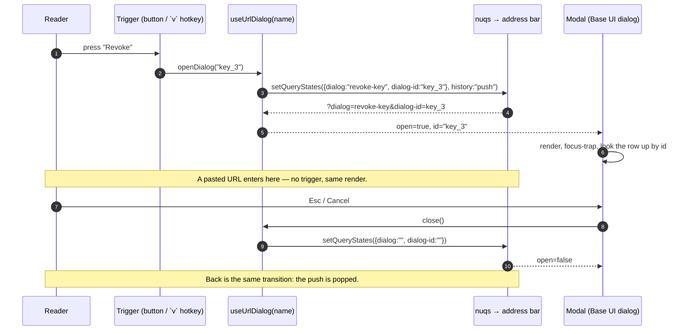
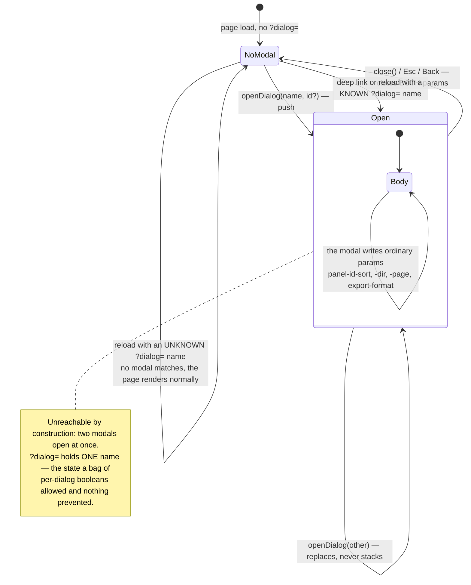

# ADR 0011: URL-first view state via nuqs

## Status

Accepted

> **Amended by [ADR 0013](0013-console-information-architecture-v3.md) (IA v3, 2026-08-31).**
> The account half of scope moved out of the URL **query** and into the URL **path**
> (`/accounts/[accountId]/*`) — see ADR 0013 D1. The project half is unaffected: `?project=`
> stays exactly the query-state pattern this ADR describes, including `clearOnDefault` for the
> "all projects" default. Everything else here — the URL-as-cross-zone-state-bus principle, the
> sanctioned local-state exceptions, `packages/ui-web` staying nuqs-free — is unchanged.

## Context

The console's view state (scope, filters, range/bucket/group-by, row/series selections, active
sub-nav tabs, open section sheets) currently lives in React `useState` inside `apps/console`'s
client providers (`ConsoleScopeProvider`, `ConsoleViewStateProviders`) and per-route adapters.
Consequences: no console view is shareable or reload-stable, back/forward does nothing useful,
and the persistent layout carries provider machinery whose only job is moving state between the
centre and the rail slots.

Owner directive (2026-08-26): avoid `useState`; use **nuqs** instead.

## Decision

1. **All view state is URL state.** Anything that describes _what the user is looking at_ lives
   in the URL via nuqs (`useQueryState`/`useQueryStates` with typed parsers + defaults):
   scope (account/project), dashboard view params (range, bucket, group-by), filters, selected
   series/row/request, active sub-nav tab, and which section sheet is open. Every console view
   becomes a shareable, reload-stable, back/forward-navigable URL.
2. **The URL is the cross-zone state bus.** Centre pages and `@rail`/`@scope` slot content read
   the same query params directly; the layout-level state providers that existed only to share
   view state between zones are deleted, not wrapped.
3. **Sanctioned local state (the explicit exceptions).** Ephemeral interaction state stays
   component-local: hover/tooltip tracking, focus management, in-flight form drafts whose
   content must not leak into URLs or history (the typed-confirm text, decision notes before
   submit), and animation/measurement state. Each surviving `useState`/`useRef`-state in
   `apps/console` carries a one-line justification comment; new unexplained `useState` in view
   code is a review defect.
4. **`packages/ui-web` stays presentational and framework-agnostic.** Components do not import
   nuqs; they stay controlled via props/callbacks so the app can own their state in the URL.
   Internal uncontrolled conveniences must always offer the controlled form.
5. Defaults stay out of the URL (nuqs `clearOnDefault`, the default), writes that shouldn't
   spam history use `history: 'replace'`, and high-frequency updates (e.g. text filters) use
   nuqs throttling. Server components may read the same params via nuqs' server-side cache
   helpers where useful.
6. Theme preference is not URL state — it stays in `localStorage` via the existing mechanism
   (a URL should not restyle the app for whoever it is shared with).

## Consequences

- `nuqs` joins `apps/console`'s dependencies (Next App Router adapter at the root).
- `ConsoleScopeProvider` / `ConsoleViewStateProviders` are deleted; route adapters read query
  state directly. Less code, and the layout's client boundary shrinks.
- Refine hook params (filters/pagination) derive from URL state — refine's own
  `syncWithLocation` stays **off** (nuqs owns the URL contract; one writer).
- Stories/tests: ui-web is unaffected (presentational); `apps/console` tests use nuqs' testing
  adapter.
- URLs become part of the product surface: param names are a contract; renames need the same
  care as API fields.

## Alternatives considered

- **Keep provider-based state.** Rejected by the directive, and it forfeits shareable views.
- **Roll our own searchParams plumbing.** Rejected: nuqs is the established, typed, SSR-aware
  implementation of exactly this pattern; hand-rolling it is the kind of code this project
  exists to not write.

---

## Amendment — one modal contract, `?dialog=` (owner directive, 2026-09-03)

**Status: accepted.** Verbatim: _"Egal which page, opening a modal should add the state into query
params. And doing so should help adding e.g. pagination inside the modal, as well as table sorting
filters."_

Decision 1 above already said "which section sheet is open" is URL state, and the console honoured
it — every dialog was URL-driven. What it never said was **how**, so twelve dialogs invented eight
dialects: `?new-account=true`, `?new-project=true`, `?export=true`, `?create=true`, `?revoke=<id>`,
`?delete=<id>`, `?account-name=true`, `?rename=true`, `?grant=true`, `?preview=<id>`. This
amendment makes it one shape.

### D7 — every modal is `?dialog=<name>`, with an optional `?dialog-id=<id>`

`client/url-state.ts` owns the pair and the name registry (`CONSOLE_DIALOGS`); every opener goes
through `useUrlDialog(name)`. Two properties fall out that the old booleans could not give:

- **One modal at a time, by construction.** `?new-project=true&new-account=true` was a reachable
  URL that stacked two dialogs; `?dialog=` holds one name. Call sites that used to clear a sibling
  flag by hand (`use-api-keys-screen.ts`'s revoke-vs-delete) no longer can get it wrong.
- **The modal's own view state keeps ordinary names.** Because "which modal" is one param, anything
  _inside_ a modal uses the page's normal knob namespace — no `dialog-`-prefixed duplicates. That
  is the directive's second sentence, and it is what makes `?expand=actors-table&actors-table-sort=
cost&actors-table-page=1` work: the expanded dashboard panel sorts and pages through the _same_
  `?<panel-id>-sort/-dir/-page` params the panel behind it reads (`useDashboardTableParams`).

### D8 — `?expand=<panel-id>` for the expanded dashboard panel

Its own param rather than a `dialog-id`, for the reason above: the expanded panel is the one modal
whose contents are steered by the page's per-panel knobs, and `?expand=<panel-id>` beside
`?<panel-id>-page=1` reads as one URL about one panel. `history: 'push'` — `v`/Expand pushes, Esc
and the close button pop.

### What is deliberately NOT a `?dialog=`

- **Selections.** `/admin`'s `?request=`, `/admin/sessions`' `?selected=`, `/api-keys`' `?key=`,
  `/settings/projects`' `?row=`. The console layout contract (LOCKED) renders that content in a
  persistent, drag-resizable right rail at `lg+` and only collapses it to a bottom sheet below.
  Nothing is modal about it on the majority breakpoint, and the rail is never empty — calling it
  `?dialog=` would be a lie about what the URL renders.
- **Modes.** `/admin/refill-policies`' `?edit=`/`?simulate=` and `/admin/budget-schedules`'
  `?edit=` swap the page's own content for a form. No overlay, nothing to dismiss back to; both
  vocabularies were also specified by the owner verbatim in an earlier ruling.
- **Three local `open` flags**, named in `url-state-discipline.test.ts`: the command palette (a
  launcher, not a view — a shared link must not pop open the recipient's palette), the refill
  policies "how does this work" disclosure (an inline expander), and the "start from example
  policy" confirmation (its entire subject is an unsent local draft, so a link carrying it would
  offer its recipient the chance to overwrite a draft they do not have — Decision 3's own carve-out
  applied to the dialog _about_ a draft).

### The flow

### Enforcement

`client/url-state-discipline.test.ts` grew two guards beside the three it already had: no `useState`
named like an open flag survives outside the three sites listed above, and no file but
`url-state.ts` names `dialog-id`. `url-state.test.ts` pins the wire names off `CONSOLE_DIALOGS`, so
a rename is a visible diff on a test rather than a silently broken bookmark.
