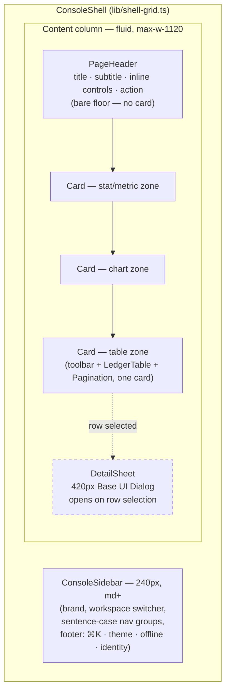
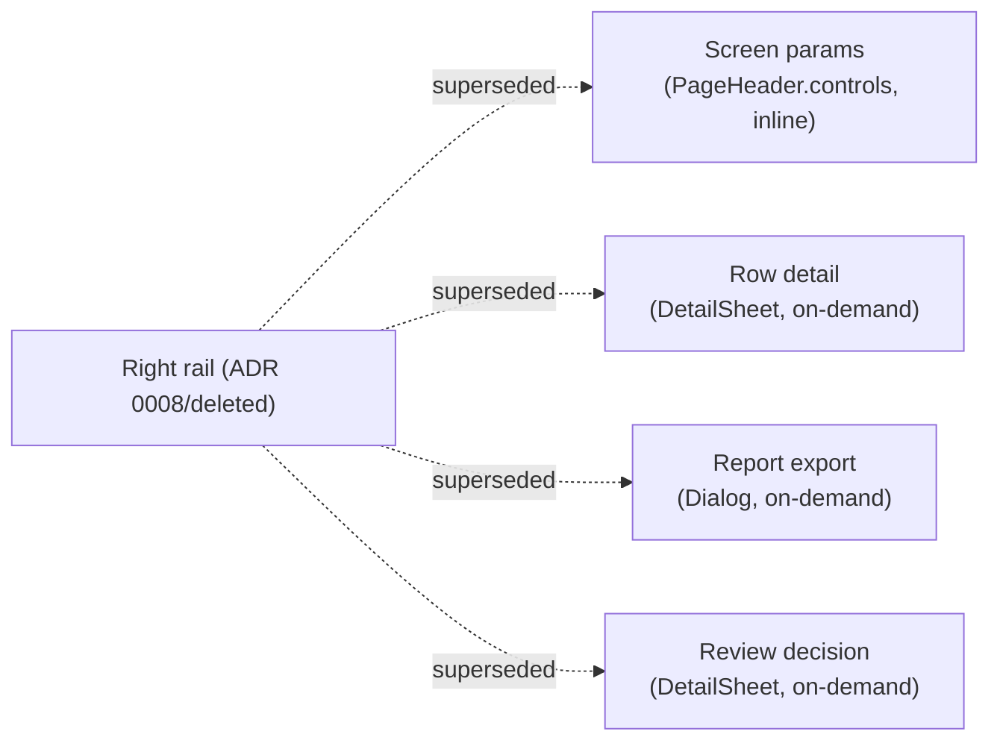
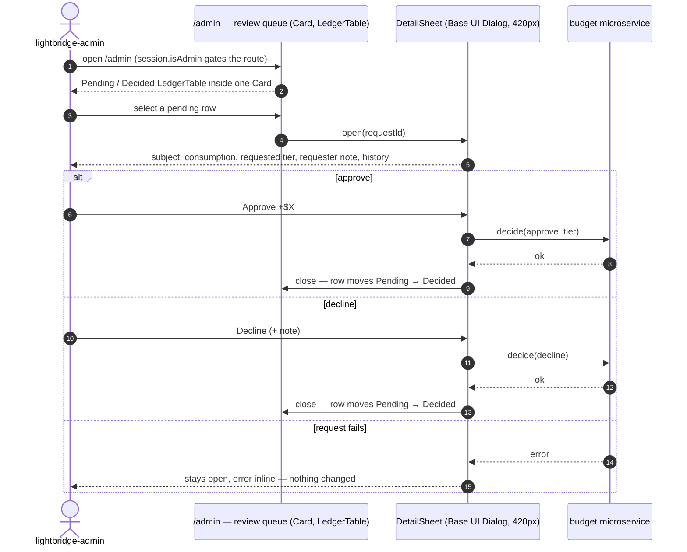

# ADR 0012: Console visual revamp — two-column shell, sans-first type, cards as the default zone

## Status

Accepted

> **Amended by [ADR 0013](0013-console-information-architecture-v3.md) (IA v3, 2026-08-31).**
> Decision 1's nav-shape clause (three fixed destinations, one flat `/admin`) and Decision 7's rail
> clause (the rail returned, one paragraph, no further detail) are superseded, in part, by ADR
> 0013 D1-D4: the account moved into the path, `/admin` is now `/settings/refills-queue` inside a
> second navigable settings area with its own nav, and the rail narrowed further to exactly one
> case (`/accounts/<id>/projects` with a row selected — no standing case anywhere). Everything
> else below — the two-column shell shape itself, sans-first type, cards as the default zone,
> radius 8/4, the empty-state doctrine, the honesty contract — is unchanged.

Records the owner directive of 2026-08-30 — _"The full UI is shit... Revamp it... keep base-ui
AND daisyui as base tho"_ — and the eight decisions that followed it across epic
[#368](https://github.com/ADORSYS-GIS/converse-frontends/issues/368) and PRs #371–#378 (phases
1–7.5). Every decision below is **implemented and merged**; this ADR is the record, not the
proposal.

Supersedes, in full or in part: [ADR 0008](0008-console-shell-inversion-and-visual-direction.md)
Decision 3 (shell inversion) and the persistent-right-rail contract, and Decision 5's mono-primary
type rule; [ADR 0010](0010-ui-primitive-stack-and-theming.md)'s restatements of the same rail and
radius rules. Both carry status-note amendments pointing here rather than being rewritten in
place — their still-live content (daisyUI/Base UI stack, the two-theme model, the chart-colour
rule, the honesty/no-fabrication doctrine) is **not** touched by this ADR. See §"What stays" below
for the exhaustive list.

## Context

The Next.js console (ADR 0009) shipped its first cut on ADR 0008's shell: three flush rail
columns (left nav, centre floor, right params/actions), a `#111` header band, 2px radius
everywhere, IBM Plex Mono as the primary type family for every structural surface, and a rule that
the centre column is _never_ a card. The owner's review of the built product (2026-08-30) rejected
that shape outright: too dense, too mono-heavy, and a right rail that only two of four screens
(Manage/Projects, Admin) ever needed — Overview and Api-Keys carried a permanent 280px column to
host five or six controls with no selection behaviour.

The directive that followed named the reference lock this ADR records in §"Reference lock", and
was explicit that the primitive stack underneath the visual language does **not** change: daisyUI
for paint, Base UI for behaviour, stay. What changes is the shell shape, the type hierarchy, and
whether a zone gets a card.

This ADR is written after the fact, against the tree as it stands post-PR-#378 (phases 1–7.5):
`packages/ui-web/src/lib/shell-grid.ts` (two-column geometry), `lib/type-roles.ts` (sans-first
roles), `theme.css` (`--radius-box: 0.5rem` / `--radius-selector`/`-field: 0.25rem`), and the
`components/card`, `empty-state`, `pagination`, `detail-sheet`, `sections/page-header`,
`sections/console-sidebar`, `components/console-top-bar` primitives it introduced.

## Decision

### D1 — Two-column shell; header band and persistent right rail removed

> **Status note (2026-09-03, owner directive).** The sidebar width decided here is **296px**, not
> 240px — "240px is too small for the left rail. Increase it to 296px." Nothing else in D1 changes:
> the shell is the same two columns, the same `md` breakdown, the same content cap. One consequence
> is worth recording because it is easy to state wrongly: `max-w-[1120px]` now only engages from
> 1480px (`296 + 2×32`), so at a 1440 viewport the content measure is 1080px and the cap is inert.
> The number in the paragraph below is left as written — it is what was decided in August.

The shell is a persistent **240px sidebar** (`ConsoleSidebar`: brand, workspace switcher,
sentence-case nav groups — Workspace / Account / Operator — a footer stack with `⌘K`, theme
toggle, offline indicator, identity) beside a single **fluid content column**, capped at
`max-w-[1120px]` (`lib/shell-grid.ts`'s `CONTENT_MAX_WIDTH_CLASS`). Below `md` (600px) the sidebar
is replaced by a 48px `ConsoleTopBar` plus the existing bottom navigation dock — `ConsoleSidebar`
renders both layouts from one `groups` prop, so a screen never mounts navigation twice.

Removed outright, not deprecated: `#111` header band (`ConsoleHeader`), the right rail
(`RailPanel` and its flush-column contract), the `@rail`/`@scope` App Router parallel-route slots
that fed it, and every rail-only interaction it implied — `?sheet=` query params,
`SectionSheet`/`SelectionSheet`/`SectionSheetTrigger`, and the four `*-rail` sections that used to
live in it.

This supersedes ADR 0008 Decision 3's shell inversion (the floating-panel-over-floor read, and its
2026-08-25 flush-full-height-rails revision) and the "right rail owns the action that consumes its
own parameters" boundary clarification that same ADR recorded — there is no right rail left to own
anything. Parameters that used to live there now sit in each screen's `PageHeader.controls`
(inline, `h-8` cluster) or inside the `Card` whose data they filter.

### D2 — Sans-first type; mono is data only

`Inter` (`font-sans`) is the default type family for every structural and prose role: page titles,
subtitles, section titles, labels, body copy, meta lines, error text. `IBM Plex Mono`
(`font-mono`) is reserved for **data alone** — currency, counts, ids, key prefixes, timestamps,
`kbd` — and every data role carries `data-numeral` (tabular figures, right-aligned in ledgers).

Roles, one definition each in `packages/ui-web/src/lib/type-roles.ts`:

| Role          | Class constant                  | Size / weight   | Family               |
| ------------- | ------------------------------- | --------------- | -------------------- |
| Page title    | `PAGE_TITLE_CLASS`              | 24px / semibold | sans                 |
| Page subtitle | `PAGE_SUBTITLE_CLASS`           | 13px            | sans                 |
| Section title | `SECTION_TITLE_CLASS`           | 15px / medium   | sans                 |
| Label         | `LABEL_CLASS`                   | 12px            | sans                 |
| Body          | `BODY_CLASS`                    | 13px            | sans                 |
| Meta          | `META_CLASS`                    | 12px            | sans                 |
| Error text    | `ERROR_TEXT_CLASS`              | 13px            | sans                 |
| Data          | `DATA_CLASS` / `DATA_INK_CLASS` | 13px            | mono, `data-numeral` |
| Metric        | `METRIC_CLASS`                  | 28px            | mono, `data-numeral` |
| Hero metric   | `HERO_METRIC_CLASS`             | 34px            | mono, `data-numeral` |
| Hero ceiling  | `HERO_CEILING_CLASS`            | 13px            | sans                 |

Sentence case everywhere — no all-caps labels survive from ADR 0008's Decision 5 restatement.

This supersedes ADR 0008 Decision 5's "monospace-primary type for all numerics" clause **as a
structural rule**: mono survives exactly where the owner's directive always meant it — on values —
and the rest of the console reads as prose-first, matching the reference lock's own products
(Anthropic Console, fal.ai, Cartesia, Attio all set structural chrome in a sans face and reserve
mono, where they use it at all, for code/keys).

### D3 — Cards are the default zone container; "never a card" is dead

Every self-contained zone — stat groups, charts, tables (toolbar + table + pager inside one card),
settings sections, forms — renders inside `Card` (`console-card`: `base-200` fill, 1px
`border-border` hairline, `--radius-box` corners, 1.25rem inset, optional `.card-head` title/
actions row). The page header and a top-level inline status line are the only elements that sit
bare on the floor.

This reverses ADR 0008 Decision 3's "centre never gets a card" rule and the console-ui skill's
"never a card" language it produced. The reference lock is unanimous on this point — Anthropic
Console, fal.ai, Cartesia and Attio all wrap their dashboard content in cards on a floor, none of
them run the bordered-chrome-over-carded-floor inversion ADR 0008 specified.

### D4 — Radius 8 / 4

`--radius-box: 0.5rem` (8px, cards/panels), `--radius-selector` / `--radius-field: 0.25rem` (4px,
controls). Supersedes ADR 0008 Decision 3's `2px` figure and its restatement in ADR 0008 Decision
5 and ADR 0010's shape section. `--depth: 0` and `--noise: 0` are unchanged — no shadows, no
grain, in either theme.

### D5 — One dashboard, parameterised by role; `/admin` is the review queue

`/` is a single Overview screen for every signed-in user. `use-overview-screen.ts` absorbs the
operator-only queries (budget-pressure fleet view, latency dashboard, hygiene notes) behind
`session.isAdmin`, and `overview-centre.tsx` appends the operator `Card`s only when that flag is
true — a non-admin never requests them (`enabled: isAdmin` on every operator query, never a
permanently-loading block a non-admin can't resolve). There is no separate admin dashboard route.

`/admin` is retargeted to be exactly the budget-refill review queue — the one screen that was
always selection-driven (a row picks the request `DetailSheet` shows) and therefore the one screen
that still benefits from a detail surface separate from the list.

### D6 — Empty-state doctrine: `EmptyState` for first-run, `InlineStatus` for filtered/unavailable

Two components, two jobs, never interchanged:

- **`EmptyState`** — a centred column inside a `Card` (headline, explainer, CTA) for **first-run**
  emptiness: a project with no API keys yet, an account with no projects yet. This is new
  (`components/empty-state`); ADR 0008/the original design spec had ruled out any centred placard
  in favour of an inline status line for every empty case, on the reasoning that every screen had
  a rail to keep it company. With the rail gone and cards as the container, a first-run empty
  screen has nothing else on it, so the placard earns its place back — bounded to first-run only.
- **`InlineStatus`** — unchanged from ADR 0008/the design spec: a single line above still-rendered
  structure, for a **filtered-to-nothing** result (`Reset filters` alongside it) or a **query not
  yet settled/unavailable** state. Table headers and chart axes stay rendered in both of those
  cases — a disappearing frame still reads as broken.

Gate: `EmptyState` renders only once the backing query has _settled_ with zero rows — never while
a query is loading or errored (those stay `SkeletonRow`/`ErrorLine`), and never for a result that
is empty _because a filter said so_ (that is `InlineStatus`'s case, with the reset action).

### D7 — Detail is `DetailSheet`; screen parameters are inline; the rail concept is retired

`DetailSheet` (Base UI `Dialog`, 420px fixed right panel, header/body/optional footer) is the
one surface for "show me more about this row" — project detail, refill review. It replaces the
persistent-right-rail retarget mechanic ADR 0008/the design spec specified for Manage and Admin:
instead of a column that is always present and swaps its content, a sheet opens over the content
column on selection and closes when the user is done. Screen-level parameters (range, bucket,
group-by, project/model filters, search) that used to be "right-rail knobs" are inline controls in
each screen's `PageHeader.controls` — never a parameter sheet, never a second column.

Report export (month-consumption CSV/PDF, ADR 0009 Decision 8) is a `Dialog`, reachable from
Overview and Projects, not a rail panel — the same "the surface that used to be a persistent
column is now an on-demand overlay" move as `DetailSheet`, applied to a form rather than a record.

### D8 — Honesty contract: never fabricated or permanently-null data

Carried forward and made explicit as its own decision because it shaped real screens during the
revamp, not only backend integration: a figure the console cannot honestly compute is **never**
synthesised or silently rendered as a permanent placeholder. The options are (a) an em dash while
the real query is unresolved/loading, or (b) omitting the block entirely when the underlying
capability does not exist yet, with the gap **filed** rather than hidden —
`lightbridge-authz#556`–`#562` and `converse-frontends#369`/`#370` track the backend gaps this
revamp surfaced. Scope labels for an account with no display name use `acct_<first8>` of its id,
never the raw 36-character UUID and never a fabricated name. Empty states (`EmptyState`,
`InlineStatus`) gate on a _settled_ query, per D6 — a loading state is never presented as "empty."

This is the same doctrine ADR 0008's Decision-list amendment on `LATENCY` already established for
one metric (no deriving a figure from a field that cannot honestly produce it); D8 generalises it
to the whole console as the revamp touched every screen.

## Reference lock

Refero research, 2026-08-30. Four screens, chosen because each pairs a two-column
sidebar-plus-cards shell with the sans-first, data-is-mono type split D2/D3 formalise — the same
combination the owner's directive pointed at by naming real products rather than a style
adjective:

| Reference                                | Refero link                                                                                                                                          | What was taken                                                                                                                                                                                                                                       |
| ---------------------------------------- | ---------------------------------------------------------------------------------------------------------------------------------------------------- | ---------------------------------------------------------------------------------------------------------------------------------------------------------------------------------------------------------------------------------------------------- |
| **Anthropic Console** — usage & API keys | [cost](https://refero.design/pages/d3ea6f84-6fc4-403d-b9a1-07db45aea912) · [usage](https://refero.design/pages/fae3d79a-d1e6-4074-b9ee-050fa2d7bc27) | Left sidebar + single content column, no right rail; cost summary **card** above a chart card; filters sit inline above the chart they configure, not in a side panel                                                                                |
| **fal.ai** — usage-billing               | [screen](https://refero.design/pages/44595c95-0b46-4ca4-8378-3f54826b28a8)                                                                           | KPI **cards** in a row, then a chart card, then a table card — the "toolbar + table + pager inside one card" pattern D3 generalises; sidebar nav, no right column                                                                                    |
| **Cartesia** — usage                     | [screen](https://refero.design/pages/bb9d0da9-73fe-4f87-abde-c7fc79153333)                                                                           | Sidebar + one wide usage-graph card above two side-by-side capability cards — confirms cards-on-a-floor reads correctly for a dashboard with mixed scalar/distribution content, the exact D3 boundary ADR 0008 used to carve out for stat cards only |
| **Attio** — settings                     | [integrations](https://refero.design/pages/8629c99f-4ef7-410e-928a-2390b9dd24a2)                                                                     | Sidebar + a header + a grid of **cards**, no right rail on a settings screen — the pattern `/settings/account` and `/settings/projects`'s sub-nav-plus-cards layout follows                                                                          |

All four are dark-canvas SaaS consoles with a persistent left sidebar and zero right rail — none
of them run ADR 0008's three-column inversion. None sets structural chrome in a monospace face;
where a mono face appears at all (API key strings, Cartesia's usage numerals) it is scoped to
exactly the data D2 reserves it for.

## Diagrams

Shell composition — which zone gets a card, and where the old right rail's responsibilities moved:

Old right-rail responsibility → new home, so nothing from the pre-revamp shell reads as silently
dropped:

Review-decision sequence under the new shell — the same flow ADR 0008/the design spec described
against a persistent right rail, now against `DetailSheet`:

## What stays

Unchanged by this ADR, and not to be re-litigated by a future pass reading only this document:

- **ADR 0010 in full**: daisyUI 5 + Base UI + Tailwind v4, the `theme.css` single-file token rule,
  both themes (`black` default / `wireframe` light), the primitive shrink policy (daisy class →
  Base UI behaviour → CVA only for a real multi-axis variant set), the chart-colour rule
  (monochrome ramp, signal accent at most once per chart), and the "never a card" line specific to
  `stat-card`/`budget-hero` self-panelling (superseded in scope, not in mechanism — those two
  still panel themselves; every _other_ zone now also gets a panel, via `Card`).
- **ADR 0011 in full**: URL-first view state via nuqs, `packages/ui-web` staying framework-
  agnostic (no nuqs import), the sanctioned local-state exceptions.
- **Sections-in-the-library, shell-mounted-once** (console-ui skill "Composition"): the library
  exports zone-level sections with typed props, never full pages; the shell mounts exactly once in
  `apps/console`'s persistent layout; full-page compositions exist only in Storybook page stories
  and in the console's own routes.
- **Page stories as the acceptance surface**: `packages/ui-web/src/pages-stories/` (one story file
  per screen: `overview`, `api-keys`, `projects`, `admin-budget-review`, plus
  `shell-persistence`/`settings`) is ground truth for what a screen looks like — see
  `docs/design/console-redesign/README.md`'s note on why the SVG mockups this ADR's predecessor
  shipped are deleted rather than updated.
- **Both ratchet tests**: `class-budget.test.ts` (hand-written Tailwind utilities per component,
  max 3, `BUDGET` empty) and `base-ui-adoption.test.ts` (`KNOWN_GAPS` — entries may only shrink).
  Neither test's _mechanism_ changed in this revamp; both were re-measured and re-pinned against
  the current tree (see `section-class-audit.test.ts`'s updated pins) as part of landing it.
- The honesty rules' backend-gap tracking (`lightbridge-authz#556`–`#562`,
  `converse-frontends#369`/`#370`) and everything ADR 0009 decided about auth, the RPC/proxy layer,
  and refine.dev data-fetching.

## Consequences

- `docs/design/console-redesign/README.md` and `PRIMITIVES.md` are rewritten to the shipped shape
  (two columns, cards, sans-first roles); the five SVG mockups are deleted — a wrong mockup is
  worse than none, and the page stories are now the ground truth they used to approximate.
- `.claude/skills/console-ui/SKILL.md` is rewritten so a future implementation agent builds the
  right shell on the first attempt instead of re-deriving the three-rail/mono-primary shape from a
  stale skill file.
- Every screen built under the old contract (Overview, Api-Keys, Manage/Projects, Admin) needed a
  real rebuild, not a token swap — this is why the work landed as phases 1–7.5 across PRs #371–
  #378 rather than one PR.
- `NavSpine`'s role-marker/`adminItems` concept, `ScreenHeading`, `ConsoleHeader`, `RailPanel`, the
  `@rail`/`@scope` parallel routes, `?sheet=` params, `SectionSheet`/`SelectionSheet`/
  `SectionSheetTrigger`, the four `*-rail` sections, `decisions-ledger` (as a rail section — the
  resource name survives as refine/mock-provider data), the standalone admin overview, the
  `account-panel` rail section, `/manage` (now `/projects`), the model `<select>`, and
  `use-is-below-breakpoint` are all deleted from the tree, not deprecated in place — per house
  style, no parallel/back-compat path was kept.

## Alternatives considered

- **Keep the three-rail shell and only re-skin type/radius.** Rejected — the owner's review named
  the _shell shape_ as the problem ("The full UI is shit... Revamp it"), not the palette; a
  re-skin would have left Overview and Api-Keys carrying a 280px column for five controls.
- **A right rail that appears only on selection-driven screens, kept for Manage/Admin.** This was
  the actual intermediate state after the owner's 2026-08-29 "only selection-driven screens have a
  rail" review (recorded in the design spec's now-superseded §3). Superseded again one day later
  by the fuller directive that removed the rail concept altogether in favour of `DetailSheet` — a
  narrower surface than even a single retargeting rail, and one that does not reserve a column on
  screens where nothing is selected.
- **Keep mono as the primary face and only widen the sans exception.** Rejected — the reference
  lock's own products (Anthropic Console above all, the same company's own product) all set
  structural chrome in a sans face; keeping mono-primary would have kept diverging from the
  directive's named references rather than converging on them.

## Follow-ups

None outstanding for this ADR's own scope — phases 1–7.5 (epic #368, PRs #371–#378) are merged.
Phase 8 (this document, the design-doc rewrite, the skill rewrite, and the ratchet re-pin) closes
the epic's documentation debt.
