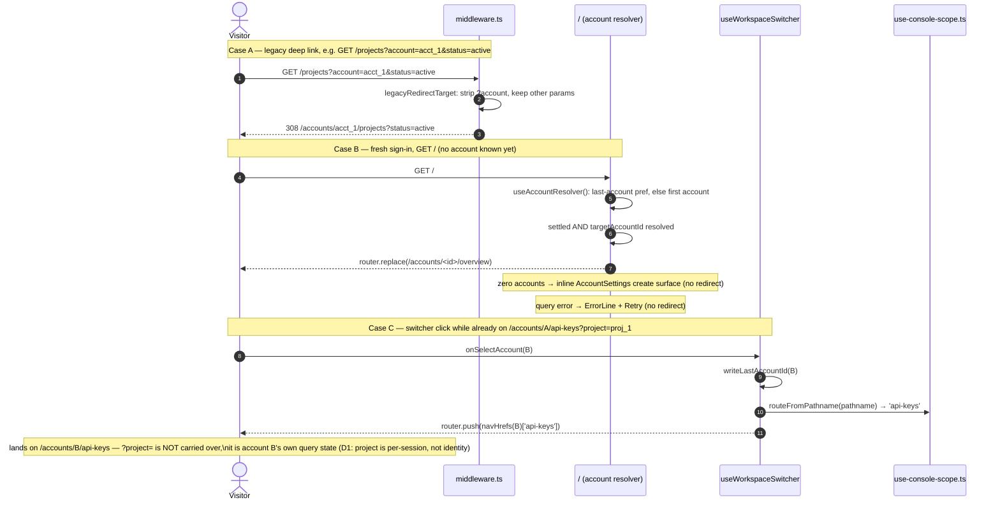
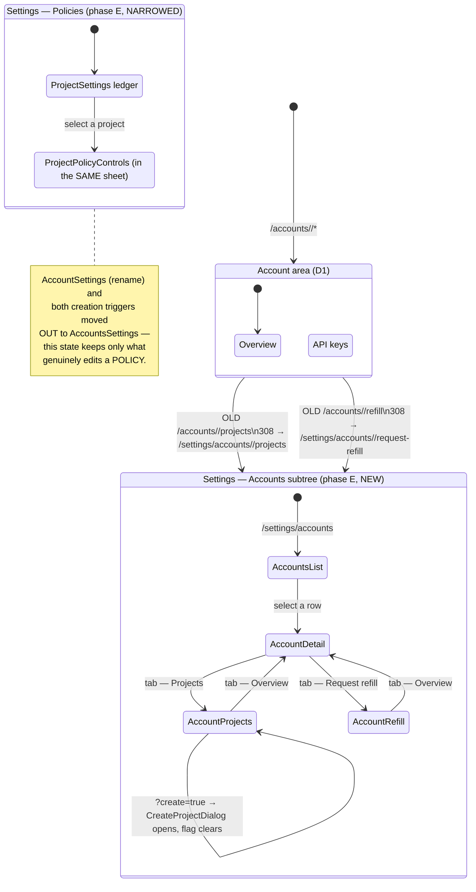

# ADR 0013: Console information architecture v3 — accounts in the path, a settings area, and the analytics doctrine

## Status

Accepted

Records the owner's dictated information architecture (2026-08-31) — the account into the URL
path, a dedicated settings area with its own left rail, per-screen account scoping, refill as a
page rather than a dialog, and a chart-choice doctrine for every usage/spend breakdown — across
[issue #368](https://github.com/ADORSYS-GIS/converse-frontends/issues/368)'s IA v3 phases 1
("account into the path"), 2 ("the settings area"), 2d (the account-scoping audit), 3 (refill as a
page, the rail narrowed), and 4 (the analytics screens). Every decision below is **implemented and
merged**; this ADR is the record, not the proposal. Several later, dated amendments (below) record
further owner directives narrower in scope than a full ADR revision: "phase E — the settings/accounts
move" relocates projects/refill under a new `/settings/accounts` subtree and narrows
`/settings/policies` and the account area's own nav; "the admin area" (same day, later still) ships
the operator dashboard approved on `claude/sb-admin-dashboards` as `/admin/overview` and moves the
budget refill review queue a second time, to `/admin/refills-queue`; "refill policies move to the
admin area" moves a third admin-only screen and splits it into three URL modes; and "`/admin/
overview`'s account enumeration is honest, not estate-wide" corrects that dashboard's own
account-coverage claim after a direct owner review finding, having confirmed by exhaustive schema
inspection that no all-accounts enumeration exists on the backend to back it.

Supersedes, in part: [ADR 0012](0012-console-visual-revamp.md) Decision 1's nav-shape clause (the
three fixed nav destinations) and Decision 7's rail clause (the rail returned, then narrowed to
one case); [ADR 0011](0011-url-first-state-nuqs.md)'s `scopeParsers.accountId` (the account moved
out of the query string and into the path — see D1). ADR 0009 carries no webpack-for-production
clause to supersede — its Decision 5 already anticipated the chart port outliving the bundler
choice, and its own "offline-first PWA" language never named webpack; the bundler swap (D7 below)
is new ground, not a correction. Both ADR 0011 and ADR 0012 carry status-note amendments pointing
here.

## Context

By ADR 0012 (2026-08-30), the console had a working two-column shell, but the account/project
scope it filtered every screen by still lived entirely in the query string
(`?account=…&project=…`), one flat `/admin` route did double duty as both an operator dashboard
and the budget review queue, refill was a shared dialog reachable from three places, and the
account/project settings screens were two more query-driven panels bolted onto the same shell —
nothing about "which account am I looking at" was addressable by path, bookmarkable per account,
or guarded against a stale/hand-edited URL naming an account the visitor cannot see. The owner's
2026-08-31 directive rebuilt the URL surface itself around the account, split settings into its
own navigable area, and — once the usage backend's real data volumes were measured against a
handful of chart choices — set a doctrine for which chart wins which breakdown, so a future screen
doesn't reopen a settled argument. issue #368 tracked the six phases this ADR closes.

## Decision

### D1 — Account-scoped paths; `/` is a last-account resolver; project stays `?project=`

Every real screen lives under `/accounts/[accountId]/{overview,projects,api-keys,refill}`
(`apps/console/src/app/(console)/accounts/[accountId]/*`). The account is a **path segment**, not
a query parameter — `use-console-scope.ts` reads it via `useParams<{accountId}>()`, and
`accounts/[accountId]/layout.tsx` is the one guard that checks a path account against the
signed-in identity's own `allAccounts` list (see D3's "not your account" case).

`/` (`app/(console)/page.tsx`) is the **account resolver**, not a screen: it resolves
`useAccountResolver()`'s `targetAccountId` — the remembered `lightbridge.last-account` preference,
falling back to the first account the backend returns — and `router.replace`s to
`/accounts/<id>/<next>` (`?next=`, default `overview`, carrying a legacy deep link's intended
destination through the hop). Three non-redirect outcomes, all gated on the accounts query having
**settled** (never mid-flight): zero accounts renders the same first-run `AccountSettings` create
surface `/settings/policies` composes (`ui-web/sections/account-settings`, the section retained
verbatim from the deleted `/settings/account` route) in place; a query error renders `ErrorLine`
with retry; resolving renders a brief `InlineStatus`.

**Project stays a query parameter, `?project=`, never a path segment.** Two reasons, both load-
bearing:

- **Bookmark stability.** An account is a long-lived identity a person returns to for months;
  a project selection inside it is a filter a person changes within a single working session.
  Putting the account in the path and the project in the query means
  `/accounts/acct_1/api-keys` is a stable bookmark to "this account's key screen" that still
  works after the project filter next to it changes, where a `/accounts/acct_1/projects/proj_9`
  path would go stale the moment the visitor's attention moved to a different project — exactly
  the churn ADR 0011's URL-first doctrine exists to avoid, applied one level down.
- **Null-as-all-projects.** The project filter's genuinely valid default is "every project in
  this account," not "the first project" — there is no natural project to redirect an empty
  path segment to the way `/` redirects to a resolved account. `use-console-scope.ts`'s own
  `?project=` parser keeps `''`/absent as that default (kept out of the URL by nuqs'
  `clearOnDefault`), and `ScopeSelect` speaks `null` for the same state. A path segment has no
  vocabulary for "absent means all"; a query parameter does, for free.

**The switcher navigates, it does not set state.** `useWorkspaceSwitcher.onSelectAccount`
(`apps/console/src/client/console-chrome.tsx`) writes the chosen id to `lightbridge.last-account`
and `router.push`es to `navHrefs(accountId)[routeFromPathname(pathname)]` — the same screen,
under the new account. Switching account is real navigation now, not a query-param write; the
command palette's "Scope" group and the resolver's own redirect follow the identical
last-account/first-account order, so all three agree on which account is "current" without
knowing about each other.

Every pre-existing deep link gets a standing 308 rather than a 404
(`apps/console/src/middleware.ts`'s `legacyRedirectTarget`): `/`, `/projects`, `/api-keys` with an
`?account=` query fold into `/accounts/<id>/<segment>`, and a bare (accountless) hit on those
paths becomes `/?next=<segment>` so the resolver can still land it once an account is known.

### D2 — The settings area: its own left rail, one shell mount, no right rail, honest disabled rows

`/settings/*` is a second navigable area, not five loose screens. It gets its **own left-sidebar
content** — a flat, ungrouped nav list of seven destinations replacing the account area's
Workspace/Account/Operator groups — while remaining inside the **same** `ConsoleShell` mount that
`app/(console)/layout.tsx` establishes for every route in the group. `areaFromPathname(pathname)`
(`'account' | 'settings'`, one predicate, `apps/console/src/client/console-chrome.tsx`) is what
`ConsoleSidebarContent`/`ConsoleTopBarContent` branch on to swap `groups` and the workspace-
switcher slot; `settings/layout.tsx` itself renders nothing but `{children}`.

**Rejected: a sibling `layout.tsx` under `/settings` mounting its own `ConsoleShell`.** That was
the naive shape a route-group nav split suggests, and it was rejected because it would remount the
sidebar/top-bar DOM node on every account ↔ settings transition — exactly the "shell rebuilt on
every navigation" anti-pattern the console-ui skill's Composition section already bans for
per-route shells (ADR 0009/ADR 0012). `console-shell-mount.test.ts` guards both
`accounts/[accountId]/layout.tsx` and `settings/layout.tsx` against importing the shell or nav
primitives at all, precisely so a future PR cannot reintroduce a second mount by accident.

**No right rail in settings, at any tier.** `InspectorRail` (`apps/console/src/containers/
inspector-rail.tsx`) resolves content for exactly one case — `/accounts/<id>/projects` with a row
selected — and `undefined` (which collapses `ConsoleShell`'s rail column entirely) everywhere
else, including every `/settings/*` route. This is narrower than ADR 0012's own "rail returned"
amendment: phase 3 deleted the rail's one _standing_ case, the `/accounts/<id>/overview`
quick-settings panel (`InspectorSettingsPanel`) — the owner's reasoning was that "account
mutations/creation/refill on the Overview rail makes no sense" once the switcher itself carries
`+ New account`, `/projects` carries `+ New project`, the Budget card links to
`/accounts/<id>/refill` (D4), and `/settings/policies` carries rename.

A settings screen with row-selection detail of its own — `/settings/refills-queue`'s review
surface — therefore opens `BottomSheet` **at every tier, including `lg`+**, not only below it:
with no rail to promote the detail into at the wide tier, the below-`lg` fallback the account area
uses (`BottomSheet` while the rail is absent) is simply the only surface settings ever has.
`ReviewDetailPanel` needs no rail companion of its own for this reason.

**The settings area's own workspace-switcher slot is a back-to-console row**, not a workspace
switcher: `BackToConsoleRow`/`BackToConsoleCompact` render `← Back to console`, linking to
`navHrefs(accountId).overview` for whichever account `useConsoleScope()` currently resolves to.
Settings is not account-scoped by path (below), so a workspace switcher there would falsely
suggest it is; the row is the one way back into the account area instead.

**Nav entries may ship disabled, with a stated reason — the honesty doctrine extended to
navigation.** `/settings/roles` renders as a real, permanent, `href`-less row
(`ROLES_DISABLED_REASON`: "Role and permission mapping is operator config today; no read API
exists (lightbridge-authz#571)") rather than being omitted. Omitting it would hide that the
destination exists at all; a row that _looks_ live but 404s is its own kind of fabrication — a
disabled row with a stated reason is the honest middle ground between "not built" and "silently
missing," extending ADR 0012 D8's "never fabricate" clause from data to navigation itself. Roles
is the one entry still disabled this way; `/settings/refill-options` shipped live in phase 3 (its
own honesty gap moved from the nav row to an inline caption — see D5).

### D3 — Phase 2d: everything under an account path scopes to it

Once the account moved into the path (D1), an audit (issue #368/#392) found several surfaces still
reading identity-wide data inside an account-scoped screen: the create-key dialog's project
picker and the api-keys/overview toolbar's project `<select>` offered projects from every account
the identity owns, not just the one in the path. `ConsoleScope.projects` now filters to
`value.accountId` — the path account — via `scopeProjectsForAccount(allProjects, accountId)`
(`apps/console/src/client/use-console-scope.ts`); the old identity-wide list survives only as
`ConsoleScope.allProjects`, documented as safe for an id→row _lookup_ against an already-scoped id
(e.g. resolving a cross-account admin queue's own `projectId`) and never as a selectable option
list.

The same audit closed two more classes of leak:

- **Disabled-until-scoped queries.** A query whose filter depends on the path account is
  constructed only once that account id is resolved — never fired identity-wide "just in case,"
  never left permanently loading for want of a filter it should already have.
- **Honest unwired captions for home-account-only backend surfaces.** Some `lightbridge-authz`
  endpoints (issue #577) only ever answer for an identity's _home_ account, not an arbitrary
  account it owns — a distinction invisible from the console's own account-scoped URL. Rather than
  silently returning another account's data or crashing, the affected surfaces render their
  ADR 0012 D8 honest-gap treatment (an omitted block with a stated reason) when the path account
  is not the home account, instead of a wrong or fabricated figure.

### D4 — Refill is a page; dialogs are for forms, not flows

`RequestRefillDialog` is deleted outright. Every refill trigger — the Budget card's action, the
command palette, a stale `/admin?request=…` deep link — now navigates to
`/accounts/<id>/refill` (`RefillCentre`), not a shared dialog instance. The distinction this
generalises: a **dialog** is the right surface for a bounded, single-step form whose result is
"submit or cancel" (`AccountNameDialog`, `CreateProjectDialog`, `ProjectNameDialog`,
`ReportExportDialog`) — still mounted once at the shell layout for exactly that reason, so more
than one entry point can open the same instance. A **flow** — refill's own request → review →
decision arc, with its own history and status, reachable from multiple entry points, worth a
bookmark or a browser Back — is a page. `RequestRefillDialog` had drifted into flow territory
(its own request history, its own status reads) while still being modal chrome; the page split
that back into a first-class URL and let the dialog concept shrink back to what it is good at.

### D5 — The analytics doctrine

The phase 4 usage/spend screens are grounded in a **measured prod distribution**, not house taste:
scanning 726k prod usage rows, the dominant shape across accounts is one series overwhelming the
rest — "top-1 ≥95% of an account's spend" is the _common_ case, not an edge case. Every choice
below follows from what actually reads honestly against that shape, re-derivable from the same
data:

- **Ranked, normalized-sparkline rows are the default breakdown** — `RankedSeriesRows`
  (`packages/ui-web/src/sections/ranked-series-rows/`), one row per key (account/project/model/
  user/api-key): rank swatch, label, formatted value, a share micro-bar, a per-row sparkline, an
  optional `Meter`, an optional delta. The share micro-bar **suppresses itself above a 95% top-1
  share** (`TOP_SHARE_SUPPRESS_BAR_PERCENT`) in favour of plain percentage text — a bar chart
  whose leading segment is a wall and whose remaining segments are hairlines communicates nothing
  a number doesn't already say better.
- **Columns (a plain stat grid) are the fallback for a sparse single series** — `LatencyStatCards`
  (below) is the shipped instance: one number, or a handful, without enough of a series to trend.
- **One `ShareBar` survives, for exactly the case a ranked list can't replace**: the estate
  overview's global model mix (`/settings/overview/usage`, `combineAccountModelResponses`'s
  `modelTotals`). `ShareBar` — a 100%-stacked bar over a ranked list, not a donut (replaced
  2026-08-29: a monochrome ramp reads badly as adjacent arcs, and a real 99/1/0.4 split produced
  sub-pixel donut slivers) — is right exactly once, when the question genuinely is "how does this
  whole add up," not "which of these rows matters." Every per-row breakdown elsewhere uses
  `RankedSeriesRows` instead, specifically _because_ of the measured top-1-dominance shape: a
  ranked list survives a 95/5/0.4 split by showing the 95% as a number and the 5%/0.4% as smaller
  numbers underneath it; a part-to-whole bar shows the same split as one full-width segment and
  two slivers, repeating the exact donut failure `ShareBar` itself was built to fix, one level up.
- **Stacked bars and area charts were tried against the same 726k-row sample and rejected**, for
  three measured reasons, not a stylistic preference: (1) **top-1 dominance collapses them to a
  single band** — the same 95%+ concentration that suppresses `RankedSeriesRows`' own micro-bar
  makes every stacked/area chart's non-leading bands sub-pixel, the identical donut-sliver failure
  in a rectangular shape; (2) **the usage backend buckets by day, not continuously** — an area
  fill implies a continuous function between samples that day-bucketed data does not have, and
  filling between real gaps (an account genuinely idle for a day) manufactures a slope that isn't
  there; (3) **a stacked or layered chart needs a legend that scales with the number of series**,
  and the same measurement that grounds the ranked-row default (many low-share tail entries per
  account) means that legend would routinely run to a dozen-plus entries — exactly the
  `ChartLegend`/`RankedSeriesRows` "Other (N)" collapse already solves for a _list_, and does not
  solve for a _chart_ at all.
- **Latency is stat cards until history depth justifies a series.** `LatencyStatCards`
  (`packages/ui-web/src/sections/latency-stat-cards/`) renders per-model p50/p95/sample-count (p99
  only past `MIN_SAMPLES_FOR_P99` samples) as a row of self-panelled cards, explicitly **not** a
  time series: the usage backend's own events are whole-window aggregate percentiles, and
  pre-bucketed percentiles cannot be validly combined across days into a trend line the way a sum
  can (`settings-overview-usage.ts`'s own doc comment) — a per-request latency time series was
  named in the build brief's "DO NOT BUILD" list for exactly this reason. The day this backend
  starts emitting per-bucket percentiles with enough history to trend honestly, this doctrine's
  own "stat cards until…" clause is what tells a future implementer to revisit it — not a silent
  reversal.
- **Sentinel identities are labelled, never dropped or fabricated.** `sentinelLabel`
  (`apps/console/src/containers/sentinel-labels.ts`) resolves two backend-emitted sentinel keys
  (`missing:keycloak:preferred_username`, `missing:github:preferred_username`) to de-emphasized
  human labels, and a repo-slug-shaped account id (`owner/repo`) to itself, de-emphasized — always
  a **real** key the backend already wrote, never one this console invents, and always shown
  (`RankedSeriesRow.subtle`), never silently excluded from a ranking.
- **Explicit limits and truncation are surfaced, not hidden.** Every usage request sets its `limit`
  explicitly (`overview-usage.ts`); the estate overview's own account fan-out is hard-capped —
  see below — and says so in its own truncation caption rather than presenting a partial ranking
  as complete.
- **Estate fan-out is capped at 25** (`MAX_FANNED_OUT_ACCOUNTS`,
  `apps/console/src/containers/usage-overview-usage.ts`). The usage API has no bulk "every account
  I can see, ranked by spend" endpoint, so `/settings/overview/usage` fans out one request per
  owned account and combines the responses client-side — uncapped, that is an N-explosion against
  an identity that owns many accounts. The cap is a **real cap on a real selection**, not yet the
  "top 25 by descending prior-period spend" the build brief ultimately wants: ranking by spend
  first would itself require fanning out to every account just to decide which 25 to keep, the
  exact explosion the cap exists to avoid. Until a bulk per-account spend summary exists
  (`lightbridge-authz#578`, "bulk list-accounts-by-period-spend for the estate overview's own
  ranking, without an unbounded per-account fan-out"), this screen takes the first 25 accounts in
  whatever order `GET /accounts` returns them and says so plainly, rather than claiming a ranking
  it cannot honestly produce.

### D6 — "This month" is the default range

The account-lens and estate-overview dashboards default their range picker to `mtd` ("This
month"), which `resolveRangeWindow` resolves to a **calendar-month span** (UTC month start → now)
— not a rolling 30-day window, which is what every other preset in the same picker is
(`RANGE_DAYS`, `apps/console/src/containers/overview-usage.ts`). The reasoning is billing-window
alignment: the account's spend, budget ceiling and refill cadence are all denominated in calendar
months, so a dashboard whose default window is anything else (a rolling 30 days, which drifts
across a month boundary mid-billing-period) would show a number that does not match what the
account is actually being billed against. Every other preset stays a plain rolling window because
nothing else on those screens is billing-period-denominated.

### D7 — Production builds on Turbopack; the CBOR codec ships via Dockerfile staging; glibc stays

**The console runs Turbopack for both development and the production build**
(`next dev --turbopack`, `next build --turbopack`). Production used to stay on webpack for one
reason — `@serwist/next`, the Serwist PWA integration that compiled `src/sw.ts` into
`public/sw.js`, was a webpack plugin, and Turbopack never calls the `webpack()` config hook at
all — and that reason is gone: the console now runs **`@serwist/turbopack`**, whose
`createSerwistRoute` bundles `src/sw.ts` with `esbuild-wasm` inside an ordinary route handler
(`src/app/serwist/[path]/route.ts`) rather than a build-time bundler plugin. The service worker is
served from **`/serwist/sw.js`**, generated on demand (dev) or at static-generation time
(`next build --turbopack`) — never written to `public/` as a build artifact any more.

Moving production onto Turbopack surfaced a real build panic that is now recorded rather than
worked around silently: `outputFileTracingIncludes`, the mechanism `next.config.mjs` used to pull
`@cratestack/cbor`'s native N-API packages into the standalone output, crashes Turbopack's NFT-JSON
emitter outright whenever a glob resolves through a pnpm-store symlink to a _directory_ (verified:
narrowing the glob to only the cbor packages still panicked, on a different package; there is no
safe glob to write). The fix moved the concern out of `next.config.mjs` entirely — getting the
actual `@cratestack/cbor*` package files into the image is now `apps/console/Dockerfile`'s job (a
`COPY` of the pnpm store dirs from the build context, plus re-running
`scripts/link-standalone-cratestack.mjs` at image-build time to re-materialize the top-level
`node_modules/@cratestack/*` scope links); `serverExternalPackages` (a Next feature independent of
bundler choice) still keeps the bundler from inlining the native addon.

**The base image stays glibc** (`node:22.23.2-alpine3.24` — musl), a known, filed, and unresolved
gap, not a silent one: `@cratestack/cbor-node`'s prebuilt bindings ship no musl variant and no
working wasm32-wasi fallback, and its own loader (`native.mjs`) checks `isMusl()` before trying any
glibc candidate and skips them all when it's true — genuinely true on Alpine regardless of the
`gcompat`/`libc6-compat` shim already installed for `.node` file `dlopen` compatibility. Net
effect on `linux/amd64` (the real deployment target): `import('@cratestack/cbor')` rejects with
"Cannot find native binding" server-side, which the usage-scope guard's own `loadRpc` fails
_closed_ on rather than crashing the route. This predates the Turbopack migration (same base image,
same cratestack pin, since the Dockerfile's first commit); fixing it — a musl build from cratestack
upstream, or moving off Alpine — is `cratestack#850`, a separate, larger decision than a bundler
swap.

## Diagrams

The two-area shell as a state machine — which nav surface, which rail, and the one guard the
account area carries that settings does not:

```mermaid
stateDiagram-v2
    [*] --> Resolving: GET / (no account in path)

    state "Account area" as Account {
        [*] --> AccountGuard
        AccountGuard: accounts/[accountId]/layout.tsx\nchecks accountId ∈ allAccounts (settled only)
        AccountGuard --> NotYourAccount: settled AND unknown id
        AccountGuard --> Overview: known id — /overview
        AccountGuard --> Projects: known id — /projects
        AccountGuard --> ApiKeys: known id — /api-keys
        AccountGuard --> Refill: known id — /refill (D4)
        Projects --> Projects: select row → InspectorRail (lg+) / BottomSheet (<lg)
        NotYourAccount --> [*]: "Back to your accounts" → /
    }

    state "Settings area" as Settings {
        [*] --> SettingsOverview: /settings → /settings/overview/usage
        SettingsOverview --> Tiers
        SettingsOverview --> Policies
        SettingsOverview --> RefillOptions
        SettingsOverview --> RefillsQueue: isAdmin only
        SettingsOverview --> Info
        SettingsOverview --> RolesDisabled: nav row renders, no route (D2)
    }

    Resolving --> Account: targetAccountId resolved → replace /accounts/<id>/<next>
    Resolving --> ZeroAccounts: settled, accounts.length === 0
    Resolving --> ResolverError: query error
    ZeroAccounts --> Account: AccountSettings create → list settles non-empty → redirect fires
    Account --> Settings: nav "Settings" (areaFromPathname flips; ConsoleShell mount unchanged)
    Settings --> Account: "← Back to console" (BackToConsoleRow) → /accounts/<id>/overview

    note right of Account
      Right rail: ONLY /accounts/<id>/projects
      with a row selected (D2). Absent everywhere
      else in this area, and absent everywhere
      in Settings — never an empty placeholder.
    end note
```

`accounts/[accountId]/layout.tsx:29-58`, `app/(console)/page.tsx:45-90`,
`client/console-chrome.tsx:82-84` (`areaFromPathname`), `containers/inspector-rail.tsx:50-55`.

Routing/redirect resolution — a legacy deep link, a fresh sign-in, and a switcher click, through
the same three resolvers:

`middleware.ts:21-95` (`LEGACY_ACCOUNT_SCOPED_SEGMENT`, `LEGACY_STATIC_REDIRECT`,
`legacyRedirectTarget`), `app/(console)/page.tsx:45-70`, `client/console-chrome.tsx:435-470`
(`useWorkspaceSwitcher.onSelectAccount`), `client/use-console-scope.ts:94-137`.

## Consequences

- `docs/design/console-redesign/README.md` §3 (shell and grid) and §5 (screen specs) are rewritten
  to the account-path/two-area reality; the nav destinations table gains the settings tree and the
  refill page.
- `.claude/skills/console-ui/SKILL.md`'s rail section is corrected to the single narrowed case
  (D2/D3), and gains a compact analytics/chart-choice section pointing at D5 rather than
  re-deriving it.
- `docs/identity-and-account-visibility.md` gains a short section on account-scoped URLs: a deep
  link carries the tenant in the path now, not just the query, and the "not your account" guard
  (D1/`accounts/[accountId]/layout.tsx`) is the enforcement point.
- The ratchet suites (`class-budget.test.ts`, `base-ui-adoption.test.ts`,
  `section-class-audit.test.ts`) are re-measured against the tree this ADR describes: 43
  hand-written utilities across 50 components (still none over budget, still zero `BUDGET`
  entries), one open `base-ui-adoption` gap (`row-action-group`, an explicit refusal, unchanged),
  and `section-class-audit` pins added for the six sections D5/D2/D4 introduced
  (`ranked-series-rows`, `latency-stat-cards`, `refill-history`, `refill-request-form`,
  `policy-simulator`, `project-policy-controls`).
- `RequestRefillDialog` and `InspectorSettingsPanel` are deleted outright, not deprecated in place,
  per house style. The standalone `/admin` route followed them at merge time (D2); D8's same-day
  amendment above reopens the path as a real admin AREA (`/admin/overview`, `/admin/refills-queue`)
  rather than reviving the old one-screen route.

## Alternatives considered

- **Keep the account in the query string and add a stricter parser.** Rejected — no query-string
  discipline fixes a bookmark that silently points at the wrong account depending on load order;
  the path is the only place "which account" can be the first thing resolved, before any component
  runs.
- **Project also in the path** (`/accounts/<id>/projects/<projectId>/...`). Rejected — see D1's
  bookmark-stability and null-as-all-projects reasoning; a path segment cannot represent "no
  project selected, meaning all of them" without inventing a sentinel segment, which is worse than
  the query parameter it would replace.
- **A settings `layout.tsx` that mounts its own shell.** Rejected — see D2; it was the shape
  actually tried before this ADR's own `console-shell-mount.test.ts` was written to prevent it.
- **A `DonutChart`/stacked-bar upgrade for the estate overview instead of `RankedSeriesRows`.**
  Rejected on the same 726k-row measurement that grounds D5 generally — see D5's own three
  reasons; a bigger, fancier part-to-whole chart still fails the way the original donut did once
  one series dominates.
- **A rolling 30-day default range for every dashboard, settings included.** Rejected for the
  billing-denominated screens (D6) — a rolling window drifts across the calendar-month boundary
  the account's own budget and refill cadence are measured against; kept as the default for every
  _other_ preset, where nothing else on the screen is billing-period-denominated.

## Follow-ups

None outstanding for this ADR's own scope — IA v3 phases 1-5 and 2d (issue #368) are merged. Filed
and tracked elsewhere, not by this ADR: `lightbridge-authz#571` (Roles read API),
`lightbridge-authz#577` (home-account-only surfaces for a plain, non-admin second-account owner —
explicitly does NOT cover the admin `budget:read` path the admin-area amendment's dashboard 4
uses), `lightbridge-authz#578` (bulk list-accounts-by-period-spend — also the gap behind that
amendment's own single-account-scoped latency board), `cratestack#850` (musl build for
`@cratestack/cbor-node`), `lightbridge-authz#594` (no account-membership concept exists — the
phase E amendment below). The admin-area amendment (further below) adds two more: `lightbridge-authz#556`
(no listing of decided augmentation requests) and `lightbridge-authz#597` (no error/status signal
on `UsageSeriesPoint`) — both real backend gaps that amendment's live route captions rather than
papering over. The account-enumeration-honesty amendment (last, below) adds `lightbridge-authz#602`
(operator-privileged all-accounts enumeration — confirmed absent from `authz.cstack` by exhaustive
inspection, not merely undiscovered).

## Amendment (2026-08-31): phase E — the settings/accounts move

A further owner directive, verbatim, on top of D2/D4 above:

> "On the page /settings/policies, there's no sense in having account or project creation. The
> page is '/settings/policies'. Instead remove that and add /settings/accounts, and project
> creation would be inside /settings/accounts/\<account-id\>/projects?create=true. We will move
> /projects to /settings/accounts/\<account-id\>/projects too. And /settings/accounts/\<account-id\>
> would be for account related settings like e.g members."
>
> "I don't see a clear place to request a refill... So we'll add it under
> /settings/accounts/\<account-id\>/request-refill instead. Refill must be account scoped."

This does not reopen D1's account-scoped-path decision or D2's settings-area decision — it
relocates two whole screens (projects, refill) that D1 originally placed under
`/accounts/[accountId]/*` into the settings area's own new "Accounts" subtree, and moves account
identity/creation (which D2's phase 2 had put on `/settings/policies`, alongside project policy
editing) to a dedicated per-account settings screen. Concretely:

- **`/settings/accounts`** (`AccountsCentre`) — the identity's account family (the SAME data the
  workspace switcher already lists, `AccountDirectory`), each row linking to its own detail page,
  plus `+ New account` — moved here verbatim off `/settings/policies`'s own `PageHeader` action.
- **`/settings/accounts/<id>`** (`AccountDetailCentre`) — account-scoped settings: `AccountSettings`
  (rename + id/status/tier facts, also moved off `/settings/policies` verbatim), a `Budget` card
  (the honest budget-ceiling fact, home-account-gated exactly like `/`'s Budget card and the
  refill screen — Phase 2d's `isHomeAccount`/`BUDGET_HOME_ACCOUNT_ONLY_NOTE`), and a `Members`
  card. **Members ships disabled with a stated reason, not fabricated or omitted**: `Account`
  carries no membership concept at all today (`authz.cstack`'s own NOTE on the model — "per
  ADR-0006 there is no more membership/role concept... one account is one person"; only
  `ProjectMember`/`listProjectRoster` exist, both project-scoped). Filed as
  `lightbridge-authz#594`, asking which of two outcomes applies: a real account-membership feature
  (a new `AccountMember`-shaped model + procedure, mirroring `ProjectMember`), or a recorded
  "intentionally out of scope" decision — either answer lets the console's caption become a
  permanent fact instead of an open question.
- **`/settings/accounts/<id>/projects`** — the projects ledger (`ProjectsCentre`, unchanged
  internally), moved wholesale off `/accounts/<id>/projects` — the old path 308s here verbatim,
  every query param surviving (`middleware.ts`'s new `ACCOUNT_SCOPED_PATH_MOVE` table, a THIRD
  legacy-redirect shape alongside D1's `LEGACY_ACCOUNT_SCOPED_SEGMENT` and D2's
  `LEGACY_STATIC_REDIRECT`: the account id is already IN the old path here, unlike either existing
  table). `?create=true` opens the create-project dialog on load (`useProjectsEntryParams`, a
  one-shot landing flag distinct from the dialog's own shared `?new-project=` open state) and
  clears itself immediately, per the owner's own URL shape.
- **`/settings/accounts/<id>/request-refill`** — the refill request flow (`RefillCentre`,
  unchanged internally), moved off `/accounts/<id>/refill` the same way, `?project=` included —
  "refill must be account scoped" was already true (D4), this only relocates where that
  account-scoped screen lives.
- **A new three-tab sub-nav** (`AccountDetailSubNav`, plain `SubNav orientation="horizontal"`) ties
  the three screens above together — mounted on all three, computing its own `active` tab off
  `usePathname()`.
- **`/settings/policies` narrows to exactly "project policy editing"**: `AccountSettings` and both
  creation triggers are gone; what remains is the searchable project ledger (still needed as the
  picker `ProjectPolicyControls` acts on) plus the model-policy controls themselves. Renamed
  "Project policies" in the nav (was "Account / Project policies") — the old name became inaccurate
  once the account half moved out.
- **The account area's Workspace group narrows to Overview/API keys.** `navHrefs`/`navGroups`
  (`console-chrome.tsx`) drop `projects`/`refill` entirely — `ConsoleRoute` no longer carries a
  `'projects'` value. `/accounts/[accountId]/*` now owns exactly what D1's own guard layout
  protects: `overview`, `api-keys`.
- **The right rail loses its one remaining live case.** ADR 0013 D2/D3 had already narrowed the
  rail to exactly ONE route/state (`/accounts/<id>/projects` with a row selected); moving that
  route into the settings area — which has no right rail at any tier, D2 — removes that case
  without leaving another. `apps/console` deletes the rail's whole wiring (`containers/
inspector-rail.tsx`, `client/use-rail-width.ts`, and `(console)/layout.tsx`'s `rail`/`railWidth`
  props) rather than keeping code that would always resolve to "no rail" — `ConsoleShell`'s
  `rail`/`railWidth` props remain a real primitive capability in `packages/ui-web` (its own
  stories still exercise them directly), they simply have no live caller left in `apps/console`.
  `/settings/accounts/<id>/projects`' own row-selection detail is `BottomSheet` at every tier
  instead — the same surface `/settings/refills-queue` already used for the identical reason.

### Diagrams (phase E)

Where the two moved routes land, and what `/settings/policies` sheds:

`middleware.ts`'s `ACCOUNT_SCOPED_PATH_MOVE` is the redirect table backing the two 308 edges above;
`AccountDetailSubNav` (`apps/console/src/containers/account-detail-sub-nav.tsx`) is the three-way
tab loop inside `AccountsSettings`.

### Consequences (phase E)

- `docs/design/console-redesign/README.md` §3 (nav destinations table, shell diagram) and §5
  (screen specs) are updated for the narrowed Workspace group, the new `/settings/accounts/*`
  screens, and `/settings/policies`'s narrowed scope.
- `packages/ui-web/src/pages-stories/projects.stories.tsx` is renamed
  `settings-accounts-projects.stories.tsx` (`git mv`, `Pages/Settings/AccountProjects`) and loses
  its rail entirely — `BottomSheet` at every tier, no `portalClassName="lg:hidden"` gate. A new
  `settings-accounts.stories.tsx` (`Pages/Settings/Accounts`) covers both the list and the detail
  screen; `settings.stories.tsx` narrows to `/settings/policies` alone. `shell-persistence.stories.tsx`
  swaps its Overview↔Projects pair (the old "harder case: a rail mounts/unmounts") for
  Overview↔API-keys, since no route anywhere carries a rail case any more.
- `apps/console/src/containers/use-project-rename.ts` collapses from a two-piece full/lightweight
  split (a full controller in the deleted inspector rail, a lightweight trigger in the
  `BottomSheet`) to one full controller, mounted directly in `projects-centre.tsx` — there is only
  one detail surface left to mount it from.
- `RequestRefillDialog`'s replacement, `RefillCentre`, and `ProjectsCentre` are both `git mv`d
  intact (containers, hooks, tests) — their own internal logic is unchanged; only their route path
  and the `refillHref`/entry-flag plumbing pointing at that path change.

### Alternatives considered (phase E)

- **Keep account creation on `/settings/policies`, alongside project policy editing.** Rejected —
  the owner's own reasoning: a governance-controls page has no more business hosting entity
  creation than the old Projects ledger had hosting account rename (D2's own precedent, "We cannot
  modify account core information on the same page we're filtering," applied one level over).
- **A fourth path segment for refill under the account area instead of settings**
  (`/accounts/<id>/refill`, left in place). Rejected — the owner's directive was explicit ("We will
  move /projects to /settings/accounts/\<account-id\>/projects too... Refill must be account
  scoped [under /settings/accounts]"), and keeping refill account-area-scoped while projects moved
  would have split one account's settings across two nav surfaces for no reason.
- **Fabricate an account membership list from `ProjectMember` roster de-duplication.** Rejected —
  aggregating every project's roster and presenting it as "this account's members" would silently
  conflate project-level access with account-level access, the exact kind of invented fact the
  console-ui skill's honesty doctrine (ADR 0012 D8) exists to prevent. `lightbridge-authz#594` asks
  the real question instead.

## Amendment (2026-08-31, later): the admin area

A further owner directive, on top of the original ask that opened issue #368 ("Since I'm an admin,
I should also have a block /admin for admin stuffs...") and the design batch it produced: eight
operator dashboards, built as a Storybook-only page story (`Pages/AdminOverview`,
`claude/sb-admin-dashboards`@aaf3fe6) and approved verbatim — _"Approved, build the /admin area."_

This does not reopen D1 or D2 — it adds **a third navigable area** (`ConsoleArea = 'account' |
'settings' | 'admin'`, `areaFromPathname`), sharing D2's same single shell mount rather than a
fourth `ConsoleShell` (the mechanism D2 established for "settings replaces the account area's nav
in place" repeats verbatim for "admin replaces it too"). `/admin` itself resolves to
`/admin/overview`, the same bare-segment-redirects shape `/settings` already uses. The area holds
two destinations:

- **`/admin/overview`** — the eight-board operator dashboard, gated server-side by the identical
  `isAdmin(session.user.roles)` + `notFound()` mechanism D2 already uses for the refills queue.
- **`/admin/refills-queue`** — the budget refill review queue, moved a SECOND time (`/admin` →
  `/settings/refills-queue` under D2 → `/admin/refills-queue` here), `git mv`d with its server-side
  gate kept byte-for-byte, same as every prior move of this one screen. It reads better as a
  sibling of the dashboard that already surfaces its own "Queue depth" stat than as one more
  settings row once an admin area exists to hold it. `/settings/refills-queue` 308s to the new path
  (`middleware.ts`'s `LEGACY_STATIC_REDIRECT`), and `settingsNavGroups` drops the row —
  `/settings/*` genuinely has nothing admin-only left in it after this move.

**The account area's Operator group now names its one row "Refill requests" but links into
`/admin/overview`, not straight into the queue** — an operator opening the account-scoped nav
lands on the dashboard first, with the queue one click away (dashboard 5's own "Queue depth" stat
and the admin area's own "Refills queue" nav row both reach it). The settings area's flat nav list
loses its "Refills queue" row entirely (moved out, not disabled).

**Two planned siblings are recorded here and built nowhere**: `/admin/ide-usage` and
`/admin/copilot-usage`, both named by the owner as future admin-area destinations. Nothing for
either exists yet — no route, no nav row (not even a `disabled` one, since a `disabled` row still
promises a stated backend gap this amendment has not investigated), no container, no hook. This
paragraph is the whole of what this amendment commits to for them: a place they will eventually
go, not a shape they will take.

**The live route diverges from the approved page story in two places, both real backend gaps
rather than a design change** — the story's own fixtures are unchanged and stay the approved
ground truth for what this dashboard is FOR; only the wiring had to degrade honestly where the
backend cannot back the fixture:

- Dashboard 5 (refill operations) ships queue depth only — no decisions-over-time board, no
  median-time-to-decision card. `listPendingAugmentationRequests` is a PENDING-only read path (the
  same reason D2's own Decided-tab deletion cites); there is no procedure anywhere that lists
  DECIDED requests or carries a decision timestamp. Filed as `lightbridge-authz#556`.
- Dashboard 6 (request volume & errors) ships the request-count line only. `UsageSeriesPoint`
  (`openapi/usage.backend.yaml`) carries no error/status field at all — filed as
  `lightbridge-authz#597`.
- Dashboard 7 (latency) scopes `LatencyStatCards` to the estate's single busiest account rather
  than an estate-wide blend: per-account percentiles cannot be validly averaged into one honest
  estate figure, and the usage API has no bulk multi-account query to compute a true combined
  percentile server-side either — the same `lightbridge-authz#578` gap D5's own account cap
  already cites, not a new one.

**Dashboard 4 (budget pressure) needed no gap caption at all**, despite reading every account's own
budget ceiling: `getBudgetBalance(budgetAccountId, period)` is the operator-only `budget:read`
equivalent of `getMyBudgetBalance`, and `lightbridge-authz#577` (the self-service, non-admin
budget-domain gap this ADR already cites above) explicitly rules admin `budget:read` behavior OUT
of its own scope. An operator genuinely can read any account's `effectiveBudgetMicros` today; this
dashboard is the first screen in this console to actually call that procedure.

### Consequences (the admin area)

- `app/(console)/admin/{overview,refills-queue}/page.tsx` are the two real route segments;
  `app/(console)/admin/page.tsx` redirects to `/admin/overview`.
- `apps/console/src/containers/admin-overview-usage.ts` (pure adapters, unit-tested),
  `use-admin-overview-screen.ts` (the fan-out hook) and `admin-overview-centre.tsx` (the
  container) supply the eight boards' real data.
- `client/console-chrome.tsx` gains `adminNavGroups` (mirroring `settingsNavGroups`'s shape) and a
  `BackToConsoleRow`-style row back into the account area; `navHrefs.admin` now points at
  `/admin/overview`.
- `middleware.ts`'s `LEGACY_STATIC_REDIRECT` drops the now-inapplicable `/admin` → `/settings/
refills-queue` row (`/admin` is a live route again) and gains `/settings/refills-queue` →
  `/admin/refills-queue`.
- `containers/refills-queue-centre.tsx` and its own screen hook are `git mv`d intact from
  `settings/refills-queue/` to `admin/refills-queue/` — internal logic unchanged, only the route
  segment moves.

## Amendment (2026-08-31, later still): refill policies move to the admin area, and split into three URL modes

A third same-day owner ruling, this time on `/settings/refill-options` (the Phase G human-form
redesign, `claude/sb-refill-options-human`@745a895) rather than the refills queue, but the
identical shape of correction as both amendments above — verbatim: _"Refill options are for admins
only. Not normal users. And we don't 'Simulate' them on the same page where we create them.
/admin/refill-policies should be for listing them /admin/refill-policies?create=true or
/admin/refill-policies?edit=<id> to create or edit, respectively,
/admin/refill-policies?simulate=<id> to simulate."_

This does not reopen D1, D2 or the admin-area amendment above — it is the admin area's THIRD
destination, gated the identical `isAdmin(session.user.roles)` + `notFound()` way as its two
siblings, and it moves `/settings/refill-options` off the settings area entirely: `settingsNavGroups`
drops the row (five real destinations left, `roles` still the one disabled exception), and
`/settings/refill-options` 308s to `/admin/refill-policies` (`middleware.ts`'s
`LEGACY_STATIC_REDIRECT`, the same mechanism the refills-queue move already established).

**The second half of the ruling — never simulate on the same view as create/edit — is new
information this ADR had not yet stated anywhere**: the Phase G design batch built `RuleSetForm`,
`ScenarioForm`, `PolicySimulator` (composing both), `RefillPolicyManual` and
`RefillPolicyStatusStrip`, but shipped them all on ONE `/settings/refill-options` page — a "your
current ladder" card next to a "try a policy" card that itself mixed rule-set authoring with
scenario simulation in one form. The owner's correction splits authoring from simulation into
mutually-exclusive URL modes on the new route, matching the `?create=true` precedent the
settings/accounts work already established (Amendment, phase E, above) rather than inventing a
fourth param shape:

- **List** (bare path) — what is honestly listable with no discovery procedure for which policy
  sets exist (`converse-frontends#368`, unchanged limitation): a new `RefillPolicyLookup` section
  (an id field an admin types, `RefillPolicyStatusStrip` for whatever `getBudgetPolicyStatus` says
  about it, and `Edit`/`Simulate` actions once ready), "Your current ladder" (unchanged, reused
  verbatim from the old page), and the `RefillPolicyManual` explainer.
- **`?create=true`** — `RuleSetForm` alone (no `ScenarioForm` beside it any more), authoring a
  brand-new policy set. This amendment also wires the real write path Phase G's own PR body had
  deliberately left unwired (_"packages/ui-web only — no apps/console wiring in this batch"_): the
  generated contract carries TWO real mutations for this, both genuine and both wired rather than
  picking one — `activateBudgetPolicy` (new rule data, live immediately) as the primary action, and
  `createBudgetPolicyRevision` (new rule data, inert until a separate activation) as a secondary
  one. Neither is a rollback UI (`activateBudgetPolicy`'s OTHER argument shape, `{ revisionId }`) —
  that is a distinct, unrequested feature this amendment does not build speculatively.
- **`?edit=<id>`** — the identical form, honestly labelled "author a replacement revision for
  `<id>`": the current revision's CONTENT still has no read API (`converse-frontends#368`,
  unchanged), so this always starts from `createBlankRuleSet()`, stated inline rather than
  pretended away — never a fake prefill.
- **`?simulate=<id>`** — `PolicySimulator`, unchanged internally (`RuleSetForm` + `ScenarioForm` +
  a `simulateBudgetPolicy` decision readout), just relocated to its own mode. `<id>` is display
  context only — `simulateBudgetPolicy` itself takes no `policySetId` at all (it is stateless,
  reads no stored policy, ADR-0007's own contract), a fact the page states in its own subtitle.

`policySetId` (the list mode's own lookup target) is a fourth URL param on the same route
(`?policy-set=`, debounced onto the URL the same way `apiKeysParsers.search`/`manageParsers.search`
already are) rather than component-local state: which policy set an admin is looking at is exactly
the shareable "what am I looking at" ADR 0011 puts in the URL, not a search box scoped to one
render.

### Consequences (refill policies as an admin surface)

- `app/(console)/admin/refill-policies/page.tsx` is the third admin route segment, gated
  server-side identically to its two siblings; `app/(console)/settings/refill-options/` is deleted
  outright (`git rm`, not `git mv` — the container underneath changed shape too much for a clean
  move, see below).
- `containers/admin-refill-policies-centre.tsx` (the mode-routing presentational container) and
  `containers/use-refill-policies-screen.ts` (the data adapter — list lookup query,
  `useBudgetRefillLadder` reused verbatim, the two create/edit mutations, the simulate scratch pad)
  replace `refill-options-centre.tsx`/`use-refill-options-screen.ts` outright.
- `client/console-chrome.tsx`'s `adminNavGroups` gains a third row ("Refill policies" →
  `/admin/refill-policies`, `AdminRoute` gains `'refill-policies'`); `settingsNavGroups` loses its
  "Refill options policies" row and `SettingsRoute` drops `'refill-options'`. The command palette's
  admin-only `Actions`/`Navigate` group gains a matching "Refill policies" entry.
- `client/url-state.ts` gains `adminRefillPoliciesParsers` (`policy-set`/`create`/`edit`/
  `simulate`) and `ADMIN_REFILL_POLICIES_MODE_OPTIONS` (the three mode params write with `push`;
  the lookup stays the hook's own default `replace`).
- `middleware.ts`'s `LEGACY_STATIC_REDIRECT` gains `/settings/refill-options` →
  `/admin/refill-policies`, query params surviving verbatim (same shape the refills-queue row
  already established).
- `packages/ui-web`: a new `sections/refill-policy-lookup` (the list mode's id-lookup + status +
  actions zone); `rule-set-form`/`refill-scenario-form` each gain a real `createBlankRuleSet()`/
  `createBlankScenario()` runtime export (the create/edit/simulate containers' actual starting
  drafts — never importing a `fixtures.ts` file into production code);
  `refill-policy-status-strip` exports its `unavailable` caption as `NO_POLICY_SET_ID_CAPTION` so
  the real container and its own `fixtures.ts` state the identical sentence. The page story moves
  from `Pages/RefillOptions` to `Pages/AdminRefillPolicies`, with a story per mode.

## Amendment (2026-08-31, later still): `/admin/overview`'s account enumeration is honest, not estate-wide

A direct owner review finding on the admin-area amendment above, verbatim: *"/admin/overview is
overview for ALL account, not just the one the user is bound to. ALL of them."* The dashboard's own
subtitle already claimed "Estate-wide"; the fan-out behind it (`use-admin-overview-screen.ts`)
enumerated only the operator's own account family (`scope.allAccounts`, `model.Account.list`) —
because that listing was the only account enumeration the console had any RPC path to. The
subtitle was fabricating coverage the wiring never had.

Investigated before writing a single line of frontend code: `schema/authz.cstack` was
exhaustively grepped for any operator-privileged account enumeration — a list-all-accounts
procedure, an admin accounts resource, pagination transcending family scope, an operator flag on
`Account`'s `@@allow`. **None exists.** `model.Account` carries exactly one `@@allow` clause
(`(userId == auth().id) && auth().rpcScope == "crud" && auth().permAccountRead == true`,
`authz.cstack:244`) — self-family only. The schema's only two cross-tenant admin reads,
`getBudgetBalance`/`listBudgetGrants` (`authz.cstack:1482`, `:1544`), both require an
ALREADY-KNOWN `budgetAccountId` and enumerate nothing. Filed as `lightbridge-authz#602`
("operator-privileged all-accounts enumeration for the admin estate").

Per this ADR's own no-fabrication doctrine (D8, inherited from ADR 0012), the fix ships in two
parts rather than leaving the false claim in place until the backend ticket lands:

- **The fan-out widens to every account id the console can legitimately discover as an
  operator**, not just family: `admin-overview-usage.ts`'s `estateAccountIds` unions
  `scope.allAccounts` with every account id surfacing in the GLOBAL pending refill queue
  (`listPendingAugmentationRequests({budgetAccountId: null})`, a real, if partial, cross-family
  signal — an account with a pending refill request is a genuine OTHER account, just not the whole
  estate). Deduplicated, capped at the pre-existing `MAX_FANNED_OUT_ACCOUNTS` ceiling.
- **The usage-scope-guard gained a role-verified admin bypass**, or the widened family+queue ids
  above would be discoverable but not actually queryable: `server/usage-scope-guard.ts`'s
  `guardUsageScope` now accepts an `isAdmin` flag that, for `scope: 'account'` only, skips the
  per-tenant ownership resolution entirely — mirroring `getBudgetBalance`/`listBudgetGrants`'s own
  shape (a coarse RBAC permission gate standing in for a per-tenant predicate the schema has no
  way to express for the admin case either). `isAdmin` is computed exactly once, server-side, in
  `app/api/usage/[...path]/route.ts`, from `isAdmin(session.user.roles)` — the decrypted session
  cookie's own role claims, the IDENTICAL check `app/(console)/admin/overview/page.tsx` already
  gates the route itself with — never a client-supplied field. The non-admin path (ownership
  resolution, the home-account fast path) is unchanged; `scope: 'project'` gets no bypass, admin or
  not, because `model.Project.read`'s own `@@allow` has no admin bypass on the backend either.
- **The subtitle and a new, always-shown coverage caption say the truth.** `PageHeader`'s subtitle
  drops "Estate-wide" for `ESTATE_SUBTITLE_SCOPE` ("Your accounts + refill queue");
  `estateCoverageCaption` renders under it whenever there is at least one candidate account — not
  only when the cap actually truncated something, since even an un-truncated fan-out here is
  still "family + pending refill requesters," never literally every account. States the real
  family/queue split and cites `lightbridge-authz#602` by number.

This is the SAME shape of correction the admin-area amendment above already establishes for
dashboards 5/6/7 (a real backend gap, captioned rather than fabricated) — not a new pattern, one
more application of it, this time to the page's own header rather than one dashboard.

### Consequences (account-enumeration honesty)

- `apps/console/src/containers/admin-overview-usage.ts` gains `estateAccountIds`,
  `estateCoverageCaption`, `ESTATE_SUBTITLE_SCOPE` (all pure, unit-tested in
  `admin-overview-usage.test.ts`).
- `apps/console/src/containers/use-admin-overview-screen.ts`'s fan-out source changes from
  `allAccounts.slice(0, MAX_FANNED_OUT_ACCOUNTS)` to `estateAccountIds(allAccounts, pendingQueue
  AccountIds, MAX_FANNED_OUT_ACCOUNTS)`, fed by a new one-shot `listPendingAugmentationRequests
  ({budgetAccountId: null})` scan (`PENDING_QUEUE_ACCOUNT_SCAN_LIMIT`) separate from
  `useRefillsQueueScreen`'s own UI-paginated queue-screen query.
- `apps/console/src/server/usage-scope-guard.ts`'s `guardUsageScope` gains an optional 5th
  parameter, `isAdmin?: boolean`, defaulting to non-admin behavior when omitted — every pre-
  existing call site is unaffected; `apps/console/src/app/api/usage/[...path]/route.ts` is the
  one call site that now passes it, computed from `isAdmin(session.user?.roles ?? [])`.
- `packages/ui-web/src/pages-stories/admin-overview.stories.tsx`'s subtitle and a new
  `InlineStatus` caption directly under `PageHeader` are updated to match — the design batch's
  original "Estate-wide" wording was the idealized pre-investigation target, not something the
  live route can honestly claim while `lightbridge-authz#602` is open.
- Backend follow-up filed: `lightbridge-authz#602`. Once it ships, `estateAccountIds`'s
  pending-queue half becomes unnecessary and the fan-out can call the real enumeration directly —
  tracked there, not here.

## Amendment (2026-08-31, owner review round 2): the account-area rail's admin shortcut moves into settings, and refill-policy creation moves off a query param onto its own route

A second owner review pass on the same day as the two amendments above, issue #368, findings #1
and #4 verbatim, addressed together here because both are "an entry point moved off where this ADR
last put it, onto a plainer surface":

**Finding #1 — "Which button leads to the admin pages? Oh wait, it's the button 'Refill queue'
that leads to 'admin'? Please remove that. Instead, inside of the settings, place a permission
gated button 'Admin' that leads to admin."** The account area's Operator group (added by the "the
admin area" amendment above, one row, "Refill requests," linking to `/admin/overview`) is deleted
outright, not relabelled or re-routed — `navGroups` (`client/console-chrome.tsx`) now builds
exactly the two groups D1/D2 originally gave it (Workspace, Account) and takes no `isAdmin`/
`refillCount` params at all, there being nothing left in it to gate. The replacement lives one
level in: `settingsNavGroups` gains an `isAdmin`-gated "Admin" row, appended LAST after the six
real settings destinations, linking to `/admin/overview` — the included-or-omitted contract every
other gated row in this file already follows (never a `disabled` placeholder; an admin who is
signed in but not currently in the settings area simply does not see the row, the same as any
other settings-only content). The account-area rail (`/accounts/<id>/{overview,api-keys}`) now
renders byte-identical nav content for an admin and a non-admin — there is no role-gated content
left on it at all. The pending-refill count this row used to carry stays visible for admins the
same honest way the admin area itself already shows it: `adminNavGroups`'s own "Refills queue" row
numeral (`useOperatorRefillCount`, unchanged) — nothing new needed to be built for it.

**Finding #4 — "You made out of /admin/refill-policies?create=true a full page. Instead, I was
thinking of a modal. But it's fine. Just move it to a page /admin/refill-policies/create."** The
prior amendment's own three-URL-mode split (list/`?create=true`/`?edit=<id>`/`?simulate=<id>`) drops
to two remaining query-param modes on the bare path: create becomes its own route segment,
`app/(console)/admin/refill-policies/create/page.tsx`, gated server-side the identical way its
sibling is. `?create=true` middleware-redirects (308) to the new path with every other param
surviving verbatim, the same shape every other query-param-to-route move in this document already
uses. `edit`/`simulate` are untouched — the owner named only create, so `adminRefillPoliciesParsers`
loses `createOpen` alone; `editPolicySetId`/`simulatePolicySetId` and their `push`-history
`ADMIN_REFILL_POLICIES_MODE_OPTIONS` contract are unchanged. The create route reuses
`RefillPolicyFormView` (exported from `admin-refill-policies-centre.tsx` for exactly this), fed by
a new sibling hook, `use-refill-policy-create-screen.ts`, carrying the identical create-mode draft
state `use-refill-policies-screen.ts` used to hold — there is no nuqs param left on the new route
to derive a mode from, so the hook navigates with `next/navigation`'s `useRouter` instead of a
`setView` call.

**Open consistency question left for the owner, not resolved by this amendment:** `edit` still
shares the exact full-page-under-query-param shape the owner just moved create OFF of
(`?edit=<id>` on the list route, rather than `/admin/refill-policies/edit/<id>`). Finding #4 named
only create; this amendment does not extend the same move to edit speculatively. If the owner's
underlying preference is "authoring surfaces are routes, not query-param modes" rather than
"create specifically," `edit` is the next candidate.

### Consequences (owner review round 2 — the admin shortcut and the create route)

- `client/console-chrome.tsx`: `navGroups` drops its `isAdmin`/`refillCount` params and its
  Operator group entirely; `settingsNavGroups` gains an `isAdmin` param and a conditional "Admin"
  row; `NAV_ICON` drops its now-unused `admin` key, `SETTINGS_NAV_ICON` gains one.
- `app/(console)/admin/refill-policies/create/{page,loading}.tsx` are new; `containers/
admin-refill-policy-create-centre.tsx` and `containers/use-refill-policy-create-screen.ts` are
  new; `containers/use-refill-policies-screen.ts`'s `AdminRefillPoliciesMode` drops `'create'` and
  its `onNewPolicy` field/local state; `containers/admin-refill-policies-centre.tsx`'s "+ New
  policy" action becomes a plain `Link` to the new route and its `RefillPolicyFormView` is exported
  for the new route to reuse.
- `client/url-state.ts`'s `adminRefillPoliciesParsers`/`adminRefillPoliciesUrlKeys` drop
  `createOpen`/`create`.
- `middleware.ts` gains a fourth redirect shape (same pathname as a live route, gated on one
  specific query param rather than the whole pathname): `/admin/refill-policies?create=true` →
  `/admin/refill-policies/create`.
- `packages/ui-web/src/pages-stories`: `admin-refill-policies.stories.tsx` drops its `create`-mode
  stories (moved to the new `admin-refill-policies-create.stories.tsx`, `Pages/
AdminRefillPoliciesCreate`); `overview.stories.tsx` drops `BudgetPanel`'s `actions`/`heroAction`
  and its own `AdminNav` story (the account-area rail no longer differs by role); `shell-fixtures.
tsx`'s `storyNavGroups` fixture follows the same shape — no separate "Operator" group, an "Admin"
  item appended to the flat list only for the settings/admin-area stories.

## Amendment (2026-08-31, later still): `/admin/overview` becomes one real `scope: 'all'` query per board — the estate-wide chain closes

The final link in the chain the previous amendment left open: *"Once it ships, `estateAccountIds`'s
pending-queue half becomes unnecessary and the fan-out can call the real enumeration directly —
tracked there, not here."* `lightbridge-authz#602` asked for an account-ENUMERATION endpoint;
what actually shipped, `lightbridge-authz#605` (`PR #605`, composing on `#603`), is a different but
sufficient mechanism for this page's purpose — a genuine estate-wide USAGE query (`scope: 'all'`,
no `account_id`/`project_id`/`user_id`/`api_key_id` filter at all), gated server-side on a new
coarse RBAC permission, `usage:read-all`, granted to `lightbridge-admin` by that role's default `*`
grant. `#605` also fixed `scope: 'user'`, unconditionally `403` since `#603`: allowed now iff
`scope_id` equals the caller's own validated token subject (self-ownership) — closing the gap
`#570` originally left for `/settings/overview/user`.

Owner ruling this amendment implements, verbatim: *"/admin/overview is overview for ALL account,
not just the one the user is bound to. ALL of them."* + *"Just not mention you're fetching for a
specific account."* The same finding the account-enumeration-honesty amendment above answered
partially (family∪pending-queue, honestly captioned as partial) is now answered for real: every
board on this page fires exactly ONE `scope: 'all', scope_id: ''` usage query, varying only the
`group_by` dimension it needs, instead of fanning out to a pre-enumerated account-id list at all.

**What changed, concretely:**

- **`openapi/usage.backend.yaml`** gains `all` in `UsageScope`'s enum, and a `description` on both
  `UsageScope` and `UsageQueryRequest.scope_id` stating the wire contract `#605`'s merged Rust
  documents: `scope_id` is required-but-IGNORED for `scope: all` (send `""`); `scope: user` is
  allowed only for the caller's own subject. `packages/api-rest`'s generated client (`pnpm --filter
  @lightbridge/api-rest codegen`, gitignored `src/client/`) picks up `'all'` in the `UsageScope`
  union from this regeneration.
- **`admin-overview-usage.ts`** loses `estateAccountIds`/`estateCoverageCaption`/
  `ESTATE_SUBTITLE_SCOPE` (the family∪pending-queue id-harvesting this amendment replaces) and
  gains: `buildEstateModelRequest`/`buildEstatePreviousRequest`/`buildEstateProjectActivityRequest`/
  `buildEstateMtdRequest` (the four `scope: 'all'` request shapes the boards below use);
  `splitResponseByAccount` (turns ONE multi-account response back into the same
  `AccountUsageResponse[]` shape the pre-`#605` fan-out produced, so every per-account adapter —
  `combineAccountModelResponses`, `combineModelDaySeries`, `activeAccountsPerDay`,
  `summarizeMtdUsage`, all reused verbatim from `usage-overview-usage.ts`/this same file — needed
  no change beyond how its input is assembled); `estateAccountLabel`/`estateProjectLabel` (real name
  for a family account/project, a short non-UUID sentinel — never the raw id — for a foreign one
  discovered only via `scope: 'all'`); `budgetPressureAccountIds`/`budgetPressureTruncationCaption`
  (the one board that still fans out per-account, see below); `ADOPTION_ESTATE_LIMITS_CAPTION` (the
  always-on caveat for the two limits `scope: 'all'` still cannot answer, see below).
- **`use-admin-overview-screen.ts`** replaces every `useQueries` per-account fan-out with a single
  `useQuery` per board family (five total: model, previous, project-activity, MTD, previous-MTD).
  The subtitle drops `ESTATE_SUBTITLE_SCOPE` for the now-literally-true "All accounts with usage
  this period." Dashboard 7 (latency) is UNCHANGED — still a single-account `scope: 'account'`
  query against the estate's busiest account by MTD spend, deliberately, since per-account
  percentiles cannot be validly combined into one estate figure regardless of how the usage query
  API's scoping widens.
- **Dashboard 4's budget-pressure zone is the one board `#605` does not reach**: `getBudgetBalance`
  is an RPC, not a usage query, so it still fans out per-account. `budgetPressureAccountIds` sources
  its candidate set from the estate MTD response's own `account_id` groups (real spend this period)
  union the operator's family, concurrency-capped at the pre-existing `MAX_FANNED_OUT_ACCOUNTS`
  ceiling — the SAME shape the deleted `estateAccountIds` used, narrowed to the one board that still
  needs it. `budgetPressureTruncationCaption` renders under `PageHeader` only when that cap actually
  drops a real candidate (`truncationCaption` on the screen interface, same slot the old
  `estateCoverageCaption` occupied, now conditional rather than always-on since an un-truncated
  estate-wide usage query genuinely covers everything, unlike the old partial fan-out).
- **`server/usage-scope-guard.ts`** gains a `scope: 'all'` admin fast path — mirroring the existing
  `scope: 'account'` one, accepted only when `isAdmin === true` (computed server-side from the
  decrypted session, never client input); `parseUsageScopeRequest` now accepts an empty `scope_id`
  for `scope: 'all'` (the documented ignored shape) without treating it as a malformed body. A
  non-admin `scope: 'all'` request is refused by the pre-existing generic fallthrough — `isScopeOwned`
  has no arm for `'all'`, so it fails closed exactly like `'user'`/`'api_key'` already do. This guard
  is genuinely defense-in-depth for this one scope, unlike `scope: 'account'`: the backend now
  independently enforces `usage:read-all` too (`#605`), where the usage backend's only OTHER
  authentication is the mTLS-authenticated proxy for every other scope.
- **Two real, residual limits remain, captioned rather than silently dropped**
  (`ADOPTION_ESTATE_LIMITS_CAPTION`, rendered unconditionally under dashboard 8, the adoption zone):
  a usage-EVENTS query still cannot enumerate accounts with literally zero spend — an account that
  drew nothing in either compared window never appears as an `account_id` group at all, so "gone
  quiet" and "active accounts" only ever count accounts with SOME usage in the compared windows;
  and account creation dates remain resolvable only for the operator's own family (`scope.
  allAccounts`), since usage events carry no creation-date field for anyone. Both are structural
  properties of what a usage-events query can answer, not something a wider scope removes.
- **`/settings/overview/user`** (the self-service user lens, `use-settings-overview-screen.ts:224`)
  already sends `scope_id: session.user?.sub ?? ''` for `lens === 'user'` — exactly `#605`'s
  self-ownership rule (`scope_id` must equal the caller's own token subject). No code change was
  needed there; verified, not assumed.

This is the SAME shape of correction every amendment in this document's admin-area chain already
establishes (a real backend gap, captioned honestly rather than fabricated or silently widened past
what is actually true) — applied here to the one gap in that chain that has now genuinely closed.

### Consequences (the estate-wide `scope: 'all'` query)

- `openapi/usage.backend.yaml`: `UsageScope` enum gains `all`; `scope`/`scope_id` gain
  authorization-note `description`s. `packages/api-rest/src/client/` (gitignored, regenerated via
  `pnpm install`'s `postinstall` → `codegen:all`) picks up `UsageScope = 'user' | 'api_key' |
  'project' | 'account' | 'all'`.
- `apps/console/src/containers/admin-overview-usage.ts` / `admin-overview-usage.test.ts`: see the
  function list above; `estateAccountIds`/`estateCoverageCaption`/`ESTATE_SUBTITLE_SCOPE` and their
  tests are deleted, not deprecated.
- `apps/console/src/containers/use-admin-overview-screen.ts`: five `useQuery` calls replace five
  `useQueries` fan-outs (plus the budget-balance fan-out, narrowed to `budgetPressureAccountIds`'
  candidate set); the pending-queue account-id scan (`pendingQueueAccountsQuery`,
  `PENDING_QUEUE_ACCOUNT_SCAN_LIMIT`) is deleted — `useRefillsQueueScreen`'s own UI-paginated queue
  query is unaffected, it never fed account-id harvesting.
- `apps/console/src/server/usage-scope-guard.ts` / `usage-scope-guard.test.ts`: `parseUsageScopeRequest`
  accepts an empty `scope_id` for `scope: 'all'` only; `guardUsageScope` gains a `scope: 'all'` admin
  fast path, tested in its own `describe` block mirroring the existing `scope: 'account'` one.
- `packages/ui-web/src/pages-stories/admin-overview.stories.tsx`: subtitle updated to "All accounts
  with usage this period"; the page-level `InlineStatus` under `PageHeader` becomes the conditional
  budget-pressure truncation caption's shape; a new always-on `InlineStatus` under dashboard 8
  states the two residual limits.
- No change needed to `use-settings-overview-screen.ts` (`/settings/overview/user` already sends
  the caller's own subject as `scope_id`) or to `usage-overview-usage.ts` (the sibling
  `/settings/overview/usage` estate lens keeps its own family-only fan-out — this amendment scopes
  strictly to `/admin/overview`, not a second estate surface).
- Backend source of truth: `lightbridge-authz` PR `#605` (composes on `#603`), merged `a9bf3ed`.
