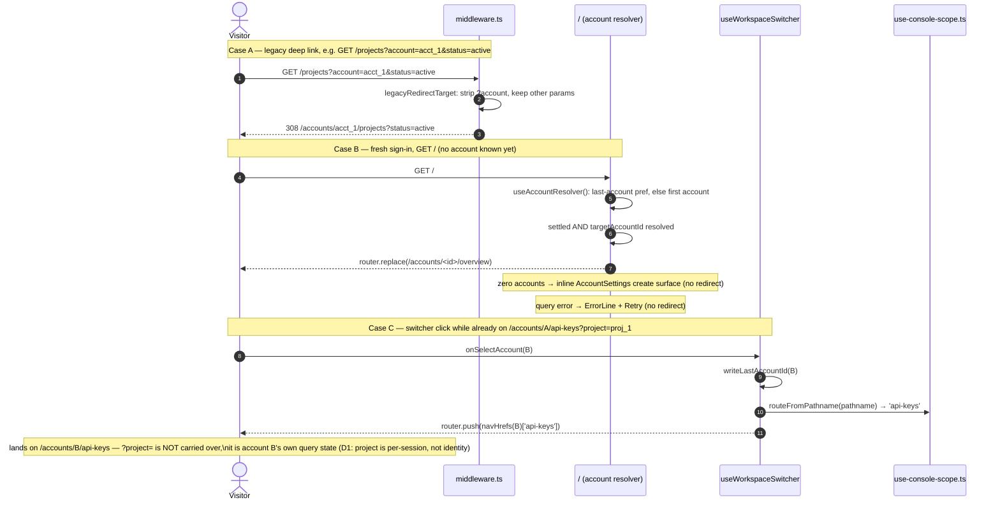

# ADR 0013: Console information architecture v3 — accounts in the path, a settings area, and the analytics doctrine

## Status

Accepted

Records the owner's dictated information architecture (2026-08-31) — the account into the URL
path, a dedicated settings area with its own left rail, per-screen account scoping, refill as a
page rather than a dialog, and a chart-choice doctrine for every usage/spend breakdown — across
[issue #368](https://github.com/ADORSYS-GIS/converse-frontends/issues/368)'s IA v3 phases 1
("account into the path"), 2 ("the settings area"), 2d (the account-scoping audit), 3 (refill as a
page, the rail narrowed), and 4 (the analytics screens). Every decision below is **implemented and
merged**; this ADR is the record, not the proposal.

Supersedes, in part: [ADR 0012](0012-console-visual-revamp.md) Decision 1's nav-shape clause (the
three fixed nav destinations) and Decision 7's rail clause (the rail returned, then narrowed to
one case); [ADR 0011](0011-url-first-state-nuqs.md)'s `scopeParsers.accountId` (the account moved
out of the query string and into the path — see D1). ADR 0009 carries no webpack-for-production
clause to supersede — its Decision 5 already anticipated the chart port outliving the bundler
choice, and its own "offline-first PWA" language never named webpack; the bundler swap (D7 below)
is new ground, not a correction. Both ADR 0011 and ADR 0012 carry status-note amendments pointing
here.

## Context

By ADR 0012 (2026-08-30), the console had a working two-column shell, but the account/project
scope it filtered every screen by still lived entirely in the query string
(`?account=…&project=…`), one flat `/admin` route did double duty as both an operator dashboard
and the budget review queue, refill was a shared dialog reachable from three places, and the
account/project settings screens were two more query-driven panels bolted onto the same shell —
nothing about "which account am I looking at" was addressable by path, bookmarkable per account,
or guarded against a stale/hand-edited URL naming an account the visitor cannot see. The owner's
2026-08-31 directive rebuilt the URL surface itself around the account, split settings into its
own navigable area, and — once the usage backend's real data volumes were measured against a
handful of chart choices — set a doctrine for which chart wins which breakdown, so a future screen
doesn't reopen a settled argument. issue #368 tracked the six phases this ADR closes.

## Decision

### D1 — Account-scoped paths; `/` is a last-account resolver; project stays `?project=`

Every real screen lives under `/accounts/[accountId]/{overview,projects,api-keys,refill}`
(`apps/console/src/app/(console)/accounts/[accountId]/*`). The account is a **path segment**, not
a query parameter — `use-console-scope.ts` reads it via `useParams<{accountId}>()`, and
`accounts/[accountId]/layout.tsx` is the one guard that checks a path account against the
signed-in identity's own `allAccounts` list (see D3's "not your account" case).

`/` (`app/(console)/page.tsx`) is the **account resolver**, not a screen: it resolves
`useAccountResolver()`'s `targetAccountId` — the remembered `lightbridge.last-account` preference,
falling back to the first account the backend returns — and `router.replace`s to
`/accounts/<id>/<next>` (`?next=`, default `overview`, carrying a legacy deep link's intended
destination through the hop). Three non-redirect outcomes, all gated on the accounts query having
**settled** (never mid-flight): zero accounts renders the same first-run `AccountSettings` create
surface `/settings/policies` composes (`ui-web/sections/account-settings`, the section retained
verbatim from the deleted `/settings/account` route) in place; a query error renders `ErrorLine`
with retry; resolving renders a brief `InlineStatus`.

**Project stays a query parameter, `?project=`, never a path segment.** Two reasons, both load-
bearing:

- **Bookmark stability.** An account is a long-lived identity a person returns to for months;
  a project selection inside it is a filter a person changes within a single working session.
  Putting the account in the path and the project in the query means
  `/accounts/acct_1/api-keys` is a stable bookmark to "this account's key screen" that still
  works after the project filter next to it changes, where a `/accounts/acct_1/projects/proj_9`
  path would go stale the moment the visitor's attention moved to a different project — exactly
  the churn ADR 0011's URL-first doctrine exists to avoid, applied one level down.
- **Null-as-all-projects.** The project filter's genuinely valid default is "every project in
  this account," not "the first project" — there is no natural project to redirect an empty
  path segment to the way `/` redirects to a resolved account. `use-console-scope.ts`'s own
  `?project=` parser keeps `''`/absent as that default (kept out of the URL by nuqs'
  `clearOnDefault`), and `ScopeSelect` speaks `null` for the same state. A path segment has no
  vocabulary for "absent means all"; a query parameter does, for free.

**The switcher navigates, it does not set state.** `useWorkspaceSwitcher.onSelectAccount`
(`apps/console/src/client/console-chrome.tsx`) writes the chosen id to `lightbridge.last-account`
and `router.push`es to `navHrefs(accountId)[routeFromPathname(pathname)]` — the same screen,
under the new account. Switching account is real navigation now, not a query-param write; the
command palette's "Scope" group and the resolver's own redirect follow the identical
last-account/first-account order, so all three agree on which account is "current" without
knowing about each other.

Every pre-existing deep link gets a standing 308 rather than a 404
(`apps/console/src/middleware.ts`'s `legacyRedirectTarget`): `/`, `/projects`, `/api-keys` with an
`?account=` query fold into `/accounts/<id>/<segment>`, and a bare (accountless) hit on those
paths becomes `/?next=<segment>` so the resolver can still land it once an account is known.

### D2 — The settings area: its own left rail, one shell mount, no right rail, honest disabled rows

`/settings/*` is a second navigable area, not five loose screens. It gets its **own left-sidebar
content** — a flat, ungrouped nav list of seven destinations replacing the account area's
Workspace/Account/Operator groups — while remaining inside the **same** `ConsoleShell` mount that
`app/(console)/layout.tsx` establishes for every route in the group. `areaFromPathname(pathname)`
(`'account' | 'settings'`, one predicate, `apps/console/src/client/console-chrome.tsx`) is what
`ConsoleSidebarContent`/`ConsoleTopBarContent` branch on to swap `groups` and the workspace-
switcher slot; `settings/layout.tsx` itself renders nothing but `{children}`.

**Rejected: a sibling `layout.tsx` under `/settings` mounting its own `ConsoleShell`.** That was
the naive shape a route-group nav split suggests, and it was rejected because it would remount the
sidebar/top-bar DOM node on every account ↔ settings transition — exactly the "shell rebuilt on
every navigation" anti-pattern the console-ui skill's Composition section already bans for
per-route shells (ADR 0009/ADR 0012). `console-shell-mount.test.ts` guards both
`accounts/[accountId]/layout.tsx` and `settings/layout.tsx` against importing the shell or nav
primitives at all, precisely so a future PR cannot reintroduce a second mount by accident.

**No right rail in settings, at any tier.** `InspectorRail` (`apps/console/src/containers/
inspector-rail.tsx`) resolves content for exactly one case — `/accounts/<id>/projects` with a row
selected — and `undefined` (which collapses `ConsoleShell`'s rail column entirely) everywhere
else, including every `/settings/*` route. This is narrower than ADR 0012's own "rail returned"
amendment: phase 3 deleted the rail's one *standing* case, the `/accounts/<id>/overview`
quick-settings panel (`InspectorSettingsPanel`) — the owner's reasoning was that "account
mutations/creation/refill on the Overview rail makes no sense" once the switcher itself carries
`+ New account`, `/projects` carries `+ New project`, the Budget card links to
`/accounts/<id>/refill` (D4), and `/settings/policies` carries rename.

A settings screen with row-selection detail of its own — `/settings/refills-queue`'s review
surface — therefore opens `BottomSheet` **at every tier, including `lg`+**, not only below it:
with no rail to promote the detail into at the wide tier, the below-`lg` fallback the account area
uses (`BottomSheet` while the rail is absent) is simply the only surface settings ever has.
`ReviewDetailPanel` needs no rail companion of its own for this reason.

**The settings area's own workspace-switcher slot is a back-to-console row**, not a workspace
switcher: `BackToConsoleRow`/`BackToConsoleCompact` render `← Back to console`, linking to
`navHrefs(accountId).overview` for whichever account `useConsoleScope()` currently resolves to.
Settings is not account-scoped by path (below), so a workspace switcher there would falsely
suggest it is; the row is the one way back into the account area instead.

**Nav entries may ship disabled, with a stated reason — the honesty doctrine extended to
navigation.** `/settings/roles` renders as a real, permanent, `href`-less row
(`ROLES_DISABLED_REASON`: "Role and permission mapping is operator config today; no read API
exists (lightbridge-authz#571)") rather than being omitted. Omitting it would hide that the
destination exists at all; a row that *looks* live but 404s is its own kind of fabrication — a
disabled row with a stated reason is the honest middle ground between "not built" and "silently
missing," extending ADR 0012 D8's "never fabricate" clause from data to navigation itself. Roles
is the one entry still disabled this way; `/settings/refill-options` shipped live in phase 3 (its
own honesty gap moved from the nav row to an inline caption — see D5).

### D3 — Phase 2d: everything under an account path scopes to it

Once the account moved into the path (D1), an audit (issue #368/#392) found several surfaces still
reading identity-wide data inside an account-scoped screen: the create-key dialog's project
picker and the api-keys/overview toolbar's project `<select>` offered projects from every account
the identity owns, not just the one in the path. `ConsoleScope.projects` now filters to
`value.accountId` — the path account — via `scopeProjectsForAccount(allProjects, accountId)`
(`apps/console/src/client/use-console-scope.ts`); the old identity-wide list survives only as
`ConsoleScope.allProjects`, documented as safe for an id→row *lookup* against an already-scoped id
(e.g. resolving a cross-account admin queue's own `projectId`) and never as a selectable option
list.

The same audit closed two more classes of leak:

- **Disabled-until-scoped queries.** A query whose filter depends on the path account is
  constructed only once that account id is resolved — never fired identity-wide "just in case,"
  never left permanently loading for want of a filter it should already have.
- **Honest unwired captions for home-account-only backend surfaces.** Some `lightbridge-authz`
  endpoints (issue #577) only ever answer for an identity's *home* account, not an arbitrary
  account it owns — a distinction invisible from the console's own account-scoped URL. Rather than
  silently returning another account's data or crashing, the affected surfaces render their
  ADR 0012 D8 honest-gap treatment (an omitted block with a stated reason) when the path account
  is not the home account, instead of a wrong or fabricated figure.

### D4 — Refill is a page; dialogs are for forms, not flows

`RequestRefillDialog` is deleted outright. Every refill trigger — the Budget card's action, the
command palette, a stale `/admin?request=…` deep link — now navigates to
`/accounts/<id>/refill` (`RefillCentre`), not a shared dialog instance. The distinction this
generalises: a **dialog** is the right surface for a bounded, single-step form whose result is
"submit or cancel" (`AccountNameDialog`, `CreateProjectDialog`, `ProjectNameDialog`,
`ReportExportDialog`) — still mounted once at the shell layout for exactly that reason, so more
than one entry point can open the same instance. A **flow** — refill's own request → review →
decision arc, with its own history and status, reachable from multiple entry points, worth a
bookmark or a browser Back — is a page. `RequestRefillDialog` had drifted into flow territory
(its own request history, its own status reads) while still being modal chrome; the page split
that back into a first-class URL and let the dialog concept shrink back to what it is good at.

### D5 — The analytics doctrine

The phase 4 usage/spend screens are grounded in a **measured prod distribution**, not house taste:
scanning 726k prod usage rows, the dominant shape across accounts is one series overwhelming the
rest — "top-1 ≥95% of an account's spend" is the *common* case, not an edge case. Every choice
below follows from what actually reads honestly against that shape, re-derivable from the same
data:

- **Ranked, normalized-sparkline rows are the default breakdown** — `RankedSeriesRows`
  (`packages/ui-web/src/sections/ranked-series-rows/`), one row per key (account/project/model/
  user/api-key): rank swatch, label, formatted value, a share micro-bar, a per-row sparkline, an
  optional `Meter`, an optional delta. The share micro-bar **suppresses itself above a 95% top-1
  share** (`TOP_SHARE_SUPPRESS_BAR_PERCENT`) in favour of plain percentage text — a bar chart
  whose leading segment is a wall and whose remaining segments are hairlines communicates nothing
  a number doesn't already say better.
- **Columns (a plain stat grid) are the fallback for a sparse single series** — `LatencyStatCards`
  (below) is the shipped instance: one number, or a handful, without enough of a series to trend.
- **One `ShareBar` survives, for exactly the case a ranked list can't replace**: the estate
  overview's global model mix (`/settings/overview/usage`, `combineAccountModelResponses`'s
  `modelTotals`). `ShareBar` — a 100%-stacked bar over a ranked list, not a donut (replaced
  2026-08-29: a monochrome ramp reads badly as adjacent arcs, and a real 99/1/0.4 split produced
  sub-pixel donut slivers) — is right exactly once, when the question genuinely is "how does this
  whole add up," not "which of these rows matters." Every per-row breakdown elsewhere uses
  `RankedSeriesRows` instead, specifically *because* of the measured top-1-dominance shape: a
  ranked list survives a 95/5/0.4 split by showing the 95% as a number and the 5%/0.4% as smaller
  numbers underneath it; a part-to-whole bar shows the same split as one full-width segment and
  two slivers, repeating the exact donut failure `ShareBar` itself was built to fix, one level up.
- **Stacked bars and area charts were tried against the same 726k-row sample and rejected**, for
  three measured reasons, not a stylistic preference: (1) **top-1 dominance collapses them to a
  single band** — the same 95%+ concentration that suppresses `RankedSeriesRows`' own micro-bar
  makes every stacked/area chart's non-leading bands sub-pixel, the identical donut-sliver failure
  in a rectangular shape; (2) **the usage backend buckets by day, not continuously** — an area
  fill implies a continuous function between samples that day-bucketed data does not have, and
  filling between real gaps (an account genuinely idle for a day) manufactures a slope that isn't
  there; (3) **a stacked or layered chart needs a legend that scales with the number of series**,
  and the same measurement that grounds the ranked-row default (many low-share tail entries per
  account) means that legend would routinely run to a dozen-plus entries — exactly the
  `ChartLegend`/`RankedSeriesRows` "Other (N)" collapse already solves for a *list*, and does not
  solve for a *chart* at all.
- **Latency is stat cards until history depth justifies a series.** `LatencyStatCards`
  (`packages/ui-web/src/sections/latency-stat-cards/`) renders per-model p50/p95/sample-count (p99
  only past `MIN_SAMPLES_FOR_P99` samples) as a row of self-panelled cards, explicitly **not** a
  time series: the usage backend's own events are whole-window aggregate percentiles, and
  pre-bucketed percentiles cannot be validly combined across days into a trend line the way a sum
  can (`settings-overview-usage.ts`'s own doc comment) — a per-request latency time series was
  named in the build brief's "DO NOT BUILD" list for exactly this reason. The day this backend
  starts emitting per-bucket percentiles with enough history to trend honestly, this doctrine's
  own "stat cards until…" clause is what tells a future implementer to revisit it — not a silent
  reversal.
- **Sentinel identities are labelled, never dropped or fabricated.** `sentinelLabel`
  (`apps/console/src/containers/sentinel-labels.ts`) resolves two backend-emitted sentinel keys
  (`missing:keycloak:preferred_username`, `missing:github:preferred_username`) to de-emphasized
  human labels, and a repo-slug-shaped account id (`owner/repo`) to itself, de-emphasized — always
  a **real** key the backend already wrote, never one this console invents, and always shown
  (`RankedSeriesRow.subtle`), never silently excluded from a ranking.
- **Explicit limits and truncation are surfaced, not hidden.** Every usage request sets its `limit`
  explicitly (`overview-usage.ts`); the estate overview's own account fan-out is hard-capped —
  see below — and says so in its own truncation caption rather than presenting a partial ranking
  as complete.
- **Estate fan-out is capped at 25** (`MAX_FANNED_OUT_ACCOUNTS`,
  `apps/console/src/containers/usage-overview-usage.ts`). The usage API has no bulk "every account
  I can see, ranked by spend" endpoint, so `/settings/overview/usage` fans out one request per
  owned account and combines the responses client-side — uncapped, that is an N-explosion against
  an identity that owns many accounts. The cap is a **real cap on a real selection**, not yet the
  "top 25 by descending prior-period spend" the build brief ultimately wants: ranking by spend
  first would itself require fanning out to every account just to decide which 25 to keep, the
  exact explosion the cap exists to avoid. Until a bulk per-account spend summary exists
  (`lightbridge-authz#578`, "bulk list-accounts-by-period-spend for the estate overview's own
  ranking, without an unbounded per-account fan-out"), this screen takes the first 25 accounts in
  whatever order `GET /accounts` returns them and says so plainly, rather than claiming a ranking
  it cannot honestly produce.

### D6 — "This month" is the default range

The account-lens and estate-overview dashboards default their range picker to `mtd` ("This
month"), which `resolveRangeWindow` resolves to a **calendar-month span** (UTC month start → now)
— not a rolling 30-day window, which is what every other preset in the same picker is
(`RANGE_DAYS`, `apps/console/src/containers/overview-usage.ts`). The reasoning is billing-window
alignment: the account's spend, budget ceiling and refill cadence are all denominated in calendar
months, so a dashboard whose default window is anything else (a rolling 30 days, which drifts
across a month boundary mid-billing-period) would show a number that does not match what the
account is actually being billed against. Every other preset stays a plain rolling window because
nothing else on those screens is billing-period-denominated.

### D7 — Production builds on Turbopack; the CBOR codec ships via Dockerfile staging; glibc stays

**The console runs Turbopack for both development and the production build**
(`next dev --turbopack`, `next build --turbopack`). Production used to stay on webpack for one
reason — `@serwist/next`, the Serwist PWA integration that compiled `src/sw.ts` into
`public/sw.js`, was a webpack plugin, and Turbopack never calls the `webpack()` config hook at
all — and that reason is gone: the console now runs **`@serwist/turbopack`**, whose
`createSerwistRoute` bundles `src/sw.ts` with `esbuild-wasm` inside an ordinary route handler
(`src/app/serwist/[path]/route.ts`) rather than a build-time bundler plugin. The service worker is
served from **`/serwist/sw.js`**, generated on demand (dev) or at static-generation time
(`next build --turbopack`) — never written to `public/` as a build artifact any more.

Moving production onto Turbopack surfaced a real build panic that is now recorded rather than
worked around silently: `outputFileTracingIncludes`, the mechanism `next.config.mjs` used to pull
`@cratestack/cbor`'s native N-API packages into the standalone output, crashes Turbopack's NFT-JSON
emitter outright whenever a glob resolves through a pnpm-store symlink to a *directory* (verified:
narrowing the glob to only the cbor packages still panicked, on a different package; there is no
safe glob to write). The fix moved the concern out of `next.config.mjs` entirely — getting the
actual `@cratestack/cbor*` package files into the image is now `apps/console/Dockerfile`'s job (a
`COPY` of the pnpm store dirs from the build context, plus re-running
`scripts/link-standalone-cratestack.mjs` at image-build time to re-materialize the top-level
`node_modules/@cratestack/*` scope links); `serverExternalPackages` (a Next feature independent of
bundler choice) still keeps the bundler from inlining the native addon.

**The base image stays glibc** (`node:22.23.2-alpine3.24` — musl), a known, filed, and unresolved
gap, not a silent one: `@cratestack/cbor-node`'s prebuilt bindings ship no musl variant and no
working wasm32-wasi fallback, and its own loader (`native.mjs`) checks `isMusl()` before trying any
glibc candidate and skips them all when it's true — genuinely true on Alpine regardless of the
`gcompat`/`libc6-compat` shim already installed for `.node` file `dlopen` compatibility. Net
effect on `linux/amd64` (the real deployment target): `import('@cratestack/cbor')` rejects with
"Cannot find native binding" server-side, which the usage-scope guard's own `loadRpc` fails
*closed* on rather than crashing the route. This predates the Turbopack migration (same base image,
same cratestack pin, since the Dockerfile's first commit); fixing it — a musl build from cratestack
upstream, or moving off Alpine — is `cratestack#850`, a separate, larger decision than a bundler
swap.

## Diagrams

The two-area shell as a state machine — which nav surface, which rail, and the one guard the
account area carries that settings does not:

```mermaid
stateDiagram-v2
    [*] --> Resolving: GET / (no account in path)

    state "Account area" as Account {
        [*] --> AccountGuard
        AccountGuard: accounts/[accountId]/layout.tsx\nchecks accountId ∈ allAccounts (settled only)
        AccountGuard --> NotYourAccount: settled AND unknown id
        AccountGuard --> Overview: known id — /overview
        AccountGuard --> Projects: known id — /projects
        AccountGuard --> ApiKeys: known id — /api-keys
        AccountGuard --> Refill: known id — /refill (D4)
        Projects --> Projects: select row → InspectorRail (lg+) / BottomSheet (<lg)
        NotYourAccount --> [*]: "Back to your accounts" → /
    }

    state "Settings area" as Settings {
        [*] --> SettingsOverview: /settings → /settings/overview/usage
        SettingsOverview --> Tiers
        SettingsOverview --> Policies
        SettingsOverview --> RefillOptions
        SettingsOverview --> RefillsQueue: isAdmin only
        SettingsOverview --> Info
        SettingsOverview --> RolesDisabled: nav row renders, no route (D2)
    }

    Resolving --> Account: targetAccountId resolved → replace /accounts/<id>/<next>
    Resolving --> ZeroAccounts: settled, accounts.length === 0
    Resolving --> ResolverError: query error
    ZeroAccounts --> Account: AccountSettings create → list settles non-empty → redirect fires
    Account --> Settings: nav "Settings" (areaFromPathname flips; ConsoleShell mount unchanged)
    Settings --> Account: "← Back to console" (BackToConsoleRow) → /accounts/<id>/overview

    note right of Account
      Right rail: ONLY /accounts/<id>/projects
      with a row selected (D2). Absent everywhere
      else in this area, and absent everywhere
      in Settings — never an empty placeholder.
    end note
```

`accounts/[accountId]/layout.tsx:29-58`, `app/(console)/page.tsx:45-90`,
`client/console-chrome.tsx:82-84` (`areaFromPathname`), `containers/inspector-rail.tsx:50-55`.

Routing/redirect resolution — a legacy deep link, a fresh sign-in, and a switcher click, through
the same three resolvers:

`middleware.ts:21-95` (`LEGACY_ACCOUNT_SCOPED_SEGMENT`, `LEGACY_STATIC_REDIRECT`,
`legacyRedirectTarget`), `app/(console)/page.tsx:45-70`, `client/console-chrome.tsx:435-470`
(`useWorkspaceSwitcher.onSelectAccount`), `client/use-console-scope.ts:94-137`.

## Consequences

- `docs/design/console-redesign/README.md` §3 (shell and grid) and §5 (screen specs) are rewritten
  to the account-path/two-area reality; the nav destinations table gains the settings tree and the
  refill page.
- `.claude/skills/console-ui/SKILL.md`'s rail section is corrected to the single narrowed case
  (D2/D3), and gains a compact analytics/chart-choice section pointing at D5 rather than
  re-deriving it.
- `docs/identity-and-account-visibility.md` gains a short section on account-scoped URLs: a deep
  link carries the tenant in the path now, not just the query, and the "not your account" guard
  (D1/`accounts/[accountId]/layout.tsx`) is the enforcement point.
- The ratchet suites (`class-budget.test.ts`, `base-ui-adoption.test.ts`,
  `section-class-audit.test.ts`) are re-measured against the tree this ADR describes: 43
  hand-written utilities across 50 components (still none over budget, still zero `BUDGET`
  entries), one open `base-ui-adoption` gap (`row-action-group`, an explicit refusal, unchanged),
  and `section-class-audit` pins added for the six sections D5/D2/D4 introduced
  (`ranked-series-rows`, `latency-stat-cards`, `refill-history`, `refill-request-form`,
  `policy-simulator`, `project-policy-controls`).
- `RequestRefillDialog`, `InspectorSettingsPanel`, and the standalone `/admin` route are deleted
  outright, not deprecated in place, per house style.

## Alternatives considered

- **Keep the account in the query string and add a stricter parser.** Rejected — no query-string
  discipline fixes a bookmark that silently points at the wrong account depending on load order;
  the path is the only place "which account" can be the first thing resolved, before any component
  runs.
- **Project also in the path** (`/accounts/<id>/projects/<projectId>/...`). Rejected — see D1's
  bookmark-stability and null-as-all-projects reasoning; a path segment cannot represent "no
  project selected, meaning all of them" without inventing a sentinel segment, which is worse than
  the query parameter it would replace.
- **A settings `layout.tsx` that mounts its own shell.** Rejected — see D2; it was the shape
  actually tried before this ADR's own `console-shell-mount.test.ts` was written to prevent it.
- **A `DonutChart`/stacked-bar upgrade for the estate overview instead of `RankedSeriesRows`.**
  Rejected on the same 726k-row measurement that grounds D5 generally — see D5's own three
  reasons; a bigger, fancier part-to-whole chart still fails the way the original donut did once
  one series dominates.
- **A rolling 30-day default range for every dashboard, settings included.** Rejected for the
  billing-denominated screens (D6) — a rolling window drifts across the calendar-month boundary
  the account's own budget and refill cadence are measured against; kept as the default for every
  *other* preset, where nothing else on the screen is billing-period-denominated.

## Follow-ups

None outstanding for this ADR's own scope — IA v3 phases 1-5 and 2d (issue #368) are merged. Filed
and tracked elsewhere, not by this ADR: `lightbridge-authz#571` (Roles read API),
`lightbridge-authz#577` (home-account-only surfaces), `lightbridge-authz#578` (bulk
list-accounts-by-period-spend), `cratestack#850` (musl build for `@cratestack/cbor-node`).
