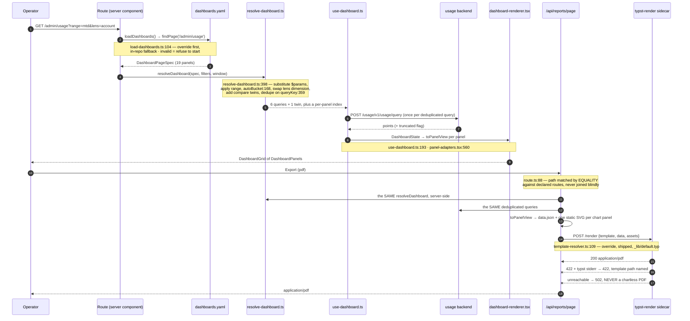
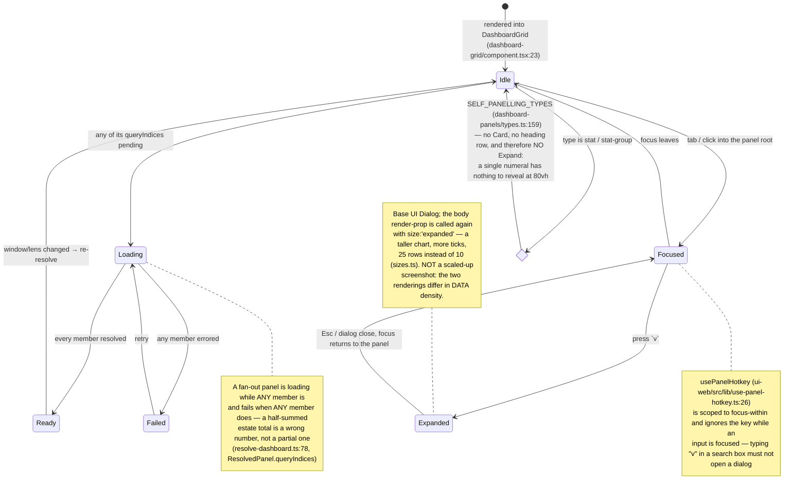
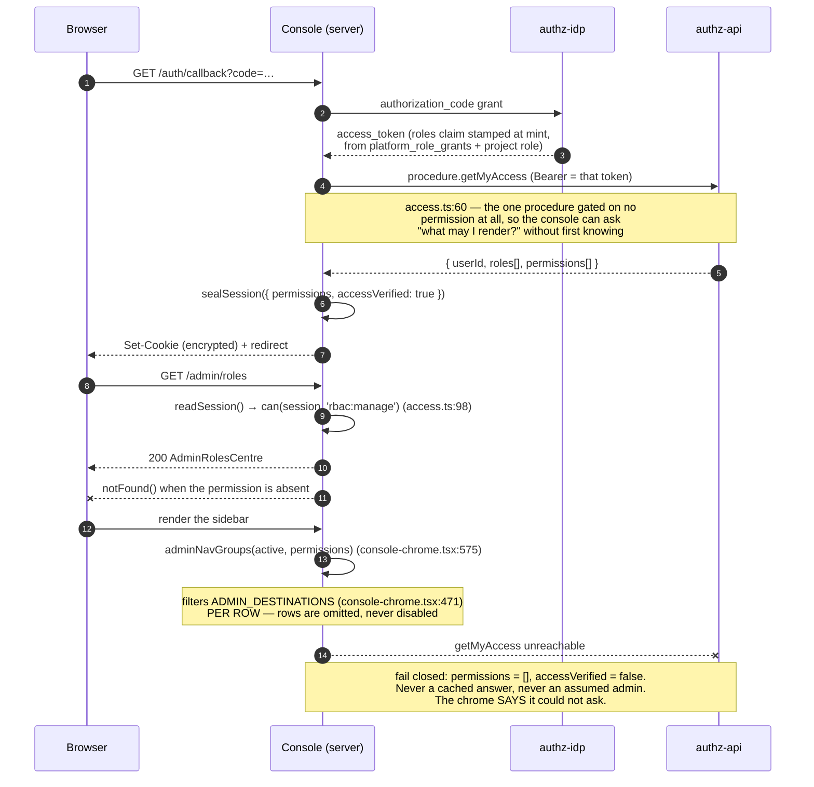
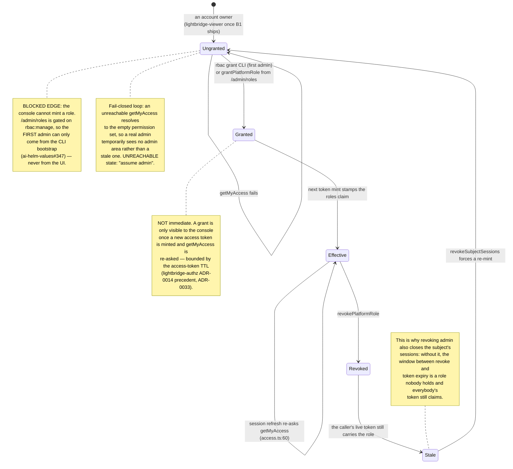
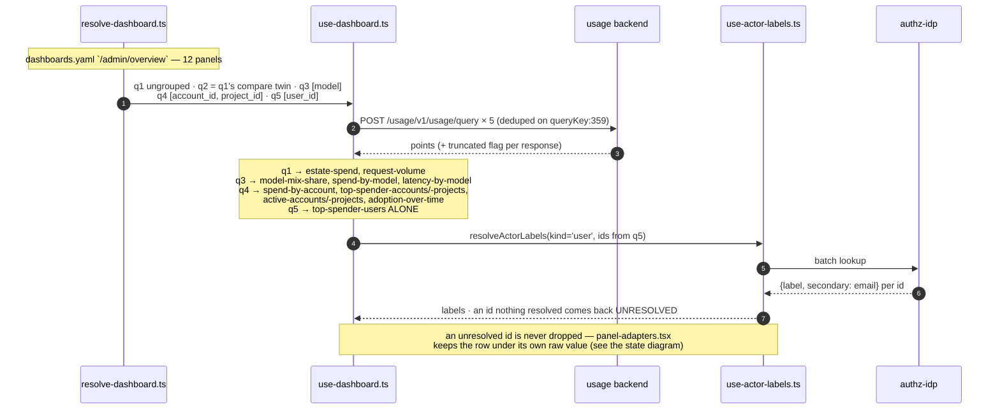
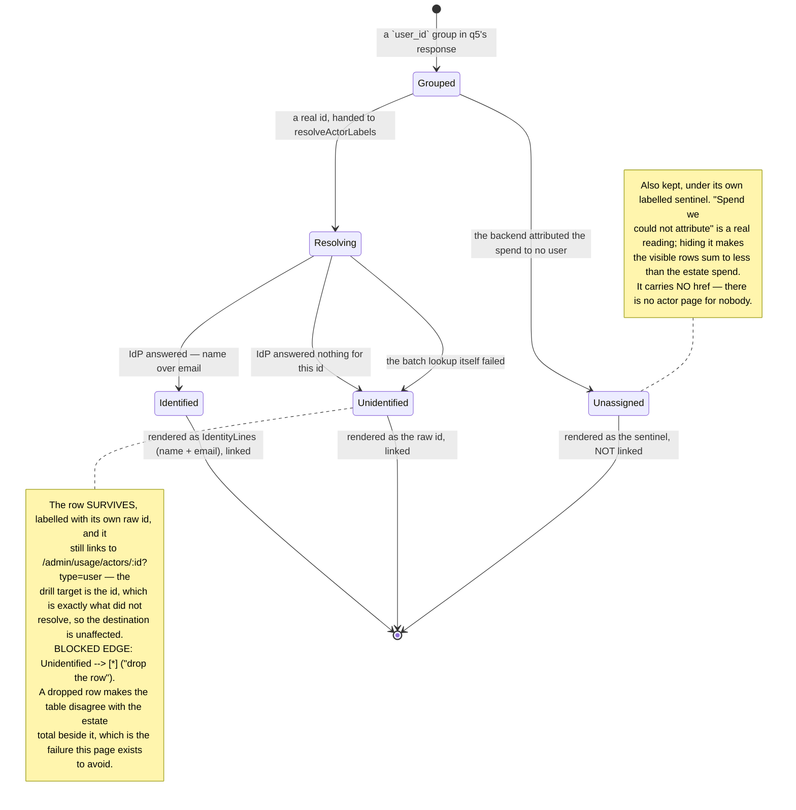

# ADR 0015: Admin console v2 — declarative dashboards, permissions from the backend, Typst export

## Status

Accepted

Records the owner's 2026-09-02 directives and the twelve merged slices of
[epic #443](https://github.com/ADORSYS-GIS/converse-frontends/issues/443) that implemented them:
dashboards became a declarative document instead of hand-written containers, the chart doctrine
gained a ring, the admin area gained four nav destinations and three drill-down routes, every gate
moved from a role string to a permission the backend computes, and report export became a Typst
sidecar. **Every decision below
is implemented and merged** — this ADR is the record, not the proposal.

Amends [ADR 0013](0013-console-information-architecture-v3.md): **D5**'s part-to-whole clause
(rings are now allowed — see D2) and its latency clause (a latency series is now honest — see D2),
and D5's "explicit limits" clause is unchanged but now enforced by schema rather than by review.
Extends ADR 0013's admin-area amendment (2026-08-31) with four further nav destinations plus the
`/admin/usage` drill-downs, and replaces its role gate wholesale (D4). Supersedes nothing in
[ADR 0010](0010-ui-primitive-stack-and-theming.md),
[ADR 0011](0011-url-first-state-nuqs.md) or [ADR 0012](0012-console-visual-revamp.md): the
primitive stack, the URL-first state rule and the visual direction all hold unchanged, and the
engine is built out of them.

Backend counterparts, decided in their own repository and referenced here rather than restated:
[lightbridge-authz ADR-0032](https://github.com/ADORSYS-GIS/lightbridge-authz/blob/main/docs/adr/0032-budget-reset-schedules.md)
(budget reset schedules) and
[ADR-0033](https://github.com/ADORSYS-GIS/lightbridge-authz/blob/main/docs/adr/0033-platform-roles-are-a-table-stamped-at-mint.md)
(platform roles are a table, stamped at mint).

## Context

Two things forced this work, one a directive and one a finding.

**The directive (owner, 2026-09-02).** In the owner's own words: _"the dashboards are basically
fetch(filters × type × parameters) = data. The page handles the filters; we externalize the list of
type × parameters into a dashboards.yaml (per page); Next reads those and does the mapping."_ The
console at that point had six hand-written dashboard containers. `/admin/overview` drew eight
bespoke boards down a single column, each firing its own `scope: 'all'` usage query even when two
boards asked the identical question; the previous-period delta existed twice, copy-pasted, with no
shared rule for what "previous" meant; adding a panel meant writing a container, a hook, an adapter
and a test. The same session settled four more points: pie charts are allowed **as rings, never as
filled disks**; report export is **Typst in a sidecar** (Gotenberg and Handlebars dropped);
`dashboards.yaml` is overridable from the config volume, fail-loud on startup; and the account and
settings overview pages migrate onto the engine too, so that no hand-written dashboard container
survives.

**The finding (production, same day).** The console's entire admin gate was
`isAdmin(roles) = roles.includes('lightbridge-admin')`. Production maps
`owner → ["lightbridge-admin"]`
(`ai-helm-values/environments/prod/values/lightbridge-app.yaml`), and under lightbridge-authz
ADR-0026 **every signed-in person owns an account**. So that predicate answered `true` for the
entire user base: admin was not a role anyone assigned, it was the default for everyone, and the
gate gated nothing. No amount of frontend care fixes a claim mapper's default — the console had to
stop deriving authorization and start asking for it.

The two are related. A declarative dashboard is only safe if the thing deciding who may see it is
real: `/admin/usage` reads `scope: 'all'`, the whole deployment's spend, and shipping nineteen
estate-wide panels behind a gate that let everybody through would have been the worse of the two
changes.

## Decision

### D1 — Dashboards are declarative: `apps/console/dashboards.yaml` is the single description of a page

One document, `apps/console/dashboards.yaml`, keyed by **router path**. A page entry declares which
filters it owns and what panels it draws; nothing else in `apps/console` knows what a given
dashboard contains.

```yaml
pages:
  - route: /admin/usage # the same string the App Router uses; `[param]` written literally
    filters: [lens] # `range` (with `from`/`to`) is implicit and never listed
    panels:
      - id: model-distribution-cost # unique within the page; the React key, the dedupe
        type: donut #   attribution, the heading id, and what an error names
        title: Model distribution — cost
        subtitle: Cost by model # optional; rendered on screen AND in the report
        span: 1 # 1 = one grid column, 2 = both
        metric: cost # cost | requests | tokens | latency | derived:<name>
        compare: false # optional; adds the D3 comparison-window twin
        options: { topN: 6 } # optional; per-type knobs
        query:
          scope: all
          group_by: [model]
          bucket: auto
          limit: 2000 # ALWAYS explicit — never a server default
```

**The engine, five modules, each with one job** (`apps/console/src/dashboards/`):

| Module                   | What it owns                                                                                                           |
| ------------------------ | ---------------------------------------------------------------------------------------------------------------------- |
| `dashboard-spec.ts`      | The zod schema and the closed vocabularies (`panelSpecSchema:255`, `dashboardQuerySchema:174`, `pageSpecSchema:275`)   |
| `load-dashboards.ts`     | Lookup order, read, parse, cache, fail loud (`dashboardsLookupPaths:63`, `loadDashboards:104`)                         |
| `resolve-dashboard.ts`   | Spec + page filters → a deduplicated query list, React-free (`resolveDashboard:398`, `queryKey:359`, `autoBucket:168`) |
| `use-dashboard.ts`       | One `useQueries` over that list; per-panel selection (`useDashboard:193`)                                              |
| `dashboard-renderer.tsx` | Registry lookup → `DashboardPanel` inside `DashboardGrid` (`DashboardRenderer:47`)                                     |

`resolve-dashboard.ts` is deliberately the dullest module in the console: no React, no DOM, no query
client, no clock it was not handed. That is not tidiness — it is what lets the export route execute
the _same_ function server-side and get the _same_ query list the browser issued (D5).

**Panel types are a closed, shared vocabulary.** `DASHBOARD_PANEL_TYPES`
(`packages/ui-web/src/sections/dashboard-panels/types.ts:25`) declares nine:

| Type             | Draws                                        | Notes                                                       |
| ---------------- | -------------------------------------------- | ----------------------------------------------------------- |
| `stat`           | `StatCard` + optional delta                  | Self-panelling — `chrome: 'bare'`, no `Card`, no Expand     |
| `stat-group`     | A row of `StatCard`s                         | Self-panelling; carries an `emptyMessage`, never zero cards |
| `series`         | `MultiSeriesSpendBoard` (Linear/Log/Indexed) | Scale is a URL knob                                         |
| `ranked`         | `RankedSeriesRows`                           | The doctrine default; optional row link                     |
| `share`          | `ShareBar`                                   | The one sanctioned part-to-whole                            |
| `donut`          | `DonutChart` — a **ring**                    | New; see D2                                                 |
| `table`          | `LedgerTable` + `Pagination`                 | Sortable, `rowHref`, closed column vocabulary               |
| `latency-cards`  | `LatencyStatCards`                           | Whole-window percentiles                                    |
| `latency-series` | Per-bucket p50/p95 as a series               | New; honest because percentiles are per-bucket (D2)         |

The console's zod enum is _built from_ that array and the renderer registry (`panelRenderers`,
`packages/ui-web/src/sections/dashboard-panels/panel-renderers.tsx:181`) is _keyed on_ it, with a
test asserting both cover it exactly. A type cannot exist in YAML without a renderer, or vice
versa.

**Placeholders.** `$name` in any query string field is substituted from the page's own filters —
`scope_id: $actorId`, `scope: $type`, `filters.azp: $channelId`. An **unresolved placeholder is an
error**, never an empty string: `scope_id: ""` on an account-scoped panel is not "no actor", it is
a malformed query that would silently answer a different question than the panel's title claims.
`$name?` is the optional form and is legal **only** inside `filters.<key>`: it drops the filter when
the page has no value, which is what a project picker resting on "All projects" needs. It is
deliberately not legal on `scope`/`scope_id` — a dropped scope is not a narrower query, it is a
different one.

**`scope: family`** (`dashboard-spec.ts:165`) is the resolver's own scope, not a `UsageScope`. It
expands into one `scope: account` query per account in the session's own account family, merged
client-side. `/settings/overview/usage` means "the accounts this identity can see", which is
neither `account` (one) nor `all` (the whole deployment, gated on `usage:read-all`). The usage API
has no such scope — filed as lightbridge-authz#578 — so the honest expression is a capped fan-out
that says so in its caption.

**Dedupe and compare twins.** Queries are deduplicated on a stable key derived from the
fully-resolved query, with the `group_by` dimensions sorted (`queryKey:359`). This is the measured
payoff: `/admin/usage`'s nineteen panels resolve to **six** usage requests plus one comparison
twin; `/admin/overview`'s eleven panels resolve to **three** plus one twin, where the eight-board
predecessor fired six for eight boards. A panel declaring `compare: true` gets a second, ordinary
query for the D3 comparison window — deduplicated like any other.

**Fail-loud validation, twice.** `dashboard-spec.test.ts` parses the real document at build time;
`loadDashboards()` parses it again at startup. An unknown panel type, an unknown `derived:` name, a
`span` of 3, a missing `limit`, a duplicate panel id, a duplicate route — each is a parse error
naming **the page and the panel id** (`formatDashboardIssues:341`), and the console refuses to
start. The failure mode this replaces is the one hand-written containers had: a wrong query shape
drew an empty card and said nothing.

**Config-volume override** (`load-dashboards.ts:63`), owner ruling Q11:

1. `${CONSOLE_CONFIG_DIR}/dashboards.yaml` — the deployment's own copy, so an operator can add or
   remove a panel in production without a rebuild.
2. `apps/console/dashboards.yaml` — the in-repo fallback.

`CONSOLE_CONFIG_DIR` is _derived_ (`consoleConfigDir:51`): an explicit value, else the directory
holding `CONSOLE_CONFIG`, else none. That is why `charts/converse-console` needed only a new
optional ConfigMap (`console-dashboards`, mounted at `/config/console/dashboards.yaml`) and no new
env var. An override that **exists but is invalid is a hard failure** — never a silent fallback to
the shipped file. An operator who mounted a broken document is told; they are not quietly served a
different dashboard than the one they deployed.

**A substituted `scope` is validated against the closed usage-scope enum** (`assertUsageScope`,
`resolve-dashboard.ts:240`). It is the one field whose value a URL a person can type decides, and
an invalid `?type=` must not reach the backend as a 400 arriving under a page that has already
printed an actor's name. The route 404s it first; this is the structural second line, so a page
entry is safe to read on its own.

**Panel ids are prefixed per page, not reused across pages** — `actor-*`, `channel-*`, `chat-*`
rather than a second `total-cost`. Three things need a panel id to be unambiguous across the
document: the report walk resolves a route to a panel list, the per-panel URL knob is
`?<panel-id>-scale=`, and the file is read across pages. The panel **types and readings** are
shared; only the identities are distinct, and `admin-usage-detail-pages.test.ts` pins them in order
so it is a contract rather than a preference.

**Hard cutover.** No hand-written dashboard container remains in the console. **Ten page entries**
ship: `/admin/overview`, `/admin/usage` and its three drill-downs
(`/admin/usage/actors/[actorId]`, `/admin/usage/channels/[channelId]`, `/admin/usage/chats`),
`/accounts/[accountId]/overview`, and the four `/settings/overview/*` lenses. What is left beside a
grid on those pages is only what is _not_ a usage query — RPC-backed budget zones and refill
listings — each named in its page's own comment in the YAML.

### D2 — The D5 amendment: rings are allowed, filled disks never

ADR 0013 D5 stated:

> `ShareBar` — a 100%-stacked bar over a ranked list, **not a donut** (replaced 2026-08-29: a
> monochrome ramp reads badly as adjacent arcs, and a real 99/1/0.4 split produced sub-pixel donut
> slivers) …

and the console-ui skill restated it harder:

> Everywhere else, reach for `RankedSeriesRows` — **never a donut, ever.**

**Both are superseded by this decision**, in the owner's words of 2026-09-02: _"Pie charts allowed
as RINGS (hollow donut), never filled disks."_ The absolute prohibition is removed, not qualified —
a reader must not find the old wording still standing somewhere and follow it.

What makes a ring different from the donut that was deleted in 2026-08-29, mechanically rather than
by taste:

- **The hole is an invariant, not a prop.** `donutGeometry`
  (`packages/chart-core/src/arcs.ts:54`) clamps the inner radius into
  `[MIN_INNER_RADIUS_RATIO, MAX_INNER_RADIUS_RATIO]` = `[0.35, 0.85]` of the outer radius
  (`arcs.ts:25`, `arcs.ts:28`) for **every** input, including a non-finite one. A caller cannot
  produce a filled disk through `innerRadiusRatio`, so "disks never" is enforced by the math
  package rather than by review.
- **The hole earns its keep.** `centreMetric`/`centreLabel` put the formatted total inside it. A
  filled disk has nowhere to put that number, which is a large part of why the original failed.
- **Top-N + `Other (N)` is the same collapse a ranked list already applies** (default 6;
  `PANEL_TOP_N`, `packages/ui-web/src/sections/dashboard-panels/sizes.ts:24`). The 2026-08-29
  failure was twenty indistinguishable greys and sub-pixel slivers; a six-wedge ring with the tail
  summed cannot reproduce it.
- **Values on hover, never a legend list** — the 2026-08-31 owner ruling is unchanged and the ring
  obeys it (`DonutChart`, `packages/ui-web/src/components/donut-chart/component.tsx:68`).

The **ring use case is named, and it is exactly three panels**: `model-distribution-requests`,
`model-distribution-cost`, `model-distribution-tokens` on `/admin/usage` (`dashboards.yaml`,
panels 15–17). They are three panels rather than one with a metric toggle because a toggle would
hide two of the three readings behind a click. `ShareBar` keeps the single sanctioned
part-to-whole (`model-cost-share`); `RankedSeriesRows` remains the default for every per-key
breakdown. Adding a _fourth_ ring is a decision, not a default.

### D2b — The second D5 amendment: stacked bars, for daily spend x model only (2026-09-03)

ADR 0013 D5 banned stacked bars outright, and the console-ui skill and
`packages/ui-web/src/sections/dashboard-panels/panel-renderers.tsx` both restated it. The ban was
not taste: past the first segment, a stack asks a reader to compare lengths that do not share a
baseline — the second-worst perceptual channel after area — and this console's own measurement over
726k rows found **one model at ~95% share to be the COMMON case**, under which every other segment
is a sliver and the stack degenerates into one bar wearing a legend.

**The owner overruled it on 2026-09-03 for one question**: _"'Spend by model over time' deserves a
stacked bar chart (for daily spend x model)."_ That case is precisely the one a stack is the right
mark for and a superposed line board is the wrong one: the reader's first question is _"what did we
spend that day"_, which is the bucket TOTAL — a stack states it as bar height, and a line chart
cannot state it at all. The per-model split is the second question, and it is what the segments are
for.

**The measurement was not retracted, so the caveat travels with the mark.**
`stackDominanceCaption` (`packages/chart-core/src/stacks.ts`) returns a sentence whenever the top
series exceeds `STACK_DOMINANT_SHARE` = 95% of the period, and `StackedBarChart` prints it above the
board — on screen and, through `stackedBarCaption`, in the Typst report's own chrome, since `static`
mode drops every DOM caption. A stack that is really one bar says so, in words, next to itself.

Three further things the implementation holds rather than leaving to a caller:

- **It is `options.style: stacked-bars` on the existing `series` panel, not a tenth panel type.**
  The query, the adapter, the truncation caption and the server-side export path are identical; only
  the mark differs. A tenth type would have duplicated four things to change one.
- **No axis transform.** `log` and `indexed` transform each series independently, and transformed
  segments do not sum — the bar's height would stop being the bucket's total, which is the one
  reading the exception was granted for. The scale toggle is therefore suppressed for a stacked
  panel (`panelActionRenderers`), rather than offered and ignored.
- **The tail is SUMMED into `Other (N)`, never dropped.** A line board truncates at `topN` because a
  sixth indistinguishable grey line is noise; a stack cannot, because bars short by the tail would
  contradict the total stated beside them. `panel-adapters.tsx` passes the whole ranked list through
  and `computeStackLayout` folds the tail per bucket.

**The sanctioned use is named, and it is exactly three panels**: `/admin/overview`'s
`spend-by-model`, `/admin/usage`'s `cost-by-model`, and `/accounts/[accountId]/overview`'s
`spend-by-model` (`dashboards.yaml`). Every other series panel stays lines. A fourth stack is a
decision, not a default — and stacked bars remain banned for every question whose primary reading is
the per-series comparison rather than the total.

**Latency, amended in the same breath.** D5 said latency is stat cards "until history depth
justifies a series", on the grounds that whole-window aggregate percentiles cannot be validly
combined across days. That premise no longer holds: the usage query API computes
`latency_p50/p95/p99_ms` with `percentile_cont` **per bucket group at query time**, so each bucket's
percentile is a real percentile of that bucket's own samples and plotting them in order composes
nothing. A `latency-series` panel type is therefore sanctioned; `latency-cards` stays for the
window totals, and both appear on the same page for exactly that reason. An **ungrouped**
`latency-series` plots p50 **and** p95 as two series (`latencyPercentileSeries`,
`apps/console/src/dashboards/panel-adapters.tsx:397`) — two percentiles of the same bucket, not
two things being summed, which is why the chart primitive takes an explicit `summable` flag rather
than assuming every multi-series board adds up.

### D3 — Comparison windows are additive; the picked window is never moved

**Amended 2026-09-03 (converse-frontends#448).** As first written, this decision also carried a
seven-day floor, and `comparisonWindow` implemented it by widening the **current** window and
handing the widened window back for `resolveDashboard` to query. Every panel on the page moved with
it, comparing panels and their neighbours alike. On
`/admin/usage/actors/<account>?type=account&from=2026-09-01&to=2026-09-03` that made
`actor-total-cost` read **$11.92** — a real seven-day total (28 Aug $2.74 + 29 Aug $0.08 + 31 Aug
$5.51 + 1 Sep $1.39 + 2 Sep $2.20) — under a header that said 1–3 Sep, where the true three-day
total was **$3.59**. The "Budget & next reset" zone next to it, which reads the billing period
directly and never went through this helper, said $3.59 and was right. The floor is removed; what
follows is the rule as it now stands.

One helper, `comparisonWindow` (`apps/console/src/containers/comparison-window.ts`), replacing the
two half-implementations that existed before (`previousWindow` in `usage-overview-usage.ts`,
`spendDelta` in `admin-overview-usage.ts`) — both deleted with their containers:

- **The current window is exactly the window the page was given** — the range picker's own. Nothing
  in the comparison path may move it. `resolveDashboard` asserts this structurally by querying the
  window it was passed rather than anything the comparison helper returns.
- A comparison is **additive**: it adds one twin query over its own window and changes nothing else.
- The comparison window is the **previous window of the same length**, ending exactly where the
  current one begins. Never overlapping, so a figure is never compared partly with itself; never a
  different length, so the delta is a real ratio and the `compareShiftMs` overlay below lands
  inside the chart's own x-domain.
- `monthly` shifts by a **calendar month** instead, so month-to-date compares against the same days
  of the previous month rather than a rolling 30 days.
- The **delta names its window by date** — "12% vs Aug 1 – Aug 31" (`comparisonLabel`) — rather than
  the cadence phrase "vs previous month" it used to carry. A phrase cannot be checked against the
  ledger; two dates can.
- Estate-wide pages have no single actor and therefore no cadence to read. They get `monthly`
  (`DEFAULT_COMPARISON_CADENCE`) — which matches the console's `mtd` default range (ADR 0013 D6)
  and the budget domain's own calendar-month `Period`, rather than an arbitrary rolling span.

**Why the floor could not simply move to the comparison side.** A three-day current window against
a widened seven-day previous one makes the delta percentage a ratio of unequal spans, and
`compareShiftMs` would plot a seven-day dashed line across a three-day chart — doubling the
x-domain, the exact defect that shift exists to prevent. The owner's original concern ("a one-day
window against the day before is noise") is answered instead by the delta stating its window
explicitly, so a reader can see how short the comparison was rather than being told a cadence.

`monthly` is the one cadence whose previous window is not a fixed millisecond shift, and that is
deliberate: months are 28–31 days, so "the same days of the previous month" is computed on the
calendar. A 30-day shift would compare 1–15 March against 30 January–13 February.

For a **series** panel the resolver also computes `compareShiftMs` — how far forward the previous
window's timestamps must be moved to sit under the current one. Plotting the twin at its real dates
would double the chart's x-domain and squeeze the current period into half the board, which is
precisely the defect the 2026-08-31 owner finding ("the graphs are literally completely different")
was about.

### D4 — Permission gating from `getMyAccess`; the console never re-derives a role

`procedure.getMyAccess` returns `{ userId, roles[], permissions[] }` for the authenticated caller.
`permissions` are canonical `resource:action` strings the **server** resolved the caller's roles
into — read back out of the very auth context every `@allow` clause is evaluated against, not
re-derived. The console fetches it at login and on every refresh (`fetchMyAccess`,
`apps/console/src/server/access.ts:60`), stores the array on the encrypted session cookie, and
gates by membership test (`can`, `access.ts:98`). There is no role → permission map in the console,
no wildcard expansion, and no `lightbridge-admin` special case.

**Fail closed, and say which failure it was.** A failure to reach `getMyAccess` yields
`{ permissions: [], accessVerified: false }` — never a cached previous answer, never an
assumed-admin fallback. The distinction between "verified, and this person holds nothing" and "we
could not ask" is carried on the session so the chrome can say which one happened instead of
rendering an unexplained empty nav. The token's own role claim is kept for display only; gating on
it is exactly the re-derivation this decision ends.

**The admin area's destinations and their permissions** — declared once, in `ADMIN_DESTINATIONS`
(`apps/console/src/client/console-chrome.tsx:471`), in nav order:

| Destination      | Route                     | Permission               | Notes                                                       |
| ---------------- | ------------------------- | ------------------------ | ----------------------------------------------------------- |
| Overview         | `/admin/overview`         | `usage:read-all`         | Estate-wide `scope: 'all'` queries                          |
| Usage            | `/admin/usage`            | `usage:read-all`         | Same query, same grant — one grant, two destinations        |
| Refills queue    | `/admin/refills-queue`    | `budget:review`          | Carries the pending count                                   |
| Refill policies  | `/admin/refill-policies`  | `budget:policy-write`    | + `/create`, `?edit=`, `?simulate=`                         |
| Budget schedules | `/admin/budget-schedules` | `budget:schedule-manage` | + `/create`, `?edit=`, `?preview=`, `?delete=`              |
| Sessions         | `/admin/sessions`         | `session:read`           | The **estate** widening, never the `session:read-own` floor |
| Roles            | `/admin/roles`            | `rbac:manage`            | One nav home — the settings-rail duplicate is gone (below)  |

Three properties of that table matter more than its contents:

1. **Rows are omitted, never disabled.** Each route segment answers `notFound()` for the same
   permission set the nav filters on, so a visible-but-dead row would advertise a URL the server
   denies. One `admin-*-route-gate.test.ts` per segment holds the row and the gate together.
2. **Admin is not one indivisible thing.** `adminNavGroups` filters **per row**: a reviewer holding
   only `budget:review` sees exactly one row and reaches it. `adminLandingHref` sends them to the
   first destination they can actually open, rather than to a dashboard they would 404 on. The
   **account rail's** "Admin" row (`navGroups`' own `Operator` group) appears when the caller holds
   **any one** of `ADMIN_AREA_PERMISSIONS` (`apps/console/src/shared/permissions.ts`).

   **Amendment, 2026-09-03 (owner directive, converse-frontends#443).** That row used to live in
   the settings area, one level in. It is on the account area's **main left rail** now — verbatim:
   "The Admin button doesn't need to be hidden now, since it's gated by permission. So it can
   appear on the main left rail. The Roles button in Settings' left rail can safely be removed."
   THIS decision is what unblocked the move: the row's gate is a permission `lightbridge-authz`
   enforces, not `isAdmin` (a role production minted for everyone), so hiding the row behind an
   extra hop no longer buys anything. The settings rail's "Roles" row went in the same change —
   `/admin/roles` is an admin destination and the table above is its one nav home. The full
   reasoning, the superseded clause and the diagrams live in
   `docs/adr/0013-console-information-architecture-v3.md`'s 2026-09-03 amendment; nothing in D4
   itself changes — same permissions, same `ADMIN_DESTINATIONS`, same per-row filtering, same
   `notFound()` gates.

3. **`user:read` is deliberately not an admin-area permission.** It is a supporting read — it
   resolves a name for somebody else's row — never a destination. Holding it alone must not conjure
   an admin area with nothing in it.

**Owner default, and the sequencing that goes with it.** Once B1
([ai-helm-values#345](https://github.com/ADORSYS-GIS/ai-helm-values/issues/345)) ships, account
owners default to **`lightbridge-viewer`**, not editor — the owner's ruling, on the grounds that
editor is too broad for "everyone". `lightbridge-admin` becomes a granted row in
`platform_role_grants`, bootstrapped by the `rbac grant` CLI. The console side of that cutover is
already live and is safe in both orders: a viewer holds none of `ADMIN_AREA_PERMISSIONS` and simply
sees no admin area.

**Hard cutover.** `isAdmin` is deleted, and a ratchet keeps it deleted:
`apps/console/src/no-role-derived-gates.test.ts` strips comments and then asserts that no
identifier named `isAdmin` and no `'lightbridge-admin'` literal survives in console **code**. It
strips comments first on purpose — several doc comments deliberately record what `isAdmin` was and
why it went, and deleting that history to satisfy a matcher would trade a real explanation for a
green tick.

### D5 — Export is a Typst sidecar; the page and the report are one YAML entry rendered twice

`GET /api/reports/page?path=<route>&range=&from=&to=&format=pdf|csv|html&tables=&<page filters>`
(`apps/console/src/app/api/reports/page/route.ts:88`).

The route resolves the **same** `dashboards.yaml` entry the page renders, through the **same**
`resolveDashboard`, into the **same** deduplicated query list, and turns the responses into the
**same** panel views (`toPanelView`,
`apps/console/src/dashboards/panel-adapters.tsx:560`). A panel added to the YAML appears in the
report with no template change and no code change. That is what makes "path-to-page =
path-to-template" literally true rather than a naming convention.

**The template contract.** Templates are `.typ` files mirroring route paths under
`apps/console/templates/<route>/report.typ`, with `[param]` segments written **literally** —
`/admin/usage/actors/[actorId]` → `templates/admin/usage/actors/[actorId]/report.typ`. Lookup is
**per file**, not per directory (`templateLookupPaths`,
`apps/console/src/server/reports/template-resolver.ts:109`):

1. `${CONSOLE_TEMPLATES_DIR}/<route>/report.typ` — the operator's override, mounted read-only by
   `charts/converse-console`'s `report-templates` volume. Per-file resolution is what makes it safe
   for `CONSOLE_TEMPLATES_DIR` to be set unconditionally on the container: a ConfigMap carrying one
   file overrides exactly one report, and an absent directory overrides nothing.
2. `apps/console/templates/<route>/report.typ` — the template shipped in the image.
3. `apps/console/templates/_lib/default.typ` — the generic report, which iterates `report.panels`.
   A route without a template of its own is therefore never an error: a page added to
   `dashboards.yaml` exports on the day it is added.

**A template decides document chrome only** — header, section order, captions, page furniture. It
never decides which panels exist or what they query; that is the YAML entry's job, and the template
receives the already-resolved `panels[]` with one SVG each.

**`path` is never used to read a file.** It is matched by equality against the routes
`dashboards.yaml` itself declares (plus the built-in consumption report), and only the _matched_
route — a string this process already owned — is joined into a path. A traversal attempt cannot
match a declared route, and `assertSafeRouteSegments` (`template-resolver.ts:87`) is the second,
structural line of defence.

**The wire contract** (`renderPdf`, `apps/console/src/server/reports/typst-client.ts:55`):

```
POST /render  { template: string, data: object, assets: { [path]: base64 } }  ->  application/pdf
```

`data` is written by the service as `data.json` and passed as `--input data=data.json`, so
`sys.inputs.data` is a **filename, not the payload** — every template begins
`#let report = json(sys.inputs.at("data"))`. Assets are written verbatim at their relative paths,
which is how `image("panels/<id>.svg")` and `#import "_lib/report.typ"` both resolve inside the
sandbox.

**Three failures, three outcomes**, deliberately not collapsed into a generic 500: `404` for an
undeclared route; `422` for a template that did not compile, carrying Typst's stderr **verbatim**
plus the file the template was read from, so an operator who mounted a broken override is told
which file and which line; `502` when the renderer is unreachable or unconfigured. It never
degrades to a chartless PDF — a report that silently drops its charts is worse than one that fails.
There is no retry: a compile error is deterministic, and a 45-second timeout retried is 90 seconds
a reader is watching. `csv` and `html` never touch Typst at all, so both work with no sidecar.

**The react-server prebundle constraint** — the one thing this architecture forced on the build,
recorded because it will look arbitrary otherwise
(`apps/console/src/server/reports/render-charts.tsx`). A Next Route Handler lives in the
**react-server layer**, where `react-dom/server`'s `renderToStaticMarkup` is aliased to a shim that
throws (`next/dist/build/webpack/alias/react-dom-server.js`), and where any module reaching
`useState`/`useEffect` is a build error — which every `ui-web` chart does, correctly, because on
screen they are interactive. Three documented escapes were tried against the real build and none
work: `serverExternalPackages` suppresses nothing (the flagged module is ours, and naming
`@lightbridge/ui-web` is refused as conflicting with `transpilePackages`); `'use client'` yields a
client _reference_ a route cannot call; and a hand-written element serializer would be a second
React renderer — the exact "second implementation that drifts" this story exists to remove. So the
chart renderer is bundled **ahead of** the Next build by `scripts/build-report-charts.mjs` into one
dependency-free CommonJS file and loaded by path at runtime through `createRequire`. Next's bundler
never sees it, so neither rule applies.

**The sidecar lives here, as `apps/typst-render`** — not in the separate
`lightbridge-typst-render` repository the plan floated. The console depends only on the HTTP
contract, so it can still move; keeping it in the monorepo bought one CI pipeline and one version
to reason about. It runs with `--root .` per-request temp directories, `--ignore-system-fonts`, a
30-second wall clock and an 8 MiB request cap. Package imports (`@preview/…`) are **unsupported**:
`--package-path` points at an empty per-request directory, but Typst will still reach the registry
if the host has egress, so the sidecar is expected to run with none. Templates must be
self-contained.

**Hard cutover.** The hand-rolled PDF 1.4 writer (`pdf-document.ts`) and `consumption-pdf.ts` are
deleted; the consumption report is a `.typ` template on the same pipeline. Standard-14 fonts and no
image support made the old writer a dead end for a story about charts.

### D6 — The admin area's new destinations, and the boards that were dropped

Five destinations were added to the three that existed
(`/admin/overview`, `/admin/refills-queue`, `/admin/refill-policies`):

- **`/admin/usage`** — nineteen panels, one YAML entry, one route file. Panel ids are a cross-slice
  contract: the actor/channel/chat routes reuse them, the report renderer walks them, and
  `admin-usage-page.test.ts` pins the exact list in order, so a rename is a failing test rather
  than a quiet break in three places. A `?lens=user|account|project` knob swaps the first
  `group_by` dimension of every lens-driven panel — **users first**, per the owner's actor-identity
  rule.
- **`/admin/usage/actors/[actorId]?type=user|account|project`** (nine panels → five requests) —
  `scope: $type`, `scope_id: $actorId`, both substituted from the route. The header is the identity
  resolved through the page's own single `resolveActorLabels` batch, with the path id seeded into
  it, and `type=account` additionally renders a hand-written "Budget & next reset" zone off
  `getBudgetBalance` + `getEffectiveResetSchedule` — an RPC read, therefore not a panel, for the
  same reason `/admin/overview`'s budget zone is not.
- **`/admin/usage/channels/[channelId]`** (seven → six) — an estate query **narrowed by
  `filters.azp: $channelId`**, because a channel is not a usage scope. That distinction is why the
  optional-filter placeholder exists at all.
- **`/admin/usage/chats`** (five → four) — every panel filtered with `operation_in` in **one**
  query, reachable from `/admin/usage` through an Estate | Chats sub-nav rather than a sixth admin
  rail row: it is a lens on the same surface, not a separate destination.
- **`/admin/sessions`** — the session ledger, per-session close and close-all-for-this-user.
- **`/admin/budget-schedules`** (+ create/edit/preview) — the console surface for
  lightbridge-authz ADR-0032's reset schedules, with a dry-run preview before a schedule ever
  fires, and a "next reset" reading on the budget cards.
- **`/admin/roles`** — the platform-role grant ledger for lightbridge-authz ADR-0033, with user
  search, grant and revoke.

**The honest captions that survived**, because each is a claim about data the platform genuinely
does or does not have, and deleting one would make a screen lie:

- Budget schedules change the **ledger balance** and the minted budget tier. They do **not** change
  gateway 429s, which still follow the plan's rate-limit buckets until lightbridge-authz Phase
  6a/6b lands (`lightbridge-authz/docs/governance-model-and-enforcement.md`: "a successful
  `requestBudgetRefill` call changes the ledger and nothing a request actually experiences at the
  gateway").
- "Total requests" carries no error rate: usage events have no error/status field
  (lightbridge-authz#597).
- Every "active accounts / active actors" figure counts only actors **with usage in the window**.
  An account with zero usage never appears in a usage query at all, so it is not a census of the
  estate — and the caption says so.
- "Accounts with usage, by plan" does not sum to the estate's account count and prints no total: a
  plan change mid-month is a real event, so one account can legitimately appear under two plans.
- Average cost per million tokens renders a **dash, not `$0.00`**, when the window carries no token
  counts. An embeddings or image call has none, and "free" would be a fabricated reading.
- Every panel sets `limit` explicitly; a response the backend truncated renders a caption naming
  that number rather than a quietly short chart.
- The estate fan-out on `/settings/overview/usage` is capped and says so.

**Two boards were dropped as inexpressible, and are named here so nobody re-adds them by
accident:**

- **"New accounts this period"** — not expressible as a usage query. A usage query answers "who
  drew something in this window"; it cannot see an account that was created and never used, and it
  cannot see a creation date at all. The old board was family-scoped, which was the only reason it
  worked.
- **"Gone quiet"** — the same wall from the other side. An account that stopped is precisely an
  account with **no rows** in the window, and no query over an event table returns the rows that are
  not there. The predecessor's own caption admitted it was blind to dormant accounts.

`derived:activeActors` counts replace both. Restoring either needs a hand-written zone backed by an
account enumeration the platform does not expose (lightbridge-authz#578), not a YAML panel.
`latencyScopeCaption` went with them: latency is now estate-wide and the backend computes
`percentile_cont` per (bucket, model) itself, so the old "scoped to the busiest account" caption
would today be a false statement.

## Diagrams

### The engine: URL filters + YAML → resolve → render, with the export branch



### A panel's lifecycle



### Access: from sign-in to a rendered admin row



### A platform role grant's lifecycle



### `/admin/overview`'s own fan-out, after the 2026-09-03 owner directives

Twelve panels, **five** usage requests. The interesting edge is the one that does NOT share:
`top-spender-users` (owner: "we miss a 'Top spenders — user'") groups by `user_id`, and no other
panel on the page does — the account/project family groups by `[account_id, project_id]`, which
cannot answer a per-user question at all. Folding `user_id` into that grouping would multiply the
row count (a user is not functionally determined by a project, unlike an account) and truncate the
five panels already reading that response, so the fifth request is the correct answer rather than a
missed optimisation.





## Consequences

**Deleted, not deprecated** (hard cutover, owner's standing rule):

| Deleted                                               | Replaced by                                        |
| ----------------------------------------------------- | -------------------------------------------------- |
| `containers/admin-overview-usage.ts`                  | `dashboards.yaml` `/admin/overview`                |
| `containers/use-admin-overview-screen.ts`             | `use-dashboard.ts`                                 |
| `containers/overview-usage.ts` (dashboard half)       | `dashboards.yaml` `/accounts/[accountId]/overview` |
| `containers/use-overview-screen.ts`                   | `use-dashboard.ts`                                 |
| `containers/usage-overview-usage.ts`                  | `dashboards.yaml` `/settings/overview/usage`       |
| `containers/use-settings-overview-screen.ts`          | `use-dashboard.ts`                                 |
| `spendDelta`, `previousWindow`                        | `comparison-window.ts` (one rule, one helper)      |
| `isAdmin`, the `lightbridge-admin` literal            | `can()` / `canAny()` over `getMyAccess`            |
| `ROLES_DISABLED_REASON` and the disabled Roles row    | a live `/admin/roles` gated on `rbac:manage`       |
| `server/pdf-document.ts`, `server/consumption-pdf.ts` | `.typ` templates + the `typst-render` sidecar      |
| `latencyScopeCaption`                                 | an estate-wide latency caption that is true        |

**Ratchets that hold the shape.** `no-role-derived-gates.test.ts` (no `isAdmin`, no role-string
gate, comments stripped first so the history can stay); one `admin-*-route-gate.test.ts` per admin
segment, each asserting the nav row and the server gate name the same permission;
`admin-usage-page.test.ts` pinning the nineteen panel ids in order; `dashboard-spec.test.ts` parsing
the real document plus a deliberately broken fixture; `section-class-audit.test.ts` pinning
`dashboard-grid` and `dashboard-panel` at **zero** hand-written utilities
(`packages/ui-web/src/section-class-audit.test.ts:153`) — they are the wrapper every future panel
renders through, so the first utility written into either is a visible diff.

**Costs accepted.**

- A **second document to keep valid.** A YAML typo is now a startup failure rather than a
  compile error. That is the trade the fail-loud validation makes deliberately: a loud refusal
  beats a silently empty dashboard, which is what the hand-written path did.
- **A production override can break a customer's console.** Mitigated by naming the offending page
  and panel in the error, and by refusing an invalid override rather than falling back — but the
  failure is real and is why the override is documented as an operator action, not a self-service
  knob.
- **A prebuilt chart bundle outside Next's build graph.** `scripts/build-report-charts.mjs` must
  run before `next build`, and a change to a chart component is not picked up by the report until
  it does. Recorded in `render-charts.tsx`'s own header because nothing else in the repo works this
  way.
- **A sidecar in the pod.** PDF rendering is now a network hop with its own failure modes; `csv`
  and `html` deliberately do not depend on it.
- **The nineteen-panel page is a big YAML entry.** Reviewing it is reading a document rather than
  reading code — better for a product reviewer, worse for anyone expecting a type error to catch a
  mistake. The zod schema and the pinned panel-id list are what stand in for the compiler.

## Alternatives considered

- **Keep hand-written containers, add a shared query-dedupe layer.** Rejected. It fixes the
  cheapest of the three problems (duplicate requests) and none of the expensive ones: adding a
  panel still means writing code, a panel still cannot be reviewed before its backend column
  exists, and the report still needs a second implementation of every query. The measured outcome —
  nineteen panels on six requests, and a page reviewable in Storybook against fixtures — is not
  reachable from there.
- **Handlebars templates + a Gotenberg (Chromium) sidecar.** The plan's own recommendation, and the
  owner's ruling replaced it with Typst. Gotenberg is a full browser in a container to convert HTML
  the console already has; Handlebars would have been a third templating vocabulary in the repo.
  Typst is one binary, native PDF, with a real layout language and no browser. Dropped everywhere,
  not kept as a fallback.
- **Chromium (Playwright) inside the console image.** Rejected on the image-size decision alone
  (+300 MB against a deliberately slim `standalone` image), and it would have put a browser in the
  same process boundary as the session cookie.
- **Extending the hand-rolled PDF 1.4 writer.** A dead end by construction: Standard-14 fonts, no
  image and no SVG support, for a story whose entire subject is charts in a report.
- **Pies as filled disks.** Rejected on the same 2026-08-29 measurement that killed the first
  donut, and now unreachable through the API: `donutGeometry` clamps the hole open for every input.
  A ring with a Top-N collapse and a total in the hole is a different chart, not a softened version
  of the same one.
- **One "Model distribution" panel with a Requests|Cost|Tokens toggle** instead of three rings. The
  plan's pre-ruling recommendation. Rejected by the owner's ruling and on merit: a toggle hides two
  of three readings behind a click, and all three share one request anyway, so three panels cost
  nothing extra.
- **A per-directory template override root.** Rejected in favour of per-file resolution. A
  directory-level override would mean mounting one customised report replaces _every_ report under
  that path with nothing, which is a trap an operator falls into once.
- **`typst-render` in its own repository** (`lightbridge-typst-render`). Deferred rather than
  rejected — the console speaks only HTTP to it, so it can still move. It lives at
  `apps/typst-render` today for one CI pipeline and one version to reason about.

## Follow-ups

1. **B1 prod rollout, in this order and no other**
   ([ai-helm-values#345](https://github.com/ADORSYS-GIS/ai-helm-values/issues/345), draft PR #350):
   the `PlatformRoles` claim mapper is added and `owner → ["lightbridge-viewer"]` **only after**
   the first-admin bootstrap Job (#347, merged) has actually run and its grant is verified.
   Flipping the mapper first locks every operator out of `/admin/*`, and the console cannot mint the
   role that would let them back in — that edge is drawn as blocked in the grant-lifecycle diagram
   above for exactly this reason.
2. **Egress allow-list for the `typst-render` sidecar.** ai-helm-values#346 shipped the _ingress_
   NetworkPolicy. The sidecar's guarantee that `@preview` package imports cannot resolve is a
   **deployment property, not a process property** — Typst reaches the registry if the host has
   egress. A default-deny egress policy is still outstanding.
3. **The three drill-down pages have no Export action either** — the same gap as item 4, and for
   the same reason: their `.typ` templates ship, so `/api/reports/page?path=/admin/usage/chats`
   already answers.
4. **`/admin/usage` has no Export action.** Its `.typ` template ships and
   `/api/reports/page?path=/admin/usage` works; `DashboardExportButton` is mounted on
   `/admin/overview`, `/accounts/<id>/overview` and `/settings/overview/*` only. C5 landed before
   C10 and said so in its own container comment ("no Export action yet, deliberately"); C10 added
   the button to the pages that existed at the time and did not go back. One import and one prop.
5. **`packages/hooks/src/rbac.ts` is unconsumed residue.** It was the Expo self-service app's
   client-side permission mirror — a role → permission map with wildcard expansion, exactly the
   re-derivation D4 removes. That app no longer exists in this repository and nothing imports the
   module. It should be deleted, carefully: the console genuinely depends on
   `@lightbridge/hooks/api-error` and `@lightbridge/hooks/budget-tiers`, so this is a subpath
   removal, not a package removal.
6. **A repo-wide prettier sweep.** Formatting is enforced per changed file rather than repo-wide,
   so untouched markdown and YAML drift. Worth one deliberate pass rather than a widening diff on
   whichever PR happens to touch a file next.
7. **`section-class-audit.test.ts`'s file pattern is too narrow.** `auditComponent` reads
   `component.tsx` / `cva.ts` / `*-classes.ts` only, so `dashboard-panels` — the nine-entry renderer
   registry, whose files are `panel-renderers.tsx`, `sizes.ts`, `types.ts`, `fixtures.ts` — cannot
   be pinned at all: a pin there would measure an empty set and read as "0 utilities, verified"
   when nothing was verified. Widening the pattern re-measures every existing section at once, so
   it is its own piece of work.
8. **No `getMyAccess` latency figure is recorded.** `fetchMyAccess` logs
   `[console] getMyAccess resolved in <n>ms` on every login and refresh (`access.ts:60`), but the
   number has not been read off a real deployment. It sits on the login critical path, so it is
   worth measuring before it becomes a complaint.
9. **Gateway enforcement (lightbridge-authz Phase 6a/6b).** Until it lands, every schedule and
   refill screen keeps its caption saying that the ledger moved and the gateway's 429s did not.
   Deleting those captions before 6a is what would make the screens lie.
10. **Three mermaid blocks elsewhere in the repo do not parse, and nothing checks.** Found while
    validating this ADR's own diagrams: **a semicolon inside a `sequenceDiagram` message or `Note`
    is a hard parse error** — mermaid's sequence grammar treats `;` as a statement separator, so
    the block renders as an error box rather than a diagram. (`stateDiagram-v2` accepts it, which
    is why this went unnoticed.) Twelve such semicolons were fixed in
    `docs/design/console-redesign/README.md` alongside this ADR; three blocks remain broken in
    files this change does not otherwise touch — `apps/typst-render/README.md` (block 1),
    `docs/adr/0009-nextjs-console-replacement.md` (block 1) and
    `docs/adr/0012-console-visual-revamp.md` (block 3). Worth a mechanical sweep plus a CI check
    (`mermaid.parse` over every fenced block) rather than another accidental discovery: the house
    rule is that every process is a diagram pair, and a diagram nobody can render is not one.

    **The sweep was done on 2026-09-03** (converse-frontends#443, the docs/skills slice). It found
    **seven** broken blocks, not three: the three named above plus
    `apps/authz-ui/README.md` (block 3), `docs/adr/0011-url-first-state-nuqs.md` (block 2),
    `docs/adr/0016-session-cookie-iron-session.md` (block 1) and **both** blocks in
    `docs/adr/0017-i18n-app-router-i18next.md` — i.e. two ADRs written the same week shipped
    diagrams that never rendered, which is the argument for the CI check rather than the sweep.
    All 95 fenced blocks in the repository now parse under `mermaid@11`. Two further traps beyond
    the semicolon, both hit during the sweep: **`Default` is a reserved word in `stateDiagram-v2`**
    (use another state name), and **raw `<...>` placeholders or HTML entities inside a transition
    label are a lexical error**. The CI check itself is still outstanding.
