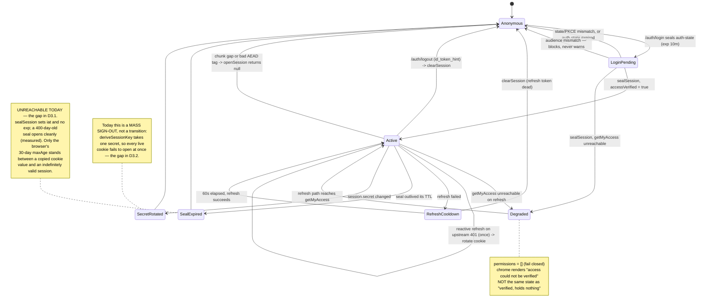

# ADR 0016: iron-session for the console session cookie — not adopted

## Status

**Rejected**

Records the assessment of [iron-session](https://github.com/vvo/iron-session) as a replacement for
the console's cookie session layer, asked for directly by the owner on 2026-09-03 ("I wanna
introduce iron-session for session management. Wdyt?"), tracked as
[issue #443](https://github.com/ADORSYS-GIS/converse-frontends/issues/443).

The answer is **no**, and this ADR exists to say why with numbers rather than taste — and to name
the two real gaps the question surfaced, which are the part of it that was right.

Scope note: this ADR decides the **sealing library**, nothing else. It leaves
[ADR 0009](0009-nextjs-console-replacement.md) Decision 2 (tokens live in the cookie and only in
the cookie, never in page JavaScript) exactly where it is. Every measurement below was taken
against that shape, not a hypothetical one.

## Context

### What the cookie carries today

`apps/console/src/server/session.ts` defines one `ConsoleSession`, sealed whole into
`lb_console_session.<N>`:

| Field                                               | Source                                           | Notes                                                                       |
| --------------------------------------------------- | ------------------------------------------------ | --------------------------------------------------------------------------- |
| `sid`                                               | `randomUUID()` at login                          | keys the server-side refresh de-dup / cooldown maps                         |
| `tokens.accessToken`                                | Keycloak token endpoint                          | the Bearer the proxy attaches to every upstream call                        |
| `tokens.refreshToken`                               | ditto                                            | `offline_access`; owns the refresh flow in `server/proxy.ts`                |
| `tokens.idToken`                                    | ditto                                            | used once, as `id_token_hint` on RP-initiated logout (`server/oidc.ts:235`) |
| `tokens.expiresAt`                                  | ditto                                            | epoch ms; drives `shouldRefreshProactively` at the 60s buffer               |
| `tokens.audience`                                   | `aud` claim                                      | re-validated on login and on every refresh                                  |
| `user.sub` / `name` / `preferredUsername` / `email` | access-token claims + `/userinfo`                | identity row only                                                           |
| `user.platformUserId`                               | `getMyAccess`                                    | the person behind the account (`users.id`)                                  |
| `user.roles`                                        | `getMyAccess`, or the token claim when it failed | **display only** — nothing gates on a role since #452                       |
| `user.permissions`                                  | `getMyAccess`                                    | the ONLY input to every gate (`server/access.ts`, `client/use-can.ts`)      |
| `user.accessVerified`                               | `getMyAccess` reachability                       | `false` = fail-closed empty set, not "holds nothing"                        |

So: yes, all three tokens; yes, the refresh token; yes, `permissions[]` and `roles`.

### How it is sealed today

- **Algorithm** — JWE compact, `alg: dir` + `enc: A256GCM` (AES-256-GCM, AEAD), via `jose`
  (`session.ts:sealSession`).
- **Key derivation** — `hkdfSync('sha256', secret, 'lightbridge-console', 'session-cookie-v1', 32)`.
  HKDF-SHA256, salt `lightbridge-console`, info `session-cookie-v1`, 32-byte output.
- **Versioning** — the HKDF `info` string is the only version marker. Bumping it invalidates every
  live cookie at once; there is no dual-read path.
- **TTL** — **none on the seal.** `sealSession` calls `.setIssuedAt()` and no
  `.setExpirationTime()`. The only expiry is the cookie's own 30-day `maxAge`
  (`session-store.ts:SESSION_MAX_AGE_SECONDS`), which is a client-side hint.
- **Rotation** — **none.** `deriveSessionKey` takes one secret. Rotating `session.secret` signs
  every user out.
- **Chunking** — 8 slots of 3500 characters (`cookie-names.ts`), written as
  `lb_console_session.0..7`, with unused tail slots explicitly expired on every write
  (`session-store.ts:writeSession`) and reassembly stopping at the first gap
  (`session.ts:joinCookieChunks`).
- **Config** — `session.secret`, required, minimum 32 characters (`server/env.ts:334`).

The login-state cookie (`sealAuthState` / `openAuthState`, PKCE verifier + CSRF `state` +
`returnTo`) uses the same key and _does_ set a 10-minute `exp`.

### The measured size

Measured, not estimated. A real token triple was minted from the repo's own dev Keycloak
(`compose.yml`'s `keycloak-26`, realm `lightbridge-dev`) after configuring it to production shape —
the `lightbridge_api_roles` realm-role mapper from `lightbridge-authz`'s own realm fixture, and the
`lightbridge-admin` role granted to the seeded user. `lightbridge-admin` maps to `*`
(`.docker/authz/container.yaml:275`), so `getMyAccess` expands it to the whole permission
vocabulary — 32 entries in `lightbridge-authz-core/src/authz.rs`'s `Permission::ALL`, plus the four
the console declares that landed after it (`session:read`, `user:read`, `rbac:manage`,
`budget:schedule-manage`). That is the largest `permissions[]` any real caller can hold.

```
raw access_token                          1642 B
raw refresh_token                          686 B
raw id_token                              1062 B
permissions[] JSON (36 entries, admin)     632 B
roles[] JSON                                90 B
session plaintext JSON                    4502 B

jose JWE, dir + A256GCM (today)           6123 B   -> 2 chunks @3500, first Set-Cookie 3578 B
iron-session v9.0.1 seal                  6238 B   -> does NOT fit one 4096-byte cookie
```

Both seals need two cookies. Neither fits in one. The console's own ceiling is 8 chunks
(21 877 B of headroom left); iron-session's is a hard, non-configurable 4
(9 834 B of headroom left). Both are ample. **Size is a wash, not an argument either way** — which
is worth stating, because "iron-session has a 4096-byte limit and no chunking" was the premise the
question came in on, and it is no longer true.

The chunk arithmetic above was then confirmed against the running console, not just the codec. A
full authorization-code + PKCE login was driven end to end against the same dev Keycloak
(`/auth/login` -> Keycloak login form -> `/auth/callback` -> `/api/session`), and the app wrote:

```
lb_console_session.0   value 3500 B   Set-Cookie 3617 B   seal
lb_console_session.1   value 1829 B   Set-Cookie 1946 B   seal
lb_console_session.2..7  value  0 B   Set-Cookie   72 B   expired (cleared tail slots)
-> 5329 B of seal across 2 live cookies, 8 Set-Cookie headers emitted
-> Cookie header on every subsequent request: 5381 B
```

5329 B rather than 6123 B because this run had no `getMyAccess` backend behind it, so the session
took the fail-closed path — `/api/session` answered `accessVerified: false`, `permissions: 0
entries`, `roles` echoed off the token claim, and **no token of any kind in the body**, which is
ADR 0009 Decision 2 doing its job. Add the admin's 632 B `permissions[]` back and the seal is the
6123 B measured above. Same two chunks either way.

### What iron-session v9 actually is

The library moved since the docs that premise came from. Pinned and read at **v9.0.1**
(`iron-webcrypto@2.0.0`), not v8:

- **Chunking exists.** `chunk: true` splits the seal across `name.0`, `name.1`, … — the identical
  naming the console already uses — capped at `MAX_CHUNKS = 4`, with stale-chunk expiry on shrink.
  Its own source comment calls the shrink case "the bug chunking would otherwise ship with";
  `writeSession` already handles it the same way.
- **TTL is enforced at unseal.** `expiration` is field 6 of the seal
  (`Fe26.2*<pwId>*<encSalt>*<iv>*<ciphertext>*<expiration>*<hmacSalt>*<mac>`), covered by the HMAC,
  and `unseal` throws `Expired seal` when `expiration <= now - 60s`.
- **Password rotation exists.** `password: { 1: old, 2: new }` — the highest id seals, every id
  unseals, and the id is field 2 of the seal.
- **`getIronSession` takes a `CookieJar`** (`{ read, names, write }`, an exported type), so the
  console's read-only `readSessionFromRequest(request: NextRequest)` path is expressible; there is
  also a `nextProxyCookies(request, response)` helper for the middleware rotation case.
- **Crypto**: AES-256-CBC + HMAC-SHA256, encrypt-then-MAC, two independently derived keys, each
  from `PBKDF2(hash: 'SHA-1', iterations: 1, salt: 256 random bits)`
  (`iron-webcrypto@2.0.0/index.js:118-123`).

None of that is broken. All of it was checked in the installed source, not assumed from a README.

## Decision

**Do not adopt iron-session.** Keep `jose` + HKDF-SHA256 + A256GCM, and close the two gaps the
question correctly identified in the code that is already there.

### D1 — The premise "replace hand-rolled crypto with a maintained library" does not hold

There is no hand-rolled crypto in `session.ts` to replace. There are six lines of `jose`, a
`node:crypto` HKDF call, and a `Math`-free string slice. `jose` is a maintained, audited,
first-class dependency of this repo already — it seals the auth-state cookie too. The genuinely
hand-rolled parts are **chunking** (about 40 lines) and **payload normalization**, and chunking is
not crypto: the AEAD tag covers the whole concatenated seal, so a dropped, reordered or
foreign-swapped chunk fails authentication and lands in the `null` path. iron-session's own source
gives exactly that reasoning for its own reassembly. Adopting would swap one maintained library for
another and delete 40 lines of string arithmetic, which is not the trade the question described.

### D2 — It is a measurable crypto downgrade, paid for nothing

|                                | today                                       | iron-session v9                                     |
| ------------------------------ | ------------------------------------------- | --------------------------------------------------- |
| cipher                         | AES-256-**GCM** (AEAD, one primitive)       | AES-256-**CBC** + HMAC-SHA256 (EtM, two primitives) |
| key derivation                 | **HKDF-SHA256**, RFC 5869, domain-separated | **PBKDF2-SHA-1**, 1 iteration, random 256-bit salt  |
| open cost (measured, 2000 ops) | **0.050 ms**                                | **0.324 ms** (6.5x)                                 |
| seal cost (measured, 2000 ops) | 0.078 ms                                    | 0.188 ms (2.4x)                                     |

Encrypt-then-MAC with HMAC-SHA256 is sound, and 1-iteration PBKDF2 over a ≥32-character
high-entropy secret is a KDF rather than a password stretcher, so SHA-1 here is not the SHA-1
collision story. Neither line is a vulnerability. Both lines are, straightforwardly, what you would
_not_ pick in 2026, and this is the admin console for a platform whose whole product is
authorization — "why does the session cookie derive its key with SHA-1" is a security-review finding
waiting to be written, and the honest answer would be "because we replaced something better with it."

The 6.5x open cost is not a blocker in absolute terms (0.32 ms against a network round trip), but
the console opens the session on every server component render and every route handler — about
thirty call sites through `session-store.ts` — and it buys nothing.

### D3 — The two features worth having are cheaper to add than to migrate to

The question was right that something is missing. Two things, both proven empirically rather than
read off the source:

1. **No server-enforced expiry.** A session sealed with an `iat` 400 days in the past opens
   cleanly today: `jwtDecrypt` reports `exp = undefined`, because `sealSession` never sets one.
   A cookie value copied out of a browser is valid for as long as `session.secret` lives. The
   30-day `maxAge` is advice to a browser, not a check. **Fix: one `.setExpirationTime()` call on
   the seal.** `jose` already rejects an expired `exp` at `jwtDecrypt`, and `openSession` already
   funnels every throw into `null`, so there is no second code path to write.
2. **No password rotation.** Changing `session.secret` invalidates every live cookie. **Fix:
   accept a list of secrets, seal under the first, try each in turn on open.** `deriveSessionKey`
   is already a pure function of the secret; this is a loop.

Together that is on the order of twenty lines against a design that keeps AES-256-GCM, keeps
HKDF-SHA256, keeps the existing test suite, and signs nobody out. Migrating instead costs the
`session.ts`/`session-store.ts` rewrite, the `session.test.ts` rewrite, the refresh-path rework
from an imperative `writeSession(response, …)` to iron's mutate-then-`save()` model — **and a
forced, global, one-time re-login for every user at deploy**, because the cookie format changes.
Paying a global sign-out to acquire two features that are twenty lines away, while downgrading the
cipher, is the wrong direction.

### D4 — One thing to copy, not adopt

iron-session's `MAX_CHUNKS = 4` is better reasoned than the console's `MAX_COOKIE_CHUNKS = 8`, and
its source says why: four chunks is already ~16 KB of `Cookie` header on **every request**, against
nginx's default 8 KB `large_client_header_buffers`. The console's 8-slot ceiling permits ~28 KB —
a session that large would fail at the ingress with a 400 that points nowhere near the cookie.

This is closer than the headroom figure suggests. The measured `Cookie` header is **5381 B today**
and about 6.2 KB for an admin carrying the full `permissions[]` — already two thirds of the way to
nginx's 8 KB default, at two chunks. A third chunk crosses it. So the useful ceiling is not 8 and
not 4; it is roughly **2**, and the console has no check that says so. Nothing is broken today, but
"we have 21 877 B of headroom" is the wrong mental model, and the 8-slot constant is what encodes
it. Lowering it — and, better, warning when the assembled header passes ~7 KB — is follow-up work,
not part of this decision.

### D5 — What would change this decision

Stated so this is falsifiable rather than final:

- iron-session moving to AES-GCM and HKDF (or `iron-webcrypto` raising the PBKDF2 hash) removes D2
  entirely, and the balance flips.
- A second app in this repo needing the same cookie session shape turns "twenty lines here" into
  "twenty lines in two places", which is when a shared library earns its keep.
- A CVE in `jose`'s JWE path, or `jose` going unmaintained.

## The session cookie lifecycle, as it stands

The interaction — who seals, who opens, and where the refresh rotates the cookie mid-request:

```mermaid
sequenceDiagram
    autonumber
    participant B as Browser
    participant MW as middleware.ts
    participant CB as auth/callback/route.ts
    participant PX as server/proxy.ts
    participant KC as Keycloak
    participant AZ as authz getMyAccess

    B->>MW: GET /accounts/A/overview
    Note over MW: cookies.has('lb_console_session.0')<br/>presence only — never decrypts<br/>(edge runtime has no node:crypto)
    MW-->>B: 302 /auth/login (no cookie)

    B->>CB: GET /auth/callback?code&state
    CB->>CB: openAuthState(cookie, secret) — PKCE verifier, exp 10m
    CB->>KC: POST /token (code + verifier)
    KC-->>CB: access + refresh + id token
    CB->>CB: checkAudience(accessToken) — blocks on mismatch
    CB->>AZ: getMyAccess(accessToken)
    AZ-->>CB: userId, roles[], permissions[]
    CB->>CB: sealSession() — jose dir+A256GCM, HKDF(secret)
    CB-->>B: Set-Cookie lb_console_session.0/.1 (6123 B, 2 chunks)

    B->>PX: XHR /api/... (Cookie: .0 + .1)
    PX->>PX: joinCookieChunks -> openSession -> ConsoleSession | null
    alt expiresAt - now <= 60s, or upstream 401
        PX->>KC: POST /token (refresh_token)
        KC-->>PX: new token triple
        PX->>AZ: getMyAccess(new accessToken)
        PX->>PX: rotateSession() -> sealSession()
        PX-->>B: Set-Cookie (rotated; unused tail slots expired)
    end
```

The lifecycle, with the two transitions this ADR says are missing marked explicitly:



## Consequences

**Now**

- `iron-session` is **not** a dependency of `apps/console`. Nothing in `src/server/session*.ts`
  changes under this ADR, so no user is signed out and no test is rewritten.
- The question is answered on record, with the measurements, so it does not get re-litigated from
  the v8 premise.

**Follow-up, named and sized — this ADR is not a reason to leave them undone**

1. **Seal TTL** (D3.1) — add `.setExpirationTime()` to `sealSession`, matched to
   `SESSION_MAX_AGE_SECONDS`. `openSession` already returns `null` on any throw, so this is one
   line plus a test that a backdated seal is refused. This is the security-relevant one.
2. **Secret rotation** (D3.2) — widen `session.secret` to accept a list, seal under the first,
   try each on open. Bump the HKDF `info` only when the derivation itself changes, not when a
   secret is added.
3. **Lower `MAX_COOKIE_CHUNKS`, and warn near the ingress limit** (D4) — the measured `Cookie`
   header is already 5381 B at two chunks, so the real ceiling is ~2, not 8. Failing at our own
   boundary with a message naming the cookie beats a 400 from nginx that names nothing.

**Costs accepted by rejecting**

- Chunking, TTL and rotation stay ours to maintain and to test. That is the price of keeping
  AES-256-GCM and HKDF-SHA256, and it is about sixty lines.
- If a second app in this repo grows the same session shape, revisit under D5.

## Verification

Every number in this ADR was measured on 2026-09-03 in this worktree, not estimated:

- Token triple minted from `compose.yml`'s `keycloak-26` (realm `lightbridge-dev`, client
  `self-service`), configured to production shape first: `lightbridge_api_roles` realm-role mapper
  added, `lightbridge-admin` granted to the seeded `test` user.
- Seal sizes and chunk counts: both codecs run over the identical `ConsoleSession`, with the
  admin's full 36-entry `permissions[]`, measured with `Buffer.byteLength` including the real
  `Set-Cookie` attribute string.
- Timings: 2000 operations per codec after a 200-operation warm-up.
- The missing-`exp` claim: a seal stamped 400 days in the past opened, reporting `exp = undefined`.
- Password rotation: a seal written under `{1: old}` was read back under `{1: old, 2: new}`, and a
  fresh seal was stamped with password id `2`.
- iron-session's `expiration` field, password-id field, `chunk` support and `MAX_CHUNKS = 4` were
  read in the installed `iron-session@9.0.1` / `iron-webcrypto@2.0.0` sources. `unseal` throws
  `Expired seal` at `iron-webcrypto/index.js:198`; note that iron-session's own `unsealData`
  wrapper swallows every unseal failure into `{}` rather than surfacing it — the console's
  `openSession` returns an explicit `null` instead, which is the better contract of the two.
- Wire behaviour: a real authorization-code + PKCE login round-trip against the dev Keycloak, with
  the console served by `next dev` against `config.roundtrip.yaml`, reading the actual
  `Set-Cookie` headers off `/auth/callback` and the actual body of `/api/session`.
- `iron-session` was installed only to take these measurements and has been removed again;
  `apps/console/package.json` and the lockfile are unchanged by this ADR.
