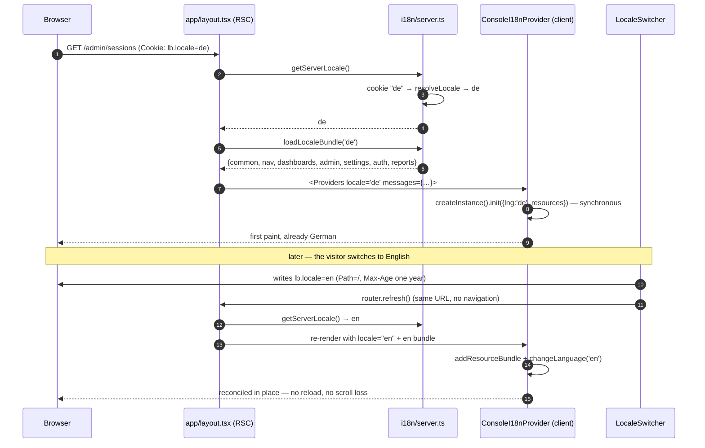
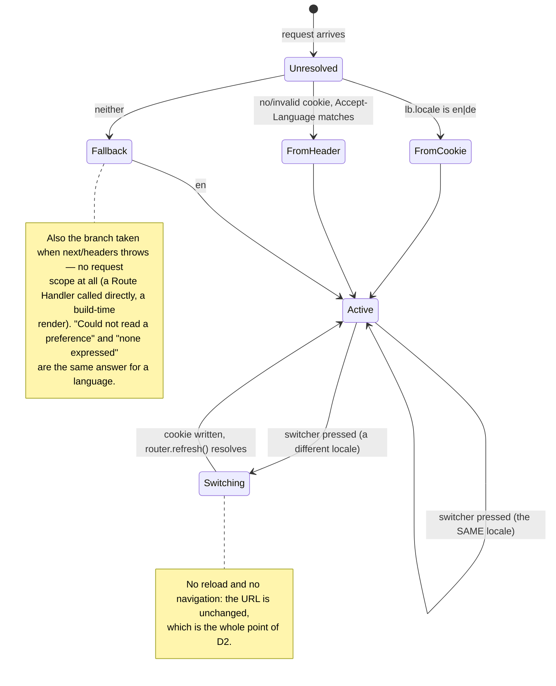

# ADR 0017: Console i18n — i18next on the App Router, locale in a cookie, copy out of `ui-web`

## Status

Accepted

Records the owner's 2026-09-03 directive — _"I wanna introduce i18n
([next-i18next](https://github.com/i18next/next-i18next)) with English first, German second"_ —
and the slice that implemented it for `apps/console` and `packages/ui-web`
([epic #443](https://github.com/ADORSYS-GIS/converse-frontends/issues/443)).

Amends [ADR 0013](0013-console-information-architecture-v3.md) by **not** touching it: the console's
paths are unchanged, and that is a decision (D2 below), not an omission.
Amends [ADR 0015](0015-admin-console-v2-declarative-dashboards-permissions-export.md)'s declarative
dashboards: `dashboards.yaml` now carries i18n keys where it carried English prose (D4), and the
Typst report contract gains one field (D6). Supersedes nothing in
[ADR 0009](0009-nextjs-console-replacement.md),
[ADR 0010](0010-ui-primitive-stack-and-theming.md) or
[ADR 0011](0011-url-first-state-nuqs.md).

Scope is honest and bounded: this ADR translated the shell and command palette, `/settings/*`,
`/admin/*`, every `dashboards.yaml` panel, the report templates, and the error/empty/loading lines
those screens use. It did **not** translate the whole console. What is left is measured, not
hand-waved — see "What is not translated yet".

## Context

The console shipped English-only. The owner asked for German as a second language, naming
`next-i18next` as the library.

`next-i18next`'s own README states it is for the **Pages Router**. This console has been App Router
since [ADR 0009](0009-nextjs-console-replacement.md), and every route in it is a Server Component
over a client data layer. The library therefore cannot be used as named, and pretending otherwise
would have meant either a router migration nobody asked for or a dependency that silently does
nothing.

What `next-i18next` actually IS, underneath, is `i18next` + `react-i18next` plus Pages-Router
plumbing (`serverSideTranslations`, `appWithTranslation`). The App Router needs different plumbing
for the same two libraries, and that plumbing is small enough to own.

## Decisions

### D1 — `i18next` + `react-i18next` + `i18next-resources-to-backend`, not `next-i18next`

A **per-request instance on the server** (`createInstance()`, wrapped in `React.cache` so one render
initializes once), and a **client provider seeded with the same resources**.

The module-level `i18next.init()` singleton is not a style choice to reject — it is unsound here. A
Node server handles overlapping requests on one module graph, so `changeLanguage('de')` for one
visitor would flip the language of every render in flight. `createInstance()` per request has no
such seam.

The client instance is created **synchronously**, from a bundle the server already resolved and
passed down (`app/layout.tsx` → `client/providers.tsx` → `i18n/client.tsx`). i18next's `init()` is
synchronous when it has nothing to load, so `t()` returns real copy on the first client render:
no Suspense boundary, no key-flash, and no hydration mismatch, because both halves used the same
bundle.

`i18next-resources-to-backend` loads the server side's namespaces lazily, from an **explicit**
importer table rather than a template-literal `import()`. A template literal makes the set of
shipped bundles a property of what happens to be on disk; an explicit map is checked by `tsc`, so a
namespace added without a file is a type error rather than a runtime 404.

### D2 — The locale lives in a cookie. There is no `/[locale]/…` path segment.

`lb.locale` → `Accept-Language` → `en`, stated once in `resolveLocale`.

[ADR 0013](0013-console-information-architecture-v3.md) makes console paths stable so a link pasted
into a ticket opens the same screen for whoever follows it. A locale prefix would break that for the
one case it matters most: two colleagues reading in different languages cannot share a URL. Language
is a per-visitor **preference**, not part of the resource's identity — which is what a cookie is
for.

The cost is that a page's HTML varies by cookie. Every console route already opts out of shared
caching (`shared/uncacheable-paths.ts`), so there is no cache key to poison.

The switcher writes the cookie from the browser and calls `router.refresh()`. `refresh()` re-runs
the Server Components for the current URL — which is exactly what "no locale in the path" buys — so
the tree reconciles in place: nothing unmounts, scroll position survives, and the URL is
byte-identical before and after. No Server Action, no round trip before the re-render: this is a
display preference with nothing to authorize.

### D3 — `packages/ui-web` owns no translations. Two mechanisms carry copy, and only two.

`ui-web` is framework- and app-agnostic: Storybook renders it with no app around it, and
`apps/lci`/`apps/authz-ui` consume it without an i18n runtime. So it **never** holds an i18next
instance and never calls `t()`.

1. **Props** — anything a screen decides (a heading, an empty-state line, a column label) is a prop.
   That is already how nearly every section here works; i18n changes nothing about it except that
   `apps/console` now passes `t('…')` where it passed a literal.
2. **`useCopy()`** (`packages/ui-web/src/lib/copy.tsx`) — for the handful of strings baked into a
   PRIMITIVE's own behaviour, where a prop would have to be threaded through every intermediate
   section to reach the component that renders it: `Pagination`'s captions, `ErrorLine`'s "Retry",
   `DashboardPanel`'s "Expand …", `BottomSheet`'s "Close". Every one has an **English default**, so
   a consumer that mounts no provider renders exactly what it rendered before.

There is deliberately no third path. A component library that owned a resource bundle would need
every app to keep that bundle in step with its own, and the first divergence would be a screen half
in each language.

### D4 — `dashboards.yaml` carries i18n KEYS; the engine resolves them server-side

`title`, `subtitle`, `options.rowLabel` and `options.unit` are keys into `dashboards.json`
(`admin-overview.estate-spend.title`); the English text lives in `locales/en/dashboards.json`.
`dashboardPage(route)` resolves them against the request's locale before the spec reaches a client
centre, so `DashboardRenderer` and the report builder both stay ignorant of i18n.

The document is the single declaration of what a dashboard IS, and it is overridable per deployment
(`${CONSOLE_CONFIG_DIR}/dashboards.yaml`, ADR 0015 / owner ruling Q11). English prose in it would
have meant either English panel titles for a German session or a parallel translated YAML — a second
document with the same 92 panels, which is the thing externalizing the dashboards exists to prevent.
A key is the same size, is checked by the parity test, and leaves the structure an operator actually
overrides untouched.

Everything else in an entry stays machine vocabulary: scopes, dimensions, limits, panel types. None
of it is copy, and translating any of it would break the query.

Storybook's `Pages/FromSpec` reads the same YAML and resolves against `locales/en/dashboards.json`
directly, so "the fixture path IS the YAML" now holds for the copy as well as the structure.

### D5 — Money keeps ONE convention and ONE home; only the notation follows the language

Currency does **not** change with the language (owner ruling). Every figure is USD in both
languages — a German-reading operator and an English-reading one are looking at the same ledger, and
swapping the symbol for `€` would be this console inventing an exchange rate it does not have.

What changes is notation, per DIN 5008:

|             | English      | German        |
| ----------- | ------------ | ------------- |
| grouped     | `$1 131.80`  | `1.131,80 $`  |
| sub-cent    | `$0.0063`    | `0,0063 $`    |
| below floor | `<$0.000001` | `<0,000001 $` |

The adaptive decimal ladder documented at the top of `money.ts` is untouched: the same decimal COUNT
is chosen for both locales and only rendered differently, so `formatUsdOf`'s per-value laddering,
the six-decimal floor and the pad-zero trim all behave identically. `money.ts` stays hand-rolled
rather than reaching for `Intl.NumberFormat`, exactly as its own header requires — the thin-space
grouping in `en` is a typographic contract no locale produces.

The money locale is **ambient** (`setMoneyLocale`, called by `CopyProvider`) rather than threaded
through 100+ call sites, and that is sound here for a checkable reason: money is only ever formatted
in the browser — where a document has one locale for its lifetime, and where the console's data
layer is `ssr: false` by construction (ADR 0009 D7) — or in the report pipeline, which runs per
request on the server and therefore passes its locale **explicitly**. A third caller formatting
money during a concurrent server render must pass its locale too; this is a default, not a
request-scoped store.

Counts and dates go through `Intl` with the active locale (`toLocaleString(intlLocale)`), so
`2,000` in English is `2.000` in German.

### D6 — The console translates, the Typst templates render

A `.typ` template is Typst source with no i18n runtime and no way to reach one: it can read
`data.json` and nothing else. So every word a template prints on the DOCUMENT's own behalf arrives
pre-translated in `report.labels` (`generated`, `template`, `noRows`), resolved server-side against
the reader's locale. Column headers, delta wording and the per-panel "could not be loaded" line
arrive the same way, inside the panels.

This is also what makes an operator's own template override
(`${CONSOLE_TEMPLATES_DIR}/<route>/report.typ`) translated for free: it reads
`report.labels.generated` exactly as the shipped template does, without having to know a locale
exists.

### D7 — `packages/i18n` is deleted, not reused

The workspace already had `@lightbridge/i18n`: a client-only i18next singleton with hard-coded
resources for `apps/self-service`, an app that no longer exists. Its only consumers were
`packages/hooks/src/locale-sync.ts` and one `useTranslation` call in
`packages/hooks/src/projects.ts` — neither reachable from any shipped app (nothing imports
`@lightbridge/hooks`' root entry point at all).

Keeping it would have left the workspace with two i18n runtimes and two answers to "where does copy
live". It is deleted along with the dead hooks that consumed it — the hard-cutover rule, applied to
the thing this ADR replaces.

## What is not translated yet

`apps/console/src/i18n-hardcoded-copy.test.ts` counts the remaining hard-coded user-visible strings
and **pins the number**: it may go down freely, and going up fails the build. The count when this
ADR landed is **28**, across:

- `/accounts/<id>/overview` and its loading boundary (the budget card, the stat row, the project
  picker),
- `/accounts/<id>/api-keys` and `use-api-keys-screen.ts`,
- `/settings/accounts/<id>/projects` and `.../request-refill`,
- `use-build-info.ts`'s probe captions (rendered on `/settings/info`),
- `dashboards/panel-adapters.tsx`'s row vocabulary — `Unassigned`, `Previous period`, and the
  delta wording,
- and, outside the console, `packages/ui-web`'s own remaining English defaults.

One further piece is not in that count because it is a composed sentence rather than a labelled
prop, and it is named here so it cannot hide: **`containers/budget-period-caption.ts`**
(converse-frontends#479), the budget-period line `/admin/overview`, `/accounts/<id>/overview` and
the settings account lens all render. It assembles a cadence sentence, a relative "next in 6 h"
phrase and a per-mode tick clause, which is a harder i18n shape than a template with placeholders —
German would want a different clause ORDER, not a different set of words in the same slots. It
stays English in this slice and goes in the follow-up whole.

Tracked in [converse-frontends#490](https://github.com/ADORSYS-GIS/converse-frontends/issues/490).

The ratchet is deliberately a MEASUREMENT rather than an assertion: it makes "we are still finishing
this" a checkable fact instead of a promise, and makes the next screen someone writes in English a
build failure rather than a silent regression.

## Consequences

- **Adding copy is adding a key in two files.** `locales/en/<ns>.json` is the source of truth;
  `locales/de/<ns>.json` must mirror it exactly. `i18n/resources.test.ts` proves parity, non-empty
  values, and identical `{{placeholders}}` — at build time, because the client ships only the active
  locale and therefore has no English to silently fall back to.
- **Plurals are i18next's**, never a hand-rolled `=== 1 ? '' : 's'` in JSX: German pluralises on a
  different rule, and a suffix appended in a component is that rule asserted on the bundle's behalf.
- **Pure modules that produced English sentences now produce FACTS.** `familyTruncationCap` returns
  a number, `budgetPressureTruncation` returns `{shown, total}`, `rangeLabels(t)` takes the caller's
  `t`. A module constant is resolved at import time, before any request has a locale — so copy
  cannot be one.
- **`useTranslation` works in tests with no provider.** `src/test/setup.ts` registers a real
  English-resolved instance as react-i18next's default, so existing component tests read English
  rather than raw keys — and `englishT()` resolves against the shipped bundle, so a nav test
  asserting `'Refills queue'` is simultaneously asserting the key exists.
- **How a person switches language:** the sidebar footer's "Language" row, directly under Theme, or
  `/settings/info` → "Client state" → "Language". Both write `lb.locale` and refresh in place.
- **The control is a `SelectField`** (owner directive, 2026-09-03: "Language selection should be a
  dropdown"), not the `SegmentedControl` this ADR shipped. The strip's width is the SUM of every
  language's endonym, so it is a control that grows — and eventually wraps or truncates the labels
  a reader depends on — with each locale added; a dropdown is the same width at two languages as at
  twelve. `layout="inline"` sizes the trigger to its content for the footer row's trailing slot,
  and `hideLabel` keeps the row's own visible label the only one on screen while the control still
  carries a real accessible name. The option labels stay **endonyms** ("English", "Deutsch"),
  identical in both bundles, for the reason this ADR already gives.
