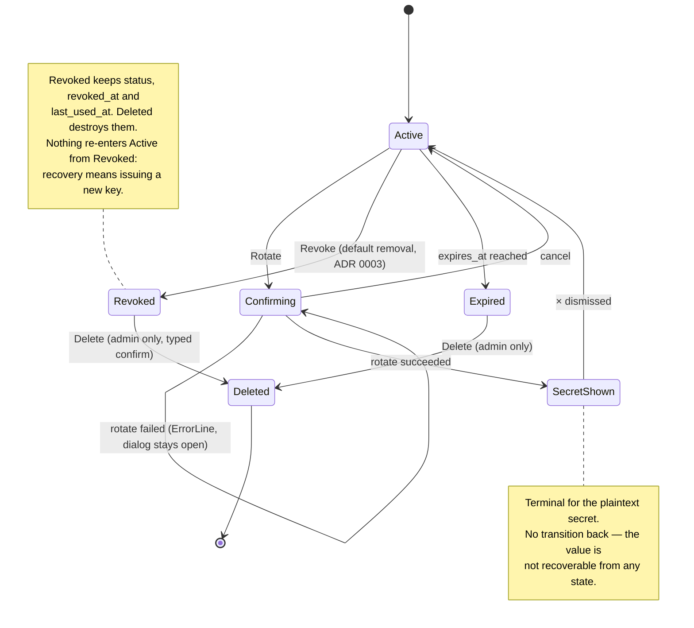
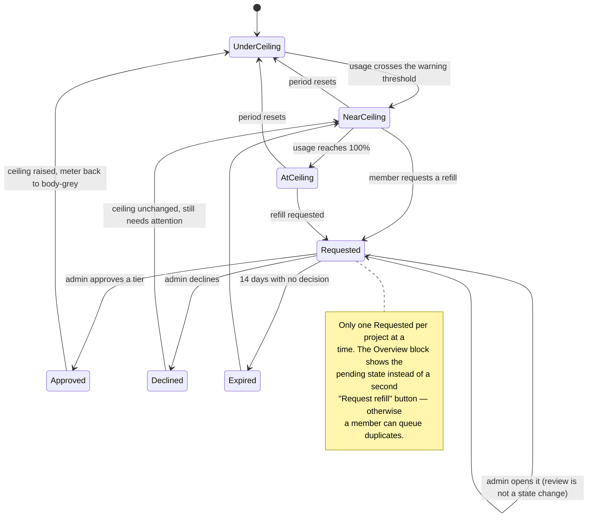
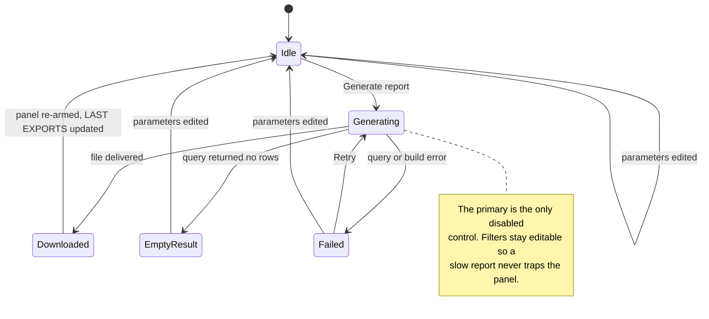

# Lightbridge console redesign — Next.js design spec

Design spec for rebuilding the Lightbridge self-service console as a **Next.js web app**
(replacing the Expo / react-native-web app), using refine.dev for CRUD scaffolding and DOM
`<svg>` ports of the existing `packages/ui` d3 chart primitives for the dashboards
([ADR 0009](../../adr/0009-nextjs-console-replacement.md) Decision 5).

**This document does not re-decide the visual direction.** The palette, shell inversion,
nav spine, chart-colour rule and table treatment are locked by
[ADR 0008](../../adr/0008-console-shell-inversion-and-visual-direction.md). What follows is
the *application* of that direction to the new Next.js scope, grounded in fresh Refero
research for the parts ADR 0008 and [ADR 0001](../../adr/0001-self-service-account-project-api-key-ux.md)
do not already cover.

Artifacts in this directory:

| File | What it shows |
| --- | --- |
| `overview.svg` | 1440×900 — Overview: stat-card row + the three ADR 0008 dashboards |
| `api-keys.svg` | 1440×900 — Api-Keys: one-time secret strip, key ledger, lifecycle row group |
| `manage-projects.svg` | 1440×900 — Manage/Projects: refine list + monthly report export panel |
| `admin-budget-review.svg` | 1440×900 — Admin: refill review queue + review detail panel |
| `shell-compact.svg` | 900×700 — compact tier (600–1024): right panel docks as a bottom sheet |

The SVGs are **hand-authored documentation artifacts**, not exported comps. They use the real
palette, the real type hierarchy and realistic data so that spacing and density can be argued
about before any React is written.

---

## 1. Research summary

Refero research run 2026-08-24. Counts are honest: previews scanned vs. references retrieved in full.

- **Styles**: 1 query (`dark technical observability console near-black surfaces monospace numerics
  single accent`), 10 previews scanned, **1 retrieved in full** (Axiom — the locked primary; retrieved
  to get its exact token table rather than paraphrasing ADR 0008).
- **Screens**: 6 queries (AI/dev-tool usage dashboards; dark stat-card rows with sparklines; CSV/PDF
  report export; dark admin table with row-detail side panel; admin approval queues; SSO login),
  ~60 previews scanned, **6 retrieved in full**.
- **Flows**: 1 query (API key rotation / secret regeneration), 10 previews scanned; plus the two
  flows already locked by ADR 0001/0008.

### 1.1 Visual direction — unchanged, now with exact tokens

The style search confirmed the lock rather than challenging it. Axiom is the only reference in the
dark-console field that pairs a **near-black tonal surface stack** with a **monospace-primary type
system** and a **single non-decorative accent** — the three traits this console is built on. The
full style reference supplied the exact values in §2.

Everything else in the field was reviewed and **rejected as a direction**, because each one would
break one of the three locked traits:

| Rejected style | Refero preview | Why rejected |
| --- | --- | --- |
| Better Stack | [preview](https://images.refero.design/styles/betterstack.com/57de4778-3318-488d-bc12-110d95f7654b/preview_0.jpg) · [site](https://betterstack.com) | Blue-violet glow accent + pill buttons; glow is decorative, pills contradict the 2px radius |
| Inngest | [preview](https://images.refero.design/styles/inngest.com/46bfdc1b-2a29-454e-ad35-e01a41c59dcf/preview_0.jpg) · [site](https://inngest.com) | Amber accent *plus* muted green/orange decorative grid motifs — a second and third colour |
| Neon | [preview](https://images.refero.design/styles/neon.tech/67f3bfa4-d23c-49e6-8158-6f52789689aa/preview_0.jpg) · [site](https://neon.tech) | Neon-green signal is closest in spirit, but its scanline/glitch imagery is atmospheric decoration |
| Checkly | [preview](https://images.refero.design/styles/www.checklyhq.com/0a2ad49e-4339-48ad-a62d-56a47cc0b654/preview_0.jpg) · [site](https://www.checklyhq.com) | Navy canvas + electric blue + soft shadows on cards; loses the black floor |
| Linear changelog | [preview](https://images.refero.design/styles/linear.app/11d3e58a-87d7-4a9a-bbf5-720f4fd3ffc6/preview_0.jpg) · [site](https://linear.app/changelog) | 8px radius + 9999px capsules everywhere; Inter-first, not mono-first |
| Trunk / Dovetail | [Trunk](https://images.refero.design/styles/trunk.io/09af2984-b556-4971-bd5a-20224574ccd9/preview_0.jpg) · [Dovetail](https://images.refero.design/styles/dovetail.com/bfe919de-a9a1-4551-bcf7-4d49facc26bd/preview_0.jpg) | Blueprint line-art / wireframe atmospherics — decorative graphics with no product role here |

One trait **was** borrowed from a rejected reference, bounded to a single role: Linear's
"depth from borders and tonal shifts, never shadows" is applied to the floating-panel↔floor
separation. It reinforces ADR 0008 Decision 3 rather than competing with Axiom.

### 1.2 Product patterns — screens

| Reference | Refero link | What was taken |
| --- | --- | --- |
| **Cursor** — usage & billing (dark) | [screen](https://refero.design/pages/7573ea52-2410-4886-930a-bc76b11943ae) | Card grid → full-width chart → full-width usage table reading order; right-aligned numeric columns; date-range + quick-range controls sitting *with* the chart, not in a global toolbar |
| **fal.ai** — usage-billing (dark) | [screen](https://refero.design/pages/44595c95-0b46-4ca4-8378-3f54826b28a8) · [alt](https://refero.design/pages/fb342c8c-12c8-4e0a-95e6-6a966b7da351) | KPI tile row above the fold with *money-first* labels (invoice due, subtotal, daily burn); `Export CSV` as an outlined control in the section header band |
| **OpenAI** — platform usage | [screen](https://refero.design/pages/a81bb53c-e070-48c3-82d5-34b2eb1e561e) · [detail](https://refero.design/pages/e987eeb9-b717-431f-b8c7-9bd648c944bb) | `$0.60 of $120.00` + **Increase limit** placed immediately beside the number. This is the ADR 0008 Decision 7 pattern, and it now has a re-openable Refero capture (ADR 0008 recorded it as a direct observation with no capture) |
| **Gladia** — settings/usage (dark) | [screen](https://refero.design/pages/27a8c8d9-c095-4a87-8f8e-c18ecc28176d) | Three-control filter row: **API key · date · granularity**. Adopted wholesale as the right-panel `VIEW` block. Gladia is already the ADR 0001 primary flow reference, so this is consistent, not a new voice |
| **Mercury** — transactions (dark) | [screen](https://refero.design/pages/ad0fd5c1-c21c-476f-9f8c-72f4e4ec758a) | Row-select drives a right-hand detail panel; summary metrics inline *above* the table rather than in cards; 52px rows for a review queue vs 44px for a browse list |
| **Coinbase** — download report | [screen](https://refero.design/pages/339214d7-5cea-4e01-9a5e-4ae46421c788) · [statements](https://refero.design/pages/4c255140-dde9-4931-9614-97cbe65fd127) | Report export as **scope + period + format + generate**, with CSV and PDF as peers of one another. Coinbase's own statements page puts this in a right-hand form panel — which is exactly where ADR 0008 Decision 3 wants it |
| **Fingerprint** — team members | [screen](https://refero.design/pages/936c3653-4aaf-4219-b990-502d0f01644d) · [pending](https://refero.design/pages/09be8fbb-84df-480d-b043-f56a29b8e44c) | `Members / Pending` text-tab split with a count in the label → adopted as `Pending (4) / Decided (26)` on the review queue. Fingerprint is already an ADR 0001 style reference |
| **Rox** — contact discovery (dark) | [screen](https://refero.design/pages/9508acc4-47bb-46e5-9657-ef7ba14eb8e7) | Confirms dense dark tables survive without row striping when hairlines and typographic hierarchy carry the structure — the Midday borrow works on a black floor |
| **Resend** — audience topics | [screen](https://refero.design/pages/3c45b12a-7c10-49a4-a820-127a9b2ee30f) | Three-column list-with-persistent-right-panel at desktop; the right panel is a *fixed* column, not an overlay drawer |
| **Webflow** — SSO login | [screen](https://refero.design/pages/e57d91d8-aebf-4594-ac5b-f89a360fb5bc) · [Sketch](https://refero.design/pages/99194395-c4d7-4eac-8253-08e4a558fa02) | Single centred column, logo top-left, one heading, one control, one primary button, one escape-hatch link. Nothing else |
| **Cohere** — spending limit | [screen](https://refero.design/pages/0316cb1c-3c50-4af2-8ca1-fd84b004d901) | Already locked by ADR 0008 Decision 7 — number, ceiling and control on one panel |

**Deliberate divergence from Mercury and Resend:** both use an *overlay* side sheet that slides
over the content. ADR 0008 Decision 3 specifies a persistent right panel. We keep the panel
persistent and let it *retarget* on row selection (see §5.4) — the Mercury pattern minus the overlay.

### 1.3 Journey logic — flows

| Flow | Refero link | What was taken |
| --- | --- | --- |
| Gladia — API key deletion | [flow 10901](https://refero.design/flows/10901) | Typed-phrase confirmation before an irreversible key action (already ADR 0001-locked; carried forward for `delete`) |
| Gladia — API key creation | [flow 10900](https://refero.design/flows/10900) | Optional name → create → list updates in place with the new row already present |
| Cohere — create trial API key | [flow 3885](https://refero.design/flows/3885) | One-time secret display with copy affordance, then return to the list with scope preserved (ADR 0001-locked) |
| Cohere — production key onboarding | [flow 3882](https://refero.design/flows/3882) | Name-validation error state *inside* the create step, not as a separate screen |
| Exa — service key creation | [flow 12030](https://refero.design/flows/12030) | Post-create success message rendered **in the list**, not in a toast that disappears — the secret must not be dismissible by inattention |
| Cohere — set monthly spending limit | [flow 3896](https://refero.design/flows/3896) | Where a limit change is *entered from* (ADR 0008-locked) |
| TravelPerk — approval processes | [flow 5255](https://refero.design/flows/5255) | Approval queues keep an `active / archived` split and confirm the decision with a toast anchored to the queue |

---

## 2. Token sheet

Values are ADR 0008 Decision 5, cross-checked against the full Axiom style reference.

### 2.1 Surfaces

| Token | Value | Role — **do not repurpose** |
| --- | --- | --- |
| `--floor` | `#000000` | The page. Content sits **directly on it**. Never a card fill |
| `--chrome` | `#111111` | Global header, and the inset fill of form controls |
| `--panel` | `#191919` | Floating panels (left rail, right rail, stat cards, bottom sheet) |
| `--raised` | `#202020` | Active nav row, active segmented cell, hairline rules |
| `--line` | `#3a3a3a` | Control borders, chart baseline, group separators |
| `--muted` | `#606060` | Labels, placeholders, disabled, tertiary metadata |
| `--body` | `#b4b4b4` | Primary body text on dark |
| `--strong` | `#eeeeee` | Headings, key numerals, text on the accent fill |
| `--signal` | `#DA5C2C` | **CTA · active state · "this needs you"**. Never decoration, never a large fill |

Row-hover fill is `--chrome` (`#111111`) — one step up from the floor, which is how a hairline
table gets a hover state without borders.

### 2.2 Type

Two families only.

- **Mono** — `IBM Plex Mono` (Axiom ships BerkeleyMono; Plex Mono is its documented substitute).
  Everything structural: nav, labels, table cells, **all numerics**, buttons, headings.
- **Sans** — `Inter`, weight 400 only. Helper prose, hints, requester notes, legal-ish copy.
  If a string is a value, a label or a control, it is mono. If it is a sentence, it is Inter.

| Role | Size / line-height | Colour | Used for |
| --- | --- | --- | --- |
| `page-title` | 22 / 1.25 mono | `--strong` | One per screen |
| `panel-title` | 16 / 1.3 mono | `--strong` | Right-panel subject (e.g. selected project) |
| `metric` | 22–26 / 1.2 mono | `--strong` | Stat-card values, budget hero |
| `row` | 12 / 1.4 mono | `--strong` / `--body` | Table primary vs secondary cells |
| `meta` | 11 / 1.4 mono | `--body` / `--muted` | Dates, counts, statuses |
| `label` | 10 / 1.5 mono, `letter-spacing .09em`, uppercase | `--muted` | Section labels, table headers, field labels |
| `prose` | 10–11 / 1.45 Inter | `--muted` / `--body` | Hints and explanations |

Numeric columns are **right-aligned**; the mono family makes the digits line up as a ledger.
Thousands use a thin space (`$1 131.80`), currency is always written out with two decimals.

### 2.3 Shape, elevation, spacing

- **Radius** — `2px` for every panel, control and button. `9999px` is not used anywhere in the
  console; Axiom reserves it for marketing pills and there is no console equivalent.
- **Elevation** — none. Separation is tonal (`#000` → `#111` → `#191919` → `#202020`). No
  `box-shadow` on panels; Axiom's `0 1px 2px rgba(0,0,0,.05)` is invisible on a black floor and
  is therefore dropped rather than faked.
- **Borders** — panels have **no border**. Only three things get a stroke: form controls
  (`--line`), the table hairlines (`--raised`), and the chart baseline (`--line`).
- **Spacing scale** — `4 · 8 · 12 · 16 · 20 · 24 · 32 · 40`.

**Recorded divergence:** Axiom's do-rule says *"32px internal padding for feature cards."*
The mockups use **16px in rail panels and 20px in centre panels**. That figure comes from Axiom's
*marketing* feature cards, which are ~400px wide and hold two lines of copy; a 209px stat card or a
280px rail cannot carry 32px inset without the content collapsing to a sliver. Axiom's own product
screenshots — the observability console the style is derived from — are far denser than its
marketing page. 32px is retained for any panel wider than 600px that contains prose.

### 2.4 Chart colours (ADR 0008 Decision 6, made concrete)

Monochrome ramp, drawn from the grey palette, **ordered by series rank not by hue**:

```
rank 1  #b4b4b4     rank 2  #7c7c7c     rank 3  #565656     rank 4+ #3a3a3a
selected / breached  #DA5C2C
```

Rules:
- Orange appears **at most once per chart**, and only for the selected series or one that has
  breached a ceiling / SLO.
- Gridlines `--raised`, baseline `--line`, tick labels `label` at 9px.
- Ridgelines fill with `--panel` and stroke with the ramp — shape carries the reading, so the
  fill is deliberately near-invisible.
- Meters are a 4px `--raised` track with a `--body` fill; the fill turns `--signal` **only** past
  the warning threshold. That is the same "needs you" semantic as the chart rule.

Explicitly rejected, with sources: fal.ai's lime/cyan/purple/blue/orange/red endpoint legend and
its multi-colour treemap ([screen](https://refero.design/pages/44595c95-0b46-4ca4-8378-3f54826b28a8));
Cursor's teal/blue stacked areas ([screen](https://refero.design/pages/7573ea52-2410-4886-930a-bc76b11943ae));
OpenAI's green/purple/orange stacked bars. All three are the peer pattern ADR 0008 chose to differ from.

---

## 3. Shell and grid

ADR 0008 Decision 3, expressed as a 1440 grid. All numbers are the ones drawn in the SVGs.

```
┌──────────────────────────────────────────────────────────────────── 1440 ──┐
│ header  #111111  h56  · logo slot (config-driven) · org switcher · account │
├───────────┬────────────────────────────────────────────┬───────────────────┤
│ LEFT RAIL │ CENTRE — the floor (#000)                  │ RIGHT RAIL        │
│ x16 w208  │ x248 w872                                  │ x1144 w280        │
│ #191919   │ no card, no container, no max-width shim   │ #191919           │
│ stackable │ tables and charts sit on the floor         │ knobs for centre  │
└───────────┴────────────────────────────────────────────┴───────────────────┘
     16px gutter        24px gutter                  24px gutter      16px
```

- The **left rail is a stack of panels**, not one panel: nav spine on top, then a
  context panel (scope, or a section sub-nav). `overview.svg` stacks nav + scope;
  `manage-projects.svg` and `admin-budget-review.svg` stack nav + section sub-nav.
- The **Admin group is preceded by a `--raised` rule** and carries a `ROLE` marker, so a
  non-admin's three-item spine does not look like something is missing — it looks complete.
- The **centre never gets a card**. If a piece of content needs a container, that is a signal it
  belongs in a rail.
- The **right rail is persistent**, never an overlay. Its content retargets with selection.

### Panel inventory per screen

| Screen | Left rail stack | Right rail |
| --- | --- | --- |
| Overview | nav · scope | `VIEW` (range/bucket/group-by) · `FILTERS` · `SERIES` · `EXPORT` |
| Api-Keys | nav · scope | **New key** CTA · `SCOPE` · `FILTERS` · `KEY HYGIENE` · `LIFECYCLE` help |
| Manage | nav · Manage sub-nav | `MONTHLY REPORT` · `LAST EXPORTS` · `FILTERS` · `SELECTION` |
| Admin | nav · Admin sub-nav | Review detail for the selected request, with the decision actions pinned to the bottom |
| Auth | — | — |

---

## 4. Component inventory

Every primitive the Next.js build needs, with a one-line contract. Names are the proposed
component names; all are `PascalCase` in `kebab-case` files.

**Shell**

| Component | Contract |
| --- | --- |
| `ConsoleShell` | Owns the three-column grid and the tier switch; renders `header / left / centre / right` slots and nothing of its own |
| `ConsoleHeader` | `#111` bar; config-driven logo slot (falls back to a wordmark), org switcher, account menu |
| `RailPanel` | `#191919`, radius 2, no border, no shadow, 16px inset; stacks vertically inside a rail |
| `NavSpine` | The four fixed groups; `Admin` renders only with the `lightbridge-admin` grant; active item = `--raised` fill + 2px `--signal` left bar |
| `SubNav` | Second left-rail panel: section items with a trailing count; same active treatment |
| `BottomSheet` | The right rail at 600–1024: docked panel with a grab handle; same children, horizontal control row instead of vertical |

**Data display**

| Component | Contract |
| --- | --- |
| `StatCard` | `#191919` panel: 12px line glyph, `label`, `metric` numeral, delta line, and a right-hand `Sparkline`. Never tinted, never coloured by value |
| `Sparkline` | 81×26 unlabelled polyline in `--line` with a `--body` terminal dot; decorative-free, no axis, no tooltip |
| `LedgerTable` | Midday treatment: transparent on the floor, 0 radius, hairline `--raised` rules, no striping, right-aligned numerics, 44px rows (52px in review queues), optional totals footer above a `--line` rule |
| `StatusText` | Status as **text, not a pill**: `--body` active, `--muted` revoked/archived, `--signal` expiring/near-ceiling |
| `RowActionGroup` | Lifecycle actions revealed on row hover/focus, separated by **diagonal hairlines** (ADR 0001), ordered `Rotate ╱ Revoke ╱ Del` with revoke as the emphasised default |
| `Meter` | 4px track + fill; `--body` under threshold, `--signal` at or past it; always paired with `"$X of $Y"` in mono |
| `BudgetHero` | `metric` numeral + `of $ceiling` + `Meter` + caption + inline action — the OpenAI "number beside its ceiling beside its control" unit |

**Charts** (DOM ports of the `chart-core` d3 primitives — ADR 0009 Decision 5; monochrome ramp)

| Component | Contract |
| --- | --- |
| `SpendSeriesChart` | Multi-series line/area over time; exactly one series may be `--signal` |
| `LatencyRidgeline` | Stacked density ridges by model, label left / p95 right; a ridge over SLO strokes `--signal` |
| `ChartLegend` | Swatch (10×2 rect) + name + value; the selected entry is `--strong` + `--signal` swatch |

**Forms and actions**

| Component | Contract |
| --- | --- |
| `Button` | `primary` = `--signal` fill + `--strong` text; `secondary` = transparent + `--line` border + `--body` text; `ghost` = text only. Radius 2, height 30–34 |
| `Field` | Label above, `#111` inset with `--line` border, radius 2, height 30; focus = border → `--signal` |
| `SegmentedControl` | Equal cells, `--line` dividers; active cell = `--raised` fill + 2px `--signal` bottom bar |
| `ScopeSelect` | Account → project cascade; changing the account resets the project and the centre query |
| `SecretReveal` | One-time secret strip: heading, non-dismissible-by-blur explanation, read-only mono field, `Copy` primary. Shown **in the centre**, dismissed only by explicit `×` |
| `TypedConfirmDialog` | Destructive gate: names the object, states what survives and what does not, requires the object name typed exactly; primary stays disabled until it matches |
| `ReportExportPanel` | Period · scope · group-by · include-toggles · `CSV|PDF` segmented · one `Generate report` primary · last-exports list |
| `ReviewDetailPanel` | Right-rail review target: subject, consumption, requested amount, requester note, history, decision note, and `Approve` / `Decline` pinned to the panel bottom |

**States**

| Component | Contract |
| --- | --- |
| `InlineStatus` | A single mono line above the content: `23 active · 4 revoked · 1 expires in 6 days`. **This is the empty-state primitive too** |
| `SkeletonRow` / `SkeletonMetric` | `--raised` blocks matching the final geometry exactly; no shimmer, no spinner |
| `ErrorLine` | `--signal` mono line in place of the value, with a `Retry` ghost button on the same line |

---

## 5. Screen specs

### 5.1 Overview — `overview.svg`

Reading order is Cursor's: **tiles → trend → detail**, adapted to the three ADR 0008 dashboards.

```
y 102   page title + scope/period subline (Inter)
y 144   stat row — 4 × 209w × 104h StatCards, 12px gutters
y 292   dashboard 1  SPEND — BY PROJECT AND MODEL      (full width, on the floor)
y 544   dashboard 2  LATENCY DISTRIBUTION — p95        (left col, 528w)
y 544   dashboard 3  BUDGET — CONSUMPTION VS CEILING   (right col, 320w)
```

- **Stat cards** carry the CRM-screenshot *structure* — glyph, label, big numeral, sparkline right,
  delta below — with the tinted icon circle removed. A tinted circle is decoration, and the only
  tint available would be `--signal`, which is reserved.
- Deltas are `▲ 18% vs prev 30d` in `--body`, `— no change` in `--muted`. **Deltas are never
  green or red** — direction is carried by the glyph and the wording, not by a second colour.
- The spend chart, ridgeline and budget block all sit **uncontained on the floor**. There is no
  card behind any of them.
- The budget block is the ADR 0008 Decision 7 unit: `$142.55` `of $500.00`, a grey meter at 28%,
  then a `NEEDS ATTENTION` sub-block where `gateway-prod` at 91% gets the orange meter **and the
  `Request refill` primary sitting immediately beside the number** — never on a different screen.
- The block closes with a link into Admin (`1 pending · submitted 2 days ago → Review in Admin`),
  which is the only cross-group link on the screen.

### 5.2 Api-Keys — `api-keys.svg`

- **Account and project selectors live in the right rail**, not above the table. ADR 0001 requires
  them; ADR 0008 Decision 3 says scope knobs are right-rail furniture. Both hold. The current
  scope is echoed in the left rail's `SCOPE` panel and in the page subline, so it is never
  ambiguous which project the ledger belongs to.
- The **`SecretReveal` strip** occupies the top of the centre after create *or* rotate — both
  return the same one-time `secret`, so they share one component and one contract.
- The ledger's columns are `NAME · PREFIX · STATUS · CREATED · LAST USED · EXPIRES`, with the
  `RowActionGroup` occupying the trailing 136px on hover.
- **Revoke is the emphasised action** (ADR 0003): `--strong` text, while `Rotate` is `--body` and
  `Del` is `--muted`. Copy in the confirm dialog must distinguish them explicitly.
- The right rail's `KEY HYGIENE` block is an inline-status treatment of the things that need a
  human: expiring keys in `--signal`, never-used keys in `--body`, retained revoked keys in
  `--muted`.

### 5.3 Manage — `manage-projects.svg`

- refine.dev `list` maps to `LedgerTable`; `show` and `edit` map to a right-rail detail that
  replaces the report panel when a row is opened (same retarget mechanic as Admin).
- Sub-resources (`Projects · Accounts · Budgets · Members`) live in the **left-rail sub-nav** with
  counts, not as centre tabs — centre tabs would compete with the table header for the same band.
- The table carries a **totals footer** above a `--line` rule. This is the Midday borrow doing real
  work: a money table that does not total itself is an incomplete ledger.
- **Report export** (Coinbase, adapted): `Period → Scope → Group by → includes → format → generate`.
  Two deliberate divergences from Coinbase:
  1. It lives in the **right rail, not a modal** — ADR 0008 puts parameters in the rail, and
     Coinbase's own statements page does the same thing.
  2. CSV and PDF are a **segmented choice above one `Generate report` primary**, not two peer
     buttons each with its own generate. Two primaries side by side would double the accent on
     one panel, which the accent rule forbids.
- `LAST EXPORTS` gives the export a memory, so nobody regenerates January twice.

### 5.4 Admin — `admin-budget-review.svg`

- `Pending (4) / Decided (26)` text tabs with a 2px `--signal` underline on the active one
  (Fingerprint). Counts are in the label, not in a badge.
- The pending queue uses **52px rows** — a decision row is read, not scanned.
- **Selecting a row retargets the right rail** into `ReviewDetailPanel`. The panel carries, top to
  bottom: subject, consumption meter (orange at 91%), a burn sparkline, the requested amount as a
  `SegmentedControl` of the *policy's own tiers*, the requester's note, refill history, a decision
  note field, and `Approve +$250.00` / `Decline` pinned at the bottom.
- The approve button **names the amount**. `Approve` alone would be ambiguous once the reviewer has
  changed the tier.
- Below the queue, a `RECENT DECISIONS` ledger gives the queue an audit tail on the same screen —
  the review queue and its history are one surface, not two.
- Org config (including the **config-driven logo URL**, ADR 0008 Decision 8) is a sibling item in
  the Admin sub-nav. The logo slot is rendered in `ConsoleHeader` and falls back to the wordmark
  when unset; it is never a required field.

### 5.5 Auth

Not drawn — there is nothing to draw, and that is the point. Webflow/Sketch structure on the
console's own floor:

- `#000` full-bleed, no rails, no header chrome beyond the logo slot top-left.
- Centred single column, max 360px: wordmark → `Sign in to Lightbridge` (`page-title`) →
  one line of Inter explaining that sign-in happens at the identity provider →
  `Continue to sign in` primary → nothing else.
- **Signed-out state**: same page with an `InlineStatus` line above the button —
  `Your session ended · signed out 2 minutes ago` in `--muted`. Not a modal, not a toast.
- **Redirect-in-flight**: the button becomes `--muted` with the label `Redirecting…`; no spinner.
- **Callback error**: `ErrorLine` under the button with the provider's reason and a
  `Try again` ghost button. Never a raw OIDC error code without a sentence.

---

## 6. Interaction contracts

### Empty states are inline status lines

The only screen that earns a centred placard is one with nothing else to do. In this console
that is **no screen** — every list has a rail, a header and a create action already on screen.

| Situation | Treatment |
| --- | --- |
| No API keys yet | `InlineStatus`: `No keys in this project yet. Create one from the right.` above an empty ledger that still renders its header row |
| No projects in an account | Same, with the ledger header retained so the columns teach the shape of the data |
| No pending refills | `InlineStatus`: `Nothing awaiting a decision. 26 decided this month.` and the `RECENT DECISIONS` ledger fills the screen |
| Chart has no data in range | The axes render; a single `--muted` line sits on the baseline: `No usage in this range.` The chart frame never disappears |
| Filter returns nothing | `InlineStatus` plus a `Reset filters` ghost button on the same line |

Keeping the table header and the chart axes visible is deliberate: a disappearing frame reads as
a broken screen, an empty frame reads as an empty dataset.

### Loading

- Skeletons only, matched to final geometry: `SkeletonMetric` blocks in the stat row,
  `SkeletonRow` × N in ledgers, the chart frame with axes and an empty plot.
- **No spinners, no shimmer.** A shimmer is decorative motion on a surface that has none.
- Rails render immediately with real nav and disabled controls — the shell never flashes.
- Anything over ~800ms adds a `--muted` line under the skeleton (`Querying usage…`).

### Errors

- Field-level: `ErrorLine` under the control, border → `--signal`.
- Section-level: the section's content is replaced by one `ErrorLine` + `Retry`; the rest of the
  screen keeps working. A failed latency query must not take the spend chart down with it.
- Destructive-action failure: the `TypedConfirmDialog` stays open with the error inline. It never
  closes on failure — closing implies it worked.

### Motion

120–160ms `ease-out` on hover fills and panel retargets; 200ms for the compact-tier sheet.
Nothing animates on load. No parallax, no reveal-on-scroll.

### Accessibility

- `--body` on `--floor` is **10.1:1**; `--muted` on `--panel` is **2.8:1** — below AA, so `--muted`
  is used **only** for non-essential metadata and never for a value a user must read to act.
- `--signal` on `--floor` is **5.5:1**, which clears AA for normal text.
- Status is never colour-only: `expiring`, `revoked`, `near ceiling` are words first.
- Focus ring: 1px `--signal` outline with a 1px `--floor` offset. Row-hover actions must also
  appear on `:focus-within`, or they are keyboard-invisible.

---

## 7. Responsive behaviour

| Tier | Left rail | Centre | Right rail |
| --- | --- | --- | --- |
| **≥1024 — full** | 208px, stacked panels | 872px at 1440, fluid | 280px, persistent |
| **600–1024 — compact** | 168px, persists, counts drop from sub-nav | widens to fill; stat row wraps 4→2×2; charts stack single-column; ledgers drop the two least-load-bearing columns (`PREFIX`, `MEMBERS`) | **docks as a bottom sheet**: same children, control row goes horizontal (4-up), legend and export share the last row |
| **≤600 — guard rail** | collapses to a bottom bar | single column, tables scroll horizontally inside their own container | reachable from a control in the bottom bar |

`shell-compact.svg` draws the compact tier. Two rules it encodes:

1. The bottom sheet is **docked, not floating** — it is the right rail rotated, not a new pattern.
2. Nothing in the sheet is hidden behind a second interaction. If a control exists at ≥1024, it
   exists at 600–1024.

≤600 is a guard rail, not a design target (ADR 0008 Decision 2). Because landscape is forced, a
phone lands in *compact*, so this band only has to look unbroken.

---

## 8. Process diagrams

### 8.1 API key rotation

```mermaid
sequenceDiagram
    autonumber
    actor U as Project lead
    participant L as Api-Keys ledger (centre)
    participant D as TypedConfirmDialog
    participant S as SecretReveal (centre)
    participant API as POST /api/v1/api-keys/{id}/rotate

    U->>L: hover row → RowActionGroup appears
    U->>L: activate "Rotate"
    L->>D: open, naming the key and its prefix
    D-->>U: "the old secret stops working immediately"
    U->>D: type the key name exactly
    D->>D: enable primary only on exact match
    U->>D: confirm
    D->>API: rotate(keyId)
    alt rotated
        API-->>S: { secret, key_prefix, rotated_at }
        S-->>U: secret shown once, Copy primary, explicit × to dismiss
        L->>L: row updates in place — new prefix, last used reset
    else failed
        API-->>D: error
        D-->>U: dialog stays open with ErrorLine; nothing changed
    end
```



### 8.2 Budget refill: request → review → decision

```mermaid
sequenceDiagram
    autonumber
    actor M as Project member
    participant O as Overview · budget block
    participant R as Refill request form
    actor A as lightbridge-admin
    participant Q as Admin · review queue
    participant P as ReviewDetailPanel (right rail)

    O-->>M: "$455.20 of $500.00" · meter turns signal-orange at 91%
    M->>O: "Request refill" (inline, beside the number)
    O->>R: open with tiers read from the active policy
    M->>R: pick tier, add a note
    R-->>O: request submitted; block shows "1 pending · submitted just now"
    Note over O,Q: same record, two surfaces
    A->>Q: open Admin → Budget review · Pending (4)
    A->>Q: select row
    Q->>P: retarget right rail to this request
    P-->>A: consumption, burn trend, tier, note, refill history
    alt approve
        A->>P: Approve +$250.00
        P-->>Q: row leaves Pending, enters Decided
        P-->>O: ceiling becomes $750.00; meter returns to body-grey
    else decline
        A->>P: Decline (+ optional decision note)
        P-->>Q: row leaves Pending, enters Decided
        P-->>O: ceiling unchanged; block shows the decision and its note
    end
```



### 8.3 Monthly consumption report export

```mermaid
sequenceDiagram
    autonumber
    actor U as Account member
    participant E as ReportExportPanel (right rail)
    participant API as POST /usage/v1/usage/query
    participant F as Report builder
    participant B as Browser

    U->>E: period · scope · group-by · includes · CSV|PDF
    U->>E: Generate report
    E->>E: primary → "Generating…", disabled
    E->>API: query(period, filters, group_by)
    API-->>F: usage rows
    F-->>E: signed download URL
    alt ready
        E->>B: trigger download
        E-->>U: LAST EXPORTS gains "2026-02 · CSV · just now"
    else empty result
        E-->>U: InlineStatus "No usage in February 2026 for this scope." — no file produced
    else failed
        E-->>U: ErrorLine + Retry; the form keeps every input
    end
```



---

## 9. Decision ledger

| Decision | Source | Source rule / role preserved | Why |
| --- | --- | --- | --- |
| Near-black tonal stack `#000 → #111 → #191919 → #202020` | Axiom style ([preview](https://images.refero.design/styles/axiom.co/6e9baa82-2f2f-4e77-8b0d-566325635dbe/preview_0.jpg)) via ADR 0008 D5 | Surfaces 1/2/3 keep their roles: floor / chrome / panel | Locked; the full style reference supplied the fourth step (`#202020`) for active rows and hairlines |
| `#DA5C2C` for CTA, active state and "needs you" only | Axiom do/don't rules; ADR 0008 D5–D6 | CTA-only accent, never decorative | The one rule that makes the whole console legible at a glance |
| Mono-first type, Inter for prose only | Axiom typography tokens | BerkeleyMono → IBM Plex Mono substitute; Inter weight 400 | Numerics must align as a ledger; prose must stay readable |
| 2px radius, zero shadow, no panel borders | Axiom shape tokens; ADR 0008 D3 | 9999px reserved → dropped entirely (no console equivalent) | Separation is tonal, per D3's "never lines" |
| Panel padding 16/20px, not 32px | **Divergence** from Axiom do-rule | Axiom's 32px is a marketing feature-card figure | A 209px stat card cannot carry 32px inset; Axiom's own product screenshots are denser |
| Stat row: glyph · label · numeral · sparkline · delta | Owner's CRM screenshot (structure) + Cursor ([screen](https://refero.design/pages/7573ea52-2410-4886-930a-bc76b11943ae)) | Structure borrowed, palette not | Tinted icon circles dropped — the only tint available is the reserved accent |
| Deltas are never green/red | ADR 0008 D5 "no second vibrant colour" | — | Direction is carried by glyph + wording |
| Monochrome chart ramp, one orange series max | ADR 0008 D6 | Accent = signal, not category | Deliberately differs from fal.ai / Cursor / OpenAI, all reviewed |
| Budget number, ceiling and refill CTA on one line | OpenAI ([screen](https://refero.design/pages/a81bb53c-e070-48c3-82d5-34b2eb1e561e)) + Cohere ([screen](https://refero.design/pages/0316cb1c-3c50-4af2-8ca1-fd84b004d901)) | "number beside its ceiling beside its control" | ADR 0008 D7; now backed by a re-openable capture, which the ADR lacked |
| Right rail = `VIEW` / `FILTERS` / `SERIES` | Gladia ([screen](https://refero.design/pages/27a8c8d9-c095-4a87-8f8e-c18ecc28176d)) | Gladia's api-key · date · granularity triplet | Consistent with ADR 0001's existing Gladia lock; rotated from a row into a column |
| Row-select retargets the persistent right rail | Mercury ([screen](https://refero.design/pages/ad0fd5c1-c21c-476f-9f8c-72f4e4ec758a)) + Resend ([screen](https://refero.design/pages/3c45b12a-7c10-49a4-a820-127a9b2ee30f)) | **Divergence**: overlay drawer → persistent column | ADR 0008 D3 specifies a persistent right panel |
| Hairline ledger tables with a totals footer | Midday via ADR 0008 D5 | Table structure only, never Midday's white canvas | Money tables must total themselves |
| Status as text, not pills | shadcn/Fingerprint restraint (ADR 0001) | — | Pills need a fill; every fill available is either chrome or the reserved accent |
| Revoke emphasised over Delete; typed confirmation | ADR 0003 + Gladia ([flow 10901](https://refero.design/flows/10901)) | Typed-phrase gate before irreversible actions | Auditability over convenience |
| One-time secret shown in the centre, dismissed explicitly | Cohere ([flow 3885](https://refero.design/flows/3885)) + Exa ([flow 12030](https://refero.design/flows/12030)) | Success shown in place, not as a vanishing toast | A toast can be missed; the secret cannot be re-fetched |
| Export = scope + period + format + one Generate | Coinbase ([screen](https://refero.design/pages/339214d7-5cea-4e01-9a5e-4ae46421c788)) | **Divergence**: twin generate buttons → segmented format + single primary | Two accent primaries on one panel breaks the accent rule |
| Export lives in the rail, not a modal | Coinbase statements ([screen](https://refero.design/pages/4c255140-dde9-4931-9614-97cbe65fd127)) | Right-hand form panel | Matches ADR 0008 D3 exactly |
| `Pending (n) / Decided (n)` text tabs | Fingerprint ([screen](https://refero.design/pages/936c3653-4aaf-4219-b990-502d0f01644d)) | Count in the label, not a badge | Badges need a fill; see status pills |
| Sub-resources in the left rail, not centre tabs | ADR 0008 D3 (stackable left panels) | — | Centre tabs would compete with the table header band |
| Auth = one column, one control, one primary | Webflow ([screen](https://refero.design/pages/e57d91d8-aebf-4594-ac5b-f89a360fb5bc)) | Minimal SSO structure; gradient/media panels rejected | Sign-in happens at the IdP; the page is a doorway |
| Empty states are inline status lines | Owner constraint + house rule | Table headers and chart axes stay rendered | A disappearing frame reads as broken, an empty one reads as empty |
| Skeletons matched to geometry; no spinners | Cursor / Gladia loading treatments | No shimmer | Shimmer is decorative motion on surfaces that have none |

---

## 10. Tensions between ADR 0008 and the new scope

Recorded rather than silently resolved. Each needs an owner decision before or during build.

1. **ADR 0008 D9 mandated `react-native-svg` + `d3-scale`/`d3-shape`.** D9's reasoning was
   entirely about Expo/react-native-web having no DOM; on Next.js that constraint evaporates.
   **Resolved by [ADR 0009](../../adr/0009-nextjs-console-replacement.md) Decision 5**: the
   existing `chart-core` d3 math (scales, bins, `seriesColor` ramp) is consumed verbatim and the
   chart components are re-rendered as thin DOM `<svg>` elements. recharts/chart.js were
   considered and rejected — the monochrome-ramp behaviour is already built and tested, and a
   chart framework re-introduces the themed-widget look ADR 0008 rejects.

2. **ADR 0008 D3 says charts render *uncontained on the floor*; ADR 0008 D5 says stat cards get
   *`#191919` with generous padding*.** Both are honoured here — cards for scalar metrics, floor
   for charts — but the boundary is not stated in the ADR. The rule this spec adopts: **a scalar
   gets a panel, a distribution gets the floor.** Worth writing back into the ADR.

3. **The right panel now hosts a primary CTA** (`New key`, `Generate report`) and, in Admin, the
   *decision* actions. ADR 0008 D3 describes the right panel as "headers/configs/params/filters/
   knobs" — parameters, not actions. The spec extends it: **the right panel owns the action that
   consumes its own parameters.** Actions that operate on a centre *row* (rotate, revoke) stay in
   the row. This is an extension of D3, not a contradiction, but it is an extension.

4. **refine.dev's default `list / show / edit / create` route shape wants four URLs per resource;
   the shell wants a persistent right panel.** The spec resolves `show`/`edit` into a right-rail
   retarget rather than a route change, which means refine's routing must be configured to keep
   the list mounted. If that proves awkward, the fallback is a real `show` route where the centre
   becomes the detail and the rail becomes the edit form — but that fallback loses the queue
   context that makes the Admin screen work, so it should be a last resort.

5. **ADR 0007's `maxContentWidth` (1040px) token survives ADR 0008 explicitly, but the new shell
   has no centred column** — the centre is 872px at 1440 and fluid above it, bounded by the two
   rails rather than by a max-width. The token is either retired for console routes or repurposed
   as the Auth page's column cap. It cannot mean what it used to.

6. **`--muted` (`#606060`) fails AA against `--panel` (2.8:1).** Axiom uses it for placeholders and
   minor text on its marketing page, where nothing depends on it. In a console, some of what
   naturally reads as "minor metadata" (a revoked key's date, an archived project's account) is
   still information someone may need. The spec keeps `--muted` non-load-bearing, but a lint rule
   or a `--muted-strong` step around `#7c7c7c` may be needed once real screens are built.

7. **ADR 0008's nav spine has no home for Auth.** Every screen must nest in one of four groups;
   the login and signed-out pages nest in none of them. Treated here as *outside the shell*
   entirely — they render on the floor with no rails. Consistent with the ADR's intent, but not
   something the ADR says.
