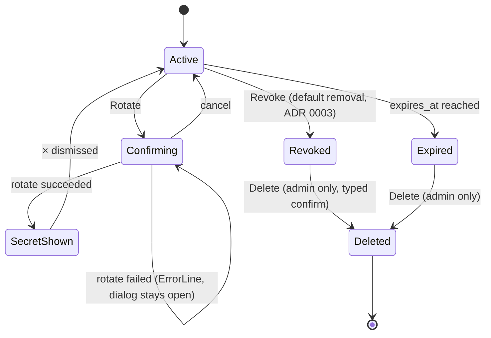
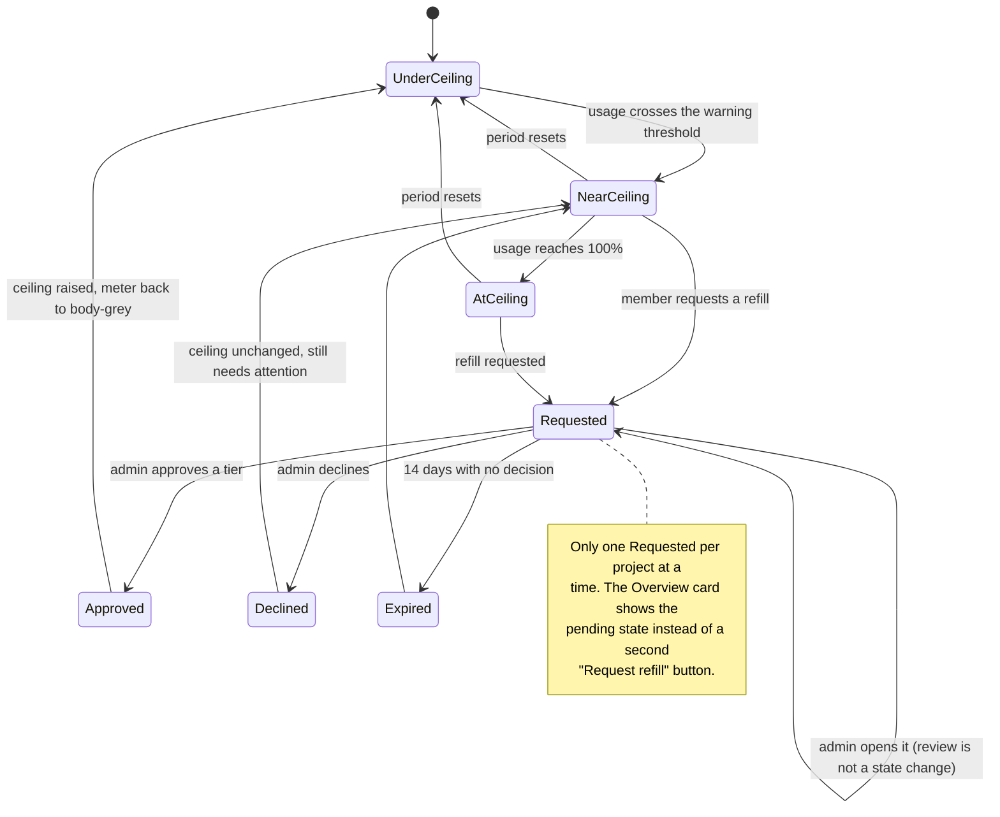
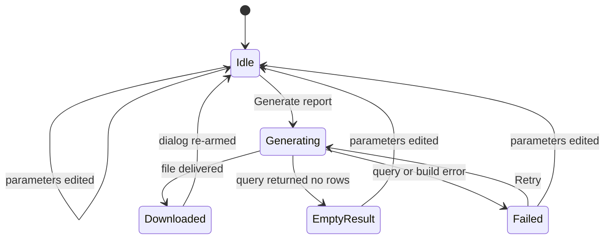

# Lightbridge console redesign — Next.js design spec

Design spec for the Lightbridge self-service console: a Next.js web app using refine.dev for CRUD
scaffolding and DOM `<svg>` ports of the `chart-core` d3 primitives for the dashboards
([ADR 0009](../../adr/0009-nextjs-console-replacement.md) Decision 5).

**This document does not re-decide the visual direction.** The palette, the daisyUI/Base UI
primitive stack, the two-theme model and the chart-colour rule are locked by
[ADR 0008](../../adr/0008-console-shell-inversion-and-visual-direction.md) and
[ADR 0010](../../adr/0010-ui-primitive-stack-and-theming.md). The **shell shape, type hierarchy
and zone-container rule** below were revised wholesale by the 2026-08-30 owner directive and are
recorded as decisions in [ADR 0012](../../adr/0012-console-visual-revamp.md) — this document is
the *application* of ADR 0012 to each screen, the way it always was for ADR 0008 before it.

**Ground truth is the page stories, not a mockup.** This directory used to ship five hand-authored
SVG mockups (`overview.svg`, `api-keys.svg`, `manage-projects.svg`, `admin-budget-review.svg`,
`shell-compact.svg`). They drew the pre-revamp three-rail shell and are now wrong in every
dimension that matters — column count, radius, type family, card usage. A wrong mockup is worse
than none, so they are **deleted** rather than redrawn. The equivalent, always-current reference is
`packages/ui-web/src/pages-stories/`: `overview.stories.tsx`, `api-keys.stories.tsx`,
`projects.stories.tsx`, `admin-budget-review.stories.tsx`, `settings.stories.tsx`, and
`shell-persistence.stories.tsx` for the responsive tiers. Run Storybook (or read the story files
directly) to see a screen instead of reading a static image of one.

---

## 1. Research summary

Refero research run 2026-08-24 (original shell) and 2026-08-30 (revamp reference lock — see
[ADR 0012](../../adr/0012-console-visual-revamp.md) "Reference lock" for the four screens that
grounded the two-column/cards/sans-first direction: Anthropic Console usage & API keys, fal.ai
usage-billing, Cartesia usage, Attio settings). Counts below are honest: previews scanned vs.
references retrieved in full, for the original 2026-08-24 pass.

- **Styles**: 1 query (`dark technical observability console near-black surfaces monospace numerics
  single accent`), 10 previews scanned, **1 retrieved in full** (Axiom — the locked palette
  reference; retrieved to get its exact token table rather than paraphrasing ADR 0008).
- **Screens**: 6 queries (AI/dev-tool usage dashboards; dark stat-card rows with sparklines; CSV/PDF
  report export; dark admin table with row-detail side panel; admin approval queues; SSO login),
  ~60 previews scanned, **6 retrieved in full**.
- **Flows**: 1 query (API key rotation / secret regeneration), 10 previews scanned; plus the two
  flows already locked by ADR 0001/0008.

### 1.1 Palette — unchanged by the revamp

The 2026-08-24 style search locked Axiom as the palette reference (near-black tonal stack,
monospace-leaning technical type, single non-decorative accent) and it still is — ADR 0012 revises
the *shell* and the *type hierarchy* it sits in, not the colour tokens. See §2.1 for the current
token sheet and ADR 0008 §5 for the full rejected-styles table this decision came from (Better
Stack, Inngest, Neon, Checkly, Linear changelog, Trunk/Dovetail — unchanged, not reproduced here).

### 1.2 Product patterns — screens (2026-08-24 pass)

| Reference | Refero link | What was taken |
| --- | --- | --- |
| **Cursor** — usage & billing (dark) | [screen](https://refero.design/pages/7573ea52-2410-4886-930a-bc76b11943ae) | Card grid → full-width chart → full-width usage table reading order; right-aligned numeric columns; date-range + quick-range controls sitting *with* the chart |
| **fal.ai** — usage-billing (dark) | [screen](https://refero.design/pages/44595c95-0b46-4ca4-8378-3f54826b28a8) | KPI tile row above the fold with *money-first* labels; `Export CSV` as an outlined control near the section it exports — re-confirmed 2026-08-30 as part of the revamp's own reference lock (ADR 0012), where it grounds the card-per-zone shell directly, not only the export control |
| **OpenAI** — platform usage | [screen](https://refero.design/pages/a81bb53c-e070-48c3-82d5-34b2eb1e561e) | `$0.60 of $120.00` + **Increase limit** placed immediately beside the number (ADR 0008 D7) |
| **Gladia** — settings/usage (dark) | [screen](https://refero.design/pages/27a8c8d9-c095-4a87-8f8e-c18ecc28176d) | Three-control filter row: **API key · date · granularity** — the shape `OverviewControls`/`ApiKeysControls` inline toolbars follow, now in `PageHeader.controls` rather than a side panel |
| **Mercury** — transactions (dark) | [screen](https://refero.design/pages/ad0fd5c1-c21c-476f-9f8c-72f4e4ec758a) | Row-select drives a detail surface; summary metrics inline above the table; dense rows for a review queue vs a browse list |
| **Coinbase** — download report | [screen](https://refero.design/pages/339214d7-5cea-4e01-9a5e-4ae46421c788) · [statements](https://refero.design/pages/4c255140-dde9-4931-9614-97cbe65fd127) | Report export as **scope + period + format + generate**; now a `Dialog` (ADR 0012 D7) rather than a rail form |
| **Fingerprint** — team members | [screen](https://refero.design/pages/936c3653-4aaf-4219-b990-502d0f01644d) | `Members / Pending` text-tab split with a count in the label |
| **Webflow** — SSO login | [screen](https://refero.design/pages/e57d91d8-aebf-4594-ac5b-f89a360fb5bc) | Single centred column, logo top-left, one heading, one control, one primary button |
| **Cohere** — spending limit | [screen](https://refero.design/pages/0316cb1c-3c50-4af2-8ca1-fd84b004d901) | Number, ceiling and control on one panel (ADR 0008 D7) |

### 1.3 Journey logic — flows

| Flow | Refero link | What was taken |
| --- | --- | --- |
| Gladia — API key deletion | [flow 10901](https://refero.design/flows/10901) | Typed-phrase confirmation before an irreversible key action (ADR 0001; carried forward for `delete`) |
| Gladia — API key creation | [flow 10900](https://refero.design/flows/10900) | Optional name → create → list updates in place with the new row already present |
| Cohere — create trial API key | [flow 3885](https://refero.design/flows/3885) | One-time secret display with copy affordance, then return to the list with scope preserved |
| Cohere — production key onboarding | [flow 3882](https://refero.design/flows/3882) | Name-validation error state *inside* the create step |
| Exa — service key creation | [flow 12030](https://refero.design/flows/12030) | Post-create success rendered **in the list**, never a toast that disappears |
| Cohere — set monthly spending limit | [flow 3896](https://refero.design/flows/3896) | Where a limit change is entered from |
| TravelPerk — approval processes | [flow 5255](https://refero.design/flows/5255) | Approval queues keep an `active / archived` split |

---

## 2. Token sheet

### 2.1 Surfaces

Unchanged by the revamp — values are ADR 0008 Decision 5, cross-checked against the Axiom style
reference, and are the single source of truth in `packages/ui-web/src/theme.css`.

| Token | Value (dark `black`) | Value (light `wireframe`) | Role — **do not repurpose** |
| --- | --- | --- | --- |
| `muted` / `--floor` | `#000000` | `#EBEBEB` | The page background |
| `chrome` / `--chrome` | `#111111` | `#F5F5F5` | Sidebar/top-bar fill, form-control inset, row hover |
| `surface` / `--panel` | `#191919` | `#FFFFFF` | `Card`, `DetailSheet`, dialogs |
| `raised` / `--raised` | `#202020` | `#DEDEDE` | Active nav row, active segmented cell, table hairlines, skeletons |
| `border` / `--line` | `#3a3a3a` | `#CFCFCF` | Control borders, `Card`'s hairline, chart baseline |
| `subtle` / `--muted` | `#606060` | `#8A8A8A` | Labels, placeholders, disabled — never load-bearing (~2.9:1 by design) |
| `soft` / `--body` | `#b4b4b4` | `#4D4D4D` | Body text, meter fills, rank-1 chart series |
| `ink` / `--strong` | `#eeeeee` | `#1A1A1A` | Headings, key numerals |
| `primary` / `--signal` | `#DA5C2C` | `#B4441C` | CTA · active · breach. Never decoration, never a large fill |

Row-hover fill is `chrome` — one step up from the floor, which is how a hairline table gets a
hover state without borders.

### 2.2 Type — sans-first, mono is data only

**Superseded by [ADR 0012](../../adr/0012-console-visual-revamp.md) D2.** The console's structural
type is `Inter` (`font-sans`); `IBM Plex Mono` (`font-mono`) is reserved for data values —
currency, counts, ids, key prefixes, timestamps, `kbd` — and always carries `data-numeral` for
tabular figures. One definition per role, `packages/ui-web/src/lib/type-roles.ts`:

| Role | Class | Size / weight | Family | Used for |
| --- | --- | --- | --- | --- |
| Page title | `PAGE_TITLE_CLASS` | 24px / semibold, 1.2 | sans | `PageHeader`'s `title` — one per screen |
| Page subtitle | `PAGE_SUBTITLE_CLASS` | 13px, 1.5 | sans | `PageHeader`'s scope/context line |
| Section title | `SECTION_TITLE_CLASS` | 15px / medium | sans | `Card`'s own title, a dashboard zone heading |
| Label | `LABEL_CLASS` | 12px | sans | Field labels, table column headers, section labels |
| Body | `BODY_CLASS` | 13px, 1.5 | sans | Sentence-copy prose — hints, explanations |
| Meta | `META_CLASS` | 12px, 1.45 | sans | Captions, non-load-bearing metadata |
| Error text | `ERROR_TEXT_CLASS` | 13px | sans | `ErrorLine`'s own text |
| Data | `DATA_CLASS` / `DATA_INK_CLASS` | 13px | mono, `data-numeral` | Table cells: counts, ids, dates, currency |
| Metric | `METRIC_CLASS` | 28px, 1.15 | mono, `data-numeral` | Stat-card values, table footers |
| Hero metric | `HERO_METRIC_CLASS` | 34px, 1.1 | mono, `data-numeral` | The one number a screen is about (budget hero) |
| Hero ceiling | `HERO_CEILING_CLASS` | 13px | sans | The reference value beside a hero metric ("of $2,000.00") |

Sentence case everywhere — no all-caps labels. Numeric columns are right-aligned; the mono family
makes the digits line up as a ledger.

### 2.3 Shape, elevation, spacing

- **Radius** — `--radius-box: 0.5rem` (8px) for panels/cards; `--radius-selector` /
  `--radius-field: 0.25rem` (4px) for controls. **Superseded by ADR 0012 D4** (was `2px`
  everywhere under ADR 0008). `9999px` is still never used anywhere in the console.
- **Elevation** — none. Separation is tonal (`#000` → `#111` → `#191919` → `#202020`). No
  `box-shadow` anywhere. `--depth: 0` / `--noise: 0` in both theme blocks.
- **Borders** — `Card` gets a 1px `border` hairline (its one departure from ADR 0008's
  "panels have no border," superseded by ADR 0012 D3). Form controls, table hairlines and the
  chart baseline keep their own strokes as before.
- **Spacing scale** — `4 · 8 · 12 · 16 · 20 · 24 · 32 · 40`. `Card` insets 1.25rem (20px).

### 2.4 Chart colours (ADR 0008 Decision 6, unchanged by the revamp)

Monochrome ramp, drawn from the grey palette, **ordered by series rank not by hue**:

```
rank 1  #b4b4b4     rank 2  #7c7c7c     rank 3  #565656     rank 4+ #3a3a3a
selected / breached  #DA5C2C
```

- Orange appears **at most once per chart**, only for the selected series or one that has breached
  a ceiling / SLO.
- Gridlines `raised`, baseline `border`, tick labels `label` role.
- Ridgelines fill with `surface` and stroke with the ramp — shape carries the reading.
- Meters are a 4px `raised` track with a `body` fill; the fill turns `signal` only past the warning
  threshold.

### 2.4a Part-to-whole: `ShareBar`, not a donut

Unchanged by the revamp. `ShareBar` — a 100%-stacked bar over a ranked list of
`swatch · label · value · share` — replaced `DonutChart` on 2026-08-29: a monochrome ramp reads
badly as adjacent arcs, angle is a weaker channel than length, and a real 99/1/0.4 split produced
sub-pixel donut slivers. `ShareBar` holds a `MIN_VISIBLE_PERCENT` floor and spells sub-1% shares as
`<1%` rather than rounding to a misleading `0%`. See ADR 0012's reference lock — Cartesia's own
usage dashboard pairs a chart card with plain ranked-list cards, the same "shape carries magnitude,
list carries the exact number" split `ShareBar` already implements.

---

## 3. Shell and grid

[ADR 0012](../../adr/0012-console-visual-revamp.md) D1, as built in
`packages/ui-web/src/lib/shell-grid.ts`.

```
┌──────────────────────────────────────────────────────────────────────────────────────┐
│ SIDEBAR (md+, 240px, chrome)   │  CONTENT COLUMN — fluid, max-w-1120, floor            │
│ ─ brand row                    │  PageHeader (title · subtitle · controls · action)    │
│ ─ workspace switcher           │  Card  Card  Card  …  (every self-contained zone)     │
│ ─ nav (Workspace/Account/      │  DetailSheet opens over the column on row selection   │
│   Operator groups)             │  (Base UI Dialog, fixed right panel, 420px)           │
│ ─ spacer                       │                                                        │
│ ─ footer (⌘K · theme ·         │                                                        │
│   offline · identity)          │                                                        │
└──────────────────────────────────────────────────────────────────────────────────────┘
```

Below `md` (600px), the sidebar is replaced by a 48px `ConsoleTopBar` (brand, compact workspace
switcher, `⌘K` trigger, identity) plus the existing bottom navigation dock — `ConsoleSidebar`
renders both the persistent `sidebar` layout and the `bottom-bar` dock from one `groups` prop, so
a page never mounts navigation twice.

- **The sidebar is sticky and independently scrollable** (`SIDEBAR_CLASS`): full viewport height,
  its own `overflow-y-auto`, a trailing hairline (`border-raised`) instead of a gap.
- **The content column is the only stretching zone** (`SHELL_CENTRE_CLASS`'s `min-w-0 flex-1`) —
  `min-w-0` is mandatory so a wide table or chart cannot blow the row open into horizontal page
  scroll.
- **Nav groups, exactly three, role-gated by inclusion, not by a marker prop**
  (`apps/console/src/client/console-chrome.tsx`'s `navGroups`):
  - `Workspace` — Overview, Projects, API keys.
  - `Account` — Settings.
  - `Operator` — Refill requests (`/admin`), included in the array only when `session.isAdmin` is
    true. There is no `adminItems`/`showAdmin`/`roleLabel` axis any more — a gated group is simply
    present or absent, and its own label row is the role marker (supersedes ADR 0008's
    `NavSpine`/"Admin" role-marker + `raised`-rule contract).
- **There is no right rail at any tier, on any screen.** Every parameter a screen needs sits in
  that screen's `PageHeader.controls` (inline `h-8` cluster); a row's own detail opens
  `DetailSheet`; a form that used to be "the rail panel" (report export) is a `Dialog`. See
  ADR 0012 D1/D7 and the "old right rail → new home" diagram there.
- **`Card` is the default zone container** (ADR 0012 D3): stat rows, charts, ledgers (toolbar +
  table + pager inside one `Card`), and settings sections all wrap in `Card`. The page header and a
  bare `InlineStatus`/`ErrorLine` are the only elements that sit directly on the floor.

### Nav destinations

| Nav item | Group | Route |
| --- | --- | --- |
| Overview | Workspace | `/` |
| Projects | Workspace | `/projects` |
| API keys | Workspace | `/api-keys` |
| Settings | Account | `/settings` (redirects into `/settings/account`) |
| Refill requests | Operator (admin only) | `/admin` |

---

## 4. Component inventory

Every primitive the console build uses, one-line contract. `PascalCase` name, `kebab-case`
directory. Superseded/deleted rows from the pre-revamp shell (`ConsoleHeader`, `RailPanel`,
`ScreenHeading`, `SectionSheet`/`SelectionSheet`/`SectionSheetTrigger`) are gone from this table
entirely — see [ADR 0012](../../adr/0012-console-visual-revamp.md) "Consequences" for the deletion
list.

**Shell**

| Component | Contract |
| --- | --- |
| `ConsoleShell` | Owns the two-column grid (`sidebar` / `topBar` / `banner` / `children` slots) and nothing of its own — `lib/shell-grid.ts` carries every geometry decision |
| `ConsoleSidebar` | The persistent left column: brand, workspace switcher, `NavSpine` (sidebar layout), footer stack. Also renders the mobile bottom-nav dock from the same `groups` prop |
| `ConsoleTopBar` | The `<md` replacement for the sidebar: brand, compact workspace switcher, `⌘K` trigger, identity — a 48px sticky band |
| `NavSpine` | The nav groups, rendered as either a vertical `sidebar` list or a `bottom-bar` dock from one `groups` prop; active item = `aria-current="page"` via Base UI `navigation-menu` |
| `SubNav` | A second nav level: vertical (with counts, unused post-revamp since Settings moved to real routes) or horizontal text-tab row (`/settings`'s Account/Projects switch, Attio pattern) |
| `CommandPaletteTrigger` / `CommandPalette` | `⌘K`/`Ctrl-K` palette — cmdk. Page jumps, scope switch |

**Data display**

| Component | Contract |
| --- | --- |
| `Card` | The console's one generic panel: `surface` fill, `border` hairline at `--radius-box`, 1.25rem inset, optional `.card-head` title/actions row. Wraps every self-contained zone (ADR 0012 D3) |
| `StatCard` | Self-panelled (keeps its own `surface` fill even inside a `Card`-wrapped row): glyph, `label`, `metric` numeral, delta line, right-hand `Sparkline`. Never tinted, never coloured by value |
| `Sparkline` | 81×26 unlabelled polyline in `border` with a `body` terminal dot — no axis, no tooltip |
| `LedgerTable` | Midday-derived treatment: hairline `raised` rules, no striping, right-aligned numerics, `role=grid` when selectable, always-visible row actions |
| `Pagination` | Caption + Previous/Next. Renders **nothing** when the caller wires neither direction — no pager with dead disabled buttons |
| `StatusText` | Status as text, never a pill: `body` active, `muted` revoked/archived, `signal` expiring/near-ceiling |
| `RowActionGroup` | Always-visible lifecycle actions, separated by diagonal hairlines, ordered `Rotate ╱ Revoke ╱ Del` with revoke emphasised |
| `Meter` | 4px track + fill; `body` under threshold, `signal` at/past it; paired with `"$X of $Y"` in mono |
| `BudgetHero` | Hero metric + `of $ceiling` + `Meter` + caption + inline action |

**Charts** (DOM ports of `chart-core` d3 primitives — monochrome ramp, ADR 0008 D6)

| Component | Contract |
| --- | --- |
| `SpendSeriesChart` | Multi-series line/area over time; exactly one series may be `signal` |
| `LatencyRidgeline` | Stacked density ridges by model; a ridge over SLO strokes `signal` |
| `ShareBar` | 100%-stacked part-to-whole bar over a ranked list; at most one segment `signal` |
| `ChartLegend` | Swatch + name + value; the selected entry is `ink` + `signal` swatch |
| `ChartTooltip` | Floating-UI-positioned, anchored to a virtual point over the `<svg>` |

**Forms, actions, states**

| Component | Contract |
| --- | --- |
| `PageHeader` | Every screen's opening block: `title`, optional `subtitle` (scope/context line), `controls` (inline screen parameters), `action` (the one emphasised control) |
| `EmptyState` | First-run empty (ADR 0012 D6): headline, explainer, CTA, centred inside a `Card` |
| `InlineStatus` | Filtered-to-nothing or unavailable (ADR 0012 D6): one mono/sans line above still-rendered structure — headers and axes stay |
| `ErrorLine` | `signal`-coloured line in place of a value, with an inline `Retry` ghost on the same line |
| `SkeletonRow` / `SkeletonMetric` | `raised` blocks matched to final geometry — no shimmer, no spinner |
| `DetailSheet` | Base UI `Dialog`, 420px fixed right panel: header (title/subtitle/close) · body · optional footer. The one surface for row detail (project detail, refill review) — replaces the persistent-right-rail retarget mechanic |
| `Button` | `primary` = `signal` fill; `secondary` = `border` outline; `ghost` = text only |
| `Field` / `SelectField` / `DateRangeField` | Base UI `Field`/`Select` wearing daisy classes |
| `SegmentedControl` | Base UI Toggle Group + daisy `tabs` |
| `ScopeSelect` | Account → project cascade (used where a screen still needs a project *parameter*, distinct from the sidebar's account *identity* switcher) |
| `SecretReveal` | One-time secret strip: heading, read-only mono field, `Copy` primary, dismissed only by explicit `×` |
| `TypedConfirmDialog` | Destructive gate: names the object, requires the object name typed exactly |
| `ReportExportDialog` / `ReportExportPanel` | Period · scope · group-by · includes · `CSV|PDF` segmented · one `Generate report` primary. **`Dialog`, not a rail form** (ADR 0012 D7) — reachable from Overview and Projects |
| `ReviewDetailPanel` | The content `DetailSheet` hosts for a selected refill request: subject, consumption, requested tier, requester note, history, decision note, `Approve`/`Decline` |

---

## 5. Screen specs

Composition below matches the actual container components
(`apps/console/src/containers/*-centre.tsx`) — treat this section as a reading-order summary, and
the page stories (`packages/ui-web/src/pages-stories/`) as the pixel-level ground truth.

### 5.1 Overview — `/` (`overview.stories.tsx`)

One dashboard, parameterised by role (ADR 0012 D5) — there is no separate admin dashboard.

Top to bottom: `PageHeader` (title "Overview", scope subline, `OverviewControls` — range · bucket ·
group-by · project — inline, and an `Export` action opening `ReportExportDialog`) → the money-first
stat row (`OverviewStatRow`, self-panelled `StatCard`s) → `Card` "Spend over time" → `Card` "Spend
by project" (`ShareBar`) → `Card` "Budget" (`BudgetHero` + inline `Request refill`). These four are
real for every signed-in user.

**Admin-only, purely additive**, gated on `session.isAdmin` with every query itself `enabled:
isAdmin` (never a permanently-loading block a non-admin can't resolve): `Card` "Budget pressure"
(fleet-wide ceiling view) → `Card` "Latency" (ridgeline) → `Card` "Key hygiene" (`InlineStatus` +
`ApiKeysHygieneNotes`) → `Card` "Refill requests" (pending count + a link into `/admin`).

- Deltas are `▲ 18% vs prev 30d` in `body`, `— no change` in `muted`. **Never green or red.**
- The budget block is the ADR 0008 D7 unit: numeral, `of $ceiling`, a meter, `Request refill`
  beside the number — never on a different screen.
- `/admin`'s own former dashboard section (`/admin?section=overview`) is deleted; `/admin` is now
  exactly the review queue (§5.4).

### 5.2 API keys — `/api-keys` (`api-keys.stories.tsx`)

- `PageHeader.controls` carries `ApiKeysControls` (project filter · status segmented · search),
  inline — no rail. `PageHeader.action` is `+ New key`, appearing exactly once; the same button is
  reused verbatim as the `EmptyState` CTA when a project has no keys at all.
- **Scope is split by what it actually is**: account is identity, rendered once as `AccountBadge`
  in the sidebar's workspace switcher (a name, or `acct_49534505` when unnamed, never a raw UUID);
  project is a genuine parameter and leads the toolbar.
- `SecretReveal` occupies the top of the centre after create *or* rotate — both return the same
  one-time secret, so they share one component and contract.
- The ledger's toolbar + table + pager sit inside **one `Card`**. Columns: `NAME · PREFIX · STATUS
  · CREATED · LAST USED · EXPIRES`, `RowActionGroup` always visible in the trailing column.
- **Revoke is the emphasised action** (ADR 0003): `ink` text, while `Rotate` is `body` and `Del` is
  `muted`.
- `ApiKeysHygieneNotes` is an inline-status block above the table: expiring keys in `signal`,
  never-used in `body`, retained-revoked in `muted`.

### 5.3 Projects — `/projects` (`projects.stories.tsx`, renamed from `/manage`)

- Purely a filtering/browsing surface. Account-core mutations (the old `AccountPanel`,
  `AccountNameDialog`) moved to `/settings` — "we cannot modify account core information on the
  same page we're filtering" (owner, 2026-08-29).
- `PageHeader.action` is `+ New project`. `PageHeader.controls` carries `ManageControls` (status ·
  budget-state segmented/select).
- The table's toolbar (search left, filter cluster right) + table + pager + totals footer sit
  inside **one `Card`** (`ProjectsLedger`). Columns: `NAME · SPEND MTD · QUOTA TIER · STATUS` —
  the owning account is no longer a ledger column (redundant with the account scope every row is
  already filtered to) but still carries on the row for `DetailSheet`'s subtitle.
- **Selection has no trigger of its own** — picking a row opens `DetailSheet` directly at every
  tier: subject, then `ProjectDetail`'s facts not already shown in the sheet's own header.
- Report export (`ReportExportDialog`) is reachable from this screen too, same `Dialog` contract
  as Overview.

### 5.4 Admin — `/admin` (`admin-budget-review.stories.tsx`)

`/admin` is exactly the budget-refill review queue — nothing else. Reached from the sidebar's
"Refill requests" item (Operator group, admin-only) or the Overview "Refill requests" card's link.

- `PageHeader` states the pending count and, when there is one, the oldest submission's age —
  replaces the old `Pending (n) / Decided (n)` tab pair, which was never backed by a real
  "decided" listing (`listPendingAugmentationRequests` is pending-only).
- The queue (`ReviewQueue`) sits inside **one `Card`**: sortable `Submitted` column, `Project`,
  `Account` (both resolved display names, never UUIDs), `Requested amount`.
- Selecting a row opens `DetailSheet` hosting `ReviewDetailPanel` — it owns its whole decision
  surface (consumption, requested tier, requester note, history, decision note, `Approve
  +$X`/`Decline`), so it needs no companion rail section, at any tier.
- Approve **names the amount** — `Approve` alone would be ambiguous once the reviewer changes the
  tier.

### 5.5 Settings — `/settings/account`, `/settings/projects`

- `/settings` itself has no centre of its own — it redirects into `/settings/account`.
- Both routes share `SettingsSubNav`: a horizontal text-tab row (Attio pattern) — real
  `next/link` navigation between the two routes, active state from the pathname, not a URL param.
- Account settings and project settings each render their own `PageHeader` + `Card`-wrapped
  sections underneath the sub-nav.

### 5.6 Auth

Not drawn — there is nothing to draw, and that is the point. Renders **outside the shell**
entirely: no sidebar, no nav group, `#000`/floor full-bleed.

- Centred single column, max 360px: wordmark → `Sign in to Lightbridge` (page title) → one line of
  sans prose explaining sign-in happens at the identity provider → one primary button → nothing
  else.
- **Signed-out state**: an `InlineStatus` line above the button — `Your session ended · signed out
  2 minutes ago` in `muted`. Not a modal, not a toast.
- **Redirect-in-flight**: the button becomes `muted` with the label `Redirecting…`; no spinner.
- **Callback error — fixed 2026-08-30 (phase 7 polish).** The pre-revamp spec described a
  standing `ErrorLine` with its own `Try again` ghost button, stacked *under* an always-rendered
  "Continue to sign in" primary — two controls that both restarted the identical redirect. There
  is now exactly **one** control at a time: the error message renders above it (the reader sees
  *why* before deciding what to do), and the single primary button **relabels itself** to `Try
  again` and calls `onRetry` (falling back to `onSignIn`) once `status === 'error'`. `ErrorLine`
  no longer owns retry on this screen.

---

## 6. Interaction contracts

### Empty, filtered and unavailable states — the D6 split

[ADR 0012](../../adr/0012-console-visual-revamp.md) D6 replaces the pre-revamp "every empty case
is an inline status line" rule (which assumed every screen had a rail to keep it company) with two
components for two distinct situations:

| Situation | Treatment |
| --- | --- |
| First-run: no API keys yet in this project | `EmptyState` inside the `Card`: headline, explainer, CTA (same button as the screen's `+ New key`/`+ New project`) |
| First-run: no projects in this account | Same |
| Filtered to nothing (status/search filter excludes every row) | `InlineStatus` + a `Reset filters` ghost button, table header retained so the columns still teach the shape of the data |
| No pending refills | `InlineStatus`: `Nothing awaiting a decision.` |
| Chart has no data in range | Axes render; a `muted` DOM-text line (never SVG `<text>`, which does not wrap) sits on the baseline: `No usage in this range.` |
| Query unresolved / still loading | `SkeletonRow`/`SkeletonMetric` — never `EmptyState`, which gates strictly on a *settled* query returning zero rows |

### Loading

- Skeletons only, matched to final geometry. No spinners, no shimmer.
- The shell renders immediately with real nav; the sidebar/top-bar never flash.

### Errors

- Field-level: `ErrorLine` under the control, border → `signal`.
- Section-level: the `Card`'s content is replaced by one `ErrorLine` + `Retry`; the rest of the
  screen keeps working — a failed latency query must not take the spend chart's `Card` down with
  it.
- Destructive-action failure: `TypedConfirmDialog` stays open with the error inline. It never
  closes on failure.

### Motion

120–160ms `ease-out` on hover fills and `DetailSheet`/`Dialog` open/close. Nothing animates on
load. No parallax, no reveal-on-scroll.

### Accessibility

- `body` on `floor` is **10.1:1**; `muted` on `surface` is **2.8:1** — below AA, so `muted` is used
  only for non-essential metadata, never for a value a user must read to act.
- `signal` on `floor` is **5.5:1**, clearing AA for normal text.
- Status is never colour-only: words first.
- Focus ring: 1px `signal` outline with a 1px offset matching the zone it sits in. Row-hover
  actions in `LedgerTable` are always visible (not hover-only), so they are never
  keyboard-invisible in the first place.

---

## 7. Responsive behaviour

| Tier | Navigation | Content column |
| --- | --- | --- |
| **≥`md` (600px+)** | Persistent 240px sidebar, sticky, independently scrollable | Fluid, `max-w-[1120px]`, `PageHeader` + `Card`s stacked vertically |
| **<`md`** | 48px `ConsoleTopBar` + bottom navigation dock (same `NavSpine` `groups`, `bottom-bar` layout) | Single column, 16px gutters; `PageHeader.controls` wraps; ledgers/charts scroll horizontally inside their own `overflow-x-auto` container — the page itself never scrolls sideways |

There is no third, "compact rail" tier — the old three-tier (full/compact/guard-rail) breakpoint
table described a right rail that no longer exists. `DetailSheet` is the same fixed-right-panel
`Dialog` at every viewport size down to its own responsive cap (`max-width: 100vw`), not a
tier-specific bottom sheet.

`shell-persistence.stories.tsx` demonstrates that navigating between routes does not remount the
sidebar/top-bar (the nav DOM node persists across route changes) — this is the shell's own
acceptance test, not something a screen spec should re-litigate per screen.

---

## 8. Process diagrams

### 8.1 API key rotation

Unaffected by the shell revamp — `TypedConfirmDialog` and `SecretReveal` were never rail content.

```mermaid
sequenceDiagram
    autonumber
    actor U as Project lead
    participant L as Api-Keys ledger (Card)
    participant D as TypedConfirmDialog
    participant S as SecretReveal (centre)
    participant API as POST /api/v1/api-keys/{id}/rotate

    U->>L: RowActionGroup — activate "Rotate"
    L->>D: open, naming the key and its prefix
    D-->>U: "the old secret stops working immediately"
    U->>D: type the key name exactly
    D->>D: enable primary only on exact match
    U->>D: confirm
    D->>API: rotate(keyId)
    alt rotated
        API-->>S: { secret, key_prefix, rotated_at }
        S-->>U: secret shown once, Copy primary, explicit × to dismiss
        L->>L: row updates in place — new prefix, last used reset
    else failed
        API-->>D: error
        D-->>U: dialog stays open with ErrorLine; nothing changed
    end
```



### 8.2 Budget refill: request → review → decision

**Updated for the two-column shell** — the pre-revamp diagram retargeted a persistent right rail;
the review surface is now `DetailSheet`, opened on demand rather than always present.

```mermaid
sequenceDiagram
    autonumber
    actor M as Project member
    participant O as Overview · Budget card
    participant R as Refill request form
    actor A as lightbridge-admin
    participant Q as /admin · review queue (Card)
    participant DS as DetailSheet -> ReviewDetailPanel

    O-->>M: "$455.20 of $500.00" · meter turns signal-orange at 91%
    M->>O: "Request refill" (inline, beside the number)
    O->>R: open with tiers read from the active policy
    M->>R: pick tier, add a note
    R-->>O: request submitted; card shows "1 pending · submitted just now"
    Note over O,Q: same record, two surfaces
    A->>Q: open /admin (session.isAdmin gates the route)
    A->>Q: select row
    Q->>DS: open(requestId)
    DS-->>A: consumption, burn trend, tier, note, refill history
    alt approve
        A->>DS: Approve +$250.00
        DS-->>Q: row leaves Pending, enters Decided; sheet closes
        DS-->>O: ceiling becomes $750.00; meter returns to body-grey
    else decline
        A->>DS: Decline (+ optional decision note)
        DS-->>Q: row leaves Pending, enters Decided; sheet closes
        DS-->>O: ceiling unchanged; card shows the decision and its note
    else request fails
        A->>DS: decision submitted
        DS-->>A: sheet stays open, error inline; nothing changed
    end
```



### 8.3 Monthly consumption report export

**Updated for the two-column shell** — export is a `Dialog`, not a rail form; reachable from
Overview and Projects alike.

```mermaid
sequenceDiagram
    autonumber
    actor U as Account member
    participant E as ReportExportDialog
    participant API as POST /usage/v1/usage/query
    participant F as Report builder
    participant B as Browser

    U->>E: PageHeader action "Export" opens the dialog
    U->>E: period · scope · group-by · includes · CSV|PDF
    U->>E: Generate report
    E->>E: primary -> "Generating...", disabled
    E->>API: query(period, filters, group_by)
    API-->>F: usage rows
    F-->>E: signed download URL
    alt ready
        E->>B: trigger download
        E-->>U: dialog records "2026-02 · CSV · just now"
    else empty result
        E-->>U: InlineStatus "No usage in February 2026 for this scope." -- no file produced
    else failed
        E-->>U: ErrorLine + Retry; the form keeps every input
    end
```



---

## 9. Decision ledger

| Decision | Source | Why |
| --- | --- | --- |
| Near-black tonal stack `#000 → #111 → #191919 → #202020` | Axiom style, via ADR 0008 D5 | Unchanged by the revamp — see §1.1 |
| `#DA5C2C` for CTA, active state and "needs you" only | Axiom; ADR 0008 D5–D6 | The one rule that makes the console legible at a glance |
| Sans-first type, mono for data only | **2026-08-30**, ADR 0012 D2 | Matches the reference lock (Anthropic Console, fal.ai, Cartesia, Attio all set structural chrome in a sans face) |
| Radius 8px (panels) / 4px (controls) | **2026-08-30**, ADR 0012 D4 | Superseded the flush 2px rule once panels became cards with real insets |
| Two-column shell, no right rail | **2026-08-30**, ADR 0012 D1 | Owner review: a permanent 280px column for five controls cost too much of the viewport on two of four screens, and the inconsistency (rail on two screens, none on two) was itself the defect |
| Cards are the default zone container | **2026-08-30**, ADR 0012 D3 | Reference lock unanimous: every named product cards its dashboard content on a floor |
| One dashboard, role-parameterised; `/admin` = review queue | **2026-08-30**, ADR 0012 D5 | A standalone admin dashboard route duplicated Overview's own zones for no reason once the shell stopped needing a rail-scoped "admin view" |
| `EmptyState` for first-run, `InlineStatus` for filtered/unavailable | **2026-08-30**, ADR 0012 D6 | With the rail gone, a genuinely empty first-run screen has nothing else on it — the centred placard earns its place back, narrowly |
| Detail = `DetailSheet`; rail concept retired | **2026-08-30**, ADR 0012 D7 | A 420px on-demand sheet reserves no column when nothing is selected, unlike even a single retargeting rail |
| Report export = `Dialog`, not a rail panel | **2026-08-30**, ADR 0012 D7 | Same move as `DetailSheet`, applied to a form |
| Monochrome chart ramp, one orange series max | ADR 0008 D6 | Unchanged — accent is signal, not category |
| Budget number, ceiling and refill CTA on one line | OpenAI + Cohere (ADR 0008 D7) | Unchanged |
| Hairline ledger tables, always-visible row actions | Midday via ADR 0008 D5 | Row actions moved from hover-only to always-visible during the revamp — hover-only is keyboard-invisible |
| Status as text, not pills | shadcn/Fingerprint restraint (ADR 0001) | Unchanged |
| Revoke emphasised over Delete; typed confirmation | ADR 0003 + Gladia flow 10901 | Unchanged |
| One-time secret shown in the centre, dismissed explicitly | Cohere/Exa flows | Unchanged |
| Empty/filtered states never hide a chart's axes or a table's header | Owner constraint + house rule | A disappearing frame reads as broken |
| Skeletons matched to geometry; no spinners | Cursor/Gladia loading treatments | Unchanged |
| Auth error state: one control, relabelled, not two stacked | **2026-08-30**, phase 7 polish | Two controls both restarting the identical redirect was itself the defect |

---

## 10. Tensions

*Historical tensions recorded in the pre-revamp version of this document have been resolved by
[ADR 0012](../../adr/0012-console-visual-revamp.md) and are removed rather than kept as dead
entries*: the right-panel-as-actions-vs-parameters question (no right panel remains to have the
tension), the scalar-panel-vs-distribution-floor boundary (subsumed by "every zone gets a `Card`"),
refine's `list/show/edit` route shape vs a persistent rail (resolved by `DetailSheet`, which needs
no persistent mount), and the `maxContentWidth` token's meaning (resolved: it is
`CONTENT_MAX_WIDTH_CLASS`'s 1120px figure for the shell's content column, and the Auth page's own
360px cap independently).

Two tensions from the original ADR 0008 spec were never shell-shaped and remain open:

1. **`--muted` (`#606060`) fails AA against `surface` (2.8:1).** Kept non-load-bearing by
   convention (§2.1); a `--muted-strong` step may be needed if a future screen needs "minor
   metadata that must still be readable."
2. **ADR 0008's nav spine had no home for Auth**, and still doesn't in the strict sense — Auth
   renders outside the shell entirely by design (§5.6), which is a deliberate choice, not a gap,
   but is worth restating here since nothing in `navGroups` documents it.
