# Lightbridge console redesign — Next.js design spec

Design spec for the Lightbridge self-service console: a Next.js web app using refine.dev for CRUD
scaffolding and DOM `<svg>` ports of the `chart-core` d3 primitives for the dashboards
([ADR 0009](../../adr/0009-nextjs-console-replacement.md) Decision 5).

**This document does not re-decide the visual direction.** The palette, the daisyUI/Base UI
primitive stack, the two-theme model and the chart-colour rule are locked by
[ADR 0008](../../adr/0008-console-shell-inversion-and-visual-direction.md) and
[ADR 0010](../../adr/0010-ui-primitive-stack-and-theming.md). The **shell shape, type hierarchy
and zone-container rule** below were revised wholesale by the 2026-08-30 owner directive and are
recorded as decisions in [ADR 0012](../../adr/0012-console-visual-revamp.md) — this document is
the _application_ of ADR 0012 to each screen, the way it always was for ADR 0008 before it.

**Ground truth is the page stories, not a mockup.** This directory used to ship five hand-authored
SVG mockups (`overview.svg`, `api-keys.svg`, `manage-projects.svg`, `admin-budget-review.svg`,
`shell-compact.svg`). They drew the pre-revamp three-rail shell and are now wrong in every
dimension that matters — column count, radius, type family, card usage. A wrong mockup is worse
than none, so they are **deleted** rather than redrawn. The equivalent, always-current reference is
`packages/ui-web/src/pages-stories/`: `overview.stories.tsx`, `api-keys.stories.tsx`,
`admin-budget-review.stories.tsx` (now the refills-queue review screen, §5.5),
`settings.stories.tsx` (`/settings/policies` alone, since phase E), `settings-accounts.stories.tsx`
(the new `/settings/accounts` list and `/settings/accounts/<id>` detail, §5.5),
`settings-accounts-projects.stories.tsx` (`/settings/accounts/<id>/projects`, renamed from
`projects.stories.tsx` when phase E moved the route it fixtures, §5.3),
`settings-overview.stories.tsx` (the estate/analytics lenses, §5.5), and
`shell-persistence.stories.tsx` for the responsive tiers. Run Storybook (or read the story files
directly) to see a screen instead of reading a static image of one. There is no story file yet for
`/settings/accounts/<id>/request-refill` (§5.4) specifically — it reuses `RefillCentre` unchanged
from the pre-phase-E `/accounts/<id>/refill`, which likewise never had one.

---

## 1. Research summary

Refero research run 2026-08-24 (original shell) and 2026-08-30 (revamp reference lock — see
[ADR 0012](../../adr/0012-console-visual-revamp.md) "Reference lock" for the four screens that
grounded the two-column/cards/sans-first direction: Anthropic Console usage & API keys, fal.ai
usage-billing, Cartesia usage, Attio settings). Counts below are honest: previews scanned vs.
references retrieved in full, for the original 2026-08-24 pass.

- **Styles**: 1 query (`dark technical observability console near-black surfaces monospace numerics
single accent`), 10 previews scanned, **1 retrieved in full** (Axiom — the locked palette
  reference; retrieved to get its exact token table rather than paraphrasing ADR 0008).
- **Screens**: 6 queries (AI/dev-tool usage dashboards; dark stat-card rows with sparklines; CSV/PDF
  report export; dark admin table with row-detail side panel; admin approval queues; SSO login),
  ~60 previews scanned, **6 retrieved in full**.
- **Flows**: 1 query (API key rotation / secret regeneration), 10 previews scanned; plus the two
  flows already locked by ADR 0001/0008.

### 1.1 Palette — unchanged by the revamp

The 2026-08-24 style search locked Axiom as the palette reference (near-black tonal stack,
monospace-leaning technical type, single non-decorative accent) and it still is — ADR 0012 revises
the _shell_ and the _type hierarchy_ it sits in, not the colour tokens. See §2.1 for the current
token sheet and ADR 0008 §5 for the full rejected-styles table this decision came from (Better
Stack, Inngest, Neon, Checkly, Linear changelog, Trunk/Dovetail — unchanged, not reproduced here).

### 1.2 Product patterns — screens (2026-08-24 pass)

| Reference                           | Refero link                                                                                                                                                 | What was taken                                                                                                                                                                                                                                                                         |
| ----------------------------------- | ----------------------------------------------------------------------------------------------------------------------------------------------------------- | -------------------------------------------------------------------------------------------------------------------------------------------------------------------------------------------------------------------------------------------------------------------------------------- |
| **Cursor** — usage & billing (dark) | [screen](https://refero.design/pages/7573ea52-2410-4886-930a-bc76b11943ae)                                                                                  | Card grid → full-width chart → full-width usage table reading order; right-aligned numeric columns; date-range + quick-range controls sitting _with_ the chart                                                                                                                         |
| **fal.ai** — usage-billing (dark)   | [screen](https://refero.design/pages/44595c95-0b46-4ca4-8378-3f54826b28a8)                                                                                  | KPI tile row above the fold with _money-first_ labels; `Export CSV` as an outlined control near the section it exports — re-confirmed 2026-08-30 as part of the revamp's own reference lock (ADR 0012), where it grounds the card-per-zone shell directly, not only the export control |
| **OpenAI** — platform usage         | [screen](https://refero.design/pages/a81bb53c-e070-48c3-82d5-34b2eb1e561e)                                                                                  | `$0.60 of $120.00` + **Increase limit** placed immediately beside the number (ADR 0008 D7)                                                                                                                                                                                             |
| **Gladia** — settings/usage (dark)  | [screen](https://refero.design/pages/27a8c8d9-c095-4a87-8f8e-c18ecc28176d)                                                                                  | Three-control filter row: **API key · date · granularity** — the shape `OverviewControls`/`ApiKeysControls` inline toolbars follow, now in `PageHeader.controls` rather than a side panel                                                                                              |
| **Mercury** — transactions (dark)   | [screen](https://refero.design/pages/ad0fd5c1-c21c-476f-9f8c-72f4e4ec758a)                                                                                  | Row-select drives a detail surface; summary metrics inline above the table; dense rows for a review queue vs a browse list                                                                                                                                                             |
| **Coinbase** — download report      | [screen](https://refero.design/pages/339214d7-5cea-4e01-9a5e-4ae46421c788) · [statements](https://refero.design/pages/4c255140-dde9-4931-9614-97cbe65fd127) | Report export as **scope + period + format + generate**; now a `Dialog` (ADR 0012 D7) rather than a rail form                                                                                                                                                                          |
| **Fingerprint** — team members      | [screen](https://refero.design/pages/936c3653-4aaf-4219-b990-502d0f01644d)                                                                                  | `Members / Pending` text-tab split with a count in the label                                                                                                                                                                                                                           |
| **Webflow** — SSO login             | [screen](https://refero.design/pages/e57d91d8-aebf-4594-ac5b-f89a360fb5bc)                                                                                  | Single centred column, logo top-left, one heading, one control, one primary button                                                                                                                                                                                                     |
| **Cohere** — spending limit         | [screen](https://refero.design/pages/0316cb1c-3c50-4af2-8ca1-fd84b004d901)                                                                                  | Number, ceiling and control on one panel (ADR 0008 D7)                                                                                                                                                                                                                                 |

### 1.3 Journey logic — flows

| Flow                                | Refero link                                     | What was taken                                                                                       |
| ----------------------------------- | ----------------------------------------------- | ---------------------------------------------------------------------------------------------------- |
| Gladia — API key deletion           | [flow 10901](https://refero.design/flows/10901) | Typed-phrase confirmation before an irreversible key action (ADR 0001; carried forward for `delete`) |
| Gladia — API key creation           | [flow 10900](https://refero.design/flows/10900) | Optional name → create → list updates in place with the new row already present                      |
| Cohere — create trial API key       | [flow 3885](https://refero.design/flows/3885)   | One-time secret display with copy affordance, then return to the list with scope preserved           |
| Cohere — production key onboarding  | [flow 3882](https://refero.design/flows/3882)   | Name-validation error state _inside_ the create step                                                 |
| Exa — service key creation          | [flow 12030](https://refero.design/flows/12030) | Post-create success rendered **in the list**, never a toast that disappears                          |
| Cohere — set monthly spending limit | [flow 3896](https://refero.design/flows/3896)   | Where a limit change is entered from                                                                 |
| TravelPerk — approval processes     | [flow 5255](https://refero.design/flows/5255)   | Approval queues keep an `active / archived` split                                                    |

---

## 2. Token sheet

### 2.1 Surfaces

Unchanged by the revamp — values are ADR 0008 Decision 5, cross-checked against the Axiom style
reference, and are the single source of truth in `packages/ui-web/src/theme.css`.

| Token                  | Value (dark `black`) | Value (light `wireframe`) | Role — **do not repurpose**                                            |
| ---------------------- | -------------------- | ------------------------- | ---------------------------------------------------------------------- |
| `muted` / `--floor`    | `#000000`            | `#EBEBEB`                 | The page background                                                    |
| `chrome` / `--chrome`  | `#111111`            | `#F5F5F5`                 | Sidebar/top-bar fill, form-control inset, row hover                    |
| `surface` / `--panel`  | `#191919`            | `#FFFFFF`                 | `Card`, `BottomSheet`, the right rail, dialogs                         |
| `raised` / `--raised`  | `#202020`            | `#DEDEDE`                 | Active nav row, active segmented cell, table hairlines, skeletons      |
| `border` / `--line`    | `#3a3a3a`            | `#CFCFCF`                 | Control borders, `Card`'s hairline, chart baseline                     |
| `subtle` / `--muted`   | `#606060`            | `#8A8A8A`                 | Labels, placeholders, disabled — never load-bearing (~2.9:1 by design) |
| `soft` / `--body`      | `#b4b4b4`            | `#4D4D4D`                 | Body text, meter fills, rank-1 chart series                            |
| `ink` / `--strong`     | `#eeeeee`            | `#1A1A1A`                 | Headings, key numerals                                                 |
| `primary` / `--signal` | `#DA5C2C`            | `#B4441C`                 | CTA · active · breach. Never decoration, never a large fill            |

Row-hover fill is `chrome` — one step up from the floor, which is how a hairline table gets a
hover state without borders.

### 2.2 Type — sans-first, mono is data only

**Superseded by [ADR 0012](../../adr/0012-console-visual-revamp.md) D2.** The console's structural
type is `Inter` (`font-sans`); `IBM Plex Mono` (`font-mono`) is reserved for data values —
currency, counts, ids, key prefixes, timestamps, `kbd` — and always carries `data-numeral` for
tabular figures. One definition per role, `packages/ui-web/src/lib/type-roles.ts`:

| Role          | Class                           | Size / weight        | Family               | Used for                                                  |
| ------------- | ------------------------------- | -------------------- | -------------------- | --------------------------------------------------------- |
| Page title    | `PAGE_TITLE_CLASS`              | 24px / semibold, 1.2 | sans                 | `PageHeader`'s `title` — one per screen                   |
| Page subtitle | `PAGE_SUBTITLE_CLASS`           | 13px, 1.5            | sans                 | `PageHeader`'s scope/context line                         |
| Section title | `SECTION_TITLE_CLASS`           | 15px / medium        | sans                 | `Card`'s own title, a dashboard zone heading              |
| Label         | `LABEL_CLASS`                   | 12px                 | sans                 | Field labels, table column headers, section labels        |
| Body          | `BODY_CLASS`                    | 13px, 1.5            | sans                 | Sentence-copy prose — hints, explanations                 |
| Meta          | `META_CLASS`                    | 12px, 1.45           | sans                 | Captions, non-load-bearing metadata                       |
| Error text    | `ERROR_TEXT_CLASS`              | 13px                 | sans                 | `ErrorLine`'s own text                                    |
| Data          | `DATA_CLASS` / `DATA_INK_CLASS` | 13px                 | mono, `data-numeral` | Table cells: counts, ids, dates, currency                 |
| Metric        | `METRIC_CLASS`                  | 28px, 1.15           | mono, `data-numeral` | Stat-card values, table footers                           |
| Hero metric   | `HERO_METRIC_CLASS`             | 34px, 1.1            | mono, `data-numeral` | The one number a screen is about (budget hero)            |
| Hero ceiling  | `HERO_CEILING_CLASS`            | 13px                 | sans                 | The reference value beside a hero metric ("of $2,000.00") |

Sentence case everywhere — no all-caps labels. Numeric columns are right-aligned; the mono family
makes the digits line up as a ledger.

### 2.3 Shape, elevation, spacing

- **Radius** — `--radius-box: 0.5rem` (8px) for panels/cards; `--radius-selector` /
  `--radius-field: 0.25rem` (4px) for controls. **Superseded by ADR 0012 D4** (was `2px`
  everywhere under ADR 0008). `9999px` is still never used anywhere in the console.
- **Elevation** — none. Separation is tonal (`#000` → `#111` → `#191919` → `#202020`). No
  `box-shadow` anywhere. `--depth: 0` / `--noise: 0` in both theme blocks.
- **Borders** — `Card` gets a 1px `border` hairline (its one departure from ADR 0008's
  "panels have no border," superseded by ADR 0012 D3). Form controls, table hairlines and the
  chart baseline keep their own strokes as before.
- **Spacing scale** — `4 · 8 · 12 · 16 · 20 · 24 · 32 · 40`. `Card` insets 1.25rem (20px).

### 2.4 Chart colours (ADR 0008 Decision 6, unchanged by the revamp)

Monochrome ramp, drawn from the grey palette, **ordered by series rank not by hue**:

```
rank 1  #b4b4b4     rank 2  #7c7c7c     rank 3  #565656     rank 4+ #3a3a3a
selected / breached  #DA5C2C
```

- Orange appears **at most once per chart**, only for the selected series or one that has breached
  a ceiling / SLO.
- Gridlines `raised`, baseline `border`, tick labels `label` role.
- Ridgelines fill with `surface` and stroke with the ramp — shape carries the reading.
- Meters are a 4px `raised` track with a `body` fill; the fill turns `signal` only past the warning
  threshold.

### 2.4a Analytics doctrine — chart choice, ranked rows, part-to-whole

**Superseded as a standalone section by [ADR 0013](../../adr/0013-console-information-architecture-v3.md)
D5**, which records the full doctrine (grounded in a 726k-prod-usage-row measurement) and is the
source of truth — this section is not restated here to avoid the two drifting apart. In short:
`RankedSeriesRows` (normalized rows with a per-row sparkline, share bar suppressed above 95%
top-1 share) is the default breakdown everywhere; `ShareBar` — a 100%-stacked bar over a ranked
list, not a donut — survives for exactly one screen, the estate overview's global model mix;
stacked bars and area fills were tried against the same sample and rejected for three measured
reasons (D5); latency is stat cards, not a time series, until the backend can honestly trend it.

---

## 3. Shell and grid

[ADR 0012](../../adr/0012-console-visual-revamp.md) D1 (shell shape) as built in
`packages/ui-web/src/lib/shell-grid.ts`, narrowed by
[ADR 0013](../../adr/0013-console-information-architecture-v3.md) D1/D2 (account-scoped routing,
the settings area) — `apps/console/src/client/console-chrome.tsx`.

```
┌──────────────────────────────────────────────────────────────────────────────────────┐
│ SIDEBAR (md+, 240px, chrome) — ONE mount, TWO nav surfaces, swapped by pathname       │
│                                                                                        │
│ ACCOUNT AREA (/accounts/<id>/*, /)     │  SETTINGS AREA (/settings/*)                 │
│ ─ brand row                            │  ─ brand row                                 │
│ ─ workspace switcher (AccountBadge)    │  ─ "← Back to console" row                   │
│ ─ Workspace: Overview·API keys         │  ─ flat nav: Overview·Accounts·               │
│ ─ Account: Settings                    │    Roles(disabled)·Tiers·Project policies·    │
│ ─ Operator: Refill requests (admin)    │    Refill options·Refills queue(admin)·Info   │
│ ─ footer (⌘K · theme · offline · id)   │  ─ footer (⌘K · theme · offline · id)        │
├─────────────────────────────────────────────────────────────────────────────────────┤
│  CONTENT COLUMN — fluid, max-w-1120, floor — the ONLY column; no right rail anywhere  │
│  PageHeader (title · subtitle · controls · action)                                    │
│  Card  Card  Card  …  (every self-contained zone)                                     │
│  Selection opens BottomSheet, at EVERY tier — the right rail has no live case left    │
└──────────────────────────────────────────────────────────────────────────────────────┘
```

Below `md` (600px), the sidebar is replaced by a 48px `ConsoleTopBar` (brand, compact workspace
switcher/back-row, `⌘K` trigger, identity) plus the existing bottom navigation dock —
`ConsoleSidebar` renders both the persistent `sidebar` layout and the `bottom-bar` dock from one
`groups` prop, so a page never mounts navigation twice.

- **The sidebar is sticky and independently scrollable** (`SIDEBAR_CLASS`): full viewport height,
  its own `overflow-y-auto`, a trailing hairline (`border-raised`) instead of a gap.
- **One shell mount, two nav surfaces** (ADR 0013 D2): `app/(console)/layout.tsx` mounts
  `ConsoleShell` exactly once for every route in the `(console)` group, account-scoped and
  settings alike. `areaFromPathname(pathname)` picks which `groups`/workspace-switcher-slot
  content `ConsoleSidebarContent`/`ConsoleTopBarContent` render — never a second shell mount, so
  switching between the two areas never remounts the sidebar/top-bar DOM node
  (`console-shell-mount.test.ts` regression-guards this).
- **The content column is the only stretching zone** (`SHELL_CENTRE_CLASS`'s `min-w-0 flex-1`) —
  `min-w-0` is mandatory so a wide table or chart cannot blow the row open into horizontal page
  scroll.
- **Account-area nav groups, exactly three, role-gated by inclusion, not by a marker prop**
  (`navGroups`): `Workspace` (Overview, API keys — hrefs built off the path account,
  `navHrefs(accountId)`; narrowed from three items to two in ADR 0013's phase E amendment, which
  moved Projects to `/settings/accounts/<id>/projects`), `Account` (Settings), `Operator` (Refill
  requests → `/settings/refills-queue`, included only when `session.isAdmin`).
- **Settings-area nav is a flat, ungrouped list of eight** (`settingsNavGroups`): Overview,
  Accounts (phase E, new), Roles (disabled, `ROLES_DISABLED_REASON` — `lightbridge-authz#571`),
  Tier configs, Project policies (renamed from "Account / Project policies" in phase E), Refill
  options policies, Refills queue (admin only), Info. See §5.5.
- **The right rail has no live case left, anywhere in the console** (ADR 0013 phase E): its one
  remaining case, `/accounts/<id>/projects` with a row selected, moved into the settings area
  along with the route itself — and settings has never had a right rail, at any tier (ADR 0013
  D2). The `ConsoleShell.rail` primitive still exists (`packages/ui-web`'s own stories exercise
  it), `apps/console` simply mounts nothing into it any more. Every selection opens `BottomSheet`
  instead, at every tier. Every screen parameter (range, bucket, group-by, filters, search) lives
  inline in `PageHeader.controls` regardless of tier — the rail was never for knobs, and no
  screen has one to put them in now regardless.
- **`Card` is the default zone container** (ADR 0012 D3): stat rows, charts, ledgers (toolbar +
  table + pager inside one `Card`), and settings sections all wrap in `Card`. The page header and a
  bare `InlineStatus`/`ErrorLine` are the only elements that sit directly on the floor.

### Nav destinations

| Nav item                            | Group / area                                                                         | Route                                                                       |
| ----------------------------------- | ------------------------------------------------------------------------------------ | --------------------------------------------------------------------------- |
| Overview                            | Workspace                                                                            | `/accounts/<id>/overview`                                                   |
| API keys                            | Workspace                                                                            | `/accounts/<id>/api-keys`                                                   |
| Settings                            | Account                                                                              | `/settings` (redirects → `/settings/overview` → `/settings/overview/usage`) |
| Refill requests                     | Operator (admin only)                                                                | `/settings/refills-queue`                                                   |
| — Admin: Overview                   | Admin area (admin only)                                                              | `/admin/overview`                                                           |
| — Admin: Usage                      | Admin area (admin only)                                                              | `/admin/usage` (+ `/actors/<id>`, `/channels/<azp>`, `/chats`)              |
| — Admin: Refills queue              | Admin area (admin only)                                                              | `/admin/refills-queue`                                                      |
| — Admin: Refill policies            | Admin area (admin only)                                                              | `/admin/refill-policies` (+ `/create`, `?edit=`, `?simulate=`)              |
| — Admin: Budget schedules           | Admin area (admin only)                                                              | `/admin/budget-schedules` (+ `/create`, `?edit=`, `?preview=`, `?delete=`)  |
| — Admin: Sessions                   | Admin area (`session:read`)                                                          | `/admin/sessions` (§5.8)                                                    |
| — Settings: Overview                | Settings area                                                                        | `/settings/overview` → lens picker (§5.5)                                   |
| — Settings: Accounts                | Settings area                                                                        | `/settings/accounts` → `/settings/accounts/<id>`                            |
| — Settings: Roles                   | Settings area                                                                        | _(disabled, no route)_                                                      |
| — Settings: Tier configs            | Settings area                                                                        | `/settings/tiers`                                                           |
| — Settings: Project policies        | Settings area                                                                        | `/settings/policies`                                                        |
| — Settings: Refill options policies | Settings area                                                                        | `/settings/refill-options`                                                  |
| — Settings: Refills queue           | Settings area (admin only)                                                           | `/settings/refills-queue`                                                   |
| — Settings: Info                    | Settings area                                                                        | `/settings/info`                                                            |
| Projects (per account)              | _(reached via the Accounts nav row → account detail's own tab, not a top-level row)_ | `/settings/accounts/<id>/projects`                                          |
| Request refill (per account)        | _(reached via the Budget card / palette / account detail's own tab)_                 | `/settings/accounts/<id>/request-refill`                                    |

`/` is the account resolver (ADR 0013 D1), not a nav destination in its own right — every nav href
above degrades to it (`?next=<segment>`) when no account is yet known.

---

## 4. Component inventory

Every primitive the console build uses, one-line contract. `PascalCase` name, `kebab-case`
directory. Superseded/deleted rows from the pre-revamp shell (`ConsoleHeader`, `RailPanel`,
`ScreenHeading`, `SectionSheet`/`SelectionSheet`/`SectionSheetTrigger`) are gone from this table
entirely — see [ADR 0012](../../adr/0012-console-visual-revamp.md) "Consequences" for the deletion
list.

**Shell**

| Component                                  | Contract                                                                                                                                                                             |
| ------------------------------------------ | ------------------------------------------------------------------------------------------------------------------------------------------------------------------------------------ |
| `ConsoleShell`                             | Owns the two-column grid (`sidebar` / `topBar` / `banner` / `children` slots) and nothing of its own — `lib/shell-grid.ts` carries every geometry decision                           |
| `ConsoleSidebar`                           | The persistent left column: brand, workspace switcher, `NavSpine` (sidebar layout), footer stack. Also renders the mobile bottom-nav dock from the same `groups` prop                |
| `ConsoleTopBar`                            | The `<md` replacement for the sidebar: brand, compact workspace switcher, `⌘K` trigger, identity — a 48px sticky band                                                                |
| `NavSpine`                                 | The nav groups, rendered as either a vertical `sidebar` list or a `bottom-bar` dock from one `groups` prop; active item = `aria-current="page"` via Base UI `navigation-menu`        |
| `SubNav`                                   | A second nav level: vertical (with counts, unused post-revamp since Settings moved to real routes) or horizontal text-tab row (`/settings`'s Account/Projects switch, Attio pattern) |
| `CommandPaletteTrigger` / `CommandPalette` | `⌘K`/`Ctrl-K` palette — cmdk. Page jumps, scope switch                                                                                                                               |

**Data display**

| Component        | Contract                                                                                                                                                                                    |
| ---------------- | ------------------------------------------------------------------------------------------------------------------------------------------------------------------------------------------- |
| `Card`           | The console's one generic panel: `surface` fill, `border` hairline at `--radius-box`, 1.25rem inset, optional `.card-head` title/actions row. Wraps every self-contained zone (ADR 0012 D3) |
| `StatCard`       | Self-panelled (keeps its own `surface` fill even inside a `Card`-wrapped row): glyph, `label`, `metric` numeral, delta line, right-hand `Sparkline`. Never tinted, never coloured by value  |
| `Sparkline`      | 81×26 unlabelled polyline in `border` with a `body` terminal dot — no axis, no tooltip                                                                                                      |
| `LedgerTable`    | Midday-derived treatment: hairline `raised` rules, no striping, right-aligned numerics, `role=grid` when selectable, always-visible row actions                                             |
| `Pagination`     | Caption + Previous/Next. Renders **nothing** when the caller wires neither direction — no pager with dead disabled buttons                                                                  |
| `StatusText`     | Status as text, never a pill: `body` active, `muted` revoked/archived, `signal` expiring/near-ceiling                                                                                       |
| `RowActionGroup` | Always-visible lifecycle actions, separated by diagonal hairlines, ordered `Rotate ╱ Revoke ╱ Del` with revoke emphasised                                                                   |
| `Meter`          | 4px track + fill; `body` under threshold, `signal` at/past it; paired with `"$X of $Y"` in mono                                                                                             |
| `BudgetHero`     | Hero metric + `of $ceiling` + `Meter` + caption + inline action                                                                                                                             |

**Charts** (DOM ports of `chart-core` d3 primitives — monochrome ramp, ADR 0008 D6)

| Component          | Contract                                                                        |
| ------------------ | ------------------------------------------------------------------------------- |
| `SpendSeriesChart` | Multi-series line/area over time; exactly one series may be `signal`            |
| `LatencyRidgeline` | Stacked density ridges by model; a ridge over SLO strokes `signal`              |
| `ShareBar`         | 100%-stacked part-to-whole bar over a ranked list; at most one segment `signal` |
| `ChartLegend`      | Swatch + name + value; the selected entry is `ink` + `signal` swatch            |
| `ChartTooltip`     | Floating-UI-positioned, anchored to a virtual point over the `<svg>`            |

**Forms, actions, states**

| Component                                  | Contract                                                                                                                                                                                                                                                                                                                                                                                                |
| ------------------------------------------ | ------------------------------------------------------------------------------------------------------------------------------------------------------------------------------------------------------------------------------------------------------------------------------------------------------------------------------------------------------------------------------------------------------- |
| `PageHeader`                               | Every screen's opening block: `title`, optional `subtitle` (scope/context line), `controls` (inline screen parameters), `action` (the one emphasised control)                                                                                                                                                                                                                                           |
| `EmptyState`                               | First-run empty (ADR 0012 D6): headline, explainer, CTA, centred inside a `Card`                                                                                                                                                                                                                                                                                                                        |
| `InlineStatus`                             | Filtered-to-nothing or unavailable (ADR 0012 D6): one mono/sans line above still-rendered structure — headers and axes stay                                                                                                                                                                                                                                                                             |
| `ErrorLine`                                | `signal`-coloured line in place of a value, with an inline `Retry` ghost on the same line                                                                                                                                                                                                                                                                                                               |
| `SkeletonRow` / `SkeletonMetric`           | `raised` blocks matched to final geometry — no shimmer, no spinner                                                                                                                                                                                                                                                                                                                                      |
| `BottomSheet`                              | Base UI `Drawer`, bottom-docked only (never from a side). Hosts a selected row's detail **at every tier** — ADR 0013's phase E amendment moved the right rail's one live case off the account area entirely, so `BottomSheet` is the ONE detail surface left anywhere in the console, not a below-`lg` fallback for a rail (`DetailSheet`, the old fixed-420px right-panel `Dialog`, is deleted)        |
| `RailResizer`                              | Drag/keyboard-resizable divider for the right rail column, 240–480px, persisted per viewer in `localStorage` — still a real `ConsoleShell` capability (`packages/ui-web`'s own stories exercise it), but `apps/console` has no live route feeding the rail any more (phase E)                                                                                                                           |
| `AccountDirectory`                         | `/settings/accounts`'s own list section — one row per account (name/label, status/tier summary), each a link into its detail page; `EmptyState` for the genuine zero-accounts case                                                                                                                                                                                                                      |
| `AccountDetailSubNav`                      | The three-tab horizontal `SubNav` row shared by `/settings/accounts/<id>`, `.../projects` and `.../request-refill` (Overview · Projects · Request refill)                                                                                                                                                                                                                                               |
| `Button`                                   | `primary` = `signal` fill; `secondary` = `border` outline; `ghost` = text only                                                                                                                                                                                                                                                                                                                          |
| `Field` / `SelectField` / `DateRangeField` | Base UI `Field`/`Select` wearing daisy classes. Both `Field` and `SelectField` carry an `example?: string` slot — a muted `meta` line BETWEEN the label and the control, in the control's `aria-describedby`, and never a placeholder, so it stays readable while the author types (issue #445). `stacked` layout only                                                                                  |
| `SegmentedControl`                         | Base UI Toggle Group + daisy `tabs`                                                                                                                                                                                                                                                                                                                                                                     |
| `ScopeSelect`                              | Account → project cascade (used where a screen still needs a project _parameter_, distinct from the sidebar's account _identity_ switcher)                                                                                                                                                                                                                                                              |
| `SecretReveal`                             | One-time secret strip: heading, read-only mono field, `Copy` primary, dismissed only by explicit `×`                                                                                                                                                                                                                                                                                                    |
| `TypedConfirmDialog`                       | Destructive gate: names the object, requires the object name typed exactly                                                                                                                                                                                                                                                                                                                              |
| `ConfirmDialog`                            | Plain yes/no gate for discarding UNSAVED LOCAL work (e.g. "Start from example policy" overwriting a draft). Same panel as the typed gate, no name to type — reach for `TypedConfirmDialog` instead whenever the loss survives the tab closing                                                                                                                                                           |
| `ReportExportDialog` / `ReportExportPanel` | Period · scope · group-by · includes · `CSV                                                                                                                                                                                                                                                                                                                                                             | PDF`segmented · one`Generate report` primary. **`Dialog`, not a rail form** (ADR 0012 D7) — reachable from Overview and `/settings/accounts/<id>/projects` |
| `ReviewDetailPanel`                        | The content `/settings/refills-queue` shows for a selected refill request, inside `BottomSheet` **at every tier** (settings has no right rail at any tier — ADR 0013 D2 — one of two screens, alongside `/settings/accounts/<id>/projects`, where `BottomSheet` is the review surface even at `lg`+): subject, consumption, requested tier, requester note, history, decision note, `Approve`/`Decline` |

---

## 5. Screen specs

Composition below matches the actual container components
(`apps/console/src/containers/*-centre.tsx`) — treat this section as a reading-order summary, and
the page stories (`packages/ui-web/src/pages-stories/`) as the pixel-level ground truth.

### 5.1 Overview — `/accounts/<id>/overview` (`overview.stories.tsx`)

**Rendered from `dashboards.yaml`** ([ADR 0013](../../adr/0013-console-information-architecture-v3.md);
decision D-K, story C12 / converse-frontends#455). This screen is no longer a composition anyone
writes down in a container: its route's server component reads the `/accounts/[accountId]/overview`
entry from the document, and `DashboardRenderer` draws whatever panels that entry declares. Adding
a board is adding YAML. The page story reads the same entry, so it certifies the shipped page
rather than a copy of it.

The account-scoped user dashboard, real for every signed-in user, admin or not — **no admin-only
zone renders here** (build brief §7, "`/` becomes purely the account-scoped user dashboard").
BUDGET PRESSURE and KEY HYGIENE live on the settings-area lenses (§5.5).

**Two hand-written zones, first, then the grid.** `dashboards.yaml` describes usage queries over
the page's RANGE. The stat row and the BUDGET card are measured over the BILLING PERIOD and read an
RPC ceiling (`getMyBudgetBalance`), so neither is a panel; they render in their own `DashboardGrid`
above the engine's, with the caption that states which window they are about. "How much of my
allowance is left" is what a person opens this page to check.

Top to bottom: `PageHeader` (title "Overview", scope subline, range picker + project scope inline,
`mtd`/"This month" default, and an `Export` action opening `ReportExportDialog`) → the
billing-period zones (`OverviewStatRow`, self-panelled; `Card` "Budget" with `BudgetPanel`) → the
YAML grid.

The panels that entry declares today, in order — `stat` **Spend in this range** and **Requests in
this range** (both `compare: true`), `series` **Spend over time** (the account TOTAL with the
previous period dashed under it), `ranked` **Spend by project**, `share` **Spend by model — share**,
`series` **Spend by model over time** (log axis), `latency-cards` **Latency by model**, `ranked`
**Spend by API key**. Eight panels, FOUR usage requests: the ungrouped one (three panels), its
comparison twin, one `[project_id, model]` grouping that four panels share by each declaring the
dimension it reads (`options.dimension`), and one by-API-key grouping.

- **The `?group-by=` select is gone**, along with `?bucket=` and `?model=`. It reshaped ONE share
  bar between project / model / user / API key; those are separate panels now, all visible at once
  instead of one at a time behind a select. `bucket` went because the engine derives bucket width
  from the range (`bucket: auto`); `model` only ever offered a single inert "All models" entry. A
  knob wired to nothing is a defect, not a harmless leftover.
- **Project scope is an OPTIONAL placeholder** (`filters.project_id: $project?`): "All projects" is
  the neutral position of that picker, so the filter is DROPPED rather than sent empty — an empty
  `project_id` matches nothing and would draw an empty dashboard for the page's default state.
- Each series panel's axis transform is its own URL knob, `?<panel-id>-scale=`, declared from the
  spec — so a panel a deployment adds through the config-volume override gets a real, shareable
  toggle like every other.
- Deltas name their window (`▲ 12% vs previous month`, `— no change`), in `body`/`muted`. **Never
  green or red.**
- The right rail never renders on this route — there is nothing selection-driven here, and (ADR
  0013 phase E) no route in the console mounts one any more regardless.
- Export is `DashboardExportButton` (§8.3), which walks the SAME resolved panel list this page
  renders — `/api/reports/page` re-resolves this route's own entry server-side through the same
  `resolveDashboard`. The consumption-report dialog this page used to open is gone with the hook
  that built it: it produced a document that knew nothing about the panels beside it.

### 5.2 API keys — `/accounts/<id>/api-keys` (`api-keys.stories.tsx`)

- `PageHeader.controls` carries `ApiKeysControls` (project filter · status segmented · search),
  inline — no rail. `PageHeader.action` is `+ New key`, appearing exactly once; the same button is
  reused verbatim as the `EmptyState` CTA when a project has no keys at all.
- **Scope is split by what it actually is**: account is the path segment, rendered once as
  `AccountBadge` in the sidebar's workspace switcher (a name, or `acct_49534505` when unnamed,
  never a raw UUID); project is a genuine `?project=` parameter and leads the toolbar, filtered to
  the path account only (ADR 0013 D3 — the project picker never leaks another account's projects).
- `SecretReveal` occupies the top of the centre after create _or_ rotate — both return the same
  one-time secret, so they share one component and contract.
- The ledger's toolbar + table + pager sit inside **one `Card`**. Columns: `NAME · PREFIX · STATUS
· CREATED · LAST USED · EXPIRES`, `RowActionGroup` always visible in the trailing column.
- **Revoke is the emphasised action** (ADR 0003): `ink` text, while `Rotate` is `body` and `Del` is
  `muted`.
- `ApiKeysHygieneNotes` is an inline-status block above the table: expiring keys in `signal`,
  never-used in `body`, retained-revoked in `muted`.

### 5.3 Projects — moved to `/settings/accounts/<id>/projects` (ADR 0013 phase E)

**No longer an account-area route.** IA v3 phase E ("the settings/accounts move") relocated this
screen wholesale off `/accounts/<id>/projects` into the new Accounts subtree inside settings — see
§5.5's own "Accounts" subsection below for the current spec (`settings-accounts-projects.stories.tsx`).
The old path 308s to the new one, every query param surviving (`middleware.ts`'s
`ACCOUNT_SCOPED_PATH_MOVE`). One structural consequence worth stating here explicitly: this screen
was the right rail's ONLY live case (ADR 0013 D2/D3); moving it into settings, which has no right
rail at any tier, means **the right rail has no live case left anywhere in the console** — the
primitive (`ConsoleShell.rail`) still exists in `packages/ui-web`, `apps/console` simply feeds it
nothing any more (its own `containers/inspector-rail.tsx`/`client/use-rail-width.ts` wiring is
deleted). Selection now opens `BottomSheet` at every tier, the same surface
`/settings/refills-queue` already used.

### 5.4 Refill — moved to `/settings/accounts/<id>/request-refill` (ADR 0013 phase E)

**No longer an account-area route.** Originally added at `/accounts/<id>/refill` (ADR 0013 D4, IA
v3 phase 3 — replacing `RequestRefillDialog` outright), IA v3 phase E relocated it into the same
Accounts subtree as Projects above, account-scoped by construction either way. The old path 308s
to the new one, `?project=` included. The screen's own two `Card`s are unchanged:

1. `RefillRequestForm` — the amount choice, over the account's active refill policy ladder
   (`useBudgetRefillLadder`, shared verbatim with Overview's own breach button, so the two can
   never disagree about what amounts are offerable).
2. `RefillHistory` — the caller's own past requests (`procedure.listMyAugmentationRequests`).

No page story exists for this specific route (it reuses `RefillCentre` unchanged from before the
move, which likewise never had one) — treat the container itself as ground truth until one is
added.

### 5.5 Settings — `/settings/*` (`settings.stories.tsx`)

A second navigable area (ADR 0013 D2), not a route dangling off the account shell: its own flat,
eight-row left nav (§3 "Nav destinations") replaces the account area's Workspace/Account/Operator
groups in the same sidebar mount, and a `← Back to console` row replaces the workspace switcher.
`/settings` itself has no centre of its own — it redirects to `/settings/overview`, which redirects
to `/settings/overview/usage`, the designated landing lens.

**Overview — the analytics lens family, all four rendered from `dashboards.yaml`** (decision D-K,
story C12 / converse-frontends#455). Each lens is its own page entry rather than one hook keyed by
a `lens` literal: what actually differed between them was the SCOPE and one breakdown dimension,
which is precisely what a page entry states. `SettingsOverviewCentre` still takes `lens` alongside
the spec, because the hand-written zones beside each grid are lens-conditional in a way the spec
cannot express, and because the "select a project first" gate belongs to one lens only.

- `/settings/overview/usage` (`UsageOverviewCentre`) — the **account-family overview**, the actual
  landing screen, and the one page in the console whose panels carry **`scope: family`**. That is a
  resolver extension, not a `UsageScope`: the usage API has no "every account I can see" scope
  (`lightbridge-authz#578`), and `scope: all` is a different question — the whole deployment, gated
  on `usage:read-all`. So the resolver expands each panel into one account-scoped query per family
  account (capped at `MAX_FANNED_OUT_ACCOUNTS = 25`, with the cap stated in the page's own caption)
  and `use-dashboard.ts` merges the responses before any adapter sees them, stamping each point's
  `account_id` from the query it came from. Panels: `stat` Accounts / Requests / Cost, `series`
  Spend over time (the family total — `dimension: none`, with the dashed previous period), `series`
  Spend by account, `share` Spend by model. Six panels share ONE `[account_id, model]` grouping,
  because under a fan-out every distinct query shape costs N requests rather than one; the page is
  the fan-out plus its comparison twin, the same 25 + 25 the hand-written screen fired for three
  fewer panels.
- `/settings/overview/{account,project,user}` (`SettingsOverviewCentre`, one composition, three
  entries) — three narrower lenses: `stat` Requests / Cost / Cost per request / Models in use →
  `series` Spend over time → `ranked` Spend by model → the lens' own secondary breakdown (by
  project for the account lens, by API key for the project lens, **omitted for the user lens** — a
  single identity's usage has no natural sub-dimension beyond the model) → `latency-cards` Latency
  by model. Eight panels, THREE requests each (ungrouped, its comparison twin, and one grouping
  four panels share); the hand-written lens fired four and had no "vs previous" reading at all.
  `scope: user` is allowed by the backend only for the caller's own token subject, so that lens'
  `$sub` can never resolve to anyone else's id.
- The three narrower lenses carry the same `DashboardExportButton` every other YAML page does.
  **The `usage` lens deliberately does not**: `/api/reports/page` re-resolves a page's entry
  server-side and a `scope: family` panel needs the CALLER'S own account family, a list a report
  route has no session to read. Rendering the button would hand a reader a document in which every
  panel says "could not be loaded" — which reads as "no usage", not as "this cannot be asked here".
  `page-report.ts` refuses such a route with `unexportable_route` so a hand-built URL gets the same
  answer, and exporting one account at a time is the honest alternative.
- Beside those grids, hand-written because none is a usage query over the page's range: the account
  lens' cumulative **budget burn-down** (billing period, ceiling from `getMyBudgetBalance`) and,
  admin-only, the project lens' **Budget pressure** and the account lens' **Key hygiene** (a refine
  listing of the account's API keys). Both admin cards are OMITTED, never empty-stated, for a
  non-admin or the wrong lens.
- Divergences from the hand-composed lenses, deliberate: spend over time is a LINE, not bars (the
  engine has one series shape, with the Linear/Log/Indexed toggle every declarative page carries —
  a bars-only renderer existing solely for these three would be the hand-written container coming
  back through the registry); bucket width follows the range instead of always being one day; "Cost
  / request" is a DASH rather than `$0.00` when the window carried no requests.
- **Not currently linked from any nav element** — reachable only by direct URL. That is a real,
  honestly-recorded gap, not an oversight to paper over.

**Accounts** — `/settings/accounts` and `/settings/accounts/<id>/*` (ADR 0013 phase E, "the
settings/accounts move" — new this phase, `settings-accounts.stories.tsx`):

- `/settings/accounts` (`AccountsCentre`) — the identity's account family, the SAME data the
  workspace switcher lists (`AccountDirectory`), each row linking to its own detail page. `+ New
account` is the `PageHeader` action, moved here off `/settings/policies`.
- `/settings/accounts/<id>` (`AccountDetailCentre`) — three `Card`s: `AccountSettings` (rename +
  id/status/tier facts, also moved off `/settings/policies` verbatim), `Budget` (the honest
  budget-ceiling fact, home-account-gated exactly like `/`'s own Budget card — Phase 2d's
  `isHomeAccount`/`BUDGET_HOME_ACCOUNT_ONLY_NOTE`), and `Members` (disabled with a stated reason —
  `Account` has no membership concept today, `lightbridge-authz#594`).
- A horizontal `AccountDetailSubNav` (`SubNav orientation="horizontal"`) ties this screen to its
  two siblings, `/settings/accounts/<id>/projects` (§5.3) and `/settings/accounts/<id>/request-refill`
  (§5.4) — the SAME three-tab row renders on all three.

**Roles** — a real, permanent, `href`-less nav row rendered `disabled`, not omitted: no read API
for role/permission mappings exists (`ROLES_DISABLED_REASON`, `lightbridge-authz#571`). ADR 0013
D2's honesty-doctrine extension to navigation — a row that looks live but 404s is its own kind of
fabrication; a disabled row with a stated reason is the honest middle ground.

**Tier configs** — `/settings/tiers`: two read-only catalogues, no picker. "Billing plans" is a
`ZoneHeading` directly on the floor above one `Card` _per plan_ (never nested inside a wrapping
`Card`); "Assigned quota tiers" is the ordinary single-`Card`-of-rows treatment.

**Project policies** — `/settings/policies` (renamed from "Account / Project policies" this phase
— ADR 0013 phase E: owner, "there's no sense in having account or project creation" here). Narrowed
to exactly two things: `ProjectSettings` (the searchable project ledger — still needed as the
picker `ProjectPolicyControls` acts on) and `ProjectPolicyControls`, appended inside the SAME
detail sheet below `ProjectSettingsDetail`'s read-only field list. `AccountSettings` and both
`+ New account`/`+ New project` creation triggers moved to the new Accounts subtree above.

**Refill options policies** — `/settings/refill-options` (live since phase 3): "Your current
ladder" (a read-only echo of the same `useBudgetRefillLadder()` the refill page uses) above "Try a
policy" (`PolicySimulator`, over `procedure.simulateBudgetPolicy` — a scratch pad, explicitly not
a view onto any account's stored/active policy). The policy-status and stored-rule-content blocks
are omitted, with the reason stated inline (`REFILL_OPTIONS_DISABLED_REASON`,
`converse-frontends#368`) rather than a disabled nav row — the row itself is live.

**Refills queue** — `/settings/refills-queue` (admin only; the destination the old `/admin` route
now redirects to, 308, with every other param preserved). Exactly the budget-refill review queue:

- `PageHeader` states the pending count and, when there is one, the oldest submission's age.
- The queue (`ReviewQueue`) sits inside **one `Card`**: sortable `Submitted` column, `Project`,
  `Account` (both resolved display names, never UUIDs), `Requested amount`.
- Selecting a row opens `BottomSheet` hosting `ReviewDetailPanel` **at every tier, including
  `lg`+** — settings has no right rail at any tier (D2), so `BottomSheet` is this screen's one
  detail surface regardless of viewport, not just the below-`lg` fallback it is everywhere else.
  `ReviewDetailPanel` owns its whole decision surface (consumption, requested tier, requester
  note, history, decision note, `Approve +$X`/`Decline`).
- Approve **names the amount** — `Approve` alone would be ambiguous once the reviewer changes the
  tier.

**Info** — `/settings/info`: identity, theme, connectivity, plus base proxy paths (`/api`,
`/api/budget`, `/api/usage`) shown as literal same-origin paths, never the backend origins they
proxy to.

### 5.6 Auth

Not drawn — there is nothing to draw, and that is the point. Renders **outside the shell**
entirely: no sidebar, no nav group, `#000`/floor full-bleed.

- Centred single column, max 360px: wordmark → `Sign in to Lightbridge` (page title) → one line of
  sans prose explaining sign-in happens at the identity provider → one primary button → nothing
  else.
- **Signed-out state**: an `InlineStatus` line above the button — `Your session ended · signed out
2 minutes ago` in `muted`. Not a modal, not a toast.
- **Redirect-in-flight**: the button becomes `muted` with the label `Redirecting…`; no spinner.
- **Callback error — fixed 2026-08-30 (phase 7 polish).** The pre-revamp spec described a
  standing `ErrorLine` with its own `Try again` ghost button, stacked _under_ an always-rendered
  "Continue to sign in" primary — two controls that both restarted the identical redirect. There
  is now exactly **one** control at a time: the error message renders above it (the reader sees
  _why_ before deciding what to do), and the single primary button **relabels itself** to `Try
again` and calls `onRetry` (falling back to `onSignIn`) once `status === 'error'`. `ErrorLine`
  no longer owns retry on this screen.

### 5.7 Budget schedules — `/admin/budget-schedules` (`admin-budget-schedules.stories.tsx`)

The standing rules that write budget grants on a cadence — converse-frontends#451 (story C8) over
lightbridge-authz ADR-0032. Admin-only, server-gated the same way every `/admin/*` route is
(`readSession()` → `isAdmin` → `notFound()`), mode-split by nuqs params exactly the way
`/admin/refill-policies` is: the bare path lists, `?edit=<id>` opens the form, `?preview=<id>` opens
the dry-run sheet, `?delete=<id>` opens the typed confirmation, and **`create` is its own route
segment**, `/admin/budget-schedules/create`.

**The honesty caption is the page subtitle, not a footnote.** Verbatim: _"Schedules change the
ledger balance and the minted budget tier; gateway rate limits still follow the plan buckets until
lightbridge-authz Phase 6a lands."_ The ledger is not wired to per-request enforcement at all —
live 429s come from Envoy `BackendTrafficPolicy` buckets keyed on Authorino-stamped headers
(`lightbridge-authz/docs/governance-model-and-enforcement.md:540-551`) — so an operator reading
"reset" as "lifts my rate limit" is wrong, and nothing else on the screen would tell them. It
renders on the `loading.tsx` boundary too, so a reader has it before the first row appears.

**List** — one `Card`, one `LedgerTable`, no sort and no pager: this is operator-authored
configuration measured in tens of rows and the RPC is unpaginated on purpose. Columns:

- **Name**, **Applies to** (a sentence — `All accounts` / `Plan free` / `Account northwind-ai`,
  resolved through `listBillingPlans` and `resolveActorLabels`, falling back to the raw id rather
  than a blank cell, which would read as "global"),
- **What it does** — the whole schedule as ONE sentence (`Reset remaining to $2.00 every day at
00:00 UTC` / `Add $15.00 every Monday at 06:00 UTC` / `… on day 1 of each month at 00:00 UTC`).
  Six enum columns is a table nobody can read; the two modes deliberately share no opening word.
- **Next run** (relative — `in 6 h`, `overdue`, or **`paused`** for a disabled schedule, whose
  stored `nextRunAt` the scheduler will never reach), **Last run** (relative, em dash when it has
  never fired), and an **Enabled** `Toggle` that writes optimistically and rolls back with an
  inline `ErrorLine` on failure.
- Row actions: `Edit` · `Preview run` · `Del`. Empty state is an inline status line over a
  still-rendered header, never a centred placard.

**Form** (`BudgetScheduleForm`, shared by the create route and `?edit=`) — every field carries its
muted `example` line in the C2 style. Two controls are **absent, not disabled**, when they have no
meaning: the anchor for a `daily` cadence, and the scope id for a `global` scope. The anchor is a
weekday picker for `weekly` and a day-of-month picker **capped at 28** for `monthly` (the backend
constraint — a later day would silently skip February). Amounts are typed in USD and converted once,
in integer minor units, by `lib/micro-usd.ts` — never `Number(x) * 1e6`. **Both** mode explanations
render at once, because the owner's binding Q3 ruling (a `reset` clamps DOWN as well as up, the
excess booked as a refund-type correction) is the most surprising thing this feature does and an
operator must meet it before choosing, not after a balance falls. The create route shows the
"saved disabled" notice where the edit route shows the `enabled` toggle — `createBudgetResetSchedule`
has no `enabled` field at all.

**Preview** — a `BottomSheet` (D5: row detail is a bottom sheet at every tier) holding
`BudgetSchedulePreview`: the first 25 entries with account label, remaining and a **signed** delta,
plus counts for deferred (spend unreadable — nothing written, window stays due) and superseded
(a more specific schedule covers them). It leads with _"Dry run — nothing was written: no grant, no
next-run advance, no last-run stamp."_ `Run now, for real` sits in the sheet footer and is
**disabled until a dry run has actually come back** — the second confirmation.

**Next reset, everywhere a budget is shown.** `getEffectiveResetSchedule` (gated at `budget:read`,
deliberately lower than `budget:schedule-manage`) resolves the winning schedule for one account —
account > billing_plan > global, decided by the BACKEND and never recomputed in the client. The
account Budget card (§5.1) renders `Next reset in 3 days → $2.00 (reset)` under the hero, and
`No reset scheduled` when nothing covers it: an explicit line, because blank space beside a balance
reads as "it will be topped up somehow". `/admin/overview`'s budget-pressure rows carry the same
line per row, from one capped `useQueries` fan-out sharing the Budget card's query key.

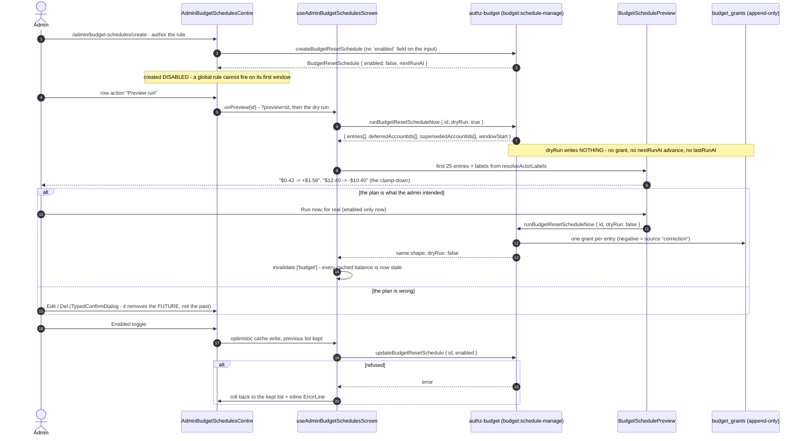

```mermaid
stateDiagram-v2
    [*] --> Draft: /admin/budget-schedules/create
    Draft --> Draft: field edits (validateBudgetSchedule mirrors the backend)
    Draft --> Disabled: createBudgetResetSchedule
    note right of Disabled
        The ONLY state a create can produce.
        `enabled` is absent from the input,
        not merely defaulted.
    end note

    Disabled --> Previewed: Preview run (dryRun: true - writes nothing)
    Previewed --> Disabled: close the sheet
    Previewed --> Disabled: Run now, for real (grants written, still disabled)
    Disabled --> Enabled: toggle / updateBudgetResetSchedule { enabled: true }
    Enabled --> Disabled: toggle off (scheduler skips it; no window queued)
    Enabled --> Enabled: a scheduled tick fires - nextRunAt advances from the schedule, not from now
    Enabled --> Deleted: TypedConfirmDialog
    Disabled --> Deleted: TypedConfirmDialog
    Deleted --> [*]

    state "unreachable" as U
    note left of U
        Enabled-straight-from-create: there is no
        input field for it.
        RunNow-without-a-preview: the footer button
        is disabled until a dryRun result exists.
        A client-decided precedence winner: only
        getEffectiveResetSchedule / the run result's
        supersededAccountIds answer that.
    end note
```

### 5.8 Sessions — `/admin/sessions` (`admin-sessions.stories.tsx`)

The admin area's sixth destination (converse-frontends#450, story C7), gated on **`session:read`**
— the ESTATE widening, never the `session:read-own` floor every default role already holds — and
the console half of
lightbridge-authz ADR-0020 Follow-up 4. The `sessions` table had been revocable since #440/#441 and
enumerable by nobody: `revokeOwnSessions` ("log out everywhere") and `revokeSubjectSessions`
(offboard this person) were the only ways to touch it, both write-only and both all-or-nothing. A
revocable table nobody can list is not a control.

Top to bottom: `PageHeader` (title "Sessions", "N sessions on this page", and
`SessionLedgerControls` in `controls` — status segmented · kind segmented · user search · the
picked-user select) → one `Card` holding `SessionLedger` (the table, the offline caption and
`Pagination`). Row detail opens `SessionDetailPanel` inside a `BottomSheet` **at every tier** — no
`portalClassName` tier gate, because no `/admin/*` route mounts a rail at any tier (§5.5) and there
is nothing to hand off to.

Columns: user (name over email, `IdentityLines`) · account · kind (with a trailing `· offline`
marker) · client (`clientId`, the `azp`) · created · last used · expires · status.

- **Status is TEXT, not a pill** (§6, console-ui skill "Status is text, never a pill"). The story
  asked for a pill with a semantic colour; the locked contract is `StatusText`, and the WORD is
  what separates the three states — `active` reads `body`, `revoked` and `expired` both read
  `muted`, and only their labels tell "an operator closed this" apart from "time ran out". The
  accent (`--signal`) is deliberately unused: none of these three is a breach.
- **Offline is a word, not a chip**, for the same reason, riding the Kind cell rather than taking a
  column of blanks. Its meaning is a `meta` caption under the table: a session whose refresh chain
  carries the `offline_access` scope — a CLI or device login that outlives a browser session
  (owner ruling Q7).
- **Empty is an inline status line with a `Reset filters` action**, never a centred placard: this
  table always has filters above it, so "nothing matched" is a fact about the filters.
- **Two revoke actions, two different confirmations.** `Close session` is a plain `ConfirmDialog` —
  it costs its owner one re-login and there is no name worth typing. `Close all sessions for this
user` is a `TypedConfirmDialog` typing the person's email (their display name when the identity
  carries none): it is aimed at a different, absent person's every device at once, and the object
  name is the guard against aiming it one row off in an operator table. Both are absent, never
  disabled, when they cannot apply — an already-revoked row has nothing to close, and a row with no
  recorded `subject` has nothing to aim the bulk action at (the Subject line says so).
- **Optimistic, with a real rollback.** The revoke flips the row in the query cache and restores the
  snapshot verbatim on failure, with the reason on screen — never a silent optimistic success.

#### The list and its filters

`querySessions` (**not** `listSessions`: that name is a hard cratestack codegen collision with the
generic `model.Session.list` verb, so only the name moved between the story and the surface) takes
one `status` of `active | revoked | expired | all`. The operator's **"Inactive" is therefore two
calls**, merged newest-first — filtering a single `all` page down to its dead rows on the client
would make every count and every `next` cursor a claim about a set the server never returned.

The user search is server-side, and the hop that makes it possible is an invariant worth stating:
`searchUsers` returns a `users.id`, `querySessions` filters on `sessions.subject`, and
`sessions.subject` is the owner's JWT `sub`, which **is** `accounts.id` (ADR-0006). Those are the
same string for the account a login adopts — `set_account_user`'s fallback branch inserts
`users(id) VALUES (NEW.id)` and sets `user_id := id` for any account created without a named owner,
which is exactly how a person's home account is made, and
`migrations/20260830000003_accounts_owned_by_users.sql` records the consequence verbatim:
"`users.id == accounts.id == subject` holds for all of them and stays holding".

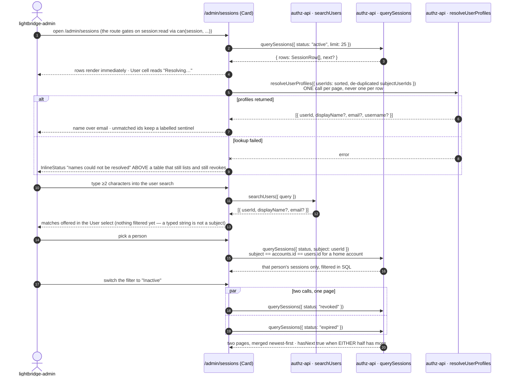

#### One session's lifecycle, and where this screen touches it

`expired` is never stored (ADR-0020 Decision 6) — it is `active` past its `expiresAt`, computed on
the way out — and `revoked` always wins over expiry, because revocation is the operator-visible act
and expiry is just time passing. Both are terminal: there is no `@@allow("update")` on `Session`
and none may be added, so nothing anywhere can flip a row back to `active`.

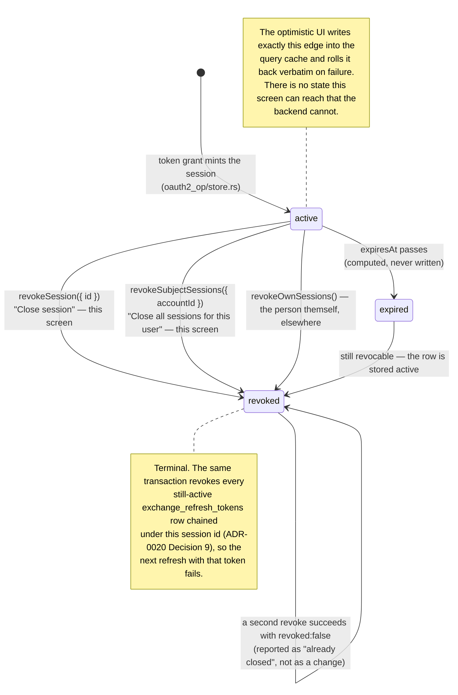

---

## 6. Interaction contracts

### Empty, filtered and unavailable states — the D6 split

[ADR 0012](../../adr/0012-console-visual-revamp.md) D6 replaces the pre-revamp "every empty case
is an inline status line" rule (which assumed every screen had a rail to keep it company) with two
components for two distinct situations:

| Situation                                                     | Treatment                                                                                                                      |
| ------------------------------------------------------------- | ------------------------------------------------------------------------------------------------------------------------------ |
| First-run: no API keys yet in this project                    | `EmptyState` inside the `Card`: headline, explainer, CTA (same button as the screen's `+ New key`/`+ New project`)             |
| First-run: no projects in this account                        | Same                                                                                                                           |
| Filtered to nothing (status/search filter excludes every row) | `InlineStatus` + a `Reset filters` ghost button, table header retained so the columns still teach the shape of the data        |
| No pending refills                                            | `InlineStatus`: `Nothing awaiting a decision.`                                                                                 |
| Chart has no data in range                                    | Axes render; a `muted` DOM-text line (never SVG `<text>`, which does not wrap) sits on the baseline: `No usage in this range.` |
| Query unresolved / still loading                              | `SkeletonRow`/`SkeletonMetric` — never `EmptyState`, which gates strictly on a _settled_ query returning zero rows             |

### Loading

- Skeletons only, matched to final geometry. No spinners, no shimmer.
- The shell renders immediately with real nav; the sidebar/top-bar never flash.

### Errors

- Field-level: `ErrorLine` under the control, border → `signal`.
- Section-level: the `Card`'s content is replaced by one `ErrorLine` + `Retry`; the rest of the
  screen keeps working — a failed latency query must not take the spend chart's `Card` down with
  it.
- Destructive-action failure: `TypedConfirmDialog` stays open with the error inline. It never
  closes on failure.

### Motion

120–160ms `ease-out` on hover fills and `BottomSheet`/`Dialog` open/close. Nothing animates on
load. No parallax, no reveal-on-scroll.

### Accessibility

- `body` on `floor` is **10.1:1**; `muted` on `surface` is **2.8:1** — below AA, so `muted` is used
  only for non-essential metadata, never for a value a user must read to act.
- `signal` on `floor` is **5.5:1**, clearing AA for normal text.
- Status is never colour-only: words first.
- Focus ring: 1px `signal` outline with a 1px offset matching the zone it sits in. Row-hover
  actions in `LedgerTable` are always visible (not hover-only), so they are never
  keyboard-invisible in the first place.

---

## 7. Responsive behaviour

| Tier               | Navigation                                                                                    | Content column                                                                                                                                                                     |
| ------------------ | --------------------------------------------------------------------------------------------- | ---------------------------------------------------------------------------------------------------------------------------------------------------------------------------------- |
| **≥`md` (600px+)** | Persistent 240px sidebar, sticky, independently scrollable                                    | Fluid, `max-w-[1120px]`, `PageHeader` + `Card`s stacked vertically                                                                                                                 |
| **<`md`**          | 48px `ConsoleTopBar` + bottom navigation dock (same `NavSpine` `groups`, `bottom-bar` layout) | Single column, 16px gutters; `PageHeader.controls` wraps; ledgers/charts scroll horizontally inside their own `overflow-x-auto` container — the page itself never scrolls sideways |

There is no third, "compact rail" tier — the old three-tier (full/compact/guard-rail) breakpoint
table described a right rail with a different contract than today's, and ADR 0013's phase E
amendment removed the rail's last live case entirely (it moved into the settings area, which has
never had a right rail at any tier — D2). Every selection across the whole console opens
`BottomSheet`, bottom-docked, at every viewport — not a below-`lg` fallback for anything.

`shell-persistence.stories.tsx` demonstrates that navigating between routes does not remount the
sidebar/top-bar (the nav DOM node persists across route changes) — this is the shell's own
acceptance test, not something a screen spec should re-litigate per screen.

---

## 8. Process diagrams

### 8.1 API key rotation

Unaffected by the shell revamp — `TypedConfirmDialog` and `SecretReveal` were never rail content.

```mermaid
sequenceDiagram
    autonumber
    actor U as Project lead
    participant L as Api-Keys ledger (Card)
    participant D as TypedConfirmDialog
    participant S as SecretReveal (centre)
    participant API as POST /api/v1/api-keys/{id}/rotate

    U->>L: RowActionGroup — activate "Rotate"
    L->>D: open, naming the key and its prefix
    D-->>U: "the old secret stops working immediately"
    U->>D: type the key name exactly
    D->>D: enable primary only on exact match
    U->>D: confirm
    D->>API: rotate(keyId)
    alt rotated
        API-->>S: { secret, key_prefix, rotated_at }
        S-->>U: secret shown once, Copy primary, explicit × to dismiss
        L->>L: row updates in place — new prefix, last used reset
    else failed
        API-->>D: error
        D-->>U: dialog stays open with ErrorLine; nothing changed
    end
```

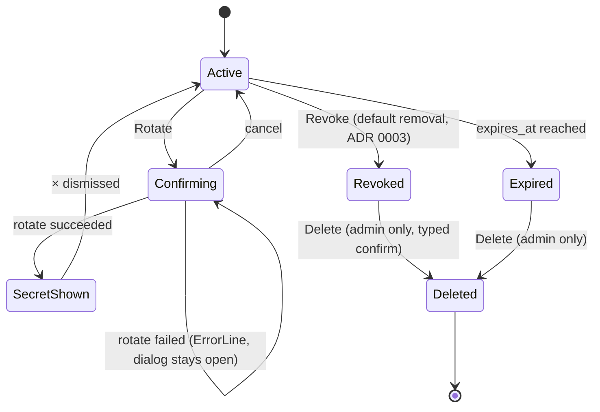

### 8.2 Budget refill: request → review → decision

**Updated for ADR 0013 D4 (refill as a page) and phase E (moved under `/settings/accounts`)** —
the pre-revamp diagram opened a shared `RequestRefillDialog`; refill is now its own route, moved
from `/accounts/<id>/refill` to `/settings/accounts/<id>/request-refill` by the phase E amendment
(the old path 308s here verbatim), and the review surface moved from `/admin` to
`/admin/refills-queue`, opening `BottomSheet` at every tier rather than a rail-adjacent sheet
(§5.5 — neither `/admin/*` nor `/settings/*` has a right rail at any tier).

**Updated again for converse-frontends#444 (the requester)** — the queue names the person who
asked, not just the account they asked under. `AugmentationRequest.requestedByUserId`
(lightbridge-authz#646) is the token subject captured at `requestBudgetRefill`; the console
resolves a whole PAGE of those ids through ONE `resolveUserProfiles` call (lightbridge-authz#647,
gated on `user:read`) rather than one call per row, and owns every sentinel it prints — the
backend fabricates no placeholder identity. The second diagram below is that cell's own lifecycle:
four states, four labels, and no path on which a row is dropped for want of a name.

```mermaid
sequenceDiagram
    autonumber
    actor M as Project member
    participant O as Overview · Budget card
    participant RP as /settings/accounts/<id>/request-refill (page)
    actor A as lightbridge-admin
    participant Q as /admin/refills-queue (Card)
    participant ID as authz-api · resolveUserProfiles
    participant BS as BottomSheet -> ReviewDetailPanel

    O-->>M: "$455.20 of $500.00" · meter turns signal-orange at 91%
    M->>O: "Request refill" navigates to RP (no dialog opens)
    RP-->>M: RefillRequestForm, tiers from the active policy · RefillHistory below it
    M->>RP: pick tier, add a note, submit
    RP-->>M: request recorded with requestedByUserId = auth().id
    Note over O,Q: same record, two routes
    A->>Q: open /admin/refills-queue (session.isAdmin gates the route;\nan old /settings link 308s here)
    Q-->>A: rows render immediately · Requester cell reads "Resolving…"
    Q->>ID: resolveUserProfiles({ userIds: sorted, de-duplicated ids })\nONE call per page, never one per row
    alt profiles returned
        ID-->>Q: [{ userId, displayName?, email?, username? }]
        Q-->>A: Requester = name, email underneath;\nan id with no profile = "Unresolved user" + the raw id
    else user:read refused / call failed
        ID-->>Q: error
        Q-->>A: every id falls back to "Unresolved user" + raw id,\nInlineStatus above the table says why · rows stay decidable
    end
    Note over Q: requestedByUserId = NULL (pre-2026-09 row)\nnever reaches the batch — it renders "Unknown (pre-2026-09)"
    A->>Q: select row
    Q->>BS: open(requestId)
    BS-->>A: the same requester in the header block, then tier, amount, notes
    alt approve
        A->>BS: Approve +$250.00
        BS-->>Q: row leaves Pending, enters Decided; sheet closes
        BS-->>O: ceiling becomes $750.00; meter returns to body-grey
    else decline
        A->>BS: Decline (+ optional decision note)
        BS-->>Q: row leaves Pending, enters Decided; sheet closes
        BS-->>O: ceiling unchanged; card shows the decision and its note
    else request fails
        A->>BS: decision submitted
        BS-->>A: sheet stays open, error inline; nothing changed
    end
```

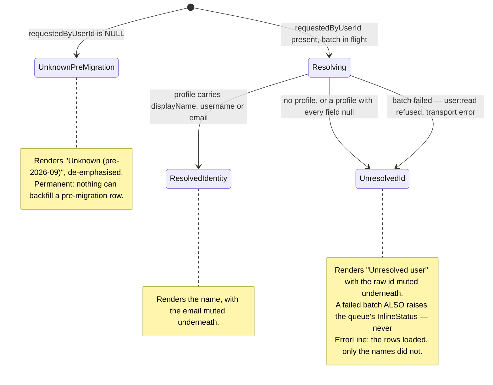

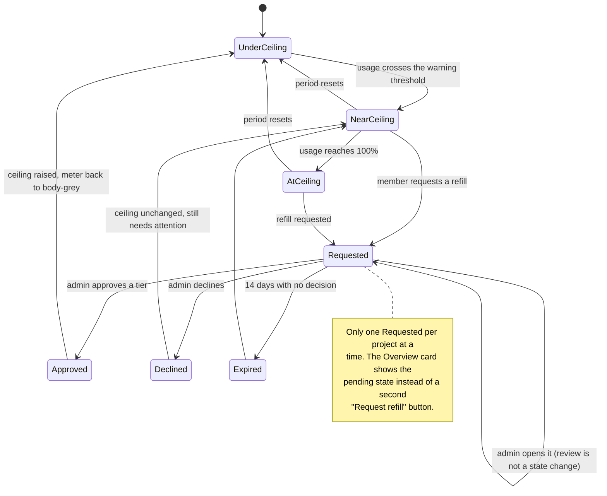

### 8.3 Report export

**Updated for the two-column shell** — export is a `Dialog`, not a rail form; reachable from
Overview and Projects alike.

**Updated again (converse-frontends#453) — there are now TWO reports through ONE dialog.**

|             | Consumption report             | Dashboard page report                                               |
| ----------- | ------------------------------ | ------------------------------------------------------------------- |
| Opened from | Overview, Projects             | the `PageHeader` of **every** `dashboards.yaml`-driven page         |
| Route       | `GET /api/reports/consumption` | `GET /api/reports/page?path=<route>&…`                              |
| Window      | a month, picked in the dialog  | the page's own range picker, **echoed read-only**                   |
| Scope       | `ScopeSelect` in the dialog    | the route it was opened from                                        |
| Grouping    | a segmented control            | each panel's, from `dashboards.yaml`                                |
| Formats     | CSV · PDF                      | CSV · PDF (+ `format=html` as a preview, not offered in the dialog) |

Both render through the same `typst-render` sidecar and the same per-route `.typ` templates. The
dialog is the same `ReportExportDialog`, **extended rather than forked**: `period`, `scopeSlot` and
`groupBy` became optional, and a dashboard export omits all three rather than disabling them — a
control that appears to change the document and does not is worse than no control. What is left is
the format and one "Include tables" toggle.

**Why a dashboard report carries its values as tables under each chart, against §2.4a's "no static
per-series legend lists".** That rule exists because a screen has a pointer and the values live in a
Floating-UI tooltip. Paper has none: a ring or a five-line board printed with no values states
nothing a reader can act on. The rule is unchanged where it applies; the medium changed. The toggle
is the reader's own control over it.

The `EmptyResult` state below is the CONSUMPTION report's. A dashboard report of an empty window is
a real document — each panel states its own emptiness and the header states the window, which is a
more useful answer to "what happened last week" than a refusal to produce a file.

Failure is `ErrorLine` + `Retry` inside the dialog, with every input kept. The renderer's own
compile-error detail (Typst's stderr, line and column) goes to the server log, not into the dialog:
it is a template author's diagnostic, and a reader who pressed Export cannot act on a line number.

```mermaid
sequenceDiagram
    autonumber
    actor U as Operator
    participant H as PageHeader (any YAML page)
    participant E as ReportExportDialog
    participant R as GET /api/reports/page
    participant T as typst-render sidecar
    participant B as Browser

    U->>H: Export
    H->>E: open · range echoed read-only · format · include tables
    U->>E: Generate report
    E->>E: primary -> "Generating…", disabled
    E->>R: path=<dashboards.yaml route> · range · filters · format
    R->>R: resolveDashboard -> the SAME deduplicated query list the page issued
    alt format=pdf
        R->>T: POST /render {template, data.json, one SVG per chart panel}
        T-->>R: application/pdf
    else format=csv
        R->>R: the underlying grouped rows, one section per panel
    end
    R-->>E: 200 + Content-Disposition filename
    E->>B: downloadBlob -> the file
    E-->>U: dialog closes, re-armed
    R-->>E: 404 unknown route · 422 template did not compile · 502 renderer unreachable
    E-->>U: ErrorLine + Retry; every input kept
```

The consumption report's own flow, which keeps the period/scope/group-by controls:

```mermaid
sequenceDiagram
    autonumber
    actor U as Account member
    participant E as ReportExportDialog
    participant R as GET /api/reports/consumption
    participant API as POST /usage/v1/usage/query
    participant T as typst-render sidecar
    participant B as Browser

    U->>E: PageHeader action "Monthly report" opens the dialog
    U->>E: period · scope · group-by · includes · CSV|PDF
    U->>E: Generate report
    E->>E: primary -> "Generating...", disabled
    E->>R: month · account [· project] · format
    R->>API: one account-scoped query, project x model (scope-guarded since #453)
    API-->>R: usage rows
    alt format=csv
        R-->>E: streamed CSV — byte-identical to before #453
    else format=pdf
        R->>T: POST /render {templates/reports/consumption/report.typ, data.json}
        T-->>R: application/pdf
    end
    alt ready
        E->>B: trigger download
    else empty result
        E-->>U: a real document stating a genuine zero, never a fabricated one
    else failed
        E-->>U: ErrorLine + Retry; the form keeps every input
    end
```

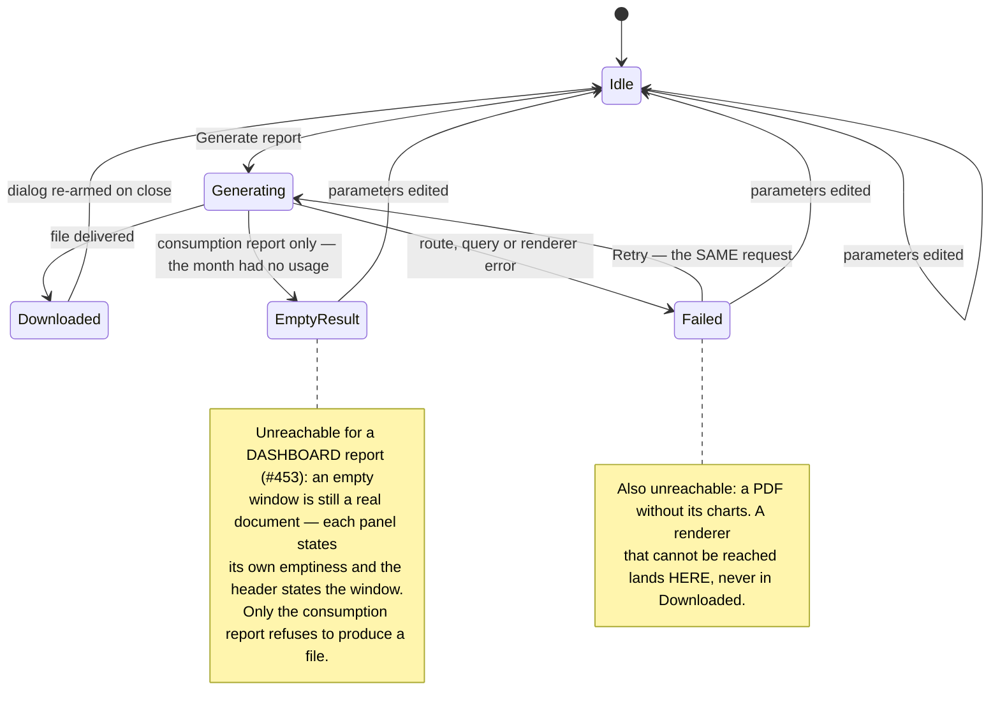

### 8.4 Authoring a refill policy from the example (issue #445)

`/admin/refill-policies/create` only. Every field of `RuleSetForm` carries its own example line, and
one action fills the whole form with a sample that the form's OWN validator accepts — the create
route's hook holds a dirty bit so the fill never silently discards typed input.

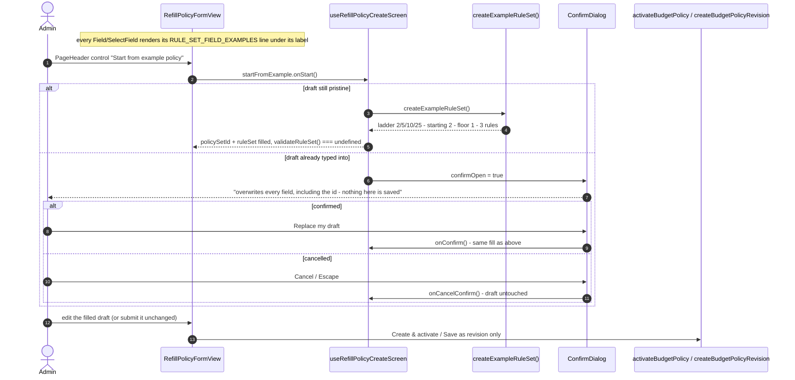

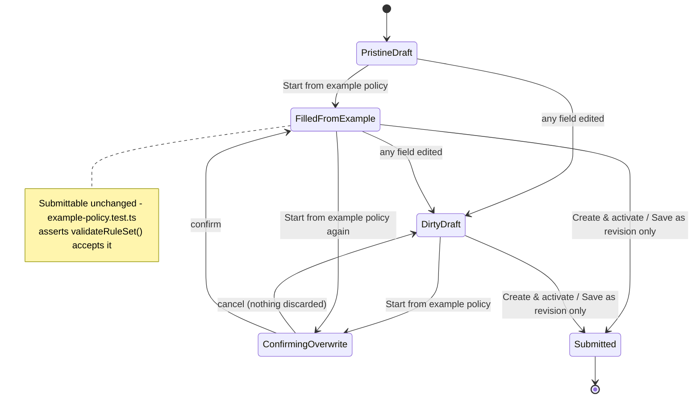

**Unreachable on purpose:** the edit route (`/admin/refill-policies?edit=<id>`) has no
`FilledFromExample` state at all — `startFromExample` is absent from the edit hook's return value,
so the action never renders there.

### 8.5 Resolving an analytics lens from `dashboards.yaml` (story C12, converse-frontends#455)

How the five overview pages — `/accounts/<id>/overview` and the four `/settings/overview/*` lenses —
get from a route to a rendered grid. The interesting part is the fork: a lens whose scope is a
single actor issues ONE deduplicated query list, while the account-family lens (`scope: family`)
expands each panel into one account-scoped query per family account and merges the responses back
into a single one before any adapter sees it.

Participants cite the modules that back them, so the diagram can be re-verified rather than
quietly rotting: `apps/console/src/dashboards/page-entry.ts`, `resolve-dashboard.ts`,
`use-dashboard.ts`, `panel-adapters.ts`, `dashboard-renderer.tsx`, and the zone hooks
`use-account-overview-zones.ts` / `use-settings-overview-zones.ts`.

```mermaid
sequenceDiagram
    autonumber
    actor U as Signed-in user
    participant R as Route (server component)
    participant Y as dashboardPage() -> dashboards.yaml
    participant C as Centre (client)
    participant Z as Zone hook (RPC-backed)
    participant S as resolveDashboard()
    participant Q as useDashboard / useQueries
    participant API as POST /usage/v1/usage/query
    participant A as toPanelView()
    participant G as DashboardRenderer

    U->>R: open the route
    R->>Y: read the entry keyed by THIS route
    alt no entry, or an invalid document
        Y-->>R: throw, naming the page and panel id
        R-->>U: fail loud — never a blank grid
    end
    Y-->>R: DashboardPageSpec
    R->>C: render with page={spec}

    par the hand-written zones
        C->>Z: budget ceiling / burn-down / key hygiene (billing period, RPCs)
        Z-->>C: their own status, independent of every panel
    and the declarative grid
        C->>S: page + window + $param filters (+ family account ids)
        S->>S: substitute $params; $project? drops when absent
        S->>S: resolve bucket: auto from the range; add the compare twin
        alt scope: family
            S->>S: expand each panel into one scope:account query per family account
        end
        S->>S: dedupe on the resolved query key
        S-->>C: ResolvedDashboard {queries[], panels[queryIndices]}
        C->>Q: one useQueries over the deduped list
        Q->>API: N requests (never one per panel)
        API-->>Q: UsageQueryResponse per query
        Q->>Q: merge a panel's fan-out members, stamping account_id from each query's scope_id
        Q->>A: response (+ compare twin, + label resolver)
        A-->>G: DashboardPanelView per panel
    end
    G-->>U: DashboardGrid of DashboardPanels
```

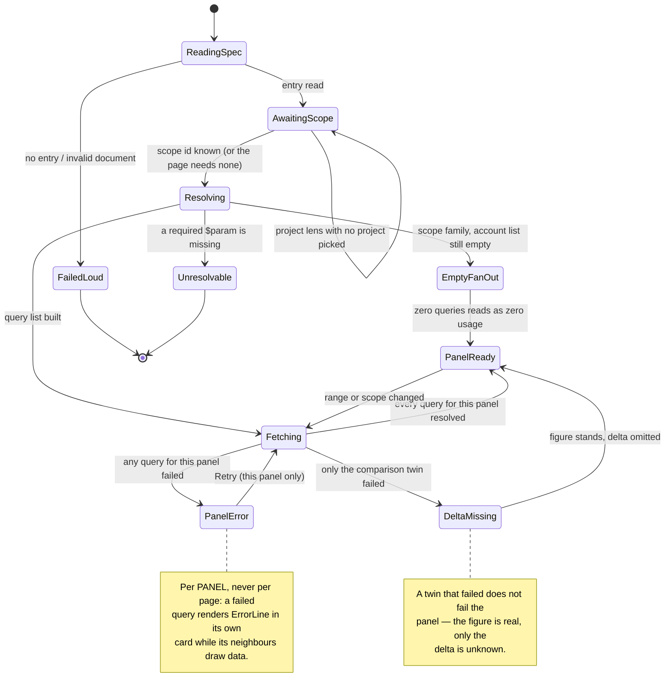

**States nothing can enter, and why that is correct:** there is no `PartialFanOut`. A family total
summed over 18 of 25 accounts is a WRONG number, not a partial one, so a fan-out panel is
all-or-nothing — `collect()` in `use-dashboard.ts` reports `loading` while any member is pending and
`error` if any member failed. And `Unresolvable` is terminal by design: an unresolved `$param` is a
thrown error, never an empty `scope_id`, because an empty scope silently queries something other
than what the panel's title says.

---

---

## 9. Decision ledger

| Decision                                                                             | Source                                                                            | Why                                                                                                                                                                                                                                                                |
| ------------------------------------------------------------------------------------ | --------------------------------------------------------------------------------- | ------------------------------------------------------------------------------------------------------------------------------------------------------------------------------------------------------------------------------------------------------------------ |
| Near-black tonal stack `#000 → #111 → #191919 → #202020`                             | Axiom style, via ADR 0008 D5                                                      | Unchanged by the revamp — see §1.1                                                                                                                                                                                                                                 |
| `#DA5C2C` for CTA, active state and "needs you" only                                 | Axiom; ADR 0008 D5–D6                                                             | The one rule that makes the console legible at a glance                                                                                                                                                                                                            |
| Sans-first type, mono for data only                                                  | **2026-08-30**, ADR 0012 D2                                                       | Matches the reference lock (Anthropic Console, fal.ai, Cartesia, Attio all set structural chrome in a sans face)                                                                                                                                                   |
| Radius 8px (panels) / 4px (controls)                                                 | **2026-08-30**, ADR 0012 D4                                                       | Superseded the flush 2px rule once panels became cards with real insets                                                                                                                                                                                            |
| Two-column shell, no _permanent_ right rail                                          | **2026-08-30**, ADR 0012 D1                                                       | Owner review: a permanent 280px column for five controls cost too much of the viewport on two of four screens, and the inconsistency (rail on two screens, none on two) was itself the defect                                                                      |
| Cards are the default zone container                                                 | **2026-08-30**, ADR 0012 D3                                                       | Reference lock unanimous: every named product cards its dashboard content on a floor                                                                                                                                                                               |
| One dashboard, role-parameterised; no admin-only zone on it at all                   | **2026-08-30 → 2026-08-31**, ADR 0012 D5, superseded by ADR 0013 (build brief §7) | A standalone admin dashboard route duplicated Overview's own zones; then even Overview's own admin-only zones (Budget pressure, Key hygiene) moved out to the settings-area estate lenses, leaving Overview real for every signed-in user with nothing gated on it |
| `EmptyState` for first-run, `InlineStatus` for filtered/unavailable                  | **2026-08-30**, ADR 0012 D6                                                       | A genuinely empty first-run screen has nothing else on it — the centred placard earns its place back, narrowly                                                                                                                                                     |
| Right rail returned, then narrowed to one case                                       | **2026-08-30 → 2026-08-31**, ADR 0012 D7, superseded by ADR 0013 D2               | The owner brought the rail back for selection-driven detail, then deleted its one _standing_ case (the Overview quick-settings panel) once every mutation it hosted had its own better home — see §3                                                               |
| Report export = `Dialog`, not a rail panel                                           | **2026-08-30**, ADR 0012 D7                                                       | Reachable from Overview and Projects, unaffected by the rail's later narrowing                                                                                                                                                                                     |
| Refill is a page, not a shared dialog                                                | **2026-08-31**, ADR 0013 D4                                                       | `RequestRefillDialog` had drifted into flow territory (its own history, its own status reads) while still being modal chrome; a page gave it a real URL                                                                                                            |
| Account into the URL path; project stays `?project=`                                 | **2026-08-31**, ADR 0013 D1                                                       | Bookmark stability for the account, "absent means all" for the project — see D1's own two reasons                                                                                                                                                                  |
| A dedicated settings area, one shell mount, no right rail in it                      | **2026-08-31**, ADR 0013 D2                                                       | Seven destinations needed real navigation, not five loose screens; a sibling shell mount would have remounted the sidebar on every account↔settings hop                                                                                                            |
| Ranked, normalized-sparkline rows as the default breakdown; `ShareBar` survives once | **2026-08-31**, ADR 0013 D5                                                       | Grounded in a 726k-row measurement: top-1 ≥95% share is the _common_ case, and a part-to-whole chart reads as a wall the moment one series dominates                                                                                                               |
| Monochrome chart ramp, one orange series max                                         | ADR 0008 D6                                                                       | Unchanged — accent is signal, not category                                                                                                                                                                                                                         |
| Budget number, ceiling and refill CTA on one line                                    | OpenAI + Cohere (ADR 0008 D7)                                                     | Unchanged                                                                                                                                                                                                                                                          |
| Hairline ledger tables, always-visible row actions                                   | Midday via ADR 0008 D5                                                            | Row actions moved from hover-only to always-visible during the revamp — hover-only is keyboard-invisible                                                                                                                                                           |
| Status as text, not pills                                                            | shadcn/Fingerprint restraint (ADR 0001)                                           | Unchanged                                                                                                                                                                                                                                                          |
| Revoke emphasised over Delete; typed confirmation                                    | ADR 0003 + Gladia flow 10901                                                      | Unchanged                                                                                                                                                                                                                                                          |
| One-time secret shown in the centre, dismissed explicitly                            | Cohere/Exa flows                                                                  | Unchanged                                                                                                                                                                                                                                                          |
| Empty/filtered states never hide a chart's axes or a table's header                  | Owner constraint + house rule                                                     | A disappearing frame reads as broken                                                                                                                                                                                                                               |
| Skeletons matched to geometry; no spinners                                           | Cursor/Gladia loading treatments                                                  | Unchanged                                                                                                                                                                                                                                                          |
| Auth error state: one control, relabelled, not two stacked                           | **2026-08-30**, phase 7 polish                                                    | Two controls both restarting the identical redirect was itself the defect                                                                                                                                                                                          |

---

## 10. Tensions

_Historical tensions recorded in the pre-revamp version of this document have been resolved by
[ADR 0012](../../adr/0012-console-visual-revamp.md) and are removed rather than kept as dead
entries_: the right-panel-as-actions-vs-parameters question (screen parameters live in
`PageHeader.controls` at every tier, unconditionally), the scalar-panel-vs-distribution-floor
boundary (subsumed by "every zone gets a `Card`"), refine's `list/show/edit` route shape vs a
persistent rail (resolved by the situational rail/`BottomSheet` pair, neither of which needs a
persistent mount), and the `maxContentWidth` token's meaning (resolved: it is
`CONTENT_MAX_WIDTH_CLASS`'s 1120px figure for the shell's content column, and the Auth page's own
360px cap independently).

[ADR 0013](../../adr/0013-console-information-architecture-v3.md) resolved one more: whether
"the rail is gone" (ADR 0012 D1/D7's original wording) or "the rail is back" (the owner's
2026-08-30 same-day reversal, recorded loosely in ADR 0012's own text) is the operative rule —
neither, precisely, as of that ADR's original merge: the rail existed, narrowed to exactly one
route/state (`/accounts/<id>/projects` with a row selected). ADR 0013's own **phase E amendment**
(2026-08-31) resolved it a final time: that one case moved into the settings area, which never had
a right rail at any tier, so the rail primitive survives in `packages/ui-web` (its own stories
still exercise it) with **zero live cases** anywhere `apps/console` mounts a route. This document
and the console-ui skill state that outcome now, rather than either the "gone" or "one case"
claims that preceded it.

Two tensions from the original ADR 0008 spec were never shell-shaped and remain open:

1. **`--muted` (`#606060`) fails AA against `surface` (2.8:1).** Kept non-load-bearing by
   convention (§2.1); a `--muted-strong` step may be needed if a future screen needs "minor
   metadata that must still be readable."
2. **ADR 0008's nav spine had no home for Auth**, and still doesn't in the strict sense — Auth
   renders outside the shell entirely by design (§5.6), which is a deliberate choice, not a gap,
   but is worth restating here since nothing in `navGroups` documents it.

One tension IA v3 introduced and left open, by its own honest admission: **the settings-area
estate/analytics lenses (`/settings/overview/{account,project,user}`, §5.5) ship as real screens
with no in-app link to any of them.** Recorded here rather than silently left for the next reader
to discover — either a nav entry point is still owed, or the three lenses are dead code with real
tests keeping it alive, and which of those is true is a product call this document does not make
on its own.
