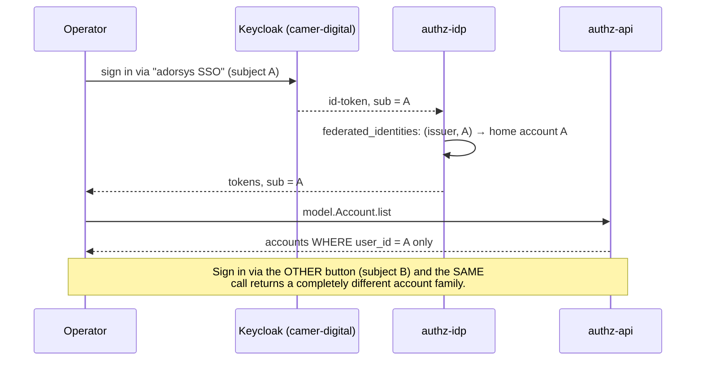
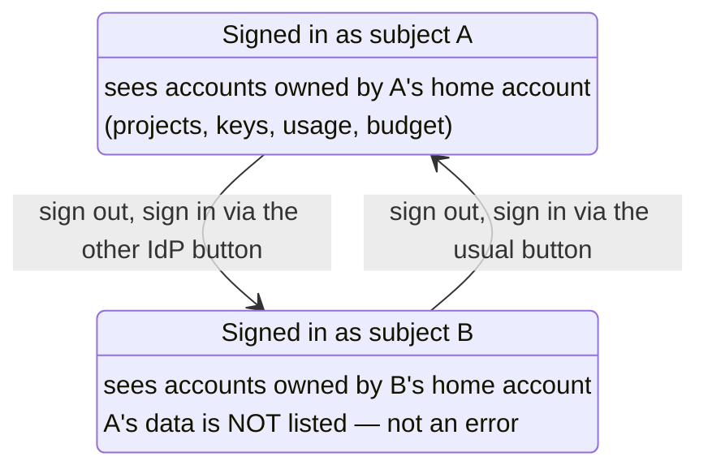

# Identity → account visibility

> Written after a real 2026-08-30 incident: the console rendered an empty dashboard ("usage is
> not being called?") and the cause was neither the UI nor the backend — the operator was signed
> in through a DIFFERENT IdP button than usual. This page exists so the next person recognises
> the moment instead of debugging it.

## The model

One human can hold **several federated identities** (one per upstream IdP login — e.g. the
"adorsys SSO" and "SSegning Dev" buttons on the sign-in screen are different Keycloak subjects).
Each identity adopts exactly one **home account** (`federated_identities.account_id`,
ADR-0024/0025), and since ADR-0026 an identity can own further accounts
(`accounts.user_id = <home account id>`).

**Account visibility is strictly per-identity**: `model.Account.list` returns accounts whose
`userId` equals the acting identity's home-account id — and nothing else. Two identities held by
the same human have **disjoint account families**, disjoint projects, keys, budgets, and usage.

## Recognising it

Symptoms of "wrong identity", in the order people notice them:

1. The dashboard is empty / "No usage in this range" on an account that had data yesterday.
2. The workspace switcher lists unfamiliar accounts (or misses the familiar one).
3. The sidebar footer shows an unexpected display name/email — **this is the tell**; check it
   first. The footer identity comes from the IdP's profile claims for the ACTIVE subject.

Resolution: sign out (full sign-out — the idp keeps its own browser session) and sign in with
the intended IdP button.

## Account-scoped URLs

Since [ADR 0013](adr/0013-console-information-architecture-v3.md) D1 (IA v3 phase 1), every screen
lives under `/accounts/[accountId]/*` — the account is a **URL path segment**, not just a query
parameter. This changes what a deep link carries and what has to be checked before honouring it:

- **A deep link carries the tenant.** `/accounts/acct_1/api-keys` names a specific account
  directly, the same way it would in any other multi-tenant path-scoped app — sharing that URL
  with a colleague, or bookmarking it, points at that one account regardless of which account the
  recipient's browser last had active.
- **`/` is the resolver, not a screen.** A bare visit (no account in the path yet) resolves
  `lightbridge.last-account` — a per-_identity_ preference, meaningless across the identity switch
  this page describes — falling back to the first account the acting identity's own
  `model.Account.list` returns, and redirects into `/accounts/<that id>/overview`.
- **The "not your account" guard.** `accounts/[accountId]/layout.tsx` checks the path's account id
  against the acting identity's own settled `allAccounts` list before rendering anything under it.
  A bookmarked or hand-edited URL naming an account the current identity cannot see — including,
  per this page's whole scenario, an account that belongs to the _other_ federated identity of the
  same human — renders **"This account isn't available to you," with a link back to `/`** (the
  resolver), never the other identity's data and never a raw 403/404. The check is gated on the
  accounts query having genuinely _settled_; while it is loading, the screen renders normally
  rather than flashing a false "not available" during the brief window before the list arrives.

This is exactly the failure mode a wrong-identity sign-in produces on a bookmarked link: the
account id in the URL is real, but not visible to whichever subject is currently signed in — the
guard's message is what a person actually sees, distinct from the empty-dashboard symptom this
page opens with (which is what happens when no account id is in play yet at all, i.e. on `/`).

## Three ids, and which one each thing is keyed on

Account visibility and _authorization_ are keyed on different ids, and confusing them is the
second-most-common way to misread a screen after the wrong-identity sign-in above.

| Id         | What it names                                                                      | Where the console holds it                        | What is keyed on it                                                                      |
| ---------- | ---------------------------------------------------------------------------------- | ------------------------------------------------- | ---------------------------------------------------------------------------------------- |
| `sub`      | the acting **account subject** (ADR-0025 mints the home account id as the subject) | `session.user.sub`                                | account visibility (`model.Account.list`), the usage guard's home-account fast path      |
| `users.id` | the **person**                                                                     | `session.user.platformUserId`, from `getMyAccess` | `platform_role_grants` — a platform role follows the human across every account they own |
| account id | one account in that person's family                                                | the URL path segment `/accounts/[accountId]/*`    | every account-scoped screen                                                              |

The person id is why `/admin/roles` can tell that a grant is the operator's **own** (and warn before
they revoke their own admin): comparing against `sub` would match nothing, because one person may
own several accounts and hold one grant. `getMyAccess` returns it explicitly for exactly this
reason, falling back to the subject itself during the ADR-0025 bootstrap window, before the
`accounts_set_user` trigger has provisioned `users.id`.

## Identity is not authorization

Which accounts you can see and what you are allowed to do are **two independent questions**, decided
in two places:

- **Visibility** is ownership, per federated identity, enforced by `model.Account.list`'s own
  `@@allow` — the whole subject of this page.
- **Authorization** is the permission set `procedure.getMyAccess` resolves for the caller, stored on
  the session and read through `can()`/`useCan()` (see
  [`knowledge/authorization-and-permissions.md`](knowledge/authorization-and-permissions.md)).

They used to be entangled, and badly. Production mapped `owner → ["lightbridge-admin"]`, and since
ADR-0026 every signed-in person owns an account — so _owning an account_ silently made you an admin.
`isAdmin(roles)` therefore answered `true` for the entire user base. converse-frontends#452 deleted
that predicate outright: admin is now a row in `platform_role_grants` with a granter, a timestamp
and a reason, and account owners default to `lightbridge-viewer`.

The practical consequence for this page's scenario: **switching identity changes what you can see,
and it can also change what you may do** — a platform role is granted to a _person_, so it follows
you across your own accounts, but the other federated identity of the same human is a different
person as far as `platform_role_grants` is concerned. Signing in through the other IdP button can
therefore produce an empty dashboard _and_ a missing admin area, from two different causes at once.

## Consequences for features

- "All accounts" anywhere in the console (the workspace switcher, `/settings/overview/*`
  analytics, report exports) always means **all accounts of the current identity**, never all
  accounts of the human.
- **Estate-wide** reads (`/admin/overview`, `/admin/usage*`) are the one exception, and they are not
  a visibility widening: they use the usage API's `scope: 'all'`, gated on `usage:read-all`, which
  bypasses ownership because an estate query has no per-account predicate to check even in
  principle. A caller without that permission cannot reach them at all.
- Merging families across identities would be an ADR-0026 follow-up (linking several federated
  identities to one owner) — deliberately not implied anywhere in the UI today.

Verified against prod data 2026-08-30: two federated identities for one operator, each with its
own self-owned home account (`user_id = id`), one owning the newer accounts created that night.
