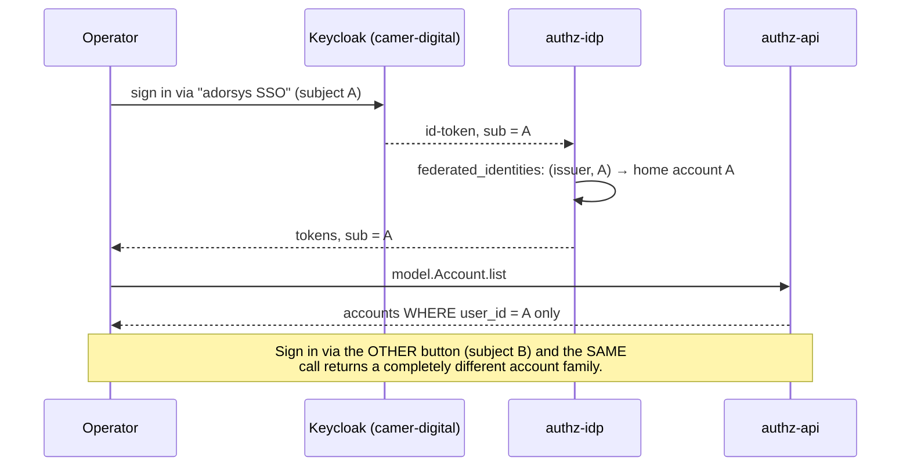
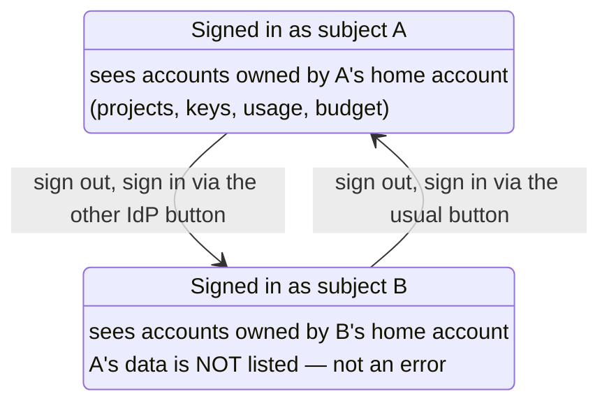

# Identity → account visibility

> Written after a real 2026-08-30 incident: the console rendered an empty dashboard ("usage is
> not being called?") and the cause was neither the UI nor the backend — the operator was signed
> in through a DIFFERENT IdP button than usual. This page exists so the next person recognises
> the moment instead of debugging it.

## The model

One human can hold **several federated identities** (one per upstream IdP login — e.g. the
"adorsys SSO" and "SSegning Dev" buttons on the sign-in screen are different Keycloak subjects).
Each identity adopts exactly one **home account** (`federated_identities.account_id`,
ADR-0024/0025), and since ADR-0026 an identity can own further accounts
(`accounts.user_id = <home account id>`).

**Account visibility is strictly per-identity**: `model.Account.list` returns accounts whose
`userId` equals the acting identity's home-account id — and nothing else. Two identities held by
the same human have **disjoint account families**, disjoint projects, keys, budgets, and usage.

## Recognising it

Symptoms of "wrong identity", in the order people notice them:

1. The dashboard is empty / "No usage in this range" on an account that had data yesterday.
2. The workspace switcher lists unfamiliar accounts (or misses the familiar one).
3. The sidebar footer shows an unexpected display name/email — **this is the tell**; check it
   first. The footer identity comes from the IdP's profile claims for the ACTIVE subject.

Resolution: sign out (full sign-out — the idp keeps its own browser session) and sign in with
the intended IdP button.

## Consequences for features

- "All accounts" anywhere in the console (the workspace switcher, `/settings/overview/*`
  analytics, report exports) always means **all accounts of the current identity**, never all
  accounts of the human.
- Merging families across identities would be an ADR-0026 follow-up (linking several federated
  identities to one owner) — deliberately not implied anywhere in the UI today.

Verified against prod data 2026-08-30: two federated identities for one operator, each with its
own self-owned home account (`user_id = id`), one owning the newer accounts created that night.
