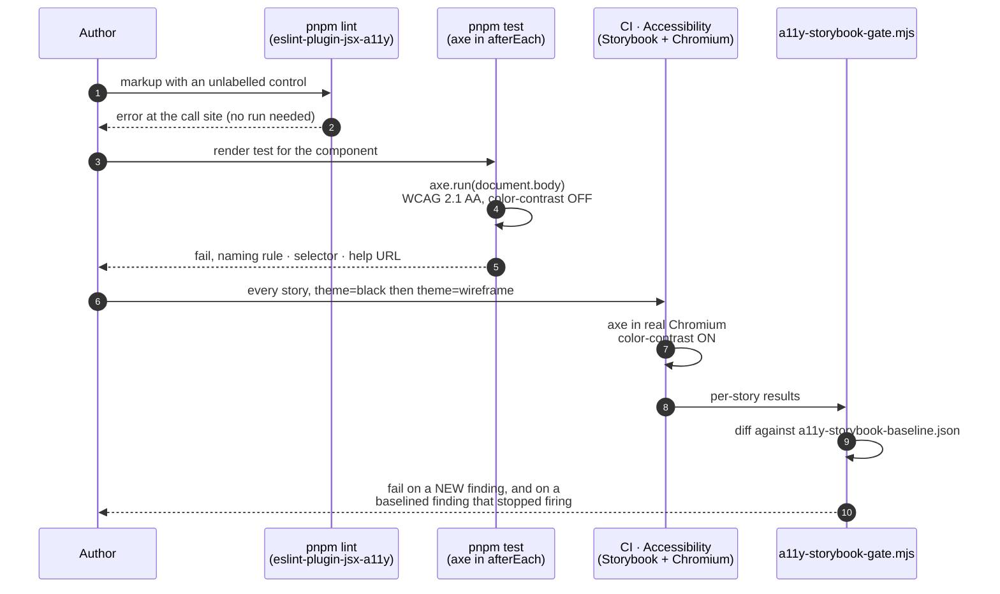
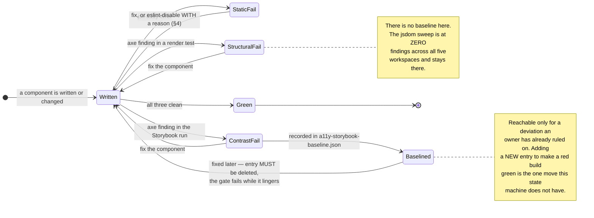

# Accessibility

> Owner directive, 2026-09-03 (issue
> [#443](https://github.com/ADORSYS-GIS/converse-frontends/issues/443)): **accessibility is a GATE,
> not a panel.** `@storybook/addon-a11y` had been installed since the ADR 0010 phase-4 work, but
> only as a viewer — a badge in a panel a reviewer had to open. Nothing failed. This document
> describes what replaced that.

The bar is **WCAG 2.1 level A + AA** (`wcag2a`, `wcag2aa`, `wcag21a`, `wcag21aa`). One bar, stated
in one place per tool, asserted in three.

---

## 1. The gate stack

Three layers, each catching a class of defect the others structurally cannot.

| Layer                     | Tool                                            | Where it lives                                           | Runs in                    | Catches                                                                       |
| ------------------------- | ----------------------------------------------- | -------------------------------------------------------- | -------------------------- | ----------------------------------------------------------------------------- |
| **Static**                | `eslint-plugin-jsx-a11y` (recommended, `error`) | root `eslint.config.js`                                  | `pnpm lint`, CI Quality    | Markup that is wrong on its face — unlabelled controls, bad ARIA, `autoFocus` |
| **Runtime, structural**   | `axe-core` in an automatic `afterEach`          | `packages/ui-web/src/test/a11y-sweep.ts`                 | `pnpm test`, CI Unit tests | Every render test's DOM: roles, names, relationships, focus order             |
| **Runtime, presentation** | `@storybook/addon-a11y`, `test: 'error'`        | `.storybook/preview.tsx` + `vitest.storybook.config.mts` | CI `Accessibility` job     | Every story, both themes, real Chromium — **including colour contrast**       |

Plus one thing that is not a gate: a **dev-time reporter** (§5) that puts findings in the browser
console while a screen is being built, so the gates are confirmation rather than discovery.

### Why the split, in one sentence each

- **jsdom cannot compute colour.** It implements no layout and no cascade resolution, so
  `getComputedStyle` returns declared values and every box is zero-sized. `color-contrast` is
  therefore **disabled** in the test sweep and **enabled** in the Storybook run, which is the only
  place in this repo with a real engine. Never "fix" a contrast finding by editing
  `src/test/a11y.ts`; it does not produce them.
- **A browser cannot run 1500 unit tests in seconds.** The structural rules — which are most of
  them — belong in the fast suite, on every test, with no assertion to remember.
- **Neither runtime can see code that never rendered.** That is eslint's half.





---

## 2. How to run it

```bash
# Static — every DOM workspace, jsx-a11y at error level
pnpm lint

# Runtime, structural — axe on every render test, automatically
pnpm test                                  # all workspaces
pnpm --filter @lightbridge/ui-web test     # one of them

# Runtime, presentation — every story × both themes, real Chromium, contrast ON
pnpm --filter @lightbridge/ui-web exec playwright install chromium   # once per machine
pnpm --filter @lightbridge/ui-web test:a11y                          # ratcheted gate (CI runs this)
pnpm --filter @lightbridge/ui-web test:a11y:raw                      # the bare vitest run, for reading failures
pnpm --filter @lightbridge/ui-web test:a11y:update-baseline          # ONLY after reading what changed
```

The Storybook run takes roughly 90 seconds and produces 2134 story-runs (1067 stories × 2 themes).
A full `pnpm test` performs **1240 axe runs** — one per test that rendered anything — for about
20 seconds of added wall-clock across the five workspaces. None of them is an assertion anybody
wrote.

### Writing an explicit assertion

The sweep is automatic, so a render test needs nothing. When you want the assertion visible in the
test itself — a screen-level test, say, where the axe run is the point:

```ts
import { expectNoA11yViolations } from '@lightbridge/ui-web/src/test/a11y';

const { container } = render(<AccountDirectory accounts={accounts} />);
await expectNoA11yViolations(container);
```

### Wiring a NEW workspace in

`packages/ui-web/src/a11y-gate.test.ts` asserts all of this from source, so a missed step fails a
test rather than passing silently. The steps:

1. `setupFiles` → a module that does `import { afterEach } from 'vitest'` and
   `installA11ySweep(afterEach)`. The hook is passed in, never imported inside the shared module:
   under pnpm the two can be different `vitest` instances, and registering into the wrong one fails
   silently.
2. `sequence: { hooks: 'list' }` **at the root of the Vitest config**, never inside a `projects`
   entry.
3. Add the workspace to `GATED_WORKSPACES` in `a11y-gate.test.ts` and to `DOM_SURFACES` in
   `eslint.config.js`.
4. **Prove it.** Render an `` with no `alt` in a throwaway test and watch it FAIL before
   deleting the probe. Every failure mode of this sweep is silent; see §6.

---

## 3. What the gates found, and what was fixed

Measured on `origin/main` at `d908a7b`.

### Static — 22 findings → 0

| Finding                                                                        | Verdict                                                                                                |
| ------------------------------------------------------------------------------ | ------------------------------------------------------------------------------------------------------ |
| 10 × `anchor-has-content` / `control-has-associated-label` on `render={<a />}` | False positive. Base UI's `render` takes a TEMPLATE that is cloned with the parent's children          |
| 4 × `no-noninteractive-tabindex`, 1 × `no-noninteractive-element-interactions` | False positive on a focusable `role="separator"` (`RailResizer`) and on scroll containers axe requires |
| 2 × `control-has-associated-label` on `<td>`                                   | False positive: presentational skeleton cells and a `tfoot` spacer                                     |
| 2 × `no-autofocus`                                                             | Justified: a command palette that does not focus its own search box is unusable                        |
| 3 × in test fixtures / a Storybook stub                                        | Justified at the call site                                                                             |

Three more were ADDED by fixes made in this change (the scroll-container tab stops on
`CommandSnippet`, `apps/lci`'s `run-detail-centre` and `review-output`), each disabled at its call
site with the axe rule it satisfies named.

Four more — on `Field` and `DeviceCodeEntry` — turned out to be a mistake in the ESLint config
itself: writing `'jsx-a11y/control-has-associated-label': 'error'` drops the option object
`recommended` ships alongside its `off` severity, which re-enables the rule with `ignoreElements:
[]` and makes it fire on every `<input>` that already has a `<label htmlFor>`. The config now
carries the options across explicitly.

### Runtime, structural — 3 real defects, now at zero

| Component                     | Rule                     | Impact   | What was wrong                                                                                                     |
| ----------------------------- | ------------------------ | -------- | ------------------------------------------------------------------------------------------------------------------ |
| `DonutChart`                  | `nested-interactive`     | serious  | `<svg role="img">` — a LEAF role — wrapping focusable wedges. Now `role="group"` whenever wedges render            |
| `CommandPalette`              | `aria-required-children` | critical | `Command.Empty` put a bare `<div>` inside a `role="listbox"`. The message is now a `role="status"` line outside it |
| `usePanelHotkey` test fixture | `aria-prohibited-attr`   | serious  | `aria-label` on a role-less `contenteditable` div                                                                  |

The `CommandPalette` change is an improvement beyond the rule: a listbox's contents are not a live
region, so "No matches." was never announced. It is now.

All five workspaces are at **zero** jsdom findings and there is no baseline here. That is the bar
this half holds: a new violation fails the build the moment a render test covers it.

### Runtime, presentation — 1664 failing story-runs across 126 files, 4 of them non-contrast

The Storybook run is where the picture is uncomfortable, and honestly so. Of 2134 story-runs, 1664
fail. **1624 of them are one cause**: the `subtle` token — `#8a8a8a` (light) / `#606060` (dark) —
sits between 2.56:1 and 3.45:1 against the surfaces it is used on, where WCAG 2.1 AA wants 4.5:1 for
12–13px text. Measured pairs, most frequent first:

| Foreground        | Background       | Ratio | AA needs |
| ----------------- | ---------------- | ----- | -------- |
| `#8a8a8a` (light) | `#ffffff` card   | 3.45  | 4.5      |
| `#606060` (dark)  | `#191919` card   | 2.79  | 4.5      |
| `#8a8a8a` (light) | `#ebebeb` floor  | 2.89  | 4.5      |
| `#8a8a8a` (light) | `#f5f5f5` chrome | 3.16  | 4.5      |
| `#606060` (dark)  | `#000000` floor  | 3.33  | 4.5      |
| `#606060` (dark)  | `#111111` chrome | 3.00  | 4.5      |
| `#8a8a8a` (light) | `#dedede` raised | 2.56  | 4.5      |
| `#606060` (dark)  | `#202020` raised | 2.59  | 4.5      |

That is not an accident and not a regression. `docs/design/console-redesign/README.md` §6 states it
outright, and the console-ui skill repeats it: `subtle` is "never load-bearing info (~2.9:1 by
design)". Raising it is a palette decision that changes the look of every screen in the console, so
it is **not** made inside an accessibility-tooling change. It is filed as the follow-up ticket, with
the measured ratios, for an owner ruling.

The four files that fail something other than contrast are recorded the same way, each with its
cause:

| Story file                                           | Rule                     | Story-runs | Cause                                                                          |
| ---------------------------------------------------- | ------------------------ | ---------- | ------------------------------------------------------------------------------ |
| `pages-stories/admin-budget-review.stories.tsx`      | `aria-hidden-focus`      | 22         | Base UI's inert backdrop keeps focusable content behind an open `BottomSheet`  |
| `refine-mock/refine-{api-keys,projects,admin-…}.tsx` | `story-did-not-run` (×3) | 18         | `play` functions that fail in a real browser — pre-existing, unrelated to a11y |

Six defects were found and FIXED rather than baselined. Four were story-level, all of them invisible
until something actually ran the stories: `MultiSeriesSpendChart`'s two `Static (report SVG)`
stories passed no `series` at all and had never rendered; `SecretReveal`'s `beforeEach` assigned to
`navigator.clipboard`, which is getter-only in a real browser; `CommandPalette`'s four `play`
functions queried `within(canvasElement)` for a dialog that portals to `document.body`; and
`apps/lci`'s `SettingsCentre` read a bare `process.env` in a client component. Two were real
accessibility defects that jsdom could not see: `DonutChart`'s `static` wedges carried an
`aria-label` on a role-less `<path>` (`aria-prohibited-attr`), and `CommandSnippet`'s `<code>` —
plus `apps/lci`'s hand-rolled copy of the same markup — was a scroll container with no tab stop
(`scrollable-region-focusable`, WCAG 2.1.1: a command longer than the strip was unreachable by
keyboard).

---

## 4. Justifying an exception

Three mechanisms, in descending order of preference. **Fixing the component is not on this list
because it is not an exception.**

### `eslint-disable-next-line` with a reason

For a static false positive. The comment says what the rule cannot see:

```tsx
<Button
  variant="secondary"
  render={
    // Base UI `render` takes a template that is cloned WITH this Button's children — see
    // `packages/ui-web/src/components/button/component.tsx`'s note on these two rules.
    // eslint-disable-next-line jsx-a11y/anchor-has-content, jsx-a11y/control-has-associated-label
    <a href="/api/auth/logout" />
  }
  nativeButton={false}>
  Sign out
</Button>
```

A bare `eslint-disable` with no reason is not an exception, it is an unreviewed change. The one
sanctioned repo-wide reason is the Base UI `render` template above; anything else needs its own
argument at its own call site.

### `relaxA11ySweep({ reason })`

For a runtime test whose DOM is a deliberate fragment — a `<td>` rendered without its `<table>`, a
hook fixture, or a test whose subject IS a violation. It takes a mandatory `reason` and resets after
every test. Exactly one place in the repo uses it: `src/dev/axe-reporter.test.tsx`, whose fixtures
are broken on purpose because the reporter's job is to find them.

A component that fails a rule when rendered the way its callers render it is a defect. Silencing
that here hides it from the gate and from the ratchet.

### `a11y-storybook-baseline.json`

For a deviation **an owner has already ruled on**. It is keyed by story file and lists the rule ids
that file may currently fail, so a new rule id in a listed file fails the build just as loudly as a
finding in an unlisted one.

It is a ratchet, not a graveyard: if a baselined rule stops firing, the gate FAILS and tells you to
delete the entry. The list can only ever shrink.

---

## 5. Dev-time reporting, and why not `@axe-core/react`

`@axe-core/react` was the obvious choice and it cannot work here. Its entire mechanism is
`ReactDOM.findDOMNode(component)` (`dist/index.js:244`) — walking React's render output to find
nodes to audit. **React 19 removed `findDOMNode`**, and this workspace pins `react`/`react-dom` to
19.2.8 via `pnpm-workspace.yaml` overrides. The call sits inside a `try/catch`, so it does not even
fail loudly: every component logs "axe error: could not check node" and nothing is ever audited.
Installing it would have looked like coverage and delivered none.

`packages/ui-web/src/dev/axe-reporter.ts` does the part that still works — axe over the live DOM,
debounced behind a `MutationObserver`, findings grouped in the console with clickable nodes — in
about forty lines, tested in `axe-reporter.test.tsx`.

| App               | Entry point                     | Guard                                    |
| ----------------- | ------------------------------- | ---------------------------------------- |
| `console`         | `src/instrumentation-client.ts` | `process.env.NODE_ENV === 'development'` |
| `lci`             | `src/instrumentation-client.ts` | `process.env.NODE_ENV === 'development'` |
| `governance-auth` | `src/main.tsx`                  | `import.meta.env.DEV`                    |
| `authz-ui`        | `src/main.tsx`                  | `import.meta.env.DEV`                    |

**This is dev tooling, not a feature flag.** Both constants are literal-substituted at build time,
so the guard folds to `if (false)` and the dynamic `import()` — with `axe-core` behind it — is
dropped entirely.

### `apps/authz-ui`: evaluated, not assumed

This app is the hosted login surface, served by authz-idp under `default-src 'self'` with no
`data:` carve-out (#407) and checked by three verification scripts. It was the one place where the
answer was genuinely in question, so it was measured:

```
$ pnpm --filter authz-ui run build:web
verify-service-worker-scope: ok -- 3 precached asset(s) under assets/ (dist/sw.js); …
verify-css-csp: ok -- 1 css file(s): 0 external url() refs, 0 data: URIs (#407)
verify-routes-manifest: ok -- 6 route(s), basename "/ui", …

$ grep -o "axe.run\|axeCore\|startDevA11yReporter\|MutationObserver" apps/authz-ui/dist/assets/index-*.js | sort | uniq -c
   1 MutationObserver          # React's own; no axe symbol at all
```

Nothing is emitted for the branch, so it is also never a `modulepreload` and never a precached
entry. The same grep is clean for the other three:

```
$ grep -ro "startDevA11yReporter\|dequeuniversity\|axe-core" apps/console/.next/static apps/console/.next/server | wc -l
0
$ grep -ro "startDevA11yReporter\|dequeuniversity\|axe-core" apps/lci/.next/static apps/lci/.next/server | wc -l
0
$ pnpm --filter governance-auth run build:web    # single-file build, verify-single-file: OK
$ grep -c "startDevA11yReporter" apps/governance-auth/dist/index.html
0
```

Re-run these if the import shape in any entry point changes.

---

## 6. Every failure mode of this gate is SILENT

Worth its own section, because both of these were hit while building it and neither announced
itself. A broken sweep does not error — it **passes everything**.

1. **`sequence.hooks` at Vitest's default `'stack'`.** `afterEach` hooks then run in reverse
   registration order, which puts Testing Library's auto-`cleanup` (registered when a test file
   imports it, i.e. after the setup file) ahead of the sweep. The sweep inspects an empty `<body>`.
   Measured: **0 findings across 1517 `packages/ui-web` tests**, versus 17 with the setting
   corrected.
2. **`sequence` written inside a `projects` entry.** Vitest reads it from the root config only and
   silently ignores the per-project copy. Same symptom; found in `apps/console`, where a test
   rendering a bare `` passed clean.

`packages/ui-web/src/a11y-gate.test.ts` asserts both from source, for every gated workspace, along
with the jsx-a11y severity and the jsdom/browser split of `color-contrast`. It is why nobody has to
remember §2's step 4 — but do step 4 anyway.

Two further practical notes:

- **`iframes: false`.** axe's frame traversal posts into each `<iframe>`'s `contentWindow` and
  asserts it is a real same-origin window; jsdom fails that assertion and axe throws rather than
  skipping, which took out five `apps/lci` tests (`GrafanaPanel` and its callers). Nothing is lost —
  a jsdom iframe never loads its document.
- **The sweep clears `<body>` before it throws.** An error out of an `afterEach` aborts the
  remaining hooks, cleanup included, so one honest finding would otherwise cascade into "found
  multiple elements" across unrelated tests.

---

## 7. Related

- `docs/adr/0005-frontend-testing-baseline-gate.md` — the baseline this joins
- `docs/design/console-redesign/README.md` §6 — the palette's own accessibility notes, including the
  `subtle` ratios
- `.claude/skills/console-ui/SKILL.md` — the accessibility section of the UI contract
- `packages/ui-web/STORYBOOK.md` — story conventions, including the light variant every component
  ships
