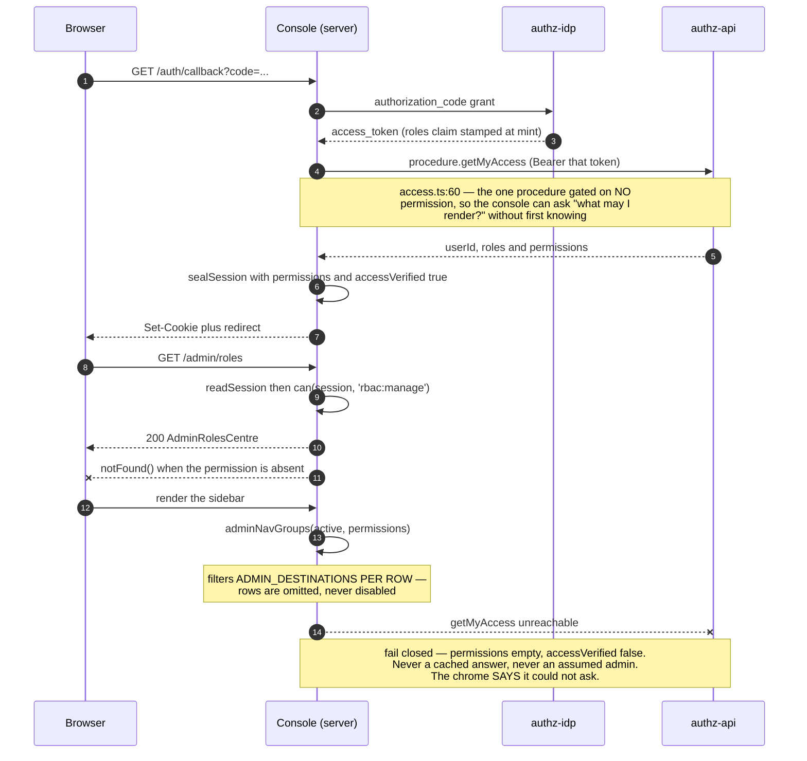
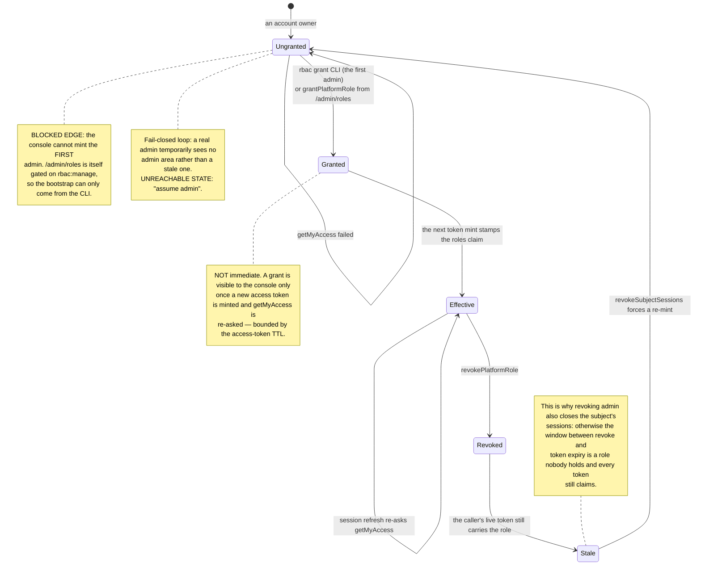

# The admin area — every `/admin/*` screen and its gate

Seven nav destinations plus three drill-downs. Every one is gated on a **permission the backend
computed**, never on a role string. The reasoning is
[ADR 0015](../adr/0015-admin-console-v2-declarative-dashboards-permissions-export.md) D4 and D6, and
the 2026-09-03 amendment in
[ADR 0013](../adr/0013-console-information-architecture-v3.md) that moved the Admin row onto the main
rail.

---

## The destinations

Declared once, in `ADMIN_DESTINATIONS`
(`apps/console/src/client/console-chrome.tsx:503`), in nav order.

| Destination      | Route                     | Permission               | Also                                                               |
| ---------------- | ------------------------- | ------------------------ | ------------------------------------------------------------------ |
| Overview         | `/admin/overview`         | `usage:read-all`         | Eleven `dashboards.yaml` panels, estate-wide                       |
| Usage            | `/admin/usage`            | `usage:read-all`         | Nineteen panels; `?lens=user\|account\|project`; three drill-downs |
| Refills queue    | `/admin/refills-queue`    | `budget:review`          | Carries the pending count — its only honest home                   |
| Refill policies  | `/admin/refill-policies`  | `budget:policy-write`    | `+ /create`, `?edit=`, `?simulate=`                                |
| Budget schedules | `/admin/budget-schedules` | `budget:schedule-manage` | `+ /create`, `?edit=`, `?preview=`, `?delete=`                     |
| Sessions         | `/admin/sessions`         | `session:read`           | The **estate** widening, never the `session:read-own` floor        |
| Roles            | `/admin/roles`            | `rbac:manage`            | One nav home — the settings-rail duplicate is gone                 |

Drill-downs, reachable from `/admin/usage` rather than from the rail:

| Route                                                       | Panels → requests | Shape                                                                                                       |
| ----------------------------------------------------------- | ----------------- | ----------------------------------------------------------------------------------------------------------- |
| `/admin/usage/actors/[actorId]?type=user\|account\|project` | 9 → 5             | `scope: $type`, `scope_id: $actorId`; `type=account` also renders a hand-written "Budget & next reset" zone |
| `/admin/usage/channels/[channelId]`                         | 7 → 6             | An estate query **narrowed by `filters.azp`** — a channel is not a usage scope                              |
| `/admin/usage/chats`                                        | 5 → 4             | Every panel filtered with `operation_in` in **one** query; an Estate \| Chats sub-nav, not a sixth rail row |

`/admin` itself redirects to `adminLandingHref` (`apps/console/src/client/console-chrome.tsx:572`) — the first destination
**this caller** can actually open.

---

## Three properties of that table that matter more than its contents

1. **Rows are omitted, never disabled.** Each route segment answers `notFound()` for the same
   permission set the nav filters on (e.g. `apps/console/src/app/(console)/admin/budget-schedules/page.tsx:32`,
   `apps/console/src/app/(console)/admin/roles/page.tsx:34`, `apps/console/src/app/(console)/admin/sessions/page.tsx:38`). A visible-but-dead row would advertise
   a URL the server denies. `notFound()` rather than `403`: a caller without the permission should
   not learn the route exists.
2. **Admin is not one indivisible thing.** `adminNavGroups` (`apps/console/src/client/console-chrome.tsx:619`) filters **per
   row**. A reviewer holding only `budget:review` sees exactly one row and reaches it, and
   `adminLandingHref` sends them there rather than to a dashboard they would 404 on. The **account
   rail's** "Admin" row appears when the caller holds **any one** of `ADMIN_AREA_PERMISSIONS`
   (`apps/console/src/shared/permissions.ts:106`).
3. **`user:read` is deliberately not an admin-area permission.** It is a supporting read — it
   resolves a name for somebody else's row — never a destination. Holding it alone must not conjure
   an admin area with nothing in it.

One `admin-*-route-gate.test.ts` per segment holds the nav row and the server gate together: both
must name the same permission.

---

## From sign-in to a rendered row

---

## The captions that must survive

Each is a claim about data the platform genuinely does or does not have. Deleting one makes a screen
lie.

- **Budget schedules and refills move the ledger, not the gateway's 429s** — until lightbridge-authz
  Phase 6a/6b. See [`budget-schedules.md`](budget-schedules.md).
- **"Total requests" carries no error rate.** Usage events have no error/status field
  ([lightbridge-authz#597](https://github.com/ADORSYS-GIS/lightbridge-authz/issues/597)).
- **Every "active accounts / active actors" figure counts only actors with usage in the window.** An
  account with zero usage never appears in a usage query at all, so it is not a census of the estate.
- **"Accounts with usage, by plan" does not sum to the estate's account count and prints no total.**
  A plan change mid-month is a real event, so one account can legitimately appear under two plans.
- **Average cost per million tokens renders a dash, not `$0.00`,** when the window carries no token
  counts. An embeddings or image call has none, and "free" would be a fabricated reading.
- **Every panel sets `limit` explicitly**, and a truncated response says so with the number.
- **The estate fan-out on `/settings/overview/usage` is capped and says so.**

---

## Two boards that were dropped as inexpressible

Named here so nobody re-adds them by accident.

- **"New accounts this period"** — a usage query answers "who drew something in this window". It
  cannot see an account that was created and never used, and it cannot see a creation date at all.
- **"Gone quiet"** — the same wall from the other side. An account that stopped is precisely an
  account with **no rows** in the window, and no query over an event table returns the rows that are
  not there.

`derived:activeActors` counts replace both. Restoring either needs a hand-written zone backed by an
account enumeration the platform does not expose
([lightbridge-authz#578](https://github.com/ADORSYS-GIS/lightbridge-authz/issues/578)), not a YAML
panel.

---

## Adding an admin destination

1. Add the row to `ADMIN_DESTINATIONS` (`apps/console/src/client/console-chrome.tsx:503`) with its `labelKey` — a `nav`
   namespace **key**, never a literal: that table feeds the rail **and** the command palette.
2. Add the permission to `PERMISSION` (`apps/console/src/shared/permissions.ts:37`) if it is new, and to
   `ADMIN_AREA_PERMISSIONS` (`apps/console/src/shared/permissions.ts:106`) **only if it is a destination of its own**.
3. Gate the route segment with `readSession` + `can(...)` + `notFound()` — the same shape every other
   segment uses.
4. Add an `admin-<name>-route-gate.test.ts` asserting the row and the gate name the same permission.
5. Add the `nav` keys in `en` **and** `de`.
6. If the screen is a dashboard, it is a `dashboards.yaml` entry — see [`dashboards.md`](dashboards.md),
   not a new container.

---

## Cross-references

- [`sessions-and-access.md`](sessions-and-access.md) — `getMyAccess`, `can()`, fail-closed
- [`authorization-and-permissions.md`](authorization-and-permissions.md) — the full gate table and
  the server-side boundary
- [`dashboards.md`](dashboards.md) — the entries behind `/admin/overview` and `/admin/usage`
- [`budget-schedules.md`](budget-schedules.md) — `/admin/budget-schedules` in detail
- `.claude/skills/console-ui/SKILL.md` — the UI contract these screens are built to
