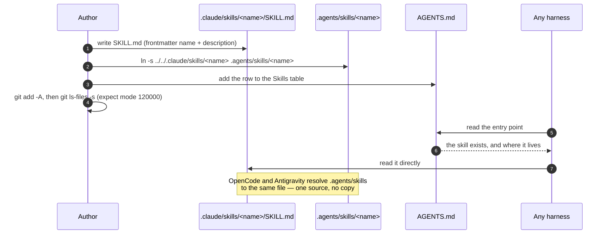
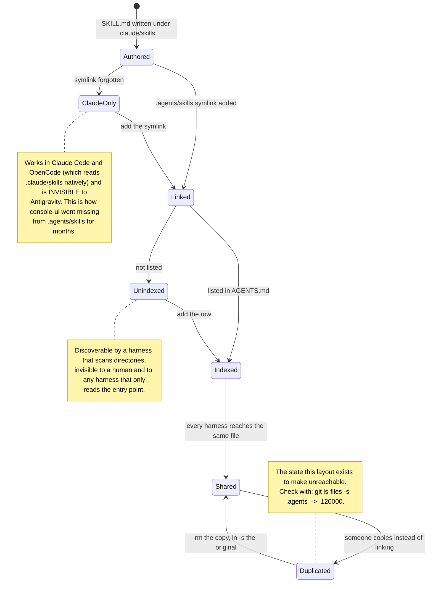

# Agent harnesses — one set of instructions, read by all of them

This repo's agent instructions live in **exactly two places**:

- **`AGENTS.md`** — the single entry point. Standards, architecture, and the index of skills and
  agents.
- **`.claude/skills/<name>/SKILL.md`** and **`.claude/agents/<name>.md`** — task recipes and agent
  roles.

Everything else a harness looks for is a **committed relative symlink** into one of those. Git
stores symlinks natively (mode `120000`), so a clone gets the links, not copies, and there is
nothing to drift.

**This replaced real duplication.** Before this layout, `.agents/skills/*` held byte-identical
copies of seven `.claude/skills/*` — and was already missing `console-ui`, the most important skill
in the repo. `.cursorrules` held 295 lines of generic boilerplate that contradicted `AGENTS.md` on
file naming. Both were generated once by `agentic-config.conf`'s tooling and never updated again.

---

## The link map

| Harness                      | Reads                                                    | In this repo                 |
| ---------------------------- | -------------------------------------------------------- | ---------------------------- |
| **Claude Code**              | `CLAUDE.md`, `.claude/skills`, `.claude/agents`          | the originals                |
| **VS Code / GitHub Copilot** | `.github/copilot-instructions.md`                        | **symlink → `../AGENTS.md`** |
| VS Code / Copilot            | `AGENTS.md` (`chat.useAgentsMdFile`)                     | native                       |
| VS Code / Copilot            | `.claude/CLAUDE.md` (`chat.useClaudeMdFile`)             | native                       |
| **OpenCode**                 | `AGENTS.md` (then `CLAUDE.md`)                           | native                       |
| OpenCode                     | `.claude/skills/*/SKILL.md`, `.agents/skills/*/SKILL.md` | native + **symlinks**        |
| **Antigravity / Gemini**     | `GEMINI.md`                                              | **symlink → `AGENTS.md`**    |
| Antigravity                  | `AGENTS.md`, `.agents/skills`                            | native + **symlinks**        |
| **Cursor**                   | `AGENTS.md`                                              | native                       |
| Cursor (legacy)              | `.cursorrules`                                           | **symlink → `AGENTS.md`**    |
| **Windsurf**                 | `.windsurfrules`                                         | **symlink → `AGENTS.md`**    |
| **Roo Code**                 | `.roo/rules/project-rules.md`                            | **symlink → `AGENTS.md`**    |
| **Kilo Code**                | `.kilocode/rules/project-rules.md`                       | **symlink → `AGENTS.md`**    |

Concretely:

```
.github/copilot-instructions.md   ->  ../AGENTS.md
GEMINI.md                         ->  AGENTS.md
.cursorrules                      ->  AGENTS.md
.windsurfrules                    ->  AGENTS.md
.roo/rules/project-rules.md       ->  ../../AGENTS.md
.kilocode/rules/project-rules.md  ->  ../../AGENTS.md
.agents/skills/<name>             ->  ../../.claude/skills/<name>     (one per skill)
```

`.cursorrules`, `.windsurfrules` and the two `project-rules.md` files were **four copies of the
same 295-line generated boilerplate**, which contradicted `AGENTS.md` on file naming (it prescribed
`PascalCase.ts` for components; this repo is kebab-case everywhere).

Verify at any time:

```sh
git ls-files -s .agents .cursorrules .windsurfrules GEMINI.md \
  .github/copilot-instructions.md .roo/rules .kilocode/rules
#   every row must start with mode 120000
```

---

## What is deliberately NOT symlinked, and why

- **`.cursor/rules/*.mdc`** — Cursor ignores a rules file with no frontmatter, and `.mdc`
  frontmatter (`description`, `globs`, `alwaysApply`) is not something `AGENTS.md` can carry.
  Cursor reads `AGENTS.md` natively, so a link would add a broken file for no gain.
- **`.github/instructions/*.instructions.md`** — same problem: these need an `applyTo` glob in
  frontmatter. Copilot already gets `AGENTS.md` through `copilot-instructions.md`.
- **`.opencode/agents/*.md`** — OpenCode's agent frontmatter is a different schema (`description`,
  `mode`, `model`, `permission`) from Claude's (`name`, `description`, `model`). A symlinked
  `model: sonnet` is not an OpenCode model id, so the link would produce a **broken** agent rather
  than a shared one. `AGENTS.md` lists the agents and their paths instead, and any harness can read
  `.claude/agents/*.md` on request.

Skills are different, and that is why they _are_ linked: `SKILL.md` frontmatter is
`name` + `description` in every harness that supports skills.

---

## Windows

Git stores a symlink as a blob containing the target path, with mode `120000`. On Windows, whether
the working tree materialises a real symlink depends on `core.symlinks` (and on Developer Mode or an
elevated shell). With `core.symlinks=false`, git checks out a **plain text file containing the target
path** — the harness reads a one-line file, not the instructions.

If you develop on Windows:

```sh
git config core.symlinks true      # then re-checkout: git checkout -- .
```

The repository content is correct either way; only the working-tree materialisation differs.

---

## Adding a skill or an agent





**Never copy a skill file to make it visible somewhere. Link it.**

---

## `agentic-config.conf`

A one-shot generator config (`Generated: 2026-03-30`) that produced the original `.cursorrules`,
`.github/copilot-instructions.md` and `.agents/skills/*` copies. It is **not** a live sync. If that
generator is ever re-run it will replace these symlinks with files again — re-link them and check
`git ls-files -s` before committing.

The `ai-governance` stanza in `AGENTS.md` (between its `BEGIN`/`END` markers) is separately managed
by `ADORSYS-GIS/ai-governance`. Because `copilot-instructions.md` now points at `AGENTS.md`, a sync
that rewrites the stanza writes it where it belongs — but confirm the file is still a symlink
afterwards.

---

## Cross-references

- [`../../AGENTS.md`](../../AGENTS.md) — the entry point itself
- [`architecture-conventions.md`](architecture-conventions.md)
- [`coding-conventions.md`](coding-conventions.md)
