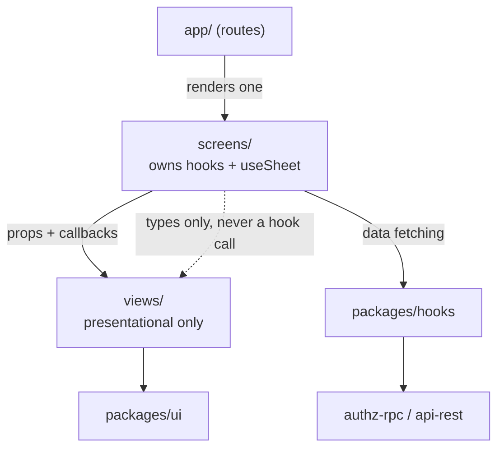
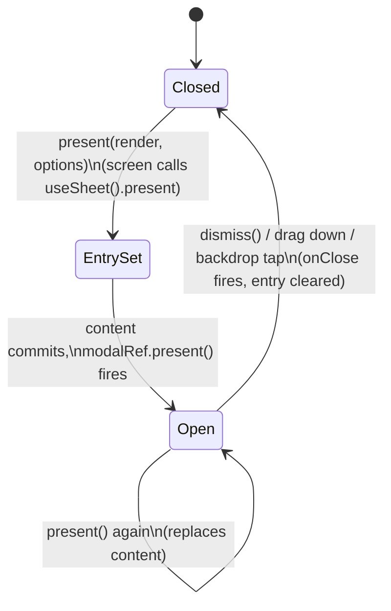
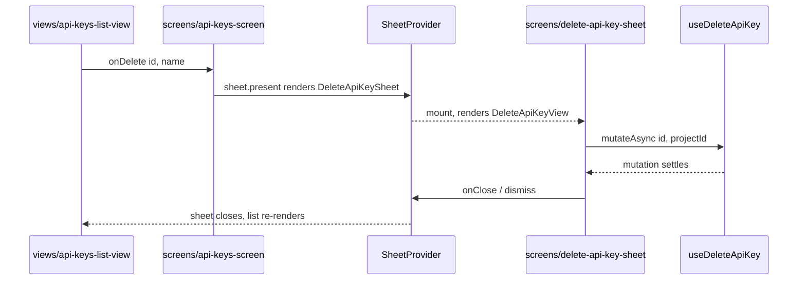

# Architecture Conventions

> Source of truth: `AGENTS.md`
> Supplemented by: codebase structure inspection

This document is a condensed set of **strict rules** for agents working on this repository. Deviations from these rules should be treated as bugs.

---

## Monorepo Structure

The repository is a **pnpm monorepo** with two top-level source directories:

```
converse-frontends/
├── apps/             # Deployable applications
│   └── self-service/ # The LightBridge self-service web/mobile app
├── packages/         # Shared libraries consumed by apps
│   ├── authz-rpc/    # Generated cratestack RPC client for accounts/projects/api-keys
│   │                 # (do not hand-edit packages/authz-rpc/generated/ — codegen output)
│   ├── api-rest/     # Generated REST client for the Usage API only (do not hand-edit).
│   │                 # Currently unused — nothing imports it; see architecture.md.
│   ├── api-native/   # Native API client utilities
│   ├── hooks/        # Shared React hooks (auth, usage, projects, etc.)
│   ├── i18n/         # Internationalisation resources
│   └── ui/           # Shared design-system components
├── openapi/          # OpenAPI spec for the Usage API only
│   └── usage.backend.yaml
└── docs/
    └── knowledge/    # Agent-readable knowledge base (this directory)
```

The AuthZ API (accounts/projects/api-keys) has no OpenAPI spec — it's schema-first cratestack RPC.
Its source of truth is `packages/authz-rpc/schema/authz.cstack` (copied from the backend repo),
turned into the generated client under `packages/authz-rpc/generated/` by the official
`cratestack generate-typescript` CLI, which ships as the `@cratestack/cli` npm package (a thin
wrapper whose postinstall downloads the matching Rust binary from GitHub Releases).
`generated/` is gitignored, same as every other package's codegen output (e.g. `api-rest`'s
`src/client/`) — it's a build artifact, not source.

`@cratestack/cli` is a `devDependency` of `packages/authz-rpc`, and that package's codegen
script is named plain `codegen`, so the repo-root `postinstall` → `codegen:all` chain picks it
up: a bare `pnpm install` regenerates it, locally and in CI alike, with no separately installed
tooling. (Its postinstall is allowlisted under `allowBuilds` in `pnpm-workspace.yaml`; pnpm
does not run dependency build scripts otherwise.) Regenerate it by hand with
`pnpm --filter @lightbridge/authz-rpc run codegen`.

`codegen` (both this package's and `api-rest`'s) is also a Turbo task (`turbo.json`), and
`build:web`/`build-storybook` declare it as a `dependsOn`. `pnpm build`/`pnpm build-storybook`
therefore regenerate both clients from cache whenever their real inputs — schema/OpenAPI spec,
or the generator's own pinned version via the lockfile — are unchanged, and only pay the
generation cost again when one of those actually changes. `packages/api-rest/turbo.json`
overrides that package's `codegen` inputs to add `openapi/usage.backend.yaml`, which lives
outside the package directory and so isn't covered by Turbo's default per-package file hashing.
This is a cache for repeated `turbo run` invocations on top of the `postinstall` path above, not
a replacement for it — `pnpm install` still always regenerates unconditionally.

The CLI is pinned to an **exact** version (`0.7.16`) that must stay in lockstep with
lightbridge-authz's deployed `cratestack`/`cratestack-pg` version — see
`packages/authz-rpc/README.md` for the incident that makes this non-negotiable.

Since `cratestack-cli` 0.4.14 (issue #182), the generated runtime accepts a composable
`links?: RpcLink[]` interceptor chain, threaded through as `AuthzRpcRuntimeOptions.links`
(`packages/authz-rpc/src/runtime.ts`). `@cratestack/api`'s `createBatchLink()` plugs into it —
an automatic scheduler that collapses concurrent unary calls into one `POST /rpc/batch` request —
and is exercised in `packages/authz-rpc/src/runtime.test.ts`. **Corrected from an earlier version
of this doc, which said this was not wired into the app root:** it now is —
`apps/self-service/src/app/_layout.tsx` constructs `authzBatchLink = createBatchLink()` at module
scope (not per-render — the file's own comment explains this avoids constructing a fresh batcher on
every render) and passes `links: [authzBatchLink]` into `useAuthzRpcClient(...)`. The tracking
issues ([converse-frontends#120](https://github.com/ADORSYS-GIS/converse-frontends/issues/120),
[lightbridge-authz#157](https://github.com/ADORSYS-GIS/lightbridge-authz/issues/157)) describe the
work that made this possible; the code now reflects it landed.

**Rule:** Never place application-specific business logic in `packages/`. Packages export reusable, app-agnostic code only.

---

## Application Layering

Within `apps/self-service/src/`, follow this strict layering. **Corrected from an earlier version
of this table:** views do not call hooks for data. Screens do. This was verified by reading every
current `views/*.tsx` file's imports — see the note under the table.

| Layer          | Directory                                                                        | Responsibility                                                                                                                    |
| -------------- | -------------------------------------------------------------------------------- | --------------------------------------------------------------------------------------------------------------------------------- |
| **Routes**     | `src/app/`                                                                       | Expo Router file-based routes. Thin — only renders the corresponding Screen.                                                      |
| **Screens**    | `src/screens/`                                                                   | Owns data fetching (calls `packages/hooks`) and, where relevant, imperative sheet presentation (`useSheet`). Passes data and callbacks down to Views as props. Sheet-content components (`*-sheet.tsx`) live here too — they're screen-owned, not view-owned. |
| **Views**      | `src/views/`                                                                     | Pure presentational components. Render UI from props only. May import **types** from `@lightbridge/hooks` (or its dependency-free subpaths, e.g. `@lightbridge/hooks/budget-tiers`) but never call a data-fetching hook. Must not import `@lightbridge/ui/sheet`. |
| **Hooks**      | `packages/hooks/`                                                                | All data fetching, state management, and business logic. No JSX.                                                                  |
| **API Client** | `packages/authz-rpc/` (accounts/projects/api-keys), `packages/api-rest/` (usage — currently unused, see `architecture.md`) | Auto-generated. Never edit by hand — `packages/authz-rpc/generated/` and `packages/api-rest/src/client/` are both codegen output. |

**Dependency direction:** Routes → Screens → { Views (props only), Hooks (data), Sheet system (screens only) } → API Client



Every `views/*.tsx` file was grepped for `@lightbridge/hooks` imports (2026-08-15): all matches are
either `import type { ... }` or the pure, non-fetching `@lightbridge/hooks/budget-tiers` subpath
(e.g. `formatMicroUsd` — see `apps/self-service/src/views/settings/budget-refill-view.tsx`, which
has a comment explaining it imports that subpath specifically to avoid pulling in the full
`@lightbridge/hooks` barrel and its `@lightbridge/authz-rpc`/`cborg` transitive chain, which Jest's
resolver can't follow). Zero views call an actual data-fetching hook (`useQuery`, `useApiKeys`,
etc.) — every one of those calls lives in a screen. `apps/self-service/src/screens/api-key-create-screen.tsx`
is representative: it calls `useCreateApiKey`/`useEnsureDefaultAccount`/`useEnsureDefaultProject`/
`usePermissions` directly and passes the results as props to the purely presentational
`views/api-key-create-view.tsx`, which imports nothing from `@lightbridge/hooks` at all.

**Example chain for the Usage feature (Grafana embed, not REST):**

```
app/(tabs)/usage.tsx          → renders <UsageScreen />
screens/usage-screen.tsx      → reads useRuntimeConfig().usage, builds the dashboard URL
views/usage-view.tsx          → presentational: receives embedUrl + onOpenExternal as props
views/usage-dashboard-embed.web.tsx → renders an <iframe src={embedUrl}>
```

This replaces the previous REST-based example (`packages/hooks/src/usage.ts` calling
`queryUsage()`) — that file no longer exists in the tree. See `architecture.md`'s Usage flow for
the full picture, including why `packages/api-rest` is currently unused.

**Example chain for the API Keys feature (cratestack RPC):**

```
app/api-keys/new.tsx                → renders <ApiKeyCreateScreen />
screens/api-key-create-screen.tsx   → calls useCreateApiKey(), passes result to the view
views/api-key-create-view.tsx       → presentational only; renders UI from props
packages/hooks/src/api-keys.ts      → calls client.procedures.createApiKey({ args })
packages/authz-rpc/                 → generated RPC client (POST /rpc/procedure.createApiKey)
```

---

## Two Load-Bearing Package Contracts

These two rules aren't spelled out anywhere else in the docs, but breaking either one has already
caused a real regression (see the second contract). Both exist for the same underlying reason:
`views/` and `packages/ui` must be renderable in isolation, synchronously, with no provider tree —
that's what makes them unit-testable standalone and reusable without dragging in the rest of the
app.

### `packages/ui` has zero i18n coupling and no data fetching

Verified 2026-08-15 by reading `packages/ui/package.json` (no `i18next`/`react-i18next`, no
`@tanstack/*`, no `axios` in `dependencies` or `devDependencies`) and by grepping
`packages/ui/src` for `i18n`/`useTranslation`/`fetch(`/`axios`/`useQuery`: the only hits are code
comments *about* the rule, not violations of it, e.g.:

- `packages/ui/src/components/picker/component.tsx:22` — "Fetches no data and owns no i18n: every
  string is a prop."
- `packages/ui/src/components/confirm-dialog/component.tsx:41` — a fallback string "stays app-owned
  since it's tied to i18n'd fallback copy."

**Rule:** every user-visible string in `packages/ui` is a prop. The package never imports
`react-i18next` and never calls `fetch`/`axios`/`useQuery` itself. This is what lets design-system
work (adding a component, restyling a token) and feature work (wiring a screen to a real endpoint)
proceed in parallel without both branches touching `packages/i18n`'s shared translation file.

### `views/` must not import the sheet system; only `screens/` may

`@lightbridge/ui/sheet` (the only way to reach `SheetProvider`/`useSheet`/`Sheet`) is a separate
export subpath, deliberately **not** re-exported from `packages/ui`'s main barrel — see the
`NOTE` comment at `packages/ui/src/index.ts:85`. Importing it pulls in `@gorhom/bottom-sheet` →
`react-native-reanimated` → `react-native-worklets`: real native modules that need a running app
runtime (`GestureHandlerRootView`, `SheetProvider`) to initialize. `views/` are unit-tested by
rendering the component standalone with no such ancestor — a view that calls `useSheet()` crashes
Jest with a `WorkletsError` (worklets never initialized) rather than a clean assertion failure.

Verified 2026-08-15: grepping every file under `apps/self-service/src/screens` and
`apps/self-service/src/views` for `useSheet`/`@lightbridge/ui/sheet` finds ten screen-layer hits
(`delete-api-key-sheet.tsx`, `create-project-sheet.tsx`, `rotate-api-key-sheet.tsx`,
`revoke-api-key-sheet.tsx`, `delete-account-sheet.tsx`, `delete-project-sheet.tsx`,
`account-settings-screen.tsx`, `project-settings-screen.tsx`, `api-keys-screen.tsx`,
`api-key-settings-screen.tsx`) and **zero** in `views/`.

The entity-picker feature (see `architecture.md`) is the clearest worked example of the boundary in
practice:

- `apps/self-service/src/components/entity-picker-field.tsx` — used directly by three `views/`
  modules — has "no Sheet/reanimated dependency on purpose" (its own doc comment) and takes a plain
  `onOpenPicker: () => void` prop.
- `apps/self-service/src/hooks/use-picker-sheet.tsx` — the thing that actually calls `useSheet()` —
  is deliberately **screen-only**, per its own doc comment: "`EntityPickerField` (the view-facing
  half of this feature) only ever receives a plain `onOpenPicker: () => void` callback; it has no
  idea a sheet exists."

**Rule:** if a component needs to open a sheet, the `useSheet()`/`sheet.present(...)` call goes in
`screens/` (either the screen itself or a co-located hook like `use-picker-sheet.tsx`). The
`views/` component underneath takes a plain callback prop and stays ignorant that a sheet exists.

---

## The Imperative Sheet System

`SheetProvider` (`packages/ui/src/components/sheet/provider.tsx`) is mounted once at the app root —
`AppSheetProvider` (`apps/self-service/src/navigation/app-sheet-provider.tsx`), inside
`GestureHandlerRootView` in `apps/self-service/src/app/_layout.tsx` — and hosts a single reusable
`@gorhom/bottom-sheet` `BottomSheetModal`. Any screen can then call `useSheet().present(render, options)`
to show arbitrary content as a bottom sheet **without adding a route** — no new file under `app/`,
no URL change. `present()` replaces whatever sheet is currently open; only one shows at a time.



The two-step `Closed → EntrySet → Open` transition (`packages/ui/src/components/sheet/provider.tsx`)
is deliberate: `present()` sets React state synchronously, and only a `useEffect` that runs *after*
that content commits calls `modalRef.current.present()` — so the sheet's first animated frame
already has its body measured for dynamic sizing, instead of animating open on an empty sheet.

### Sequence: a screen-owned mutation sheet (Delete API key)

This is representative of every create/delete/rotate/revoke sheet in the app — only the mutation
hook and the presentational view change.



### Sheet inventory

Every current use of `useSheet().present(...)` in the app, and the screen that owns it (verified by
grepping `apps/self-service/src/screens` for `sheet.present(` / `openPicker(`):

| Action                    | Owning screen                                    | Sheet content component                         |
| ------------------------- | -------------------------------------------------- | -------------------------------------------------- |
| Create project             | `screens/project-settings-screen.tsx`              | `screens/create-project-sheet.tsx`                  |
| Delete project             | `screens/project-settings-screen.tsx`              | `screens/delete-project-sheet.tsx`                  |
| Delete account             | `screens/account-settings-screen.tsx`              | `screens/delete-account-sheet.tsx`                  |
| Delete API key             | `screens/api-keys-screen.tsx`                      | `screens/delete-api-key-sheet.tsx`                  |
| Rotate API key             | `screens/api-keys-screen.tsx`                      | `screens/rotate-api-key-sheet.tsx`                  |
| Revoke API key             | `screens/api-keys-screen.tsx`                      | `screens/revoke-api-key-sheet.tsx`                  |
| API key detail actions     | `screens/api-key-settings-screen.tsx`              | (inline `sheet.present(({dismiss}) => ...)`, no separate file) |
| Account/project entity picker | `screens/api-keys-screen.tsx`, `screens/account-settings-screen.tsx`, `screens/project-settings-screen.tsx` (via `usePickerSheet()`) | `PickerList` (`packages/ui/src/components/picker`) |

Notably, **creating an API key is not a sheet** — it navigates to a dedicated route
(`app/api-keys/new.tsx` → `ApiKeyCreateScreen`) instead, because the create form is a focused,
full-page flow (name entry → one-time secret display) rather than a quick in-context action. Every
other lifecycle action (delete/rotate/revoke, project/account creation and deletion, entity
selection) uses a sheet.

---

## UI Rules

All UI must use the shared design system from `packages/ui/`. These rules are **non-negotiable**:

1. **Use `cva` (Class Variance Authority) + `cn` for all styling.** Do not write raw `className` strings outside of `cva`/`cn` calls.
2. **Only use design tokens** from the theme — never hardcode color values, font sizes, or spacing.
3. **Component primitives** (`Text`, `Stack`, `ScreenShell`, etc.) come from `@lightbridge/ui`. Use them; do not re-implement.

---

## Internationalisation (i18n)

All user-visible strings must go through the i18n system:

```typescript
import { useTranslation } from 'react-i18next';

const { t } = useTranslation();
// ✅ Correct
<Text>{t('usage.title')}</Text>

// ❌ Wrong — hardcoded text
<Text>Usage</Text>
```

**Rule:** No hardcoded text strings in any component. All copy lives in translation files in `packages/i18n/`.

---

## Naming Conventions

| Subject                      | Convention                          | Example                               |
| ---------------------------- | ----------------------------------- | ------------------------------------- |
| Files (modules, components)  | `kebab-case`                        | `usage-view.tsx`, `auth-storage.ts`   |
| Variables / functions        | `camelCase`                         | `useApiKeys`, `loadStoredSession`     |
| Types / Interfaces / Classes | `PascalCase`                        | `AuthSession`, `UsageQueryParams`     |
| True constants               | `SCREAMING_SNAKE_CASE`              | `STORAGE_KEY`, `WEB_DB_NAME`          |
| Interface names              | No `I` prefix                       | `UserService`, **not** `IUserService` |
| Boolean variables            | `is`, `has`, `should`, `can` prefix | `isAuthenticated`, `isLoading`        |

**Do not use `_` to denote private members.** Use native JS private fields (`#`) in classes.

---

## TypeScript Rules

- `strict: true` must be enabled. Never disable per-file.
- Do not use `any`. Use `unknown` + type guards.
- Do not use non-null assertions (`!`). Use optional chaining (`?.`) and nullish coalescing (`??`).
- Do not use `@ts-ignore`. Use `@ts-expect-error` with a comment explaining why.
- Prefer `interface` for extensible object shapes; `type` for unions, intersections, and mapped types.

---

## Import Order

Imports must be ordered as follows, separated by blank lines:

1. Node built-ins
2. External packages (`react`, `expo-*`, `@tanstack/*`, etc.)
3. Internal package aliases (`@lightbridge/*`)
4. Relative imports (`./`, `../`)

Use **named exports** over default exports everywhere possible.

---

## React Patterns

- **Functional components only.** No class components.
- Custom hooks must start with `use` and handle **one concern**.
- Do not call hooks conditionally or inside loops.
- Do not make API calls directly inside `useEffect`. Use `@tanstack/react-query` (`useQuery`).
- Use **TanStack Query** for all server state. Never store API responses in global state (Zustand, Context).
- Avoid prop drilling beyond 2 levels — extract a context or use composition.

---

## Existing Usage Feature

**File:** `apps/self-service/src/app/(tabs)/usage.tsx`

**Current state, verified 2026-08-15 — rewritten since an earlier version of this doc, which
described a "coming soon" placeholder and a `useQueryUsage` hook that no longer exist:**

The route delegates to `UsageScreen` → `UsageView` → `UsageDashboardEmbed`, and the feature is
fully implemented — it embeds an external Grafana dashboard rather than fetching usage data through
`packages/hooks`. See `architecture.md`'s "Usage flow" for the full walkthrough
(`useRuntimeConfig().usage` → `buildUsageDashboardUrl()` → `<iframe>` on web / "open in Grafana" on
native). There is no `packages/hooks/src/usage.ts` and no `useQueryUsage`/`useTokenUsage` in the
current tree — do not reintroduce those names without first checking whether this feature has since
moved back to an in-app query pipeline.

---

## Error Handling Rules

- Use typed/structured errors (custom `Error` subclasses with a `code` property).
- Never swallow exceptions silently (no empty catch blocks without at minimum a comment).
- Catch variables must be typed as `unknown` and narrowed before use.
- Always `await` or `.catch()` promises — never floating promises.

---

## Testing

**Corrected from an earlier version of this doc, which named Playwright:** there is no Playwright
dependency or config anywhere in this repo (verified 2026-08-15 by grepping every `package.json`
and searching for `playwright.config.*`). The actual, verified stack is:

- `apps/self-service`: **Jest** + `jest-expo` + `@testing-library/react-native` (`pnpm --filter self-service test`). Screens and views are rendered standalone, per the layering rules above.
- `packages/hooks`, `packages/authz-rpc`: **Vitest** (`test` script is `vitest run` in both).
- `packages/ui`: no unit-test script; Storybook (`@storybook/react-native-web-vite`, `addon-a11y`) covers visual/interaction review instead.
- No end-to-end test framework is present in this repo at all — there is no `e2e/` directory and no `*.spec.ts` Playwright/Cypress suite.

Rules that still hold regardless of runner:

- Unit tests: fast, isolated, no I/O, no network.
- Integration tests: use real component interactions via dedicated test infrastructure.
- 80%+ line coverage target on business logic; 100% on critical paths (auth, payment, validation).
- Test files follow **AAA pattern** (Arrange / Act / Assert).
