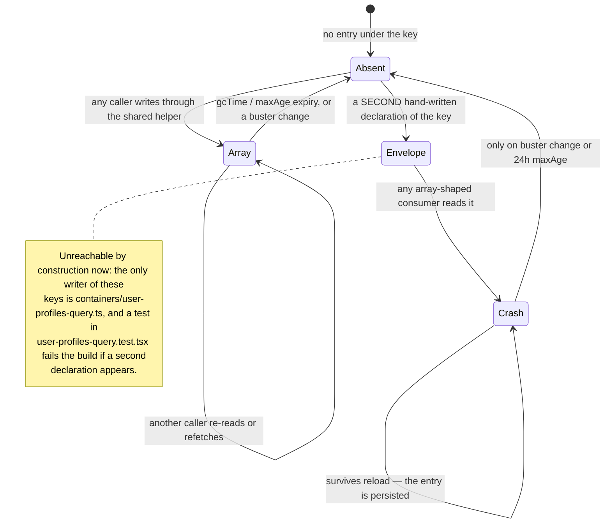

# Architecture Conventions

> Verified against `main@c9b4aa6` (2026-08-31). Source of truth for anything this file summarises:
> `AGENTS.md`, the `console-ui` skill, and each app's own README.
>
> These are the rules that apply **repo-wide**. Rules that belong to one surface (console screens,
> the authz-ui CSP posture) live with that surface and are linked, not copied — copying them here is
> what turned the previous version of this document into a description of a deleted Expo app.

---

## Monorepo structure

```
converse-frontends/
├── apps/
│   ├── console/           # Next.js 16 App Router console (server runtime, OIDC, proxy legs)
│   ├── authz-ui/          # Vite static SPA — authz-idp's human plane, served under /ui
│   └── governance-auth/   # Vite static page — loopback OAuth2 callback embedded into lightbridge-governance
├── packages/
│   ├── ui-web/        # Design system + screen sections + the single theme pipeline
│   ├── chart-core/    # DOM-free chart math consumed by ui-web
│   ├── authz-rpc/     # Generated cratestack RPC client   (generated/ is codegen output)
│   ├── api-rest/      # Generated OpenAPI client          (src/client/ is codegen output)
│   ├── hooks/         # ⚠ mostly Expo-era; only two dependency-free subpaths are live
│   ├── i18n/          # ⚠ no application consumer today
│   └── api-native/    # ⚠ orphaned Expo wrappers
├── openapi/           # usage.backend.yaml — input to packages/api-rest's codegen
├── charts/            # converse-console (live) · converse-frontend (legacy, deleted app)
└── docs/
    ├── adr/           # Accepted decisions — 0007-0013 govern the console
    └── knowledge/     # This knowledge base
```

See `architecture.md` for the dependency graph and the residue notes behind the ⚠ markers.

**Rule: never put application-specific business logic in `packages/`.** Packages export reusable,
app-agnostic code. A rule that only makes sense for one app belongs in that app.

**Rule: never hand-edit generated clients.** `packages/authz-rpc/generated/` and
`packages/api-rest/src/client/` are codegen output, regenerated by `pnpm install`'s `postinstall`
→ `codegen:all` chain and as a Turbo `codegen` task. Change the schema or the OpenAPI spec instead.
Mechanics and the lockstep version pin: `rpc-and-codegen.md`.

---

## Layering

There is no single layering table any more, because the apps are different kinds of program.
Each owns its own, and each is documented where it is enforced:

| App                    | Shape                                                                                                                                                                                                                                   | Authoritative source                   |
| ---------------------- | --------------------------------------------------------------------------------------------------------------------------------------------------------------------------------------------------------------------------------------- | -------------------------------------- |
| `apps/console`         | Route (App Router) → container (data/orchestration, refine hooks) → section (presentational, from `ui-web`). Server-only code lives in `src/server/` and never reaches the client bundle                                                | `AGENTS.md` §2, the `console-ui` skill |
| `apps/authz-ui`        | Route component → section (presentational, from `ui-web`). No data layer; native form posts and one cookie-bound fetch. The route set is declared once in `src/routes/route-table.ts` and published to the server as `dist/routes.json` | `apps/authz-ui/README.md`              |
| `apps/governance-auth` | One page → composed only of `ui-web` sections. No router, no data layer, no i18n. The build emits exactly one self-contained `index.html` that `lightbridge-governance` embeds at compile time                                          | `apps/governance-auth/README.md`       |

What holds for **both**, and is the load-bearing part:

- **`packages/ui-web` exports sections and components, never full pages.** Sections are
  presentational: data in through typed props, events out through callbacks. They do not fetch, do
  not route, and do not read URL state. This is what lets them be rendered standalone in Storybook
  and in unit tests with no provider tree.
- **Full-page compositions exist in exactly two places**: Storybook page stories
  (`packages/ui-web/src/pages-stories/`) and the consuming app's own routes.
- **The shell mounts once**, in the console's persistent layout. Navigating must not remount it.
- **A dashboard page is DECLARED, not written** (ADR 0015 D1). The route → container → section
  layering above is the rule for every screen that is _not_ a dashboard. A usage/spend dashboard is
  an entry in `apps/console/dashboards.yaml` plus a thin route file: the container holds only what a
  page owns and a panel cannot (its window, its lens, its URL knobs) and calls
  `useDashboard(route)`. There are **zero** hand-written dashboard containers left, a ratchet keeps
  it that way, and adding a panel is adding YAML. Adding a panel _type_ is a renderer plus a
  Storybook story in `packages/ui-web`, never an inline branch in a page. See
  `apps/console/README.md` § "Declarative dashboards".
- **The console never re-derives authorization** (ADR 0015 D4). Gates read the permission set
  `procedure.getMyAccess` resolved server-side, never a role string off the token claim. There is no
  role → permission map in the console and no `isAdmin`; a ratchet
  (`apps/console/src/no-role-derived-gates.test.ts`) fails the build if one returns. See
  `authorization-and-permissions.md`.

---

## UI rules

`packages/ui-web` and `apps/console` are governed by the **`console-ui` skill**
(`.claude/skills/console-ui/SKILL.md`) — the token sheet, the primitive stack (daisyUI 5 · Base UI ·
cmdk · Floating UI), the two-theme model, type roles, chart and analytics doctrine, empty/loading/
error states, and an explicit "never do" list. Read it before touching either. It is more specific
than this file and it wins.

Three rules from it that are repo-wide enough to restate:

1. **Semantic tokens only.** Write `bg-surface text-soft border-border`; never a hex value, never a
   `dark:` variant (colour is driven by `data-theme`, which a `dark:` class cannot follow). The one
   file allowed to contain colour literals is `packages/ui-web/src/theme.css`.
2. **No `tailwind.config.js`.** Tailwind v4 is CSS-first; configuration lives in `theme.css`.
3. **`apps/authz-ui` is a stricter surface than the console.** `authz-idp` serves it under
   `default-src 'self'; frame-ancestors 'none'` with no `data:` allowance, so daisyUI component
   classes — and every `ui-web` component that renders one — are **banned** there; it uses the
   CSP-safe section set instead. Five gates enforce the CSP rule and a sixth covers the routes
   contract. See `apps/authz-ui/README.md` and the skill's authz-ui section. (`apps/governance-auth`
   is the opposite edge of the same spectrum: nothing serves it, so it has **no CSP** and may inline
   its theme script — see its README.)

---

## Internationalisation — read this before adding `t()`

**Superseded 2026-09-03 by [ADR 0017](../adr/0017-i18n-app-router-i18next.md).** This section used
to say that no application used i18n and that adding `t()` would half-adopt something nobody had
decided. That is no longer true, and `packages/i18n` no longer exists (ADR 0017 D7 deleted it with
the Expo app it served).

What now holds:

- **`apps/console` is translated — English and German.** Copy lives in
  `apps/console/locales/<locale>/<namespace>.json`, resolved per request on the server and
  synchronously on the client. Use `t()`; do not add a literal.
- **`packages/ui-web` owns no translations, and never calls `t()`.** Copy arrives as a **prop**, or
  through **`useCopy()`** for the handful of strings baked into a primitive's own behaviour, each
  with an English default. There is deliberately no third path.
- **`apps/authz-ui` and `apps/governance-auth` remain untranslated**, and consume `ui-web` with no
  i18n runtime — which is exactly why `ui-web` cannot hold one.
- A **ratchet** (`apps/console/src/i18n-hardcoded-copy.test.ts`) pins the number of remaining
  hard-coded console strings: it may fall freely, and raising it fails the build.

The how-to — adding a string, adding a language, the parity test — is
[`i18n.md`](i18n.md) and the `i18n-copy` skill.

---

## Testing

**Vitest everywhere.** There is no Jest and no Playwright in this repository — no `e2e/` directory,
no `*.spec.ts` browser suite, no Playwright config or dependency. (Both claims appeared in earlier
versions of these docs; both were false.)

| Surface                | Runner                                                                | Notes                                                                                                               |
| ---------------------- | --------------------------------------------------------------------- | ------------------------------------------------------------------------------------------------------------------- |
| `apps/console`         | Vitest, two projects: `node` (`*.test.ts`) and `jsdom` (`*.test.tsx`) | Both set their own `testTimeout` — a root-level timeout is not inherited                                            |
| `apps/authz-ui`        | Vitest (jsdom)                                                        | Plus three build-time verifier scripts chained into `build:web`                                                     |
| `apps/governance-auth` | Vitest (jsdom)                                                        | Plus `scripts/verify-single-file.mjs`, which fails the build if the output stops being one self-contained HTML file |
| `packages/*`           | Vitest                                                                | `ui-web` additionally treats Storybook stories as the acceptance surface                                            |

Conventions:

- **Tests are colocated**: `component.test.tsx` beside `component.tsx`. No `__tests__/` directories.
- **AAA** — Arrange, Act, Assert.
- **A test written after the fix, that passes, has shown nothing.** Break the code, watch the test
  fail for the predicted reason, restore it. Say so in the PR.
- Unit tests do no I/O and no network.
- `packages/ui-web` carries mechanical ratchets (`class-budget`, `base-ui-adoption`,
  `section-class-audit`, `csp-safe-sections`). They may only get stricter; an entry added to a
  known-gaps list is debt, not a fix.

---

## Naming conventions

| Subject                      | Convention                             | Example                                 |
| ---------------------------- | -------------------------------------- | --------------------------------------- |
| Files (modules, components)  | `kebab-case`                           | `spend-dashboard.tsx`, `route-table.ts` |
| Variables / functions        | `camelCase`                            | `useConsoleTheme`, `sanitiseUserCode`   |
| Types / interfaces / classes | `PascalCase`                           | `SessionResponse`, `RoutePath`          |
| True constants               | `SCREAMING_SNAKE_CASE`                 | `ROUTER_BASENAME`, `PAGE_TITLE_CLASS`   |
| Interfaces                   | no `I` prefix                          | `UserService`, **not** `IUserService`   |
| Booleans                     | `is` / `has` / `should` / `can` prefix | `isAuthenticated`, `hasNextPage`        |
| React components             | `PascalCase`                           | `DeviceCodeEntry`                       |

Do not use `_` to denote private members; use native `#` private fields in classes.

---

## TypeScript rules

- `strict: true`. Never disabled per-file.
- No `any` — use `unknown` plus a type guard.
- No non-null assertions (`!`). Use `?.` and `??`, or a guard that fails loudly.
- No `@ts-ignore`. Use `@ts-expect-error` with a comment saying why.
- `interface` for extensible object shapes; `type` for unions, intersections, mapped types.
- Props are typed and exported from the component's own `types.ts` in `ui-web`.

---

## Import order

Separated by blank lines:

1. Node built-ins
2. External packages (`react`, `next`, `@tanstack/*`, …)
3. Workspace packages (`@lightbridge/*`)
4. Relative imports (`./`, `../`)

Prefer **named exports**. Note that `apps/console` and `apps/authz-ui` import `ui-web` through deep
subpaths (`@lightbridge/ui-web/src/components/<name>`) as well as the barrel — deliberately, to keep
the barrel's chart/`cmdk` re-exports out of bundles that never render them (`apps/governance-auth`
composes only `ui-web` sections the same way). That mapping is duplicated in three places per app
(`tsconfig` paths, Vite/Next resolution, and the Vitest alias); if you add a resolution mode, add it
in all three.

---

## React patterns

- Functional components only.
- Custom hooks start with `use` and own **one** concern.
- No conditional hook calls, no hooks in loops.
- Server state goes through TanStack Query / refine — never into a hand-rolled global store.
- In `apps/console`, **view state lives in the URL** (nuqs; ADR 0011), and the account is a path
  segment (ADR 0013). `useState` in view code is a defect unless it is one of the sanctioned
  exceptions — hover/focus, pre-submit form drafts, animation/measurement — each carrying a one-line
  justification comment.
- `packages/ui-web` never imports nuqs: components stay controlled so the app owns their state.

---

## A query key and its payload are declared together

**A TanStack query key is a shared address, not a local label.** Two hooks that build the same key
share one cache entry, and a disabled `useQuery` still reads whatever already sits under its key —
so two hooks that build the same key and disagree on the payload shape produce a crash in whichever
one reads second, on whichever route mounts it.

That is not hypothetical. On 2026-09-03 three console hooks each declared their own
`['authz', 'resolveUserProfiles']` prefix over the same sorted id list: two cached the unwrapped
`UserProfile[]`, one cached the `{ profiles: [...] }` envelope. The console shell mounts the refills
queue on **every** route, so one visit to `/admin/roles` made `data.map is not a function` the first
thing every page did.

```mermaid
sequenceDiagram
    autonumber
    participant Roles as /admin/roles hook
    participant QC as QueryClient cache
    participant Shell as console shell (every route)
    participant IDB as IndexedDB persister

    Roles->>QC: fetch key ['authz','resolveUserProfiles', ids]
    QC-->>Roles: writes whatever queryFn returned
    QC->>IDB: persistClient(buster = QUERY_CACHE_BUSTER)
    Note over Shell: navigates anywhere — the shell remounts nothing,<br/>but re-reads the SAME key
    Shell->>QC: getQueryData(same key)
    QC-->>Shell: the entry Roles wrote
    alt one declaration (containers/user-profiles-query.ts)
        Shell->>Shell: UserProfile[] — .map() succeeds
    else two declarations disagreeing on shape
        Shell--xShell: TypeError: data.map is not a function
    end
```





Two rules follow, both enforced by tests:

1. **One module declares a key and its `queryFn` together**, and every caller spreads it
   (`useQuery({ ...userProfilesQuery(client, ids), enabled })`). Unwrap the RPC envelope inside that
   `queryFn`, never at the call site — a key must have exactly one payload type.
2. **The persisted cache's buster must actually change per deploy.** `QUERY_CACHE_BUSTER` keys on
   `NEXT_PUBLIC_BUILD_SHA`; keying it on a `package.json` version that never moves (as it did until
   this incident) means a shape change is never discarded and a poisoned entry outlives every
   deploy that could have cleared it.

---

## Error handling

- Structured, typed errors; a `code` the caller can branch on.
- Never swallow an exception silently — no empty `catch` without at minimum a comment saying why.
- Catch variables are `unknown` and narrowed before use.
- Never leave a floating promise: `await` it or `.catch()` it.
- **Do not fabricate a value when a query is unresolved or a backend gap exists.** Render an em
  dash, or omit the block and file the gap (ADR 0012 D8). A fabricated figure at an
  authentication/billing boundary is worse than a visible hole.
