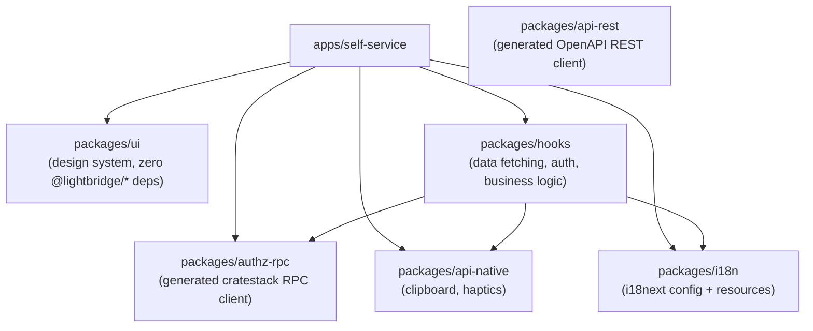
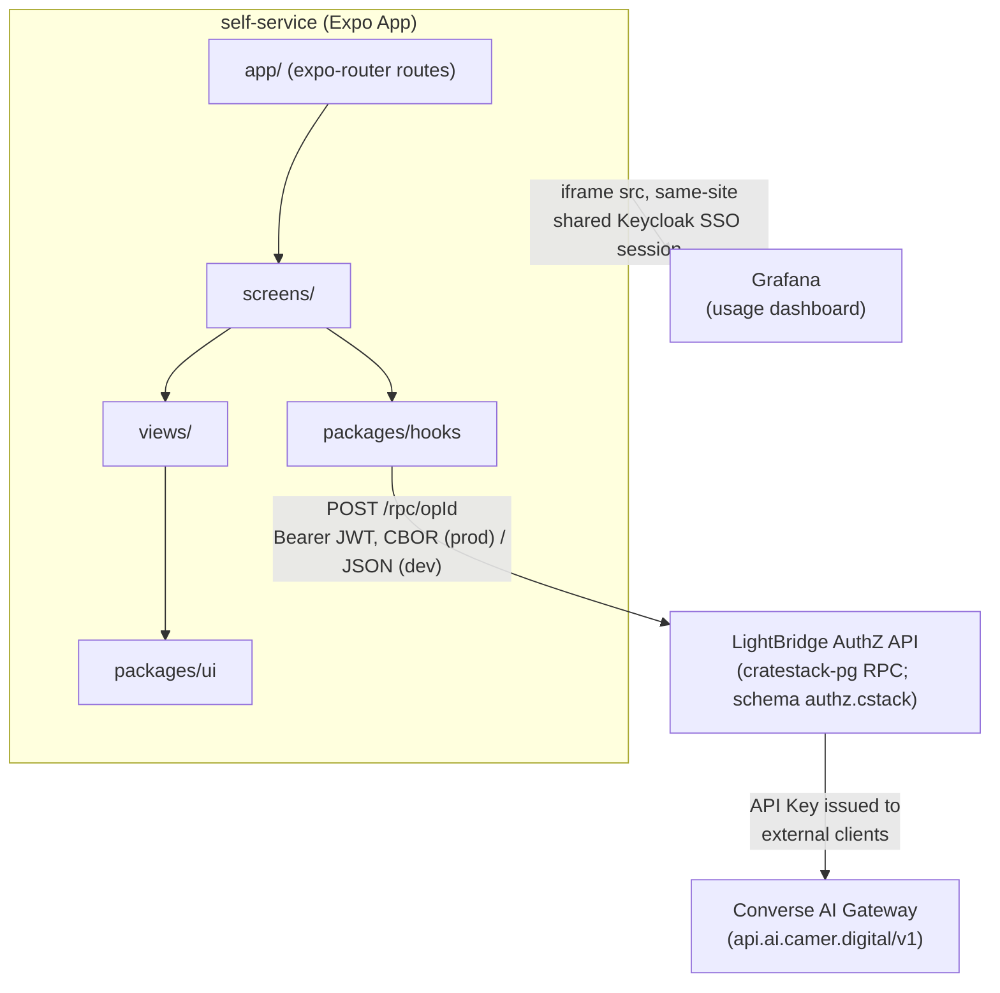

# Architecture Overview — Converse-frontends

> Sources: `AGENTS.md`, `apps/self-service/src/`, `packages/*/package.json` + `src/`, `openapi/`
> Verified against code at `main@8ea2b6b` (2026-08-15). See `architecture-conventions.md` for the
> layering rules and the two load-bearing package contracts (`packages/ui` and the sheet-system
> boundary) in detail.

---

## System Overview

This repository is a **pnpm monorepo** (`lightbridge-ss`) containing the LightBridge self-service
frontend — a React / React Native (Expo) application that serves as the self-service portal for
Converse, an AI gateway platform.

The system is a **static frontend** (no server-side rendering, no backend logic):

- Compiled to a static web bundle via `expo export --platform web` (`apps/self-service`'s
  `build:web` script)
- Served by nginx as a static site
- All business logic lives in the browser; the backend is LightBridge (external Rust service)
- The one exception to "no other services" is the Usage tab, which embeds an external Grafana
  dashboard in an iframe (see [Usage flow](#usage-flow) below) — the frontend still does no
  server-side rendering itself, it just frames someone else's page.

---

## Monorepo Topology

The dependency graph below is derived from each package's `dependencies`/`peerDependencies` in its
`package.json`, cross-checked against real `import` statements (not just what's declared) — see
"Verification" in the report for the exact commands. Two things this graph corrects relative to
memory/assumption: `packages/hooks` depends on `@lightbridge/i18n` (for locale sync and translated
mutation errors, e.g. `packages/hooks/src/projects.ts`), **not** on `@lightbridge/api-rest`; and
`packages/ui` has **no** workspace dependencies at all — every `@lightbridge/*` string inside
`packages/ui/src` is a comment, not an import (see the two-contracts section in
`architecture-conventions.md`).

`packages/api-rest` is generated from `openapi/usage.backend.yaml` but as of this writing **no
package or app imports it** — not even `packages/hooks`. It is orphaned: the Usage tab it was
presumably built for now embeds a Grafana dashboard instead (see below). It stays in the workspace
and its `codegen` script still runs on `pnpm install`/`turbo run build:web` (per
`architecture-conventions.md`), so it costs a codegen cycle but ships no code into the app bundle
unless something starts importing it again.

---

## Component / Network Diagram

The AuthZ RPC call originates in `packages/hooks` (screens call the hooks; see
`architecture-conventions.md`'s layering section for why it's screens and not views). The Grafana
iframe is embedded directly by `apps/self-service/src/views/usage-dashboard-embed.web.tsx` — there
is no REST call and no `packages/hooks` involvement in the current Usage tab at all.

---

## Key Components

| Component          | Package                | Responsibility                                                       | Tech Stack                                                        |
| ------------------- | ----------------------- | ---------------------------------------------------------------------- | --------------------------------------------------------------------- |
| Self-service app    | `apps/self-service`     | Entry point, routing, screen assembly, data-fetching wiring            | Expo 55, React 19, Expo Router                                        |
| AuthZ RPC client    | `packages/authz-rpc`    | Generated cratestack RPC client (accounts/projects/api-keys)           | Generated by `@cratestack/cli` from `schema/authz.cstack`, `cborg` (CBOR) |
| Usage REST client   | `packages/api-rest`     | Auto-generated HTTP client from `openapi/usage.backend.yaml`; **currently unused by the app** | `@hey-api/openapi-ts`, `axios`, `zod` |
| Shared hooks        | `packages/hooks`        | Data fetching, auth, business logic — consumed by **screens**, not views | TanStack Query, TanStack DB (`@tanstack/react-db`) for reactive local stores |
| Design system       | `packages/ui`           | Shared UI primitives, theming. No i18n coupling, no data fetching (see `architecture-conventions.md`) | React Native, `cva`, `clsx`/`tailwind-merge`, `@gorhom/bottom-sheet` (sheet subpath only) |
| i18n                | `packages/i18n`         | Translation config and resources                                       | `i18next`, `react-i18next`                                            |
| Native API utils    | `packages/api-native`   | Clipboard + haptics helpers                                            | `expo-clipboard`, `expo-haptics`                                      |

Corrected from the previous version of this doc: the Tech Stack column no longer lists Zustand —
nothing in this repo depends on it (`packages/hooks/package.json` has no `zustand` entry, and
`packages/hooks/src/auth/auth-store.ts`, the one hand-rolled reactive store, uses
`@tanstack/react-db`'s `createCollection`/`localOnlyCollectionOptions`, same as everywhere else).

---

## Layering (Strict Dependency Direction)

See `architecture-conventions.md` for the full layering diagram, the worked examples, and the two
load-bearing contracts (`packages/ui`'s zero-i18n/zero-fetch rule and the views-must-not-import-the-
sheet-system rule). The one-line summary: **Routes render a Screen. Screens own data fetching (call
`packages/hooks`) and own sheet presentation (`useSheet`). Views are pure presentational components
that receive data and callbacks as props** — this is the reverse of what an earlier version of this
doc claimed ("views call hooks for data"); see the conventions doc for the code-level evidence.

---

## Data Flow

### Authentication flow

1. App loads → reads `AuthSession` from storage (`loadStoredSession`,
   `packages/hooks/src/auth/auth-storage.ts`)
2. If no session → show Login screen → trigger Keycloak OAuth2 Authorization Code + PKCE (S256)
   redirect (`packages/hooks/src/auth/use-keycloak-login.ts`, `usePKCE: true`,
   `codeChallengeMethod: CodeChallengeMethod.S256`)
3. Keycloak redirects back with an auth code → frontend exchanges it for tokens
4. Tokens stored in platform storage: `expo-secure-store` on native, IndexedDB on web
   (`Platform.OS === 'web'` branch in `auth-storage.ts`)
5. All subsequent RPC calls include `Authorization: Bearer <accessToken>`

### API key management flow

1. Authenticated user navigates to the API Keys tab (`ApiKeysScreen`,
   `apps/self-service/src/screens/api-keys-screen.tsx`)
2. The **screen** calls `useApiKeys(projectId, { offset, limit })`
   (`packages/hooks/src/api-keys.ts`), which dispatches `POST /rpc/model.ApiKey.list` — the
   resulting `items`/`isLoading` are passed down as props to `ApiKeysListView`
3. Create: the screen navigates to a dedicated route (`/api-keys/new`,
   `apps/self-service/src/app/api-keys/new.tsx` → `ApiKeyCreateScreen`) rather than opening a
   sheet — the only one of the four lifecycle actions that isn't a sheet. That screen calls
   `useCreateApiKey()`, which dispatches `POST /rpc/procedure.createApiKey` with
   `{ args: { projectId, name, expiresAt?, billingPlan } }`; the server generates the id, hashes
   the secret, and validates the billing plan
4. Delete / Rotate / Revoke: the screen calls `sheet.present(...)` with `DeleteApiKeySheet` /
   `RotateApiKeySheet` / `RevokeApiKeySheet` (all in `apps/self-service/src/screens/`), each of
   which owns its own mutation hook (`useDeleteApiKey`, `useRotateApiKey`, `useRevokeApiKey`) and
   composes a presentational `views/` component for the confirmation UI. See "The imperative sheet
   system" in `architecture-conventions.md` for the mechanics.
5. A create/rotate response is a flat `ApiKeySecret` — the one-time `secret` (and, since #162,
   `oauth2Url`) sits alongside the key's own fields, shown to the user immediately via
   `apps/self-service/src/components/one-time-secret-card.tsx`

Both delete and revoke are live in the UI today (`ApiKeysListView` wires `onRevoke`/`onRotate`
alongside the existing delete action) — an earlier ADR (0001) treated rotation as reserved-but-not-
built and left the delete-vs-revoke product question open; both are now implemented side by side.

### Usage flow

The Usage tab does **not** call `packages/api-rest` or any `packages/hooks` query — this is a full
rewrite since the previous version of this doc, which described a TanStack Query +
`usageCollection` pipeline that no longer exists (there is no `packages/hooks/src/usage.ts` in the
current tree).

1. `UsageScreen` (`apps/self-service/src/screens/usage-screen.tsx`) reads `useRuntimeConfig().usage`
   — an optional `{ grafanaUrl, dashboardPath }` sourced from `EXPO_PUBLIC_GRAFANA_URL` /
   `EXPO_PUBLIC_GRAFANA_USAGE_DASHBOARD_PATH` (dev) or `/config.json` (prod web)
2. If unset, the tab shows a plain "unavailable" empty state — the tab itself is also hidden from
   navigation in that case (referenced in the screen's own comment; the responsive-tab-bar is
   outside this doc's two files)
3. If set, `buildUsageDashboardUrl()` (`apps/self-service/src/screens/usage-dashboard-url.ts`)
   builds a Grafana URL with `orgId`, `theme` (matching the app's light/dark scheme), a fixed
   30-day window, and `kiosk` (chrome-stripped) for the embed
4. Web: `UsageDashboardEmbed` (`.web.tsx` variant) renders that URL in an `<iframe>`. Native: there's
   no `react-native-webview` dependency, so the same component instead shows a card with an
   "open in Grafana" button that opens the system browser
5. Per-user scoping happens entirely on the Grafana side via the shared Keycloak SSO session — no
   user id is placed in the URL, and no token is either
6. An explicit "open in Grafana" action is always shown next to the embed, because a cross-origin
   iframe blocked by `X-Frame-Options` renders blank with no catchable JS error

No ADR records why this replaced the REST/TanStack-Query pipeline — the rationale is unrecorded in
this repo; commit `d5c9467` ("embed per-user Grafana usage dashboard in a Usage tab") is the point
this landed.

### Entity picker flow (account/project selection)

Introduced in #167 to fix a hard 10-item cap on the account/project selectors. See
`architecture-conventions.md` for how this interacts with the sheet-system boundary — it is the
concrete example the "views must not import the sheet system" rule is built around.

1. Screen calls `useAllAccounts()` / `useAllProjects(accountId)`
   (`packages/hooks/src/{accounts,projects}.ts`), which page through `accounts.list`/
   `projects.list` until the server's `Page<T>` envelope reports `hasNextPage: false` (bounded by a
   `MAX_*_PAGES` safety ceiling)
2. Screen maps the results to `PickerOption[]` via `toAccountPickerOptions`/
   `toProjectPickerOptions` (`apps/self-service/src/components/entity-picker-field.tsx`)
3. Below a configurable `sheetThreshold`, `EntityPickerField` renders an inline
   `packages/ui`-native picker. At/above it, selecting the field calls `onOpenPicker` — a plain
   callback the view holds with no idea a sheet exists
4. The **screen** wires `onOpenPicker` to `usePickerSheet()`
   (`apps/self-service/src/hooks/use-picker-sheet.tsx`), which calls `useSheet().present(...)` with
   a `PickerList` (search + scroll, `packages/ui`) as the sheet body
5. If the fetch-all loop hit its page ceiling, the screen also passes a `truncationNotice` so the
   sheet says the list may be incomplete instead of silently presenting a partial set as whole

---

## Key Design Decisions

| Decision                              | Rationale                                                                                                                                                                                      |
| ------------------------------------- | ---------------------------------------------------------------------------------------------------------------------------------------------------------------------------------------------- |
| Expo Router (file-based routing)      | Enables web + native from single codebase; routes map directly to file paths                                                                                                                   |
| Screens own data fetching, not views  | Keeps `views/` renderable standalone under Jest with no provider tree — see `architecture-conventions.md`'s layering section and the sheet-boundary contract, which share this rationale       |
| Auto-generated API clients            | The schema (`authz.cstack` for accounts/projects/api-keys; OpenAPI for the currently-unused usage REST client) is the intended single source of truth; codegen eliminates drift from the backend contract when a client is actually wired up |
| Schema-driven RPC for AuthZ, not REST | Backend migrated to `cratestack-pg` (ADR-0003 in `lightbridge-authz`), which has no OpenAPI generation — `packages/authz-rpc` hand-authors codegen against the copied `.cstack` schema instead |
| Grafana iframe embed for Usage        | Replaced an earlier TanStack Query + REST pipeline (see Usage flow above). Rationale for the switch is not recorded in an ADR or commit body beyond the feature commit itself                 |
| TanStack Query for server state       | Declarative, caching-aware, no global store pollution                                                                                                                                           |
| TanStack DB for reactive local state  | `packages/hooks/src/auth/auth-store.ts` and other collections use `@tanstack/react-db`'s `createCollection`; nothing in the repo depends on Zustand despite an earlier version of this table claiming otherwise |
| Platform-specific token storage       | `expo-secure-store` on native (hardware-backed), IndexedDB on web — appropriate security per platform                                                                                          |
| Static export + nginx                 | Simple, LTS-stable serving; no Node.js runtime required in production                                                                                                                          |
| WireMock for local dev                | Allows frontend development without running the real Rust/Postgres backend (`compose.yml`)                                                                                                     |
| `@gorhom/bottom-sheet` over `@expo/ui`'s `BottomSheet` | ADR-0006: on the app's pinned Expo SDK 55, `@expo/ui`'s universal components (incl. `BottomSheet`) don't exist yet and have no web export — reaching them needs an SDK 56/57 upgrade, tracked separately |

---

## External Dependencies

| Service               | Purpose                                              | Configured via                                                        |
| ---------------------- | ----------------------------------------------------- | ------------------------------------------------------------------------ |
| Keycloak               | OAuth2/OIDC provider — issues Bearer tokens           | `EXPO_PUBLIC_KEYCLOAK_ISSUER`, `_CLIENT_ID`, `_SCHEME`                    |
| LightBridge AuthZ API  | Account, project, API key management (RPC)            | `EXPO_PUBLIC_BACKEND_URL` (+ optional `EXPO_PUBLIC_API_BASE_PATH`)        |
| Grafana                | Usage dashboard, embedded as an iframe                | `EXPO_PUBLIC_GRAFANA_URL` (+ optional `EXPO_PUBLIC_GRAFANA_USAGE_DASHBOARD_PATH`); Usage tab is hidden entirely when unset |
| Converse AI Gateway    | LLM proxy (used by external API clients only — this frontend never calls it) | Not read by application code; see note below |

Corrected from the previous version of this table: `apps/self-service/src/configs/runtime-config.tsx`
and `runtime-config-types.ts` (the actual source of the app's runtime config, both env-driven in
dev and `/config.json`-driven in prod web) define no `gatewayUrl`/`usageUrl` field and read no
`EXPO_PUBLIC_USAGE_URL`/`EXPO_PUBLIC_GATEWAY_URL` — those two variables are still threaded through
`.docker/nginx/entrypoint.sh`'s `envsubst` list and the Helm chart, but nothing in `apps/self-service`
consumes them. That's infra-side drift in files outside this doc's ownership (`infrastructure.md`,
`development-setup.md`, `runbooks.md`, `api-reference.md`, `.docker/`, `charts/`) — flagged here
because it directly affects what this table can claim, not fixed here.

---

## Security Architecture

- **Authentication:** OAuth2 Authorization Code + PKCE (S256). No implicit flow. No client secrets stored.
- **Token storage:** Platform-appropriate secure storage (see `auth-and-identity.md`)
- **Secrets:** No secrets baked into the container image. All config injected at runtime via environment variables.
- **TLS:** Not terminated by the app or nginx — expected at ingress/load-balancer level.
- **CORS:** Handled by the LightBridge backend; the frontend never bypasses CORS.
- **Input validation:** AuthZ API shapes (accounts/projects/api-keys) are typed via
  `packages/authz-rpc`'s codegen against `authz.cstack` — no runtime schema validation on the
  frontend for this surface (the backend's `cratestack-pg` policy layer is the enforcement point).
  `packages/api-rest`'s generated types (`@hey-api/openapi-ts` + `zod`) exist for the usage REST
  surface but are currently unused (see Monorepo Topology above).
