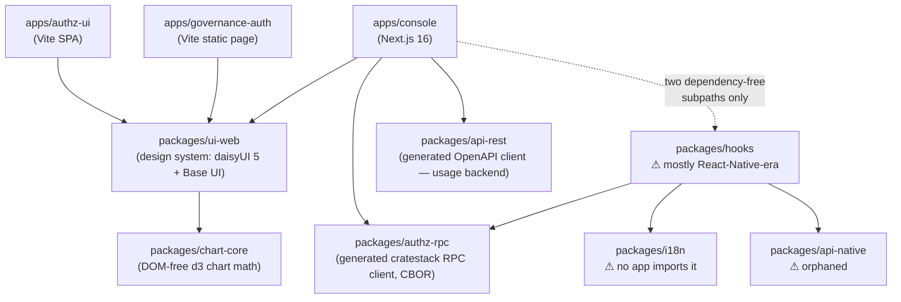

# Architecture Overview — converse-frontends

> Verified against `main@c9b4aa6` (2026-08-31).
>
> **This document is a map, not a mirror.** It says what exists, how the pieces depend on each
> other, and _where the authoritative description of each piece lives_. It deliberately does not
> restate per-app detail: the previous version of this file did, and rotted into a loving
> description of an application that had been deleted (the Expo self-service app, removed in #402).
> When you need depth, follow the pointers in [Where the real detail lives](#where-the-real-detail-lives)
> — those documents sit next to the code they describe and move with it.

---

## What this repository is

A **pnpm + Turborepo monorepo** (`pnpm@11.5.2`, Node 22) holding the web frontends for the
LightBridge platform. Three deployable surfaces, all React 19, all talking to Rust backends that
live in other repositories: the two browser-served applications (`apps/console` —
`lightbridge-authz`/`lightbridge-ui`; `apps/authz-ui` — `lightbridge-authz`'s `authz-idp`) and a
third compile-time surface (`apps/governance-auth` — embedded into `lightbridge-governance`).

There is **no React Native, no Expo, and no mobile surface** in this repository. The Expo
self-service app (`apps/self-service`) and its design system (`packages/ui`) were removed in
[#402](https://github.com/ADORSYS-GIS/converse-frontends/pull/402). Residue from that era still
exists in `packages/hooks` and `packages/api-native` — see [Known residue](#known-residue).

---

## The applications

|                    | `apps/console`                                                                                                                                                            | `apps/authz-ui`                                                                                                                         | `apps/governance-auth`                                                                                                                                                          |
| ------------------ | ------------------------------------------------------------------------------------------------------------------------------------------------------------------------- | --------------------------------------------------------------------------------------------------------------------------------------- | ------------------------------------------------------------------------------------------------------------------------------------------------------------------------------- |
| What it is         | The operator/customer console — accounts, projects, API keys, budgets, usage analytics                                                                                    | The **human plane of `authz-idp`**: the pages a person sees while pairing a device or signing in                                        | The **loopback callback page** a browser lands on after `lightbridge-governance`'s OAuth2 loopback redirect (does the terminal have a session?)                                 |
| Framework          | Next.js 16 (App Router), React 19, Node runtime, `output: 'standalone'`                                                                                                   | Vite 7 + React 19 + react-router 8, **static SPA, no server code at all**                                                               | Vite 7 + React 19, **static page, no server code at all**                                                                                                                       |
| Served by          | Its own Node server (container image `…/converse-frontends/console`)                                                                                                      | `lightbridge-authz`'s `authz-idp`, same-origin under `/ui`, from a digest-pinned assets-only OCI artifact                               | **Nobody serves it** — the Rust side `include_str!`s one self-contained `index.html` at compile time and writes it to a `127.0.0.1` loopback socket; shipped as an OCI artifact |
| Talks to backends  | Yes — but only through its own same-origin route handlers (`/api/rpc/*`, `/api/budget/rpc/*`, `/api/usage/*`); the browser never reaches a backend directly (ADR 0009 D3) | Only by native form posts to `authz-idp`'s protocol endpoints and one cookie-bound JSON fetch. It makes **no authentication decisions** | No network calls of its own — `lightbridge-governance` inlines the outcome marker (`data-callback-status`) then writes it to the socket                                         |
| Auth               | Server-side OIDC against Keycloak; tokens sealed in an encrypted `httpOnly` cookie, never exposed to page JS                                                              | None of its own — it renders what Rust tells it                                                                                         | None of its own — it renders whether the terminal got a session                                                                                                                 |
| Authoritative docs | `apps/console/README.md`, `docs/knowledge/console-configuration.md`, the `console-ui` skill                                                                               | `apps/authz-ui/README.md`, and `lightbridge-authz`'s ADR-0029 for the artifact contract                                                 | `apps/governance-auth/README.md`                                                                                                                                                |

The three apps share `packages/ui-web` — one design system, one Tailwind/daisyUI theme pipeline — and
almost nothing else. `apps/authz-ui` and `apps/governance-auth` deliberately import **only**
`ui-web`: they have no RPC client, no data layer, and no server config.

---

## Dependency graph

Derived from each package's `dependencies`/`devDependencies`/`peerDependencies`, cross-checked
against real import sites (2026-08-31):



Two edges worth reading carefully, because both are easy to misread as healthier than they are:

- **`console → hooks` is a dotted line on purpose.** The console imports exactly two subpaths —
  `@lightbridge/hooks/api-error` and `@lightbridge/hooks/budget-tiers` — both dependency-free. It
  never imports the barrel, which would drag in `react-native`, `expo-auth-session`, and the rest of
  that package's Expo-era surface.
- **`packages/i18n` has no application consumer.** Its only importers are inside `packages/hooks`
  (`locale-sync.ts`, `projects.ts`). None of the three apps calls `useTranslation`; all copy in all
  three apps is literal strings. See [Known residue](#known-residue) — this matters because several
  older documents still state an "all strings must go through `t()`" rule that nothing enforces or
  follows.

---

## The packages

| Package               | Responsibility                                                                                                                                                                                                                         | Notes                                                                                                                                                                                                                                                                                    |
| --------------------- | -------------------------------------------------------------------------------------------------------------------------------------------------------------------------------------------------------------------------------------- | ---------------------------------------------------------------------------------------------------------------------------------------------------------------------------------------------------------------------------------------------------------------------------------------- |
| `packages/ui-web`     | The design system and screen sections for the three apps: components, `sections/`, page-level Storybook stories, and the single Tailwind v4 + daisyUI theme pipeline (`theme.css` — the only file allowed to contain a colour literal) | The `console-ui` skill is its binding contract. Storybook is the acceptance surface (`pnpm --dir packages/ui-web storybook`, port 6007)                                                                                                                                                  |
| `packages/chart-core` | Pure chart math — scales, bins, the monochrome series ramp. DOM-free                                                                                                                                                                   | Charts are hand-rolled `<svg>`; there is no chart framework in this repo                                                                                                                                                                                                                 |
| `packages/authz-rpc`  | Generated cratestack RPC client for the authz surface (accounts, projects, API keys, budget)                                                                                                                                           | `generated/` is **codegen output, gitignored, never hand-edited**. Its `@cratestack/cli` pin must stay in lockstep with `lightbridge-authz`'s Cargo pin — see `packages/authz-rpc/README.md` for the incident that makes this non-negotiable, and `rpc-and-codegen.md` for the mechanics |
| `packages/api-rest`   | Generated OpenAPI client for the usage backend, from `openapi/usage.backend.yaml`                                                                                                                                                      | Also codegen output. Consumed by the console's usage dashboards through its `/api/usage/*` proxy leg                                                                                                                                                                                     |
| `packages/hooks`      | Historically the shared data layer for the Expo app                                                                                                                                                                                    | ⚠ Now largely vestigial — see below                                                                                                                                                                                                                                                      |
| `packages/i18n`       | i18next configuration and resources                                                                                                                                                                                                    | ⚠ No application consumer — see below                                                                                                                                                                                                                                                    |
| `packages/api-native` | Expo clipboard/haptics wrappers                                                                                                                                                                                                        | ⚠ Orphaned: zero importers anywhere in `apps/` or `packages/`                                                                                                                                                                                                                            |

---

## Known residue

Recorded plainly so nobody mistakes leftovers for architecture, and so nobody "fixes" a live path
believing it is dead:

- **`packages/hooks`** still declares `react-native`, `expo-auth-session`, `expo-secure-store`,
  `expo-crypto`, `expo-localization`, `expo-web-browser`, `expo-router` and `@react-native-community/netinfo`.
  Most of the package is unreachable from either app. **Do not delete it wholesale**: the console
  genuinely depends on `@lightbridge/hooks/api-error` and `@lightbridge/hooks/budget-tiers`. Any
  cleanup must preserve those two subpaths.
- **`packages/i18n`** and **`packages/api-native`** have no application consumer at all.
- **`charts/converse-frontend`** is the legacy nginx chart for the deleted Expo app.
  `charts/converse-console` is the live one for `apps/console`. `apps/authz-ui` has no chart by
  design — it ships inside `authz-idp`'s image, not as its own workload. `apps/governance-auth`
  likewise has no chart: it is not a deployed workload, only a build-time-embedded HTML page.
- Several `.md` files elsewhere in `docs/knowledge/` still carry Expo-era statements that this
  sweep did not reach. They are listed in the PR that rewrote this file; treat any Expo/React
  Native claim in this knowledge base as suspect until verified against the tree.

---

## How each app reaches its backend

**`apps/console`** — the browser talks only to the console's own origin:

```
browser → /api/rpc/{op}        → authz-api    (CBOR, Bearer attached server-side)
browser → /api/budget/rpc/{op} → authz-budget (CBOR)
browser → /api/usage/{...}     → usage service (mTLS from the server leg)
browser → Keycloak                             (login redirect only)
```

The proxy is a deliberate byte-forwarder: it never decodes CBOR, attaches the access token from the
encrypted session cookie, and owns token refresh. Details: `apps/console/README.md`,
`auth-and-identity.md`, `console-configuration.md`.

**`apps/authz-ui`** — no proxy, no client, no token. Its forms post natively to `authz-idp`'s
protocol endpoints and one route fetches a cookie-bound JSON context endpoint. Every decision stays
in Rust. The route set it may serve is published in the build's `dist/routes.json` and enforced by
`authz-idp` as an allowlist. Details: `apps/authz-ui/README.md`.

**`apps/governance-auth`** — no server, no origin, no network. The whole app compiles to **one
self-contained `index.html`** (via `vite-plugin-singlefile`); `lightbridge-governance` `include_str!`s
it at compile time, writes it to a socket bound to `127.0.0.1` as the OAuth2 loopback callback
target, and renders success/error by swapping one `data-callback-status="…"` attribute. Because
nothing serves it over HTTP there is **no CSP at all** — the deliberate middle case between the
console (which inlines its theme script) and `authz-ui` (whose CSP forbids inline). It is published
as an **OCI artifact** (`ghcr.io/adorsys-gis/governance-auth-callback`), not a container image.
Details: `apps/governance-auth/README.md`.

---

## Where the real detail lives

| Question                                                | Authoritative source                                                                            |
| ------------------------------------------------------- | ----------------------------------------------------------------------------------------------- |
| Repo-wide rules, layering, per-app architecture summary | `AGENTS.md` §2                                                                                  |
| Console screens, shell, tokens, chart doctrine, states  | the `console-ui` skill (`.claude/skills/console-ui/SKILL.md`) + `docs/design/console-redesign/` |
| Console routes, config, session/proxy mechanics         | `apps/console/README.md`, `console-configuration.md`, `auth-and-identity.md`                    |
| authz-ui routes, the `routes.json` contract, CSP gates  | `apps/authz-ui/README.md`                                                                       |
| governance-auth single-file callback page, OCI artifact | `apps/governance-auth/README.md`                                                                |
| Why the console looks and is laid out the way it is     | ADRs 0007–0013                                                                                  |
| RPC codegen, the cratestack pin, CBOR                   | `rpc-and-codegen.md`, `packages/authz-rpc/README.md`                                            |
| Usage/analytics backend surface                         | `api-usage-backend.md`                                                                          |
| CI, image publishing, deployment                        | `ci-cd.md`, `infrastructure.md`                                                                 |
| Local setup and commands                                | `development-setup.md`                                                                          |
| Coding rules that apply everywhere                      | `architecture-conventions.md`, `coding-conventions.md`                                          |

If one of those disagrees with this file, that one wins — it is closer to the code.
