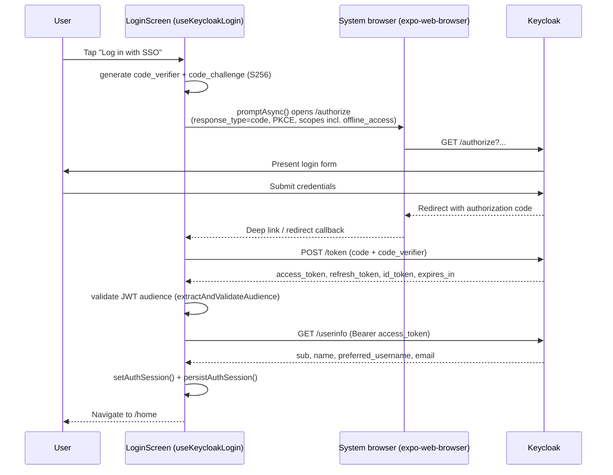
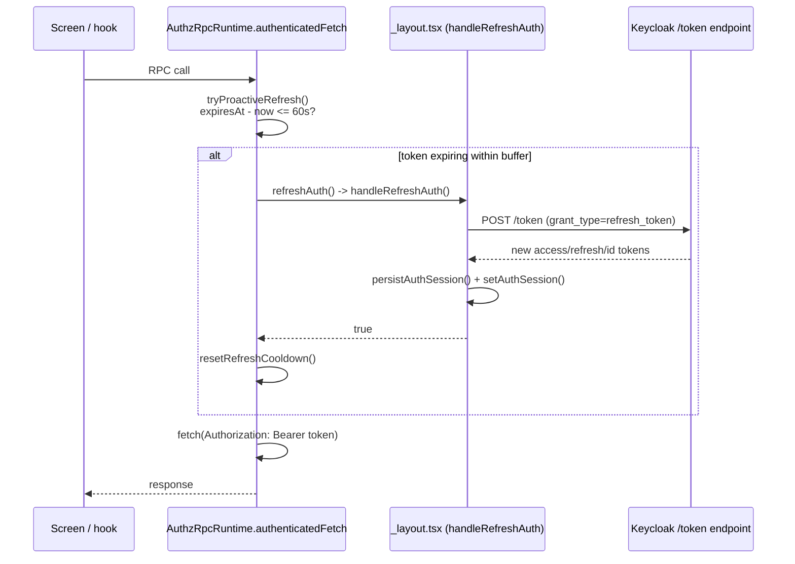
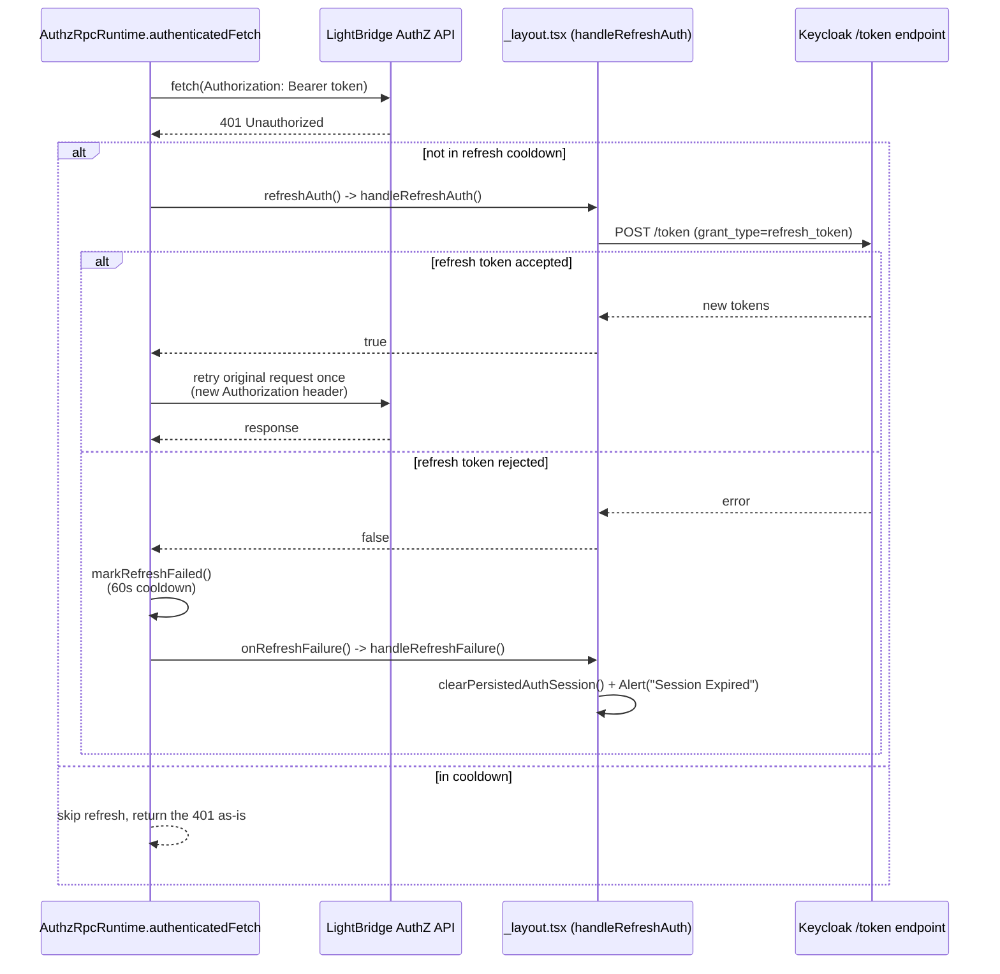

# Authentication and Identity

> Sources:
>
> - `packages/hooks/src/auth/auth-storage.ts`
> - `packages/hooks/src/auth/auth-types.ts`
> - `packages/hooks/src/auth/use-keycloak-login.ts`
> - `packages/hooks/src/auth/use-auth-session.ts`
> - `apps/self-service/src/app/_layout.tsx` (refresh wiring into the RPC runtime)
> - `packages/authz-rpc/src/runtime.ts` (bearer header + proactive refresh + 401-retry-once)
> - `packages/authz-rpc/schema/authz.cstack` (API-key schema)
>
> For the authorization model (RBAC, permissions, server-side enforcement), see
> `authorization-and-permissions.md`.

---

## Critical Distinction: Bearer Token vs. API Key

These are two completely separate credential types with different purposes and lifetimes:

| Credential       | Type                     | Issued By           | Used By             | Purpose                                                  |
| ---------------- | ------------------------ | ------------------- | ------------------- | -------------------------------------------------------- |
| **Bearer Token** | Short-lived JWT          | Keycloak            | This frontend       | Authenticate the logged-in user with LightBridge backend |
| **API Key**      | Long-lived secret string | LightBridge backend | External AI clients | Authenticate with the Converse AI gateway                |

> The frontend **never** uses API keys to make requests. API keys are managed _through_ the frontend but consumed
> _outside_ it.
> The Converse AI gateway is **never** called by this frontend. External AI clients call it directly using their API
> key.

---

## User Authentication: Keycloak OAuth2 / PKCE

### Flow

Authentication uses the **Authorization Code Flow with PKCE** (Proof Key for Code Exchange), implemented via
`expo-auth-session`. Driven by `useKeycloakLogin()`, consumed in `apps/self-service/src/screens/login-screen.tsx`.



### Key implementation details (from `use-keycloak-login.ts`)

- **PKCE method:** `CodeChallengeMethod.S256`
- **Response type:** `ResponseType.Code`
- **Default scopes:** `['openid', 'profile', 'email', 'offline_access']`. The `offline_access` scope
  is what makes the silent, long-lived refresh described below possible — it asks Keycloak for a
  refresh token that outlives the browser SSO session, per the doc comment directly above the
  `useAuthRequest()` call.
- Discovery is performed via `AuthSession.useAutoDiscovery(config.issuer)` — all Keycloak endpoint URLs are resolved
  from the OIDC discovery document, not hardcoded.
- The `useKeycloakLogin` hook exposes `promptAsync()` to trigger the login redirect and `isLoading` to track exchange
  state.

### Token Refresh

Refresh is **silent and refresh-token-based** — it is a background `POST /token` with
`grant_type=refresh_token`, never a re-login redirect through Keycloak's login form. It is not one
mechanism but two, both living in `AuthzRpcRuntime` (`packages/authz-rpc/src/runtime.ts`), which
wraps every outgoing RPC `fetch` call:

1. **Proactive refresh, ahead of expiry.** `tryProactiveRefresh()` runs before every RPC call and
   checks `getExpiresAt()` (wired to `getLatestAuthSession().tokens?.expiresAt` in
   `apps/self-service/src/app/_layout.tsx`); if the access token expires within
   `TOKEN_REFRESH_BUFFER_MS` (60 s), it refreshes before the call goes out, so a normal request
   essentially never hits a 401 for a merely-stale token.
2. **Reactive retry-once, on an actual 401.** If a request still comes back `401` (proactive
   refresh missed it, or the token was invalidated some other way), `authenticatedFetch()`
   refreshes once and retries the _same_ request with the new `Authorization` header — not by
   re-invoking the runtime's `headers` callback (which already ran and built the now-stale
   request), but by overwriting the header directly on the retried call.

Both paths call the same `performRefresh()`, which de-duplicates concurrent refresh attempts via a
shared `refreshPromise` and enforces a 60 s cooldown (`REFRESH_COOLDOWN_MS`) after a failed refresh
so a dead refresh token doesn't trigger a refresh attempt on every single RPC call.

`refreshAuth()` — the closure `AuthzRpcRuntime` calls into — is `handleRefreshAuth()` in
`_layout.tsx`, which calls `refreshAccessToken()` (`use-keycloak-login.ts`):

- Posts `grant_type=refresh_token` to the Keycloak token endpoint.
- Re-fetches user info if the new access token is valid.
- Validates the JWT audience on the new access token the same way login does.
- Persists the refreshed session to storage (`setAuthSession()` + `persistAuthSession()`).
- Returns `null` on any failure; `handleRefreshAuth()` turns that into `false` for the runtime.

**Session teardown only happens when the refresh token itself is rejected**, not on every failed
call: `performRefresh()` invokes `onRefreshFailure()` — wired to `handleRefreshFailure()` in
`_layout.tsx` — only when `refreshAuth()` itself resolves `false` (or throws). `handleRefreshFailure`
force-clears the session (`clearPersistedAuthSession()`) and shows a "Session Expired" alert; the
declarative `Stack.Protected` auth guard in `_layout.tsx` then redirects to `/login` on its own once
`isAuthenticated` flips false. A single transient `401` that a retry-once resolves never reaches this
path.





### Non-Dependency: `lightbridge-authz` Token-Exchange (ADR-0011)

> **This app never calls `lightbridge-authz`'s `/oauth2/token` endpoint** — it authenticates
> directly against Keycloak (flow above). It therefore has **zero exposure** to the v3.0.0
> token-exchange work: client registry requirements, per-client `aud`, the derived `id_token`,
> `issued_token_type`, and `jti` format are all out of this app's dependency surface.
>
> `packages/hooks/src/auth/jwt-utils.ts` declares `jti?: string` on `JwtPayload`, but nothing in
> this repo reads it, so a `jti`-format change on the issuing side is a non-event here.
>
> Source of truth: [lightbridge-authz ADR-0011](https://github.com/ADORSYS-GIS/lightbridge-authz/blob/main/docs/adr/0011-authz-issues-a-full-oidc-token-object.md),
> [lightbridge-authz#286](https://github.com/ADORSYS-GIS/lightbridge-authz/pull/286),
> [lightbridge-authz#288](https://github.com/ADORSYS-GIS/lightbridge-authz/pull/288).

---

## Token Types: `AuthTokens`

Defined in `packages/hooks/src/auth/auth-types.ts`:

| Field          | Type       | Required | Description                                                                                          |
| -------------- | ---------- | -------- | ---------------------------------------------------------------------------------------------------- |
| `accessToken`  | `string`   | **Yes**  | Bearer token sent in `Authorization` header to LightBridge                                           |
| `refreshToken` | `string`   | No       | Used to obtain new access tokens without re-login                                                    |
| `idToken`      | `string`   | No       | OIDC identity token (Keycloak-issued, contains user claims)                                          |
| `expiresAt`    | `number`   | No       | Epoch milliseconds at which `accessToken` expires                                                    |
| `tokenType`    | `string`   | No       | Typically `"Bearer"`                                                                                 |
| `scope`        | `string`   | No       | Space-separated OAuth2 scopes granted                                                                |
| `audience`     | `string[]` | No       | `aud` claim(s) extracted from the access token, used for the JWT audience validation described below |

---

## User Object: `AuthUser`

Populated from Keycloak's `/userinfo` endpoint:

| Field   | Type     | Required | Description                                                 |
| ------- | -------- | -------- | ----------------------------------------------------------- |
| `id`    | `string` | **Yes**  | Keycloak subject (`sub` claim)                              |
| `name`  | `string` | No       | Display name (`name` or `preferred_username` from userinfo) |
| `email` | `string` | No       | Email address                                               |

---

## Session Object: `AuthSession`

The full session stored in persistent storage:

```typescript
type AuthSession = {
  id: 'current'; // always the literal string 'current'
  user: AuthUser | null; // null if userinfo fetch failed
  tokens: AuthTokens | null;
};
```

Storage key: `"lightbridge.auth.session"`

---

## Token Storage

Platform-specific storage is implemented in `packages/hooks/src/auth/auth-storage.ts`:

### Web (browser)

- **Storage:** IndexedDB via `idb-keyval`
- **Database name:** `lightbridge-web-storage`
- **Store name:** `auth`
- An app-specific DB/store is used to avoid collisions with the `idb-keyval` defaults (`keyval-store` / `keyval`).
- On first load, a **one-time migration** attempts to read from the legacy default store and copies the session to the
  app-specific store, then deletes the legacy entry.
- `del()` is called best-effort on web; errors (e.g. private browsing) are silently ignored.

### Native (iOS / Android)

- **Storage:** `expo-secure-store` (`SecureStore.getItemAsync` / `setItemAsync` / `deleteItemAsync`)
- Session is JSON-serialized before storage and parsed on retrieval.

### Storage API

| Function                     | Platform | Effect                        |
| ---------------------------- | -------- | ----------------------------- |
| `loadStoredSession()`        | Both     | Returns `AuthSession \| null` |
| `saveStoredSession(session)` | Both     | Persists the session          |
| `clearStoredSession()`       | Both     | Deletes the persisted session |

---

## Request Flow: Calling LightBridge with a Bearer Token

Once authenticated, all frontend requests to the LightBridge AuthZ and Usage APIs include:

```
Authorization: Bearer <accessToken>
```

The AuthZ API's `cratestack::AuthProvider` implementation (`CratestackAuthProvider`, backend-side)
extracts and validates this same bearer/JWKS token exactly as before the RPC migration — it just
sits in front of the RPC dispatcher instead of REST handlers now. On the frontend, the header is
attached by the generated `CratestackRpcRuntime`'s `headers` callback, configured in
`packages/authz-rpc/src/runtime.ts` (`AuthzRpcRuntime`'s constructor) — this is also the class that
implements the proactive-refresh / 401-retry-once behavior described under "Token Refresh" above:

```typescript
// packages/authz-rpc/src/runtime.ts (abridged)
headers: async () => {
  const token = await this.authOptions.auth();
  const headers: Record<string, string> = {};
  if (token) {
    headers.Authorization = `Bearer ${token}`;
  }
  return headers;
},
```

The Usage API is unaffected — it still authenticates the same way over plain REST, via
`@lightbridge/api-rest`'s generated OpenAPI security scheme.

---

## API Keys (Managed, Not Used, by This Frontend)

API keys are issued by the LightBridge backend and are separate from authentication tokens.

From `packages/authz-rpc/schema/authz.cstack` (model `ApiKey`, generated type in
`packages/authz-rpc/generated/models.ts`) — note these are the wire field names as of the
cratestack RPC migration, **camelCase**, not the pre-migration REST API's snake_case:

| Field         | Type                  | Nullable | Description                                           |
| ------------- | --------------------- | -------- | ----------------------------------------------------- |
| `id`          | `string`              | No       | Unique key identifier                                 |
| `projectId`   | `string`              | No       | Project the key belongs to                            |
| `name`        | `string`              | No       | Human-readable label                                  |
| `keyPrefix`   | `string`              | No       | Visible prefix of the secret (e.g. `"lb_abc123..."`)  |
| `status`      | `string`              | No       | `"active"` or `"revoked"`                             |
| `billingPlan` | `string`              | No       | Billing plan the key was created under                |
| `createdAt`   | `string` (date-time)  | No       | Creation timestamp                                    |
| `updatedAt`   | `string` (date-time)  | No       | Last update timestamp                                 |
| `expiresAt`   | `string \| undefined` | **Yes**  | Optional expiry                                       |
| `lastUsedAt`  | `string \| undefined` | **Yes**  | Last usage timestamp                                  |
| `lastIp`      | `string \| undefined` | **Yes**  | IP of last caller                                     |
| `revokedAt`   | `string \| undefined` | **Yes**  | Revocation timestamp                                  |
| `deletedAt`   | `string \| undefined` | **Yes**  | Soft-delete timestamp (`@@soft_delete` in the schema) |

Note: the schema also declares a `keyHash` column, but it's marked `@server_only` — it's never
emitted on the wire and does not appear in the generated `ApiKey` TypeScript type at all.

The secret is only returned **once**, at creation (`procedure.createApiKey`) or rotation
(`procedure.rotateApiKey`), as an `ApiKeySecret` object. As of `cratestack-pg` 0.4.13
(cratestack/cratestack#147), this is **nested** — `apiKey` carries the full `ApiKey` model as its
own object, with `secret` and `oauth2Url` as sibling scalars:

```json
{
  "apiKey": {
    "id": "key_ghi789",
    "projectId": "proj_def456",
    "name": "My App Key",
    "keyPrefix": "lb_ghi789...",
    "status": "active",
    "billingPlan": "standard",
    "createdAt": "2025-03-30T10:00:00Z",
    "updatedAt": "2025-03-30T10:00:00Z"
  },
  "secret": "lb_ghi789fullsecretstringshownonce",
  "oauth2Url": null
}
```

This was flat on an earlier `cratestack-pg` (0.4.9–0.4.12): that version's `type`-block codegen
couldn't reference a model type by name, so `ApiKeySecret` inlined every `ApiKey` field as a scalar
instead of nesting the model (a real compiler limitation, not a design choice — see the schema
comment directly above `type ApiKeySecret` in `packages/authz-rpc/schema/authz.cstack` for the
`include_server_schema!` failure that motivated the workaround). It was un-flattened back to the
nested shape once 0.4.13 lifted that limitation, which is what the schema — and therefore the wire
format — currently declares. The two call sites that consume this response in the app,
`apps/self-service/src/screens/api-key-create-screen.tsx` and
`apps/self-service/src/screens/rotate-api-key-sheet.tsx`, only ever read the top-level `secret` and
`oauth2Url` scalars, so neither needed a code change across that shape flip — but any future code
reading `id`/`keyPrefix`/etc. from an `ApiKeySecret` result must go through `.apiKey`, not the
top level.

The frontend displays the secret to the user at that moment; it is not stored by the frontend.
