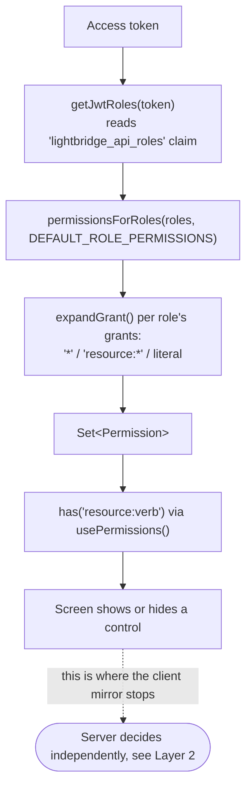
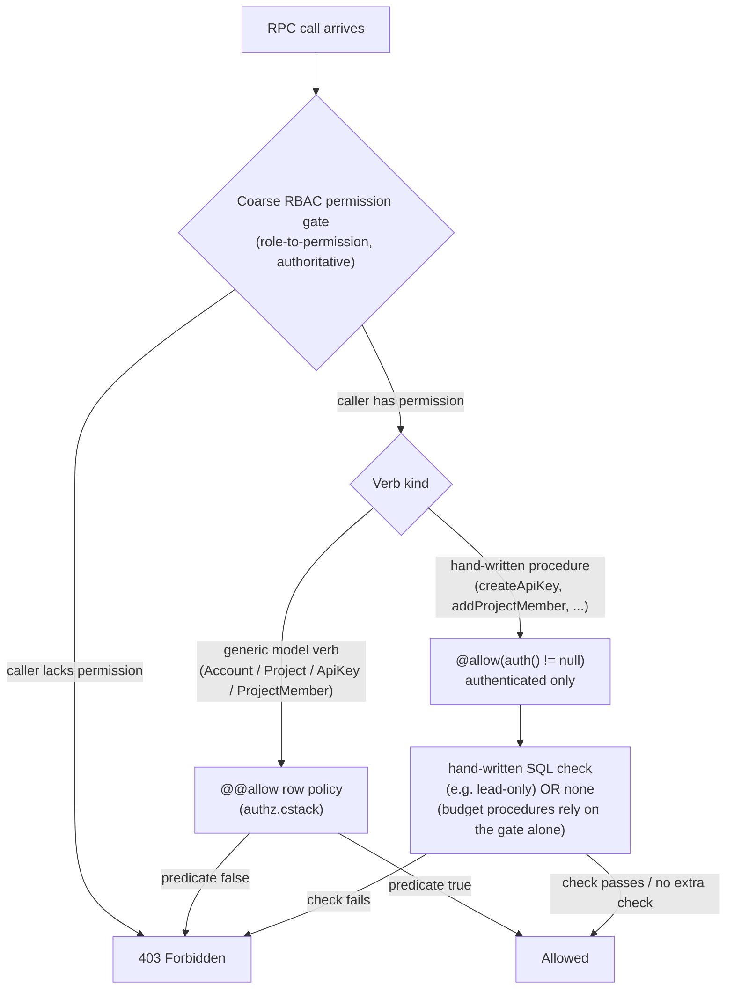
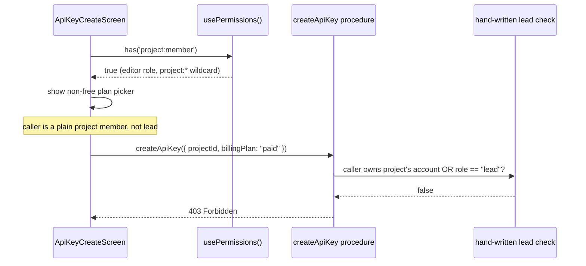

# Authorization and Permissions

> Sources:
>
> - `packages/hooks/src/rbac.ts` (client-side RBAC mirror)
> - `packages/hooks/src/use-permissions.ts` (`usePermissions()` hook)
> - `packages/hooks/src/auth/jwt-utils.ts` (`getJwtRoles()`)
> - `packages/authz-rpc/schema/authz.cstack` (server-side `@@allow` policies and procedure comments —
>   the closest thing to backend source available from this repo)
> - `apps/self-service/src/screens/api-key-create-screen.tsx`,
>   `apps/self-service/src/screens/project-settings-screen.tsx` (concrete client/server gap examples)
>
> For authentication (login, tokens, refresh), see `auth-and-identity.md`.

---

## Two layers, one source of truth

This app makes an authorization decision twice for most actions: once in the UI, to decide whether
to show a control at all, and once — always — on the server, when the RPC call actually lands. The
two layers are **not symmetric**:

- **Client-side RBAC mirror** (`packages/hooks/src/rbac.ts`) is a pure, dependency-free re-encoding
  of the backend's coarse role → permission mapping. It exists purely so the UI can hide/disable
  controls the caller almost certainly can't use. It is **never consulted by the server** and
  **cannot grant anything** — it can only get a show/hide decision wrong.
- **Server-side enforcement** is the actual authorization boundary: a coarse RBAC permission gate
  first, then, depending on the RPC verb, either a per-row `@@allow` policy (generic model CRUD) or
  a hand-written SQL check inside a procedure (everything else).

The client mirror only ever implements the first half of the server's decision. The gap between
"the coarse permission says yes" and "the server's row-level/procedure-level check says yes" is
real, currently unclosed, and documented below with a concrete example already called out in the
app's own code comments.

---

## Layer 1: Client-side RBAC mirror (UI convenience, not a security boundary)

`packages/hooks/src/rbac.ts` opens with this doc comment, worth quoting verbatim because it is the
authoritative statement of what this layer is for:

> Client-side mirror of `lightbridge-authz-core::authz`... This is a *UI convenience*, not a
> security boundary — the backend is the source of truth and still enforces every permission
> server-side. Getting this out of sync only shows/hides the wrong control; it can never grant
> access the server wouldn't otherwise allow.

### `ALL_PERMISSIONS`

A flat, ordered array of 28 permission strings, grouped by resource:

| Resource | Count | Permissions |
| -------- | ----- | ----------- |
| `account` | 5 | `create`, `read`, `update`, `delete`, `disable` |
| `project` | 6 | `create`, `read`, `update`, `delete`, `disable`, `member` |
| `apikey`  | 7 | `create`, `read`, `update`, `delete`, `revoke`, `rotate`, `validate` |
| `budget`  | 10 | `read`, `self-refill`, `review`, `grant`, `revoke`, `audit-read`, `policy-read`, `policy-write`, `policy-simulate`, `policy-activate` |

The `Permission` TypeScript type is `(typeof ALL_PERMISSIONS)[number]` — derived from the array, not
declared independently, so the two can't drift apart inside this file. The **order** matters too:
the doc comment states this array mirrors the backend's `Permission::ALL` in the same declaration
order specifically so wildcard expansion (below) produces the same set on both sides.

### `DEFAULT_ROLE_PERMISSIONS`

The built-in role → grant mapping, used whenever the backend has no
`oauth2.rbac.role_permissions` override configured:

```typescript
export const DEFAULT_ROLE_PERMISSIONS: Record<string, string[]> = {
  'lightbridge-admin': ['*'],
  'lightbridge-editor': ['account:read', 'project:*', 'apikey:*'],
  'lightbridge-viewer': ['account:read', 'project:read', 'apikey:read'],
};
```

### Wildcard expansion (`expandGrant`)

- `'*'` expands to **every** entry in `ALL_PERMISSIONS`.
- `'resource:*'` expands to every entry whose resource prefix matches.
- A literal grant (`'account:read'`) expands to itself if it's a real permission, otherwise to
  nothing — unknown grants never widen access.

### `usePermissions()`

```typescript
// packages/hooks/src/use-permissions.ts
const roles = getJwtRoles(accessToken); // 'lightbridge_api_roles' claim, JSON array or space-delimited string
return permissionsForRoles(roles); // -> Set<Permission>, memoized on accessToken
```

Screens call `has('resource:verb')` off this hook to decide whether to render a control at all —
for example `apps/self-service/src/screens/home-screen.tsx` (`canCreateKey={has('apikey:create')}`),
`account-settings-screen.tsx` (`canUpdate`/`canDelete`/`canDisable`), and
`project-settings-screen.tsx` (`canCreate`/`canUpdate`/`canDelete`/`canDisable`/`canManageMembers`).



---

## Layer 2: Server-side enforcement (the actual boundary)

Everything below is read from procedure and `@@allow` comments in
`packages/authz-rpc/schema/authz.cstack` — the schema this frontend's RPC client is generated
from, and the closest artifact to backend source available in this repo. The backend crate itself
(`lightbridge-authz-rest`'s `rpc_authorize.rs`) is out of this repo's scope; where the schema
comments cite it by name, this doc does too, without claiming to have read it directly.

Every RPC call passes a **coarse RBAC permission gate** first (the same role → permission shape as
Layer 1, but authoritative). What happens after that gate depends on the kind of verb:

- **Generic model CRUD verbs** (`model.Account.*`, `model.Project.*`, `model.ApiKey.*`,
  `model.ProjectMember.*`) additionally get a **per-row `@@allow` policy**, declared directly in the
  schema. For example:
  - `Project`: `@@allow("delete", isDefault != true && account.id == auth().id)` — you can only
    delete a project you own, and never the account's default project.
  - `ApiKey`: `@@allow("read", project.account.id == auth().id || project.members.some.accountId == auth().id)`
    — readable by the owning account or any project member.
  - `Account.create`/`Account.delete` and `ApiKey.create` have **no** `@@allow` at all — they're
    unconditionally denied at the RBAC layer and only reachable through dedicated procedures below.
- **Hand-written procedures** (`createApiKey`, `rotateApiKey`, `addProjectMember`,
  `removeProjectMember`, `setProjectMemberRole`, `disableAccount`, `activateBudgetPolicy`, ...) only
  declare `@allow(auth() != null)` at the schema level — "authenticated caller", nothing more. Real
  authorization is either:
  - hand-written SQL inside the procedure (e.g. `createApiKey` and the roster mutations require the
    caller to own the project's account or hold a `project_members` row with `role == "lead"` — a
    compound condition the schema's `@@allow` predicate language cannot express, per the comments on
    the `Project`/`ProjectMember` models), or
  - the coarse RBAC gate alone, with no per-row check at all (e.g. every budget procedure:
    `activateBudgetPolicy`'s comment states plainly "there is no per-tenant ownership check here...
    the real authorization is entirely the coarse `budget:policy-activate` RBAC gate", because
    budget policy is a single platform-wide singleton, not owned by any account).



---

## Where the client mirror stops: the per-row gap

`usePermissions()` only ever evaluates the coarse role → permission mapping, client-side, from the
JWT `lightbridge_api_roles` claim. It has no way to evaluate a per-row `@@allow` predicate or a hand-written SQL
check — both require data the client either doesn't have (the full `project_members` roster) or
would need an extra round-trip to fetch (`listProjectRoster`) before it could even attempt the
check itself. So the client mirror necessarily stops one layer short of what the server actually
decides.

The clearest illustration of this gap is already called out in the app's own code, not something
this doc is inferring — `apps/self-service/src/screens/api-key-create-screen.tsx`:

```typescript
const { has } = usePermissions();
// Only project leads may mint keys on a non-free plan; everyone else is pinned to `free`.
// Note this is the coarse capability only — the server additionally requires the caller to own
// the project's account or hold `role: 'lead'` on it, so a `403` is still possible here.
const canChoosePlan = has('project:member');
```

`project:member` is granted to `lightbridge-editor` via the `project:*` wildcard in
`DEFAULT_ROLE_PERMISSIONS`. So **any** editor — lead or plain member — sees the non-free plan picker
in this screen; only the ones who are actually project leads (or the account owner) will have
`createApiKey`'s hand-written SQL check accept the mutation.



The same class of gap applies to `project-settings-screen.tsx`'s
`canManageMembers={has('project:member')}` — inferred here from combining the same
`DEFAULT_ROLE_PERMISSIONS` wildcard with the `Project`/`ProjectMember` schema comments describing
`addProjectMember`/`removeProjectMember`/`setProjectMemberRole` as lead-only, since that call site
carries no explicit comment of its own (unlike the `api-key-create-screen.tsx` case above): an
editor sees the "manage members" control regardless of whether they hold `role: "lead"` on that
specific project, and a non-lead editor's roster mutation will be rejected server-side the same way.

---

## Gotcha: a bare `'*'` grant silently widens with every new resource

`DEFAULT_ROLE_PERMISSIONS['lightbridge-admin']` is `['*']`, which `expandGrant()` resolves to
**the entire current contents of `ALL_PERMISSIONS`** — not a fixed snapshot. Any permission added to
that array is automatically included in every existing `'*'` grant, whether or not anyone reviewed
that specific role for that specific new capability.

This already happened once, and `rbac.ts`'s own comment records it happening:

> NOTE ON `budget:*`: `lightbridge-admin`'s bare `'*'` grant now also expands to the ten `budget:*`
> permissions added alongside `ALL_PERMISSIONS` above, including `budget:policy-activate`. That is
> unreviewed here on purpose — which role(s) should carry `budget:self-refill` and the other budget
> permissions is still open in ADORSYS-GIS/lightbridge-authz#294, so `editor`/`viewer` deliberately
> do NOT get any `budget:*` grant yet.

`budget:policy-activate` gates `activateBudgetPolicy` — a platform-wide operation that overwrites
which budget policy revision is live for every tenant at once (see the procedure comment in
`authz.cstack`). Nothing in this app's UI calls it or surfaces a control for it (confirmed by
grepping the app and `packages/hooks`/`packages/authz-rpc` for `policy-activate`/`policyActivate` —
the only hits are the schema comments and `rbac.ts` itself); the product deliberately does not
expose it here. Any `lightbridge-admin`-permissioned caller of this frontend's RPC client can still
invoke it directly, though, since the *server-side* RBAC gate — not this app's UI — is what actually
grants or denies the call.

**Lesson for future permission additions:** extending `ALL_PERMISSIONS` for an unrelated feature is
not additive-only from a review standpoint. Every bare `'*'` grantee gains the new permissions for
free; if a role shouldn't get a new resource's permissions, both this file and the backend's
`Permission::ALL` mirror have to switch that role from a wildcard to an explicit permission list —
there is no way to carve out an exception while keeping the wildcard.
