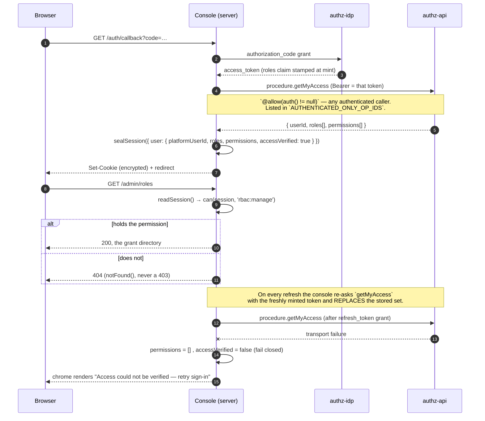
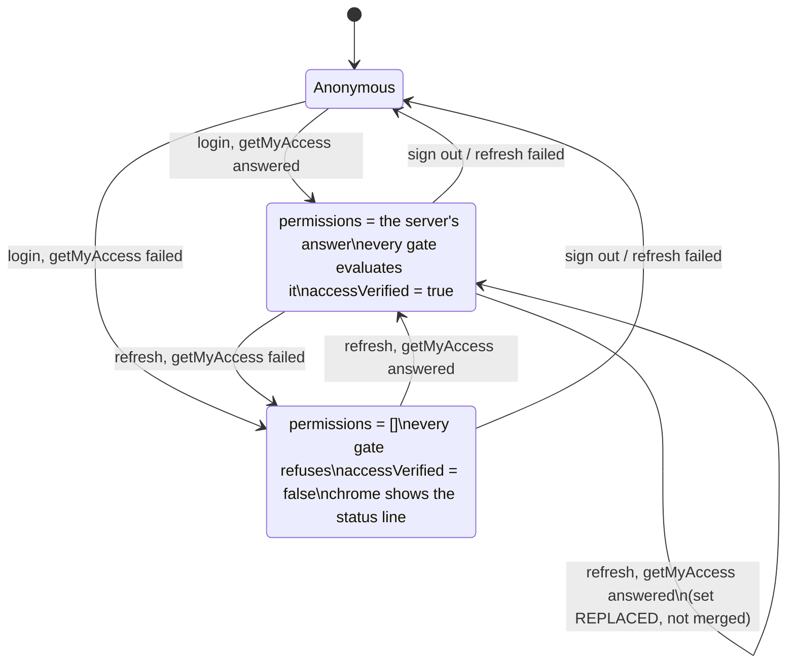
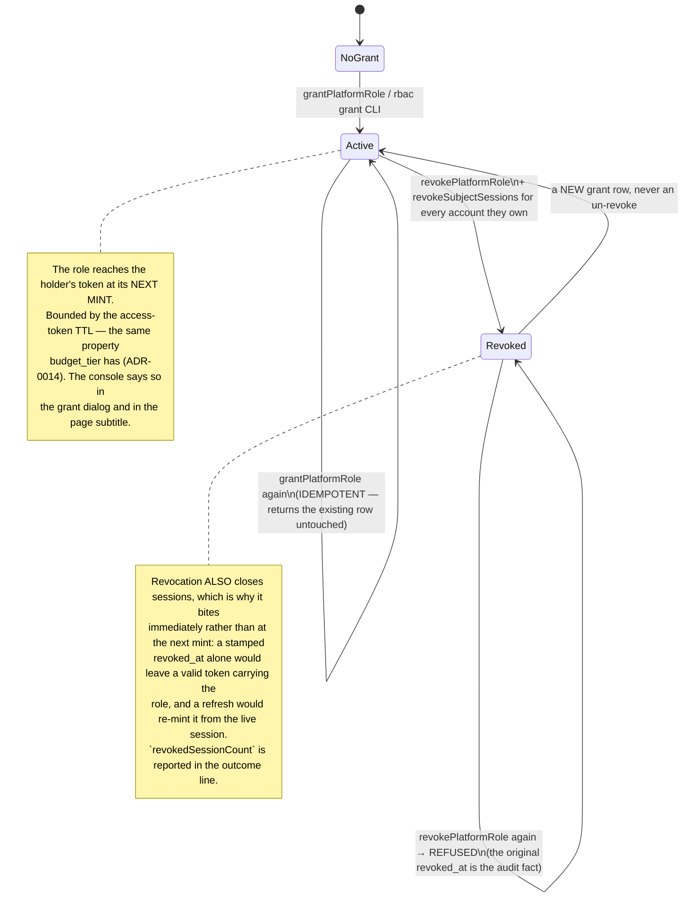
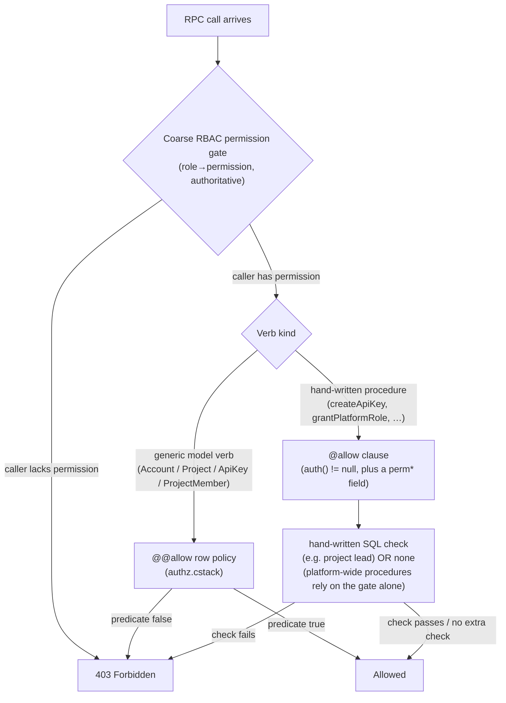

# Authorization and Permissions

> Sources:
>
> - `apps/console/src/shared/permissions.ts` (the console's permission vocabulary)
> - `apps/console/src/server/access.ts` (`fetchMyAccess`, `can()`), `apps/console/src/client/use-can.ts` (`useCan()`)
> - `packages/authz-rpc/schema/authz.cstack` (server-side `@allow` policies and procedure comments —
>   the closest thing to backend source available from this repo)
> - `packages/hooks/src/rbac.ts` (the **self-service** app's client-side RBAC mirror — no longer
>   used by the console; see "The mirror the console deleted" below)
>
> For authentication (login, tokens, refresh), see `auth-and-identity.md`.
> For who can see which accounts, see `../identity-and-account-visibility.md`.

---

## The rule

**The console never re-derives authorization.** It asks the backend what the caller may do, once
per session build, and gates on the answer.

`procedure.getMyAccess` returns `{ userId, roles[], permissions[] }` for the authenticated caller.
`permissions` are the canonical `resource:action` strings the server resolved the caller's roles
into — read back out of the very auth context every `@allow` clause in `authz.cstack` is evaluated
against, **not** re-derived. The console stores that array on the encrypted session cookie and
tests membership against it. There is no role → permission map in the console, no wildcard
expansion, and no `lightbridge-admin` special case.

### Why (the failure this replaced)

Until converse-frontends#452 the whole admin area hung on one predicate:

```ts
export function isAdmin(roles: string[]): boolean {
  return roles.includes('lightbridge-admin');
}
```

Production maps `owner → ["lightbridge-admin"]`
(`ai-helm-values/environments/prod/values/lightbridge-app.yaml`), and under ADR-0026 **every**
signed-in person owns an account. So that predicate answered `true` for the entire user base. Admin
was not a role anyone assigned; it was the default for everyone, and the "gate" gated nothing.

A permission the backend actually enforces cannot be conjured by a claim mapper's default. That is
the whole of the change.

---

## The flow





Two properties the state machine makes explicit:

- **There is no edge into a permission set the console invented.** `Unverified` is reachable, and
  from it every gate refuses. No transition produces "assumed admin".
- **A refresh REPLACES the set.** A revoked grant is expressed as an absence, so merging would keep
  a removed capability alive for as long as the browser kept refreshing.

---

## Where each piece lives

| Concern                                                                          | Module                                                                                                                         |
| -------------------------------------------------------------------------------- | ------------------------------------------------------------------------------------------------------------------------------ |
| The permission strings, `PLATFORM_ROLES`, `ADMIN_AREA_PERMISSIONS`               | `apps/console/src/shared/permissions.ts`                                                                                       |
| Fetching `getMyAccess`; server-side `can()` / `canAny()` / `canReachAdminArea()` | `apps/console/src/server/access.ts`                                                                                            |
| Storing it on the session cookie                                                 | `apps/console/src/server/session.ts`, `tokens.ts`, `oidc.ts`, `refresh-policy.ts`                                              |
| Handing the browser the resolved set (token-free)                                | `apps/console/src/shared/session-response.ts`, `app/layout.tsx`, `app/api/session/route.ts`                                    |
| Client-side `useCan()`                                                           | `apps/console/src/client/use-can.ts`                                                                                           |
| Nav filtering                                                                    | `apps/console/src/client/console-chrome.tsx` (`ADMIN_DESTINATIONS`, `adminNavGroups`, `settingsNavGroups`, `adminLandingHref`) |

### The gate table

Each route segment calls `can(session, …)` and `notFound()`s otherwise. The nav row that points at
it is filtered on the **same** string, declared beside it in `ADMIN_DESTINATIONS`, so a visible row
can never lead to a 404.

| Route                                                                     | Permission                     |
| ------------------------------------------------------------------------- | ------------------------------ |
| `/admin/overview`                                                         | `usage:read-all`               |
| `/admin/refills-queue`                                                    | `budget:review`                |
| `/admin/refill-policies`, `/admin/refill-policies/create`                 | `budget:policy-write`          |
| `/admin/roles`                                                            | `rbac:manage`                  |
| `POST /api/usage/**` estate-read fast path (`scope: all` / any `account`) | `usage:read-all`               |
| `ApiKeysLedger`'s `Del` row action                                        | `apikey:delete`                |
| `/settings/overview` budget-pressure card                                 | `budget:read-own`              |
| `/settings/overview` key-hygiene card                                     | `project:read` + `apikey:read` |

`/admin/usage*` (story C5/C6) gates on `usage:read-all`, `/admin/budget-schedules*` (C8) on
`budget:schedule-manage`, and `/admin/sessions` (C7) on `session:read` — each added by the story
that builds the route, never declared ahead of it.

**Admin is not one thing.** Holding **any one** of `ADMIN_AREA_PERMISSIONS` (`usage:read-all`,
`budget:review`, `budget:policy-write`, `budget:schedule-manage`, `rbac:manage`) makes the settings
area's "Admin" row appear and lets the admin chrome render; `adminNavGroups` then filters each row
individually. A reviewer holding only `budget:review` sees exactly one destination, and
`adminLandingHref` points the "Admin" row at _that_ destination rather than at a dashboard they
cannot open.

`notFound()`, never 403: a caller without the permission should not learn the route exists.

---

## Fail closed, and say which

`fetchMyAccess` never throws out of the session build. On failure it returns
`{ userId: '', roles: <the token's claim, for display only>, permissions: [], accessVerified: false }`.

`accessVerified` exists because "verified, and this person holds nothing" and "we could not ask" are
different facts that produce the identical screen — an empty nav. The chrome renders an
`InlineStatus` in the sidebar footer, _Access could not be verified — retry sign-in_, for the second
one only. A person seeing no admin area deserves to know which of the two happened.

The failure path deliberately does **not** fall back to the token's own role claim. That fallback
would make a broken `getMyAccess` invisible: the console would keep working, off exactly the claim
this design stopped trusting.

---

## Platform roles: a table, not a claim mapper

`platform_role_grants` (lightbridge-authz#656, ADR-0033) is what decides who holds a platform role.
`ClaimSource::PlatformRoles` stamps its **active** rows into the roles claim at token mint, unioned
with whatever the project-role mapper contributes.



`granted_by` NULL means **CLI bootstrap** (`lightbridge-authz rbac grant`) — the only way the first
admin can exist, since there is no admin to grant it. It is rendered as "CLI bootstrap", never as
"unknown".

`/admin/roles` (`apps/console/src/containers/admin-roles-centre.tsx`) is the console surface:
a `LedgerTable` of grants filtered by role and optionally including revoked ones, a "Grant role"
dialog whose person picker is a Base UI `Combobox` over `searchUsers` (minimum two characters,
explicit limit, `filter={null}` so the server's own ordering survives), and a revoke action gated by
a `TypedConfirmDialog` that requires the **role name** typed — a cuid2 grant id is not something a
human can proof-read, and the mistake the gate catches is "wrong role".

### Deployment order

**A2 → A5 → B3 → B1 → C9**, and it is not negotiable. Flipping the prod claim mapper (B1) before the
first-admin bootstrap (B3) has run locks every operator out of `/admin/*`. Until B1 ships, production
still maps `owner → lightbridge-admin`, so every signed-in person still holds every permission; with
C9 merged, the only visible change for a viewer-only user is that no admin area appears for them.

---

## The mirror the console deleted

`packages/hooks/src/rbac.ts` is a pure re-encoding of the backend's role → permission map:
`ALL_PERMISSIONS`, `DEFAULT_ROLE_PERMISSIONS`, `expandGrant()` (`'*'` → everything,
`'resource:*'` → that resource), and `usePermissions()` reading roles off the
`lightbridge_api_roles` claim.

**`apps/self-service` still uses it. `apps/console` does not, and must not.**

It went stale against production for two releases: prod's `oauth2.rbac.role_permissions` granted
`budget:self-refill`/`budget:read-own`/`session:revoke-own` to `lightbridge-editor`
(lightbridge-authz#325) while `DEFAULT_ROLE_PERMISSIONS` here did not, silently hiding the "Budget"
settings nav row from every production editor. A bare `'*'` grant also widens with every new
permission added to `ALL_PERMISSIONS`, whether or not anyone reviewed that role for that capability.

Both failure modes are _structurally absent_ from the console's design: there is no map to go stale
and no wildcard to widen, because the server sends the expanded set. `hasPermission` deliberately
does not honour `'*'` or `'resource:*'` — a wildcard arriving there would mean the backend changed
its contract, and quietly expanding it would be the console re-deriving authorization one
`startsWith` at a time. `apps/console/src/no-role-derived-gates.test.ts` is the repo-wide ratchet:
no `isAdmin` identifier, no `lightbridge-admin` literal in production code, no `ADMIN_ROLE`.

Migrating `apps/self-service` onto `getMyAccess` is the obvious follow-up and is **not** in this
story's scope.

---

## Server-side enforcement (unchanged, and still the actual boundary)

The console's gating is presentation. `lightbridge-authz` decides.



Two shapes worth keeping in mind:

- **Per-row `@@allow`** on generic model CRUD, e.g. `Project`:
  `@@allow("delete", isDefault != true && account.id == auth().id)`.
- **Coarse gate only** where no per-tenant predicate could exist. `grantPlatformRole` and
  `revokePlatformRole` are in this class, and say so: "there is no per-tenant ownership relation
  between an admin and an arbitrary target person for a `@@allow` to check, exactly as with
  `revokeSubjectSessions`". The same is true of every budget-policy procedure and of
  `usage:read-all`.

The console's own `usage-scope-guard.ts` is a third thing again: the usage backend authenticates the
_proxy_ by mTLS rather than the end caller, so for `scope: 'account'` that guard is the entire
per-account authorization story. It takes `canReadAllUsage` — computed server-side from the session's
permission set, never from request input — and that is what the estate-read fast path turns on.
