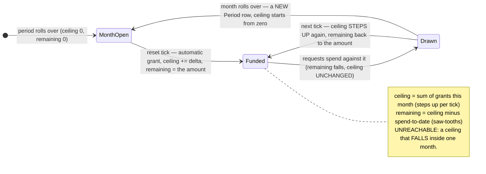
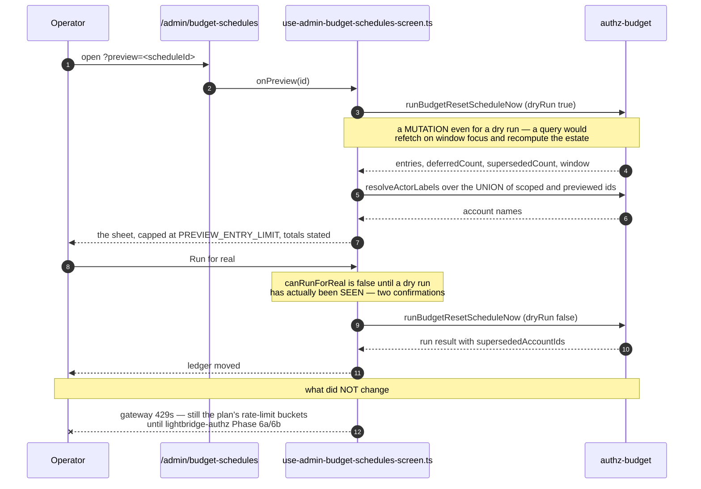
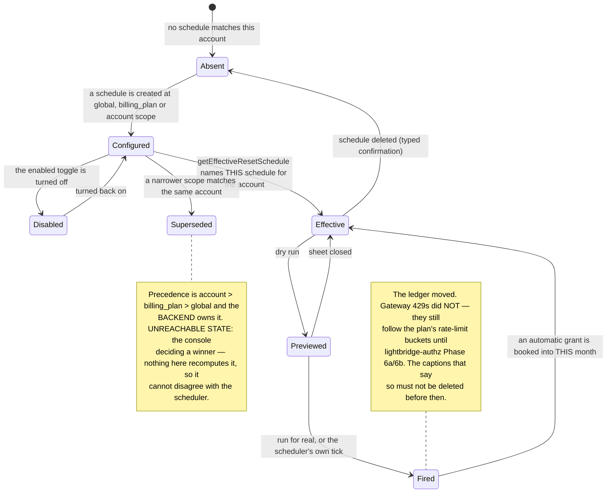

# Budget reset schedules, and what "ceiling" means under one

Two questions this page answers, because the second is the one people get wrong:

1. What `/admin/budget-schedules` does and what its dry-run preview guarantees.
2. **Ceiling vs reset period** — they are different things, and the old copy said something false
   about it.

The backend decision is
[lightbridge-authz ADR-0032](https://github.com/ADORSYS-GIS/lightbridge-authz/blob/main/docs/adr/0032-budget-reset-schedules.md);
the console surface is
[ADR 0015](../adr/0015-admin-console-v2-declarative-dashboards-permissions-export.md) D6.

---

## Ceiling is not a fact about the calendar month

That is the sentence four console surfaces used to carry, and it was **true only of the world before
reset schedules existed**. The correction lives with the code that renders it —
`apps/console/src/containers/budget-period-caption.ts` — and it is worth stating here too, because
the wrong reading survives in people's heads longer than in the source.

A reset schedule does **not** open a new period at each tick. It writes an `automatic` grant **into
the current month**, sized so that `remaining` lands back on the configured amount.

| Term             | Backed by                                 | Behaviour                                                                                                                                                                    |
| ---------------- | ----------------------------------------- | ---------------------------------------------------------------------------------------------------------------------------------------------------------------------------- |
| **Ceiling**      | `budget_balances.effective_budget_micros` | The **sum of every grant booked into this calendar month**. Grows monotonically within a month, steps up at every reset tick, and starts from zero when the month rolls over |
| **Reset period** | The schedule's own cadence                | How often `remaining` is **re-established**. Not a period the ceiling is measured over — a cadence that keeps adding to it                                                   |
| **Remaining**    | ceiling − spend-to-date                   | The only figure that behaves the way a reader expects a "budget" to: it saw-tooths back to the configured amount at each tick                                                |

So under a daily reset, a $60 ceiling on a $2/day account is **thirty $2 days already booked**, not
an allowance somebody granted. Say "budget period", never "billing period" — the ledger's `Period`
is a clock-free `YYYY-MM` string, nothing in this product bills against it, and calling it a billing
period sends a reader looking for an invoice that does not exist.

The caption is worded **per mode**, because `top_up` does the opposite of what "returns to $X"
claims: a reset returns `remaining` to the amount, a top-up **raises** it by the amount.

`budgetPeriodCaption` (`apps/console/src/containers/budget-period-caption.ts:97`) is a **pure function taking `now` as a
parameter**, like every adapter in that directory: "next in 6 h" is relative to when the schedule was
READ, not to when React happened to re-render.

---

## The screen

`/admin/budget-schedules`, gated on `budget:schedule-manage`
(`apps/console/src/app/(console)/admin/budget-schedules/page.tsx:32`), plus `/create`, `?edit=`,
`?preview=` and `?delete=`. The hook is
`apps/console/src/containers/use-admin-budget-schedules-screen.ts`.

Four reads, and each is the shape it is for a stated reason:

| Read                        | Shape                                                                                                                                                                                 |
| --------------------------- | ------------------------------------------------------------------------------------------------------------------------------------------------------------------------------------- |
| `listBudgetResetSchedules`  | **Unpaginated by design** — operator-authored configuration measured in tens of rows, not a ledger                                                                                    |
| `listBillingPlans`          | Shares the exact query key `use-tiers-screen.ts` already uses — one cache entry across the app                                                                                        |
| `resolveActorLabels`        | Runs on the **union** of scoped-row ids and preview-mentioned ids, so a preview fires no second identity round trip                                                                   |
| `runBudgetResetScheduleNow` | A **mutation even when `dryRun: true`** — modelling a preview as a query would let react-query refetch it on a window focus and fire an estate-wide plan computation nobody asked for |

**Precedence is never computed client-side.** When several schedules match one account the winner is
`account` > `billing_plan` > `global`, and the **backend** decides it: `getEffectiveResetSchedule`
answers for a single account, and a run result reports `supersededAccountIds`. Nothing in the console
recomputes that ordering, so it can never disagree with what the scheduler will do.

**The enabled toggle is optimistic with a real rollback.** The cache is written first, the previous
list is kept, and a failure restores it and states why **inline** rather than leaving the switch
showing a state the backend never accepted.

**Two confirmations before anything fires for real.** `canRunForReal` is offered only once a dry run
has actually been seen.

### The empty state is an honest sentence, not a placard

> No reset schedules yet. Until one exists, a new billing period starts every account at whatever
> its last grant left — nothing resets on its own.

(`NO_SCHEDULES_MESSAGE`, `use-admin-budget-schedules-screen.ts`.)

---

## Preview, then run

---

## The caption that must not be deleted

Budget schedules and refills change the **ledger balance** and the minted budget tier. They do
**not** change what a request experiences at the gateway, which still follows the plan's rate-limit
buckets until lightbridge-authz Phase 6a/6b lands. Every schedule and refill screen carries a
caption saying so. **Deleting those captions before 6a is what would make the screens lie.**

---

## Where the "next reset" reading appears

- `/admin/budget-schedules` — each row's own next/last run (`scheduleTiming`,
  `apps/console/src/containers/budget-schedule-rows.ts:119`), including whether an operator forced the next window.
- Budget cards on `/admin/overview`, `/accounts/<id>/overview` and the settings account lens — via
  `effectiveResetLabel` (`apps/console/src/containers/budget-schedule-rows.ts:171`) and `budgetPeriodCaption`.
- `/admin/usage/actors/<id>?type=account` — a hand-written "Budget & next reset" zone off
  `getBudgetBalance` + `getEffectiveResetSchedule`. It is an **RPC read, therefore not a panel** —
  the same reason `/admin/overview`'s budget zone is not one. See [`dashboards.md`](dashboards.md).

Every one of them goes through the same query key
(`effectiveResetScheduleQueryKey`, `apps/console/src/containers/budget-schedule-rows.ts:41`), so the reading is one cache entry,
not four independent fetches that can disagree.

---

## Cross-references

- [ADR 0015](../adr/0015-admin-console-v2-declarative-dashboards-permissions-export.md) D6
- [`admin-area.md`](admin-area.md) — the gate and the rest of the admin destinations
- [`comparison-windows.md`](comparison-windows.md) — the cadence a comparison reads, and why the
  budget zone was right when the panels were wrong
- [`i18n.md`](i18n.md) — why this caption is the hardest remaining string to translate
