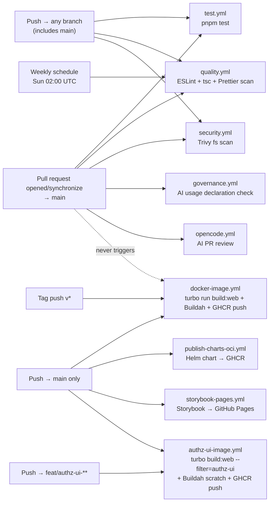
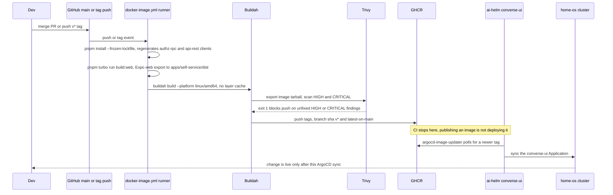

# CI/CD — Converse-frontends

> Source of truth: `.github/workflows/`. Verified directly against the YAML and against
> live workflow runs on GitHub Actions as of 2026-08-15, `main` @ `8ea2b6b`.

---

## Pipeline Overview

CI/CD is implemented with **GitHub Actions**, eight workflows under `.github/workflows/`.

**Runner:** every job in every workflow runs on GitHub-hosted **`ubuntu-latest`**
(`runs-on: ubuntu-latest`, confirmed in each workflow file). This repo ran on a
self-hosted `adorsys-gis-runner` pool with rootless Buildah baked in and an
integrated Turbo remote cache until
[#134 "ci: update GitHub Actions runners to ubuntu-latest"](https://github.com/ADORSYS-GIS/converse-frontends/pull/134)
(2026-07-31) moved every job to GitHub-hosted runners. A handful of in-repo comments
(e.g. `docker-image.yml`'s "Rootless Buildah on the self-hosted runner", `governance.yml`'s
"runs on the self-hosted adorsys-gis-runner like every other job in this repo") still
describe the pre-#134 topology and are stale — the `runs-on:` line in every workflow is
authoritative. Two concrete consequences of the switch, both still true today and neither
walked back anywhere else in this repo's docs:

- **No persisted Turbo cache.** See [Caching Strategy](#caching-strategy) below —
  `ubuntu-latest` runners are ephemeral, and no workflow adds an `actions/cache` step for
  `.turbo/` or a `TURBO_TOKEN`/`TURBO_API`/`TURBO_TEAM` remote-cache config, so every
  `turbo run` starts cold.
- **The quality pipeline's non-native scanners and reviewdog are no longer installed.**
  See [Known Gaps](#known-gaps) — `quality.yml` never installs them, and they were
  previously "pre-provisioned on the runner" (a self-hosted-runner-only assumption).

---

## Trigger Matrix

| Workflow                 | `pull_request` → `main`                 | `push` (any branch) | `push` → `main` only                                                                                                                           | Tag `v*`       | Schedule                  | `workflow_dispatch` |
| ------------------------ | --------------------------------------- | ------------------- | ---------------------------------------------------------------------------------------------------------------------------------------------- | -------------- | ------------------------- | ------------------- |
| `test.yml`               | ✅                                      | ✅                  | —                                                                                                                                              | —              | —                         | —                   |
| `quality.yml`            | ✅                                      | ✅                  | —                                                                                                                                              | —              | ✅ weekly (Sun 02:00 UTC) | ✅                  |
| `security.yml`           | ✅                                      | ✅                  | —                                                                                                                                              | —              | —                         | —                   |
| `governance.yml`         | ✅ (opened/edited/synchronize/reopened) | —                   | —                                                                                                                                              | —              | —                         | —                   |
| `opencode.yml`           | ✅ (opened/synchronize)¹                | —                   | —                                                                                                                                              | —              | —                         | —                   |
| `docker-image.yml`       | ❌ **never**                            | —                   | ✅                                                                                                                                             | ✅             | —                         | ✅                  |
| `authz-ui-image.yml`     | ❌ **never**                            | —                   | ✅ ² (+ `feat/authz-ui-**`; paths: `apps/authz-ui/**`, `packages/ui-web/**`, `pnpm-lock.yaml`, `pnpm-workspace.yaml`, `turbo.json`, own files) | ❌ **never** ³ | —                         | ✅                  |
| `publish-charts-oci.yml` | —                                       | —                   | ✅ (paths: `charts/**`)                                                                                                                        | —              | —                         | ✅                  |
| `storybook-pages.yml`    | —                                       | —                   | ✅ (paths: `packages/ui/**`)                                                                                                                   | —              | —                         | ✅                  |

¹ `opencode.yml` also runs on `issue_comment` and `pull_request_review_comment` (for the
`/oc` slash-command path), and is a no-op unless the `OPENCODE_GATEWAY_AUDIENCE` repo/org
variable is set.

² `authz-ui-image.yml` is the **one** workflow here that publishes an image from a feature branch,
and that is deliberate rather than an oversight in the "no per-branch preview image" rule below.
Its output is consumed by a _different repository_ at a digest pin
(`ADORSYS-GIS/lightbridge-authz#591` replaces that repo's entire `frontend` build stage with a pull
of this image), so the cutover has to be provable before either side merges. A push to a branch
matching `feat/authz-ui-**` publishes `sha-<gitsha>` and `<branch-slug>`; `latest` stays gated on
`{{is_default_branch}}` and can never be produced off a feature branch.

³ No `v*` tag trigger, unlike `docker-image.yml`. A `push:` block applies its `paths:` filter to tag
pushes as well, and GitHub evaluates that filter against the tagged commit's own diff — so a release
tag cut on a commit that did not touch `apps/authz-ui/` would silently produce no image. Since this
bundle is consumed by digest (never by semver) and every commit that changes it already gets a
`sha-` image on `main`, the tag trigger would buy nothing and cost a silent gap.
`workflow_dispatch` is the manual escape hatch.



The dashed edge is the load-bearing line in this diagram: **no event a PR can raise ever
reaches `docker-image.yml`.** That workflow is the only place `pnpm turbo run build:web`
(the real Expo web export) actually runs in CI. See [Known Gaps](#known-gaps).

`docker-image.yml`'s `push.branches` list also names
`8-align-lightbridge-ui-with-authz-usage-apis-before-deployment`, a branch that no longer
exists on the remote (`git ls-remote --heads origin` returns nothing for it) — a harmless
leftover, not a live trigger.

---

## Known Gaps

These are real, verified against the current workflow files and live CI runs, not inferred
from workflow names. They are the most important content in this document.

### 1. `docker-image.yml` never runs on `pull_request` — no PR can fail the web build

`docker-image.yml` triggers only on `push` to `main` (+ the dead branch above), `push` of a
`v*` tag, and `workflow_dispatch` (`.github/workflows/docker-image.yml:3-10`). It is the
only workflow that runs `pnpm turbo run build:web` — the actual `expo export --platform web`
that produces `apps/self-service/dist`. None of the PR-triggered workflows (`test.yml`,
`quality.yml`, `security.yml`) build the web export; `test.yml` runs `pnpm test` (Jest
unit tests) and `quality.yml` runs ESLint/tsc/Prettier/SAST scans, neither of which invokes
Expo's bundler. A change that breaks the Expo web export can merge to `main` and stay there
across any number of subsequent PRs — none of which re-run `build:web` either — until the
next push to `main` triggers `docker-image.yml` and the build fails there, post-merge, on
someone else's unrelated change. This is exactly what happened: a broken web export sat in
`main` across six unrelated merges before it was caught; the last known-green image predates
2026-08-01.

### 2. No PR-level `tsc` gate

`tsc` does run in CI — `quality.yml` → `.ci/quality/run.sh` type-checks every workspace's
`tsconfig.json` (`apps/self-service`, `packages/ui`, etc.) via `pnpm exec tsc --noEmit -p
<cfg>`. But nothing in the pipeline turns a `tsc` finding into a failed PR check today:

- `.ci/quality/gate.sh` is deliberately designed to fail _only_ on a scanner
  crashing/misconfiguring — it explicitly never fails on the number of findings in the
  merged SARIF (`.ci/quality/gate.sh:6-17`), by design, so it doesn't fail every PR on the
  pre-existing backlog.
- The one mechanism meant to fail a PR on a _new_ `error`-level finding is reviewdog
  (`-filter-mode added -fail-level=error`, `.github/workflows/quality.yml:101-105`). On the
  current `ubuntu-latest` runner it is not installed (see Gap 4 below) — the step prints
  `reviewdog not found in PATH; skipping PR check` and exits `0` unconditionally, on PR runs
  included.

Metro/Expo's bundler (the thing `docker-image.yml` runs, and which never runs on a PR
either — Gap 1) does not type-check. So `pnpm build` (`turbo run build:web`) succeeds on
code `tsc` rejects, and no CI step gated on a PR currently disagrees. A dependency-bump PR
nearly shipped a type regression today for exactly this combination of reasons.

### 3. `pnpm lint` fails on `main` today — verified numbers, not the ones quoted at scoping time

The root `lint` script (`package.json`) is:

```
eslint "**/*.{js,jsx,ts,tsx}" && prettier -c "**/*.{js,jsx,ts,tsx,json,css,md}"
```

Run against `main` @ `8ea2b6b`, this **fails at the ESLint stage** — `pnpm lint` exits `1`
before Prettier's half ever runs, because of the `&&`:

- **ESLint: 6 errors, 129 warnings, 135 problems.** All 6 errors are
  `react-hooks/rules-of-hooks` violations — a `useState` call inside a Storybook `render`
  arg function (not a component or a hook by naming convention) — across
  `packages/ui/src/components/{pagination,segmented-control,select}/component.stories.tsx`.
- Running Prettier's check **independently of ESLint** — which is what
  `.ci/quality/run.sh` actually does in CI, since it invokes each tool separately rather
  than via `pnpm lint` — finds **91 files** not matching Prettier formatting: 46 `.md`,
  30 `.tsx`, 8 `.ts`, 4 `.json`, 3 `.js`. That's roughly half markdown, not
  "overwhelmingly markdown," and nowhere near "~960 files" — verify with
  `pnpm exec prettier -c "**/*.{js,jsx,ts,tsx,json,css,md}"` yourself if the number matters
  to a decision; it will drift as the backlog is worked down or grows.

CI's "Code Quality Scan" job (`quality.yml`) passes on this same commit anyway, for two
independent reasons layered on top of each other:

1. `gate.sh` never fails on finding counts by design (see Gap 2).
2. reviewdog — the only mechanism that could fail a PR check on these findings — isn't
   installed on the runner (Gap 4), so it no-ops regardless of what ESLint/Prettier find.

The documented local command (`pnpm lint`) and the CI gate (`quality.yml`) therefore
disagree, and will keep disagreeing until either the local script's findings are fixed or
the CI gate is reconnected.

### 4. The quality pipeline's non-native scanners, and reviewdog, are not installed on the current runner (found during this verification pass, not in original scope)

`quality-pipeline.md` documents Semgrep, Hadolint, Actionlint, jscpd, and reviewdog as
"pre-provisioned on the runner." That was true of the retired self-hosted
`adorsys-gis-runner`; it is not true of `ubuntu-latest`, and `quality.yml` never installs
any of them (no `apt`/`pip`/`go install`/`npm install -g` step for any of the five). Verified
against a real `pull_request`-triggered run
([run 31891626188](https://github.com/ADORSYS-GIS/converse-frontends/actions/runs/31891626188),
PR #167, 2026-08-15):

```
[4/7] Semgrep    ⊘ semgrep not found; skipping
[5/7] Hadolint   ⊘ hadolint not found; skipping
[6/7] Actionlint ⊘ actionlint not found; skipping
[7/7] jscpd      ⊘ jscpd not found; skipping
...
reviewdog not found in PATH; skipping PR check
```

`run.sh`'s tool-absence handling treats "not found" as `skipped`, not `error`, so this
doesn't fail `gate.sh` either — it's silent. In practice, on every PR today: ESLint,
TypeScript, and Prettier are the only scanners that actually execute (all three ship via
`pnpm`/`node`, already installed for the rest of the job), and none of their output can fail
the PR check because reviewdog — the diff-aware, fail-on-`error` reporter — isn't present to
post it. This is the mechanism behind Gap 3, not just stale numbers: the enforcement path is
currently absent, not merely miscalibrated.

---

## Workflows

### `test.yml` — Unit tests

Triggers: `pull_request` → `main`, `push` to any branch. Installs deps (`pnpm install
--frozen-lockfile`, which also regenerates the gitignored RPC/REST clients via
`postinstall` — see [Codegen](#codegen)) and runs `pnpm test` (`pnpm -r --if-present run
test`, i.e. Jest per-workspace).

### `quality.yml` — Code Quality Scan

Triggers: `pull_request` → `main`, `push` to any branch, weekly schedule (Sun 02:00 UTC),
`workflow_dispatch`. Runs `.ci/quality/run.sh` (ESLint, TypeScript, Prettier, Semgrep,
Hadolint, Actionlint, jscpd — the last four currently skipped, see Gap 4), merges SARIF,
applies `.ci/quality/gate.sh` (fails only on a scanner crash), optionally uploads to GitHub
Code Scanning on `main` if `vars.ENABLE_CODE_SCANNING == 'true'`, and attempts a reviewdog PR
comment (currently a no-op — Gap 4). Full architecture in `docs/quality-pipeline.md`.

### `security.yml` — Security Audit

Triggers: `pull_request` → `main`, `push` to any branch. Delegates entirely to the reusable
`ADORSYS-GIS/ai-governance/.github/workflows/security-gates.yml` workflow (pinned to an
immutable commit SHA), configured for a filesystem Trivy scan (`trivy-scan-type: fs`,
`trivy-target: .`) — dependency/config scanning, not the container image (the image itself
is scanned separately, inside `docker-image.yml`, via `aquasecurity/trivy-action`).

### `governance.yml` — AI Governance

Triggers: `pull_request` (opened/edited/synchronize/reopened). Delegates to the reusable
`ADORSYS-GIS/ai-governance/.github/workflows/governance-check.yml` (pinned SHA), which fails
the PR if its description is missing an AI Usage Declaration, a source-of-truth reference, or
verification evidence, and posts a sticky comment listing what's missing.

### `opencode.yml` — Agentic code review

Triggers: `pull_request` (opened/synchronize), `issue_comment` (created), `pull_request_review_comment`
(created). No-ops unless the `OPENCODE_GATEWAY_AUDIENCE` variable is set. Delegates to the
reusable `ADORSYS-GIS/ai-governance/.github/workflows/opencode-review.yml` (pinned SHA),
authenticating to the AI gateway via GitHub OIDC (`id-token: write`), no shared secret.
(The earlier Qwen-based review/triage subsystem — `qwen-review.yml`, `qwen-dispatch.yml`,
`qwen-invoke.yml`, `qwen-triage.yml`, `qwen-scheduled-triage.yml` — was removed; it had
become noise rather than signal. None of those files exist in `.github/workflows/` today.)

### `docker-image.yml` — Docker Image Build & Push

Triggers: `push` to `main` (+ the dead branch noted above), `push` of a `v*` tag,
`workflow_dispatch`. **Never `pull_request`** — see Gap 1. This is the primary delivery
pipeline: the web bundle is built **on the runner** via Turbo, then baked into a thin nginx
image with Buildah — the image itself has no build stage, no Node/pnpm, and no Docker/BuildKit
layer cache.

```
Trigger: push to main / v* tag / workflow_dispatch   (NEVER pull_request)
       │
       ▼  (on ubuntu-latest)
   Checkout → pnpm install (runs codegen via postinstall) → turbo run build:web
       │                                                     → apps/self-service/dist
       ▼
   Extract metadata (tags, labels) · buildah login to ghcr.io
       │
       ▼
   buildah build (amd64, no layer cache) → export tar → Trivy scan (HIGH/CRITICAL, gates push)
       │
       ▼
   buildah push (all tags)
```

### `publish-charts-oci.yml` — Helm Chart Publish

Triggers: `push` to `main` with `paths: charts/**` (or the workflow file itself),
`workflow_dispatch`. Packages every non-library chart under `charts/` and pushes it to GHCR
as an OCI artifact at `oci://ghcr.io/adorsys-gis/charts/<name>` — no gh-pages Helm repo. The
version is derived at publish time (`MAJOR.MINOR` from `Chart.yaml` + a patch equal to the
commit count touching the chart's directory) and never committed back, so the workflow can't
re-trigger itself. Idempotent — skips a version already published. Uses the built-in
`GITHUB_TOKEN` with `packages: write`.

### `storybook-pages.yml` — Storybook → GitHub Pages

Triggers: `push` to `main` with `paths: packages/ui/**` (or the workflow file itself),
`workflow_dispatch`. Builds Storybook via `pnpm turbo run build-storybook` and deploys the
static output to GitHub Pages via `actions/deploy-pages`.

---

## Codegen

`packages/authz-rpc/generated/` and `packages/api-rest/src/client/` are both gitignored
build output — schema/OpenAPI-driven RPC/REST clients, never hand-edited.

**Current state, verified:** `packages/authz-rpc/package.json`'s codegen script is named
plain `codegen` (not `codegen:cratestack` — that name no longer exists anywhere in the repo,
confirmed by `grep -rn "codegen:cratestack"` returning nothing). The rename landed in
[#159 "fix(authz-rpc): make `pnpm install` regenerate the RPC client"](https://github.com/ADORSYS-GIS/converse-frontends/pull/159)
(2026-08-15): the root `codegen:all` script (`pnpm -r --if-present ... run codegen`) only
ever matched scripts literally named `codegen`, so the old `codegen:cratestack` name was
silently skipped by `--if-present` — `packages/authz-rpc/generated/` was never produced by a
plain `pnpm install`, only by CI's own separate, now-removed, curl-the-binary-then-run step.

**Locally and in CI alike, today:** a bare `pnpm install` regenerates both clients
unconditionally, via the root `postinstall` → `codegen:all` chain. `@cratestack/cli` (pinned
exact, `0.7.16` — a lockstep contract with lightbridge-authz's deployed `cratestack`/
`cratestack-pg`, see `packages/authz-rpc/README.md`) is a `devDependency` of `authz-rpc`
whose own postinstall fetches the matching Rust binary from GitHub Releases; it's allowlisted
under `pnpm-workspace.yaml`'s `onlyBuiltDependencies` so pnpm 11 actually runs that
postinstall. No separately-installed tooling, no PATH setup, no cache/curl steps in
`test.yml` or `docker-image.yml` anymore — both were simplified in #159 to a single `pnpm
install --frozen-lockfile`.

**Turbo wiring**, added on top in
[#161 "feat(codegen): wire codegen into Turbo, closing the gap left by #159"](https://github.com/ADORSYS-GIS/converse-frontends/pull/161)
(2026-08-15): `codegen` is a real Turbo task (root `turbo.json`) for both `authz-rpc` and
`api-rest`, and `build:web`/`build-storybook` declare it as a `dependsOn` — so `turbo run
build:web` (what `docker-image.yml` runs) pulls codegen through the same cache instead of
regenerating unconditionally on every build. `packages/api-rest/turbo.json` overrides that
package's `codegen` inputs to include `openapi/usage.backend.yaml` (which lives outside the
package directory and isn't covered by Turbo's default per-package hashing). This is a cache
layered on top of the unconditional `postinstall` regeneration above, not a replacement for
it — `pnpm install` still always regenerates from scratch regardless of Turbo cache state.

---

## Required Checks

No required status checks are enforced at the workflow level (branch protection rules are
configured on GitHub, not in YAML). As a convention per `AGENTS.md`:

- All CI checks must pass before a PR can be merged
- At least one approving review is required
- PRs must have a clear description

---

## Caching Strategy

Caching is handled by **Turborepo**, not by the Docker build — but see the runner note
above: since the #134 migration to ephemeral GitHub-hosted `ubuntu-latest` runners, **no
workflow persists a Turbo cache across runs.** There is no `actions/cache` step for `.turbo/`
in any workflow, and no `TURBO_TOKEN`/`TURBO_API`/`TURBO_TEAM` remote-cache configuration
anywhere in the repo. Every `turbo run build:web` / `turbo run build-storybook` /
`turbo run codegen` therefore starts cold on every job — the previous self-hosted runner's
"integrated Turbo remote cache" and the `>>> FULL TURBO` instant-replay behavior it enabled
no longer apply. `pnpm/action-setup` + `actions/setup-node`'s `cache: 'pnpm'` still caches
the **pnpm store** (via `actions/cache` under the hood, keyed on `pnpm-lock.yaml`) — that's
a dependency-install cache, unrelated to Turbo's task-output cache, and still functions
normally.

The Docker build itself is deliberately **uncached**: no `--layers`/`--cache-from`/`--cache-to`
in the Buildah invocation — caching, to the extent any exists post-#134, is meant to live in
Turbo. (Note: `.turbo/` must stay in `.gitignore` regardless — otherwise Turbo counts its own
run logs as task inputs and never hits even an in-job cache.)

---

## Build-and-Deploy Chain

**This repo's CI does not deploy.** `docker-image.yml` publishes a container image to GHCR;
getting that image running in the cluster is a separate hop, owned by ArgoCD in the
`ai-helm` repo. "Image built" is not "live."



The Helm chart itself follows a parallel, separate path: `publish-charts-oci.yml` packages
`charts/converse-frontend/` and pushes it to `oci://ghcr.io/adorsys-gis/charts/converse-frontend`
on merges that touch `charts/**`. `ai-helm`'s `converse-ui` Application floats on a semver
range against that OCI chart, while `argocd-image-updater` (shown above) separately tracks
the container image tag. Both are driven by ArgoCD reconciling against the `home-os` cluster
— nothing in this repo's CI initiates that reconcile.

---

## Artifacts & Releases

- **Container images** are pushed to GitHub Container Registry (GHCR), in three distinct packages:
  - `ghcr.io/adorsys-gis/converse-frontends` — the legacy self-service/Expo image (no longer built here)
  - `ghcr.io/adorsys-gis/converse-frontends/console` — `docker-image.yml`
  - `ghcr.io/adorsys-gis/converse-frontends/authz-ui` — `authz-ui-image.yml`; an **assets-only**
    `FROM scratch` image whose entire contents are `apps/authz-ui/dist/` at `/dist`. It is never
    deployed as a workload; `lightbridge-authz` pulls it at container-build time at a digest pin.
- **Image tags** generated per build:
  - `branch-name` — for branch pushes (in practice, only `main` and the dead branch above)
  - `v*` — for version tags (semver)
  - `sha-<short>` — for every build (commit SHA)
  - `latest` — only on pushes to the default branch (`main`)
- Images are built **single-arch** (`linux/amd64`) — every cluster node is amd64
- Built with rootless **Buildah**; a **Trivy** scan (HIGH/CRITICAL, `ignore-unfixed`) gates the push
- **No SBOM or signing** is configured in the current workflows

---

## Environments & Promotion

| Environment | Trigger                               | Image Used                                     |
| ----------- | ------------------------------------- | ---------------------------------------------- |
| Production  | Push to `main`, or push of a `v*` tag | `ghcr.io/...:latest` / `ghcr.io/...:v<semver>` |

There is no per-branch preview image: `docker-image.yml` only triggers on `main` and on
tags (Gap 1), so a feature branch never gets a `ghcr.io/...:<branch-name>` image built for
it despite the tag pattern (`type=ref,event=branch`) existing in the metadata step —
that pattern only ever fires for the branches the workflow actually triggers on.

The one exception is `authz-ui-image.yml`, which publishes from `feat/authz-ui-**` on purpose
(footnote ² above). It has no ArgoCD Application and no `argocd-image-updater` watch — the artifact
is a build-time input to another repo, not a deployable workload — so a feature-branch image there
cannot reach any cluster.

Deployment to Kubernetes is driven by a separate GitOps process (ArgoCD in the `ai-helm`
repo, targeting the `home-os` cluster) — see [Build-and-Deploy Chain](#build-and-deploy-chain)
above. Its `converse-ui` Application consumes the chart published to
`oci://ghcr.io/adorsys-gis/charts/converse-frontend` and floats on a semver range, while
`argocd-image-updater` tracks the container image tag. For local/manual work, install the
chart from `charts/converse-frontend/`.

Rollback: re-deploy a previous image tag via Helm. See `runbooks.md` for the rollback procedure.

---

## Secrets Management

`docker-image.yml` authenticates to GHCR using the built-in `secrets.GITHUB_TOKEN` (auto-issued and rotated per workflow run), not a custom PAT — the job's `permissions: { packages: write }` is sufficient on its own. This replaced an earlier `GHCR_TOKEN` custom PAT, which expired ~90 days after creation and caused every `docker-image` run to fail at the login step until fixed.

For manual/local pushes outside CI (see the "Rebuild and Push Docker Image Manually" runbook), a personal PAT with `write:packages` scope is still required, since `GITHUB_TOKEN` only exists inside Actions runs.

Runtime secrets (Keycloak credentials, backend URLs) are **not** stored in GitHub. They are injected at deploy time via Helm values or Kubernetes secrets. See `infrastructure.md` for runtime secret injection details.
