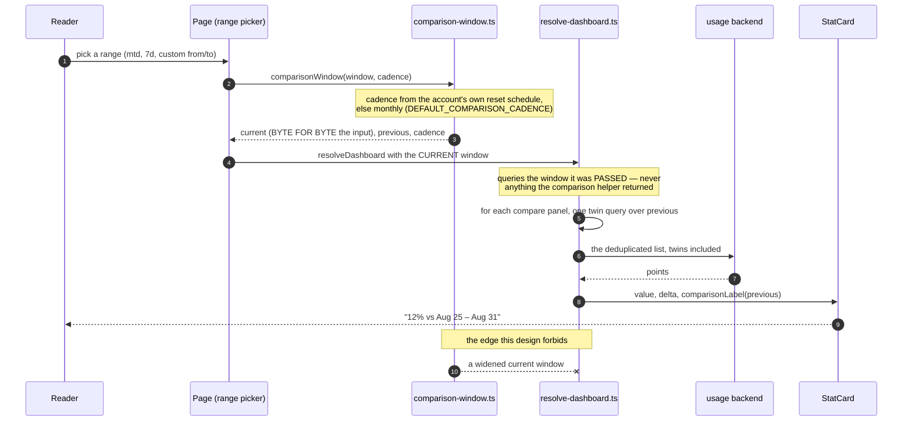
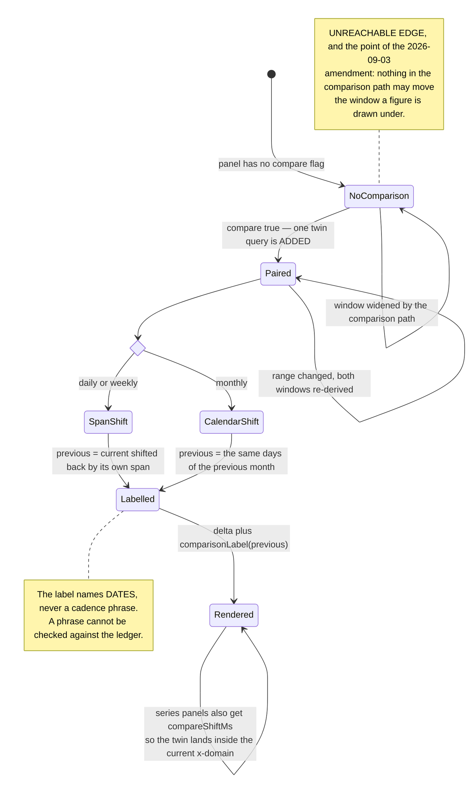

# Comparison windows — additive, and the picked window never moves

One helper, `comparisonWindow` (`apps/console/src/containers/comparison-window.ts:91`), replacing the
two half-implementations that existed before. The decision, the incident that forced its amendment,
and why a seven-day floor could not simply move to the comparison side are
[ADR 0015](../adr/0015-admin-console-v2-declarative-dashboards-permissions-export.md) D3 (amended
2026-09-03, [#483](https://github.com/ADORSYS-GIS/converse-frontends/pull/483)).

This page is the rule, stated so you can check a figure against it.

---

## The rule

1. **The current window is exactly the window the page was given** — the range picker's own.
   Nothing in the comparison path may move it. `resolveDashboard` asserts this structurally by
   querying the window it was passed rather than anything the comparison helper returns.
2. **A comparison is additive.** It adds one twin query over its own window and changes nothing
   else. The twin is deduplicated like any other query.
3. **The comparison window is the previous window of the same length**, ending exactly where the
   current one begins — never overlapping (so a figure is never compared partly with itself), never
   a different length (so the delta is a real ratio).
4. **`monthly` shifts by a calendar month instead.** Months are 28–31 days, so "the same days of the
   previous month" is computed on the calendar. A 30-day shift would compare 1–15 March against
   30 January–13 February.
5. **The delta names its window by date** — "12% vs Aug 25 – Aug 31" (`comparisonLabel`,
   `apps/console/src/containers/comparison-window.ts:136`) — never a cadence phrase. A phrase cannot be checked against the
   ledger; two dates can.
6. **Estate-wide pages get `monthly`** (`DEFAULT_COMPARISON_CADENCE`, `apps/console/src/containers/comparison-window.ts:68`).
   They have no single actor and therefore no cadence to read, and month matches both the console's
   `mtd` default range and the budget domain's own calendar-month `Period`.

Two implementation details that are load-bearing rather than tidy:

- **The current window is copied, never aliased** (`apps/console/src/containers/comparison-window.ts:96`). `resolve-dashboard.ts`
  reads `current` back out to build every query on the page, so a caller mutating the `Date` it
  passed in must not be able to move them.
- **The end is stated inclusively** in the label. A window ending at `2026-09-01T00:00:00Z` covers up
  to and including 31 August, and printing "Aug 25 – Sep 1" would claim a day that is not in it. An
  end that is not on a midnight boundary — an `mtd` window ends at "now" — is printed as its own day.

---

## What went wrong before, in one line

A seven-day floor widened the **current** window and handed the widened window back for
`resolveDashboard` to query, so every panel on the page moved with it. On a three-day range
`actor-total-cost` read a real **seven-day** total under a header that said three days. The "Budget
& next reset" zone next to it read the budget period directly, never went through the helper, and was
right. The floor is gone; the delta stating its own dates is what answers the concern the floor
existed for.

---

## `compareShiftMs`, for series panels

For a `series` panel the resolver also computes how far forward the previous window's timestamps must
be moved to sit under the current one. Plotting the twin at its real dates would **double the chart's
x-domain** and squeeze the current period into half the board.

This is also why the floor could not move to the comparison side: a three-day current window against
a widened seven-day previous one makes the delta a ratio of unequal spans **and** plots a seven-day
dashed line across a three-day chart — precisely the defect the shift exists to prevent.

---

## The flow, and the states a comparison can be in

---

## Using it

Declare `compare: true` on the panel in `dashboards.yaml`. That is the whole surface — the resolver
adds the twin, the dedupe treats it like any other query, and the adapter attaches the delta and its
label. See [`dashboards.md`](dashboards.md).

Two headline totals per page is the working norm (`/admin/usage` compares exactly two, pinned by
`admin-usage-page.test.ts`). A comparison costs a request; a page of eleven comparing panels is
eleven extra requests for a reading nobody asked for.

---

## Cross-references

- [ADR 0015](../adr/0015-admin-console-v2-declarative-dashboards-permissions-export.md) D3
- [`dashboards.md`](dashboards.md) — where `compare` is declared and how it is deduplicated
- [`budget-schedules.md`](budget-schedules.md) — where the cadence comes from
