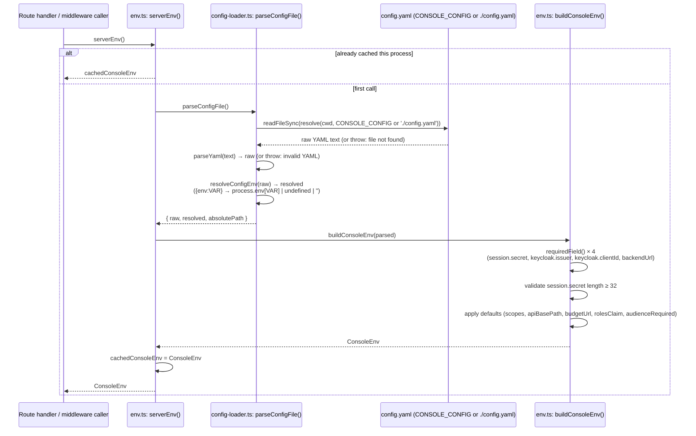
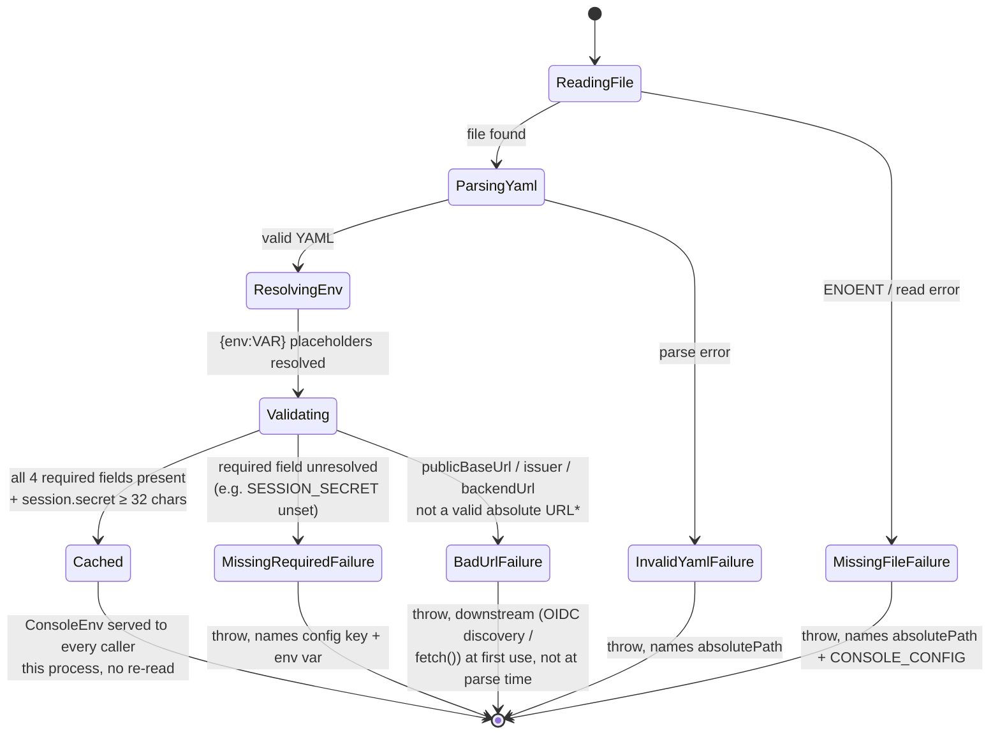
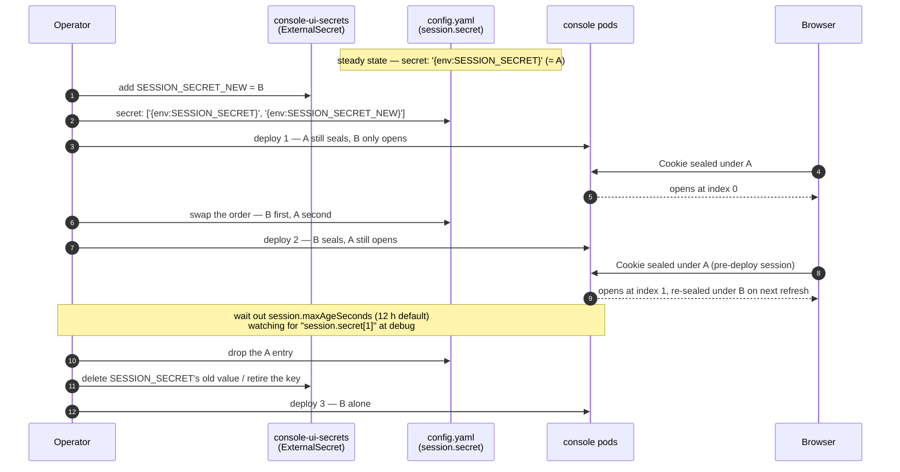
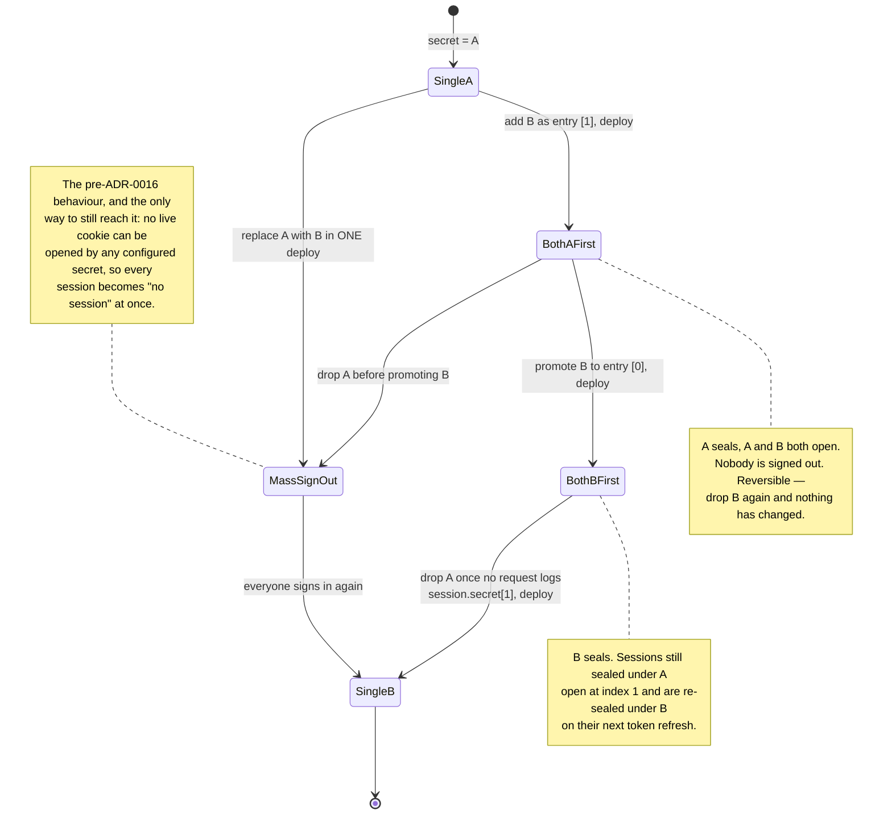
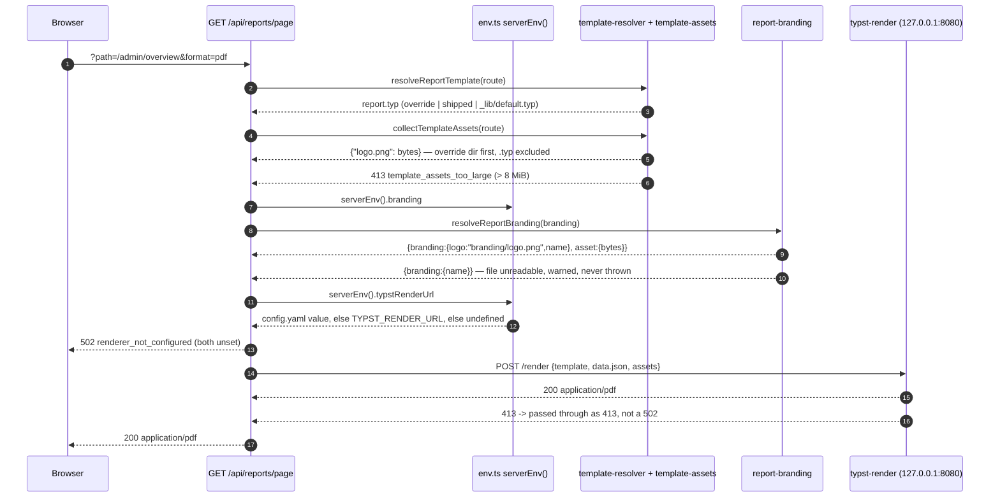
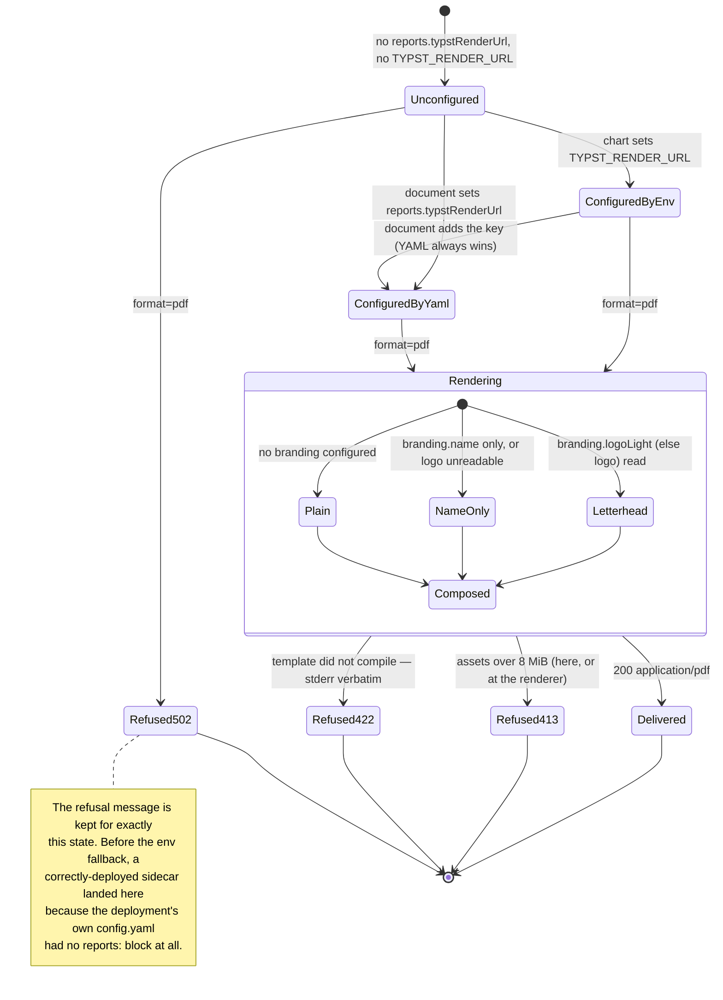

# apps/console — Server Configuration (`config.yaml`)

> Sources:
>
> - `apps/console/src/server/config-loader.ts` — YAML read/parse + `{env:VAR}` resolution
> - `apps/console/src/server/env.ts` — typed `ConsoleEnv`, defaults, validation, `serverEnv()`
> - `apps/console/config.yaml` — the primary config document (committed, dev defaults)
> - `apps/console/config.wiremock.yaml` — the wiremock-backed dev variant
> - `apps/console/.env.example` — the only two env vars `config.yaml` references, plus
>   `CONSOLE_CONFIG` itself
>
> For the auth/session model that consumes `keycloak.*` and `session.secret`, see
> `auth-and-identity.md`. For the proxy layer that consumes `backendUrl`/`apiBasePath`/`budgetUrl`/
> `usageUrl`, see `rpc-and-codegen.md`.

---

## Why YAML, not `.env`

`apps/console` deliberately does **not** follow the Expo apps' `EXPO_PUBLIC_*` / `.env` convention.
Its config is **YAML-first**, matching `lightbridge-authz`'s `config/default.yaml` shape (owner
directive, recorded in both `config-loader.ts`'s header comment and `config.yaml`'s own header):

- `config.yaml` (checked into git, at the app root) is the **primary config document** — session,
  Keycloak/OIDC, backends, and public origin all live there as plain YAML.
- `.env`/`.env.local` supply **only** the environment variables that `config.yaml`'s `{env:VAR}`
  placeholders reference — in practice just two: `SESSION_SECRET` (required) and
  `KEYCLOAK_CLIENT_SECRET` (optional) — plus the loader-selection variable `CONSOLE_CONFIG` itself.
- Nothing here ever reaches the browser (ADR 0009 Decision 3: the console is the only exposed
  origin, the browser only ever talks to same-origin `/api/*`). There is no `EXPO_PUBLIC_*`/
  `config.json`/envsubst machinery to mirror.

The rule for **where a new value belongs**: is it a genuine secret (session key material, a
confidential client secret)? It's a `{env:VAR}` placeholder. Is it a safe value to check in for
local dev, even if a real deployment would want something different (an issuer URL, a backend
URL)? It's a plain YAML literal — a real deployment ships its **own** `config.yaml` and points
`CONSOLE_CONFIG` at it, rather than overriding individual non-secret fields through the
environment.

---

## Key schema

All types, required/optional status, and defaults below are read directly out of
`buildConsoleEnv()` in `apps/console/src/server/env.ts` (`RawConsoleConfig`/`RawKeycloakConfig` for
shape, `requiredField`/`asStringWithFallback`/`parseBoolean`/`parseAudienceList` for the
required/default rules) and cross-checked against the literals shipped in `apps/console/config.yaml`.

| YAML key                        | Type                                           | Required | Default when absent                                                                         | Notes                                                                                                                                                                                                                                                                                                                                                                                                                                                                                      |
| ------------------------------- | ---------------------------------------------- | -------- | ------------------------------------------------------------------------------------------- | ------------------------------------------------------------------------------------------------------------------------------------------------------------------------------------------------------------------------------------------------------------------------------------------------------------------------------------------------------------------------------------------------------------------------------------------------------------------------------------------ |
| `session.secret`                | string **or** list of strings, each ≥ 32 chars | **Yes**  | — (fails fast)                                                                              | JWE key material (A256GCM via HKDF). A string normalises to a one-entry list; **entry `[0]` seals, every entry is tried on open** — that is the rotation mechanism (ADR 0016 D3.2, and "Rotating `session.secret`" below). `env.ts` throws if any present entry resolves shorter than 32 characters, naming its index; a list entry whose `{env:VAR}` is unset is **dropped**, so a retired line can stay in the document. Always a `{env:VAR}` placeholder, never a literal, even in dev. |
| `session.maxAgeSeconds`         | positive integer seconds                       | No       | `43200` (12 h)                                                                              | The **sliding** session lifetime. Stamped both as the seal's JWE `exp` (server-enforced, 30 s clock tolerance) and as the cookie's `Max-Age`, so the two cannot disagree. Every token refresh re-seals and pushes it out, so an active session is never signed out mid-work. Rejects `0`, negatives and non-integers rather than defaulting past them; must not exceed `session.absoluteMaxAgeSeconds`.                                                                                    |
| `session.absoluteMaxAgeSeconds` | positive integer seconds                       | No       | `604800` (7 d)                                                                              | The ceiling the sliding window slides within, measured from the **original** login (`ConsoleSession.startedAt`, carried unchanged through every refresh) — not from the last refresh. This is what stops a copied cookie being kept alive indefinitely by simply being used. Lowering it takes effect on the next request, not when the longest seal already in the wild finally expires (`openSession` re-checks it against the current config).                                          |
| `keycloak.issuer`               | string (URL)                                   | **Yes**  | — (fails fast)                                                                              | Trailing slash stripped (`trimTrailingSlash`). OIDC discovery resolves every other endpoint from this.                                                                                                                                                                                                                                                                                                                                                                                     |
| `keycloak.clientId`             | string                                         | **Yes**  | — (fails fast)                                                                              | —                                                                                                                                                                                                                                                                                                                                                                                                                                                                                          |
| `keycloak.clientSecret`         | string \| unset                                | No       | `undefined`                                                                                 | Only for a confidential client (`client_secret_post`). Unset ⇒ public client + PKCE. `asOptionalString`: empty string also collapses to `undefined`.                                                                                                                                                                                                                                                                                                                                       |
| `keycloak.scopes`               | string (space-separated)                       | No       | `'openid profile email offline_access'`                                                     | `offline_access` is what makes silent refresh possible.                                                                                                                                                                                                                                                                                                                                                                                                                                    |
| `keycloak.expectedAudiences`    | `string[]` **or** comma-separated string       | No       | `[]` (empty = skip the audience check — not recommended)                                    | `parseAudienceList` accepts either a real YAML array (`config.yaml` uses this form) or a single comma-separated string, so one `{env:VAR}` placeholder can drive the whole list if needed.                                                                                                                                                                                                                                                                                                 |
| `keycloak.audienceRequired`     | boolean (or `'true'`/`'false'`/`'0'` string)   | No       | `true`                                                                                      | `parseBoolean`: any string other than exactly `'false'`/`'0'` is truthy. `false` allows a token with **no** `aud` claim at all; a **wrong** `aud` is always rejected regardless of this flag.                                                                                                                                                                                                                                                                                              |
| `keycloak.rolesClaim`           | string                                         | No       | `'lightbridge_api_roles'`                                                                   | Matches `getJwtRoles`'s default in `packages/hooks/src/auth/jwt-utils.ts`. Keycloak's `realm_access`/`resource_access` roles are merged in as well.                                                                                                                                                                                                                                                                                                                                        |
| `backendUrl`                    | string (URL)                                   | **Yes**  | — (fails fast)                                                                              | authz-api base URL. Trailing slash stripped.                                                                                                                                                                                                                                                                                                                                                                                                                                               |
| `apiBasePath`                   | string                                         | No       | `'/api'`                                                                                    | `normalizeBasePath`: forces a leading slash, strips a _trailing_ slash only — `'/'` normalizes to `''` (not the `/api` default), which is exactly what `config.wiremock.yaml` relies on for wiremock's unprefixed `/rpc/{op_id}` stubs.                                                                                                                                                                                                                                                    |
| `budgetUrl`                     | string (URL)                                   | No       | falls back to `backendUrl`                                                                  | authz-budget base URL (the 14 `budget:*`-gated procedures).                                                                                                                                                                                                                                                                                                                                                                                                                                |
| `usageUrl`                      | string (URL) \| unset                          | No       | `undefined`                                                                                 | Left unset in `config.yaml` — no local usage backend; `/api/usage/*` then answers `503` and the Overview shows an honest "unwired" status instead of a fake zero.                                                                                                                                                                                                                                                                                                                          |
| `publicBaseUrl`                 | string (URL) \| unset                          | No       | `undefined` → falls back to the incoming request's own origin at runtime (`publicOrigin()`) | The absolute origin browsers reach this app on — builds the OIDC redirect URI, the RP-initiated logout redirect, and the `/.well-known/oauth-protected-resource` `resource` identifier. The request-origin fallback is correct for local dev but **not** behind a proxy that rewrites `Host`; a real deployment sets this explicitly.                                                                                                                                                      |
| `permissions`                   | object (shape open)                            | No       | n/a — **not read** by `env.ts` at all                                                       | Seam only, no engine yet. Deliberately not consumed by `buildConsoleEnv()`/`ConsoleEnv` — wiring up a field nothing reads would be dormant code. Modeled on `lightbridge-authz`'s `oauth2.rbac` block (role → permission-grant mapping, `*` / `<resource>:*` / `<resource>:<action>` grants) as the eventual shape once the console grows its own RBAC-in-config story. Today `config.yaml` ships it as `permissions: {}` and nothing looks at it.                                         |

| `reports.typstRenderUrl` | string (URL) \| unset | No | `TYPST_RENDER_URL`, else `undefined` | The `typst-render` sidecar's base URL. **The one key with an environment fallback** — see "Report export" below for why. Trailing slash stripped. Unset is a real deployment state: `format=csv`/`format=html` keep working and `format=pdf` answers a `502` naming the missing configuration. |
| `branding.logo` | host-absolute path \| unset | No | `undefined` | The default **and dark-theme** mark. Extension must be one of `.png/.svg/.jpg/.jpeg/.webp` — it decides the `Content-Type` `GET /branding/logo` serves. A relative path fails config parsing at boot. |
| `branding.logoLight` | host-absolute path \| unset | No | `undefined` | The light-theme (`wireframe`) counterpart. **Not** independently optional: present without `branding.logo` fails config parsing. This is the variant that prints in reports — see "Report export". |
| `branding.style` | host-absolute path \| unset | No | `undefined` | daisyUI custom-property overrides, served (filtered) by `GET /branding/override.css`. |
| `branding.name` | string \| unset | No | `undefined` | The brand's own name, printed in an exported report's header when no logo is readable. Not a path, so it carries none of the host-absolute/extension validation the two logo keys do; it is also the one `branding.*` key that needs no mounted volume. |

A field with no row above (e.g. anything nested deeper than what's listed) is simply not read —
`buildConsoleEnv()` only destructures the keys in the table.

---

## `{env:VAR}` interpolation semantics

Implemented in `resolveEnvPlaceholders()`/`resolveConfigEnv()`, `apps/console/src/server/config-loader.ts:39-86`.
This is a **deliberate, documented divergence** from `lightbridge-authz`'s `${VAR}`-style syntax
(`config-loader.ts`'s own header comment cites the authz reference implementation directly:
`crates/lightbridge-authz-core/src/config/mod.rs`'s `interpolate_env_vars`).

|                                                         | authz (`lightbridge-authz`)                           | console (this loader)                                                               |
| ------------------------------------------------------- | ----------------------------------------------------- | ----------------------------------------------------------------------------------- |
| Placeholder forms                                       | `$VAR`, `${VAR}`, `${VAR-default}`, `${VAR:-default}` | **Only** `{env:VAR}` — no inline default-value operator at all                      |
| Unset/empty, placeholder is the whole value             | Resolves to `""` (empty string)                       | Resolves to **`undefined`**                                                         |
| Unset/empty, placeholder is embedded in a larger string | Resolves the placeholder to `""`                      | Resolves the placeholder to `''` (same behavior — see below)                        |
| A default value with no env override                    | Written as `${VAR:-default}`                          | Written as a **plain YAML literal** instead — no placeholder syntax involved at all |

The pattern is `/\{env:([A-Za-z_][A-Za-z0-9_]*)\}/g` — a name starting with a letter or
underscore, then letters/digits/underscores. Two resolution paths, chosen by whether the
placeholder is the _entire_ string value or only _part_ of one:

1. **Whole-string placeholder** (e.g. `session.secret: '{env:SESSION_SECRET}'`, the entire YAML
   scalar is exactly one `{env:VAR}` and nothing else): resolves to `process.env[VAR]`, or to
   **`undefined`** if the variable is unset _or_ set to the empty string. This is what lets
   `env.ts`'s `requiredField()` treat a missing/blank required secret as "absent" and fail fast at
   startup, naming both the config key and the environment variable — instead of authz's behavior
   of starting successfully on a blank `""` value and breaking later, downstream, in a less obvious
   place.
2. **Embedded placeholder** (e.g. `'https://{env:HOST}/base'`, or multiple placeholders in one
   string): each occurrence is substituted with `process.env[VAR] ?? ''` — an unset variable
   collapses to an empty string inline, matching authz's `$VAR`/`${VAR}` behavior, because there is
   no sensible way to represent "half of a string is `undefined`".

`resolveConfigEnv()` deep-walks the parsed YAML document (objects, arrays, string leaves);
non-string scalars (numbers, booleans, `null`) pass through untouched since YAML already typed
them.

### Missing-required-value error shape

`env.ts`'s `requiredField()` (`apps/console/src/server/env.ts:78-96`) is what turns an
`undefined` resolution into a fail-fast startup error. It re-reads the **raw** (pre-resolution)
value at the same config path and, if that raw value was itself a bare `{env:VAR}` placeholder,
names _both_ the config key and the missing environment variable:

```
[console] config.yaml key "session.secret" references {env:SESSION_SECRET}, but SESSION_SECRET
is not set (/abs/path/to/config.yaml)
```

If the raw value wasn't a placeholder at all (e.g. the key is simply missing from the document), the
error instead names just the config key:

```
[console] config.yaml is missing a required value for "keycloak.issuer" (/abs/path/to/config.yaml)
```

The four required keys that go through `requiredField()`: `session.secret`, `keycloak.issuer`,
`keycloak.clientId`, `backendUrl`. `session.secret` reaches it indirectly — `parseSessionSecrets()`
owns the string-or-list handling and calls `requiredField()` only when nothing survives, so the
message above is still what an unset `SESSION_SECRET` produces.

---

## `CONSOLE_CONFIG` — which file gets loaded

`parseConfigFile()` (`apps/console/src/server/config-loader.ts:105-130`) resolves the document
path as:

```
process.env.CONSOLE_CONFIG || './config.yaml'
```

resolved against `process.cwd()` — the console app's own directory when run via
`pnpm --filter console dev|start` or `turbo run build:web`. A missing file or invalid YAML throws
immediately, naming the resolved absolute path and (for a missing file) the `CONSOLE_CONFIG` value
that produced it; `parseConfigFile()` never returns a partial document.

The document is read, parsed, and validated **lazily**, on the first call to `serverEnv()`
(`apps/console/src/server/env.ts:184-189`) — never at module scope. `next build` imports every
route module; a module-scope `throw` on a missing secret would make the _build_ depend on
production secrets being present. The result is then cached for the process lifetime (`serverEnv()`
runs on every request across several route handlers — re-reading/re-parsing per request would be
pure overhead for a document that cannot change without a restart). `__resetServerEnvCacheForTests()`
exists solely so a test can reload with a different fixture; it is never called from production
code.

### `config.wiremock.yaml` — the no-backend dev variant

`apps/console/config.wiremock.yaml` is `config.yaml` with exactly three fields swapped
(`backendUrl`, `apiBasePath`, `budgetUrl`) to point at the repo's `wiremock` compose service
(port 18888) instead of a real `lightbridge-authz` checkout. Everything else — `session`,
`keycloak.*`, `publicBaseUrl`, `permissions` — is unchanged; wiremock only stands in for
authz-api/authz-budget, not Keycloak (`docker compose up -d keycloak-26` is still required for
login).

`apiBasePath: '/'` there is deliberate, not a typo for the usual `/api`: `normalizeBasePath()`
only strips a _trailing_ slash, so an empty string would fall back to the `/api` default via
`asStringWithFallback`, but `'/'` itself normalizes to `''` — matching the unprefixed
`/rpc/{op_id}` paths `wiremock/mappings/mapping.json` stubs.

Point `CONSOLE_CONFIG` at it to use it:

```bash
CONSOLE_CONFIG=./config.wiremock.yaml pnpm --filter console dev
```

---

## What belongs in `.env` vs. `config.yaml`

| Goes in `.env`/`.env.local`                                                              | Goes in `config.yaml`                                                                                           |
| ---------------------------------------------------------------------------------------- | --------------------------------------------------------------------------------------------------------------- |
| `SESSION_SECRET` — always, it's a secret regardless of how low-stakes the local value is | `keycloak.issuer`, `backendUrl`, `budgetUrl`, `usageUrl`, `publicBaseUrl` — safe to check in as dev literals    |
| `KEYCLOAK_CLIENT_SECRET` — only when the client is confidential                          | `keycloak.scopes`, `expectedAudiences`, `audienceRequired`, `rolesClaim` — not secrets                          |
| `CONSOLE_CONFIG` — selects _which_ YAML document to load (not a config value itself)     | Everything a real deployment might want to change: ship a different `config.yaml`, don't add env vars per field |

`.env.example` (`apps/console/.env.example`) documents exactly these three variables and nothing
else — it is intentionally short.

---

## Worked example

Local dev, real backend, default `config.yaml`, `.env` containing only:

```bash
SESSION_SECRET=$(openssl rand -base64 48)
# KEYCLOAK_CLIENT_SECRET left unset — the dev realm's `self-service` client is public + PKCE
```

Resolution at startup (see the sequence diagram below): `session.secret: '{env:SESSION_SECRET}'`
resolves to the generated value (≥ 32 chars, passes validation); `keycloak.clientSecret:
'{env:KEYCLOAK_CLIENT_SECRET}'` resolves to `undefined` (whole-string placeholder, variable unset)
and is treated as "no client secret" — correct, since the dev client is public. Every other field
(`keycloak.issuer`, `backendUrl`, `expectedAudiences`, …) is a plain literal already, so nothing
else touches the environment. The resulting `ConsoleEnv`:

```ts
{
  keycloak: {
    issuer: 'http://localhost:13444/realms/lightbridge-dev',
    clientId: 'self-service',
    clientSecret: undefined,
    scopes: 'openid profile email offline_access',
    expectedAudiences: ['converse-frontend'],
    audienceRequired: true,
    rolesClaim: 'lightbridge_api_roles',
  },
  backendUrl: 'http://localhost:13000',
  apiBasePath: '/api',
  budgetUrl: 'http://localhost:13005',
  usageUrl: undefined,
  sessionSecret: '<48-byte base64 string>',
  publicBaseUrl: 'http://localhost:3000',
}
```

---

## Config resolution at startup



## Startup outcomes



\* `env.ts` itself does not URL-validate `keycloak.issuer`/`backendUrl`/`publicBaseUrl` — a
malformed value is only caught the first time something actually uses it as a URL (OIDC discovery,
`fetch()` in the proxy layer, `new URL()` in `publicOrigin()`), not at config-load time. Listed
here as a real, reachable startup-adjacent failure mode, not a state `env.ts` itself enforces.

---

## The session cookie's lifetime, and rotating `session.secret`

Both of these close gaps [ADR 0016](../adr/0016-session-cookie-iron-session.md) named and measured
(D3.1 and D3.2). Before them the seal carried an `iat` and no `exp` — a cookie value copied out of
a browser opened cleanly 400 days later — and changing `session.secret` signed everybody out at
once. Three config keys now cover both: `session.secret` (string **or** list),
`session.maxAgeSeconds` and `session.absoluteMaxAgeSeconds`.

### Two clocks, not one

`sealSession` stamps `exp = min(now + maxAgeSeconds, startedAt + absoluteMaxAgeSeconds)`.

- **`maxAgeSeconds` slides.** Every token refresh re-seals the cookie, so an actively-used session
  keeps pushing its own expiry out and is never signed out mid-task.
- **`absoluteMaxAgeSeconds` does not.** It is measured from `ConsoleSession.startedAt`, which is set
  once by `exchangeCode` at login and carried through every `rotateSession` untouched. Activity
  cannot extend it. A stolen cookie therefore dies within a week no matter how busily it is used.

`openSession` enforces three refusals, and each one is **indistinguishable to the caller from "no
cookie at all"** — an expired seal takes the same redirect-to-sign-in path a missing one takes, not
an error page:

1. no `exp` claim at all (`requiredClaims: ['exp']`) — this is what refuses every cookie sealed
   before this change; there is **one** re-login at deploy, and nothing else to do;
2. `exp` in the past, allowing `SESSION_CLOCK_TOLERANCE_SECONDS` (30 s) of skew between replicas;
3. `startedAt + absoluteMaxAgeSeconds` already passed, re-checked against the **current** config so
   lowering the cap takes effect on the next request rather than waiting out seals already issued.

### Rotating `session.secret` without signing anyone out

`session.secret` accepts a list. Entry `[0]` is what new seals are written under; every entry is
tried, in order, when opening one. `openSession` logs which index opened at `debug`
(`[console] session opened with session.secret[N]`) — that log line is how you know when nobody is
left on the outgoing secret and it is safe to drop.

The procedure is four steps and two deploys. Do not skip the middle deploy: promoting the new
secret to `[0]` in the same change that introduces it means the pods still running the old build
cannot open the cookies the new pods write.



The same four steps as a state machine, with the one transition that is a mass sign-out marked so
it is obvious which shortcut causes it:



A list entry whose `{env:VAR}` is unset resolves to `undefined` and is **dropped**, not rejected —
so the two-line form is safe to leave in a deployment's document permanently, with the second
variable simply absent until a rotation is running. An entry that is present but too short still
fails fast at boot, naming its index.

### The cookie's size ceiling — not configurable, and deliberately so

`MAX_COOKIE_CHUNKS` (`apps/console/src/server/cookie-names.ts`) is **2**, lowered from 8 by
ADR 0016 D4. It is a code constant rather than a config key on purpose: it encodes what the
network in front of the app will carry, not a per-deployment preference.

The arithmetic, all measured rather than estimated (ADR 0016's Verification section):

|                                                           | bytes |
| --------------------------------------------------------- | ----- |
| seal for a real admin (3 JWTs + 36-entry `permissions[]`) | 6123  |
| resulting `Cookie` header, echoed on **every** request    | ~6200 |
| Node's own `http.maxHeaderSize` default                   | 16384 |
| nginx `large_client_header_buffers` default, per header   | 8192  |

Two chunks is the measured production shape. A third (~9.7 KB) already crosses nginx's default;
the old 8-slot ceiling permitted ~28 KB, which Node itself answers with a `431` before any route of
ours runs. A seal that would need more slots is now a **hard, logged refusal at seal time**
(`chunkSealedSession` throws `SessionTooLargeError`, `writeSession` logs it), because the
alternative is writing cookie slots that `joinCookieChunks` never reads back — a login that appears
to succeed and then instantly does not. The right response to hitting it is to shrink what the
session carries, not to raise the constant.

---

## The other two documents on the same volume

`config.yaml` is not the only file the console reads from `${CONSOLE_CONFIG_DIR}`. Two more are
resolved from the same mount, both added by ADR 0015 and both documented in
`apps/console/README.md` rather than here, since neither is a config _schema_:

| File                                              | Purpose                                                              | Absent means                                       |
| ------------------------------------------------- | -------------------------------------------------------------------- | -------------------------------------------------- |
| `${CONSOLE_CONFIG_DIR}/dashboards.yaml`           | Operator override of the declarative dashboard definition            | the in-repo `apps/console/dashboards.yaml` is read |
| `${CONSOLE_TEMPLATES_DIR}/<route>/report.typ`     | Operator override of one route's Typst report template               | the shipped template, else `_lib/default.typ`      |
| `${CONSOLE_TEMPLATES_DIR}/<route>/*` (non-`.typ`) | Files that ship with that template — a logo, a watermark, a typeface | the in-repo template directory's own files, if any |

**`CONSOLE_CONFIG_DIR` is derived, not a second independently-wired variable**: an explicit
`CONSOLE_CONFIG_DIR`, else the directory holding `CONSOLE_CONFIG`, else none — so a dev checkout
with no `CONSOLE_CONFIG` has no override root and does not treat the repo root as one. That is why
adding the dashboards override to `charts/converse-console` needed one more optional ConfigMap and
no new env var. `CONSOLE_TEMPLATES_DIR` **is** its own variable and is always set on the container,
which is only safe because template lookup is per **file**: a ConfigMap carrying one template
overrides exactly one report, and an absent directory overrides nothing.

`dashboards.yaml` shares `config.yaml`'s startup contract — validated on first read, cached for the
process lifetime, and **fail-loud**: an override that exists but is invalid throws (naming the
offending page route and panel id) rather than silently falling back to the shipped file.

---

## Report export: the renderer URL, and the letterhead

Three things a deployment configures for `GET /api/reports/page?format=pdf` and
`GET /api/reports/consumption?format=pdf`. All three were reported broken in prod on 2026-09-03 and
all three are fixed here, so each is written down with the reason it was wrong.

### 1. `reports.typstRenderUrl` — YAML first, then `TYPST_RENDER_URL`

**This is the only key in this document with an environment-variable fallback, and the exception is
deliberate.** Everywhere else the rule holds: a deployment that needs a different value ships a
different `config.yaml`, and `{env:VAR}` placeholders exist only for secrets.

The renderer's URL breaks that rule because **the two halves are owned by different parties**. The
URL is `http://127.0.0.1:8080`, a loopback address that is true only because `charts/converse-console`
runs the renderer as a sidecar in the same pod — the chart knows it, the document does not. The
chart therefore sets `TYPST_RENDER_URL` on the console container unconditionally, and the in-repo
`config.yaml` carries `reports.typstRenderUrl: '{env:TYPST_RENDER_URL}'` to pick it up.

That is not enough, and prod proved it: a real deployment supplies its **own** `config.yaml` text
(`configMaps.console-config.data` in the chart), prod's document predates the export story, and a
document with no `reports:` block has no placeholder to resolve. The sidecar was running, the
variable was set, and PDF export still answered

> PDF export needs the typst-render service. Set `reports.typstRenderUrl` (`TYPST_RENDER_URL`).

`resolveTypstRenderUrl` (`apps/console/src/server/env.ts`) therefore reads the variable directly:

| `reports.typstRenderUrl` | `TYPST_RENDER_URL` | `ConsoleEnv.typstRenderUrl`            |
| ------------------------ | ------------------ | -------------------------------------- |
| set                      | anything           | the document's value                   |
| absent / blank           | set                | the variable                           |
| absent / blank           | unset              | `undefined` → `format=pdf` answers 502 |

YAML still wins, so a document that names a different renderer is never overridden by a stale
variable, and the refusal message survives for the genuinely-unconfigured case. **A deployment
values file needs no `reports:` block**; adding one is supported and is how you point the console at
a renderer that is not the sidecar.

### 2. Branding — the letterhead every report carries

`_lib/report.typ` draws the configured mark left of the title, at ~28 pt, on every report — dashboard
exports and the consumption report alike, with **no template change**. It is the same file the
console header serves: a report cannot fetch a URL (the sidecar compiles with no egress), so
`resolveReportBranding` reads it off disk and ships the bytes with the render job as the asset
`branding/logo.<ext>`, named in `data.json` as `report.branding.logo`.

**`branding.logoLight` is the variant that prints**, falling back to `branding.logo` when it is the
only one configured. `branding.logo` is the default and **dark**-theme mark — in this estate a white
adorsys logo — and a white logo on white paper is an empty rectangle.

Three rungs, and the last is the header exactly as it was before branding existed:

1. the logo, when one is configured and readable;
2. `branding.name`, when it is not;
3. the title alone.

A configured-but-unreadable logo (a renamed ConfigMap, a volume not mounted yet) logs a warning and
takes rung 2 or 3. It never fails the report — a letterhead is chrome, and refusing to produce a
document because its chrome is missing is the wrong trade.

### 3. Custom templates, and the files that ship with them

Template lookup is per **file** and already documented below. What is new is that **every non-`.typ`
file sitting beside the resolved `report.typ` is sent to the renderer as an asset**, keyed by its
path relative to that directory — so a customer template can ship its own artwork and draw it:

```
${CONSOLE_TEMPLATES_DIR}/admin/overview/report.typ    #image("logo.png")
${CONSOLE_TEMPLATES_DIR}/admin/overview/logo.png
```

Lookup order matches the template's: the override directory first (and it wins per relative path),
then the in-repo `apps/console/templates/<route>/`. So an operator who mounts only `logo.png` for a
route gets their artwork with the shipped template.

Two details that bite if you skip them:

- **No leading slash in a per-route template.** It compiles as `main.typ` at the render root, so its
  siblings are relative to it. `_lib/report.typ` is the exception (`image("/" + …)`) because Typst
  resolves a relative path against the file that calls it, and the library lives in a subdirectory.
- **`.typ` files are never shipped as assets.** The template is resolved by name and the library is
  deliberately not overridable; shipping other `.typ` files would create a second, silent import
  surface with neither rule applied.

The total is capped at **8 MiB** — `apps/typst-render`'s own `TYPST_RENDER_MAX_REQUEST_BYTES` — and
an over-budget mount is refused with a `413` naming the largest file, rather than spending a
round-trip to be told `payload_too_large` by a service that cannot know what the files were. The
renderer's cap is on the base64 body (~4/3 of the raw bytes), so a payload between the two bounds is
still refused there; that `413` is passed through as a `413`, never folded into the `502`.

**Mounting this in production** (`charts/converse-console/README.md`, "The route tree, and why the
key name is not the path", has the complete worked example): a ConfigMap key cannot contain `/`, so
the route tree comes from the mount. `.typ` sources go in `configMaps.report-templates.data`, images
in `configMaps.report-template-assets.binaryData` — two ConfigMaps, because app-template forbids one
entry from carrying both — and each file gets its own `advancedMounts` entry with an explicit
`path` + `subPath`. For a text-only bundle, `persistence.report-templates.items` maps flat keys onto
nested paths inside a single directory mount instead.

### How the three come together





`format=csv` and `format=html` reach none of these states: neither touches Typst, and the HTML
preview inlines the same branding logo as a `data:` URI so it shows the same letterhead.

---

## Cross-references

- `apps/console/README.md` — quickstart, the `dashboards.yaml` schema, and the report-template
  contract; also the pointer to this document.
- `auth-and-identity.md` — what `keycloak.*` and `session.secret` feed into (OIDC flow, session
  cookie crypto, audience validation, role claim).
- `rpc-and-codegen.md` — what `backendUrl`/`apiBasePath`/`budgetUrl`/`usageUrl` feed into (the
  byte-forwarding proxy layer).
