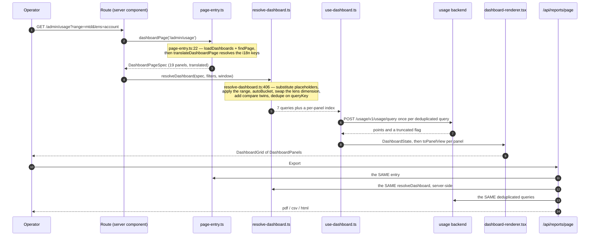
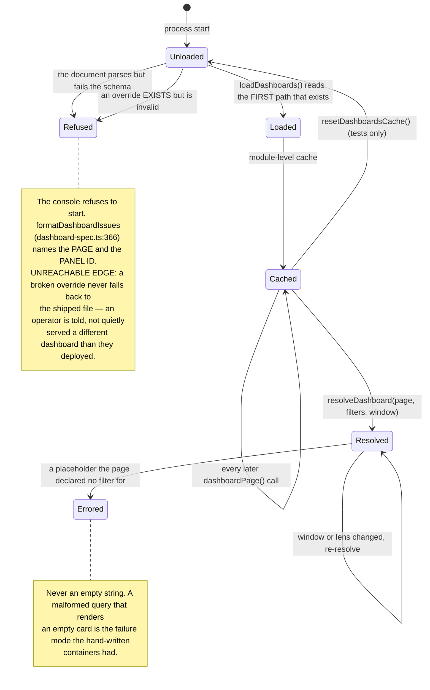

# The declarative dashboard engine (`dashboards.yaml`)

Every dashboard the console draws is a **page entry in one YAML document**, not a hand-written
container. Nothing in `apps/console` knows what a given dashboard contains; it knows how to read
the document.

The **decision and its reasoning** live in
[ADR 0015](../adr/0015-admin-console-v2-declarative-dashboards-permissions-export.md) (D1, D2, D2b,
D3) and [ADR 0017](../adr/0017-i18n-app-router-i18next.md) D4. This page is the **contract and the
how-to**: what a page entry may say, what the engine does with it, and what you must run before
claiming a panel works. Do not re-derive the reasoning here — link it.

**Eleven page entries, 110 panels**, in
[`apps/console/dashboards.yaml`](../../apps/console/dashboards.yaml). Both numbers move whenever a
panel lands; re-derive them rather than trusting them:

```sh
grep -c '^  - route:' apps/console/dashboards.yaml   # pages
grep -c '^      - id:' apps/console/dashboards.yaml  # panels
```

---

## The five modules

| Module (`apps/console/src/dashboards/`) | Owns                                                                                                                                                 |
| --------------------------------------- | ---------------------------------------------------------------------------------------------------------------------------------------------------- |
| `dashboard-spec.ts`                     | The zod schema and every closed vocabulary (`dashboardQuerySchema:174`, `panelOptionsSchema:207`, `panelSpecSchema:300`, `pageSpecSchema:320`)       |
| `load-dashboards.ts`                    | Lookup order, read, parse, cache, fail loud (`consoleConfigDir:51`, `dashboardsLookupPaths:63`, `loadDashboards:104`)                                |
| `resolve-dashboard.ts`                  | Spec + filters + window → a deduplicated query list. **React-free, DOM-free, clock-free** (`resolveDashboard:406`, `queryKey:367`, `autoBucket:176`) |
| `use-dashboard.ts`                      | One `useQueries` over that list, plus per-panel selection (`useDashboard:229`)                                                                       |
| `dashboard-renderer.tsx`                | Registry lookup → `DashboardPanel` inside `DashboardGrid` (`DashboardRenderer:59`)                                                                   |

`page-entry.ts` sits in front of the loader for server components: `dashboardPage(route)`
(`page-entry.ts:22`) loads, finds and **translates** the entry, and `translateDashboardPage`
(`apps/console/src/dashboards/page-entry.ts:65`) resolves the i18n keys the YAML carries (ADR 0017 D4) before the spec ever
reaches a client centre.

`resolve-dashboard.ts` being the dullest module in the console is load-bearing, not tidiness: the
export route runs the **same** function server-side and gets the **same** query list the browser
issued.

---

## The page entry contract

```yaml
pages:
  - route: /admin/usage # the string the App Router uses; `[param]` written literally
    filters: [lens] # `range` is implicit on every page and is never listed
    panels:
      - id: model-distribution-cost # unique within the page
        type: donut
        title: admin-usage.model-distribution-cost.title # an i18n KEY, not prose (ADR 0017 D4)
        subtitle: admin-usage.model-distribution-cost.subtitle # optional
        span: 1 # 1 = one grid column, 2 = both, at every breakpoint
        metric: cost # cost | requests | tokens | latency | derived:<name>
        compare: false # optional; adds the comparison-window twin
        options: { topN: 6 }
        query:
          scope: all
          group_by: [model]
          bucket: auto
          limit: 2000 # ALWAYS explicit — never a server default
```

### `query` (`dashboard-spec.ts:174`)

| Field      | Notes                                                                                                                     |
| ---------- | ------------------------------------------------------------------------------------------------------------------------- |
| `scope`    | A `UsageScope` (`user`/`api_key`/`project`/`account`/`all`, `dashboard-spec.ts:89`), `family`, or a `$placeholder`        |
| `scope_id` | A literal or a `$placeholder`                                                                                             |
| `group_by` | A plain string array, deliberately **not** the generated enum — a page must be authorable before its backend column lands |
| `filters`  | Equality filters, plus list values for the one set-membership filter (`operation_in`). An **empty list is refused**       |
| `bucket`   | `auto` resolves through `autoBucket` (`resolve-dashboard.ts:176`)                                                         |
| `limit`    | **Required.** A truncated response renders a caption naming the number, never a quietly short chart                       |

### `options` (`dashboard-spec.ts:207`) — the per-type knobs

| Option      | Applies to                           | Meaning                                                                                                                                                           |
| ----------- | ------------------------------------ | ----------------------------------------------------------------------------------------------------------------------------------------------------------------- |
| `scale`     | `series`, `latency-series`           | Initial axis transform (`linear`/`log`/`indexed`). Ignored under `style: stacked-bars`                                                                            |
| `style`     | `series`                             | `lines` (default) or `stacked-bars`. **A style, not a tenth panel type** — same query, adapter, export path                                                       |
| `lens`      | any lens-driven panel                | The panel's default entity, and what makes it lens-driven: the resolver swaps the first `group_by` dimension for `LENS_DIMENSION[lens]` (`dashboard-spec.ts:108`) |
| `topN`      | `ranked`, `share`, `donut`, `series` | Rows/wedges before the `Other (N)` collapse. Omit for the panel size's own default (`PANEL_TOP_N`, `packages/ui-web/src/sections/dashboard-panels/sizes.ts:24`)   |
| `link`      | `ranked`, `table`                    | A route TEMPLATE with `:key` for the row's group-by value, e.g. `/admin/usage/actors/:key?type=$lens`                                                             |
| `rowLabel`  | `table`                              | What one row IS, singular ("Account"). An i18n key. Default `Actor` is a quiet lie on a table of accounts                                                         |
| `unit`      | `table`                              | The plural noun `Pagination` counts in. Moves together with `rowLabel`                                                                                            |
| `columns`   | `table`                              | Closed vocabulary (`DASHBOARD_TABLE_COLUMNS`, `dashboard-spec.ts:130`), in draw order                                                                             |
| `pageSize`  | `table`                              | Rows per page at panel size. **There is no `paginated: true`** — every table pages; this only moves density                                                       |
| `dimension` | any                                  | Which `group_by` dimension this panel reads when it is not the first. `none` reads the ungrouped total                                                            |

### Placeholders

`$name` in any query string field is substituted from the page's own `filters`
(`PLACEHOLDER`, `resolve-dashboard.ts:167`).

- An **unresolved placeholder is an error**, never an empty string. `scope_id: ""` is not "no
  actor"; it is a malformed query that answers a different question than the panel's title claims.
- `$name?` is the optional form and is legal **only** inside `filters.<key>`. It drops the filter
  when the page has no value — what a project picker resting on "All projects" needs.
- It is deliberately **not** legal on `scope`/`scope_id`: a dropped scope is not a narrower query,
  it is a different one.
- A substituted `scope` is validated against the closed usage-scope enum before it can leave
  (`RESOLVABLE_SCOPES`, `resolve-dashboard.ts:246`).

### `scope: family` (`dashboard-spec.ts:165`)

The resolver's own scope, **not** a `UsageScope`. It expands into one `scope: account` query per
account in the session's account family and merges them client-side, stamping each point's
`account_id` from the query it came from. The usage API has no such scope
([lightbridge-authz#578](https://github.com/ADORSYS-GIS/lightbridge-authz/issues/578)), so the
honest expression is a capped fan-out that says so in its caption.

---

## How a page renders, and how the same entry exports





Lookup order (`dashboardsLookupPaths`, `load-dashboards.ts:63`), first match wins:

1. `${CONSOLE_CONFIG_DIR}/dashboards.yaml` — the deployment's own copy, so an operator can add or
   remove a panel without a rebuild. `CONSOLE_CONFIG_DIR` is **derived** (`consoleConfigDir:51`):
   an explicit value, else the directory holding `CONSOLE_CONFIG`, else none.
2. `apps/console/dashboards.yaml` — the in-repo fallback.

See [`console-configuration.md`](console-configuration.md) for the mount and the ConfigMap.

---

## Dedupe, and the request counts that are pinned

Queries are deduplicated on a stable key derived from the fully-resolved query, with the `group_by`
dimensions sorted (`queryKey`, `resolve-dashboard.ts:367`). A `compare: true` panel gets a second,
ordinary query over the comparison window — deduplicated like any other. See
[`comparison-windows.md`](comparison-windows.md).

The counts are **tests, not claims**:

| Page                                | Panels | Requests | Test                                   |
| ----------------------------------- | ------ | -------- | -------------------------------------- |
| `/admin/usage`                      | 19     | 7        | `admin-usage-page.test.ts:351`         |
| `/admin/overview`                   | 11     | 4        | `admin-overview-page.test.ts:172`      |
| `/admin/usage/actors/[actorId]`     | 9      | 5        | `admin-usage-detail-pages.test.ts:142` |
| `/admin/usage/channels/[channelId]` | 7      | 6        | `admin-usage-detail-pages.test.ts:258` |
| `/admin/usage/models/[model]`       | 8      | 6        | `admin-usage-detail-pages.test.ts:357` |
| `/admin/usage/chats`                | 5      | 4        | `admin-usage-detail-pages.test.ts:439` |
| `/accounts/[accountId]/overview`    | 12     | 5        | `overview-pages.test.ts:117`           |
| `/settings/overview/*` (each lens)  | —      | 3        | `overview-pages.test.ts:477`           |

**When you change a panel, one of these numbers moves.** Update the test with the new number and
say in the PR body why the shape changed — do not delete the assertion.

---

## The panel-type vocabulary

`DASHBOARD_PANEL_TYPES` (`packages/ui-web/src/sections/dashboard-panels/types.ts:25`) is the one
declaration. The console's zod enum is built from it and the renderer registry (`panelRenderers`,
`packages/ui-web/src/sections/dashboard-panels/panel-renderers.tsx:212`) is keyed on it, with a test
asserting both cover it exactly. **A type cannot exist in YAML without a renderer, or vice versa.**

| Type             | Draws                        | Notes                                                                     |
| ---------------- | ---------------------------- | ------------------------------------------------------------------------- |
| `stat`           | `StatCard` + optional delta  | Self-panelling: `chrome: 'bare'`, no `Card`, no Expand                    |
| `stat-group`     | A row of `StatCard`s         | Self-panelling; carries an `emptyMessage`, never zero cards               |
| `series`         | `MultiSeriesSpendBoard`      | `options.style` picks lines (default) or stacked bars                     |
| `ranked`         | `RankedSeriesRows`           | The doctrine default for a per-key breakdown                              |
| `share`          | `ShareBar`                   | The one sanctioned part-to-whole                                          |
| `donut`          | `DonutChart` — a **ring**    | Three panels, named in ADR 0015 D2. A fourth is a decision, not a default |
| `table`          | `LedgerTable` + `Pagination` | Sortable, `rowHref`, closed column vocabulary, always paged               |
| `latency-cards`  | `LatencyStatCards`           | Whole-window percentiles                                                  |
| `latency-series` | Per-bucket p50/p95           | Honest because the backend computes `percentile_cont` per bucket          |

`SELF_PANELLING_TYPES` (`packages/ui-web/src/sections/dashboard-panels/types.ts:187`) and `panelChrome` (`packages/ui-web/src/sections/dashboard-panels/types.ts:190`) are what make a `stat`
render bare: a single numeral has nothing to reveal at 80vh, so it gets no Expand affordance.

**Marks that are constrained by construction, not by review:**

- A ring can never become a filled disk. `donutGeometry`
  (`packages/chart-core/src/arcs.ts:54`) clamps the inner radius into
  `[MIN_INNER_RADIUS_RATIO, MAX_INNER_RADIUS_RATIO]` = `[0.35, 0.85]`
  (`arcs.ts:25`, `arcs.ts:28`) for **every** input, including a non-finite one.
- A stacked bar that is really one bar says so. `stackDominanceCaption`
  (`packages/chart-core/src/stacks.ts:245`) returns a sentence whenever the top series exceeds
  `STACK_DOMINANT_SHARE` = 95 (`stacks.ts:234`), and it prints on screen **and** in the report.
- A stacked panel gets no scale toggle at all (`panelActionRenderers`, `panel-renderers.tsx:297`):
  `log`/`indexed` transform each series independently, so transformed segments would not sum and
  the bar's height would stop being the bucket's total.
- A stacked panel's tail is **summed** into `Other (N)` by `computeStackLayout`
  (`stacks.ts:110`), never dropped: bars short by the tail would contradict the total beside them.

---

## Adding or changing a panel

The exact sequence, and the verification bar, live in the **`dashboard-panel` skill**
(`.claude/skills/dashboard-panel/SKILL.md`). In short: YAML entry → locale keys in
`locales/en/dashboards.json` **and** `locales/de/dashboards.json` → the story reads the real YAML
(no fixture to update) → update the page's request-count test → add the `.typ` template only if the
route is new.

**The story oracle.** `packages/ui-web/src/pages-stories/spec-page.tsx` imports the real
`apps/console/dashboards.yaml` as raw text and the real `locales/en/dashboards.json` — "the fixture
path IS the YAML" holds for the copy as well as the structure. A renamed key surfaces as a visible
key on the card, not as a story quietly certifying stale wording. Panel options are threaded through
it, and `apps/console/src/dashboards/spec-page-story-parity.test.tsx` asserts the story and the
console agree on `style`, `topN` and `link` — that test exists because they once did not
([#493](https://github.com/ADORSYS-GIS/converse-frontends/pull/493)).

---

## Validation happens twice, and both are loud

- **Build time** — `dashboard-spec.test.ts` parses the real document plus a deliberately broken
  fixture (`fixtures/broken-dashboards.yaml`).
- **Startup** — `loadDashboards()` parses it again and the console refuses to start on a failure.

An unknown panel type, an unknown `derived:` name, a `span` of 3, a missing `limit`, a duplicate
panel id, a duplicate route: each is a parse error naming the page and the panel id
(`formatDashboardIssues`, `dashboard-spec.ts:386`).

**Panel ids are prefixed per page** (`actor-*`, `channel-*`, `chat-*`), never reused across pages.
Three things need an id to be unambiguous document-wide: the report walk resolves a route to a panel
list, the per-panel URL knob is `?<panel-id>-scale=`, and the file is read across pages.

---

## Cross-references

- [ADR 0015](../adr/0015-admin-console-v2-declarative-dashboards-permissions-export.md) — why the
  engine exists, the ring amendment, the stacked-bar exception, the export branch
- [ADR 0017](../adr/0017-i18n-app-router-i18next.md) D4 — why the YAML carries keys
- [`export-pipeline.md`](export-pipeline.md) — the second consumer of the same entry
- [`comparison-windows.md`](comparison-windows.md) — what `compare: true` adds
- [`console-configuration.md`](console-configuration.md) — the override mount
- [`admin-area.md`](admin-area.md) — which screens these entries back, and their gates
