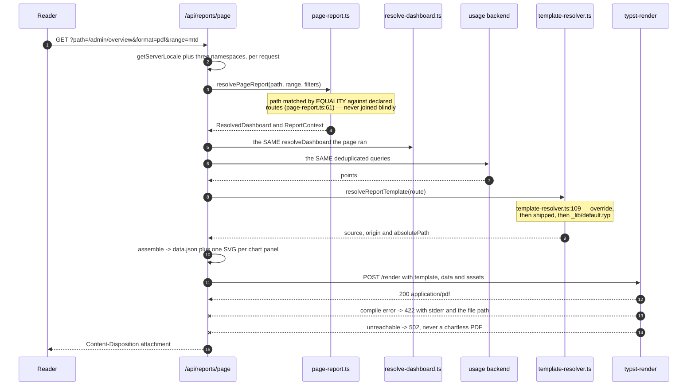
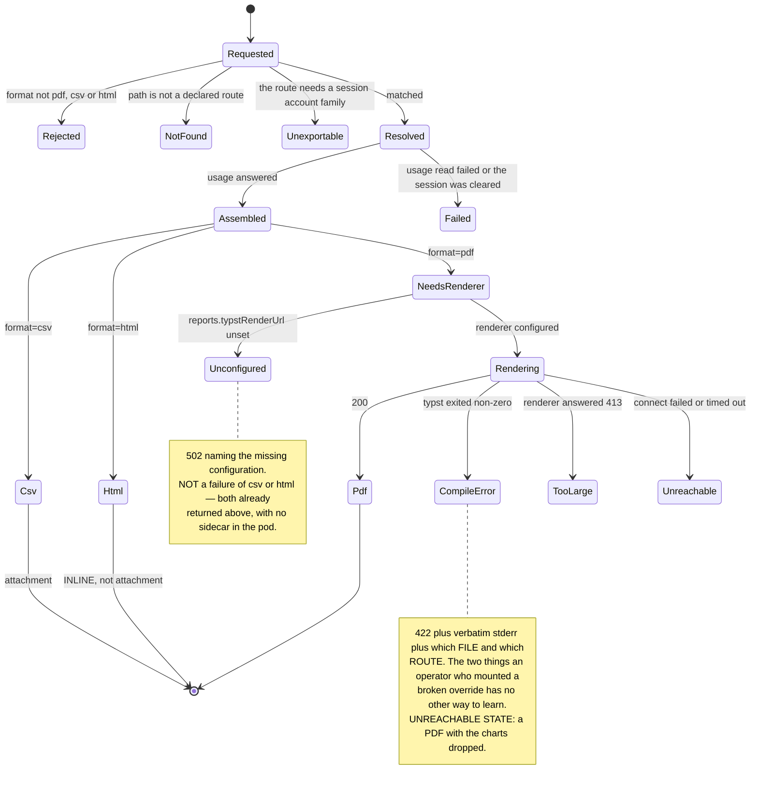

# Export pipeline — one YAML entry, rendered twice

A dashboard page and its exported document are the **same `dashboards.yaml` entry**, resolved
through the **same** `resolveDashboard`, answered by the **same** deduplicated queries, and turned
into the **same** panel views. A panel added to the YAML appears in the export with no template
change and no code change.

The decision and the alternatives that were rejected (Gotenberg, Handlebars, Playwright, the
hand-rolled PDF 1.4 writer) live in
[ADR 0015](../adr/0015-admin-console-v2-declarative-dashboards-permissions-export.md) D5 and
[ADR 0017](../adr/0017-i18n-app-router-i18next.md) D6. This page is the contract.

---

## The route

```
GET /api/reports/page
      ?path=<declared dashboards.yaml route>
      &range=&from=&to=
      &format=pdf|csv|html      (default pdf)
      &tables=true|false        (default true)
      &<the page's own filters>
```

`apps/console/src/app/api/reports/page/route.ts:91`.

**`path` is never used to read a file.** It is matched by **equality** against the routes
`dashboards.yaml` itself declares, plus the built-in consumption document (`knownReportRoutes`,
`apps/console/src/server/reports/page-report.ts:61`), and only the _matched_ route — a string this
process already owned — is joined into a path. `assertSafeRouteSegments`
(`apps/console/src/server/reports/template-resolver.ts:87`) is the second, structural line.

### Status codes, deliberately not collapsed into a generic 500

| Status | When                                                                   | Carries                                                     |
| ------ | ---------------------------------------------------------------------- | ----------------------------------------------------------- |
| `404`  | `path` is not a declared route                                         | The list of known routes                                    |
| `400`  | The route exists but needs a session's account family, or a bad filter | Which of the two                                            |
| `413`  | Template assets over the console's budget, or the renderer's own cap   | Which knob to shrink                                        |
| `422`  | The template did not compile                                           | Typst's **stderr verbatim**, plus the file it was read from |
| `502`  | The renderer is unreachable or unconfigured                            | Which of the two                                            |

It **never degrades to a chartless PDF** — a document that silently drops its charts is worse than
one that fails. There is no retry: a compile error is deterministic, and a 45-second timeout
(`TYPST_RENDER_TIMEOUT_MS`, `apps/console/src/server/reports/typst-client.ts:56`) retried is
90 seconds a reader is watching.

`csv` and `html` never touch Typst at all, so **both work with no sidecar deployed**.

---

## The three formats

| Format | Produced by                                                                | Disposition                                       |
| ------ | -------------------------------------------------------------------------- | ------------------------------------------------- |
| `pdf`  | `.typ` template + assets, through the sidecar                              | `attachment`                                      |
| `csv`  | `reportCsv(document)` (`apps/console/src/server/reports/report-csv.ts:76`) | `attachment`                                      |
| `html` | `reportHtml(document, assets)` (`.../report-html.ts`)                      | **`inline`** — this format exists to be looked at |

### What the CSV actually is

**One section per panel, not one table.** A dashboard is not one table, so flattening panels of
different shapes into a single sheet would need a lowest-common-denominator schema that fits none of
them (`apps/console/src/server/reports/report-csv.ts:28`).

- A `#`-prefixed header block: title, route, range, window start/end (UTC), generated-at, and every
  page filter — so a downloaded file still says what it is a month later, and a spreadsheet import
  can skip it.
- Then, per panel: `# panel,<id>,<title>`, followed by its stats block and/or its table block.
- An **unavailable** panel is NAMED and its absence stated, never silently skipped: a missing
  section is otherwise indistinguishable from a panel that had no data.
- A panel type with no tabular rows says exactly that rather than emitting nothing.
- RFC 4180 quoting, applied only when a field needs it; CRLF line endings.

It is deliberately **not** shared code with `consumption-csv.ts`, which owns the consumption
document's own project x model grouping and its `TOTAL` row byte for byte.

---

## The template contract

Templates are `.typ` files mirroring route paths under `apps/console/templates/<route>/report.typ`,
with `[param]` segments written **literally**:

```
/admin/usage/actors/[actorId]  ->  templates/admin/usage/actors/[actorId]/report.typ
```

Lookup is **per file, not per directory** (`templateLookupPaths`,
`apps/console/src/server/reports/template-resolver.ts:109`):

1. `${CONSOLE_TEMPLATES_DIR}/<route>/report.typ` — the operator's override, mounted read-only.
2. `apps/console/templates/<route>/report.typ` — the template shipped in the image.
3. `apps/console/templates/_lib/default.typ` — the generic layout, which iterates `report.panels`.

Per-file resolution is what makes it safe for `CONSOLE_TEMPLATES_DIR` to be set unconditionally: a
ConfigMap carrying one file overrides exactly one document, and an absent directory overrides
nothing. Because of step 3, **a route without a template of its own is never an error** — a page
added to `dashboards.yaml` exports on the day it is added.

**A template decides document chrome only** — header, section order, captions, page furniture. It
never decides which panels exist or what they query. It receives the already-resolved `panels[]`
with one SVG each (`apps/console/src/server/reports/report-data.ts:48`), and `report.labels`
(`apps/console/src/server/reports/report-data.ts:115`) carries its own fixed words (`generated`, `template`, `noRows`) **already
translated** — which is how an operator's own override is translated for free, without having to
know a locale exists.

Every template begins:

```typst
#let report = json(sys.inputs.at("data"))
```

`sys.inputs.data` is a **filename, not the payload**: the service writes `data` to `data.json` and
passes `--input data=data.json`.

### Files that travel with a template

`collectTemplateAssets(route)` (`apps/console/src/server/reports/template-assets.ts:118`) walks the
template's own directory (override root first, depth 4) and ships every sibling file — a logo, a
watermark, a typeface. Budget: `REPORT_ASSET_BUDGET_BYTES` = 8 MiB (`apps/console/src/server/reports/template-assets.ts:54`); over
it the route answers `413` naming the largest file, rather than letting the renderer refuse
anonymously.

Asset precedence, least specific first: the template's own sibling files, then the configured brand,
then this document's own panel SVGs. **A file dropped into a template directory can give a template
its own artwork; it cannot shadow the data the document is OF.**

### Branding

`resolveReportBranding(env.branding)` (`apps/console/src/server/reports/report-branding.ts:66`). The
**light-theme** mark (`branding.logoLight`) is what prints — `printLogoPath`
(`apps/console/src/server/reports/report-branding.ts:56`) — because a document is printed on white. The extensions Typst can draw
are pinned (`apps/console/src/server/reports/report-branding.ts:37`); anything else is not offered to the template. With no readable
logo, `branding.name` prints instead. See [`console-configuration.md`](console-configuration.md),
"Report export".

---

## The sidecar

`apps/typst-render`, in this monorepo (the console speaks only HTTP to it, so it can still move).

```
POST /render  { template: string, data: object, assets: { [path]: base64 } }  ->  application/pdf
```

`renderPdf` (`apps/console/src/server/reports/typst-client.ts:64`) on the console side;
`parseRenderRequest` (`apps/typst-render/src/render-request.ts:74`) on the service side, where
validation is strict and total.

Per request: a fresh temp directory, `--root .` confining Typst's file reads to it
(`apps/typst-render/src/render.ts:79`), `--ignore-system-fonts` (`apps/typst-render/src/render.ts:92`), `--package-path`
pointed at an empty directory (`apps/typst-render/src/render.ts:95`), a 30-second compile timeout and an 8 MiB request cap
(`apps/typst-render/src/config.ts:29`).

**`@preview/...` package imports are unsupported.** The empty `--package-path` is not a guarantee:
Typst will still reach the registry if the host has egress, so **the sidecar is expected to run with
none** — a deployment property, not a process property. Templates must be self-contained.

---

## The react-server prebundle constraint

Recorded because it will look arbitrary otherwise
(`apps/console/src/server/reports/render-charts.tsx`).

A Next Route Handler lives in the **react-server layer**, where `react-dom/server`'s
`renderToStaticMarkup` is aliased to a shim that throws, and where any module reaching
`useState`/`useEffect` is a build error — which every `ui-web` chart does, correctly, because on
screen they are interactive. So the chart renderer is bundled **ahead of** the Next build by
`apps/console/scripts/build-report-charts.mjs` into one dependency-free CommonJS file and loaded by
path at runtime through `createRequire`. Next's bundler never sees it.

**Consequence to remember:** a change to a `ui-web` chart component is not picked up by the export
until that script runs. It runs as part of the console's build; a hand-run `next build` alone is not
enough.

---

## The two flows





---

## Where the Export button is mounted

`DashboardExportButton` (`apps/console/src/dashboards/dashboard-export-button.tsx`) is mounted on
**every** dashboard route that answers the export contract:

| Container                                               | Route                               |
| ------------------------------------------------------- | ----------------------------------- |
| `admin-overview-centre.tsx`                             | `/admin/overview`                   |
| `admin-usage-centre.tsx`                                | `/admin/usage`                      |
| `admin-usage-actor-centre.tsx`                          | `/admin/usage/actors/[actorId]`     |
| `admin-usage-channel-centre.tsx`                        | `/admin/usage/channels/[channelId]` |
| `admin-usage-chats-centre.tsx`                          | `/admin/usage/chats`                |
| `overview-centre.tsx` / `use-account-overview-zones.ts` | `/accounts/[accountId]/overview`    |
| `settings-overview-centre.tsx`                          | `/settings/overview/*`              |

(ADR 0015's follow-ups 3 and 4 described `/admin/usage` and the drill-downs as having no button.
They have one; the ADR's follow-up list is stale on that point, and this table is the current
state.)

**One route deliberately has no Export action: `/settings/overview/usage`.** Any page with a
`scope: family` panel fans out over the signed-in identity's own account family, and a report route
has **no session to read that list from**. Rendering it anyway would produce a document where every
panel says "could not be loaded" — which a reader would reasonably take as "we have no usage"
rather than "this route cannot ask this question". `resolvePageReport`
(`apps/console/src/server/reports/page-report.ts:175`) refuses it with `400 unexportable_route`, so
a hand-built URL gets the same answer the UI gives.

---

## Cross-references

- [`dashboards.md`](dashboards.md) — the entry both consumers read
- [ADR 0015](../adr/0015-admin-console-v2-declarative-dashboards-permissions-export.md) D5
- [ADR 0017](../adr/0017-i18n-app-router-i18next.md) D6 — why `report.labels` exists
- [`console-configuration.md`](console-configuration.md) — `reports.typstRenderUrl`,
  `CONSOLE_TEMPLATES_DIR`, branding
- `apps/typst-render/README.md` — the service's own operational notes
- The `report-template` skill (`.claude/skills/report-template/SKILL.md`) — adding or overriding a
  template, step by step
