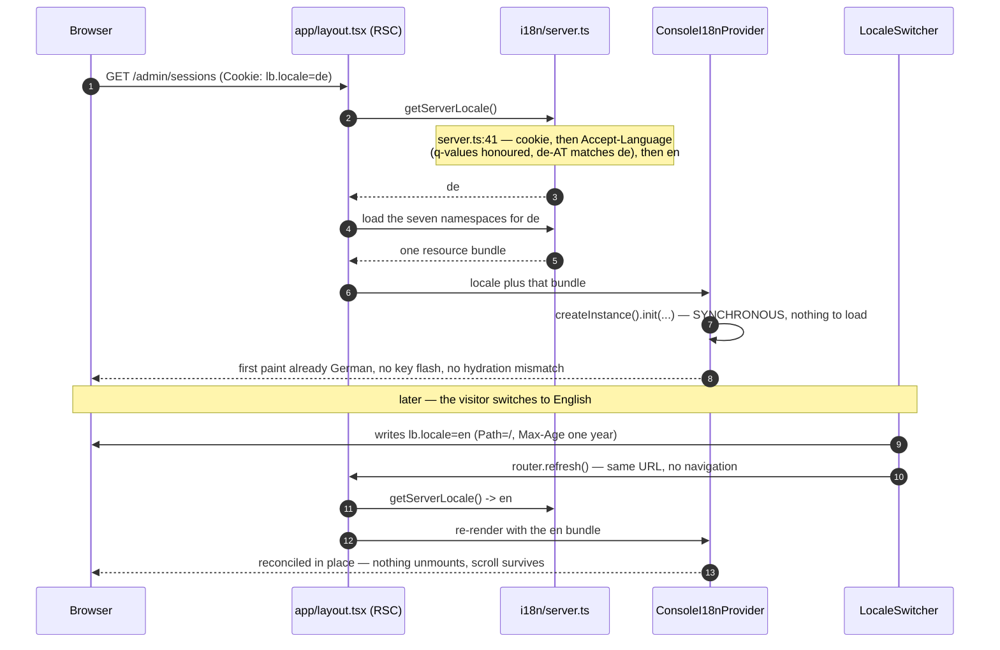
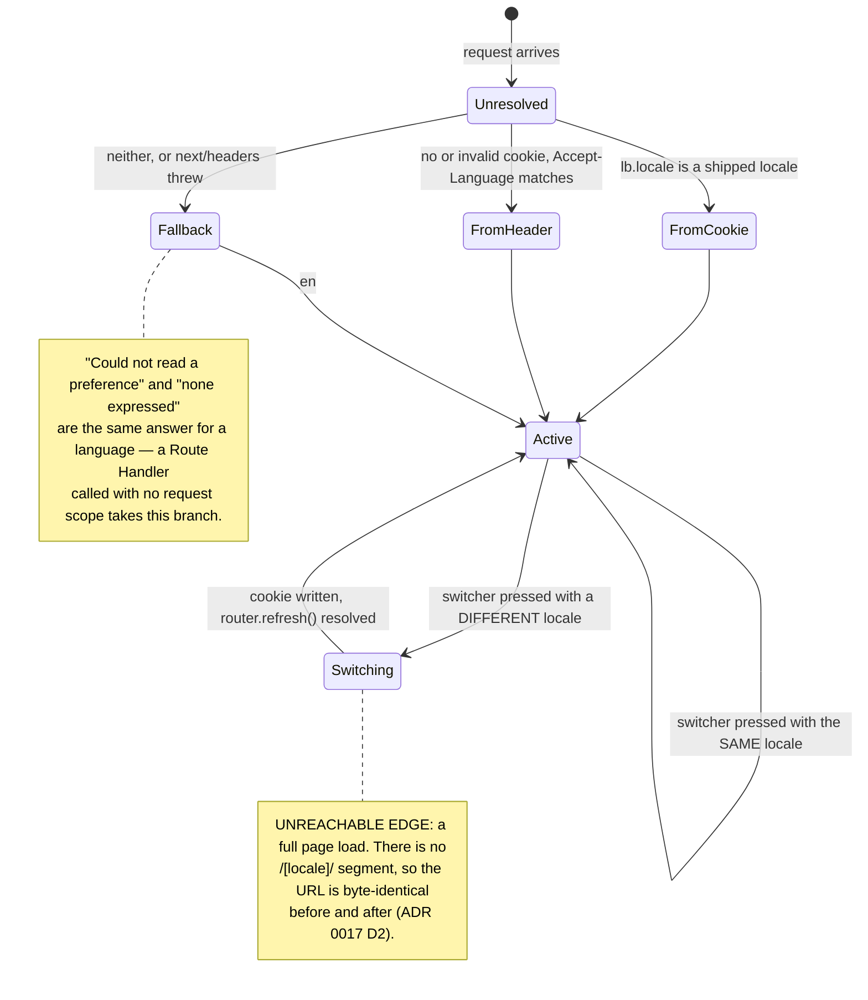

# i18n — how to add a string, and how to add a language

`apps/console` ships **English and German**. English is the **source of truth**: every key exists in
`locales/en/*.json` first, and `de` is a translation of it — never the other way round, and never a
key that exists only in `de`.

The decisions (why not `next-i18next`, why a cookie and not a path segment, why `ui-web` owns no
translations, why money keeps one currency) are
[ADR 0017](../adr/0017-i18n-app-router-i18next.md). This page is the how-to.

---

## The shape

| Thing             | Where                                                                                                                       |
| ----------------- | --------------------------------------------------------------------------------------------------------------------------- |
| Locales           | `LOCALES = ['en', 'de']` (`apps/console/src/i18n/config.ts:15`)                                                             |
| Namespaces        | `NAMESPACES` — `common`, `nav`, `dashboards`, `admin`, `settings`, `auth`, `reports` (`apps/console/src/i18n/config.ts:42`) |
| Bundles           | `apps/console/locales/<locale>/<namespace>.json`                                                                            |
| Importer table    | `LOADERS` in `apps/console/src/i18n/resources.ts` — written out in full, checked by `tsc`                                   |
| Server instance   | `getI18nInstance(locale)` (`apps/console/src/i18n/server.ts:75`), per request, `React.cache`d                               |
| Server `t`        | `getServerTranslation(locale, ns)` (`apps/console/src/i18n/server.ts:113`)                                                  |
| Locale resolution | `getServerLocale()` (`apps/console/src/i18n/server.ts:41`) — cookie → `Accept-Language` → `en`                              |
| Client provider   | `ConsoleI18nProvider` (`apps/console/src/i18n/client.tsx:76`), seeded synchronously                                         |
| Cookie            | `lb.locale`, `Max-Age` one year (`apps/console/src/i18n/config.ts:30`, `apps/console/src/i18n/config.ts:33`)                |
| Switcher          | `apps/console/src/i18n/locale-switcher.tsx` — sidebar footer "Language", and `/settings/info`                               |

**Namespaces are one per AREA of the console, not one per screen.** A screen's copy moves between
containers often; an area's does not.

**There is no `/[locale]/…` path segment**, deliberately (ADR 0017 D2). The switcher writes the
cookie from the browser and calls `router.refresh()`: same URL, nothing unmounts, scroll position
survives.

---

## Adding a string

1. Pick the namespace by **area**, not by screen.
2. Add the key to `apps/console/locales/en/<ns>.json`.
3. Add the same key to `apps/console/locales/de/<ns>.json`. **Not optional** — the client ships only
   the active locale's bundle, so there is no English to silently fall back to at runtime.
4. Use it:
   - **Server component / route handler** — `const { t } = await getServerTranslation(locale, ns)`.
     Bind the locale **per request**; a Route Handler serves concurrent requests, and a
     module-level locale leaks one reader's language into another's document.
   - **Client component** — `useTranslation(ns)` from `apps/console/src/i18n/client.tsx`.
   - **A `packages/ui-web` prop** — pass `t('…')` in from the console. `ui-web` never calls `t()`.
5. Run the parity test (below).

### Rules that are not style preferences

- **Plurals are i18next's**, never a hand-rolled `=== 1 ? '' : 's'` in JSX. German pluralises on a
  different rule, and a suffix appended in a component asserts that rule on the bundle's behalf.
- **A module constant cannot be copy.** It is resolved at import time, before any request has a
  locale. Pure modules return **facts** instead: `familyTruncationCap` returns a number,
  `budgetPressureTruncation` returns `{shown, total}`, `rangeLabels(t)` takes the caller's `t`.
- **Counts and dates go through `Intl`** with the active locale (`useIntlLocale`, `client.tsx:40`),
  so `2,000` in English is `2.000` in German.
- **Money keeps one currency.** Every figure is USD in both languages; only the notation follows
  DIN 5008 (`$1 131.80` → `1.131,80 $`). The money locale is ambient (`setMoneyLocale`, called by
  `CopyProvider`); a caller formatting money during a concurrent **server** render must pass its
  locale explicitly.

---

## `packages/ui-web` owns no translations

`ui-web` is framework- and app-agnostic — Storybook renders it with no app around it, and
`apps/lci`/`apps/authz-ui` consume it without an i18n runtime. Two mechanisms carry copy, and only
two:

1. **Props** — anything a screen decides. This is already how nearly every section works.
2. **`useCopy()`** (`packages/ui-web/src/lib/copy.tsx:86`) — for the handful of strings baked into a
   **primitive's own behaviour**, where a prop would have to be threaded through every intermediate
   section: `Pagination`'s captions, `ErrorLine`'s retry, `DashboardPanel`'s expand label,
   `BottomSheet`'s close. Every one has an **English default** (`DEFAULT_UI_COPY`, `copy.tsx:71`),
   so a consumer that mounts no provider renders exactly what it rendered before.

There is deliberately no third path. A component library owning a resource bundle would need every
app to keep that bundle in step with its own, and the first divergence is a screen half in each
language.

---

## `dashboards.yaml` carries KEYS

`title`, `subtitle`, `options.rowLabel` and `options.unit` are keys into the `dashboards` namespace.
`dashboardPage(route)` resolves them server-side against the request's locale
(`translateDashboardPage`, `apps/console/src/dashboards/page-entry.ts:63`), so the renderer and the
export builder both stay ignorant of i18n. Storybook's `Pages/FromSpec` reads the same YAML and
resolves against `locales/en/dashboards.json` directly. See [`dashboards.md`](dashboards.md).

Everything else in an entry stays machine vocabulary — scopes, dimensions, limits, panel types.
Translating any of it breaks the query.

---

## Typst templates receive translated words

A `.typ` template has no i18n runtime and can read `data.json` and nothing else. Every word it
prints on the document's own behalf arrives pre-translated in `report.labels`. That is also what
makes an operator's own template override translated for free. See
[`export-pipeline.md`](export-pipeline.md).

---

## Adding a language

1. Add the code to `LOCALES` in `apps/console/src/i18n/config.ts`.
2. Create `apps/console/locales/<code>/` with **all seven** namespace files.
3. Add the seven `import()` entries to `LOADERS` in `apps/console/src/i18n/resources.ts`. The table
   is explicit rather than a template literal on purpose: a namespace added without a file is a
   **`tsc` error**, not a runtime 404.
4. If the language needs different number/date notation than `Intl` gives for free, extend
   `money.ts`'s locale switch — it is hand-rolled (its thin-space grouping in `en` is a typographic
   contract no locale produces), so a new locale is an explicit case there.
5. Run the parity test and `pnpm --filter console build`.

---

## The two ratchets

| Test                                               | Proves                                                                                                                           |
| -------------------------------------------------- | -------------------------------------------------------------------------------------------------------------------------------- |
| `apps/console/src/i18n/resources.test.ts:19`       | Every English key has a translation and none is invented; no value is empty; every `{{placeholder}}` is identical across locales |
| `apps/console/src/i18n-hardcoded-copy.test.ts:235` | The count of remaining hard-coded user-visible strings equals `REMAINING_HARDCODED_COPY` (`:46`)                                 |

The second is deliberately a **measurement, not an assertion**: it may go down freely, and going up
fails the build. That makes "we are still finishing this" a checkable fact instead of a promise, and
makes the next screen someone writes in English a build failure rather than a silent regression.

**When you translate something, lower the number in the same commit.** Do not delete the constant.

Remaining work is tracked in
[converse-frontends#490](https://github.com/ADORSYS-GIS/converse-frontends/issues/490); the biggest
single item is `containers/budget-period-caption.ts`, which assembles a cadence sentence whose
German would want a different clause **order**, not a different set of words in the same slots.

`useTranslation` works in tests with no provider: `apps/console/src/test/setup.ts` registers a real
English-resolved instance as react-i18next's default, so a nav test asserting `'Refills queue'` is
simultaneously asserting the key exists.

---

## How a request picks its language

---

## Cross-references

- [ADR 0017](../adr/0017-i18n-app-router-i18next.md) — the decisions and what is not translated yet
- [`dashboards.md`](dashboards.md) — the YAML's keys
- [`export-pipeline.md`](export-pipeline.md) — `report.labels`
- The `i18n-copy` skill (`.claude/skills/i18n-copy/SKILL.md`) — the commands, in order
