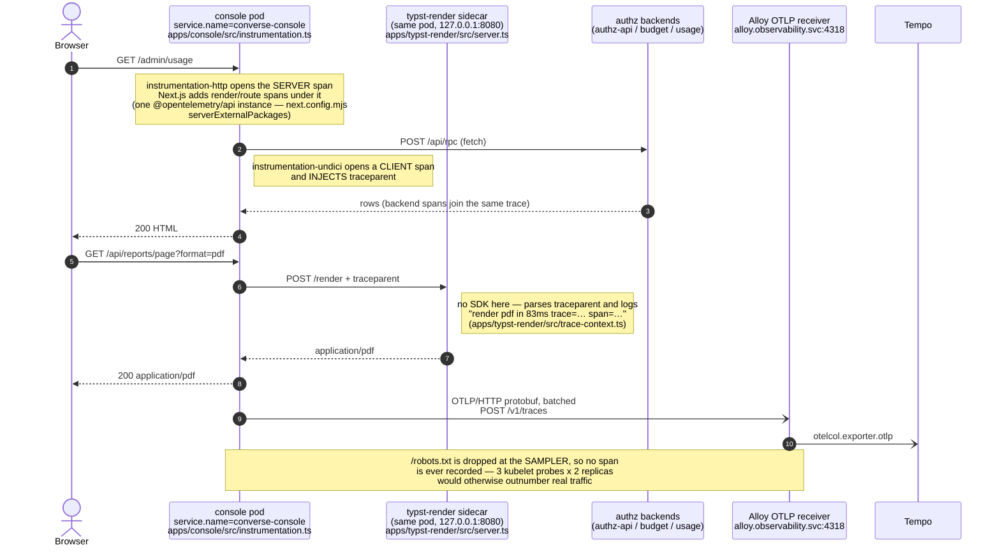

# Observability — converse-frontends

> Source of truth: `packages/otel/src/`, `apps/*/src/instrumentation.ts`, `charts/converse-*/values.yaml`,
> `openapi/usage.backend.yaml`, plus the deployment repos (`ai-helm`, `ai-helm-values`).
>
> Story: [converse-frontends#443](https://github.com/ADORSYS-GIS/converse-frontends/issues/443).

This repo's two Next.js server apps — `apps/console` and `apps/lci` — export **OpenTelemetry
traces** to the estate's in-cluster collector. `apps/typst-render` deliberately does not; it
correlates its logs instead. Everything else here (metrics, dashboards, alerting) is still owned
outside this repository, and the sections that say so say why.

---

## Tracing

### What is instrumented, and with what

| App                                  | Runtime                                 | `service.name`     | SDK                                             |
| ------------------------------------ | --------------------------------------- | ------------------ | ----------------------------------------------- |
| `apps/console`                       | Node                                    | `converse-console` | `@lightbridge/otel` → `@opentelemetry/sdk-node` |
| `apps/lci`                           | Node                                    | `converse-lci`     | `@lightbridge/otel` → `@opentelemetry/sdk-node` |
| `apps/console` / `apps/lci`          | **Edge** (`middleware.ts` / `proxy.ts`) | —                  | **none, by design**                             |
| `apps/typst-render`                  | Node                                    | —                  | **none, by design** — log correlation only      |
| `apps/authz-ui`, `apps/self-service` | browser                                 | —                  | none (no browser SDK in this repo)              |

Not `@vercel/otel`: this estate exports to its own collector over plain OTLP, and none of Vercel's
platform resource detection or its Edge path applies. `packages/otel` is the one place the wiring
lives, so "how a converse app names itself in Tempo" is decided once.

**Two instrumentations only**, rather than `auto-instrumentations-node`'s thirty:

- `@opentelemetry/instrumentation-http` — the `node:http`/`node:https` transport: the socket-level
  SERVER span, plus CLIENT spans for anything calling `http.request` directly instead of `fetch`.
  **Not** what makes a page load traceable: measured against a real collector, `apps/console`
  produced one transport SERVER span per request while `apps/lci` — same package, same version, same
  standalone build — produced none, and both stayed fully traceable. The span a reader navigates by
  comes from **Next.js's own tracer** (`next.js` scope, `Kind: Server`, carrying `http.route`),
  which Next emits regardless. That asymmetry is why probe filtering lives in the sampler rather
  than in `ignoreIncomingRequestHook`.
- `@opentelemetry/instrumentation-undici` — the CLIENT span for every outbound `fetch`, and the
  `traceparent` injection that joins these traces to `lightbridge-authz`'s. Node's global `fetch`
  _is_ undici, so this covers every backend call without rewriting any of them: the authz/budget RPC
  proxies, the usage REST proxy, `/version` reads for `/settings/info`, LCI's control-plane calls,
  and the `POST /render` to the typst-render sidecar.

No pino instrumentation — neither app uses pino; both log through `console`.

### The trace path



### Whether the SDK runs at all

The environment is the only switch. There is no `otel.enabled` values flag and no application
config field: a flag that can disagree with the endpoint is a way to ship a feature switched off.

```mermaid
stateDiagram-v2
    [*] --> Registering: Next calls register()<br/>(once per server instance)

    Registering --> EdgeSkipped: NEXT_RUNTIME != "nodejs"
    EdgeSkipped --> [*]: no SDK, no log line —<br/>middleware/proxy only redirects

    Registering --> Resolving: NEXT_RUNTIME == "nodejs"<br/>dynamic import of instrumentation.node.ts

    Resolving --> OffNoEndpoint: OTEL_EXPORTER_OTLP_ENDPOINT<br/>and _TRACES_ENDPOINT both unset/blank
    Resolving --> OffBadProtocol: OTEL_EXPORTER_OTLP_PROTOCOL<br/>is not http/protobuf
    Resolving --> Exporting: endpoint set, protocol accepted

    OffNoEndpoint --> [*]: one log line naming the variable
    OffBadProtocol --> [*]: one log line naming the value —<br/>refuses rather than sending<br/>a format nobody asked for

    Exporting --> Exporting: spans batched (BatchSpanProcessor)
    Exporting --> Flushed: SIGTERM / SIGINT
    Flushed --> [*]: sdk.shutdown() drains the queue;<br/>the process is NOT exited here —<br/>Next owns the shutdown sequence

    note right of Exporting
      Resource: service.name (OTEL_SERVICE_NAME, else compiled-in)
                service.namespace = converse
                service.version = IMAGE_TAG, else short NEXT_PUBLIC_BUILD_SHA
                                  (the same pair /settings/info reports, #476)
                deployment.environment.name = OTEL_DEPLOYMENT_ENVIRONMENT
                                  or DEPLOYMENT_ENVIRONMENT — omitted when unset
      Sampler:  ParentBased(TraceIdRatioBased(OTEL_TRACES_SAMPLER_ARG, default 1.0))
      Metrics and logs pipelines are explicitly EMPTY
    end note

    note right of OffNoEndpoint
      This is the ordinary state of every next dev
      server, every next build and every unit test —
      not an error path.
    end note
```



### Environment contract

| Variable                                                 | Default             | Effect                                                                                        |
| -------------------------------------------------------- | ------------------- | --------------------------------------------------------------------------------------------- |
| `OTEL_EXPORTER_OTLP_ENDPOINT`                            | unset               | Base URL; `v1/traces` is appended. **Unset ⇒ no SDK.**                                        |
| `OTEL_EXPORTER_OTLP_TRACES_ENDPOINT`                     | unset               | Signal-specific URL, used verbatim. Wins over the shared one.                                 |
| `OTEL_EXPORTER_OTLP_PROTOCOL`                            | `http/protobuf`     | Validated. `grpc` / `http/json` ⇒ refuses to start and says so.                               |
| `OTEL_SERVICE_NAME`                                      | compiled-in per app | `converse-console` / `converse-lci`.                                                          |
| `OTEL_TRACES_SAMPLER_ARG`                                | `1.0`               | Root-trace ratio, clamped to `[0,1]`. Garbage falls back to the default rather than throwing. |
| `OTEL_DEPLOYMENT_ENVIRONMENT` / `DEPLOYMENT_ENVIRONMENT` | unset               | `deployment.environment.name`.                                                                |
| `IMAGE_TAG`, `NEXT_PUBLIC_BUILD_SHA`                     | unset               | `service.version` — the same pair `/settings/info` reports.                                   |

### Why the Edge runtime is skipped

`NodeSDK` cannot exist on the Edge runtime — it reaches for `node:http`, `node:diagnostics_channel`
and module patching. Instrumenting it would need `@vercel/otel`, the only SDK with an Edge path, for
the sake of a span with no children on a platform this estate does not deploy to. Both apps' Edge
code (`apps/console/src/middleware.ts`, `apps/lci/src/proxy.ts`) reads the session cookie and either
passes the request through or redirects; it calls nothing and awaits nothing. The trace begins at
the Node server span the request reaches immediately afterwards. Nothing is lost but the redirect
hop.

### Why `apps/typst-render` has no SDK

That service has **zero npm dependencies by construction** — `package.json` has no `dependencies`
key, `src/server.ts` is plain `node:http`, and the Dockerfile ships `dist/` with no `node_modules`
and deletes npm/npx from the base image, because this is the container that executes
request-supplied document programs. `@opentelemetry/sdk-node` plus its exporter is roughly forty
packages; adding them re-expands exactly the surface that Dockerfile was written to shrink. That is
a redesign of the service, not a bonus.

What it does instead: parses the `traceparent` the console already sends and prints the trace and
parent-span ids with each render, so an operator holding a trace id can find the renderer's log
lines for it. That is log correlation, not tracing — there is no span for `typst compile`, and the
console's CLIENT span stays a leaf. See `apps/typst-render/src/trace-context.ts`.

### Two build-time traps this wiring depends on

Both are silent when broken — no error, just no telemetry — so they are recorded here as well as in
the files that carry them.

1. **The OTel packages must not be bundled.** `next.config.mjs` lists them in
   `serverExternalPackages` in both apps. `instrumentation-http` patches `node:http` through
   `require-in-the-middle`, which hooks module _resolution_; inlined code never reaches a resolver,
   so a bundled instrumentation patches nothing. And `@opentelemetry/api` holds the global tracer
   provider in module state, so the app and Next must resolve to ONE instance or Next's own spans go
   nowhere. (Next only aliases in its vendored `@opentelemetry/api` when the app has none of its
   own — these apps now do.)
2. **`output: 'standalone'` does not create the scope symlinks.** Next's tracer copies the pnpm store
   directories into `.next/standalone/node_modules/.pnpm/` but materializes `node_modules/@scope/pkg`
   for `next` alone. Everything else resolves on a developer machine — where the real workspace
   `node_modules` is one directory up and silently answers — and `MODULE_NOT_FOUND` inside the
   container. `scripts/link-standalone-scopes.mjs` recreates them; each app's `build:web` runs it for
   `@opentelemetry`, and `apps/console/Dockerfile` runs it again for `@cratestack` (whose store dirs
   the Dockerfile copies in after the bundle). It exits non-zero when a named scope yields no links,
   so a regression is a red build rather than a runtime 500. This is the same class of bug as the
   2026-08-30 usage-500 incident; the script's header records both occurrences.

### Reproducing the trace path locally

```bash
docker run -d --name otelcol -p 4318:4318 \
  -v "$PWD/collector.yaml":/etc/otelcol-contrib/config.yaml \
  otel/opentelemetry-collector-contrib:0.145.0     # otlp receiver -> debug exporter

OTEL_EXPORTER_OTLP_ENDPOINT=http://127.0.0.1:4318 \
OTEL_EXPORTER_OTLP_PROTOCOL=http/protobuf \
IMAGE_TAG=sha-local1 DEPLOYMENT_ENVIRONMENT=local \
  pnpm --filter console dev

docker logs otelcol | grep -A4 'service.name'
```

---

## Cluster wiring

The collector is **Grafana Alloy**, in the `observability` namespace, at
`http://alloy.observability.svc.cluster.local:4318` (`4317` is its gRPC port; these apps use HTTP).
Alloy's `otelcol.receiver.otlp` forwards traces to Tempo
(`ai-helm-values environments/prod/values/alloy.yaml`). It is the same endpoint
`lightbridge-code-intelligence`'s backends already push to, so console/LCI spans land beside the
backend spans they are joined to.

No network-policy work is required in either direction, which was checked rather than assumed:

- Alloy's own `CiliumNetworkPolicy` (`environments/prod/deps/alloy/ciliumnetworkpolicy.yaml`) admits
  `fromEntities: cluster` on 4317/4318 — any in-cluster sender.
- The `converse` namespace has no egress default-deny. Its only `NetworkPolicy` touching the console
  (`console-ui`) is `policyTypes: [Ingress]`.

Chart plumbing lives in `charts/converse-console/values.yaml` and `charts/converse-lci/values.yaml`
(`OTEL_EXPORTER_OTLP_ENDPOINT`, `OTEL_EXPORTER_OTLP_PROTOCOL`, `DEPLOYMENT_ENVIRONMENT`); the real
endpoint is set per environment in `ai-helm-values`.

> [!IMPORTANT]
> Both charts are consumed through **tilde** pins in `ai-helm/charts/apps/values.yaml`
> (`converse-console ~0.2.4`, `converse-lci ~0.1.0`). The published version is
> `MAJOR.MINOR` from `Chart.yaml` plus a patch derived from the chart directory's commit count, so a
> MINOR bump lands outside the pin and ArgoCD silently keeps serving the last resolvable version.
> Widen the pin in `ai-helm` first, in its own merged change, or do not bump the minor.

---

## Metrics

Deliberately **not** exported by these apps. `packages/otel` sets `metricReaders: []` and
`logRecordProcessors: []` explicitly, because `NodeSDK` otherwise derives metrics and logs pipelines
from the same `OTEL_EXPORTER_OTLP_ENDPOINT` (an empty `OTEL_METRICS_EXPORTER` means "use the default
otlp exporter", not "none"). Caught on the first end-to-end run: a traces-only collector answered
every metrics batch with a 404 the SDK logged once per export interval, forever.

Neither pipeline would carry anything worth having. Next.js emits no OTel metrics of its own, this
estate's metrics come from Prometheus scraping, and pod logs are collected from stdout by Alloy.

The LightBridge **usage backend** separately exposes OTLP _ingest_ endpoints
(`openapi/usage.backend.yaml`) for the Converse AI gateway's LLM-usage telemetry — a different
concern from this repo's own tracing:

| Endpoint           | Method | Content-Type             | Description       |
| ------------------ | ------ | ------------------------ | ----------------- |
| `/v1/otel/metrics` | `POST` | `application/x-protobuf` | LLM usage metrics |
| `/v1/otel/traces`  | `POST` | `application/x-protobuf` | Traces            |

Both answer `202 Accepted` with `{"accepted_events": N}`. Ingested data becomes queryable through
`POST /usage/v1/usage/query`. These are called by the gateway, not by this frontend.

---

## Logging

- **`apps/console` / `apps/lci`** — plain `console.*` to stdout, collected by the node logging agent.
  The one SDK-related line each pod prints at boot says either where it is exporting to (with
  version, environment and sampler ratio) or why it is not.
- **`apps/typst-render`** — one line per render: outcome, duration, and the caller's trace/span ids
  when a `traceparent` was sent.
- **Browser** — no logging library (Sentry, Datadog RUM) is configured in this repository.

---

## SLOs, dashboards and alerts

Still not defined in this repository. Key user journeys depend on `authz-idp` (authentication), the
LightBridge AuthZ API and the Usage API, none of which this repo owns; SLOs spanning them belong
where those are defined. With traces now landing in Tempo, a latency SLI per route is expressible
for the first time — but writing one is its own change, not a side effect of this one, and claiming
otherwise here would be documentation ahead of reality.
