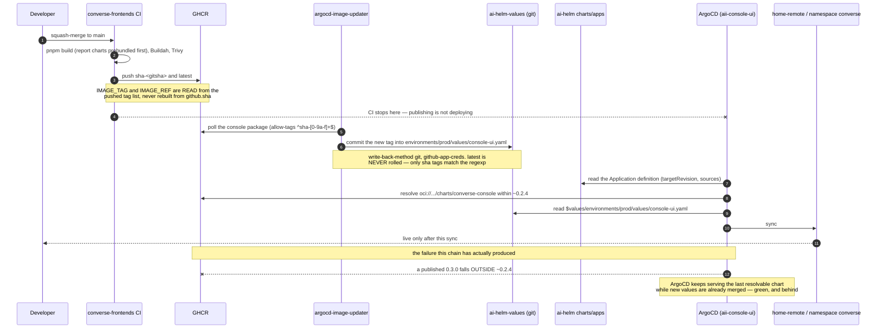
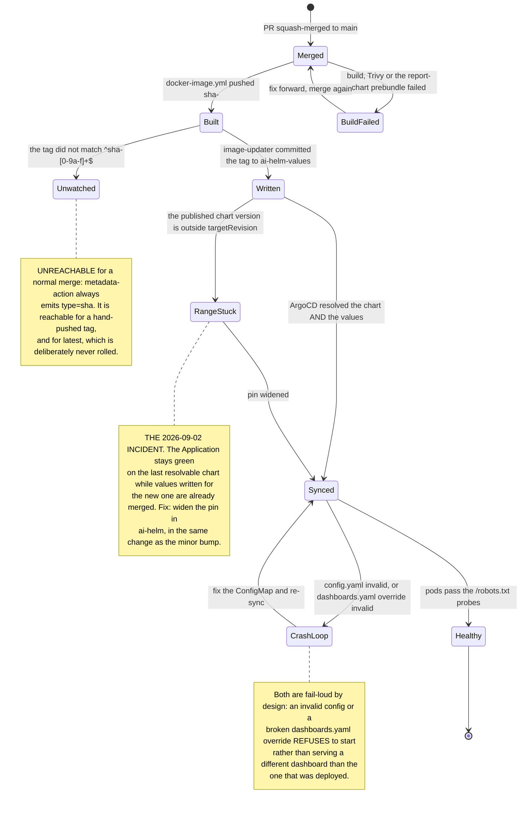

# Release and rollout — from a merged PR to a live console

**"Image built" is not "live."** This repository's CI publishes container images and Helm charts to
GHCR and stops there. Getting either of them running is ArgoCD's job, driven from two other
repositories. This page is the whole chain, the one incident it has actually produced, and how to
check that a change is live rather than assuming it.

Related but narrower: [`ci-cd.md`](ci-cd.md) (the workflows themselves),
[`infrastructure.md`](infrastructure.md) (the cluster), [`runbooks.md`](runbooks.md) (rollback),
[`observability.md`](observability.md) (the build stamp the whole chain carries).

---

## The four hops

| Hop | Who                                          | Produces                                                                   |
| --- | -------------------------------------------- | -------------------------------------------------------------------------- |
| 1   | `converse-frontends` CI (`docker-image.yml`) | `ghcr.io/adorsys-gis/converse-frontends/console:sha-<gitsha>` (+ `latest`) |
| 2   | `argocd-image-updater`                       | A **git commit** into `ai-helm-values`, updating the image tag             |
| 3   | ArgoCD Application `aii-console-ui`          | A sync of the `converse-console` chart against that values file            |
| 4   | The `home-remote` cluster                    | A rolled Deployment in the `converse` namespace                            |

Nothing in this repository initiates hop 3 or 4.

### Hop 1 — the image

Triggered on push to `main` and on `v*` tags (`.github/workflows/docker-image.yml:17`). Tags are
`docker/metadata-action` defaults plus `latest` on the default branch: branch ref, tag ref,
`sha-<short>` and `latest` (`.github/workflows/docker-image.yml:97`).

The package is **`.../converse-frontends/console`, distinct from `.../converse-frontends`**, and that
is deliberate (`.github/workflows/docker-image.yml:25`): image-updater watches an exact package name, and pushing the
console into the self-service package would roll a Node-server image onto a still-live nginx-static
Deployment — wrong port, wrong probes, wrong config mechanism, no PR anywhere in the loop.

The build stamp (`IMAGE_TAG`, `IMAGE_REF`) is **read out of the tag list that was actually pushed**,
never reconstructed from `github.sha` (`.github/workflows/docker-image.yml:120`). See
[`observability.md`](observability.md), "The build stamp".

### Hop 2 — image-updater writes back to `ai-helm-values`

Annotations on the `console-ui` entry in `ai-helm`'s `charts/apps/values.yaml`:

```yaml
argocd-image-updater.argoproj.io/image-list: frontend=ghcr.io/adorsys-gis/converse-frontends/console
argocd-image-updater.argoproj.io/frontend.update-strategy: newest-build
argocd-image-updater.argoproj.io/frontend.allow-tags: regexp:^sha-[0-9a-f]+$
argocd-image-updater.argoproj.io/write-back-method: git
argocd-image-updater.argoproj.io/git-repository: https://github.com/adorsys-gis/ai-helm-values.git
argocd-image-updater.argoproj.io/write-back-target: helmvalues:/environments/prod/values/console-ui.yaml
```

Only `sha-<hex>` tags are eligible — `latest` is never rolled. The helm paths it writes are
`console.controllers.main.containers.frontend.image.{repository,tag}`; the `console` prefix is the
chart's **subchart alias** (`Chart.yaml` `dependencies[].alias: console`), which is **not** the same
alias `converse-frontend` uses, so those annotation paths are not copy-paste between the two apps.

### Hop 3 — the Application, and the range pin

`aii-console-ui` (the `aii-` prefix is `ai-helm`'s `appNamePrefix`), two sources:

- **Source A** — `oci://ghcr.io/adorsys-gis/charts/converse-console`, `targetRevision: "~0.2.4"`.
- **Source B** — `ai-helm-values@main`, providing
  `$values/environments/prod/values/console-ui.yaml`.

Destination: namespace `converse` on the **`home-remote`** cluster.

**The chart's published version is derived, not written down.** `publish-charts-oci.yml` computes
`<major.minor from Chart.yaml>.<git rev-list --count HEAD -- charts/<name>>`
(`.github/workflows/publish-charts-oci.yml:102`) and never writes the patch back. So the `version:`
in `charts/converse-console/Chart.yaml` is a **floor**, and the registry holds a higher patch.

### Hop 4 — the pod

`charts/converse-console` mounts `config.yaml` at `/config/console/config.yaml` (and optionally
`dashboards.yaml` and a `report-templates` directory) and sets `CONSOLE_CONFIG`. Probes are HTTP
against `/robots.txt` (`charts/converse-console/values.yaml:122`) — deliberately a static path that
needs no session and no backend.

---

## The incident this chain has actually produced

**A minor chart bump publishes a version the Application's range does not resolve.**

`targetRevision: "~0.2.4"` means `>=0.2.4 <0.3.0`. Bumping `charts/converse-console/Chart.yaml`'s
minor publishes `0.3.0`, which that range **does not resolve** — so ArgoCD keeps serving the last
version it _can_ resolve, while a values file written for the new chart is already merged. The
symptom is a green Application that is quietly a release behind, with values that reference keys the
running chart does not have. That happened on 2026-09-02, and the warning now lives at the top of
`charts/converse-console/Chart.yaml` where the next person to bump it will read it.

**The rule:** adding a commit under `charts/` is enough to publish — the patch is derived. Bump the
**minor** only when the chart's SHAPE changes in a way a consumer must opt into, and **widen the pin
in `ai-helm` in the same change, before merging any values that depend on it.**

---

## The chain, and what each hop can fail into





---

## Verifying that a change is actually live

Do all three. The first two are cheap and the third is the only one that proves the running code.

**1. What image did ArgoCD actually deploy?**

```sh
kubectl --context home-remote -n argocd \
  get application aii-console-ui \
  -o jsonpath='{.status.summary.images}{"\n"}'
```

That prints the image references the Application is currently serving. Compare the `sha-` suffix
against the merge commit. If it is behind, check in order: did the image push (GHCR package tags),
did image-updater commit (`ai-helm-values` history for `environments/prod/values/console-ui.yaml`),
and did the chart resolve (`.status.conditions` — a range miss shows up there, not as a red health
status).

**2. Is it synced and healthy?**

```sh
kubectl --context home-remote -n argocd get application aii-console-ui \
  -o jsonpath='{.status.sync.status} {.status.health.status}{"\n"}'
```

**3. The live probes — what the running process says about itself.**

| Probe                         | Auth        | Tells you                                                    |
| ----------------------------- | ----------- | ------------------------------------------------------------ |
| `GET /robots.txt`             | none        | The pod is up and serving; this is what kubelet probes       |
| `GET /api/build-info`         | **session** | The build stamps of `authz-idp` and `authz-usage`            |
| `/settings/info` in a browser | session     | The console's own Image/Reference rows, plus every backend's |

`/api/build-info` (`apps/console/src/app/api/build-info/route.ts:29`) is **session-gated on purpose**
— not because a version string is sensitive, but because the route makes the console fan out to
internal origins on the caller's behalf, and left open it would be a small unauthenticated probe of
the cluster's internal topology. It answers `200` even when both backend reads fail: each service
carries its own `error`/`unavailable` status, because collapsing "the IdP is down" and "there is no
usage backend here" into one 502 helps nobody. `Cache-Control: no-store`, because the whole value of
the screen is that it reports what is running **right now**.

`/settings/info`'s Image row is `IMAGE_TAG`; the copyable Reference row is `IMAGE_REF`. They were one
field until the follow-up to #480 split them — see [`observability.md`](observability.md).

---

## Rolling back

The image tag lives in `ai-helm-values`, so a rollback is a commit there (or an ArgoCD history
rollback), not a rebuild here. `kubectl rollout undo` works but will be reverted by the next ArgoCD
sync — GitOps wins. See [`runbooks.md`](runbooks.md), "Rollback to a Previous Image".

---

## Checklist before calling a console change "shipped"

1. `pnpm -r typecheck` and `pnpm --filter console build:web` **locally** — the real Next build, which is
   the only thing that exercises the bundler and the report-chart prebundle.
2. Merged to `main`; `docker-image.yml` green.
3. `sha-<gitsha>` visible on the GHCR package.
4. `ai-helm-values` carries that tag in `environments/prod/values/console-ui.yaml`.
5. `.status.summary.images` on `aii-console-ui` shows it.
6. `/settings/info` shows it, and the backends it depends on report a version too.

If you changed anything under `charts/`, add: the published chart version is inside the
Application's `targetRevision` range, or the range was widened in `ai-helm` **first**.
