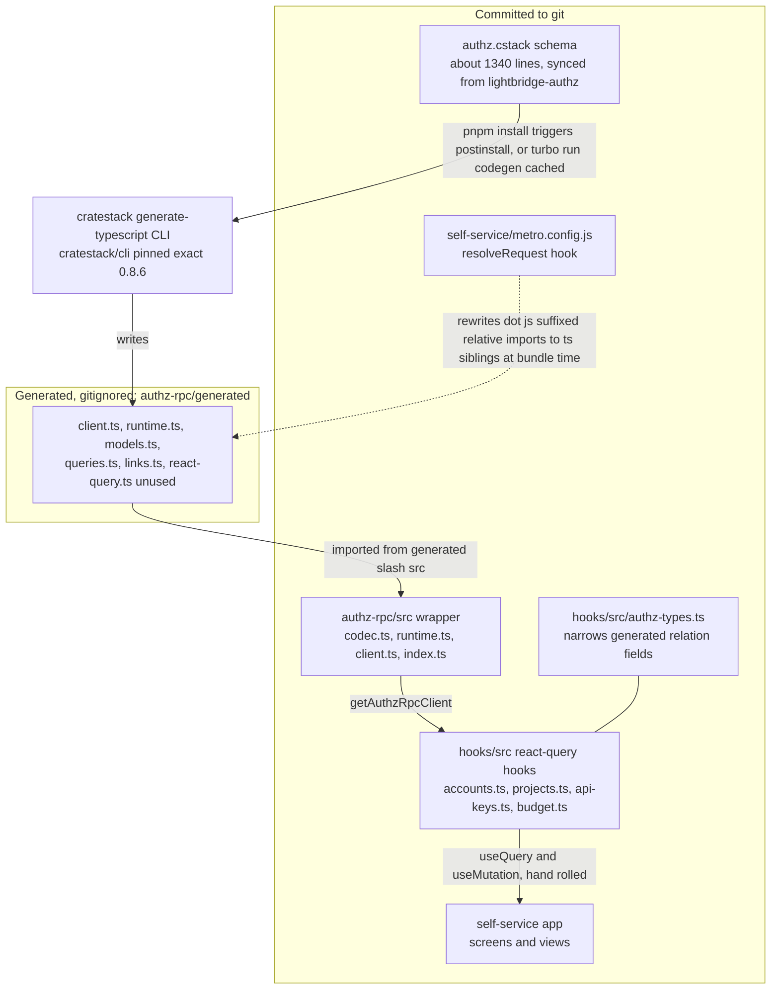
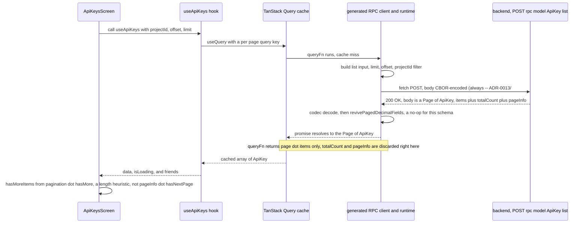

# RPC & Codegen — the AuthZ data layer

> Source of truth: `packages/authz-rpc/schema/authz.cstack` (synced from `lightbridge-authz`),
> `packages/authz-rpc/generated/` (build output, gitignored), `packages/authz-rpc/src/` (hand-written
> transport), `packages/hooks/src/` (react-query hooks).
> See also: `api-reference.md` (endpoint index), `architecture-conventions.md` (repo-wide layering
> rules — Routes → Screens → Views → Hooks → API Client).

This document covers the machinery underneath `api-reference.md`'s endpoint index: how
`authz.cstack` becomes a TypeScript client, what is committed vs. generated, the conventions a
caller must know to read a response or build a request correctly, and one real request's lifecycle
end to end. Everything below was verified directly against the code in this repository (schema
line numbers, generated output, hook implementations, tests) rather than restated from other docs
or from the schema's own comments — several of those turned out to be stale (see the `@readonly`
section and the `api-reference.md` diff this PR carries). Where something could not be verified
from this repo alone (e.g. live backend responses), that's stated explicitly rather than assumed.

The REST-transport Usage API (`packages/api-rest/`) is out of scope here — see
`architecture-conventions.md` and `api-usage-backend.md` for that half of the data layer. This
document is AuthZ RPC only.

---

## 1. The pipeline: schema → codegen → transport → hooks → UI



**What's committed vs. generated, concretely:**

| Path                                                        | Status                           | Role                                                                                                                                                           |
| ----------------------------------------------------------- | -------------------------------- | -------------------------------------------------------------------------------------------------------------------------------------------------------------- |
| `packages/authz-rpc/schema/authz.cstack`                    | Committed                        | Source of truth — a cratestack schema, ~1340 lines, copied from the backend repo                                                                               |
| `packages/authz-rpc/generated/`                             | **Gitignored** (`.gitignore:34`) | 100% codegen output. Never hand-edit; regenerated by `pnpm install`.                                                                                           |
| `packages/authz-rpc/src/codec.ts`                           | Committed                        | JSON/`cborg`-based CBOR wire codecs — `apps/self-service`'s codec (until Expo cutover)          |
| `packages/authz-rpc/src/web-codec.ts`                        | Committed                        | `@cratestack/cbor`-based CBOR codec — `apps/console`'s codec (WASM, browser-only)                |
| `packages/authz-rpc/src/runtime.ts`                         | Committed                        | `AuthzRpcRuntime` — wraps the generated `CratestackRpcRuntime` via composition, adding token-refresh/401-retry (auth flow itself is out of scope for this doc) |
| `packages/authz-rpc/src/client.ts`                          | Committed                        | `useAuthzRpcClient()`/`getAuthzRpcClient()` — module-level singleton client accessors                                                                          |
| `packages/authz-rpc/src/index.ts`                           | Committed                        | Public package entrypoint — re-exports the wrapper plus everything from `generated/src/models`                                                                 |
| `packages/hooks/src/authz-types.ts`                         | Committed                        | Thin `Omit<...>` layer narrowing generated relation fields the app never populates (`include` is never passed)                                                 |
| `packages/hooks/src/{accounts,projects,api-keys,budget}.ts` | Committed                        | react-query hooks — call `getAuthzRpcClient()` directly, do **not** use the generated `react-query.ts`                                                         |
| `apps/self-service/metro.config.js`                         | Committed                        | Bundler-level patch for a codegen output quirk — see §5                                                                                                        |

**Note on `client.projectMembers`:** the generated client also exposes a `ProjectMemberApi`
(`list`/`get`/`update`/`delete`) because `ProjectMember` is a real model in the schema — but every
one of those calls is fail-closed at the RBAC gate unconditionally. `ProjectMember` exists in the
schema only so `.some`/`.every`/`.none` policy predicates on `Project`/`ApiKey` can traverse into
it; the real roster surface is `procedure.listProjectRoster` and friends. See `api-reference.md`'s
"Project Roster" section. `packages/hooks` never calls `client.projectMembers.*`.

**Note on `generated/src/react-query.ts`:** the CLI also emits a full set of `use<X>Query`/
`use<X>Mutation` hooks wired to `@tanstack/react-query`. Confirmed by grep across `apps/` and
`packages/` that nothing imports from it — `packages/hooks` builds its own `useQuery`/`useMutation`
calls against `getAuthzRpcClient()` instead, one hand-written hook per concern (pagination options,
query-key shape, cache invalidation on mutation success, etc., all differ per hook in ways the
generated one-size-fits-all hooks don't cover). It is dead code from this app's perspective, not a
missing integration — nothing currently depends on wiring it up.

---

## 2. Codegen mechanics

### The script is named `codegen`, not `codegen:cratestack`

`packages/authz-rpc/package.json`'s `codegen` script is:

```json
"codegen": "cratestack generate-typescript --schema schema/authz.cstack --out generated --package-name @lightbridge/authz-rpc --full-selection"
```

It used to be named `codegen:cratestack` — renamed in
[#159](https://github.com/ADORSYS-GIS/converse-frontends/pull/159) (`fix(authz-rpc): make pnpm
install regenerate the RPC client`). That PR's premise: `generated/` is gitignored build output,
but a bare `pnpm install` never produced it, because the repo-root `codegen:all` script
(`pnpm -r --if-present run codegen`) only matches scripts literally named `codegen`, and
`--if-present` silently skipped `codegen:cratestack`. CI papered over the gap with an explicit
`codegen:cratestack` step of its own, so only local/onboarding setups were bitten, and silently.
`--full-selection` means every scalar field the schema declares is projected — no partial-selection
optionality beyond the schema's own nullability, which is why `authz-types.ts` (above) only needs
to narrow _relation_ fields, not scalars.

The rename alone would have broken CI, because `cratestack` used to be an external Rust binary
both workflows curled from GitHub Releases and installed onto `PATH` _after_ `pnpm install` — a
codegen wired into `postinstall` would have run a binary not yet present. #159 also added
`@cratestack/cli` — the exact pinned `0.7.16` published to npm — as a `devDependency`, whose own
postinstall fetches the identical GitHub Releases asset. That closed the ordering gap: no
separately-installed tooling is needed anymore, `pnpm install` alone is sufficient, locally and in
CI. (`@cratestack/cli`'s postinstall is allowlisted under `allowBuilds` in `pnpm-workspace.yaml` —
pnpm does not run dependency build scripts otherwise.)

### `pnpm install` (unconditional) + Turbo (cached)

Two layers, not one, added in two separate PRs on the same day:

1. **`postinstall` → `codegen:all` → `codegen`** (#159, above). Runs on every `pnpm install` that
   actually changes dependencies (a fresh clone, a fresh CI checkout, or any install that isn't a
   no-op). `pnpm install` short-circuits to "Already up to date" without running lifecycle scripts
   when nothing changed — the one case this path does _not_ regenerate `generated/` is `generated/`
   being deleted/stale while `node_modules` is current; the fix there is the manual one-liner
   `pnpm --filter @lightbridge/authz-rpc run codegen`.
2. **Turbo `codegen` task** (#161, `feat(codegen): wire codegen into Turbo, closing the gap left by
#159`, merged as the current `origin/main` tip, `8ea2b6b`). `turbo.json` declares `codegen` with
   `outputs: ["generated/**", "src/client/**"]`, and `build:web`/`build-storybook` both declare
   `dependsOn: ["codegen"]` (transitively, via `^build:web`). This is a _cache_ for repeated
   `turbo run` invocations layered on top of #159's unconditional regeneration — not a replacement
   for it. `packages/api-rest/turbo.json` overrides that package's own `codegen` inputs to include
   `openapi/usage.backend.yaml` (which lives outside the package directory, so Turbo's default
   per-package file hashing wouldn't see it); `authz-rpc` needed no such override since its only
   real input, `schema/authz.cstack`, already lives inside its own package directory.

#159 was deliberately scoped to _not_ add the Turbo task — caching a generator that had already
caused one silent version-drift incident needed a considered decision, not a drive-by addition to
a bug fix. #161 added it after empirically confirming (not assuming) that Turbo's cache correctly
invalidates on a schema edit, on a `@cratestack/cli` version bump with the schema unchanged, and
fails closed (blocks `build:web`) on an invalid schema edit.

### The version pin is a lockstep contract, not a normal dependency

`@cratestack/cli` is pinned **exact** (no `^`) in `packages/authz-rpc/package.json`, and that
version must match `lightbridge-authz`'s own `cratestack`/`cratestack-pg` pin
(`[workspace.dependencies]` in that repo's root `Cargo.toml`) — nothing enforces this
automatically; it is a manual convention, and drift is silent and destructive. This is not
hypothetical: it is exactly how
[lightbridge-authz#282](https://github.com/ADORSYS-GIS/lightbridge-authz/issues/282) happened
(cratestack 0.7.11 changed `Value`'s wire format from externally-tagged to untagged; this
generator stayed on 0.4.16 and kept hand-tagging `Json` fields to the old shape; the untagged
backend decoded the stale tagged payload _without error_ and silently defeated the `allowedModels`
governance allowlist). See `packages/authz-rpc/README.md` for the full incident writeup — it is
the canonical source for this story, not repeated in full here.

### The class of bug this pipeline creates: a version bump can change output no diff shows

Bumping `@cratestack/cli`'s pin changes what gets _generated_, not anything committed — so
`git diff` on the PR that bumps the pin shows a one-line `package.json` change, nothing more. The
actual behavior change only surfaces the next time someone runs a clean regeneration (a fresh
clone, a fresh CI checkout, `node_modules` wiped). Two confirmed instances of this exact class of
bug, both traced to the 0.7.16 pin bump on the same day:

1. **`.js`-suffixed relative imports broke the web build for two weeks.** cratestack-cli 0.7.16
   (pinned in [#150](https://github.com/ADORSYS-GIS/converse-frontends/pull/150) for its required
   `Value`-untagging fix) started generating ESM-style relative imports with an explicit `.js`
   extension (`from "./runtime.js"`), following the TypeScript convention where a `.js` specifier
   resolves to the sibling `.ts` source at compile time. Metro doesn't apply that convention — it
   looks for a literal `runtime.js` file, finds none, and fails. This broke `turbo run build:web`
   (and therefore the Docker image build) on any clean codegen regeneration, which is exactly what
   CI does — a warm local working tree with `generated/` already on disk never re-triggered
   codegen, so the break stayed invisible locally for as long as nobody deleted `generated/` or
   `node_modules`. Fixed in
   [#151](https://github.com/ADORSYS-GIS/converse-frontends/pull/151) — see §5.
2. **`@readonly` fields stopped being dropped from generated `Create`/`Update` input types** (or
   possibly never were, under 0.7.16's TypeScript generator specifically — this repo has no
   evidence of the prior behavior beyond the schema's own comments asserting it). Verified directly
   against `packages/authz-rpc/generated/src/models.ts`: `UpdateApiKeyInput`, `UpdateAccountInput`,
   `UpdateProjectInput`, and `CreateProjectInput` all still carry every `@readonly` field (as
   optional on `Update*`, and — for `CreateProjectInput`, the one model with a generic `create` —
   as **required**). This contradicts the schema's own comment on `ApiKey` ("`@readonly` drops a
   field from BOTH the generated `CreateApiKeyInput` and `UpdateApiKeyInput`"). Unlike the Metro
   break, this one produces no build failure and no test failure by itself — it's a silent
   type-level gap a caller only discovers by reading the generated file directly, which is how it
   surfaced here. See §4's `@readonly` section for the full writeup, including how
   `packages/hooks/src/projects.ts` already works around it correctly.

**The general lesson, not specific to either incident:** a generator version bump is a real,
unreviewable diff. Treat `@cratestack/cli`'s pin the same way you'd treat a compiler upgrade that
changes codegen, not a routine dependency bump — re-verify the _emitted output_ after bumping it
(diff `generated/` against the previous version's output, don't just trust a green CI run), not
only the changelog.

---

## 3. Conventions a caller must know

Each of these was checked against `authz.cstack` directly (line numbers cited), not carried
forward from another doc's prose.

### `@@paged` — every `list` wraps in `Page<T>`, and it's live

`@@paged` (bare form; `authz.cstack:33-42`'s comment confirms configurable paging modes aren't
implemented upstream yet) is declared on all four paged models — `Account` (`:71`), `Project`
(`:119`), `ApiKey` (`:175`), `ProjectMember` (`:233`). Every `model.<X>.list` call returns
`Page<X> { items: X[], totalCount: number | null, pageInfo: { limit, offset, hasNextPage,
hasPreviousPage } }`, not a bare array. This mirrors `cratestack-core::page::{Page, PageInfo}`
field-for-field server-side.

**This is genuinely consumed, not vestigial:** `packages/hooks/src/accounts.ts` and
`packages/hooks/src/projects.ts` both read `page.items`/`page.totalCount`/
`page.pageInfo.hasNextPage` directly — `fetchAllAccounts`/`fetchAllProjects` page through
`hasNextPage` to accumulate a complete list (not currently called from any screen — defined and
tested, but unwired), and `useAccounts`/`useProjects` expose `totalCount` alongside `data`.

**A stale comment exists on this exact point, and a caller should know about it without this repo
editing it.** `packages/hooks/src/pagination.ts`'s `usePagination` hook still carries this doc
comment on its `hasMore` field: _"The list endpoints return a bare array with no total-count, so
`hasMore` is the documented length-vs-limit heuristic"_ — this was true of the pre-migration REST
API and is no longer true of the RPC surface. The same stale claim is duplicated, near-verbatim, in
`apps/self-service/src/screens/api-keys-screen.tsx` (around its `hasMoreItems` computation): _"The
backend returns a bare array with no total-count, so `hasMore` is the documented length-vs-limit
heuristic from usePagination, not an exact count."_ Both comments are wrong about the backend today
— `ApiKey.list` is `@@paged` exactly like every other list op-id. What's actually true is narrower
and worth stating precisely: `packages/hooks/src/api-keys.ts`'s `useApiKeys` _discards_
`page.totalCount`/`page.pageInfo` and returns only `page.items` (`return page.items;`), so the
screen genuinely has no total count _available to it_ — not because the backend doesn't provide
one, but because this one hook drops it before the screen ever sees it. `accounts.ts`/`projects.ts`
do not have this gap; their hooks expose `totalCount` and their screens could use
`pageInfo.hasNextPage` instead of the heuristic if they chose to. This document does not edit
`pagination.ts` or the screen (out of scope for a docs-only change) — this is the accurate
record of what the comment claims vs. what the schema and the rest of the hooks layer actually do.

### Money and large integers travel as decimal strings, never `Int`

Every micro-USD amount in the schema (`requestedAmountMicros`, `approvedAmountMicros`,
`maximumAmountMicros` on `Decision`/`SimulateBudgetPolicyInput`/`AugmentationRequest`) is typed
`String`, not `Int` — deliberately. The schema's own comment (`authz.cstack:538-547`) explains why,
checked directly against cratestack's own codegen source: `Int` maps to a full-range Rust `i64`
server-side (safe), but the generated _TypeScript_ client types `Int` as a bare JS `number` — a
double, lossy above `2^53` (`Number.MAX_SAFE_INTEGER`, `9007199254740991`). Encoding these fields
as decimal strings instead sidesteps that entirely; there is no native large-integer field
anywhere in this schema to use as a counter-example.

`packages/hooks/src/budget-tiers.ts`'s `formatMicroUsd` is the reference implementation for
consuming one of these: BigInt arithmetic end to end, `Number()`/`parseFloat` never enter the
picture (`budget.test.ts` has a regression comment: _"`Number.MAX_SAFE_INTEGER` is
9007199254740991; one above it would silently round in `Number()`"_). **Never round-trip a
`*Micros` string through `Number()`** — not even for display; use BigInt or a string-preserving
formatter.

**A likely source of confusion, worth naming explicitly:** `packages/authz-rpc/package.json` lists
`decimal.js` as a dependency, and the generated `generated/src/models.ts` imports `DecimalJs`
(aliased `Decimal`) and exports `reviveDecimalFields`/`revivePagedDecimalFields`/
`reviveDecimalScalar` functions that every generated model/procedure call site runs its response
through. This machinery is **unrelated to the money-string convention above.** It backs
cratestack's own `Decimal` scalar type (cratestack#498) — a _different_ schema type from `String`,
for fields that need real arbitrary-precision arithmetic client-side (`.plus()`/`.minus()`/etc.).
This schema does not declare a single field as `Decimal` anywhere: `decimalShapes` in
`generated/src/models.ts` lists every model/type in the schema, and every one of them has
`keys: []` — the empty set. `reviveShaped` (the function that would convert a string field into a
real `Decimal` instance) is consequently a no-op on every response this schema's client ever
decodes. The actual protection for money fields is the `String` typing plus BigInt-only handling
in `budget-tiers.ts`, not this `Decimal`/`decimal.js` machinery — which exists in the generated
output purely because it's part of cratestack's generic template, unconditionally emitted whether
or not the schema uses it.

### `Json` fields are untagged on the wire

As of backend v3.0.0 / cratestack-cli 0.7.11+ (this repo pinned at exactly `0.8.6`), `Json`
columns (`Project.allowedModels`, `Project.defaultLimits`) are plain, untagged values on the wire —
`{}` stays `{}`, `["x"]` stays `["x"]`. An older tagging layer (`tagProjectJsonFields`, matching an
externally-tagged `Value` format from cratestack-cli 0.4.16) was deleted as part of the 0.7.16
upgrade (lightbridge-authz#282, converse-frontends#149 — the same incident referenced in §2's
version-pin section). `packages/authz-rpc/src/codec.ts` has no tagging/untagging step of any kind
today — the generated client's `JsonValue` type is exactly what goes over the wire in both
directions.

`packages/authz-rpc/src/codec.test.ts` carries the regression guard for this: a payload with
`allowedModels: ['gpt-4']` must round-trip as the bare array through both `CborCodec` and
`JsonCodec`, and a dedicated test (_"fails if allowedModels is ever externally tagged again"_)
explicitly asserts the decoded value is `Array.isArray(...)`, not an object with a `List`/`Map`
key — the exact shape difference that let a stale tagged payload silently defeat the backend's
`allowedModels` governance allowlist in #282 (`json_to_vec`'s `as_array()` returns `None` for an
object, which the enforcement path read as "no restriction, allow all models").

### `@readonly` fields: present in the generated type, enforced server-side and silently

See `api-reference.md`'s "`@readonly` vs `@server_only`" note (under API Keys) for the full,
schema-line-cited writeup — summarized here since it's central to this doc's own class-of-bug
discussion in §2:

- `@server_only` (e.g. `ApiKey.keyHash`) really is dropped from the generated TypeScript shape
  entirely, on every operation — confirmed absent from `ApiKey`/`UpdateApiKeyInput` in
  `generated/src/models.ts`.
- `@readonly` is **not** dropped from `Update<X>Input` (present as optional) or, for `Project` (the
  one model with a generic `create`), from `CreateProjectInput` -- present there too, on every
  cratestack-cli version this repo has used (currently **0.8.6**). **Correction to an earlier
  revision of this doc:** that revision claimed a `@readonly` field is "always optional, not
  required" in `CreateProjectInput` as of 0.8.4 -- checked directly against
  `generated/src/models.ts` and that is not what determines it. What actually determines
  optionality is the field's own **schema-level nullability**, unrelated to `@readonly`:
  `allowedModels` (`Json?`) and `projectQuota` (`String?`) generate as optional (`field?: T | null`)
  because their schema type is nullable; `isDefault` (`Boolean`), `status` (`String`), and
  `modelPolicy` (`String`, ADR-0018, joined this bucket via the lightbridge-authz#418 schema sync)
  generate as **required** (`field: T`) because their schema type is not, `@readonly` notwithstanding.
  Either way -- required or optional -- the field is never actually _dropped_ from either generated
  input type on any version this repo has used, which is the part that contradicts the schema's own
  comment and is the actually load-bearing fact for callers.
- The actual enforcement is server-side and silent: `packages/hooks/src/projects.ts`'s
  `buildCreateProjectInput` documents this directly — it must still supply `isDefault: false`/
  `status: 'active'`/`modelPolicy: 'allow_all'` to satisfy `CreateProjectInput`'s required fields,
  with the comment _"Any caller-supplied value is ignored server-side, same as `status` above."_
  `allowedModels`/`projectQuota` joined `isDefault`/`status` in this same `@readonly` bucket via
  lightbridge-authz#415/#379 -- `procedure.setProjectAllowedModels`/`procedure.setProjectQuota` are
  the dedicated-procedure answer for those two, matching `updateAccountDefaultQuota`'s precedent
  above. `modelPolicy` has **no** dedicated-procedure answer yet -- ADR-0018 Decision 5 deliberately
  deferred a `setProjectModelPolicy`-style write path until `allowedModels` got catalogue validation
  (lightbridge-authz#415/#417, now shipped); until that lands, `modelPolicy` is readable only, and
  every project this app can create is stuck at the DB `DEFAULT`, `allow_all`.

**What this means for UI, precisely:** a field marked `@readonly` in the schema cannot safely be
made editable, no matter what a design doc or ticket says — but that guardrail today is a UI/hook
_convention_, not something the TypeScript compiler enforces. `packages/hooks/src/api-keys.ts`'s
`useUpdateApiKey` takes the full generated `UpdateApiKeyInput` type as its `input` parameter; the
current app only ever calls it with `{ name, expiresAt }` (`api-key-settings-screen.tsx`), but
nothing in the type signature would catch a future call site that added `status` or `billingPlan`
to that object — it would compile, transmit, and (per the `projects.ts` precedent) be silently
discarded server-side rather than rejected. Treat every `@readonly` field the same way regardless
of which model it's on: never wire it to an editable control, and don't rely on a red squiggly to
catch a mistake here.

### List filtering is equality-only — there is no server-side text search

Confirmed against both the schema and the generated query builder. The schema's `filters` field on
every `list` op-id is `[{ key: string, value: string }]` — arbitrary `(key, value)` equality
predicates, mirroring `cratestack_axum::rpc::RpcListPredicate` exactly
(`generated/src/queries.ts:38-44`). `where`/`or` are **not** JSON filter objects; they're pre-built
flat filter-expression _strings_ the server's `FilterExpressionParser` parses —
`key=value` predicates joined by `,` for AND, `|` for OR, `not(...)` for negation, parens for
grouping (`generated/src/queries.ts:17-30`, itself citing `crates/cratestack-axum/src/query.rs`).
There is no substring, prefix, or full-text operator anywhere in this grammar — every predicate,
however it's composed, is an exact-match `key=value` comparison.

**Concretely, this determines how a searchable picker must work:**
`packages/ui/src/components/picker/component.tsx`'s `PickerList` filters entirely client-side —
`options.filter((option) => option.label.toLowerCase().includes(needle) || ...)` — over whatever
`options` array its caller passes in. Its own doc comment states the constraint plainly: _"Filters
over exactly the `options` it's given — it is the caller's responsibility to pass the *complete*
set (not one page of it), otherwise search would silently hide items that were never fetched. This
component performs no fetching itself, so it cannot detect that on its own."_ There is no code path
anywhere in this package that sends a partial/typed search string to the RPC surface — a searchable
picker over a large collection is, today, structurally a "load everything, then filter in memory"
problem, not a "query the server as you type" one.

---

## 4. The Metro resolver coupling (`apps/self-service/metro.config.js`)

`apps/self-service/metro.config.js:23-46` extends an existing `resolveRequest` hook (originally
added for an unrelated `idb-keyval` ESM/`exports`-map issue) with a second branch specifically for
cratestack codegen output:

```js
// (abridged — see the file for the full comment)
if ((moduleName.startsWith('./') || moduleName.startsWith('../')) && moduleName.endsWith('.js')) {
  const originDir = path.dirname(context.originModulePath);
  const literalJsPath = path.resolve(originDir, moduleName);
  if (!fs.existsSync(literalJsPath)) {
    const specifierWithoutExt = moduleName.slice(0, -'.js'.length);
    const sourceExt = ['.ts', '.tsx'].find((ext) =>
      fs.existsSync(path.resolve(originDir, `${specifierWithoutExt}${ext}`))
    );
    if (sourceExt) {
      const resolve = originalResolveRequest ?? context.resolveRequest;
      return resolve(context, `${specifierWithoutExt}${sourceExt}`, platform);
    }
  }
}
```

**Why it exists (§2 covers the incident; this is the mechanism):** cratestack-cli 0.7.16 emits
ESM-style relative imports with an explicit `.js` extension —
`packages/authz-rpc/generated/src/client.ts` literally imports `from "./runtime.js"`,
`from "./queries.js"`, etc. This follows the
TypeScript-native convention (`"moduleResolution": "bundler"`/`"nodenext"`-style) where a `.js`
specifier in _source_ is understood to resolve to the sibling `.ts` file once compiled — no `.js`
file needs to actually exist on disk for `tsc` to accept this. Metro does not apply that
convention: given `./runtime.js`, it looks for a literal file named `runtime.js`, finds none
(only `runtime.ts` exists), and resolution fails outright.

The hook rewrites such a specifier to its `.ts`/`.tsx` sibling, but **only** when no real `.js` file
sits at the literal path and a `.ts`/`.tsx` sibling actually exists — so a bare package specifier
(`from "react"`) or a genuine `.js` file elsewhere in the tree is left completely untouched, and the
pre-existing `idb-keyval` branch and `originalResolveRequest` delegation chain are preserved
unchanged.

**Why nobody should remove it:** without this hook, any clean codegen regeneration — which is what
every CI run and every fresh clone does — reproduces the exact two-week web-build break described
in §2. The hook is coupled to `packages/authz-rpc/generated/`'s existence, not to a specific
schema or a specific set of filenames; it will keep working across future schema changes as long as
cratestack's TypeScript generator keeps emitting `.js`-suffixed relative imports. If a future
`@cratestack/cli` version changes that emission convention (extensionless imports, `.mjs`, or
proper Metro-compatible output), this hook becomes dead code, not a source of bugs — safe to leave
in place until confirmed unnecessary, unsafe to remove speculatively.

---

## 5. One real request's lifecycle

Concrete example: an "API Keys" screen loading one page of keys for a project —
`apps/self-service/src/screens/api-keys-screen.tsx` → `packages/hooks/src/api-keys.ts`'s
`useApiKeys` → the generated client → the backend. Chosen because it exercises the codec, the
`@@paged` envelope, and the exact totalCount-discarding behavior §3 documents.



Two things this diagram makes visible that prose alone tends to hide:

- **The `Page<T>` envelope crosses the wire correctly** (`totalCount`/`pageInfo` are really there in
  the HTTP response) — the loss happens one hop _later_, inside `useApiKeys`'s `queryFn`, which
  discards everything except `.items` before it ever reaches the screen or the cache. This is the
  precise, verified version of the "stale comment" story in §3: the backend is not the reason
  `hasMore` is a heuristic here; this one hook's own return shape is.
- **`revivePagedDecimalFields` runs on every list response and does nothing** for this schema,
  because `decimalShapes['ApiKey'].keys` is `[]` (§3). It is not dead code in general — it is dead
  _for this schema specifically_, which is a distinction worth keeping straight when reading the
  generated file: the machinery is schema-agnostic cratestack boilerplate, its effect is not.

For an authenticated header/token-refresh sequence on the same request, see
`packages/authz-rpc/src/runtime.ts`'s `authenticatedFetch`/`tryProactiveRefresh`/`performRefresh` —
deliberately not diagrammed here, since token/auth handling is covered elsewhere, not by this
document.
