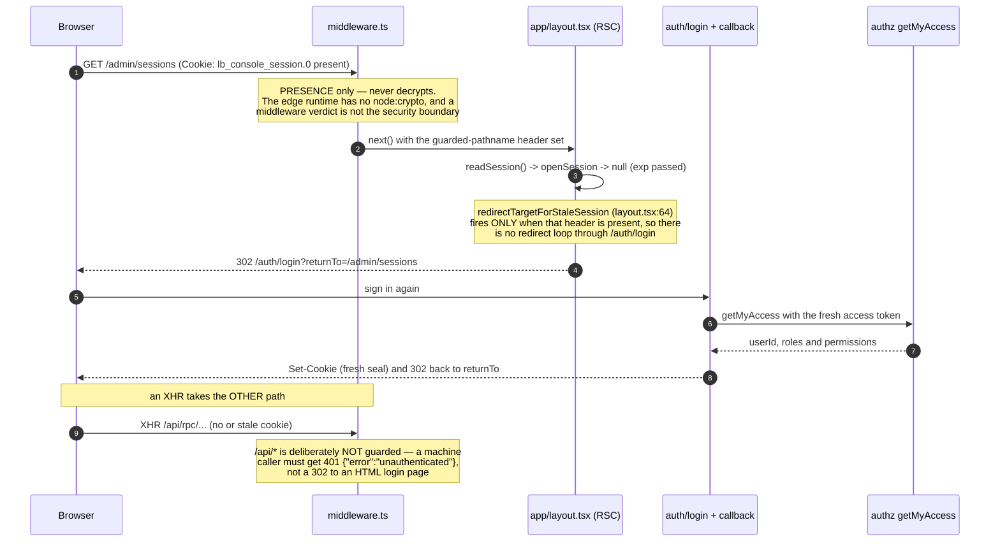
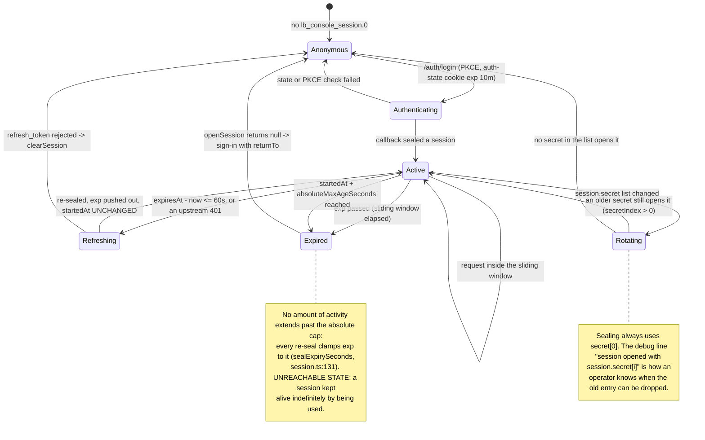

# Sessions and access — the cookie, its TTL, and the permission gate

Two things this page covers, because they live on the same cookie: **what the console's session
seal is and how long it lives**, and **how a screen decides whether to render**.

Reasoning lives elsewhere — do not restate it here:

- [ADR 0009](../adr/0009-nextjs-console-replacement.md) D2 — tokens live in the cookie and only in
  the cookie, never in page JavaScript.
- [ADR 0016](../adr/0016-session-cookie-iron-session.md) — why iron-session was **rejected**, with
  the measurements, and the two gaps it correctly identified (D3.1 server-enforced expiry, D3.2
  secret rotation) that were closed in the code that was already there.
- [ADR 0015](../adr/0015-admin-console-v2-declarative-dashboards-permissions-export.md) D4 — why
  the console asks for permissions instead of deriving them.
- [`authorization-and-permissions.md`](authorization-and-permissions.md) — the gate table and the
  server-side boundary behind it.

---

## Part 1 — the session cookie

### The seal

| Property        | Value                                                                                                                   |
| --------------- | ----------------------------------------------------------------------------------------------------------------------- |
| Algorithm       | JWE compact, `alg: dir` + `enc: A256GCM`, via `jose` (`sealSession`, `apps/console/src/server/session.ts:149`)          |
| Key derivation  | `hkdfSync('sha256', secret, 'lightbridge-console', 'session-cookie-v1', 32)` (`apps/console/src/server/session.ts:119`) |
| Cookie name     | `lb_console_session.<N>` (`apps/console/src/server/cookie-names.ts:9`)                                                  |
| Chunk size      | 3500 characters (`MAX_COOKIE_CHUNK_LENGTH`, `apps/console/src/server/cookie-names.ts:18`)                               |
| Chunk ceiling   | **2** (`MAX_COOKIE_CHUNKS`, `apps/console/src/server/cookie-names.ts:40`)                                               |
| Clock tolerance | 30 s (`SESSION_CLOCK_TOLERANCE_SECONDS`, `apps/console/src/server/session.ts:95`)                                       |

All paths are under `apps/console/src/server/`.

### TTL — two clocks, not one

`SessionTtl` (`apps/console/src/server/session.ts:83`) is a pair, and both are configurable
(see [`console-configuration.md`](console-configuration.md)):

- **`session.maxAgeSeconds`** — the **sliding** window (default 12 h). Stamped both as the seal's
  JWE `exp` and as the cookie's `Max-Age`, so the two cannot disagree. Every token refresh re-seals
  and pushes it out, so an active session is never signed out mid-work.
- **`session.absoluteMaxAgeSeconds`** — the ceiling the sliding window slides within (default 7 d),
  measured from `ConsoleSession.startedAt` — the **original** login, carried unchanged through every
  refresh, not the last refresh.

`sealExpirySeconds` (`apps/console/src/server/session.ts:131`) is `min(sliding, absolute)`, exported so a reader can check
the clamp without decrypting anything. A value at or below `now` still writes the seal (throwing
would turn a routine refresh into a 500); `openSession` refuses it on the very next request.

`openSession` (`apps/console/src/server/session.ts:199`) returns `null` — never throws — for three refusals, and all three
are **indistinguishable to the caller from "no cookie at all"** on purpose:

1. **No `exp` at all.** `requiredClaims: ['exp']` is explicit rather than relying on jose's
   "absent `exp` is not expired" default. This is what refuses every cookie sealed before the
   ADR 0016 follow-up landed. One re-login, once.
2. **`exp` in the past**, within the clock tolerance.
3. **Past the absolute cap** — re-checked against the **current** config, so lowering
   `session.absoluteMaxAgeSeconds` takes effect on the next request instead of waiting out the
   longest seal already in the wild.

### Secret rotation

`session.secret` is **always a list** — a plain string normalises to a one-entry list. Entry `[0]`
seals (`sealingSecret`, `apps/console/src/server/session.ts:163`); **every** entry is tried on open, in order
(`openSessionWithSecretIndex`, `apps/console/src/server/session.ts:221`). A miss costs one HKDF plus one failed AES-GCM tag
check, so a two- or three-entry list during a rotation is not a measurable expense.

`openSession` logs `session opened with session.secret[<i>]` at **debug** level on every request —
that is what tells an operator running a rotation whether anyone is still on the old secret before
they drop it. The procedure itself is in
[`console-configuration.md`](console-configuration.md), "Rotating `session.secret`".

### Chunking, and why the ceiling is 2

The AEAD tag covers the whole concatenated seal, so a dropped, reordered or foreign-swapped chunk
fails authentication and lands in the `null` path — chunking is string arithmetic, not crypto.
Unused tail slots are explicitly expired on every write; reassembly stops at the first gap
(`joinCookieChunks`, `apps/console/src/server/session.ts:341`).

The ceiling is arithmetic, not taste (`apps/console/src/server/cookie-names.ts:40`): a real admin's seal is ~6123 B = two
chunks, and the `Cookie` header echoed back on **every request** is ~6.2 KB. nginx's
`large_client_header_buffers` default is 8 KB per header and Node's `http.maxHeaderSize` is 16 KB
for the whole block, so a third chunk already crosses the first. Exceeding it is a **hard, logged
refusal at seal time** (`SessionTooLargeError`, `apps/console/src/server/session.ts:290`), not a silently truncated cookie
set that reassembles into ciphertext which cannot decrypt.

### Expired means "sign in again", never an error page





---

## Part 2 — access

### `getMyAccess` is asked, never derived

`procedure.getMyAccess` returns `{ userId, roles[], permissions[] }` for the authenticated caller.
`permissions` are canonical `resource:action` strings the **server** resolved the caller's roles
into — read back out of the very auth context every `@allow` clause is evaluated against.

`fetchMyAccess` (`apps/console/src/server/access.ts:60`) is called at login and on every refresh, and its answer is stored
on the encrypted cookie. It is the one procedure gated on **no permission at all**, precisely so the
console can ask "what may I render?" without first knowing the answer.

There is no role → permission map in the console, no wildcard expansion, and no `lightbridge-admin`
special case. `apps/console/src/no-role-derived-gates.test.ts` is the ratchet that keeps it that
way — it strips comments first, on purpose, so the doc comments recording what `isAdmin` was and why
it went can stay.

### Fail closed, and say which failure it was

A failure to reach `getMyAccess` yields `{ permissions: [], accessVerified: false }` (`UNVERIFIED`,
`apps/console/src/server/access.ts:41`) — never a cached previous answer, never an assumed-admin fallback. The token's own
role claim is kept as `fallbackRoles` for **display only**.

`accessVerified` is what lets the chrome distinguish "verified, and this person holds nothing" from
"we could not ask", instead of rendering an unexplained empty nav.

A cookie sealed before permissions existed is **normalised**, not rejected: it lands in the same
fail-closed empty set with `accessVerified: false`, which is the state a forced global sign-out
would have reached anyway.

### The gate

```ts
can(session, 'rbac:manage'); // access.ts:98
canAny(session, ADMIN_AREA_PERMISSIONS); // access.ts:103
canReachAdminArea(session); // access.ts:108
```

`GateSubject` accepts `null`/`undefined` and a session whose `user` is missing — both answer `false`
rather than throwing. Failing closed and failing loudly are both acceptable; a security check that
throws surfaces as a 500 rather than a refusal, so this one fails closed.

The client mirror is `client/use-can.ts`, reading the same array off `/api/session`.

The permission vocabulary is `PERMISSION` (`apps/console/src/shared/permissions.ts:37`), and the
subset that puts a caller inside `/admin` at all is `ADMIN_AREA_PERMISSIONS` (`apps/console/src/shared/permissions.ts:106`).
`user:read` is deliberately **not** in it: it is a supporting read that resolves a name for somebody
else's row, never a destination, and holding it alone must not conjure an admin area with nothing in
it.

---

## What is NOT in the cookie

`/api/session` hands the browser a `SanitizedUser` (`apps/console/src/server/session.ts:98`) and **no token of any kind** —
ADR 0009 D2. If you are about to add a field to `ConsoleSession`, check it against the chunk budget
first: two chunks is the working ceiling, and the seal is already ~6.1 KB for an admin.

---

## Cross-references

- [`authorization-and-permissions.md`](authorization-and-permissions.md) — the per-route gate table
- [`admin-area.md`](admin-area.md) — every `/admin/*` screen and its permission
- [`console-configuration.md`](console-configuration.md) — `session.secret`, the two TTL keys, and
  the rotation procedure
- [`auth-and-identity.md`](auth-and-identity.md) — the OIDC flow and token types
